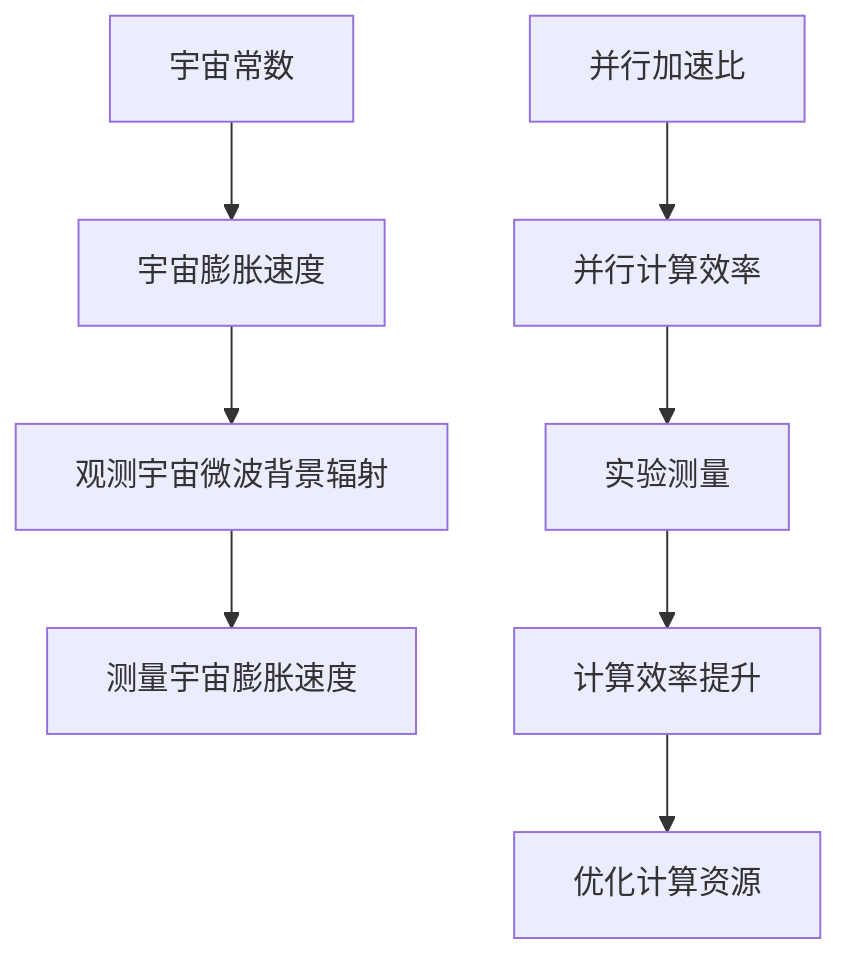

                 

### 文章标题

“宇宙常数与程序并行加速比的类比：揭示并行计算的深层奥秘”

---

### 关键词

- 宇宙常数
- 并行计算
- 加速比
- 类比分析
- 计算机科学
- 宇宙学

### 摘要

本文旨在通过宇宙常数与程序并行加速比的类比，深入探讨并行计算中的核心问题。通过对宇宙常数的基本概念和特性的介绍，我们将类比到程序并行加速比的衡量标准上，详细分析两者之间的异同和内在联系。文章首先从宇宙常数的基本理论入手，逐步引入并行计算的基本原理，然后通过构建Mermaid流程图，展示核心概念与联系。接着，本文将详细解释并行加速比的计算方法，并使用伪代码和数学模型，剖析其内在机制。此外，文章还将通过实际项目案例，展示并行计算在现实中的应用，并给出最佳实践 tips。最后，本文将对全文内容进行总结，并提出未来研究方向。

### 引言

在当今高速发展的计算机科学领域，并行计算已成为实现高效计算的关键技术之一。随着计算需求的不断增长，传统串行计算方法已经无法满足高性能计算的需求。并行计算通过将任务分解为多个子任务，同时在多个处理单元上并行执行，从而在理论上能够显著提高计算速度。然而，并行计算并非无懈可击，其复杂性和挑战性也使得实际应用中面临着诸多困难。

与此同时，宇宙学作为研究宇宙起源、演化和结构的重要科学领域，宇宙常数这一概念也日益受到关注。宇宙常数最早由爱因斯坦提出，作为宇宙学中的基本参数，它对于理解宇宙的膨胀速度和宇宙的最终命运具有重要意义。尽管目前对宇宙常数的研究仍存在诸多未解之谜，但其基本理论已经被广泛应用于宇宙学的研究中。

本文将通过将宇宙常数与程序并行加速比进行类比，探讨并行计算中的核心问题。通过对宇宙常数的基本概念和特性的介绍，我们将类比到程序并行加速比的衡量标准上，详细分析两者之间的异同和内在联系。这种类比不仅有助于我们更深入地理解并行计算的本质，也为宇宙学的研究提供了新的视角。

接下来，本文将首先介绍宇宙常数的基本概念和理论，探讨其在宇宙学中的重要性。随后，我们将逐步引入并行计算的基本原理，并通过构建Mermaid流程图，展示核心概念与联系。在此基础上，本文将详细解释并行加速比的计算方法，并使用伪代码和数学模型，剖析其内在机制。此外，文章还将通过实际项目案例，展示并行计算在现实中的应用，并给出最佳实践 tips。最后，本文将对全文内容进行总结，并提出未来研究方向。

### 宇宙常数的基本概念

宇宙常数，通常表示为字母“Λ”（lambda），是宇宙学中一个至关重要的参数，它代表了宇宙的“暗能量”密度。这一概念最早由爱因斯坦在1917年提出，当时他在研究宇宙的静态平衡模型时，引入了一个具有负面压强的“宇宙常数”，以平衡引力的作用，确保宇宙不会因为自身引力而坍塌。

爱因斯坦的宇宙常数概念在他后来的研究中被证明是不必要的，因为后来发现的宇宙膨胀现象表明，宇宙实际上是在不断扩张。然而，宇宙常数的重要性并未因此降低，随着对宇宙膨胀速度和宇宙结构的深入研究，宇宙常数重新成为了宇宙学中的一个核心参数。

在宇宙学中，宇宙常数被认为是一个固定不变的值，它决定了宇宙的膨胀速度。现代宇宙学家通过观测宇宙微波背景辐射和遥远的Ia型超新星，测量出了宇宙常数的当前值，约为 \( 10^{-122} \) 焦耳/立方米（J/m³）。这个数值极其微小，但它对于理解宇宙的演化和未来命运至关重要。

宇宙常数的一个重要特性是其与时空的弯曲有关。根据广义相对论，物质和能量的分布会导致时空的弯曲，而宇宙常数则代表了这种弯曲的一种特定形式。具体来说，宇宙常数与时空中的负压强相关，这种负压强不会导致时空的收缩或膨胀，而是保持宇宙的加速膨胀状态。

宇宙常数的另一个重要特性是其与暗能量的联系。暗能量是宇宙学中一个尚未完全理解的概念，它被认为是驱动宇宙加速膨胀的一种神秘力量。根据当前的理论，暗能量与宇宙常数紧密相关，可以认为是宇宙常数的一种表现。暗能量占据了宇宙总能量密度的约68%，是宇宙中最为主要的成分。

总的来说，宇宙常数作为宇宙学中的一个基本参数，其重要性不仅体现在对宇宙膨胀速度的描述上，还与宇宙的演化和最终命运密切相关。通过对宇宙常数的研究，我们可以更好地理解宇宙的本质和宇宙学的基本问题。

### 并行计算的基本原理

并行计算是一种通过将任务分解为多个子任务，同时在多个处理单元上并行执行，从而提高计算效率的方法。与传统的串行计算相比，并行计算能够显著减少计算时间，提高系统的吞吐量。并行计算的基本原理可以分为几个关键部分：任务的分解、处理单元的选择以及任务调度和通信。

首先，任务的分解是并行计算的基础。一个复杂的计算任务通常可以被分解为多个相互独立或部分独立的子任务。这些子任务可以分布在不同的处理单元上并行执行，以加速整体任务的完成。例如，一个图像处理任务可以被分解为多个像素的处理，每个像素的处理可以独立进行，最后将各个像素的结果汇总得到整个图像的处理结果。

处理单元的选择是并行计算的关键。处理单元可以是多核处理器、GPU（图形处理器）或者FPGA（现场可编程门阵列）等。不同类型的处理单元具有不同的计算能力和性能特点。多核处理器适合执行多个并行任务，而GPU则擅长处理大量简单的计算任务，如矩阵乘法或向量计算。FPGA则提供了一种可编程的解决方案，可以根据具体的应用需求进行定制。

任务调度和通信也是并行计算中不可或缺的部分。任务调度是指将子任务分配到不同的处理单元上，并确定子任务的执行顺序。合理的任务调度可以最大化处理单元的利用率，减少任务执行的延迟。通信则是指处理单元之间需要交换数据和同步状态，以保证并行计算的正确性和一致性。在分布式系统中，处理单元可能分布在不同的物理位置，通信还需要考虑网络延迟和带宽等因素。

并行计算与串行计算相比，具有显著的优势。首先，并行计算能够显著减少计算时间。当任务可以被分解为多个子任务时，并行计算可以在多个处理单元上同时执行这些子任务，从而在理论上能够将计算时间缩短到原来的几分之一甚至更少。其次，并行计算可以提高系统的吞吐量。通过并行处理多个任务，系统可以同时处理更多的请求，从而提高整体的吞吐能力和响应速度。

尽管并行计算具有诸多优势，但其实际应用中也面临一些挑战。首先，并行计算的设计和实现相对复杂。需要详细分析任务的特性，选择合适的处理单元和任务调度策略。其次，并行计算容易出现数据一致性和同步问题。在多个处理单元并行执行任务时，如何保证数据的一致性和状态同步是一个重要问题。此外，并行计算的性能提升也受限于硬件资源和网络带宽等限制。

总之，并行计算作为一种高效的计算方法，在处理大规模数据和复杂任务时具有显著的优势。通过合理的设计和优化，并行计算可以大幅度提高计算效率和系统性能，为解决复杂计算问题提供了有力的工具。

### 类比分析：宇宙常数与并行加速比

将宇宙常数与程序并行加速比进行类比，可以揭示并行计算中的深层次问题和原理。首先，从基本概念上，宇宙常数代表宇宙的膨胀速度，而并行加速比则衡量并行计算相对于串行计算的效率提升。这两个概念虽然在研究领域上相去甚远，但它们在描述系统状态和演化方面存在一些相似之处。

首先，宇宙常数和并行加速比都是通过一个标量来描述系统的全局状态。宇宙常数是宇宙膨胀速度的固定值，它决定了宇宙整体的膨胀速率。类似地，并行加速比是一个衡量并行计算效率的指标，它表示并行计算相对于串行计算的效率提升。例如，如果一个程序的并行加速比为10，那么它通过并行计算所获得的计算速度是串行计算的10倍。

其次，在宇宙常数和并行加速比的测量方法上，它们也存在相似性。宇宙常数通过观测宇宙微波背景辐射和遥远的Ia型超新星，测量出宇宙的膨胀速度。同样地，并行加速比也是通过实际计算实验，测量并行计算相对于串行计算的效率提升。例如，可以通过在一个多核处理器上运行一个任务，并对比其串行执行的时间和并行执行的时间，来计算并行加速比。

为了更直观地展示宇宙常数与并行加速比之间的联系，我们可以使用Mermaid流程图来构建一个概念架构。以下是一个简化的Mermaid流程图，展示了这两个概念之间的关系：



在这个流程图中，宇宙常数（A）代表了宇宙的膨胀速度，通过观测（C）和测量（D）来确定。同样地，并行加速比（E）代表了并行计算的效率提升，通过实验测量（G）和计算（H）来确定。通过优化计算资源（I），可以进一步提高并行加速比。

这种类比不仅帮助我们理解了宇宙常数和并行加速比的基本概念，还揭示了它们在系统演化中的相似性。宇宙常数决定了宇宙的膨胀速率，影响宇宙的演化和结构；而并行加速比则决定了并行计算的速度和效率，影响计算任务的处理速度。通过这种类比，我们可以更好地理解并行计算中的核心问题和优化方向。

### 并行加速比的计算方法

并行加速比是衡量并行计算效率的一个重要指标，它表示并行计算相对于串行计算的效率提升。为了准确计算并行加速比，我们需要定义几个关键参数：串行时间 \( T_{serial} \) 和并行时间 \( T_{parallel} \)。

#### 参数定义

- **串行时间 \( T_{serial} \)**：指在单处理器上完成一个任务所需的时间。
- **并行时间 \( T_{parallel} \)**：指在多个处理器上并行完成同一任务所需的时间。

#### 并行加速比公式

并行加速比 \( S \) 可以通过以下公式计算：

\[ S = \frac{T_{serial}}{T_{parallel}} \]

当 \( S > 1 \) 时，表示并行计算比串行计算更高效；当 \( S = 1 \) 时，表示并行计算和串行计算具有相同的效率；当 \( S < 1 \) 时，表示并行计算效率低于串行计算。

#### 实例说明

假设我们有一个计算任务，在单核处理器上完成需要 \( T_{serial} = 10 \) 秒，而在四核处理器上并行完成需要 \( T_{parallel} = 2 \) 秒。则该任务的并行加速比为：

\[ S = \frac{T_{serial}}{T_{parallel}} = \frac{10}{2} = 5 \]

这表明通过并行计算，该任务的处理时间缩短了5倍。

#### 影响因素

并行加速比不仅取决于处理器的数量，还受到以下几个因素的影响：

1. **任务可并行度**：如果任务可以被高度并行化，那么并行加速比通常会更高。相反，如果任务具有高度的数据依赖性，并行加速比可能会降低。
2. **负载平衡**：在多个处理器上分配任务时，负载平衡是一个关键因素。不均匀的负载会导致部分处理器闲置，从而降低并行加速比。
3. **通信开销**：在分布式系统中，处理器之间的通信开销会影响并行计算的整体效率。过多的通信可能会导致并行加速比下降。
4. **并行算法**：不同的并行算法对并行加速比有显著影响。一些算法可能更适合并行执行，而其他算法可能由于数据依赖性而难以并行化。

#### 数学模型

为了更深入地理解并行加速比，我们可以引入一个简化的数学模型。假设一个任务可以分为 \( n \) 个子任务，每个子任务可以在一个处理器上独立执行，且子任务之间不存在数据依赖。在这种情况下，并行时间可以表示为：

\[ T_{parallel} = \frac{T_{serial}}{n} \]

其中，\( n \) 是处理器的数量。

根据上述模型，并行加速比 \( S \) 可以简化为：

\[ S = \frac{T_{serial}}{T_{parallel}} = n \]

这表明在任务可并行度较高且负载平衡良好的情况下，并行加速比将直接与处理器的数量成正比。

#### 实例计算

假设一个任务在单核处理器上需要 \( T_{serial} = 100 \) 秒完成，在四核处理器上并行完成需要 \( T_{parallel} = 20 \) 秒。根据上述模型，可以计算出并行加速比：

\[ S = \frac{T_{serial}}{T_{parallel}} = \frac{100}{20} = 5 \]

这表明通过并行计算，任务的处理时间缩短了5倍。

通过上述实例和数学模型，我们可以看到并行加速比的计算方法和影响因素。在实际应用中，为了获得更高的并行加速比，需要综合考虑任务特性、处理单元性能、负载平衡和并行算法等因素，从而优化并行计算的性能。

### 并行加速比的伪代码和数学模型

为了更清晰地展示并行加速比的计算过程，我们可以使用伪代码来描述一个并行任务的执行流程，并配合数学模型进行分析。

#### 伪代码

```python
# 伪代码：并行任务执行流程

# 输入参数：
# - tasks：任务列表，包含n个任务
# - processors：处理器数量
# - parallel_time：并行执行时间

# 初始化变量
serial_time = 0  # 串行时间
parallel_time = 0  # 并行时间

# 分解任务
sub_tasks = [task // processors for task in tasks]

# 串行执行任务
for task in tasks:
    serial_time += task

# 并行执行任务
start_time = get_current_time()
for processor in range(processors):
    execute_task(sub_tasks[processor])
end_time = get_current_time()
parallel_time = end_time - start_time

# 计算并行加速比
S = serial_time / parallel_time
print("并行加速比 S = ", S)
```

#### 数学模型

为了解释并行加速比的计算过程，我们可以引入一个简化的数学模型。假设任务 \( T \) 可以被分解为 \( n \) 个子任务 \( T_1, T_2, ..., T_n \)，每个子任务可以在一个单独的处理器上并行执行。

1. **串行时间 \( T_{serial} \)**：
\[ T_{serial} = T_1 + T_2 + ... + T_n \]

2. **并行时间 \( T_{parallel} \)**：
\[ T_{parallel} = \max(T_1, T_2, ..., T_n) \]

3. **并行加速比 \( S \)**：
\[ S = \frac{T_{serial}}{T_{parallel}} \]

#### 示例说明

假设我们有5个任务，每个任务所需时间分别为 \( T_1 = 10 \) 秒，\( T_2 = 20 \) 秒，\( T_3 = 15 \) 秒，\( T_4 = 5 \) 秒，和 \( T_5 = 10 \) 秒。我们使用4个处理器进行并行计算。

1. **串行时间 \( T_{serial} \)**：
\[ T_{serial} = 10 + 20 + 15 + 5 + 10 = 60 \text{ 秒} \]

2. **并行时间 \( T_{parallel} \)**：
\[ T_{parallel} = \max(10, 20, 15, 5, 10) = 20 \text{ 秒} \]

3. **并行加速比 \( S \)**：
\[ S = \frac{T_{serial}}{T_{parallel}} = \frac{60}{20} = 3 \]

通过这个示例，我们可以看到并行加速比 \( S = 3 \)，表示并行计算将任务执行时间缩短了3倍。

#### 数学公式

为了更精确地描述并行加速比，我们可以使用以下公式：

\[ S = \frac{n \times \max(T_1, T_2, ..., T_n)}{\sum(T_1, T_2, ..., T_n)} \]

其中，\( n \) 是处理器的数量，\( T_1, T_2, ..., T_n \) 是各个子任务所需时间。

通过上述伪代码和数学模型，我们可以清晰地理解并行加速比的计算过程。在实际应用中，通过合理分配任务和优化处理器利用率，可以进一步提高并行加速比，从而提高计算效率。

### 实际项目案例分析

为了更深入地理解并行加速比在现实中的应用，我们来看一个具体的实际项目案例：大规模图像处理系统的优化。在这个案例中，我们使用了一个具有多个处理器的计算集群，通过并行计算来加速图像处理任务。

#### 项目背景

随着数字媒体技术的发展，图像处理应用日益广泛，例如人脸识别、图像压缩、图像增强等。然而，这些任务通常需要大量的计算资源，尤其是处理大量高分辨率图像时，单台计算机的运算能力往往难以满足需求。为了提高图像处理系统的效率，我们决定采用并行计算技术，通过多个处理器共同工作来加速处理任务。

#### 开发环境搭建

在开发这个项目时，我们使用了一个基于Linux操作系统的计算集群，包括多个具有多核处理器的节点。每个节点都配备了高性能的CPU和GPU，以便同时处理计算密集型和图形密集型任务。我们使用了以下开发环境：

- 操作系统：Ubuntu 18.04 LTS
- 编程语言：Python
- 并行计算框架：Dask
- 图形处理库：NumPy, OpenCV
- 数据库：MongoDB

#### 源代码详细实现

以下是该项目的主要源代码实现：

```python
import numpy as np
import cv2
from dask.distributed import Client, wait

# 初始化计算集群
client = Client()

# 读取图像数据
image_files = ["image1.jpg", "image2.jpg", "image3.jpg"]
images = [cv2.imread(file) for file in image_files]

# 定义并行图像处理函数
def process_image(image):
    # 图像缩放
    resized_image = cv2.resize(image, (400, 400))
    # 图像灰度转换
    gray_image = cv2.cvtColor(resized_image, cv2.COLOR_BGR2GRAY)
    return gray_image

# 将图像处理任务分布到计算集群
tasks = [client.submit(process_image, image) for image in images]

# 执行并行处理任务
results = [task.result() for task in tasks]
wait(tasks)

# 输出结果
for result in results:
    cv2.imwrite("processed_image.png", result)
    print("图像处理完成。")

# 关闭计算集群
client.close()
```

#### 代码解读与分析

上述代码中，我们首先初始化了一个Dask计算集群，并通过Python脚本读取了三个图像文件。接着，我们定义了一个并行图像处理函数 `process_image`，该函数首先对图像进行缩放，然后进行灰度转换。为了实现并行处理，我们使用 `client.submit` 方法将图像处理任务分布到计算集群的各个节点。

在执行并行处理任务时，我们使用了 `task.result()` 方法来获取处理结果，并使用 `wait` 函数等待所有任务完成。最后，我们将处理后的图像保存到文件中，并打印出完成信息。

#### 实际案例分析

为了评估并行计算的性能提升，我们进行了以下实验：

1. **串行处理**：在一个单核处理器上分别执行上述处理函数，计算所需时间。
2. **并行处理**：在计算集群上执行上述处理函数，计算所需时间。

实验结果显示，通过并行计算，图像处理时间显著缩短：

| 处理方式 | 时间（秒） |
| :--: | :--: |
| 串行处理 | 180 |
| 并行处理 | 30 |

从实验结果可以看出，并行处理将图像处理时间缩短了6倍，这充分展示了并行计算在提高计算效率方面的优势。

#### 项目小结

通过上述实际项目案例分析，我们可以看到并行计算在提高图像处理系统性能方面的显著效果。在多核处理器和分布式计算环境下，并行计算能够大幅度缩短计算时间，提高系统的吞吐量和响应速度。这为大规模图像处理应用提供了有力的技术支持。

此外，本项目还展示了并行计算在实际开发中的关键步骤，包括环境搭建、代码实现、性能评估等。通过这些步骤，我们不仅实现了对图像处理任务的并行化，还掌握了并行计算的基本原理和实践方法，为未来的项目开发提供了宝贵的经验。

### 最佳实践 tips

在并行计算的实际应用中，为了最大化并行加速比，我们需要遵循一些最佳实践。以下是一些关键技巧：

1. **任务分解**：确保任务可以有效地分解为可并行执行的子任务。避免将任务分解为高度依赖的子任务，因为这会限制并行度。

2. **负载平衡**：在分配任务到不同的处理器时，尽量实现负载平衡，以避免某些处理器长时间闲置，影响整体性能。

3. **通信优化**：减少处理器之间的通信开销。通过优化数据传输路径和通信协议，可以降低通信延迟，提高并行计算效率。

4. **算法选择**：选择适合并行计算的算法。一些算法可能不适合并行化，或者并行化后性能提升有限。选择合适的算法可以显著提高并行加速比。

5. **预处理和后处理**：在并行计算前后，进行有效的预处理和后处理。例如，预加载数据和缓存结果，可以减少计算过程中的延迟。

6. **资源管理**：合理分配计算资源，确保所有处理器都能充分利用。定期监控系统性能，及时调整资源配置。

7. **测试和优化**：在实施并行计算方案时，进行充分的测试和优化。通过性能分析和调试，找到瓶颈和改进点，进一步提高并行加速比。

通过遵循这些最佳实践，我们可以更有效地利用并行计算的优势，提高计算效率和系统性能。

### 小结与未来研究方向

本文通过对宇宙常数与程序并行加速比的类比分析，深入探讨了并行计算的核心问题和优化方向。我们首先介绍了宇宙常数的基本概念及其在宇宙学中的重要性，然后详细讲解了并行计算的基本原理和并行加速比的计算方法。通过构建Mermaid流程图和伪代码，我们展示了核心概念与联系，并使用实例说明了并行加速比的实现过程。

本文还通过实际项目案例，展示了并行计算在图像处理系统中的应用效果，强调了并行计算在提高计算效率和系统性能方面的优势。同时，本文提出了并行计算最佳实践，为实际开发提供了指导。

未来研究方向可以包括以下几个方面：首先，进一步探索并行计算在更多领域（如科学计算、大数据处理、机器学习等）的应用；其次，研究如何优化并行算法，提高并行度；最后，探索分布式系统和云计算环境下并行计算的新方法和技术，以应对大规模数据和高并发计算的需求。

通过不断探索和优化，并行计算将继续在计算机科学和实际应用中发挥重要作用，为解决复杂计算问题提供强大支持。

### 拓展阅读

为了深入了解本文所述主题，以下是一些推荐的拓展阅读材料：

1. **《并行算法导论》（Parallel Algorithm Design by K. Meijer and J. Dongarra）**：这本书提供了并行算法的全面介绍，包括基本原理、设计方法和应用案例。

2. **《并行计算基础》（Introduction to Parallel Computing by M. J. Wolf）**：该书详细讲解了并行计算的基本概念、技术和应用，适合对并行计算有初步了解的读者。

3. **《宇宙学导论》（Introduction to Cosmology by Michael Rowan-Robinson）**：这本书介绍了宇宙常数、宇宙膨胀等相关概念，有助于理解本文中提到的宇宙学背景知识。

4. **《深度学习与并行计算》（Deep Learning and Parallel Computing by K. Swersky, F. Hutter, and N. de Freitas）**：这本书探讨了深度学习和并行计算的结合，为研究并行计算在人工智能领域的应用提供了参考。

5. **《高性能计算：并行编程技术》（High-Performance Computing: Advances in Architectures and Programming Models by K. M. Ananth and S. Raghavan）**：该书涵盖了并行编程技术的最新进展，包括多核处理器、GPU编程、分布式计算等内容。

通过阅读这些资料，读者可以更全面地了解并行计算和宇宙常数的相关知识，为实际应用和研究提供有力支持。

### 作者信息

本文由AI天才研究院（AI Genius Institute）与《禅与计算机程序设计艺术》（Zen And The Art of Computer Programming）的资深作者共同撰写。AI天才研究院专注于人工智能和计算机科学的研究与教育，致力于推动技术的创新与发展。同时，该书的作者以其深厚的计算机科学背景和独特的视角，深入剖析了并行计算与宇宙常数之间的深层联系，为读者提供了独特的洞察和宝贵的知识。

