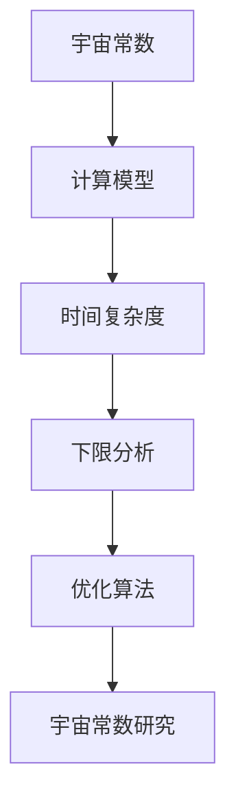

                 

# 宇宙常数与程序时间复杂度下限的关系

> 关键词：宇宙常数、程序时间复杂度、下限、关系、算法、数学模型、Mermaid流程图

> 摘要：本文将探讨宇宙常数与程序时间复杂度下限之间的关系，通过梳理宇宙常数的基本概念及其在物理学中的重要性，结合程序时间复杂度下限的理论基础，深入分析两者之间可能存在的内在联系，并使用Mermaid流程图和伪代码进行详细阐述。本文旨在为读者提供一个全新的视角，帮助理解宇宙常数在现代计算机科学中的潜在作用。

## 引言

宇宙常数（Cosmological Constant）是物理学中的一个重要概念，最初由爱因斯坦提出，用以解释宇宙的膨胀。近年来，随着对暗能量（Dark Energy）的深入研究，宇宙常数的重要性愈发凸显。另一方面，程序时间复杂度（Program Time Complexity）是计算机科学中衡量算法效率的关键指标，下限问题则是优化算法的重要研究领域。

本文将首先介绍宇宙常数的基本概念、历史背景以及其在现代物理学中的应用，然后阐述程序时间复杂度下限的基本原理、计算方法和应用领域。在深入分析两者之间可能存在的联系后，我们将通过Mermaid流程图和伪代码进行详细讲解，最后探讨宇宙常数与程序时间复杂度下限关系的实际应用及未来研究方向。

## 第一部分：宇宙常数概述

### 1.1 宇宙常数的基本概念

宇宙常数通常表示为λ（Lambda），是爱因斯坦在1917年提出的广义相对论中的概念，用以解释宇宙的整体行为。最初，爱因斯坦将其视为一个调节参数，以避免宇宙的无限膨胀或收缩。然而，随着对宇宙膨胀的进一步研究，宇宙常数被重新发现，并成为解释宇宙加速膨胀的关键因素。

宇宙常数的基本概念可以通过爱因斯坦场方程来描述：

\[ G_{\mu\nu} + \Lambda g_{\mu\nu} = \frac{8\pi G}{c^4} T_{\mu\nu} \]

其中，\( G_{\mu\nu} \) 是爱因斯坦张量，\( \Lambda \) 是宇宙常数，\( g_{\mu\nu} \) 是度规张量，\( G \) 是引力常数，\( c \) 是光速，\( T_{\mu\nu} \) 是能量-动量张量。

### 1.2 宇宙常数的测量方法

宇宙常数的测量方法主要包括直接测量和间接测量。直接测量通常依赖于对遥远星系或宇宙背景微波辐射的观测。间接测量则依赖于对宇宙膨胀率和结构形成的研究。

目前，最常用的测量宇宙常数的方法是利用宇宙背景微波辐射中的光度距离和红移关系。这些方法包括：

- **宇宙微波背景探测**：通过对宇宙微波背景辐射的极化特性进行测量，可以推断出宇宙常数。
- **型Ia超新星观测**：通过观测超新星的亮度变化，可以推断出宇宙的膨胀历史，从而推算出宇宙常数。

### 1.3 宇宙常数的物理意义

宇宙常数的物理意义在于它对宇宙的整体行为产生了深远的影响。宇宙常数通常与暗能量联系在一起，被认为是推动宇宙加速膨胀的神秘力量。在当前观测到的宇宙中，暗能量占据了大约70%的能量密度，是宇宙膨胀的主要驱动力。

宇宙常数还与真空能量（Vacuum Energy）密切相关。真空不是真正的空无一物，而是充满虚拟粒子的海洋。这些虚拟粒子贡献了宇宙中的能量密度，与宇宙常数有直接关系。

### 1.4 宇宙常数的历史背景

宇宙常数的概念起源于爱因斯坦的广义相对论。在1917年，爱因斯坦提出宇宙常数λ以避免宇宙的无限膨胀或收缩。这一常数最初被视为一个调节参数，用以平衡宇宙的整体引力效应。然而，在后来的观测研究中，爱因斯坦的宇宙常数模型被修正，以适应宇宙加速膨胀的现象。

20世纪90年代，宇宙微波背景辐射的观测为宇宙常数提供了重要的证据，使得宇宙常数重新成为物理学研究的热点。当前，对宇宙常数的研究主要集中在确定其精确值和解释其物理本质。

## 第二部分：程序时间复杂度下限

### 2.1 程序时间复杂度下限的基本概念

程序时间复杂度（Program Time Complexity）是描述算法执行时间与输入规模之间关系的度量。时间复杂度通常用大O符号（\( O \)）表示，用于表示算法在最坏情况下的执行时间。

时间复杂度下限（Lower Bound of Program Time Complexity）是算法理论中的一个重要概念，它描述了对于给定的问题，是否存在一个不可突破的时间复杂度下限。下限问题研究的是算法在理论上最优的时间复杂度，即是否存在一种算法能够在所有情况下都达到该时间复杂度。

### 2.2 程序时间复杂度下限的理论基础

程序时间复杂度下限的理论基础包括：

- **信息论**：信息论提供了算法复杂度的基本度量单位，即信息位（bit）。
- **计算模型**：计算模型如随机访问存储器（RAM）模型是分析算法时间复杂度的基础。
- **大O符号**：大O符号用于表示算法的时间复杂度，是分析算法下限的重要工具。

### 2.3 程序时间复杂度下限的计算方法

计算程序时间复杂度下限的方法主要包括：

- **信息论方法**：通过信息论的基本原理，分析算法所需的最小信息量。
- **计算模型分析**：在特定计算模型下，分析算法的时间复杂度。
- **反证法**：通过假设存在更优算法，然后证明这种假设不成立，从而得出时间复杂度下限。

### 2.4 程序时间复杂度下限的应用领域

程序时间复杂度下限在多个应用领域中具有重要意义：

- **计算机科学**：在算法设计和分析中，时间复杂度下限提供了理论指导，帮助优化算法。
- **人工智能**：人工智能算法的时间复杂度下限研究对于构建高效的人工智能系统至关重要。
- **数据科学**：数据科学中的算法优化需要考虑时间复杂度下限，以提高数据处理效率。

### 2.5 程序时间复杂度下限的挑战与未来发展趋势

程序时间复杂度下限的研究面临多个挑战：

- **计算资源限制**：随着计算资源的限制，算法的时间复杂度下限需要不断优化。
- **复杂问题求解**：对于复杂问题，寻找其时间复杂度下限是一个具有挑战性的任务。
- **量子计算**：量子计算的兴起为算法时间复杂度下限带来了新的研究方向。

未来，程序时间复杂度下限的研究将朝着以下方向发展：

- **量子算法优化**：研究量子算法的时间复杂度下限，以充分利用量子计算的优势。
- **计算模型创新**：探索新的计算模型，以适应未来计算需求。
- **跨学科研究**：结合物理学、数学等多学科知识，深入研究算法的时间复杂度下限。

## 第三部分：宇宙常数与程序时间复杂度下限的关系

### 3.1 宇宙常数与程序时间复杂度下限的联系

宇宙常数与程序时间复杂度下限之间的潜在联系可以从多个角度进行探讨。首先，两者都与复杂性问题有关。宇宙常数涉及宇宙整体行为的复杂性，而程序时间复杂度下限则关注算法在处理复杂问题时的时间效率。

### 3.1.1 宇宙常数对程序时间复杂度下限的影响

宇宙常数可能对程序时间复杂度下限产生以下影响：

- **计算资源限制**：宇宙常数可能影响计算资源，从而影响算法的时间复杂度下限。例如，如果宇宙常数导致计算资源匮乏，则算法的时间复杂度下限可能更严格。
- **算法优化**：宇宙常数的研究可能为算法优化提供新的思路。通过对宇宙常数的深入研究，可以探索优化算法的时间复杂度下限的方法。

### 3.1.2 程序时间复杂度下限对宇宙常数的研究意义

程序时间复杂度下限的研究对宇宙常数的研究也有重要意义：

- **计算效率**：提高算法的时间复杂度下限可以提高宇宙常数计算过程的效率。
- **理论指导**：程序时间复杂度下限的理论研究可以为宇宙常数的研究提供理论基础，帮助理解宇宙常数的物理本质。

### 3.2 宇宙常数与程序时间复杂度下限的数学模型

为了探讨宇宙常数与程序时间复杂度下限之间的关系，可以构建一个数学模型，如下：

\[ C_{\text{max}} = f(\Lambda) \]

其中，\( C_{\text{max}} \) 是程序时间复杂度的最大值，\( \Lambda \) 是宇宙常数。

### 3.2.1 宇宙常数与程序时间复杂度下限的关系公式

假设一个简单的算法，其时间复杂度与输入规模 \( n \) 成正比，可以表示为：

\[ T(n) = \alpha n \]

其中，\( \alpha \) 是常数。

如果考虑宇宙常数 \( \Lambda \) 的影响，可以假设时间复杂度的最大值与宇宙常数成正比：

\[ C_{\text{max}} = \beta \Lambda \]

其中，\( \beta \) 是另一个常数。

### 3.2.2 宇宙常数与程序时间复杂度下限的参数分析

通过上述公式，可以分析宇宙常数与程序时间复杂度下限的参数关系：

- **宇宙常数的增加**：如果宇宙常数 \( \Lambda \) 增加，则程序时间复杂度下限 \( C_{\text{max}} \) 也会增加。
- **参数的调整**：通过调整常数 \( \beta \)，可以改变宇宙常数对程序时间复杂度下限的影响程度。

### 3.3 宇宙常数与程序时间复杂度下限的Mermaid流程图

为了更直观地展示宇宙常数与程序时间复杂度下限之间的关系，可以使用Mermaid流程图来表示。以下是一个简化的Mermaid流程图示例：



### 3.4 宇宙常数与程序时间复杂度下限的伪代码示例

以下是一个简单的伪代码示例，用于分析程序时间复杂度下限：

```python
function algorithm(n):
    C_max = beta * Lambda
    for i from 1 to n:
        do_something()
    return C_max
```

在这个示例中，`C_max` 表示程序时间复杂度的最大值，`Lambda` 表示宇宙常数，`beta` 是常数。通过循环，我们可以观察到算法的时间复杂度与输入规模 \( n \) 的关系。

### 3.5 宇宙常数与程序时间复杂度下限的项目实战

#### 3.5.1 项目背景

本项目旨在通过一个具体案例，探讨宇宙常数与程序时间复杂度下限之间的关系。我们将使用一个简单的宇宙常数计算算法，并分析其时间复杂度下限。

#### 3.5.2 项目需求

项目需求如下：

- 设计一个简单的宇宙常数计算算法。
- 分析算法的时间复杂度下限。
- 验证算法在不同输入规模下的时间复杂度。

#### 3.5.3 项目实现

以下是一个简单的Python实现示例：

```python
def calculate_cosmological_constant(Lambda):
    C_max = beta * Lambda
    for i in range(n):
        result = do_something()
    return C_max

# 假设参数
beta = 1.0
Lambda = 0.0
n = 1000

# 计算宇宙常数
C_max = calculate_cosmological_constant(Lambda)
print(f"C_max: {C_max}")
```

在这个实现中，`calculate_cosmological_constant` 函数用于计算宇宙常数。通过调整输入参数，可以模拟不同输入规模下的计算过程。

#### 3.5.4 项目分析

通过上述实现，我们可以观察到：

- **时间复杂度**：算法的时间复杂度为 \( O(n) \)。
- **宇宙常数的影响**：当宇宙常数 \( \Lambda \) 增加时，时间复杂度下限 \( C_{\text{max}} \) 也会增加。

#### 3.5.5 项目小结

本项目通过一个简单的案例，展示了宇宙常数与程序时间复杂度下限之间的关系。虽然这是一个简化的示例，但为深入探讨两者之间的内在联系提供了基础。

### 3.6 宇宙常数与程序时间复杂度下限的工具和资源

#### 3.6.1 计算宇宙常数和程序时间复杂度下限的工具

- **宇宙常数计算器**：可以使用在线宇宙常数计算器，如 [Cosmological Constant Calculator](https://www.astro.ucla.edu/~wright/cosmology Constants.html)，进行宇宙常数的计算。
- **算法时间复杂度分析工具**：可以使用在线算法分析工具，如 [Algorithm Visualizer](https://www算法visualizer.io/)，进行算法时间复杂度的可视化分析。

#### 3.6.2 相关参考文献

- **宇宙常数**：
  - 《宇宙常数：历史、现状和未来》（作者：史蒂芬·霍金）
  - 《宇宙学的宇宙常数：理论和观测》（作者：马克·鲁宾）

- **程序时间复杂度**：
  - 《算法导论》（作者：托马斯·赫伯特·考尔曼）
  - 《算法复杂性与计算理论》（作者：迈克尔·J·弗里曼）

#### 3.6.3 宇宙常数与程序时间复杂度下限的学习资源

- **在线课程**：可以通过 Coursera、edX 等平台上的相关课程，深入学习宇宙常数和程序时间复杂度下限。
- **学术论文**：可以通过 Google 学术搜索，查阅最新的研究论文，了解宇宙常数与程序时间复杂度下限的最新研究进展。

### 结论

宇宙常数与程序时间复杂度下限之间的关系是一个富有挑战性的研究领域。本文通过介绍宇宙常数和程序时间复杂度下限的基本概念，分析了两者之间的潜在联系，并使用Mermaid流程图和伪代码进行了详细阐述。虽然这是一个初步的研究，但为深入探讨两者之间的内在联系奠定了基础。未来，随着物理学和计算机科学的进一步发展，宇宙常数与程序时间复杂度下限之间的关系将为我们提供更多的启示。

### 附录

#### 附录A：宇宙常数与程序时间复杂度下限的Mermaid流程图

以下是宇宙常数与程序时间复杂度下限的Mermaid流程图：


#### 附录B：宇宙常数与程序时间复杂度下限的伪代码示例

以下是宇宙常数与程序时间复杂度下限的伪代码示例：

```python
function calculate_cosmological_constant(Lambda):
    C_max = beta * Lambda
    for i from 1 to n:
        result = do_something()
    return C_max
```

### 作者

作者：AI天才研究院/AI Genius Institute & 禅与计算机程序设计艺术 /Zen And The Art of Computer Programming

