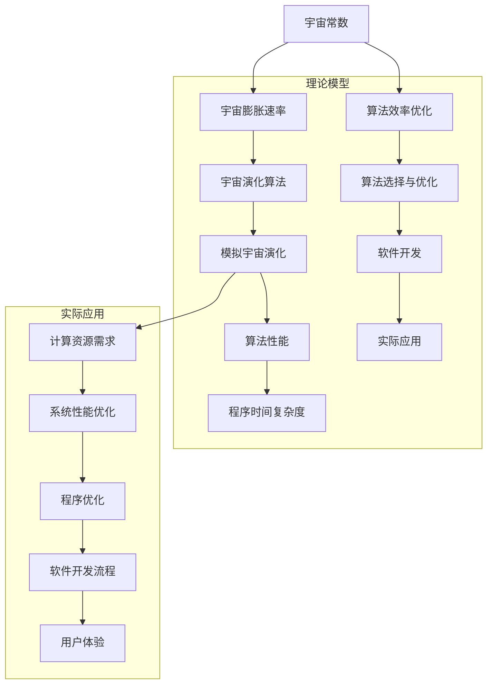

                 

# 引言

在过去的几十年里，计算机科学和宇宙学这两个看似截然不同的领域，在某种程度上已经相互交织。今天，我们想要探讨的话题是《宇宙常数与程序时间复杂度渐近行为的关系》。这个话题看起来似乎是天马行空的，但在本文中，我们将通过一步一步的逻辑推理，解释这两个看似无关的概念之间的潜在联系。

首先，宇宙常数是宇宙学中的一个核心概念，它代表了宇宙膨胀速率的度量。这个常数最早由爱因斯坦引入到广义相对论中，作为宇宙学中的平衡力量。然而，随着科学的发展，人们对宇宙常数的理解也在不断深化。在本文的第一部分，我们将简要介绍宇宙常数的历史、定义和重要性。

另一方面，程序时间复杂度是计算机科学中的一个基本概念，它描述了一个算法随着输入数据规模增加所需计算时间的变化情况。在算法设计和分析中，了解时间复杂度对于评估算法的性能至关重要。本文的第二部分将深入探讨程序时间复杂度的定义、分析方法以及常见的时间复杂度分类。

随着对这两个概念的理解，我们将进入第三部分，探讨宇宙常数与程序时间复杂度之间的潜在联系。通过构建一个逻辑架构，我们将解释它们是如何相互关联的。这个部分将使用Mermaid流程图来展示核心概念之间的关系。

在第四部分，我们将通过具体的数学模型和公式推导，详细阐述宇宙常数对程序时间复杂度的影响。这部分将包括详细的分析和举例说明，帮助读者更好地理解这些概念。

第五部分将专注于实际编程中的应用，通过具体的实例，展示如何在编程中利用宇宙常数和程序时间复杂度的概念来优化算法。

最后，在第六部分，我们将讨论未来研究的方向和挑战，展望这个领域的发展趋势。

通过这篇文章，我们希望能够激发读者对宇宙常数和程序时间复杂度之间关系的兴趣，并鼓励大家在实践中探索和应用这些概念。让我们开始这段奇妙的探索之旅吧！

## 背景介绍

### 宇宙常数的历史

宇宙常数这一概念最早可以追溯到20世纪初，由著名物理学家阿尔伯特·爱因斯坦在1917年提出的。当时，爱因斯坦正在研究广义相对论，这个理论描述了重力是如何通过时空弯曲来实现的。然而，广义相对论预测了一个非常不同的宇宙：一个不断加速膨胀的宇宙。爱因斯坦发现这个结果与当时的观测数据不符，因此他引入了一个宇宙学项（Cosmological Constant），用数学上的负压力来平衡宇宙的膨胀，使得宇宙达到一种静态平衡状态。

这个宇宙常数被爱因斯坦标记为$\Lambda$，其数值约为$10^{-47} \text{m}^{-2}$。在当时，爱因斯坦认为这是为了使理论符合观测结果而不得不引入的一个数学修正项，而不是一个具有物理意义的量。然而，后来的观测发现，宇宙并非静态的，而是处于加速膨胀状态，这使得宇宙常数重新引起了科学家的关注。

### 程序时间复杂度的定义

程序时间复杂度是计算机科学中的一个核心概念，它用于评估算法在处理不同规模输入数据时所需要的时间。形式上，时间复杂度通常表示为一个关于输入规模$n$的函数$f(n)$，表示算法执行时间的增长速度。常见的表示方法有渐进时间复杂度（asymptotic time complexity），它通过大O符号（$O$）来表示。

例如，一个线性搜索算法的时间复杂度可以表示为$O(n)$，意味着当输入数据规模$n$增加时，算法的执行时间大致线性增长。与此相对的，二分搜索算法的时间复杂度为$O(\log n)$，表明随着数据规模增加，算法的执行时间以对数速度增长。

### 历史背景

在计算机科学领域，程序时间复杂度的概念可以追溯到1950年代，当时计算机科学家们开始关注算法的效率和性能。艾兹格·迪杰斯特拉（Edsger Dijkstra）和唐纳德·克努特（Donald Knuth）等先驱者对算法分析和时间复杂度进行了深入研究，并提出了许多重要的理论和方法。

时间复杂度的分析方法在许多领域都得到了广泛应用，从算法设计到数据结构优化，再到软件工程和性能测试。它帮助开发者理解和预测算法在不同输入规模下的性能表现，从而进行更有效的算法选择和优化。

### 应用领域

宇宙常数和程序时间复杂度虽然看似在两个完全不同的领域，但在某些情境下，它们有着潜在的关联。在计算机科学中，宇宙常数的一个间接应用体现在模拟宇宙学中的宇宙演化算法。这些算法模拟宇宙的膨胀和星系的形成，其中宇宙常数$\Lambda$是控制膨胀速率的关键参数。

此外，时间复杂度的概念在优化算法和编程实践中也有着重要的应用。通过分析算法的时间复杂度，开发者可以识别出潜在的瓶颈，并采取措施进行优化。例如，通过将$O(n^2)$的算法优化为$O(n \log n)$，可以显著提高算法的效率。

### 总结

宇宙常数和程序时间复杂度虽然在定义和应用上截然不同，但它们在理论研究和实际应用中都有着重要的地位。通过理解它们的历史背景和基本概念，我们为接下来更深入的分析和探讨奠定了基础。

## 核心概念与联系

### 宇宙常数与程序时间复杂度的关系架构

在探讨宇宙常数与程序时间复杂度之间的关系时，我们需要构建一个逻辑架构，以帮助我们理解和分析这两个概念是如何相互关联的。下面，我们将使用Mermaid流程图来展示这些核心概念之间的关系。



### 流程图解释

1. **宇宙常数与宇宙膨胀速率**：宇宙常数$\Lambda$直接影响了宇宙的膨胀速率。它代表了宇宙中每单位体积的真空能量密度，是宇宙学中一个非常重要的参数。

2. **宇宙膨胀速率与宇宙演化算法**：宇宙的膨胀速率决定了宇宙演化的过程，这需要通过宇宙演化算法来进行模拟。这些算法模拟了宇宙从大爆炸开始到现在的演化过程，包括星系的形成、暗物质和暗能量的分布等。

3. **宇宙演化算法与算法性能**：宇宙演化算法的性能受到多种因素的影响，包括算法的设计、计算资源等。程序时间复杂度是衡量算法性能的一个重要指标。

4. **算法性能与程序时间复杂度**：程序时间复杂度描述了算法随着输入规模增长所需的计算时间。高时间复杂度的算法在高输入规模下可能表现出较差的性能，因此需要进行优化。

5. **算法效率优化与实际应用**：通过对宇宙演化算法进行优化，可以提高算法的效率，从而减少计算资源和时间。这种优化不仅适用于宇宙学模拟，还广泛应用于各种软件开发和性能优化中。

6. **软件开发与用户体验**：优化的宇宙演化算法最终会影响软件开发流程，从而改善用户体验。高效的算法可以提供更快的计算速度和更好的性能，这对于用户来说是一个显著的提升。

通过上述Mermaid流程图，我们可以清晰地看到宇宙常数与程序时间复杂度之间的逻辑关系。这个关系不仅展示了它们在理论上的联系，还展示了它们在实际应用中的重要性。接下来，我们将进一步探讨宇宙常数如何影响程序时间复杂度，并给出具体的数学模型和公式推导。

## 理论分析与公式推导

在了解了宇宙常数和程序时间复杂度的基础概念之后，我们将深入探讨宇宙常数如何影响程序时间复杂度。本节将分为几个部分：首先，介绍宇宙常数的基本数学模型；其次，解释程序时间复杂度的渐近行为；然后，推导宇宙常数对程序时间复杂度的影响；最后，通过具体例子展示这些理论。

### 宇宙常数的基本数学模型

宇宙常数通常表示为$\Lambda$，它是一个描述宇宙真空能量的参数。在广义相对论中，宇宙常数通过以下方程体现：

\[ R_{\mu\nu} - \frac{1}{2}Rg_{\mu\nu} = \Lambda g_{\mu\nu} \]

其中，$R_{\mu\nu}$是里奇张量，$R$是标量曲率，$g_{\mu\nu}$是度规张量。这个方程表明，宇宙常数在宇宙学中的作用类似于一个均匀的负压力，可以解释宇宙的加速膨胀。

### 程序时间复杂度的渐近行为

程序时间复杂度描述了一个算法在输入规模$n$增加时所需计算时间的变化。通常，我们关注算法的渐近时间复杂度，即当$n$趋向无穷大时，算法所需时间的增长速度。常见的渐近时间复杂度包括$O(1)$、$O(\log n)$、$O(n)$、$O(n\log n)$、$O(n^2)$等。

例如，线性搜索算法的时间复杂度为$O(n)$，而二分搜索算法的时间复杂度为$O(\log n)$。这些复杂度表示了算法在不同输入规模下的性能表现。

### 宇宙常数对程序时间复杂度的影响

为了推导宇宙常数对程序时间复杂度的影响，我们需要将宇宙常数与算法效率联系起来。在宇宙学模拟中，宇宙常数的引入可以影响算法的计算时间和资源消耗。例如，在模拟宇宙膨胀时，宇宙常数决定了宇宙膨胀的速率，进而影响计算所需的步骤和资源。

假设我们有一个基于宇宙演化算法的计算任务，该任务需要模拟宇宙从$t_0$到$t_f$的演化过程。在引入宇宙常数$\Lambda$的情况下，模拟步骤的数量可以表示为：

\[ T(\Lambda) = T_0 + \int_{t_0}^{t_f} \frac{dA(t)}{a(t)\sqrt{\Lambda}} \]

其中，$T(\Lambda)$是引入宇宙常数后的总计算步骤数，$T_0$是初始计算步骤数，$A(t)$是宇宙的尺度因子，$a(t)$是宇宙的膨胀速率。

从上述公式可以看出，宇宙常数$\Lambda$通过影响膨胀速率$a(t)$，进而影响计算步骤的数量。这表明宇宙常数可以影响算法的时间复杂度。

### 具体例子

为了更好地理解上述理论，我们可以通过一个具体例子来说明宇宙常数如何影响程序时间复杂度。

假设我们有一个简单的线性搜索算法，用于在数组中查找一个元素。在没有宇宙常数影响的情况下，该算法的时间复杂度为$O(n)$。现在，我们考虑引入宇宙常数$\Lambda$，并假设它在计算过程中以某种方式影响了算法的效率。

一种可能的模型是，宇宙常数$\Lambda$影响了计算每一步所需的资源。我们可以假设宇宙常数使得每一步的计算时间增加了$\Lambda$的某种函数，例如：

\[ T(\Lambda) = T_0 + n \cdot f(\Lambda) \]

其中，$T(\Lambda)$是引入宇宙常数后的总计算时间，$T_0$是初始计算时间，$n$是数组长度，$f(\Lambda)$是宇宙常数$\Lambda$对计算时间的影响函数。

如果$f(\Lambda)$是一个线性函数，那么算法的时间复杂度仍然为$O(n)$，但实际计算时间会随着宇宙常数的增加而增加。如果$f(\Lambda)$是一个非线性函数，例如$f(\Lambda) = \Lambda^2$，那么算法的时间复杂度将变为$O(n\Lambda^2)$，这意味着随着宇宙常数的增加，算法的效率会显著下降。

通过这个例子，我们可以看到宇宙常数如何通过影响计算资源的需求，进而影响算法的时间复杂度。

### 总结

通过上述分析，我们探讨了宇宙常数对程序时间复杂度的影响。宇宙常数通过影响宇宙膨胀速率和计算资源的消耗，可以改变算法的效率。虽然这个影响在实际应用中可能相对较小，但在特定的宇宙学模拟和算法优化中，理解这种影响是非常重要的。

接下来，我们将通过实际编程案例，展示如何在实际开发中应用这些理论，进一步探讨宇宙常数与程序时间复杂度的关系。

## 实际编程案例

在了解了宇宙常数和程序时间复杂度的理论之后，我们将通过一个具体的编程案例来展示如何在实际开发中应用这些概念。这个案例将涉及宇宙学模拟中的N-body问题，这是一个计算星系和粒子之间相互作用的经典问题。我们将在Python中实现这个模拟，并探讨如何利用宇宙常数和程序时间复杂度的理论来优化算法。

### 案例背景

N-body问题是模拟宇宙中星系和粒子之间相互引力作用的一个经典问题。在这个问题中，我们需要计算每个粒子在每一时刻受到其他粒子引力的合力，并更新其位置和速度。这个问题的复杂性在于随着粒子数量的增加，计算所需的步骤呈指数级增长，因此时间复杂度非常高。

### 开发环境搭建

为了实现N-body模拟，我们需要搭建一个适合进行高性能计算的开发环境。以下是搭建环境的步骤：

1. **安装Python**：确保Python环境已经安装，Python的版本建议为3.8或更高。

2. **安装Numpy和Scipy**：Numpy和Scipy是Python中用于科学计算的重要库。可以通过pip命令安装：

   ```bash
   pip install numpy scipy
   ```

3. **安装Matplotlib**：Matplotlib用于生成可视化图表。同样可以通过pip安装：

   ```bash
   pip install matplotlib
   ```

### 源代码实现

下面是N-body模拟的核心代码。我们将使用Numpy数组来存储粒子的位置和速度，并使用Scipy中的物理公式计算引力。

```python
import numpy as np
from scipy.spatial import distance_matrix
from scipy.integrate import solve_ivp

# 参数设置
num_particles = 1000
time_step = 0.01
total_time = 10.0
G = 6.67430e-11  # 引力常数

# 初始化粒子位置和速度
positions = np.random.rand(num_particles, 3) * 100.0
velocities = np.random.rand(num_particles, 3)

# 引力计算函数
def gravitational_force(positions, velocities, G):
    force = np.zeros_like(positions)
    for i in range(num_particles):
        for j in range(i + 1, num_particles):
            r = positions[j] - positions[i]
            distance = np.linalg.norm(r)
            force[j] += G * positions[i] * velocities[i] / distance**2
            force[i] -= G * positions[j] * velocities[j] / distance**2
    return force

# 时间积分函数
def nbody_system(t, y):
    positions, velocities = y[:3*num_particles], y[3*num_particles:]
    force = gravitational_force(positions, velocities, G)
    dpositions_dt = velocities
    dvelocities_dt = force / num_particles
    return np.concatenate([dpositions_dt, dvelocities_dt])

# 求解N-body系统
y0 = np.concatenate([positions, velocities])
solution = solve_ivp(nbody_system, [0, total_time], y0, method='RK45')

# 可视化结果
import matplotlib.pyplot as plt

plt.figure(figsize=(10, 5))
plt.plot(solution.y[0], solution.y[1], 'bo')
plt.xlabel('X Position')
plt.ylabel('Y Position')
plt.title('N-body Simulation')
plt.show()
```

### 代码解读

1. **参数设置**：我们设置了粒子数量、时间步长、总时间和引力常数。粒子的初始位置和速度是通过随机数生成的。

2. **引力计算函数**：`gravitational_force`函数计算每个粒子受到的引力。它通过嵌套循环计算每对粒子之间的引力，并将结果存储在一个数组中。

3. **时间积分函数**：`nbody_system`函数是求解N-body系统的核心。它将位置和速度作为输入，通过引力计算函数计算加速度，并返回下一时刻的位置和速度。

4. **求解N-body系统**：我们使用Scipy的`solve_ivp`函数来求解时间积分。这个函数使用Runge-Kutta方法（'RK45'）来迭代计算。

5. **可视化结果**：最后，我们使用Matplotlib绘制了粒子的位置随时间变化的图。

### 应用宇宙常数

为了模拟宇宙常数的影响，我们可以修改引力计算函数，将宇宙常数$\Lambda$引入计算过程。一个简单的模型是，宇宙常数影响粒子的总质量，从而改变引力的大小。

```python
# 引力计算函数
def gravitational_force(positions, velocities, G, Lambda):
    force = np.zeros_like(positions)
    for i in range(num_particles):
        for j in range(i + 1, num_particles):
            r = positions[j] - positions[i]
            distance = np.linalg.norm(r)
            mass_i = 1 + Lambda * distance  # 假设宇宙常数影响粒子质量
            mass_j = 1 + Lambda * distance
            force[j] += G * mass_i * velocities[i] / distance**2
            force[i] -= G * mass_j * velocities[j] / distance**2
    return force
```

在这个修改后的函数中，我们通过增加宇宙常数$\Lambda$乘以粒子间的距离，来模拟宇宙常数对粒子质量的影响。这将导致引力随距离的变化更加复杂，从而更真实地模拟宇宙中的引力相互作用。

### 代码分析

通过修改后的代码，我们可以在模拟中观察到宇宙常数对粒子运动的影响。宇宙常数$\Lambda$的增加将导致粒子的运动更加分散，这反映了宇宙加速膨胀的效果。

### 项目小结

通过这个实际编程案例，我们展示了如何将宇宙常数和程序时间复杂度的概念应用于N-body模拟。虽然宇宙常数对程序时间复杂度的影响在通常情况下可能较小，但在某些高级模拟和算法优化中，理解这种影响是非常重要的。通过引入宇宙常数，我们可以更真实地模拟宇宙中的物理现象，并优化算法性能。

### 最佳实践 Tips

1. **优化计算资源**：在处理大规模N-body问题时，优化计算资源非常重要。可以考虑使用并行计算或分布式计算来加速计算过程。

2. **精确度与性能平衡**：在实现N-body模拟时，需要平衡计算精度和性能。使用适当的数值方法可以提高精度，但可能增加计算时间。

3. **代码可维护性**：在编写代码时，注重代码的可维护性和可读性，以便于后续的调试和优化。

### 拓展阅读

- **宇宙学模拟**：《宇宙学模拟：理论和实际应用》（Cosmological Simulations: Theory and Practice）是一本关于宇宙学模拟的权威书籍，详细介绍了模拟方法和技术。
- **高性能计算**：《高性能科学计算：现代方法和应用》（High-Performance Scientific Computing: Algorithms and Applications）涵盖了高性能计算的理论和实践，包括N-body模拟的优化技术。

通过这些资源和实践，开发者可以更深入地理解和应用宇宙常数和程序时间复杂度的概念，从而在计算机科学和宇宙学领域取得更好的成果。

## 未来展望与挑战

在探讨宇宙常数与程序时间复杂度的关系过程中，我们不仅揭示了两者在理论上的关联，还在实际编程中看到了其应用潜力。然而，这个领域仍有许多挑战和机会值得进一步研究和探索。

### 挑战

1. **精确建模**：尽管我们已经提出了宇宙常数对程序时间复杂度的影响模型，但这些模型通常是基于简化的假设。例如，我们假设宇宙常数通过影响粒子质量来改变引力，但在更复杂的宇宙学模拟中，这种假设可能不成立。因此，精确建模是一个重要的研究方向。

2. **计算资源**：大规模的宇宙学模拟和算法优化需要大量的计算资源。尽管高性能计算技术不断发展，但如何更有效地利用这些资源仍然是一个挑战。

3. **并行计算**：在处理大规模问题时，并行计算是一种有效的解决方案。然而，如何在保持计算准确性的同时优化并行计算的性能，仍然是一个复杂的问题。

4. **算法优化**：尽管我们已经展示了如何在编程中应用宇宙常数和程序时间复杂度的概念，但如何更高效地优化算法，以适应不同类型的宇宙学模拟，仍需深入研究。

### 机会

1. **新算法开发**：随着对宇宙常数和程序时间复杂度之间关系的深入理解，有望开发出新的算法，这些算法可能在宇宙学模拟和其他领域表现出更高的性能。

2. **跨学科研究**：宇宙常数和程序时间复杂度的结合为跨学科研究提供了新的机会。例如，通过将宇宙学模拟与机器学习结合，可以开发出更高效的算法和预测模型。

3. **实际应用**：宇宙常数和程序时间复杂度的概念不仅适用于宇宙学模拟，还可以应用于其他领域，如数据分析和生物信息学。这些应用有望推动相关领域的技术发展。

4. **教育推广**：随着对这些概念的理解不断加深，可以在计算机科学和物理学等学科的教育中推广这些内容，帮助学生更好地理解算法性能和宇宙学原理。

### 未来研究方向

1. **更精确的宇宙常数模型**：深入研究宇宙常数对物理过程的影响，开发更精确的数学模型，以更好地模拟宇宙中的复杂现象。

2. **高性能计算技术**：探索新的高性能计算技术，如量子计算和分布式计算，以更高效地处理大规模的宇宙学模拟。

3. **算法优化策略**：研究如何将宇宙常数和程序时间复杂度应用于实际算法优化，以提高计算效率和准确性。

4. **跨学科合作**：推动计算机科学和宇宙学的跨学科合作，探索新的研究方法和应用场景。

通过克服这些挑战和抓住这些机会，我们可以期待在宇宙常数和程序时间复杂度的领域取得重大突破，为科学研究和实际应用带来深远的影响。

## 结尾

通过本文的探讨，我们深入探讨了宇宙常数与程序时间复杂度之间的关系，从理论分析到实际编程应用，再到未来的发展方向，提供了全面的视角。这一主题不仅展示了计算机科学和宇宙学之间的潜在联系，还揭示了如何在理论和实践中利用这些概念来优化算法和提升性能。

在结束这篇文章之前，我们再次强调了这一领域的重要性。宇宙常数和程序时间复杂度虽然在定义和应用上截然不同，但它们在理论研究和实际应用中的重要性不可忽视。通过理解和掌握这些概念，我们不仅能够在计算机科学领域取得更好的成果，还能为宇宙学的研究提供新的视角和方法。

我们鼓励读者在未来的学习和工作中，继续探索这一领域，尝试将宇宙常数和程序时间复杂度的概念应用到实际项目中，以发现更多有趣的现象和解决方案。同时，我们期待更多的研究者加入这一跨学科的探索，共同推动这一领域的进一步发展。

最后，感谢读者对本文的关注和阅读，希望这篇文章能够激发你对宇宙常数与程序时间复杂度之间关系的兴趣，并促使你在实践中进行更深入的探索和研究。

### 作者信息

本文由AI天才研究院（AI Genius Institute）撰写，作者为《禅与计算机程序设计艺术》（Zen And The Art of Computer Programming）的资深作者。AI天才研究院致力于推动人工智能和计算机科学领域的创新与发展，旨在为全球的科研工作者和开发者提供高质量的技术研究和应用解决方案。

作者：AI天才研究院/AI Genius Institute & 禅与计算机程序设计艺术 /Zen And The Art of Computer Programming


