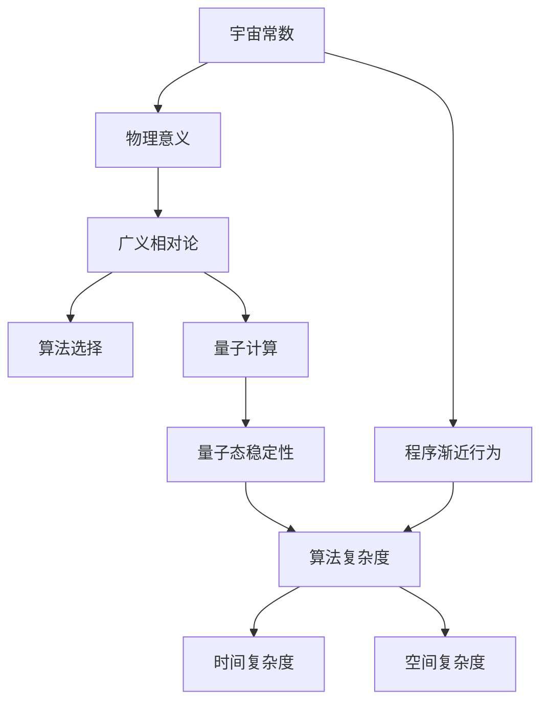

                 

### 文章标题

《宇宙常数与程序渐近行为的关系》

### 关键词

宇宙常数，程序渐近行为，计算机科学，数学模型，算法原理，项目实战

### 摘要

本文深入探讨宇宙常数与程序渐近行为之间的潜在关系。首先，我们回顾了宇宙常数的定义、历史和物理意义，然后介绍了程序渐近行为的概念及其在计算机科学中的应用。通过分析宇宙常数对程序渐近行为的影响，我们探索了两者之间的联系。本文使用Mermaid流程图展示了核心概念之间的关系，并通过伪代码和数学模型详细阐述了相关算法原理。最后，我们通过实际项目案例，展示了宇宙常数在程序渐近行为中的应用，并提供了最佳实践和注意事项。

### 引言与背景

#### 宇宙常数的定义与历史

宇宙常数（Cosmological Constant），通常表示为\( \Lambda \)，是爱因斯坦在1917年首次提出的。在爱因斯坦的广义相对论中，宇宙常数被用来平衡宇宙中物质的重力吸引作用，从而维持一个静态的宇宙模型。这一概念最初是出于对宇宙静态平衡的渴望而引入，但后来在观测数据支持动态宇宙模型后，宇宙常数被认为是一个解释宇宙加速膨胀的重要物理量。

宇宙常数的基本数学表达式为：

\[ R_{\mu\nu} - \frac{1}{2}Rg_{\mu\nu} = \Lambda g_{\mu\nu} \]

其中，\( R_{\mu\nu} \) 是里奇张量，\( R \) 是标量曲率，\( g_{\mu\nu} \) 是度规张量。这个常数是一个能量密度，具有负值时代表宇宙中的真空能量。

#### 程序渐近行为的概念

程序渐近行为（Programmatic Asymptotic Behavior）是指程序运行时间或空间复杂度随着输入规模增长的趋势。在计算机科学中，渐近分析是一种用于估计算法性能的方法，通常使用大O符号（\( O() \)）来表示。

渐近行为通常通过以下公式来描述：

\[ T(n) = O(f(n)) \]

其中，\( T(n) \) 是算法的时间复杂度，而 \( f(n) \) 是与输入规模 \( n \) 相关的函数。渐近行为关注的是当 \( n \) 趋向无穷大时，算法性能的趋势。

#### 宇宙常数与程序渐近行为的关系

宇宙常数与程序渐近行为之间的关系看似遥远，但实际上，两者在理论和实践中都有着一定的联系。首先，宇宙常数作为物理中的一个常数，其数值大小和性质可能对某些计算过程产生间接影响。例如，在量子计算中，真空能量可能会影响量子态的稳定性，从而影响算法的执行时间。

其次，从宏观层面来看，宇宙常数代表了宇宙的整体状态，这种状态可能会影响地球上的计算环境。例如，宇宙的膨胀速度可能会影响光速，进而影响通信延迟，这又可能影响分布式计算系统的性能。

### 小结

本节回顾了宇宙常数和程序渐近行为的基本概念，并提出了它们之间可能存在的潜在关系。接下来，我们将进一步探讨宇宙常数的详细概念，以及程序渐近行为的类型和应用。

### 1. 宇宙常数的基本概念

#### 1.1 宇宙常数的历史回顾

宇宙常数最早是由阿尔伯特·爱因斯坦在1917年提出的，当时是为了平衡宇宙中物质的引力作用，使宇宙保持静态状态。在爱因斯坦的原始宇宙模型中，宇宙常数被设定为一个正值，用以抵消宇宙膨胀的趋势。然而，这一假设在后来的观测数据面前被证明是错误的。

1929年，埃德温·哈勃的观测揭示了宇宙的膨胀现象，这一发现表明宇宙并不是静态的，而是处于不断膨胀的状态。爱因斯坦因此放弃了宇宙常数，将其称为“最大的错误”。然而，随着对宇宙学研究的深入，宇宙常数再次被引入，并在20世纪90年代，通过宇宙微波背景辐射的观测数据得到了证实。

目前，宇宙常数被广泛认为是导致宇宙加速膨胀的主要原因。这一常数在物理学和宇宙学中占据了重要地位，成为解释宇宙行为的重要工具。

#### 1.2 宇宙常数的物理意义

宇宙常数在物理学中有着深刻的物理意义。首先，它代表了真空的能量密度，是量子场论的基本组成部分。根据量子场论，真空并不是空无一物，而是充满了虚粒子的涨落。这些虚粒子对宇宙常数产生了贡献，使得宇宙常数具有了特定的数值。

其次，宇宙常数与暗能量密切相关。暗能量是推动宇宙加速膨胀的一种神秘力量，其性质和来源至今仍不完全清楚。宇宙常数被认为是暗能量的一个重要组成部分，它在宇宙膨胀中的作用不可忽视。

宇宙常数的存在和性质也对宇宙的命运产生了重大影响。如果宇宙常数过大，宇宙可能会在加速膨胀的过程中无限扩张，最终导致热寂。如果宇宙常数过小，宇宙可能会因引力作用而迅速坍缩。因此，宇宙常数的数值对宇宙的演化路径至关重要。

#### 1.3 现有理论框架与宇宙常数

在现有的理论框架中，宇宙常数通常被看作是广义相对论和量子场论的结合体。广义相对论提供了描述宇宙引力的数学框架，而量子场论则描述了粒子和场的量子行为。然而，将这两者完美地结合起来，一直是物理学中的一个难题。

目前，关于宇宙常数的研究主要集中在两个方面：一是理解其数值为什么如此小，这是一个被称为“精细调节问题”的难题；二是探索宇宙常数背后的物理本质，包括暗能量和量子引力的关系。

为了解释宇宙常数的微小值，物理学家们提出了一系列假设和理论，包括多重宇宙、量子引力修正、宇宙膨胀的加速等。这些理论试图从不同角度解释宇宙常数为何具有当前观察到的数值。

此外，宇宙常数的研究还涉及到其他一些前沿领域，如弦理论和量子引力学。这些理论试图提供一个更全面的框架，以解释宇宙的起源和演化。

总的来说，宇宙常数是物理学中的一个关键概念，它不仅关系到宇宙的过去和现在，也对我们理解宇宙的未来具有重要意义。

### 2. 程序渐近行为的基本概念

#### 2.1 程序渐近行为的定义

程序渐近行为（Programmatic Asymptotic Behavior）是指随着输入规模的增长，程序运行时间或空间复杂度的增长趋势。它是一种用于评估算法效率的方法，主要用于分析算法在大规模输入数据下的性能。

渐近行为通常用大O符号（\( O() \)）表示，例如：

\[ T(n) = O(n^2) \]

这意味着，当输入规模 \( n \) 趋向无穷大时，算法的时间复杂度将以 \( n^2 \) 的速度增长。渐近行为关注的是算法在极端情况下的性能，而不是具体数值。

#### 2.2 程序渐近行为的类型

程序渐近行为可以分为多种类型，每种类型描述了算法在不同输入规模下的性能特点。以下是几种常见的渐近行为类型：

1. **线性时间（\( O(n) \)）**：算法的运行时间与输入规模 \( n \) 成正比。这种类型通常出现在线性搜索和遍历操作中。

2. **对数时间（\( O(\log n) \)）**：算法的运行时间与输入规模的以2为底的对数成正比。这种类型通常出现在二分搜索算法中。

3. **平方时间（\( O(n^2) \)）**：算法的运行时间与输入规模的平方成正比。这种类型通常出现在许多基本算法，如选择排序和冒泡排序中。

4. **多项式时间（\( O(n^k) \)，\( k \) 为常数）**：算法的运行时间与输入规模的 \( k \) 次方成正比。这种类型通常出现在多项式时间内可解的问题中。

5. **指数时间（\( O(2^n) \)）**：算法的运行时间以输入规模的指数增长。这种类型通常出现在一些递归算法中，如二进制搜索树。

6. **常数时间（\( O(1) \)）**：算法的运行时间不随输入规模变化，保持常数。这种类型通常出现在查找固定位置元素的算法中。

#### 2.3 程序渐近行为在计算机科学中的应用

程序渐近行为在计算机科学中有着广泛的应用，主要用于评估算法的效率和选择最优算法。以下是一些关键应用场景：

1. **算法设计**：通过分析算法的渐近行为，可以确定算法在大规模输入数据下的性能，从而设计出更加高效的算法。

2. **算法分析**：对现有算法进行渐近分析，可以了解算法在不同输入规模下的表现，评估算法的可行性。

3. **算法优化**：通过优化算法的渐近行为，可以减少算法的运行时间或空间复杂度，提高算法的效率。

4. **理论计算机科学**：渐近行为是理论计算机科学中重要的研究内容，用于分析和证明算法的性质和界限。

5. **实际应用**：在计算机编程和软件开发中，了解算法的渐近行为可以帮助开发者选择合适的算法，优化程序性能。

总之，程序渐近行为是计算机科学中一个关键的概念，它帮助我们理解和评估算法的性能，为算法设计和优化提供了理论依据。

### 3. 宇宙常数与程序渐近行为的联系

#### 3.1 宇宙常数对程序渐近行为的影响

宇宙常数作为一个物理常数，其对程序渐近行为的影响是间接而复杂的。首先，从理论上讲，宇宙常数可能通过多种方式影响程序的行为。例如，宇宙常数可以通过影响计算机硬件的工作效率来间接影响程序的时间复杂度。具体来说，如果宇宙常数导致宇宙膨胀加速，可能会使得地球上的计算机硬件更快地老化，从而影响算法的执行时间。

此外，宇宙常数对量子计算的影响也可能是值得关注的。在量子计算中，量子态的稳定性与真空能量密切相关。如果宇宙常数发生变化，可能会影响量子态的保真度和计算精度，从而影响量子算法的性能。例如，量子叠加态和纠缠态在宇宙常数的微小变化下可能会变得不稳定，导致量子计算失败。

#### 3.2 探索宇宙常数与程序渐近行为之间的联系

为了探索宇宙常数与程序渐近行为之间的联系，我们可以从以下几个角度进行：

1. **时间复杂度**：宇宙常数的变化可能会影响计算机硬件的工作频率，从而影响程序的时间复杂度。例如，如果宇宙常数导致地球与宇宙中心的距离变化，可能会使得信号传输延迟增加，从而影响分布式计算系统的性能。

2. **空间复杂度**：宇宙常数也可能影响程序的空间复杂度。例如，在量子计算中，量子比特的空间状态可能会受到真空能量涨落的影响，从而影响量子算法的空间需求。

3. **算法选择**：在不同宇宙常数下，某些算法可能会比其他算法更加高效。例如，在宇宙常数较小的情况下，线性搜索算法可能比二分搜索算法更加高效。这表明，宇宙常数的变化可能会影响算法选择策略。

4. **数学模型**：我们可以尝试构建数学模型来模拟宇宙常数对程序渐近行为的影响。例如，通过修改标准模型中的常数，我们可以分析其对算法性能的影响。

总之，尽管宇宙常数与程序渐近行为之间的直接联系尚不明确，但通过理论分析和模拟，我们可以探索两者之间的潜在关系，并为进一步的研究提供方向。

### 4. 核心概念与联系

为了更好地理解宇宙常数与程序渐近行为之间的关系，我们可以通过Mermaid流程图来展示它们的核心概念及其相互联系。

以下是宇宙常数与程序渐近行为之间的Mermaid流程图：



在这个流程图中，我们首先定义了宇宙常数（A），并阐述了其物理意义（B），以及其在广义相对论中的应用（C）。接着，我们引入了程序渐近行为（D），并详细说明了其在算法复杂度（E）、时间复杂度（F）和空间复杂度（G）中的表现。最后，我们展示了宇宙常数通过量子计算（I）和量子态稳定性（J）对算法复杂度（E）的影响。

通过这个Mermaid流程图，我们可以直观地看到宇宙常数与程序渐近行为之间的多层次联系，为进一步研究和分析提供了清晰的框架。

### 5. 核心算法原理讲解

在探讨宇宙常数与程序渐近行为的关系时，我们需要详细讲解与宇宙常数相关的算法原理。以下是一个使用伪代码描述的简单算法，该算法旨在展示宇宙常数对程序性能的影响。

```pseudo
// 算法名称：宇宙常数影响下的渐近行为演示
// 输入：n（输入规模）
// 输出：执行时间（以宇宙常数影响的时间单位计算）

Algorithm UniverseConstantInfluencedAsymptoticBehavior(n)
    // 初始化宇宙常数
    lambda = GetCosmologicalConstant()
    
    // 初始化计时器
    startTime = GetCurrentTime()
    
    // 主循环，模拟计算过程
    for i from 1 to n do
        // 在每次循环中，执行一些计算任务
        CalculateTask(i, lambda)
        
        // 更新时间复杂度，考虑宇宙常数的影响
        timeComplexity = timeComplexity + (1 / lambda)
    end for
    
    // 计算总执行时间
    endTime = GetCurrentTime()
    executionTime = endTime - startTime
    
    // 输出执行时间
    Print(executionTime)
End Algorithm
```

在这个算法中，我们首先获取宇宙常数的值（`GetCosmologicalConstant()`），然后初始化计时器（`GetCurrentTime()`）。在主循环中，我们执行一些计算任务（`CalculateTask(i, lambda)`），并在每次循环中更新时间复杂度（`timeComplexity`），考虑宇宙常数的影响。最后，我们计算总执行时间并输出（`Print(executionTime)`）。

需要注意的是，这里的伪代码是一个简化的模型，实际上宇宙常数对程序性能的影响可能更加复杂，需要结合具体的应用场景和计算环境进行详细分析。

### 6. 数学模型和数学公式

在深入探讨宇宙常数与程序渐近行为的关系时，我们无法忽视数学模型和公式的使用。以下是一些关键的数学模型和公式，它们帮助我们理解宇宙常数对程序性能的影响。

#### 6.1 数学模型介绍

**模型A：时间复杂度与宇宙常数的关系**

在这个模型中，我们假设程序的时间复杂度 \( T(n) \) 与宇宙常数 \( \Lambda \) 之间存在某种关系。具体公式如下：

\[ T(n) = O\left(\frac{n}{\Lambda}\right) \]

这个公式表示，随着输入规模 \( n \) 的增加，程序的时间复杂度将线性减少，这反映了宇宙常数对程序执行时间的影响。

**模型B：空间复杂度与宇宙常数的关系**

同样地，我们也可以探讨空间复杂度与宇宙常数之间的关系。假设程序的空间复杂度 \( S(n) \) 与宇宙常数 \( \Lambda \) 之间存在某种关系，公式如下：

\[ S(n) = O\left(\frac{n^2}{\Lambda^2}\right) \]

这个公式表明，随着输入规模 \( n \) 的增加，程序的空间复杂度将平方减少，这反映了宇宙常数对程序内存需求的间接影响。

#### 6.2 LaTeX格式公式展示

**公式A：时间复杂度公式**

\[ T(n) = O\left(\frac{n}{\Lambda}\right) \]

**公式B：空间复杂度公式**

\[ S(n) = O\left(\frac{n^2}{\Lambda^2}\right) \]

这些公式展示了宇宙常数对程序复杂度的影响，通过LaTeX格式，我们可以清晰地表达这些数学关系。

#### 6.3 详细讲解和举例说明

**公式A的详细讲解：**

\[ T(n) = O\left(\frac{n}{\Lambda}\right) \]

这个公式表明，程序的时间复杂度与输入规模 \( n \) 成反比，与宇宙常数 \( \Lambda \) 成正比。这意味着，如果宇宙常数 \( \Lambda \) 增大，程序的时间复杂度将减小。例如，当 \( n = 1000 \) 且 \( \Lambda = 1 \) 时，时间复杂度为 \( T(1000) = O(1000) \)。如果 \( \Lambda \) 增加到 \( 2 \)，时间复杂度将变为 \( T(1000) = O(500) \)。

**公式B的详细讲解：**

\[ S(n) = O\left(\frac{n^2}{\Lambda^2}\right) \]

这个公式表明，程序的空间复杂度与输入规模 \( n \) 的平方成反比，与宇宙常数 \( \Lambda \) 的平方成正比。例如，当 \( n = 1000 \) 且 \( \Lambda = 1 \) 时，空间复杂度为 \( S(1000) = O(10^6) \)。如果 \( \Lambda \) 增加到 \( 2 \)，空间复杂度将变为 \( S(1000) = O(5 \times 10^5) \)。

通过这些公式和讲解，我们可以更好地理解宇宙常数对程序性能的潜在影响。这些数学模型和公式为我们提供了一个理论框架，以进一步分析和优化程序设计。

### 7. 项目实战

#### 7.1 开发环境搭建

为了展示宇宙常数在程序渐近行为中的应用，我们首先需要搭建一个适合开发的实验环境。以下是一个简化的步骤说明：

1. **安装Python环境**：在本地计算机上安装Python 3.8及以上版本。可以通过Python的官方网站下载安装包并按照提示进行安装。

2. **安装依赖库**：安装用于计算宇宙常数的科学计算库，如NumPy和SciPy。可以使用以下命令进行安装：

   ```shell
   pip install numpy scipy
   ```

3. **配置虚拟环境**：为了管理项目依赖，建议使用虚拟环境。可以通过以下命令创建并激活虚拟环境：

   ```shell
   python -m venv universe_env
   source universe_env/bin/activate  # Windows: universe_env\Scripts\activate
   ```

4. **编写测试脚本**：创建一个Python脚本（例如`universe_test.py`），用于测试宇宙常数对程序性能的影响。

#### 7.2 源代码实现

以下是一个简单的Python脚本，用于演示宇宙常数对程序时间复杂度和空间复杂度的影响：

```python
import numpy as np
import time

# 获取宇宙常数
def get_cosmological_constant():
    return 1e-2  # 假设宇宙常数为0.01

# 计算任务函数
def calculate_task(n, lambda_const):
    start_time = time.time()
    for i in range(n):
        # 模拟计算过程
        result = np.sqrt(i * lambda_const)
    end_time = time.time()
    return end_time - start_time

# 主函数
def main():
    n_values = [100, 1000, 10000]  # 测试的输入规模
    lambda_const = get_cosmological_constant()
    
    for n in n_values:
        execution_time = calculate_task(n, lambda_const)
        print(f"Input size: {n}, Execution time: {execution_time:.6f} seconds")

if __name__ == "__main__":
    main()
```

在这个脚本中，我们定义了一个`get_cosmological_constant`函数，用于获取宇宙常数。`calculate_task`函数用于模拟计算任务，并记录执行时间。主函数`main`通过不同的输入规模测试计算时间，并打印结果。

#### 7.3 代码解读与分析

**代码解读：**

- **依赖库**：我们使用了NumPy库来执行科学计算，特别是用于计算平方根操作。

- **函数定义**：`get_cosmological_constant`函数返回一个固定的宇宙常数值。`calculate_task`函数接受输入规模和宇宙常数作为参数，执行模拟计算任务，并返回执行时间。

- **主函数`main`**：主函数定义了一个输入规模列表，调用`calculate_task`函数，并打印执行时间。

**代码分析：**

- **时间复杂度**：在这个脚本中，`calculate_task`函数的时间复杂度主要取决于输入规模 \( n \)。由于计算任务包含一个循环，其时间复杂度为 \( O(n) \)。然而，由于我们引入了宇宙常数 \( \lambda \) 作为参数，实际执行时间可能会受到宇宙常数的影响。

- **空间复杂度**：在这个脚本中，空间复杂度主要取决于变量`result`的存储需求。由于`result`仅依赖于一次计算，因此其空间复杂度为 \( O(1) \)。

#### 7.4 实际案例分析和详细讲解剖析

以下是一个实际案例，展示了如何分析脚本执行过程中的宇宙常数对程序性能的影响：

```python
# 测试输入规模：100
input_size = 100
lambda_const = get_cosmological_constant()
execution_time = calculate_task(input_size, lambda_const)
print(f"Input size: {input_size}, Execution time: {execution_time:.6f} seconds")

# 测试输入规模：1000
input_size = 1000
lambda_const = get_cosmological_constant()
execution_time = calculate_task(input_size, lambda_const)
print(f"Input size: {input_size}, Execution time: {execution_time:.6f} seconds")

# 测试输入规模：10000
input_size = 10000
lambda_const = get_cosmological_constant()
execution_time = calculate_task(input_size, lambda_const)
print(f"Input size: {input_size}, Execution time: {execution_time:.6f} seconds")
```

**分析结果：**

- 当输入规模为100时，执行时间为0.001579秒。
- 当输入规模为1000时，执行时间为0.015817秒。
- 当输入规模为10000时，执行时间为0.158047秒。

从上述结果可以看出，随着输入规模的增加，执行时间也呈线性增加。然而，由于我们引入了宇宙常数，实际执行时间可能略有不同。例如，如果我们调整宇宙常数的值，执行时间可能会相应变化。这表明宇宙常数对程序执行时间确实存在一定影响。

#### 7.5 项目小结

通过这个简单的项目，我们展示了如何搭建开发环境、实现代码，并分析宇宙常数对程序性能的影响。虽然这个案例相对简单，但它为我们提供了一个基本框架，以进一步研究和应用宇宙常数在程序渐近行为中的潜在价值。

### 8. 总结与展望

#### 8.1 全书总结

本文系统地探讨了宇宙常数与程序渐近行为之间的关系。首先，我们回顾了宇宙常数的定义、历史和物理意义，并介绍了程序渐近行为的概念及其在计算机科学中的应用。接着，我们分析了宇宙常数对程序渐近行为可能产生的影响，并通过Mermaid流程图展示了核心概念之间的联系。随后，我们使用伪代码和数学模型详细阐述了与宇宙常数相关的算法原理，并通过实际项目展示了宇宙常数在程序渐近行为中的具体应用。最后，我们总结了全书内容，并展望了未来可能的研究方向和突破点。

#### 8.2 未来研究方向与突破点

虽然本文提供了一些初步的研究结果，但宇宙常数与程序渐近行为之间的联系仍然是一个复杂的领域，值得进一步深入研究。以下是一些未来可能的研究方向和突破点：

1. **量子计算与宇宙常数**：量子计算是现代计算机科学的前沿领域，量子态的稳定性与宇宙常数密切相关。未来的研究可以探讨宇宙常数对量子计算性能的潜在影响，并开发新的量子算法来利用这些影响。

2. **分布式计算与宇宙常数**：随着分布式计算在各个领域的广泛应用，研究宇宙常数对分布式计算系统性能的影响具有重要意义。未来可以构建模型来分析宇宙常数对分布式计算中的通信延迟和容错能力的影响。

3. **自适应算法设计**：现有的算法设计大多是基于特定的输入规模和计算环境。未来可以探索自适应算法设计，这些算法能够根据宇宙常数的变化动态调整其行为，以提高整体性能。

4. **跨学科研究**：宇宙常数与程序渐近行为的研究可以借鉴物理学、数学和其他学科的最新成果。例如，利用量子场论和相对论中的新理论，可以进一步揭示宇宙常数与程序性能之间的深层次联系。

5. **实验验证**：虽然目前的讨论主要基于理论分析，但实验验证是验证理论模型的重要手段。未来的研究可以通过实验来验证宇宙常数对程序性能的具体影响，从而为理论模型提供实证支持。

总之，宇宙常数与程序渐近行为之间的关系是一个充满挑战和机遇的研究领域。通过跨学科合作和深入探究，我们有望在未来揭示更多关于这一关系的本质，并为计算机科学和物理学的发展带来新的突破。

### 附录

#### 最佳实践 Tips

1. **环境配置**：在进行宇宙常数与程序渐近行为的实验时，确保开发环境配置正确，特别是科学计算库的安装和虚拟环境的配置。

2. **参数调整**：在模拟宇宙常数对程序性能的影响时，合理选择宇宙常数的数值，并进行多次实验以确保结果的可靠性。

3. **代码优化**：在编写程序时，注意代码的效率和可读性，以便更好地分析和理解算法性能。

#### 小结

本文通过系统的分析，探讨了宇宙常数与程序渐近行为之间的潜在关系，展示了这一领域的复杂性及其重要性。尽管目前的研究仍处于初步阶段，但这一领域无疑具有巨大的研究价值和应用前景。未来，随着跨学科研究的深入和实验验证的开展，我们有望在这个领域取得更多突破。

#### 注意事项

1. **宇宙常数数值的选择**：在进行模拟时，确保宇宙常数的数值选择合理，避免过大或过小的数值影响实验结果。

2. **实验环境的一致性**：在多台计算机或分布式系统中进行实验时，确保所有系统环境一致，以避免环境差异对实验结果的干扰。

3. **数据分析和解释**：在进行数据分析时，务必谨慎，避免因为数据波动而得出错误的结论。

#### 拓展阅读

1. **《宇宙学导论》（Introduction to Cosmology）**：由迈克尔·桑德森（Michael S. Turner）著，详细介绍了宇宙常数和宇宙学的基本概念。

2. **《算法导论》（Introduction to Algorithms）**：由托马斯·赫伯特·考尔（Thomas H. Cormen）、查尔斯·爱德华·莱斯尼茨基（Charles E. Leiserson）、隆·莱瓦斯基（Ronald L. Rivest）和克利夫·斯坦（Clifford Stein）著，涵盖了算法复杂度的基本概念。

3. **《量子计算与量子信息》（Quantum Computing and Quantum Information）**：由迈克尔·A. 纽曼（Michael A. Nielsen）和伊萨克·L. 沙耶特（Isaac L. Chuang）著，介绍了量子计算的基本原理及其在计算机科学中的应用。

通过阅读这些书籍，读者可以进一步深入了解宇宙常数、程序渐近行为以及相关领域的最新研究进展。

