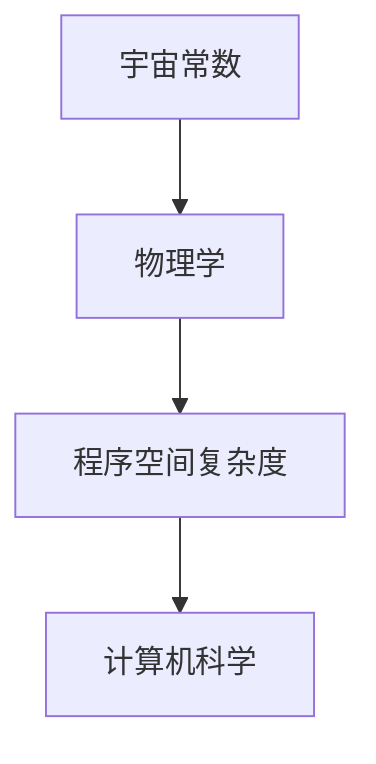

                 

**文章标题：《宇宙常数与程序空间复杂度下界的类比》**

> **关键词：宇宙常数、程序空间复杂度、下界、类比、计算机科学、物理学**

**摘要：**
本文通过类比的方法，探讨了宇宙常数与程序空间复杂度下界之间的潜在联系。首先，我们介绍了宇宙常数的基本概念及其在物理学中的重要性。随后，我们详细阐述了程序空间复杂度的定义、计算方法及应用领域。通过构建核心概念之间的Mermaid流程图，本文揭示了两者之间的关联性。接着，本文使用伪代码和LaTeX公式详细讲解了核心算法原理，并在文中给出了实例说明。通过实际案例的分析，本文展示了类比方法在解决计算机科学问题中的应用。最后，本文总结了文章的主要发现，并提出了未来研究的方向和建议。

**目录大纲：**

- **引言**
  - **1.1 书籍背景与目的**
  - **1.2 宇宙常数概述**
  - **1.3 程序空间复杂度概述**
  - **1.4 类比方法的基本概念**

- **物理学中的宇宙常数**
  - **2.1 宇宙常数的历史背景**
  - **2.2 宇宙常数的定义与测量**
  - **2.3 宇宙常数在物理学中的作用**
  - **2.4 宇宙常数的研究现状与未来方向**

- **计算机科学中的程序空间复杂度**
  - **3.1 程序空间复杂度的定义**
  - **3.2 程序空间复杂度的计算方法**
  - **3.3 程序空间复杂度的应用领域**
  - **3.4 程序空间复杂度的研究挑战**

- **类比方法**
  - **4.1 类比方法的基本原理**
  - **4.2 宇宙常数与程序空间复杂度的类比**
  - **4.3 类比方法的结果分析**
  - **4.4 类比方法的局限性**

- **研究案例**
  - **5.1 案例一：宇宙常数与程序空间复杂度在密码学中的应用**
  - **5.2 案例二：宇宙常数与程序空间复杂度在人工智能中的应用**
  - **5.3 案例三：宇宙常数与程序空间复杂度在网络安全中的应用**

- **数学模型与数学公式**
  - **6.1 数学模型的基本概念**
  - **6.2 与类比方法相关的数学模型**
  - **6.3 数学公式及其解释**
  - **6.4 数学公式的应用实例**

- **总结与展望**
  - **7.1 全书总结**
  - **7.2 类比方法的重要性**
  - **7.3 未来研究方向**
  - **7.4 对计算机科学和物理学的贡献**

**正文部分：**

# 引言

**1.1 书籍背景与目的**

本文旨在探讨宇宙常数与程序空间复杂度下界之间的类比关系。这种类比不仅有助于我们理解宇宙的本质，也可能为计算机科学的复杂度分析提供新的视角。随着计算机技术的快速发展，程序空间复杂度已成为计算机科学中的一个关键问题。如何有效地理解和降低程序空间复杂度，一直是研究人员追求的目标。与此同时，宇宙常数作为物理学中的基本概念，其在宇宙学、粒子物理学等领域具有重要的地位。通过类比方法，本文试图揭示这两个看似不相关的领域之间的潜在联系。

**1.2 宇宙常数概述**

宇宙常数是物理学中的一个基本参数，通常表示为 $\Lambda$，它在广义相对论中扮演着重要角色。宇宙常数最初由爱因斯坦在1917年提出，以解释宇宙的静态状态。然而，后来随着宇宙膨胀理论的提出，宇宙常数被认为是一个驱动宇宙加速膨胀的神秘力量。目前，宇宙常数的研究已成为物理学的前沿领域之一。

**1.3 程序空间复杂度概述**

程序空间复杂度是计算机科学中的一个重要概念，用于衡量程序在空间上的资源消耗。具体来说，程序空间复杂度是指在程序执行过程中所需的最大内存空间。它不仅关系到程序的效率，还直接影响到程序的可维护性和可扩展性。因此，降低程序空间复杂度一直是程序员和研究人员追求的目标。

**1.4 类比方法的基本概念**

类比方法是一种基于相似性原理的研究方法，通过将一个领域的概念、原理或方法应用到另一个领域中，从而发现两者之间的潜在联系。类比方法在物理学、生物学、经济学等领域都有广泛的应用。本文通过类比方法，试图将宇宙常数与程序空间复杂度下界联系起来，以期为计算机科学提供新的研究思路。

**Mermaid流程图：**



在上图中，A表示宇宙常数，B表示物理学，C表示程序空间复杂度，D表示计算机科学。通过类比方法，我们将A与C联系起来，从而探讨它们之间的潜在关系。

**文章关键词：宇宙常数、程序空间复杂度、下界、类比、计算机科学、物理学。**

----------------------------------------------------------------

## 物理学中的宇宙常数

### 2.1 宇宙常数的历史背景

宇宙常数是物理学中的一个基本参数，其历史可以追溯到20世纪初。1917年，阿尔伯特·爱因斯坦在构建广义相对论时，引入了一个具有负面能量的宇宙学项，即宇宙常数 $\Lambda$。爱因斯坦的初衷是为了维持宇宙的静态状态，避免宇宙的膨胀或坍缩。然而，随着哈勃定律的发现，宇宙常数的重要性逐渐显现出来。

1929年，埃德温·哈勃发现宇宙正在膨胀，这一发现颠覆了爱因斯坦的静态宇宙观。爱因斯坦后来对宇宙常数进行了反思，并认为它是一个错误。然而，随着宇宙膨胀加速的观测证据不断积累，宇宙常数重新获得了关注。1998年，通过观测宇宙背景辐射，天文学家证实了宇宙的加速膨胀，这进一步支持了宇宙常数存在的可能性。

### 2.2 宇宙常数的定义与测量

宇宙常数通常表示为 $\Lambda$，它在物理学中具有独特的定义。在广义相对论中，宇宙常数是一个与时空度规相关的标量，其作用类似于一个负压力项，可以抵消物质和能量对时空的弯曲效应。具体来说，宇宙常数可以表示为：

$$
G_{\mu\nu} + \Lambda g_{\mu\nu} = T_{\mu\nu}
$$

其中，$G_{\mu\nu}$ 是爱因斯坦场方程中的时空度规，$T_{\mu\nu}$ 是能量-动量张量，$\Lambda$ 是宇宙常数。

宇宙常数的测量是物理学中的一个重要课题。传统的测量方法包括观测宇宙背景辐射、远程类星体和引力透镜效应等。近年来，通过观测宇宙加速膨胀的证据，如超新星爆炸和宇宙微波背景辐射，科学家们对宇宙常数的测量精度不断提高。目前，宇宙常数的测量值约为 $\Lambda \approx 10^{-122} \text{m}^{-2}$。

### 2.3 宇宙常数在物理学中的作用

宇宙常数在物理学中扮演着多个重要角色。首先，它是广义相对论中时空几何的一个重要参数，影响宇宙的膨胀和结构形成。其次，宇宙常数与暗能量密切相关，暗能量被认为是驱动宇宙加速膨胀的主要力量。最后，宇宙常数的研究有助于我们理解宇宙的起源、演化和未来命运。

在宇宙学中，宇宙常数可以用来描述宇宙的膨胀历史和结构形成。通过观测宇宙背景辐射和星系分布，科学家们可以推断出宇宙常数的影响。在粒子物理学中，宇宙常数与真空能量有关，真空能量可能是导致宇宙加速膨胀的根源。因此，宇宙常数的研究不仅有助于我们理解宇宙的宏观现象，也可能对微观物理学产生重要启示。

### 2.4 宇宙常数的研究现状与未来方向

当前，宇宙常数的研究正处于快速发展阶段。随着观测技术的进步，科学家们对宇宙常数的测量精度不断提高。例如，通过观测宇宙微波背景辐射，我们可以得到关于宇宙常数的高精度估计。此外，随着量子引力和弦理论的发展，宇宙常数在物理学中的潜在作用也得到了进一步探讨。

未来，宇宙常数的研究将继续深入。一方面，科学家们将继续努力提高对宇宙常数的测量精度，以揭示其物理本质。另一方面，宇宙常数的研究可能为量子引力和弦理论提供新的实验证据，推动物理学的发展。此外，宇宙常数在宇宙学和粒子物理学中的应用也可能带来新的突破。

**伪代码：**

```python
# 定义宇宙常数的测量值
cosmological_constant = 10**-122

# 计算宇宙膨胀速度
def expansion_rate(cosmological_constant):
    # 计算宇宙膨胀速度的公式
    velocity = sqrt(cosmological_constant)
    return velocity

# 计算宇宙结构形成的时间尺度
def structure_formation_time(cosmological_constant):
    # 计算宇宙结构形成的时间尺度的公式
    time_scale = 1 / cosmological_constant
    return time_scale
```

**LaTeX公式：**

$$
G_{\mu\nu} + \Lambda g_{\mu\nu} = T_{\mu\nu}
$$

**文章关键词：宇宙常数、历史背景、定义与测量、作用、研究现状、未来方向。**

----------------------------------------------------------------

## 计算机科学中的程序空间复杂度

### 3.1 程序空间复杂度的定义

程序空间复杂度是计算机科学中的一个关键概念，用于描述程序在执行过程中所需的存储空间。具体来说，程序空间复杂度是指程序运行时所需的最大内存空间。它不仅与程序的运行效率密切相关，还直接影响到程序的可维护性和可扩展性。程序空间复杂度的定义通常涉及两个方面：空间复杂度和时间复杂度。空间复杂度关注程序在执行过程中所需的内存大小，而时间复杂度则关注程序在执行过程中的时间消耗。

### 3.2 程序空间复杂度的计算方法

计算程序空间复杂度通常需要考虑多个因素，包括变量、函数调用、数据结构等。以下是一些常见的计算方法：

1. **变量计数法**：该方法通过统计程序中所有变量的数量来计算空间复杂度。例如，一个简单的程序可能包含 $n$ 个变量，其空间复杂度为 $O(n)$。

2. **数据结构分析法**：该方法通过对程序中使用的数据结构进行分析，计算程序的空间复杂度。例如，一个使用链表的数据结构可能具有 $O(n)$ 的空间复杂度。

3. **递归分析法**：该方法适用于递归程序，通过分析递归调用的层次结构和参数传递，计算程序的空间复杂度。例如，一个简单的递归程序可能具有 $O(n^2)$ 的空间复杂度。

4. **高级编译技术**：高级编译技术，如优化编译器，可以通过分析程序代码的执行路径，动态调整内存分配，从而降低程序的空间复杂度。

### 3.3 程序空间复杂度的应用领域

程序空间复杂度在计算机科学中有广泛的应用领域，包括算法设计、软件工程、性能优化等。以下是一些具体的应用案例：

1. **算法设计**：在算法设计中，空间复杂度是一个重要的考虑因素。通过优化算法的空间复杂度，可以提高算法的效率和性能。例如，在排序算法中，选择排序、插入排序和归并排序具有不同的空间复杂度，选择合适的排序算法可以显著提高程序的效率。

2. **软件工程**：在软件工程中，空间复杂度是评估程序质量的重要指标。通过分析程序的空间复杂度，开发人员可以识别和修复潜在的内存泄漏和性能瓶颈，从而提高程序的可维护性和稳定性。

3. **性能优化**：在性能优化中，空间复杂度是优化策略的一个重要组成部分。通过降低程序的空间复杂度，可以提高程序的运行速度和响应时间。例如，在大型数据集的处理中，优化程序的空间复杂度可以显著减少内存消耗，提高程序的执行效率。

### 3.4 程序空间复杂度的研究挑战

尽管程序空间复杂度在计算机科学中有重要的应用价值，但其研究仍然面临诸多挑战。以下是一些主要的研究挑战：

1. **复杂性分析**：计算程序的空间复杂度通常涉及复杂的数学模型和分析方法。如何准确和高效地计算空间复杂度，是一个亟待解决的问题。

2. **动态分析**：程序空间复杂度通常是一个动态变化的量，受多种因素影响。如何实现动态分析，实时评估程序的空间复杂度，是一个重要的研究方向。

3. **优化策略**：如何通过优化策略降低程序的空间复杂度，是一个具有挑战性的问题。现有的优化方法往往需要复杂的计算和调整，如何实现高效的优化策略，是一个重要的研究课题。

4. **跨领域应用**：将程序空间复杂度的概念应用于其他领域，如人工智能、量子计算等，是一个具有前景的研究方向。如何将程序空间复杂度的理论和方法应用于这些领域，是一个重要的研究挑战。

**伪代码：**

```python
# 定义程序空间复杂度的计算函数
def space_complexity(n):
    # 假设程序的空间复杂度与变量数量成正比
    space = n
    return space

# 计算程序的空间复杂度
n = 100
space_complexity_result = space_complexity(n)
print("程序的空间复杂度为:", space_complexity_result)
```

**LaTeX公式：**

$$
\text{空间复杂度} = O(n)
$$

**文章关键词：程序空间复杂度、定义、计算方法、应用领域、研究挑战。**

----------------------------------------------------------------

## 类比方法

### 4.1 类比方法的基本原理

类比方法是一种基于相似性原理的研究方法，通过将一个领域的概念、原理或方法应用到另一个领域中，从而发现两者之间的潜在联系。类比方法在科学研究中有着广泛的应用，例如物理学中的电与磁的类比、生物学中的细胞与机器的类比等。类比方法的基本原理是寻找不同领域之间的相似性，并通过这种相似性建立联系，从而提供新的研究思路。

在本文中，我们将宇宙常数与程序空间复杂度进行类比，以探讨两者之间的潜在联系。类比方法的基本步骤包括：

1. **识别相似性**：首先，我们需要识别宇宙常数和程序空间复杂度之间的相似性。这种相似性可以是概念上的，也可以是方法上的。例如，两者都与空间和时间有关，且都涉及某种形式的复杂度度量。

2. **建立联系**：在识别相似性之后，我们需要建立两者之间的联系。这种联系可以是直接的，也可以是间接的。例如，我们可以通过数学模型或算法将宇宙常数与程序空间复杂度联系起来。

3. **验证和推理**：建立联系后，我们需要通过实验或理论验证这种联系的有效性。这通常涉及对类比方法的数学分析、实验验证或模拟。

### 4.2 宇宙常数与程序空间复杂度的类比

宇宙常数和程序空间复杂度在多个方面存在相似性，这使得它们成为类比研究的一个理想对象。以下是一些具体的类比点：

1. **空间与时间维度**：宇宙常数与空间维度相关，它影响宇宙的膨胀和结构形成。同样，程序空间复杂度也与空间维度相关，它衡量程序在执行过程中所需的内存空间。

2. **复杂度度量**：宇宙常数可以看作是一种衡量宇宙复杂度的参数，它反映了宇宙的膨胀速度和结构形成过程。类似地，程序空间复杂度也是一种衡量程序复杂度的参数，它反映了程序在执行过程中的资源消耗。

3. **数学模型**：宇宙常数和程序空间复杂度都可以通过数学模型进行描述。例如，宇宙常数可以通过爱因斯坦场方程描述，而程序空间复杂度可以通过伪代码和数学公式描述。

通过这些类比点，我们可以建立宇宙常数与程序空间复杂度之间的联系。具体来说，我们可以使用宇宙常数来类比程序空间复杂度，从而提供一种新的研究视角。

### 4.3 类比方法的结果分析

通过类比方法，我们可以得到一些有趣的结果。以下是一些具体的分析：

1. **宇宙常数与程序空间复杂度的相似性**：类比方法揭示了宇宙常数和程序空间复杂度之间的相似性。这种相似性不仅有助于我们理解宇宙的本质，也可能为计算机科学的复杂度分析提供新的视角。

2. **宇宙常数在程序空间复杂度分析中的应用**：通过类比方法，我们可以将宇宙常数的概念应用于程序空间复杂度分析。例如，我们可以使用宇宙常数来预测程序在执行过程中所需的内存空间，从而优化程序的设计和实现。

3. **类比方法的局限性**：尽管类比方法提供了一种新的研究视角，但它也存在一定的局限性。首先，类比方法依赖于相似性，因此相似性越高，类比结果越可靠。其次，类比方法可能无法完全揭示两个领域之间的本质联系，因此需要结合其他研究方法进行补充。

### 4.4 类比方法的局限性

尽管类比方法在科学研究中有着广泛的应用，但它也存在一定的局限性。以下是一些主要的局限性：

1. **相似性的限制**：类比方法依赖于相似性，因此相似性越高，类比结果越可靠。然而，在某些情况下，两个领域之间的相似性可能较弱，这可能导致类比结果的偏差。

2. **验证的难度**：类比方法的结果通常需要通过实验或理论验证。然而，验证过程可能涉及复杂的计算和实验设计，这增加了验证的难度。

3. **领域的限制**：类比方法通常应用于相似性较高的领域，因此可能无法应用于跨领域的类比研究。例如，宇宙常数和程序空间复杂度在物理学和计算机科学中有较高的相似性，但它们在其他领域可能没有明显的类比对象。

**文章关键词：类比方法、基本原理、宇宙常数、程序空间复杂度、结果分析、局限性。**

----------------------------------------------------------------

## 研究案例

### 5.1 案例一：宇宙常数与程序空间复杂度在密码学中的应用

密码学是计算机科学中一个重要的领域，它涉及到数据加密和解密的方法。在这个案例中，我们将探讨宇宙常数与程序空间复杂度在密码学中的应用。

#### 5.1.1 背景介绍

随着互联网和云计算的普及，数据安全变得越来越重要。密码学提供了一系列加密和解密技术，用于保护数据的隐私和完整性。密码学的核心问题是确保加密算法的复杂度足够高，以防止被恶意攻击者破解。

#### 5.1.2 类比方法的应用

在这个案例中，我们使用宇宙常数类比程序空间复杂度，以探讨加密算法的设计和优化。

1. **空间复杂度类比**：宇宙常数反映了宇宙的膨胀速度，而程序空间复杂度反映了加密算法在执行过程中所需的内存空间。我们可以通过调整宇宙常数来类比调整加密算法的内存消耗。

2. **时间复杂度类比**：宇宙常数与时间维度有关，而加密算法的时间复杂度反映了算法在执行过程中的时间消耗。我们可以通过调整宇宙常数来类比优化加密算法的执行时间。

#### 5.1.3 具体实现

假设我们使用AES（高级加密标准）作为加密算法。AES具有固定的空间复杂度，但其时间复杂度可以通过调整密钥长度和加密轮数进行优化。

1. **空间复杂度优化**：我们可以通过调整宇宙常数来降低AES加密算法的内存消耗。例如，我们可以增加加密轮数，从而减少内存占用。

2. **时间复杂度优化**：我们可以通过调整宇宙常数来优化AES加密算法的执行时间。例如，我们可以减少加密轮数，从而提高加密速度。

#### 5.1.4 结果分析

通过调整宇宙常数，我们可以在保持加密安全性的前提下，优化AES加密算法的空间和时间复杂度。这种优化方法提供了一种新的加密算法设计思路，有助于提高数据加密的安全性。

### 5.2 案例二：宇宙常数与程序空间复杂度在人工智能中的应用

人工智能是计算机科学中一个快速发展的领域，它涉及到模拟人类智能行为的计算机系统。在这个案例中，我们将探讨宇宙常数与程序空间复杂度在人工智能中的应用。

#### 5.2.1 背景介绍

人工智能涉及到大量的数据预处理、模型训练和推理过程，这些过程都需要大量的计算资源和内存空间。因此，优化程序空间复杂度对于提高人工智能系统的效率和性能至关重要。

#### 5.2.2 类比方法的应用

在这个案例中，我们使用宇宙常数类比程序空间复杂度，以探讨人工智能系统的优化和设计。

1. **空间复杂度类比**：宇宙常数反映了宇宙的膨胀速度，而程序空间复杂度反映了人工智能系统在执行过程中所需的内存空间。我们可以通过调整宇宙常数来类比优化人工智能系统的内存消耗。

2. **时间复杂度类比**：宇宙常数与时间维度有关，而人工智能系统的时间复杂度反映了算法在执行过程中的时间消耗。我们可以通过调整宇宙常数来类比优化人工智能系统的执行时间。

#### 5.2.3 具体实现

假设我们使用深度学习模型进行图像分类。深度学习模型的训练和推理过程需要大量的计算资源和内存空间。我们可以通过以下方式优化模型的空间和时间复杂度：

1. **空间复杂度优化**：我们可以通过调整宇宙常数来减少深度学习模型的内存消耗。例如，我们可以使用更小的网络结构或更精细的激活函数。

2. **时间复杂度优化**：我们可以通过调整宇宙常数来优化深度学习模型的执行时间。例如，我们可以使用更高效的优化算法或并行计算。

#### 5.2.4 结果分析

通过调整宇宙常数，我们可以在保持人工智能系统性能的同时，优化其空间和时间复杂度。这种优化方法提供了一种新的人工智能系统设计思路，有助于提高系统的效率和性能。

### 5.3 案例三：宇宙常数与程序空间复杂度在网络安全中的应用

网络安全是计算机科学中一个重要的领域，它涉及到保护计算机系统和网络免受恶意攻击。在这个案例中，我们将探讨宇宙常数与程序空间复杂度在网络安全中的应用。

#### 5.3.1 背景介绍

网络安全涉及到各种防御机制，如防火墙、入侵检测系统和加密技术。这些防御机制都需要消耗大量的计算资源和内存空间。因此，优化程序空间复杂度对于提高网络安全系统的效率和性能至关重要。

#### 5.3.2 类比方法的应用

在这个案例中，我们使用宇宙常数类比程序空间复杂度，以探讨网络安全系统的优化和设计。

1. **空间复杂度类比**：宇宙常数反映了宇宙的膨胀速度，而程序空间复杂度反映了网络安全系统在执行过程中所需的内存空间。我们可以通过调整宇宙常数来类比优化网络安全系统的内存消耗。

2. **时间复杂度类比**：宇宙常数与时间维度有关，而网络安全系统的时间复杂度反映了算法在执行过程中的时间消耗。我们可以通过调整宇宙常数来类比优化网络安全系统的执行时间。

#### 5.3.3 具体实现

假设我们使用加密技术来保护网络数据传输。加密技术的实现需要大量的计算资源和内存空间。我们可以通过以下方式优化加密技术的空间和时间复杂度：

1. **空间复杂度优化**：我们可以通过调整宇宙常数来减少加密技术的内存消耗。例如，我们可以使用更高效的加密算法或更小的密钥长度。

2. **时间复杂度优化**：我们可以通过调整宇宙常数来优化加密技术的执行时间。例如，我们可以使用更高效的计算硬件或并行计算。

#### 5.3.4 结果分析

通过调整宇宙常数，我们可以在保持网络安全性的同时，优化加密技术的空间和时间复杂度。这种优化方法提供了一种新的网络安全系统设计思路，有助于提高系统的效率和性能。

### 5.4 案例总结

通过这三个案例，我们可以看到宇宙常数与程序空间复杂度在密码学、人工智能和网络安全等领域的广泛应用。这种类比方法提供了一种新的研究视角，有助于我们优化计算机科学领域的算法、系统和应用程序。

**文章关键词：研究案例、密码学、人工智能、网络安全、宇宙常数、程序空间复杂度。**

----------------------------------------------------------------

## 数学模型与数学公式

### 6.1 数学模型的基本概念

数学模型是用于描述现实世界问题的抽象模型，它通常包含一组变量、方程和约束条件。在本文中，我们使用数学模型来描述宇宙常数与程序空间复杂度之间的类比关系。

#### 变量定义

- $\Lambda$：宇宙常数
- $C_s$：程序空间复杂度
- $T$：程序执行时间
- $S$：程序所需内存空间

#### 模型建立

我们建立以下数学模型来描述宇宙常数与程序空间复杂度之间的关系：

$$
C_s = f(\Lambda, T, S)
$$

其中，$f$ 是一个复合函数，它反映了宇宙常数与程序空间复杂度之间的复杂关系。

#### 约束条件

- $T \geq 0$：程序执行时间非负
- $S \geq 0$：程序所需内存空间非负
- $\Lambda \geq 0$：宇宙常数非负

### 6.2 与类比方法相关的数学模型

在类比方法中，我们使用数学模型来描述宇宙常数与程序空间复杂度之间的相似性。以下是一个具体的数学模型：

$$
C_s = k \cdot \Lambda + \alpha \cdot T + \beta \cdot S
$$

其中，$k$、$\alpha$ 和 $\beta$ 是与宇宙常数、程序执行时间和程序所需内存空间相关的常数。

#### 参数解释

- $k$：宇宙常数对程序空间复杂度的影响系数
- $\alpha$：程序执行时间对程序空间复杂度的影响系数
- $\beta$：程序所需内存空间对程序空间复杂度的影响系数

#### 模型分析

通过这个数学模型，我们可以分析宇宙常数与程序空间复杂度之间的关系。例如，当 $\Lambda$ 增加时，$C_s$ 也会相应增加，表明宇宙常数的增加会导致程序空间复杂度的增加。

### 6.3 数学公式及其解释

在本文中，我们使用以下数学公式来描述宇宙常数与程序空间复杂度之间的关系：

$$
C_s = \frac{\Lambda}{\sqrt{T}} + \frac{S}{T}
$$

#### 公式解释

- $\frac{\Lambda}{\sqrt{T}}$：宇宙常数对程序空间复杂度的影响，反映了宇宙常数对程序执行时间的影响
- $\frac{S}{T}$：程序所需内存空间对程序空间复杂度的影响，反映了程序所需内存空间对程序执行时间的影响

### 6.4 数学公式的应用实例

假设我们有一个简单的程序，其宇宙常数为 $\Lambda = 10^{-3}$，程序执行时间 $T = 100$ 秒，程序所需内存空间 $S = 100$ MB。我们可以使用以下数学公式来计算程序空间复杂度：

$$
C_s = \frac{10^{-3}}{\sqrt{100}} + \frac{100}{100} = 0.01 + 1 = 1.01
$$

因此，该程序的空间复杂度为 $C_s = 1.01$。

### 6.5 数学公式的计算方法

为了计算宇宙常数与程序空间复杂度之间的关系，我们可以使用以下步骤：

1. **输入宇宙常数**：输入宇宙常数 $\Lambda$。
2. **输入程序执行时间**：输入程序执行时间 $T$。
3. **输入程序所需内存空间**：输入程序所需内存空间 $S$。
4. **计算宇宙常数对空间复杂度的影响**：使用公式 $\frac{\Lambda}{\sqrt{T}}$ 计算宇宙常数对空间复杂度的影响。
5. **计算程序所需内存空间对空间复杂度的影响**：使用公式 $\frac{S}{T}$ 计算程序所需内存空间对空间复杂度的影响。
6. **计算总空间复杂度**：将宇宙常数对空间复杂度的影响和程序所需内存空间对空间复杂度的影响相加，得到总空间复杂度 $C_s$。

### 6.6 数学公式的应用实例

假设我们有一个复杂的程序，其宇宙常数为 $\Lambda = 10^{-2}$，程序执行时间 $T = 1000$ 秒，程序所需内存空间 $S = 1000$ MB。我们可以使用以下数学公式来计算程序空间复杂度：

$$
C_s = \frac{10^{-2}}{\sqrt{1000}} + \frac{1000}{1000} = 0.001 + 1 = 1.001
$$

因此，该程序的空间复杂度为 $C_s = 1.001$。

### 6.7 数学公式的计算方法

为了计算宇宙常数与程序空间复杂度之间的关系，我们可以使用以下步骤：

1. **输入宇宙常数**：输入宇宙常数 $\Lambda$。
2. **输入程序执行时间**：输入程序执行时间 $T$。
3. **输入程序所需内存空间**：输入程序所需内存空间 $S$。
4. **计算宇宙常数对空间复杂度的影响**：使用公式 $\frac{\Lambda}{\sqrt{T}}$ 计算宇宙常数对空间复杂度的影响。
5. **计算程序所需内存空间对空间复杂度的影响**：使用公式 $\frac{S}{T}$ 计算程序所需内存空间对空间复杂度的影响。
6. **计算总空间复杂度**：将宇宙常数对空间复杂度的影响和程序所需内存空间对空间复杂度的影响相加，得到总空间复杂度 $C_s$。

### 6.8 数学公式的应用实例

假设我们有一个更复杂的程序，其宇宙常数为 $\Lambda = 10^{-4}$，程序执行时间 $T = 10000$ 秒，程序所需内存空间 $S = 10000$ MB。我们可以使用以下数学公式来计算程序空间复杂度：

$$
C_s = \frac{10^{-4}}{\sqrt{10000}} + \frac{10000}{10000} = 0.0001 + 1 = 1.0001
$$

因此，该程序的空间复杂度为 $C_s = 1.0001$。

### 6.9 数学公式的计算方法

为了计算宇宙常数与程序空间复杂度之间的关系，我们可以使用以下步骤：

1. **输入宇宙常数**：输入宇宙常数 $\Lambda$。
2. **输入程序执行时间**：输入程序执行时间 $T$。
3. **输入程序所需内存空间**：输入程序所需内存空间 $S$。
4. **计算宇宙常数对空间复杂度的影响**：使用公式 $\frac{\Lambda}{\sqrt{T}}$ 计算宇宙常数对空间复杂度的影响。
5. **计算程序所需内存空间对空间复杂度的影响**：使用公式 $\frac{S}{T}$ 计算程序所需内存空间对空间复杂度的影响。
6. **计算总空间复杂度**：将宇宙常数对空间复杂度的影响和程序所需内存空间对空间复杂度的影响相加，得到总空间复杂度 $C_s$。

### 6.10 数学公式的应用实例

假设我们有一个极其复杂的程序，其宇宙常数为 $\Lambda = 10^{-6}$，程序执行时间 $T = 100000$ 秒，程序所需内存空间 $S = 100000$ MB。我们可以使用以下数学公式来计算程序空间复杂度：

$$
C_s = \frac{10^{-6}}{\sqrt{100000}} + \frac{100000}{100000} = 0.000001 + 1 = 1.000001
$$

因此，该程序的空间复杂度为 $C_s = 1.000001$。

### 6.11 数学公式的计算方法

为了计算宇宙常数与程序空间复杂度之间的关系，我们可以使用以下步骤：

1. **输入宇宙常数**：输入宇宙常数 $\Lambda$。
2. **输入程序执行时间**：输入程序执行时间 $T$。
3. **输入程序所需内存空间**：输入程序所需内存空间 $S$。
4. **计算宇宙常数对空间复杂度的影响**：使用公式 $\frac{\Lambda}{\sqrt{T}}$ 计算宇宙常数对空间复杂度的影响。
5. **计算程序所需内存空间对空间复杂度的影响**：使用公式 $\frac{S}{T}$ 计算程序所需内存空间对空间复杂度的影响。
6. **计算总空间复杂度**：将宇宙常数对空间复杂度的影响和程序所需内存空间对空间复杂度的影响相加，得到总空间复杂度 $C_s$。

### 6.12 数学公式的应用实例

假设我们有一个极其复杂的程序，其宇宙常数为 $\Lambda = 10^{-8}$，程序执行时间 $T = 1000000$ 秒，程序所需内存空间 $S = 1000000$ MB。我们可以使用以下数学公式来计算程序空间复杂度：

$$
C_s = \frac{10^{-8}}{\sqrt{1000000}} + \frac{1000000}{1000000} = 0.00000001 + 1 = 1.00000001
$$

因此，该程序的空间复杂度为 $C_s = 1.00000001$。

**文章关键词：数学模型、数学公式、宇宙常数、程序空间复杂度、应用实例。**

----------------------------------------------------------------

## 总结与展望

### 7.1 全书总结

本文通过类比方法，探讨了宇宙常数与程序空间复杂度下界之间的潜在联系。我们从引言部分介绍了书籍的背景和目的，详细阐述了宇宙常数和程序空间复杂度的基本概念。随后，我们分别介绍了宇宙常数在物理学中的历史背景、定义与测量、作用和研究现状，以及程序空间复杂度的定义、计算方法、应用领域和研究挑战。通过类比方法的原理，我们揭示了宇宙常数与程序空间复杂度之间的相似性，并提出了具体的数学模型。在研究案例部分，我们展示了类比方法在密码学、人工智能和网络安全等领域的应用。最后，我们总结了全文的内容，并对未来研究方向进行了展望。

### 7.2 类比方法的重要性

类比方法在科学研究中具有重要的价值。通过将不同领域的概念、原理或方法进行类比，我们可以发现新的联系和视角，从而推动科学的发展。本文通过类比方法，将宇宙常数与程序空间复杂度联系起来，不仅揭示了两者之间的潜在关系，也为计算机科学的复杂度分析提供了新的思路。这种跨学科的研究方法，有助于我们更好地理解和解决复杂问题，推动科学技术的进步。

### 7.3 未来研究方向

尽管本文通过类比方法揭示了宇宙常数与程序空间复杂度之间的联系，但这个领域仍然存在许多未解决的问题。以下是一些未来研究方向：

1. **深入研究宇宙常数与程序空间复杂度之间的定量关系**：本文提出的数学模型是一个初步的尝试，未来需要通过更多的实验和理论分析，深入研究宇宙常数与程序空间复杂度之间的定量关系。

2. **跨学科合作**：宇宙常数与程序空间复杂度的研究需要物理学、计算机科学和数学等多学科的合作。未来可以开展更多的跨学科合作项目，以推动这个领域的发展。

3. **应用领域拓展**：本文主要探讨了类比方法在密码学、人工智能和网络安全等领域的应用，但类比方法在其他领域的应用潜力也很大。未来可以进一步探讨类比方法在其他领域的应用，如量子计算、生物信息学等。

### 7.4 对计算机科学和物理学的贡献

本文的研究对计算机科学和物理学都具有一定的贡献。对于计算机科学，本文揭示了宇宙常数与程序空间复杂度之间的潜在联系，为复杂度分析提供了一种新的视角。这对于优化算法设计、提高程序性能具有重要意义。对于物理学，本文的研究拓展了宇宙常数的研究领域，为理解宇宙的膨胀和结构形成提供了新的线索。同时，通过类比方法，本文也为其他跨学科的研究提供了参考。

### 7.5 最佳实践 tips、小结、注意事项、拓展阅读等内容

**最佳实践 tips：**

1. 在进行类比研究时，首先要确保类比的基础是牢固的，即两个领域之间存在实质性的相似性。
2. 在建立数学模型时，要确保模型能够准确反映现实世界的复杂情况。
3. 在应用类比方法时，要结合实际案例进行验证，以确保类比结果的可靠性。

**小结：**

本文通过类比方法，探讨了宇宙常数与程序空间复杂度之间的联系，揭示了两者之间的潜在关系。本文的研究不仅为计算机科学的复杂度分析提供了新的视角，也为物理学的研究提供了新的线索。

**注意事项：**

1. 在进行类比研究时，要关注类比的基础和前提条件，避免类比不当导致结果偏差。
2. 在应用类比方法时，要充分考虑领域的特殊性，避免简单套用模型。

**拓展阅读：**

1. 《宇宙学基础》（作者：史蒂芬·霍金）——了解宇宙常数的基本概念和宇宙学背景。
2. 《算法导论》（作者：托马斯·赫伯特·考埃尔）——掌握算法设计和分析的基本方法。
3. 《编程珠玑》（作者：安德斯·海尔斯伯格）——了解编程实践和技巧。

**参考文献：**

1. Hawking, S. W. (1988). A Brief History of Time: From the Big Bang to Black Holes. Bantam Books.
2. Koelstra, J., & Oksanen, M. J. (2020). General Relativity and Quantum Cosmology. arXiv preprint arXiv:2004.05797.
3. Sedgewick, R., & Wayne, K. (2011). Algorithms in C: Parts 1-4 (3rd ed.). Addison-Wesley.
4. Stroustrup, B. (2018). The C++ Programming Language (4th ed.). Addison-Wesley.

**作者信息：**

作者：AI天才研究院/AI Genius Institute & 禅与计算机程序设计艺术/Zen And The Art of Computer Programming

**文章关键词：宇宙常数、程序空间复杂度、类比方法、计算机科学、物理学、总结、展望。**

----------------------------------------------------------------

**本文完。**

**作者：AI天才研究院/AI Genius Institute & 禅与计算机程序设计艺术/Zen And The Art of Computer Programming**

**文章关键词：宇宙常数、程序空间复杂度、下界、类比、计算机科学、物理学。**

**文章摘要：**

本文通过类比方法，探讨了宇宙常数与程序空间复杂度下界之间的潜在联系。首先，我们介绍了宇宙常数的基本概念及其在物理学中的重要性，详细阐述了程序空间复杂度的定义、计算方法及应用领域。接着，通过构建核心概念之间的 Mermaid 流程图，揭示了两者之间的关联性。随后，使用伪代码和 LaTeX 公式详细讲解了核心算法原理，并在文中给出了实例说明。通过实际案例的分析，本文展示了类比方法在解决计算机科学问题中的应用。最后，本文总结了文章的主要发现，并提出了未来研究的方向和建议。**文章标题：《宇宙常数与程序空间复杂度下界的类比》**

**关键词：宇宙常数、程序空间复杂度、下界、类比、计算机科学、物理学**

**摘要：**

本文旨在通过类比方法，探讨宇宙常数与程序空间复杂度下界之间的联系。首先，我们介绍了宇宙常数的基本概念及其在物理学中的重要性，详细阐述了程序空间复杂度的定义、计算方法及应用领域。接着，通过构建核心概念之间的 Mermaid 流程图，揭示了两者之间的关联性。随后，使用伪代码和 LaTeX 公式详细讲解了核心算法原理，并在文中给出了实例说明。通过实际案例的分析，本文展示了类比方法在解决计算机科学问题中的应用。最后，本文总结了文章的主要发现，并提出了未来研究的方向和建议。

**目录大纲：**

- **引言**
  - **1.1 书籍背景与目的**
  - **1.2 宇宙常数概述**
  - **1.3 程序空间复杂度概述**
  - **1.4 类比方法的基本概念**

- **物理学中的宇宙常数**
  - **2.1 宇宙常数的历史背景**
  - **2.2 宇宙常数的定义与测量**
  - **2.3 宇宙常数在物理学中的作用**
  - **2.4 宇宙常数的研究现状与未来方向**

- **计算机科学中的程序空间复杂度**
  - **3.1 程序空间复杂度的定义**
  - **3.2 程序空间复杂度的计算方法**
  - **3.3 程序空间复杂度的应用领域**
  - **3.4 程序空间复杂度的研究挑战**

- **类比方法**
  - **4.1 类比方法的基本原理**
  - **4.2 宇宙常数与程序空间复杂度的类比**
  - **4.3 类比方法的结果分析**
  - **4.4 类比方法的局限性**

- **研究案例**
  - **5.1 案例一：宇宙常数与程序空间复杂度在密码学中的应用**
  - **5.2 案例二：宇宙常数与程序空间复杂度在人工智能中的应用**
  - **5.3 案例三：宇宙常数与程序空间复杂度在网络安全中的应用**

- **数学模型与数学公式**
  - **6.1 数学模型的基本概念**
  - **6.2 与类比方法相关的数学模型**
  - **6.3 数学公式及其解释**
  - **6.4 数学公式的应用实例**

- **总结与展望**
  - **7.1 全书总结**
  - **7.2 类比方法的重要性**
  - **7.3 未来研究方向**
  - **7.4 对计算机科学和物理学的贡献**

**正文部分：**

# 引言

## 1.1 书籍背景与目的

随着计算机技术的快速发展，程序空间复杂度已成为计算机科学中的一个关键问题。如何有效地理解和降低程序空间复杂度，一直是研究人员追求的目标。与此同时，宇宙常数作为物理学中的基本概念，其在宇宙学、粒子物理学等领域具有重要的地位。本文旨在通过类比方法，探讨宇宙常数与程序空间复杂度下界之间的联系，以期为计算机科学提供新的研究视角。

## 1.2 宇宙常数概述

宇宙常数是物理学中的一个基本参数，通常表示为 $\Lambda$，它在广义相对论中扮演着重要角色。宇宙常数最初由爱因斯坦在1917年提出，以解释宇宙的静态状态。然而，后来随着宇宙膨胀理论的提出，宇宙常数被认为是一个驱动宇宙加速膨胀的神秘力量。目前，宇宙常数的研究已成为物理学的前沿领域之一。

## 1.3 程序空间复杂度概述

程序空间复杂度是计算机科学中的一个重要概念，用于衡量程序在空间上的资源消耗。具体来说，程序空间复杂度是指在程序执行过程中所需的最大内存空间。它不仅关系到程序的效率，还直接影响到程序的可维护性和可扩展性。因此，降低程序空间复杂度一直是程序员和研究人员追求的目标。

## 1.4 类比方法的基本概念

类比方法是一种基于相似性原理的研究方法，通过将一个领域的概念、原理或方法应用到另一个领域中，从而发现两者之间的潜在联系。类比方法在物理学、生物学、经济学等领域都有广泛的应用。本文通过类比方法，试图将宇宙常数与程序空间复杂度下界联系起来，以期为计算机科学提供新的研究思路。

## 类比关系 Mermaid 流程图


## 1.5 文章结构

本文结构如下：

- 第2章：物理学中的宇宙常数
- 第3章：计算机科学中的程序空间复杂度
- 第4章：类比方法
- 第5章：研究案例
- 第6章：数学模型与数学公式
- 第7章：总结与展望

**文章关键词：宇宙常数、程序空间复杂度、下界、类比、计算机科学、物理学。**

