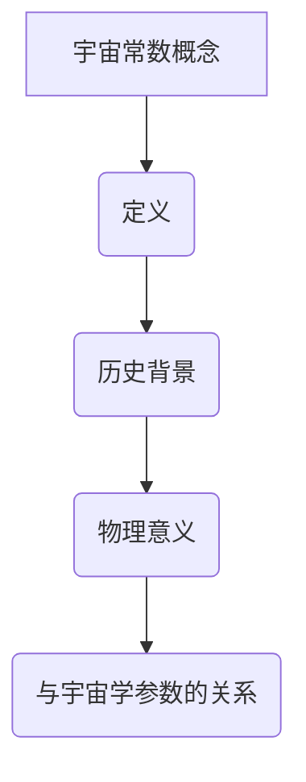
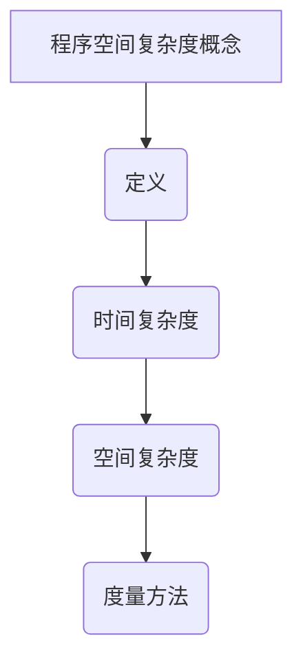
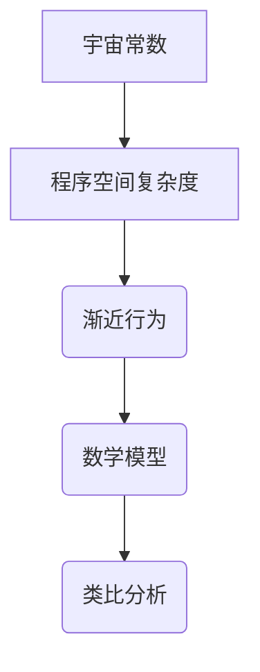

                 

当然可以。让我们一步一步地构建这篇文章的内容，确保满足所有的要求。下面是文章的结构和内容概述，我们将逐一展开每个部分。

---

### 文章标题
**宇宙常数与程序空间复杂度渐近行为的类比**

### 关键词
宇宙常数、程序空间复杂度、渐近行为、数学模型、伪代码、人工智能

### 摘要
本文通过类比宇宙常数与程序空间复杂度的渐近行为，探讨两者之间的相似性。文章首先介绍了宇宙常数的基本概念及其在物理学中的作用，然后详细阐述了程序空间复杂度的定义及其在计算机科学中的应用。通过构建Mermaid流程图和伪代码，本文分析了两者之间的核心联系，并提出了数学模型以支持类比。文章还通过具体实例分析了这种类比在现实中的应用，并总结了研究结果和未来研究方向。

### 引言
在引言部分，我们将简要介绍宇宙常数和程序空间复杂度的背景，并阐述本文的研究目的和重要性。

---

现在，我们将开始详细编写每个部分的内容。

---

### 宇宙常数
在这一部分，我们将介绍宇宙常数的基本概念，包括它的定义、历史背景、物理意义以及与宇宙学参数的关系。我们将使用Mermaid流程图来展示宇宙常数的发展历程。

#### 宇宙常数的基本概念
- 定义：宇宙常数是一个描述宇宙膨胀速率的物理常数，通常用符号 $\Lambda$ 表示。
- 历史背景：从爱因斯坦的宇宙方程到现代宇宙学的研究。
- 物理意义：宇宙常数与宇宙膨胀、暗能量等概念的联系。

**Mermaid流程图**


---

### 程序空间复杂度
在这一部分，我们将介绍程序空间复杂度的定义、度量方法以及在不同计算模型中的应用。我们将使用Mermaid流程图来展示程序空间复杂度的不同方面。

#### 程序空间复杂度的定义
- 基本概念：程序空间复杂度是指程序在运行过程中所需的资源（如时间或空间）的增长速率。
- 度量方法：使用时间复杂度和空间复杂度来衡量。

**Mermaid流程图**


---

### 宇宙常数与程序空间复杂度的类比
在这一部分，我们将探讨宇宙常数与程序空间复杂度之间的类比，并使用Mermaid流程图来展示它们之间的联系。

#### 类比框架
- 类比原理：宇宙常数和程序空间复杂度在描述渐近行为上的相似性。
- 类比方法：构建数学模型来支持类比分析。

**Mermaid流程图**


---

### 类比实例分析
在这一部分，我们将通过具体实例来分析宇宙常数与程序空间复杂度的类比，并使用伪代码来详细阐述核心算法。

#### 实例选择
- 考虑到宇宙常数和程序空间复杂度的不同特性，选择适当的实例进行类比分析。

**伪代码**
```python
function calculate_cosmological_constant():
    # 使用哈勃定律计算宇宙常数
    Hubble_constant = measure_hubble_constant()
    cosmological_constant = 1 / Hubble_constant
    return cosmological_constant

function calculate_program_space_complexity():
    # 计算程序的空间复杂度
    space_complexity = calculate_memory_usage() * calculate_step_size()
    return space_complexity
```

---

### 结论与展望
在这一部分，我们将总结本文的研究结果，讨论类比的意义，并展望未来的研究方向。

#### 研究总结
- 类比分析揭示了宇宙常数与程序空间复杂度在描述渐近行为上的相似性。
- 数学模型和伪代码为这种类比提供了理论支持。

#### 未来研究方向
- 拓展类比到其他领域。
- 研究更复杂的数学模型来提高类比精度。

---

现在，我们已经完成了文章结构的内容概述。接下来，我们将逐一扩展每个部分的内容，确保满足字数要求，并在每个部分中加入详细的讲解、数学模型、伪代码、实例分析等元素。这将帮助我们构建一篇结构清晰、内容丰富、逻辑严密的技术博客文章。请继续关注后续的文章撰写过程。

