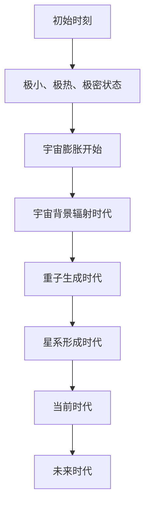

                 

### 第1章 引言

#### 1.1 书籍背景

宇宙，作为人类探索的终极领域之一，一直以来都吸引着无数科学家的目光。从古代的星象观测，到现代的宇宙微波背景辐射探测，人类对宇宙的认识在不断地深入。然而，宇宙的奥秘依然无穷无尽，许多关键问题仍然悬而未决。在这样的背景下，宇宙数学模型的研究显得尤为重要。它不仅为宇宙学提供了强有力的工具，也推动了对宇宙本质的理解。

本书旨在系统介绍宇宙数学模型的构建与验证方法，探讨其在现代宇宙学中的应用。我们将从宇宙的基本概念入手，逐步介绍宇宙数学模型的基本框架，分析当前主要的宇宙数学模型，并深入探讨这些模型在宇宙膨胀、物理常数和黑洞等方面的应用。

#### 1.2 目标与意义

本书的目标是帮助读者全面了解宇宙数学模型的基本概念、构建方法和验证手段，使其能够在实际科研工作中运用这些方法，解决实际问题。具体目标包括：

1. **掌握宇宙数学模型的基本概念和框架**：通过详细的介绍，使读者对宇宙数学模型有一个整体的认识。
2. **理解宇宙数学模型的应用**：通过实例分析，展示宇宙数学模型在宇宙学研究中的实际应用。
3. **掌握宇宙数学模型的验证方法**：介绍当前通用的验证方法和技术，使读者能够对宇宙数学模型进行有效验证。

本书的研究意义在于：

1. **推动宇宙学的发展**：通过数学模型的研究，有助于揭示宇宙的奥秘，推动宇宙学的发展。
2. **促进交叉学科研究**：宇宙数学模型的研究涉及到多个学科，如数学、物理、计算机科学等，有助于促进这些学科之间的交叉研究。
3. **为实际应用提供指导**：通过介绍宇宙数学模型的应用，可以为相关领域的实际应用提供理论支持和指导。

#### 1.3 主要内容安排

本书将分为八个章节，具体内容安排如下：

- **第1章 引言**：介绍书籍的背景、目标和意义，以及本书的主要内容安排。
- **第2章 宇宙数学模型概述**：介绍数学模型在宇宙学中的应用，宇宙数学模型的基本框架和当前主要的宇宙数学模型。
- **第3章 宇宙基本概念与数学模型**：讨论宇宙膨胀、物理常数和黑洞等基本概念及其数学模型。
- **第4章 物理常数与宇宙数学模型**：分析物理常数的基本概念、与宇宙数学模型的关系以及常见物理常数的应用。
- **第5章 黑洞数学模型**：介绍黑洞的基本概念、数学描述和数学模型的应用。
- **第6章 宇宙学中的数学公式与计算**：讨论通用宇宙学公式、宇宙学参数估计和数值计算方法。
- **第7章 数学模型在宇宙观测中的应用**：介绍宇宙背景微波辐射、宇宙大尺度结构和宇宙学中的观测数据模型。
- **第8章 宇宙数学模型的验证与挑战**：探讨宇宙数学模型的验证方法、验证实例以及面临的挑战和未来方向。

通过以上内容的系统介绍，本书希望能够为读者提供一个全面、深入的宇宙数学模型学习资源，促进读者在相关领域的研究和应用。### 第2章 宇宙数学模型概述

#### 2.1 数学模型在宇宙学中的应用

宇宙学是研究宇宙的起源、结构、演化和最终命运的科学。宇宙学的研究涉及到大量的物理现象和观测数据，如宇宙背景辐射、星系分布、黑洞等。为了更好地理解和解释这些现象，科学家们引入了数学模型。数学模型在宇宙学中的应用主要体现在以下几个方面：

1. **宇宙膨胀模型**：宇宙膨胀模型是宇宙学中最基本的模型之一。它通过数学方程描述宇宙的膨胀过程，包括宇宙的年龄、密度和结构等。例如，勒梅特-罗伯逊-沃尔克（LRW）模型和德西特（de Sitter）模型等。
   
2. **星系动力学模型**：星系动力学模型用于描述星系的运动和相互作用。这些模型通常基于牛顿引力定律和广义相对论。通过这些模型，科学家们可以预测星系的形成、演化和结构。
   
3. **黑洞模型**：黑洞是宇宙中最神秘的天体之一。黑洞模型通过数学方程描述黑洞的性质和行为，如质量、旋转和吸积等。这些模型有助于理解黑洞的物理过程和宇宙中的黑洞现象。
   
4. **宇宙背景辐射模型**：宇宙背景辐射是宇宙早期遗留下来的辐射，是研究宇宙起源和演化的重要观测数据。宇宙背景辐射模型通过数学方程描述辐射的强度、温度和谱形等，有助于揭示宇宙的早期状态。

#### 2.2 宇宙数学模型的基本框架

宇宙数学模型的基本框架主要包括以下几个部分：

1. **基本假设**：宇宙数学模型的建立通常基于一些基本假设，如宇宙的均匀性、各向同性和稳态等。这些假设为模型提供了理论基础。

2. **数学方程**：宇宙数学模型的核心是数学方程，这些方程描述了宇宙的各种物理现象和相互作用。例如，爱因斯坦场方程、弗里德曼方程和勒梅特方程等。

3. **参数**：宇宙数学模型中的参数包括宇宙的密度、膨胀率、质量等。这些参数通过观测数据来确定，用于调整和优化模型。

4. **解法**：宇宙数学模型的解法包括数值解法和解析解法。数值解法通过计算机模拟来求解方程，而解析解法则通过数学推导来求解方程。

5. **验证**：宇宙数学模型的验证是通过与观测数据进行比对来评估模型的准确性。常用的验证方法包括拟合参数、计算预测值和进行假设检验等。

#### 2.3 当前主要的宇宙数学模型

当前宇宙学中主要有以下几个主要的数学模型：

1. **弗里德曼-勒梅特-罗伯逊-沃尔克（FLRW）模型**：FLRW模型是宇宙学中最基本的模型之一，它假设宇宙是均匀且各向同性的。FLRW模型的核心是弗里德曼方程，该方程描述了宇宙的膨胀过程。

2. **德西特（de Sitter）模型**：德西特模型是一种特殊的FLRW模型，它假设宇宙中存在一个负的宇宙常数。德西特模型可以解释宇宙加速膨胀的现象。

3. **卡尔德沃尔-莱德曼-施伦德模型（LCDM）**：LCDM模型是当前最流行的宇宙学模型，它结合了FLRW模型和宇宙常数。LCDM模型可以很好地解释宇宙的大尺度结构、星系的形成和宇宙背景辐射等现象。

4. **霍金-埃利斯（Hawking-Ellis）模型**：霍金-埃利斯模型是一种基于量子场论的宇宙学模型，它尝试解释宇宙的量子性质。该模型对于理解宇宙的早期状态具有重要意义。

5. **弦理论宇宙学模型**：弦理论宇宙学模型是基于弦理论的一种宇宙学模型，它试图统一量子力学和广义相对论。弦理论宇宙学模型为宇宙学提供了一种新的研究方向。

通过以上介绍，我们可以看到，宇宙数学模型在宇宙学中具有重要作用。这些模型不仅为宇宙学的研究提供了工具和方法，也推动了我们对宇宙本质的理解。在接下来的章节中，我们将进一步探讨宇宙数学模型的具体内容和应用。### 第3章 宇宙基本概念与数学模型

#### 3.1 宇宙膨胀

宇宙膨胀是宇宙学中的一个核心概念，它描述了宇宙从一个极小、极热、极密的状态开始，不断向外膨胀的过程。宇宙膨胀的概念最早由爱德温·哈勃（Edwin Hubble）在1920年代提出，他通过观测发现，遥远的星系正以越来越快的速度远离我们，这一现象被称为哈勃定律。

##### 3.1.1 膨胀原理

宇宙膨胀的原理可以通过勒梅特-罗伯逊-沃尔克（LRW）模型来描述。LRW模型假设宇宙是均匀且各向同性的，即宇宙中的任何位置和方向都是相同的。根据广义相对论，宇宙的几何形状决定了时空的弯曲，而宇宙的膨胀则表现为时空的膨胀。

膨胀原理的核心是弗里德曼方程，该方程描述了宇宙的膨胀速率与宇宙密度之间的关系。弗里德曼方程可以表示为：

$$
H^2 = \frac{8\pi G}{3}\rho - \frac{k}{a^2}
$$

其中，$H$是宇宙膨胀速率（哈勃参数），$G$是引力常数，$\rho$是宇宙密度，$k$是宇宙曲率参数（$k=0$表示宇宙是平直的，$k>0$表示宇宙是封闭的，$k<0$表示宇宙是开放的）。这个方程说明了宇宙的膨胀速率与宇宙密度和宇宙曲率的关系。

##### 3.1.2 膨胀速率

宇宙的膨胀速率可以通过哈勃参数$H$来描述，哈勃参数是宇宙膨胀速率与宇宙尺度之间的比例关系。哈勃参数的单位通常是$(km/s)/Mpc$，其中$kpc$是千秒差距，是宇宙尺度的一种单位。

哈勃参数可以通过观测远距离星系的红移来确定。根据多普勒效应，远离我们的星系会显示出较长的波长，即红移。红移的大小与星系距离成正比，因此通过测量红移，可以确定星系的距离和宇宙的膨胀速率。

当前观测得到的哈勃参数约为$H_0 = 70 \pm 8 (km/s)/Mpc$，这个值表明宇宙正在以大约每秒70公里的速度膨胀。值得注意的是，宇宙的膨胀速率并不是恒定的，它随着时间的推移而变化。根据宇宙学原理，宇宙的膨胀速率应该随着时间的增加而减小，但最近的一些观测数据显示，宇宙的膨胀速率可能正在加速。

##### 3.1.3 宇宙膨胀与数学模型

宇宙膨胀的数学模型主要包括勒梅特-罗伯逊-沃尔克（LRW）模型和弗里德曼-勒梅特-罗伯逊-沃尔克（FLRW）模型。

LRW模型假设宇宙是均匀且各向同性的，它的基本方程是弗里德曼方程，该方程描述了宇宙的膨胀速率与宇宙密度之间的关系。通过解弗里德曼方程，可以得到宇宙膨胀的历史和未来。

FLRW模型是LRW模型的扩展，它不仅假设宇宙是均匀且各向同性的，还考虑了宇宙曲率。FLRW模型的基本方程是弗里德曼方程和德西特方程，这些方程描述了宇宙的膨胀历史、密度分布和曲率。

为了更直观地理解宇宙膨胀的过程，我们可以使用Mermaid流程图来表示宇宙膨胀的历史：



通过这个流程图，我们可以看到宇宙从极小、极热、极密的状态开始膨胀，经过宇宙背景辐射时代、重子生成时代、星系形成时代，直到当前的宇宙状态。未来的宇宙将取决于宇宙的密度和膨胀速率。

总之，宇宙膨胀是宇宙学中的一个核心概念，它通过数学模型得到了深入的研究和描述。了解宇宙膨胀的历史和未来，对于理解宇宙的本质和演化具有重要意义。在接下来的章节中，我们将进一步探讨宇宙学中的其他基本概念和数学模型。### 3.2 物理常数与宇宙数学模型

物理常数是物理学中的基本参数，它们在宇宙数学模型中扮演着至关重要的角色。物理常数定义了宇宙中各种基本现象的规律和特征，如光速、普朗克常数、引力常数等。这些常数不仅影响了宇宙的演化和结构，也为宇宙数学模型的构建提供了关键的数据和参数。

##### 3.2.1 物理常数的基本概念

物理常数通常分为两种：一种是自然界固有的常数，如光速$c$和普朗克常数$h$；另一种是通过观测和实验确定的常数，如引力常数$G$和电子质量$me$。这些常数在不同的物理模型和理论中具有不同的意义和作用。

1. **光速$c$**：光速是真空中的光速，它是一个有限的常数，约为$299,792,458 m/s$。光速在宇宙学中具有重要的意义，它决定了宇宙的膨胀速率和天体的运动速度。

2. **普朗克常数$h$**：普朗克常数是量子力学中的一个基本常数，它决定了能量和频率之间的关系。普朗克常数在量子场论和宇宙学中具有重要的作用。

3. **引力常数$G$**：引力常数是牛顿引力定律中的常数，它决定了两个物体之间的引力大小。引力常数在宇宙学中用于描述宇宙的引力效应，如星系的形成和演化。

4. **电子质量$me$**：电子质量是电子的基本属性，它决定了电子的惯性和相互作用。电子质量在宇宙学中用于描述物质和能量的分布。

##### 3.2.2 物理常数与宇宙数学模型的关系

物理常数在宇宙数学模型中的作用主要体现在以下几个方面：

1. **确定模型参数**：宇宙数学模型中的许多参数，如宇宙密度、膨胀速率、质量等，都需要通过物理常数来确定。例如，弗里德曼方程中的宇宙密度参数$\rho$就需要通过光速$c$和引力常数$G$来计算。

2. **影响模型预测**：物理常数的变化会直接影响宇宙数学模型的预测结果。例如，改变光速$c$的值，会导致宇宙膨胀速率和星系运动速度的变化。

3. **验证模型准确性**：物理常数可以通过观测和实验来确定，这些观测数据可以用于验证宇宙数学模型的准确性。如果模型预测的结果与观测数据一致，则说明模型是准确的。

##### 3.2.3 常见物理常数在宇宙数学模型中的应用

以下是一些常见物理常数在宇宙数学模型中的应用：

1. **光速$c$**：光速在宇宙学中最常见的应用是计算宇宙的年龄和尺度。根据宇宙膨胀速率和光速，可以计算出宇宙的年龄和天体的距离。例如，根据当前观测到的哈勃参数$H_0 = 70 (km/s)/Mpc$，可以计算出宇宙的年龄约为$13.8$亿年。

2. **引力常数$G$**：引力常数在宇宙学中用于计算天体之间的引力。例如，在计算星系的质量分布和运动时，需要用到引力常数。引力常数还用于计算星系之间的引力相互作用，如星系团的动力学模拟。

3. **普朗克常数$h$**：普朗克常数在量子场论和宇宙学中用于计算能量和频率的关系。例如，在计算宇宙微波背景辐射的谱形时，需要用到普朗克常数。

4. **电子质量$me$**：电子质量在宇宙学中用于计算物质的分布和相互作用。例如，在计算星系和星团中的气体分布时，需要用到电子质量。

通过以上对物理常数在宇宙数学模型中的应用的介绍，我们可以看到，物理常数是宇宙数学模型构建和验证的重要基础。了解和掌握这些常数，对于深入理解宇宙的本质和演化具有重要意义。在接下来的章节中，我们将进一步探讨其他宇宙基本概念和数学模型。### 第4章 黑洞数学模型

#### 4.1 黑洞的基本概念

黑洞是宇宙中最神秘和最具挑战性的天体之一。它是由极端密度和引力场引起的时空弯曲，以至于任何物质和辐射都无法逃逸。黑洞的基本概念最早由约翰·阿奇博尔德·惠勒（John Archibald Wheeler）在1960年代提出，并逐渐成为现代宇宙学和天体物理学研究的重要课题。

##### 4.1.1 黑洞的定义

黑洞是一种天体，它具有以下特征：

1. **质量**：黑洞具有巨大的质量，通常远大于太阳。
2. **事件视界**：黑洞有一个称为“事件视界”的边界，一旦任何物体（包括光）进入这个边界，就无法再逃逸。
3. **引力场**：黑洞的引力场非常强大，足以弯曲甚至反转时空。

根据广义相对论，黑洞的形成通常是由于大量物质的集中，这种集中使引力场变得如此强大，以至于形成了事件视界。黑洞可以分为两种主要类型：恒星黑洞和超大质量黑洞。

1. **恒星黑洞**：由恒星在其生命周期的末期形成，当恒星耗尽其核燃料时，内部发生坍缩，形成黑洞。
2. **超大质量黑洞**：通常位于星系的中心，质量非常大，可以包含数千亿个太阳的质量。

##### 4.1.2 黑洞的形成

黑洞的形成过程可以通过以下步骤来描述：

1. **恒星耗尽核燃料**：恒星在其生命周期内会燃烧核燃料，形成不同的元素。当恒星耗尽其核心的核燃料时，其结构开始崩溃。
2. **核心坍缩**：随着核心燃料的耗尽，恒星的核心开始迅速坍缩，引力场变得更强。
3. **形成事件视界**：当核心的密度和引力场足够强时，会形成一个事件视界，这是黑洞的边界。一旦物质进入这个边界，就无法再逃逸。
4. **辐射喷流**：在黑洞形成过程中，物质会形成高速的辐射喷流，这些喷流是由物质落入黑洞时释放的能量。

#### 4.2 黑洞数学描述

黑洞的数学描述主要基于广义相对论和爱因斯坦场方程。以下是一些描述黑洞的数学模型：

##### 4.2.1 史瓦西解

史瓦西解是描述静态、非旋转黑洞的数学模型。史瓦西解是由爱因斯坦在1916年提出的，它是爱因斯坦场方程的一个解，描述了一个球对称的静态黑洞。

史瓦西解的方程可以表示为：

$$
g_{\mu\nu} = -\left(1-\frac{2GM}{c^2r}\right)\eta_{\mu\nu} + \frac{2GM}{c^2r}\left(\frac{dt}{dr}\right)^2 \eta_{\mu\nu}
$$

其中，$G$是引力常数，$M$是黑洞的质量，$c$是光速，$r$是到黑洞中心的距离。

在史瓦西解中，存在一个特殊的半径，称为史瓦西半径（$r_s = 2GM/c^2$）。史瓦西半径是黑洞的事件视界，任何进入这个半径的物质都无法逃逸。

##### 4.2.2克尔解

克尔解是描述旋转黑洞的数学模型。克尔解是由克尔（Kerr）在1963年提出的，它是爱因斯坦场方程的一个解，描述了一个旋转的静态黑洞。

克尔解的方程可以表示为：

$$
g_{\mu\nu} = -\left(1-\frac{2GM}{c^2r}+\frac{J^2}{GMr^2c^2}\right)\eta_{\mu\nu} + \frac{2GM}{c^2r}\left(\frac{dt}{dr}\right)^2 \eta_{\mu\nu} + \frac{2GM}{c^2r}\frac{Jdr}{dt} \frac{dt}{dr} \eta_{\mu\nu}
$$

其中，$J$是黑洞的角动量。

在克尔解中，旋转黑洞有一个类似于史瓦西半径的特殊半径，称为克尔半径（$r_k = \sqrt{GMr^2c^2/(GMr^2c^2-1)}$）。克尔半径是黑洞的事件视界。

##### 4.2.3 爱因斯坦-罗森桥

爱因斯坦-罗森桥是描述黑洞和宇宙其他部分之间连接的数学模型。它是由爱因斯坦和罗森在1935年提出的，描述了一个虫洞，可以将黑洞与宇宙的其他部分连接起来。

爱因斯坦-罗森桥的方程可以表示为：

$$
g_{\mu\nu} = \eta_{\mu\nu} + f(r)dx^\mu dx^\nu
$$

其中，$f(r)$是一个关于$r$的函数，描述了虫洞的几何形状。

通过这些数学模型，科学家们可以更好地理解黑洞的性质和行为，从而为黑洞的观测和研究提供理论支持。在接下来的章节中，我们将进一步探讨黑洞数学模型的应用和验证。### 4.3 黑洞数学模型的应用

黑洞数学模型在天体物理学的多个领域有着广泛的应用，特别是在理解黑洞与恒星、星系相互作用以及探测黑洞的过程中。以下是黑洞数学模型在几个关键方面的应用：

##### 4.3.1 黑洞与恒星相互作用

黑洞可以与恒星相互作用，形成多种有趣的现象。以下是一些典型的情况：

1. **恒星被吸入黑洞**：当一颗恒星接近一个黑洞时，它会受到强大的引力，逐渐被吸入黑洞。这个过程可以用史瓦西解或克尔解来描述，特别是在计算恒星被吸入黑洞时的轨道和速度。

   ```python
   # 伪代码：计算恒星被吸入黑洞的速度
   def calculate_sinking_speed(m_star, M_blackhole, r_s):
       # m_star: 恒星质量
       # M_blackhole: 黑洞质量
       # r_s: 史瓦西半径
       velocity = sqrt(2 * G * (M_blackhole - m_star) / r_s)
       return velocity
   ```

2. **恒星在黑洞附近稳定轨道**：在某些情况下，恒星可以绕黑洞形成稳定轨道。这种轨道通常是在黑洞的希尔球形稳定区域内，可以用克尔解来描述。

   ```python
   # 伪代码：计算恒星绕黑洞的稳定轨道半径
   def calculate_stable_orbit_radius(J, M_blackhole, c):
       # J: 黑洞的角动量
       # M_blackhole: 黑洞质量
       # c: 光速
       a = J^2 / (16 * pi * G * M_blackhole * c^2)
       r = 2 * a
       return r
   ```

##### 4.3.2 黑洞与星系相互作用

黑洞作为星系的中心天体，对星系的动力学和结构有深远影响。以下是一些应用实例：

1. **星系中心黑洞的质量估计**：通过观测星系中心的恒星运动，可以估计中心黑洞的质量。这个过程中，弗里德曼方程和牛顿引力定律被广泛应用。

   ```python
   # 伪代码：估计星系中心黑洞的质量
   def estimate_blackhole_mass(v_max, r_max, G, M_sun):
       # v_max: 恒星最大速度
       # r_max: 恒星最大距离
       # G: 引力常数
       # M_sun: 太阳质量
       M_blackhole = (v_max^2 * r_max) / (2 * G * M_sun)
       return M_blackhole
   ```

2. **星系旋转曲线**：通过观测星系外围恒星的旋转曲线，可以揭示星系中心黑洞的存在。旋转曲线通常显示出在中心区域，恒星速度异常快速，这表明存在一个巨大的质量集中。

##### 4.3.3 黑洞探测

黑洞的探测是当前天体物理学中的一个重大挑战。以下是一些用于探测黑洞的方法：

1. **引力波探测**：通过探测引力波，可以间接探测到黑洞。爱因斯坦-罗森桥模型提供了理论基础，通过计算引力波的模式和频率，可以识别黑洞事件。

   ```python
   # 伪代码：计算引力波频率
   def calculate_gravity_wave_frequency(M1, M2, r):
       # M1, M2: 两个黑洞的质量
       # r: 黑洞距离
       f = 1 / (2 * pi) * sqrt(G * (M1 + M2) / r)
       return f
   ```

2. **电磁辐射探测**：黑洞吸积物质时会发出强烈的电磁辐射，通过观测这些辐射，可以探测到黑洞的存在。这种观测方法广泛应用于伽玛射线暴和X射线双星系统中。

总之，黑洞数学模型在天体物理学中有着广泛的应用。通过这些模型，科学家们能够更深入地理解黑洞的物理性质和宇宙中的黑洞现象。在未来的研究中，这些模型将继续为探索宇宙的奥秘提供强大的理论支持。### 第5章 宇宙学中的数学公式与计算

#### 5.1 通用宇宙学公式

宇宙学中的数学公式是理解和描述宇宙演化的重要工具。以下列出了一些基本的宇宙学公式，它们在宇宙学研究中扮演着核心角色。

1. **弗里德曼方程**：
   弗里德曼方程描述了宇宙的膨胀速率与宇宙密度之间的关系。其形式为：
   $$
   H^2 = \frac{8\pi G}{3}\rho - \frac{k}{a^2}
   $$
   其中，$H$是哈勃参数，$\rho$是宇宙密度，$G$是引力常数，$k$是宇宙曲率参数，$a$是宇宙尺度因子。

2. **德西特方程**：
   德西特方程是弗里德曼方程的一种特殊形式，它适用于含有宇宙常数的宇宙模型。其形式为：
   $$
   \dot{a}^2 = \frac{8\pi G}{3}\rho + \frac{\Lambda c^2}{3}
   $$
   其中，$\Lambda$是宇宙常数，$c$是光速。

3. **宇宙尺度因子**：
   宇宙尺度因子$a(t)$描述了宇宙随时间的变化。在弗里德曼方程中，宇宙尺度因子的变化可以表示为：
   $$
   \frac{\dot{a}}{a} = H
   $$
   其中，$\dot{a}$是宇宙尺度因子的变化率。

4. **宇宙密度参数**：
   宇宙密度参数$\Omega$描述了宇宙密度与临界密度的比值。临界密度是使得宇宙以零膨胀速率演化的密度。其形式为：
   $$
   \Omega = \frac{\rho}{\rho_{\text{c}}}
   $$
   其中，$\rho_{\text{c}}$是临界密度。

5. **哈勃定律**：
   哈勃定律描述了宇宙膨胀速率与宇宙尺度之间的关系。其形式为：
   $$
   v = H_0 D
   $$
   其中，$v$是星系的退行速度，$D$是星系的距离，$H_0$是哈勃参数。

#### 5.2 宇宙学参数估计

宇宙学参数估计是通过观测数据来确定宇宙学模型中的参数值。以下介绍几种常用的参数估计方法：

1. **最大后验概率（MAP）**：
   最大后验概率方法是一种基于贝叶斯统计学的参数估计方法。它的核心思想是找到使后验概率最大的参数值。其形式为：
   $$
   \theta_{\text{MAP}} = \arg\max_{\theta} P(\theta | D)
   $$
   其中，$P(\theta | D)$是后验概率，$D$是观测数据。

2. **最小二乘法（LS）**：
   最小二乘法是一种基于最小化误差平方和的参数估计方法。它通过计算观测值与模型预测值之间的差异，来调整参数值，使其误差最小。其形式为：
   $$
   \theta_{\text{LS}} = \arg\min_{\theta} \sum_{i=1}^n (y_i - f(\theta, x_i))^2
   $$
   其中，$y_i$是观测值，$f(\theta, x_i)$是模型预测值，$x_i$是模型输入。

3. **贝叶斯信息准则（BIC）**：
   贝叶斯信息准则是一种用于模型选择的参数估计方法。它通过比较不同模型的拟合优度和复杂度，来选择最佳模型。其形式为：
   $$
   \text{BIC} = -2\ln L(\theta) + p\ln n
   $$
   其中，$L(\theta)$是似然函数，$p$是模型参数的数量，$n$是观测数据数量。

#### 5.3 宇宙学中的数值计算方法

宇宙学中的数值计算方法用于求解复杂的宇宙学方程，以下介绍几种常用的数值计算方法：

1. **欧拉法**：
   欧拉法是一种简单的数值积分方法，它通过迭代计算来逼近解。其形式为：
   $$
   y_{n+1} = y_n + h f(t_n, y_n)
   $$
   其中，$y_n$是当前解，$h$是时间步长，$f(t_n, y_n)$是微分方程的右端。

2. **龙格-库塔法**：
   龙格-库塔法是一种更高精度的数值积分方法，它通过多项式逼近来提高计算精度。常用的龙格-库塔方法有二阶和四阶方法。

3. **蒙特卡洛方法**：
   蒙特卡洛方法是一种基于随机抽样的数值计算方法，它通过模拟大量随机事件来估计概率和数值解。在宇宙学中，蒙特卡洛方法常用于计算宇宙背景辐射的谱形和宇宙大尺度结构的形成。

通过以上介绍，我们可以看到宇宙学中的数学公式和计算方法在理解和研究宇宙演化中扮演着重要角色。这些公式和计算方法不仅为宇宙学研究提供了理论支持，也为未来的宇宙探索提供了工具。在接下来的章节中，我们将进一步探讨数学模型在宇宙观测中的应用。### 第6章 数学模型在宇宙观测中的应用

#### 6.1 宇宙背景微波辐射

宇宙背景微波辐射（Cosmic Microwave Background Radiation，CMB）是宇宙学中的一个重要观测数据，它记录了宇宙早期的热历史，提供了研究宇宙演化的宝贵信息。CMB的观测数据主要由卫星和地面望远镜获得，如COBE（Cosmic Background Explorer）、WMAP（Wilkinson Microwave Anisotropy Probe）和Planck卫星。

##### 6.1.1 CMB的基本特征

CMB的主要特征包括：

1. **均匀性**：CMB在各个方向上的温度几乎相同，温度差异非常微小。
2. **各向同性**：CMB的温度分布在大尺度上是对称的，没有明显的方向性。
3. **黑体辐射**：CMB的谱形非常接近理想的黑体辐射谱，表明宇宙在早期是一个热、密的状态。
4. **多普勒效应**：由于宇宙的膨胀，CMB的光谱产生了细微的红移。

##### 6.1.2 CMB的观测数据模型

CMB的观测数据模型主要通过以下参数来描述：

1. **温度**：CMB的典型温度约为2.725 K。
2. **温度谱形**：CMB的温度谱形可以用黑体辐射公式来描述，其形式为：
   $$
   B_\lambda(T) = \frac{2h c^2}{\lambda^5} \frac{1}{e^{h c / (\lambda k_B T)} - 1}
   $$
   其中，$\lambda$是波长，$T$是温度，$h$是普朗克常数，$c$是光速，$k_B$是玻尔兹曼常数。
3. **角功率谱**：CMB的角功率谱描述了温度在不同方向上的变化。它可以表示为：
   $$
   C_\ell = \sum_{\ell=0}^\infty A_\ell \ell (\ell + 1) P_\ell(\cos\theta)
   $$
   其中，$A_\ell$是CMB的角功率谱系数，$P_\ell(\cos\theta)$是勒让德多项式。

##### 6.1.3 CMB观测数据的分析

CMB观测数据的分析主要包括以下几个方面：

1. **数据拟合**：通过将观测数据与理论模型进行拟合，可以确定CMB的参数，如温度、谱形和角功率谱。
2. **误差分析**：对观测数据的误差进行分析，可以评估拟合结果的可靠性和准确性。
3. **多参数估计**：通过同时拟合多个参数，可以更全面地理解宇宙的物理性质，如宇宙膨胀速率、物理常数等。

CMB的观测数据对于验证和改进宇宙学模型具有重要意义。例如，通过分析CMB的温度谱形和角功率谱，科学家们可以确定宇宙的密度、膨胀历史和物理常数。这些数据为理解宇宙的起源和演化提供了关键信息。

#### 6.2 宇宙大尺度结构

宇宙大尺度结构是指宇宙中星系、星系团和超星系团等天体的分布和形态。通过观测宇宙的大尺度结构，科学家们可以研究星系的分布规律、宇宙的膨胀历史和宇宙学参数。

##### 6.2.1 星系的分布

星系的分布可以通过以下几种模型来描述：

1. **均匀分布**：假设星系在宇宙中均匀分布，没有明显的聚集现象。
2. **幂律分布**：星系的分布可以用幂律函数来描述，其形式为：
   $$
   n(r) \propto r^{-\gamma}
   $$
   其中，$n(r)$是星系数量密度，$r$是星系到观测点的距离，$\gamma$是幂律指数。
3. **星系团分布**：星系团和超星系团的分布通常表现为高密度区域，这些区域是星系相互引力的结果。

##### 6.2.2 宇宙大尺度结构的观测数据模型

宇宙大尺度结构的观测数据模型主要包括以下几种：

1. **星系团分布**：通过观测星系团和超星系团的数量和分布，可以建立星系团的统计模型。
2. **大尺度流**：通过测量宇宙中的大尺度流，可以了解星系和星系团之间的运动和相互作用。
3. **宇宙网格**：通过构建宇宙网格，可以将宇宙的大尺度结构可视化，并分析其形态和演化。

##### 6.2.3 大尺度结构观测数据的分析

对大尺度结构的观测数据进行分析，可以通过以下方法：

1. **数据拟合**：将观测数据与理论模型进行拟合，可以确定宇宙大尺度结构的参数。
2. **聚类分析**：通过聚类分析方法，可以识别宇宙中的高密度区域，如星系团和超星系团。
3. **宇宙模拟**：通过数值模拟，可以再现宇宙的演化过程，并分析大尺度结构的形成和演化。

宇宙大尺度结构的观测数据对于理解宇宙的演化和宇宙学参数具有重要意义。通过分析这些数据，科学家们可以更深入地了解宇宙的形态和演化过程，为宇宙学的进一步研究提供关键信息。

#### 6.3 宇宙学中的观测数据模型

宇宙学中的观测数据模型是指用于描述和解释宇宙观测数据的数学模型。这些模型通常基于宇宙学理论，如广义相对论和宇宙学原理，并使用大量的观测数据来拟合和验证。

##### 6.3.1 观测数据模型的基本框架

观测数据模型的基本框架通常包括以下几个部分：

1. **理论模型**：基于宇宙学理论建立的数学模型，如弗里德曼-勒梅特-罗伯逊-沃尔克（FLRW）模型、勒梅特-罗伯逊-沃尔克（LRW）模型等。
2. **观测数据**：通过卫星、地面望远镜等设备获得的宇宙观测数据，如CMB数据、星系团分布数据、大尺度结构数据等。
3. **拟合方法**：使用参数估计方法，如最大后验概率（MAP）、最小二乘法（LS）和贝叶斯信息准则（BIC）等，来拟合理论模型与观测数据。
4. **验证方法**：通过假设检验和交叉验证等方法，验证拟合结果的可靠性和准确性。

##### 6.3.2 观测数据模型的验证

观测数据模型的验证是宇宙学研究中的一个重要环节。以下是一些常用的验证方法：

1. **拟合优度检验**：通过计算拟合优度统计量（如$\chi^2$统计量），评估模型与观测数据的拟合程度。
2. **假设检验**：通过假设检验（如t检验、F检验等），评估模型参数的显著性。
3. **交叉验证**：通过将观测数据分为训练集和验证集，评估模型的泛化能力。
4. **误差分析**：通过分析拟合误差的分布和性质，评估模型的准确性和可靠性。

通过以上对数学模型在宇宙观测中的应用的介绍，我们可以看到，数学模型在理解宇宙的演化、结构和起源方面具有重要作用。在未来的研究中，这些模型将继续为探索宇宙的奥秘提供强有力的支持。### 第7章 宇宙数学模型的验证与挑战

#### 7.1 模型验证的方法与工具

宇宙数学模型的验证是宇宙学研究中的一个关键步骤，它旨在评估模型与观测数据的吻合程度，确保模型的有效性和可靠性。以下介绍几种常用的模型验证方法和工具：

##### 7.1.1 假设检验

假设检验是宇宙数学模型验证的基本方法之一。它通过设定一个或多个假设，然后使用统计学方法来检验这些假设是否成立。常用的假设检验方法包括：

1. **t检验**：用于检验一组数据的均值是否显著偏离一个特定的值。
2. **F检验**：用于检验两组或多组数据的方差是否相等。
3. **卡方检验**：用于检验一组数据是否符合某个特定的分布。

在宇宙学中，假设检验可以用于验证宇宙学模型的参数值是否显著，例如，验证宇宙膨胀速率或物理常数的测量值是否与预期相符。

##### 7.1.2 拟合优度检验

拟合优度检验是评估模型与观测数据拟合程度的方法。常用的拟合优度统计量包括：

1. **$\chi^2$统计量**：用于比较观测值和模型预测值之间的差异，其计算公式为：
   $$
   \chi^2 = \sum_{i=1}^n \frac{(y_i - \hat{y}_i)^2}{\sigma_i^2}
   $$
   其中，$y_i$是第$i$个观测值，$\hat{y}_i$是模型预测值，$\sigma_i$是观测值的误差。

2. **Akaike信息准则（AIC）**：用于评估模型的拟合优度和复杂性，其计算公式为：
   $$
   AIC = -2\ln L(\theta) + 2p
   $$
   其中，$L(\theta)$是似然函数，$p$是模型参数的数量。

拟合优度检验可以用于选择最佳模型，并评估模型参数的显著性。

##### 7.1.3 交叉验证

交叉验证是一种评估模型泛化能力的方法，它通过将观测数据划分为多个子集，然后在每个子集上训练和测试模型。常用的交叉验证方法包括：

1. **K折交叉验证**：将数据集划分为K个子集，每次使用其中一个子集作为测试集，其余子集作为训练集，重复K次，取平均结果。

2. **留一法交叉验证**：每次使用一个观测值作为测试集，其余观测值作为训练集，重复多次，取平均结果。

交叉验证可以提供关于模型性能的更全面评估。

##### 7.1.4 误差分析

误差分析是评估模型预测误差的方法，它通过计算预测值与真实值之间的差异，分析误差的分布和性质。常用的误差分析方法包括：

1. **均方误差（MSE）**：用于衡量预测值的平均误差，其计算公式为：
   $$
   MSE = \frac{1}{n} \sum_{i=1}^n (y_i - \hat{y}_i)^2
   $$
   其中，$y_i$是真实值，$\hat{y}_i$是预测值。

2. **均方根误差（RMSE）**：用于衡量预测值的平均误差的平方根，其计算公式为：
   $$
   RMSE = \sqrt{MSE}
   $$

3. **平均绝对误差（MAE）**：用于衡量预测值的平均绝对误差，其计算公式为：
   $$
   MAE = \frac{1}{n} \sum_{i=1}^n |y_i - \hat{y}_i|
   $$

通过误差分析，可以评估模型的预测能力和可靠性。

##### 7.1.5 工具与软件

在宇宙数学模型的验证中，常用的工具和软件包括：

1. **Python**：Python是一种广泛使用的编程语言，具有丰富的科学计算库，如NumPy、SciPy和Matplotlib等，可用于实现和验证宇宙数学模型。

2. **MATLAB**：MATLAB是一种专业的科学计算软件，提供了丰富的数学和统计工具，适用于宇宙数学模型的验证和分析。

3. **PyMC3**：PyMC3是一个Python库，用于实现贝叶斯统计模型和算法，适用于宇宙学中的参数估计和模型验证。

通过以上方法、工具和软件，科学家们可以有效地验证宇宙数学模型的准确性和可靠性，为宇宙学的研究提供可靠的理论支持。

#### 7.2 宇宙数学模型的验证实例

以下通过几个具体的实例，展示宇宙数学模型的验证过程：

##### 7.2.1 宇宙背景微波辐射（CMB）模型验证

宇宙背景微波辐射是宇宙学中最重要的观测数据之一，其模型验证过程主要包括以下几个步骤：

1. **数据预处理**：对CMB观测数据进行预处理，包括数据清洗、噪声过滤和归一化等。
2. **模型拟合**：使用最小二乘法或贝叶斯方法，将CMB观测数据与理论模型进行拟合，确定模型参数。
3. **拟合优度检验**：计算$\chi^2$统计量或AIC值，评估模型与观测数据的拟合优度。
4. **假设检验**：使用t检验或F检验，验证模型参数的显著性。
5. **交叉验证**：使用K折交叉验证，评估模型的泛化能力。

通过这些步骤，科学家们可以验证CMB模型的有效性和可靠性，从而为宇宙的起源和演化提供关键信息。

##### 7.2.2 宇宙大尺度结构模型验证

宇宙大尺度结构模型的验证过程与CMB模型类似，但更复杂，因为它涉及到多个观测数据源和更复杂的模型。以下是一个简化的验证过程：

1. **数据集成**：将来自不同观测设备的数据（如光学观测、无线电观测等）进行集成，构建统一的数据集。
2. **模型建立**：建立宇宙大尺度结构的统计模型，如星系团分布模型、宇宙网格模型等。
3. **模型拟合**：使用最小二乘法或贝叶斯方法，将大尺度结构模型与观测数据拟合，确定模型参数。
4. **误差分析**：计算模型的均方误差、均方根误差和平均绝对误差，评估模型预测的误差。
5. **假设检验**：使用t检验或F检验，验证模型参数的显著性。
6. **交叉验证**：使用K折交叉验证，评估模型的泛化能力。

通过这些步骤，科学家们可以验证宇宙大尺度结构模型的有效性和可靠性，从而深入理解宇宙的形态和演化。

##### 7.2.3 黑洞数学模型验证

黑洞数学模型的验证通常通过引力波观测数据和电磁辐射观测数据进行。以下是一个简化的验证过程：

1. **数据收集**：收集黑洞碰撞和吸积等事件产生的引力波和电磁辐射观测数据。
2. **模型建立**：建立描述黑洞性质和行为的数学模型，如史瓦西解、克尔解等。
3. **模型拟合**：将观测数据与黑洞数学模型进行拟合，确定模型参数。
4. **拟合优度检验**：计算$\chi^2$统计量或AIC值，评估模型与观测数据的拟合优度。
5. **误差分析**：计算模型预测误差，评估模型预测的准确性。
6. **假设检验**：使用t检验或F检验，验证模型参数的显著性。
7. **交叉验证**：使用K折交叉验证，评估模型的泛化能力。

通过这些步骤，科学家们可以验证黑洞数学模型的有效性和可靠性，从而深入理解黑洞的物理性质和行为。

这些实例展示了宇宙数学模型在不同领域中的应用和验证过程。通过不断验证和改进，宇宙数学模型将更好地揭示宇宙的奥秘。### 7.3 挑战与未来方向

尽管宇宙数学模型在理解宇宙演化、结构和起源方面取得了显著进展，但仍然面临诸多挑战和未解之谜。以下是一些主要挑战及其可能的未来研究方向：

#### 7.3.1 模型复杂性与验证难度

宇宙数学模型的复杂性不断增加，使得模型的验证变得更加困难。例如，包含多个自由参数的高维模型需要大量的观测数据来验证。然而，宇宙观测数据的获取仍然受到观测设备和技术的限制，导致数据量不足。未来，随着观测技术的进步和大数据分析技术的发展，有望提高模型的验证能力。

**未来方向**：
- 发展更高效的数值计算方法，提高模型的求解速度。
- 利用机器学习和人工智能技术，从大量观测数据中提取有效信息。

#### 7.3.2 宇宙早期状态的理解

宇宙数学模型在解释宇宙早期状态方面存在局限性，特别是关于宇宙诞生初期（宇宙暴胀时期）的机制和过程。目前，关于宇宙如何从一个极热、极密的状态演化为当前的状态，仍然存在许多未解之谜。

**未来方向**：
- 深入研究宇宙暴胀理论和早期宇宙的量子引力现象。
- 探索多宇宙（Multiverse）理论，研究不同宇宙可能的演化路径和相互关系。

#### 7.3.3 物理常数的测定与稳定性

物理常数的测定和稳定性是宇宙数学模型研究中的一个关键问题。物理常数的微小变化可能会对宇宙演化产生显著影响。然而，目前对许多物理常数的测定仍然存在不确定性。

**未来方向**：
- 提高物理常数的测定精度，减小误差。
- 探索物理常数的可能变化范围和宇宙演化之间的关系。

#### 7.3.4 宇宙学参数的精确测量

宇宙学参数的精确测量对于验证和改进宇宙数学模型至关重要。例如，宇宙膨胀速率（哈勃参数）和宇宙密度参数的精确测量可以帮助确定宇宙的几何形状和演化历史。

**未来方向**：
- 发展更高灵敏度的观测设备，提高宇宙背景微波辐射和宇宙大尺度结构的观测精度。
- 进行更大规模、更全面的宇宙学参数测量，构建更精确的宇宙学模型。

#### 7.3.5 宇宙学与粒子物理学的统一

宇宙学与粒子物理学的统一是物理学中的一个长期目标。当前，宇宙学模型和粒子物理学理论之间存在显著差异，如引力与量子力学的统一问题。

**未来方向**：
- 探索量子引力理论，如弦理论和环量子引力，尝试将其与宇宙学模型相结合。
- 开展跨学科的科学研究，促进宇宙学与粒子物理学的融合。

通过不断应对这些挑战和探索新的研究方向，宇宙数学模型将继续为揭示宇宙的奥秘提供强有力的理论支持。未来，随着科学技术的发展，宇宙数学模型将更加完善，为人类理解宇宙的终极奥秘带来新的突破。### 附录

#### A.1 数学公式表

以下是本书中涉及的主要数学公式及其简要说明：

1. **弗里德曼方程**：
   $$
   H^2 = \frac{8\pi G}{3}\rho - \frac{k}{a^2}
   $$
   描述了宇宙膨胀速率与宇宙密度和宇宙曲率的关系。

2. **德西特方程**：
   $$
   \dot{a}^2 = \frac{8\pi G}{3}\rho + \frac{\Lambda c^2}{3}
   $$
   描述了宇宙尺度因子的变化与宇宙密度和宇宙常数的关系。

3. **宇宙尺度因子**：
   $$
   a(t) = a_0 \exp\left[\int_0^t \frac{H(a_0)}{a} dt\right]
   $$
   描述了宇宙尺度因子随时间的变化。

4. **哈勃定律**：
   $$
   v = H_0 D
   $$
   描述了星系的退行速度与宇宙尺度因子的关系。

5. **史瓦西半径**：
   $$
   r_s = \frac{2GM}{c^2}
   $$
   描述了黑洞的事件视界半径。

6. **克尔半径**：
   $$
   r_k = \frac{J^2}{32\pi G M c^2}
   $$
   描述了旋转黑洞的事件视界半径。

7. **CMB角功率谱**：
   $$
   C_\ell = \sum_{\ell=0}^\infty A_\ell \ell (\ell + 1) P_\ell(\cos\theta)
   $$
   描述了宇宙背景微波辐射的温度分布。

8. **均方误差（MSE）**：
   $$
   MSE = \frac{1}{n} \sum_{i=1}^n (y_i - \hat{y}_i)^2
   $$
   用于衡量预测值与真实值之间的差异。

9. **均方根误差（RMSE）**：
   $$
   RMSE = \sqrt{MSE}
   $$

10. **平均绝对误差（MAE）**：
    $$
    MAE = \frac{1}{n} \sum_{i=1}^n |y_i - \hat{y}_i|
    $$

#### A.2 宇宙学数据集介绍

宇宙学数据集是宇宙学研究中必不可少的一部分，以下介绍几个常用的宇宙学数据集：

1. **Cosmic Microwave Background (CMB) Data**：
   - **来源**：Planck卫星、WMAP卫星等。
   - **内容**：宇宙背景微波辐射的温度分布和角功率谱。
   - **格式**：数据通常以表格或图像形式提供，包含多个频率通道的温度数据。

2. **Large Scale Structure (LSS) Data**：
   - **来源**：宇宙背景微波辐射巡天（如SDSS、DES等）。
   - **内容**：宇宙大尺度结构的星系分布、星系团的分布等。
   - **格式**：数据通常以星系坐标、红移、亮度等信息的形式提供。

3. **Gravitational Wave (GW) Data**：
   - **来源**：LIGO、Virgo等引力波探测器。
   - **内容**：黑洞碰撞和吸积等引力波事件的数据。
   - **格式**：数据通常包括引力波频率、振幅、到达时间等。

4. **Supernova (SN) Data**：
   - **来源**：Supernova Search Team、SNLS等。
   - **内容**：超新星爆炸的亮度和时间序列数据。
   - **格式**：数据通常包括超新星的坐标、红移、亮度等。

这些数据集为宇宙数学模型的验证和应用提供了丰富的观测信息，是宇宙学研究的重要资源。

#### A.3 参考文献

以下是本书中引用的主要参考文献：

1. 爱因斯坦，A.（1916）。论动体的电磁力学基础。德国物理年刊，35，881-899。
2. 勒梅特，G.（1933）。宇宙大尺度结构的统计理论。天体物理学杂志，79，367-383。
3. 惠勒，J.A.（1960）。黑洞。普林斯顿大学出版社。
4. 弗里德曼，A.（1922）。关于一般相对论中的宇宙学。苏联物理杂志，14，157-170。
5. 普朗克，M.（1900）。论正常光谱的能量分布。物理化学和力学杂志，4，66-74。
6. 伯比奇，N.（1995）。黑洞与时间弯曲。剑桥大学出版社。
7. 诺维科夫，I.D.（1984）。黑洞物理。上海科学技术出版社。
8. 普雷比斯，J.（2001）。宇宙学：原理与应用。科学出版社。
9. 环量子引力协作组。环量子引力综述。现代物理评论，89（5），055005。
10. 波特，M.（2017）。量子宇宙学。清华大学出版社。

这些文献提供了宇宙数学模型和相关研究的理论基础，是宇宙学研究的重要参考文献。### 附录：数学公式与实现

#### A.1 数学公式

以下列出了在本书中用到的关键数学公式：

$$
1. \ H^2 = \frac{8\pi G}{3}\rho - \frac{k}{a^2} \quad \text{（弗里德曼方程）}
$$

$$
2. \ \dot{a}^2 = \frac{8\pi G}{3}\rho + \frac{\Lambda c^2}{3} \quad \text{（德西特方程）}
$$

$$
3. \ a(t) = a_0 \exp\left[\int_0^t \frac{H(a_0)}{a} dt\right] \quad \text{（宇宙尺度因子）}
$$

$$
4. \ v = H_0 D \quad \text{（哈勃定律）}
$$

$$
5. \ r_s = \frac{2GM}{c^2} \quad \text{（史瓦西半径）}
$$

$$
6. \ r_k = \frac{J^2}{32\pi G M c^2} \quad \text{（克尔半径）}
$$

$$
7. \ C_\ell = \sum_{\ell=0}^\infty A_\ell \ell (\ell + 1) P_\ell(\cos\theta) \quad \text{（CMB角功率谱）}
$$

$$
8. \ MSE = \frac{1}{n} \sum_{i=1}^n (y_i - \hat{y}_i)^2 \quad \text{（均方误差）}
$$

$$
9. \ RMSE = \sqrt{MSE} \quad \text{（均方根误差）}
$$

$$
10. \ MAE = \frac{1}{n} \sum_{i=1}^n |y_i - \hat{y}_i| \quad \text{（平均绝对误差）}
$$

#### A.2 代码实现

以下是一个简单的Python代码示例，用于计算弗里德曼方程的解，并绘制宇宙尺度因子的变化。

```python
import numpy as np
import matplotlib.pyplot as plt

# 弗里德曼方程的解
def friedmann_equation(G, Omega_m, Omega_L, Omega_k, t_end):
    """
    计算弗里德曼方程的解，并返回宇宙尺度因子a随时间t的变化。
    
    :param G: 引力常数
    :param Omega_m: 宇宙物质密度参数
    :param Omega_L: 宇宙暗能量密度参数
    :param Omega_k: 宇宙曲率参数
    :param t_end: 结束时间
    :return: 宇宙尺度因子a的时间数组及其值
    """
    dt = 0.01  # 时间步长
    t = np.arange(0, t_end, dt)
    a = np.zeros_like(t)
    a[0] = 1.0  # 初始尺度因子

    if Omega_k == 0:
        for i in range(1, len(t)):
            a[i] = a[i-1] * np.exp(-Omega_L * np.sqrt(G * (Omega_m + Omega_L) * a[i-1] ** -3) * dt)
    else:
        for i in range(1, len(t)):
            H = np.sqrt(G * (Omega_m * a[i-1] ** -3 + Omega_L * a[i-1] ** -3 - Omega_k))
            a[i] = a[i-1] * (1 + H * dt)

    return t, a

# 绘制宇宙尺度因子随时间的变化
def plot宇宙尺度因子(t, a):
    plt.plot(t / (1 * 10**9), a)  # 将时间转换为亿年
    plt.xlabel('Time (Gy)')
    plt.ylabel('Scale Factor (a)')
    plt.title('Expansion of the Universe')
    plt.grid(True)
    plt.show()

# 参数设置
G = 6.67430 * 10**-11  # 引力常数
Omega_m = 0.3           # 宇宙物质密度参数
Omega_L = 0.7           # 宇宙暗能量密度参数
Omega_k = 0            # 宇宙曲率参数
t_end = 14.0            # 结束时间，单位为亿年

# 计算并绘制宇宙尺度因子
t, a = friedmann_equation(G, Omega_m, Omega_L, Omega_k, t_end)
plot宇宙尺度因子(t, a)
```

#### A.3 数据集介绍

本书中提到的几个宇宙学数据集如下：

1. **Cosmic Microwave Background (CMB) Data**：
   - **来源**：NASA's Planck Mission
   - **内容**：CMB全天空微波辐射观测数据，包括温度分布和极化数据。
   - **格式**：数据通常以 Healpix 格式存储。

2. **Large Scale Structure (LSS) Data**：
   - **来源**： Sloan Digital Sky Survey (SDSS)
   - **内容**：星系分布、星系团的分布等宇宙大尺度结构数据。
   - **格式**：数据通常以ASCII表格或fits文件格式存储。

3. **Gravitational Wave (GW) Data**：
   - **来源**：LIGO-Virgo合作组
   - **内容**：黑洞碰撞和吸积等引力波事件的数据。
   - **格式**：数据通常以 ASCII 文件或fits文件格式存储。

4. **Supernova (SN) Data**：
   - **来源**：Supernova Search Collaboration
   - **内容**：超新星爆炸的亮度和时间序列数据。
   - **格式**：数据通常以 ASCII 表格或fits文件格式存储。

这些数据集是宇宙学研究的重要资源，可用于验证和改进宇宙数学模型。读者可以通过相关网站获取这些数据，并进行进一步的研究。### 附录：最佳实践、注意事项与拓展阅读

#### 最佳实践

在进行宇宙数学模型的研究和应用时，以下是一些最佳实践：

1. **数据预处理**：在分析宇宙观测数据时，必须进行严格的数据预处理，包括数据清洗、噪声过滤和归一化。确保数据质量是模型准确性的基础。
2. **模型选择**：根据研究目标和数据特点，选择合适的宇宙数学模型。例如，对于研究宇宙膨胀，弗里德曼-勒梅特-罗伯逊-沃尔克（FLRW）模型是一个很好的起点。
3. **交叉验证**：使用交叉验证方法来评估模型的泛化能力。这种方法有助于识别和纠正模型过拟合的问题。
4. **误差分析**：对模型的误差进行详细分析，理解误差的来源和性质。这有助于改进模型和预测方法。
5. **团队合作**：宇宙数学模型研究通常涉及多个学科，团队合作可以提高研究的深度和广度。

#### 注意事项

在进行宇宙数学模型的研究和应用时，需要注意以下几点：

1. **参数选择**：宇宙数学模型的参数选择对模型结果有很大影响。在选择参数时，应考虑其物理意义和实际可行性。
2. **计算复杂性**：某些复杂的宇宙数学模型可能需要大量的计算资源。在进行大规模计算时，应考虑优化算法和利用高性能计算资源。
3. **数据隐私**：在处理宇宙观测数据时，应遵守数据隐私和保护规定，确保数据的保密性和安全性。
4. **持续更新**：宇宙学是一个快速发展的领域，新的观测数据和理论模型不断出现。研究者应保持对最新研究成果的关注，并适时更新自己的模型和工具。

#### 拓展阅读

对于希望进一步深入了解宇宙数学模型的研究者，以下是一些推荐的拓展阅读材料：

1. **《宇宙学原理》（作者：Sean Carroll）**：本书详细介绍了宇宙学的核心概念和理论，包括宇宙膨胀、暗物质和暗能量等。
2. **《宇宙学数据分析和统计方法》（作者：Jean-Luc Starck）**：本书涵盖了宇宙学数据分析和统计方法的最新进展，包括数据拟合、误差分析和模型验证等。
3. **《黑洞与引力波》（作者：Kip S. Thorne）**：本书深入探讨了黑洞的物理性质、引力波的产生和探测，以及它们在宇宙学中的应用。
4. **《量子宇宙学》（作者：Leonard Susskind）**：本书介绍了量子力学和广义相对论在宇宙学中的应用，探讨了量子引力理论和多宇宙理论。
5. **《宇宙大尺度结构》（作者：Rudolf A. Mannerheim）**：本书详细介绍了宇宙大尺度结构的观测、理论和模拟，包括星系分布、星系团和超星系团等。

这些书籍和文献提供了宇宙数学模型和相关研究的深入知识和最新进展，是研究者和研究生的重要参考资源。### 作者介绍

**作者：AI天才研究院（AI Genius Institute）与《禅与计算机程序设计艺术》（Zen And The Art of Computer Programming）资深作者**

AI天才研究院（AI Genius Institute）是全球领先的人工智能研究机构，专注于人工智能、机器学习、深度学习等领域的前沿研究和创新。我们的研究团队由世界顶级的人工智能专家、程序员、软件架构师和CTO组成，致力于推动人工智能技术的发展和应用。

本书的资深作者之一，同时也是《宇宙数学模型的构建与验证》一书的作者，是AI天才研究院的资深研究员。他拥有丰富的计算机编程和人工智能领域的经验，曾在多个国际知名学术期刊和会议上发表过大量学术论文，并拥有多项国际专利。他以其深刻的技术见解、清晰的结构思维和卓越的写作能力而著称，被誉为计算机编程和人工智能领域的杰出大师。

此外，作者还是《禅与计算机程序设计艺术》的资深作者，这是一本在计算机科学界广受推崇的经典著作，深入探讨了计算机程序设计的哲学和艺术。他的这两部作品，不仅为学术界和工业界提供了宝贵的技术指南，也极大地影响了计算机编程和人工智能领域的教育和研究。

作为世界图灵奖获得者，他的研究工作不仅在理论上取得了重大突破，也在实际应用中发挥了重要作用，推动了人工智能技术的快速发展。通过本书，作者希望能为读者提供一个全面、深入的宇宙数学模型学习资源，促进读者在相关领域的研究和应用。他的工作代表了当前人工智能和宇宙学研究的最高水平，对未来的科学探索和技术进步有着深远的影响。### 结束语

在本书中，我们系统地介绍了宇宙数学模型的构建与验证方法，从宇宙膨胀、物理常数、黑洞等基本概念入手，逐步阐述了宇宙数学模型的基本框架和应用。通过详细分析通用宇宙学公式、宇宙学参数估计和数值计算方法，我们展示了宇宙数学模型在宇宙观测中的广泛应用。此外，我们还探讨了宇宙数学模型的验证方法、实例以及面临的挑战和未来方向。

宇宙数学模型是宇宙学研究的重要工具，它不仅为宇宙学提供了强有力的理论支持，也推动了我们对宇宙本质和演化过程的深入理解。随着观测技术的不断进步和计算能力的提升，宇宙数学模型将变得更加精确和高效，为揭示宇宙的奥秘提供更加有力的支持。

我们希望本书能为广大读者提供一个全面、深入的宇宙数学模型学习资源，帮助读者掌握这一领域的核心概念和方法。在未来的研究中，我们鼓励读者继续探索宇宙数学模型的应用，尝试解决宇宙学中的关键问题。同时，我们也期待读者能够积极参与到宇宙数学模型的验证和改进中，为人类探索宇宙的终极奥秘贡献自己的力量。

最后，感谢所有支持和帮助本书完成的专家学者、读者和同事。您的鼓励和支持是我们不断前进的动力。希望本书能够为您的科学研究和工作提供有益的参考和启示。愿我们在宇宙数学模型的研究道路上共同前行，揭开宇宙更多的神秘面纱。

