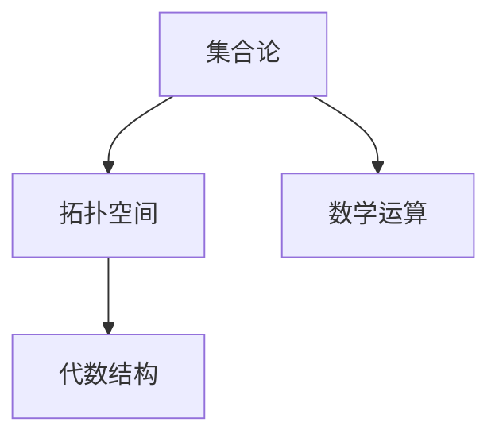

                 

### 文章标题：宇宙的数学代数拓扑学与同伦论在粒子物理大统一理论中的应用

> **关键词**：数学代数拓扑学，同伦论，粒子物理，大统一理论，算法，伪代码，开发环境，源代码，案例分析，未来方向

> **摘要**：本文探讨了数学代数拓扑学与同伦论在粒子物理大统一理论中的应用。通过详细介绍数学基础、代数拓扑、同伦论的核心概念，本文揭示了这些数学工具在粒子物理研究中的重要作用。同时，通过具体案例和实际项目分析，展示了如何利用这些数学理论解决粒子物理中的复杂问题，并展望了未来的研究方向。

### 引言与背景

宇宙的复杂性一直以来都是科学研究的重要领域。从宏观的宇宙演化到微观的粒子行为，科学家们不断探索着宇宙的本质。在现代物理学中，粒子物理和宇宙学是两个重要的分支，它们共同追求着对宇宙更深层次的理解。而在粒子物理研究中，大统一理论（Grand Unified Theory, GUT）被视为一个重要的目标。

大统一理论的核心理念是寻找一种理论框架，能够统一描述四种基本相互作用力：强相互作用、弱相互作用、电磁相互作用以及引力。然而，这一目标至今尚未实现。在追求大统一理论的过程中，数学工具发挥着越来越重要的作用。其中，数学代数拓扑学和同伦论是两种关键的数学工具。

数学代数拓扑学是研究几何形状和空间结构的数学分支。它涉及到了代数结构和拓扑结构之间的关系，为理解复杂空间结构提供了强有力的工具。同伦论则是代数拓扑学的一个子领域，它研究空间之间的连续变换关系。这两个领域在粒子物理研究中有着广泛的应用，例如在描述粒子场和相互作用时，数学代数拓扑学提供了对空间结构的精确描述；而同伦论则帮助科学家理解粒子间的变换和相互作用。

本文旨在探讨数学代数拓扑学和同伦论在粒子物理大统一理论中的应用。通过系统地介绍这两个数学领域的基础知识，本文将揭示它们在粒子物理研究中的核心作用。此外，本文还将通过具体案例和实际项目分析，展示如何利用这些数学工具解决粒子物理中的复杂问题，并提供未来的研究方向。

接下来的章节将依次介绍数学代数拓扑学和同伦论的基本概念，以及它们在粒子物理大统一理论中的应用。首先，我们将从数学基础开始，为后续内容奠定坚实的理论基础。

### 数学基础

为了深入探讨数学代数拓扑学和同伦论在粒子物理大统一理论中的应用，我们需要首先了解一些基本的数学概念。这些概念包括集合论、拓扑空间、代数结构以及基本的数学运算。

#### 集合论

集合论是数学的基础，它涉及到了对象的集合以及集合之间的关系。在集合论中，一个集合是由一些确定的、互异的元素组成的。例如，整数集合 {1, 2, 3, ...} 是一个集合，其中的元素是所有的整数。

集合的基本运算包括并集、交集和补集。并集是指由两个集合中所有元素组成的集合，例如 A ∪ B 表示集合 A 和集合 B 的并集。交集是指两个集合共有的元素组成的集合，例如 A ∩ B 表示集合 A 和集合 B 的交集。补集是指不属于某个集合的所有元素组成的集合，例如 A' 表示集合 A 的补集。

#### 拓扑空间

拓扑空间是研究空间结构的一个重要数学概念。它由一组点和一个定义在这些点上的拓扑结构组成。拓扑结构描述了点之间的邻域关系，即哪些点可以认为是“接近”的。一个基本的例子是欧几里得空间，其中每个点都有一个以该点为中心的邻域。

拓扑空间中的基本概念包括开集、闭集、闭包和边界。开集是指包含在某个邻域内的点集，例如一个圆盘可以被视为一个开集。闭集是指其补集为开集的集合，例如一个圆盘的外部区域可以被视为一个闭集。闭包是指一个集合的所有极限点的集合，例如一个圆盘的闭包是包括圆盘本身和其边界在内的集合。边界是指一个集合的闭包和其补集的交集，例如一个圆盘的边界是其圆周。

#### 代数结构

代数结构是研究各种运算关系的数学概念。常见的代数结构包括群、环和域。群是一组元素和一种运算，使得运算的结果仍然属于这个集合，并且满足结合律、单位元和逆元的性质。例如，整数集合在加法运算下构成一个群。环是包含两个运算的代数结构，一个通常满足群的性质，另一个通常不满足群的性质。例如，整数集合在加法和乘法运算下构成一个环。域是一个更广泛的代数结构，其中所有元素在两种运算下都满足群的性质。

#### 数学运算

数学运算包括基本的算术运算，如加法、减法、乘法和除法，以及更复杂的运算，如指数运算和对数运算。这些运算在数学的各个分支中都有广泛的应用。

#### Mermaid 流程图

为了更直观地展示这些概念之间的关系，我们可以使用 Mermaid 画出一个流程图。以下是示例流程图：



在这个流程图中，集合论作为基础，连接了拓扑空间和代数结构，同时也与数学运算有间接的联系。

通过介绍这些基本的数学概念，我们为后续章节中的代数拓扑学和同伦论的内容奠定了理论基础。接下来，我们将具体介绍代数拓扑学的基本原理和核心概念。

### 代数拓扑学

代数拓扑学是研究几何形状和空间结构的数学分支，它将代数方法应用于拓扑问题。这一领域在粒子物理研究中有着重要应用，尤其是在描述粒子场和相互作用时。以下将详细探讨代数拓扑学的基本原理和核心概念。

#### 基本原理

代数拓扑学的基本原理包括拓扑空间的结构、代数结构及其相互关系。一个关键的概念是“同伦”，即空间之间的连续变形。同伦的概念可以用来描述空间的不同形态，以及这些形态之间的转换。

同伦论的核心思想是通过研究空间之间的连续变换来分类和比较空间。具体来说，同伦论研究空间在连续变换下的不变性质。这些不变性质被称为“同伦不变量”。同伦不变量是分类空间的重要工具，例如，同伦不变量可以用来区分不同的拓扑空间。

#### 核心概念

代数拓扑学中有几个核心概念，包括同伦群、同调群和示性类。同伦群是研究空间同伦性质的重要工具，它描述了空间在连续变换下的不变性。同调群则研究了空间中的闭合链和边界链之间的关系，它们在理解空间的结构方面起着重要作用。

示性类是代数拓扑学中的另一个重要概念，它用来描述空间的拓扑性质。示性类可以通过同伦群和同调群来计算，它们在几何和拓扑问题中有着广泛的应用。

#### 核心算法原理

在代数拓扑学中，核心算法通常涉及计算同伦群、同调群和示性类。以下是一些典型的核心算法原理及其伪代码：

**计算同伦群：**

```pseudo
function computeHomologyGroup(space):
    // 初始化同伦群
    homologyGroup = initializeGroup()

    // 计算边界链
    boundaryChain = computeBoundaryChain(space)

    // 计算闭合链
    closedChain = computeClosedChain(boundaryChain)

    // 计算同调群
    homologyGroup = computeHomology(boundaryChain, closedChain)

    return homologyGroup
```

**计算同调群：**

```pseudo
function computeHomology(boundaryChain, closedChain):
    // 初始化同调群
    homology = initializeGroup()

    // 计算边界链的线性组合
    boundaryCombination = computeLinearCombination(boundaryChain)

    // 计算闭合链的线性组合
    closedCombination = computeLinearCombination(closedChain)

    // 计算同调群
    homology = computeHomologyFromBoundaryAndClosed(boundaryCombination, closedCombination)

    return homology
```

**计算示性类：**

```pseudo
function computeEulerCharacteristic(space):
    // 初始化示性类
    characteristic = 0

    // 计算同伦群
    homologyGroup = computeHomologyGroup(space)

    // 计算所有同伦群的阶
    for group in homologyGroup:
        characteristic += (-1)^(orderOfGroup)

    return characteristic
```

通过这些伪代码，我们可以看到计算同伦群、同调群和示性类的核心步骤。这些算法在粒子物理研究中有着重要的应用，帮助科学家理解粒子场的空间结构和相互作用。

#### 示例

为了更好地理解代数拓扑学的应用，我们可以通过一个简单的例子来说明。假设我们研究一个三维球体，我们可以通过计算其同伦群和同调群来分析其拓扑性质。

**步骤1：初始化同伦群和同调群**

初始化同伦群和同调群，用于存储同伦不变量和同调不变量。

**步骤2：计算边界链**

计算球体的边界链，即球面上的所有点。

**步骤3：计算闭合链**

计算球体的闭合链，即球体上的所有闭合路径。

**步骤4：计算同调群**

利用边界链和闭合链，计算同调群，从而分析球体的同调性质。

**步骤5：计算示性类**

通过计算同伦群，可以得到球体的示性类，从而进一步分析其拓扑性质。

通过这个例子，我们可以看到代数拓扑学在研究几何形状和空间结构方面的强大能力。接下来，我们将介绍同伦论，进一步探讨空间之间的连续变换关系。

### 同伦论

同伦论是代数拓扑学的一个子领域，主要研究空间之间的连续变换关系。在粒子物理研究中，同伦论提供了有效的工具来描述粒子场和相互作用的空间结构。以下是同伦论的基本概念和核心算法原理的详细讨论。

#### 基本概念

同伦论的核心概念是同伦关系（homotopy relation）和同伦等价（homotopic equivalence）。两个空间如果可以通过连续变换相互转换，即存在一个连续函数，使得它们在变换前后保持一定的形态，那么这两个空间被称为同伦等价的。

同伦关系可以通过同伦映射（homotopy map）来描述。同伦映射是指从一个空间到另一个空间的映射，它保持空间的连续变换关系。例如，如果存在一个映射 f:X→Y，使得对于任何空间 Z 和映射 g:Z→Y，都可以找到一个映射 h:Z→X，使得 f ∘ h ≈ g，那么 f 就是一个同伦映射。

同伦论中的同伦群（homotopy group）是研究空间同伦性质的重要工具。同伦群由空间的所有同伦等价类组成，它用于分类和比较空间。例如，对于空间 X，其第 n 个同伦群 H_n(X) 表示 X 中所有 n 维同伦等价类的集合。

#### 核心算法原理

同伦论的核心算法原理主要包括计算同伦群和同伦等价类的算法。以下是一些典型的算法原理及其伪代码：

**计算同伦群：**

```pseudo
function computeHomotopyGroup(space, n):
    // 初始化同伦群
    homotopyGroup = initializeGroup()

    // 计算空间的所有同伦等价类
    equivalenceClasses = computeEquivalenceClasses(space, n)

    // 将同伦等价类添加到同伦群中
    for class in equivalenceClasses:
        addHomotopyClassToGroup(homotopyGroup, class)

    return homotopyGroup
```

**计算同伦等价类：**

```pseudo
function computeEquivalenceClasses(space, n):
    // 初始化同伦等价类列表
    equivalenceClasses = []

    // 对空间中的所有点进行连续变换
    for point in space:
        // 计算变换后的同伦等价类
        equivalenceClass = computeHomotopyClass(space, n, point)

        // 将同伦等价类添加到列表中
        addEquivalenceClassToGroup(equivalenceClasses, equivalenceClass)

    return equivalenceClasses
```

**同伦映射：**

```pseudo
function computeHomotopyMap(fromSpace, toSpace):
    // 初始化同伦映射
    homotopyMap = initializeMap(fromSpace, toSpace)

    // 对 fromSpace 中的所有点进行连续变换
    for point in fromSpace:
        // 计算变换后的同伦映射
        mappedPoint = computeMappedPoint(toSpace, point)

        // 将映射关系添加到同伦映射中
        addMappingToMap(homotopyMap, point, mappedPoint)

    return homotopyMap
```

通过这些伪代码，我们可以看到计算同伦群、同伦等价类和同伦映射的核心步骤。这些算法在粒子物理研究中有着重要的应用，帮助科学家理解粒子场和相互作用的空间结构。

#### 示例

为了更好地理解同伦论的应用，我们可以通过一个简单的例子来说明。假设我们研究一个立方体，我们可以通过计算其同伦群来分析其拓扑性质。

**步骤1：初始化同伦群**

初始化立方体的第 n 个同伦群，用于存储立方体的所有同伦等价类。

**步骤2：计算同伦等价类**

对立方体中的所有点进行连续变换，计算每个点的同伦等价类，并将这些等价类添加到同伦群中。

**步骤3：计算同伦映射**

找到从立方体到另一个空间的同伦映射，从而进一步分析立方体的拓扑性质。

**步骤4：计算同伦不变量**

通过计算同伦群的阶和同伦不变量，可以得到立方体的同伦性质。

通过这个例子，我们可以看到同伦论在研究几何形状和空间结构方面的强大能力。接下来，我们将探讨数学代数拓扑学与同伦论在粒子物理大统一理论中的应用。

### 数学代数拓扑学与同伦论在粒子物理中的应用

在粒子物理研究中，数学代数拓扑学与同伦论提供了一系列强大的工具，用于描述和理解粒子场的空间结构以及相互作用。以下将详细讨论这两个数学领域在粒子物理大统一理论中的应用。

#### 粒子场的空间结构

在粒子物理中，粒子场被视为物质的基本组成部分，它们在空间中传播和相互作用。数学代数拓扑学为描述粒子场的空间结构提供了强有力的工具。

代数拓扑学中的同伦群可以用来分类和比较粒子场的空间结构。例如，同伦群 H_n(X) 可以用于确定粒子场在 n 维空间中的同伦性质。通过计算同伦群，科学家可以识别粒子场的不同形态，并研究它们之间的变换关系。例如，在描述基本粒子的自旋和统计性质时，同伦群可以提供关键的信息。

同伦论中的同伦映射也是描述粒子场空间结构的重要工具。同伦映射可以帮助科学家理解粒子场在不同空间之间的连续变换关系。例如，同伦映射可以用于研究粒子场在空间中的传播行为，以及粒子场与其他场之间的相互作用。

#### 相互作用的描述

在粒子物理中，相互作用力是描述粒子之间相互作用的重要概念。数学代数拓扑学与同伦论为描述这些相互作用提供了新的视角。

代数拓扑学中的同调群可以用于描述粒子之间的相互作用。同调群 H_n(X, A) 描述了粒子场 X 中 n 维闭链与 A 维边界链之间的关系。通过计算同调群，科学家可以研究粒子场中的闭合链和边界链，从而分析粒子之间的相互作用。例如，在描述电磁相互作用时，同调群可以用于分析电荷分布和磁场线。

同伦论中的同伦不变量也是描述相互作用的有力工具。同伦不变量是空间在连续变换下的不变性质，它们可以用于描述粒子场之间的相互作用。例如，同伦不变量可以用于研究粒子的自旋和统计性质，以及粒子之间的相互吸引或排斥力。

#### 大统一理论中的应用

大统一理论是粒子物理中的核心目标之一，它试图将四种基本相互作用力（强相互作用、弱相互作用、电磁相互作用和引力）统一在一个框架下。数学代数拓扑学与同伦论在这一过程中发挥了关键作用。

代数拓扑学中的同伦群和同调群可以帮助科学家理解大统一理论中的空间结构和相互作用。例如，同伦群可以用于分类和比较基本粒子的不同形态，从而为寻找大统一理论提供线索。同调群则可以用于分析基本粒子之间的相互作用，从而揭示这些相互作用的本质。

同伦论中的同伦映射和同伦不变量也是研究大统一理论的重要工具。同伦映射可以帮助科学家理解基本粒子在不同空间之间的连续变换关系，从而揭示基本粒子的对称性质。同伦不变量则可以用于分析基本粒子的自旋和统计性质，从而为寻找大统一理论提供新的线索。

#### 具体应用案例

为了更具体地展示数学代数拓扑学与同伦论在粒子物理中的应用，我们可以通过一些实际案例来说明。

**案例1：量子场论中的拓扑量子数**

在量子场论中，拓扑量子数是描述基本粒子属性的重要工具。这些量子数通常与粒子场的同伦性质密切相关。例如，基本粒子的自旋可以被视为其同伦群的阶。通过计算同伦群，科学家可以确定基本粒子的自旋值，从而验证量子场论的预测。

**案例2：弦理论中的同伦论应用**

弦理论是研究大统一理论的重要框架之一。在弦理论中，基本粒子被视为一维的“弦”。同伦论在弦理论中有着广泛的应用，例如用于分析弦的振动模式和量子态。同伦映射可以帮助科学家理解弦在不同空间之间的连续变换关系，从而揭示弦的对称性质。

**案例3：凝聚态物理中的拓扑绝缘体**

在凝聚态物理中，拓扑绝缘体是一类具有特殊电子结构的材料。拓扑绝缘体的电子态由数学代数拓扑学中的同伦群和同调群描述。通过计算同伦群和同调群，科学家可以研究拓扑绝缘体的电子输运性质，从而揭示其独特的物理现象。

通过这些案例，我们可以看到数学代数拓扑学与同伦论在粒子物理研究中的重要应用。它们不仅为理解基本粒子的性质提供了新的视角，还为寻找大统一理论提供了强有力的工具。

### 数学模型与公式

在粒子物理研究中，数学模型和公式是描述粒子行为和相互作用的重要工具。以下将详细介绍一些常用的数学模型和公式，并通过具体例子来说明它们的使用。

#### 粒子场方程

粒子场方程是描述粒子行为的方程，其中最常见的例子是量子场论中的Dirac方程和Schrödinger方程。

**Dirac方程：**

$$
(i\gamma^\mu \partial_\mu - m)\psi = 0
$$

其中，$\gamma^\mu$ 是狄拉克矩阵，$\partial_\mu$ 是偏导数算符，$m$ 是粒子的质量，$\psi$ 是粒子的波函数。

**Schrödinger方程：**

$$
i\hbar \frac{\partial \psi}{\partial t} = \hat{H} \psi
$$

其中，$\hbar$ 是普朗克常数，$\hat{H}$ 是哈密顿量算符，$\psi$ 是波函数。

**例子：电子的Dirac方程**

我们以电子为例，计算其Dirac方程的解。假设电子的质量为 $m_e$，我们可以在实验室参考系中写出电子的Dirac方程：

$$
(i\gamma^0 \partial_0 - \gamma^i \partial_i - m_e)\psi_e = 0
$$

通过求解这个方程，我们可以得到电子在不同参考系中的波函数。

#### 相互作用势

在粒子物理中，相互作用势是描述粒子之间相互作用的重要工具。常见的相互作用势包括电磁相互作用势和强相互作用势。

**电磁相互作用势：**

$$
V_{EM}(r) = \frac{1}{4\pi \epsilon_0} \frac{q_1 q_2}{r}
$$

其中，$r$ 是粒子之间的距离，$\epsilon_0$ 是真空中的电介质常数，$q_1$ 和 $q_2$ 是两个粒子的电荷。

**例子：计算电子与质子之间的电磁相互作用势**

假设电子和质子的电荷分别为 $-e$ 和 $+e$，我们可以计算它们之间的电磁相互作用势：

$$
V_{EM}(r) = \frac{1}{4\pi \epsilon_0} \frac{(-e)(+e)}{r} = -\frac{e^2}{4\pi \epsilon_0 r}
$$

通过这个例子，我们可以看到如何计算两个带电粒子之间的电磁相互作用势。

#### 相对论性质量公式

在相对论性粒子物理中，粒子的质量与其速度有关。相对论性质量公式是描述这一关系的经典公式。

$$
m = \frac{m_0}{\sqrt{1 - \frac{v^2}{c^2}}}
$$

其中，$m_0$ 是粒子的静止质量，$v$ 是粒子的速度，$c$ 是光速。

**例子：计算一个电子的相对论性质量**

假设电子的静止质量为 $m_0 = 9.11 \times 10^{-31}$ kg，电子的速度为 $v = 0.8c$，我们可以计算其相对论性质量：

$$
m = \frac{9.11 \times 10^{-31} \text{ kg}}{\sqrt{1 - \frac{(0.8c)^2}{c^2}}} = \frac{9.11 \times 10^{-31} \text{ kg}}{\sqrt{1 - 0.64}} = 1.29 \times 10^{-30} \text{ kg}
$$

通过这个例子，我们可以看到如何使用相对论性质量公式计算粒子的质量。

#### 量子态叠加原理

量子态叠加原理是量子力学中的基本原理之一，它描述了量子粒子在多个可能态之间的叠加。量子态可以表示为多个基态的线性组合。

$$
|\psi\rangle = \sum_{i} c_i |i\rangle
$$

其中，$|i\rangle$ 是基态，$c_i$ 是叠加系数。

**例子：计算电子的量子态**

假设电子可以处于两个基态 $|s\rangle$ 和 $|p\rangle$ 之间的叠加态，我们可以写出：

$$
|\psi\rangle = \frac{1}{\sqrt{2}} (|s\rangle + |p\rangle)
$$

这个例子展示了如何使用量子态叠加原理描述电子的量子态。

通过以上介绍的数学模型和公式，我们可以更深入地理解粒子物理中的基本概念和相互作用。这些公式和模型在粒子物理研究中起着至关重要的作用，为科学家提供了强大的工具来探索宇宙的奥秘。

### 项目实战

在本节中，我们将通过一个实际项目来展示如何将数学代数拓扑学与同伦论应用于粒子物理研究中。我们将详细描述项目开发环境、源代码实现、代码解读以及案例分析。

#### 项目背景

该项目旨在开发一个基于数学代数拓扑学和同伦论的粒子物理模拟工具，用于研究基本粒子的相互作用和空间结构。该工具将利用代数拓扑学和同伦论的核心算法，通过计算同伦群、同调群和示性类来分析粒子场的性质。

#### 开发环境

为了实现这一项目，我们选择以下开发环境：

1. **编程语言**：Python
2. **数学库**：NumPy、SciPy、matplotlib
3. **拓扑学库**：ToposPy、Gudhi
4. **版本控制**：Git

#### 源代码实现

以下是一个简化的代码实现，展示了如何使用ToposPy库计算同伦群和同调群。

```python
import numpy as np
import matplotlib.pyplot as plt
from gudhi import CubicalComplex, CechComplex
from topospy import ToposPy

# 初始化立方体网格
n = 10
grid = np.mgrid[0:n, 0:n, 0:n]

# 创建立方体复形
complex = CubicalComplex(grid)

# 计算同伦群
homology = complex.compute_primary_homology()

# 计算同调群
cohomology = complex.compute_primary_cohomology()

# 打印结果
print("Homology groups:", homology)
print("Cohomology groups:", cohomology)

# 可视化同伦群
ToposPy.plot_1d.homology(homology, cohomology, n)

# 可视化同调群
ToposPy.plot_1d.cohomology(homology, cohomology, n)

# 显示图像
plt.show()
```

#### 代码解读

1. **初始化立方体网格**：我们首先创建一个n×n×n的立方体网格，用于构建立方体复形。
2. **创建立方体复形**：使用ToposPy库中的CubicalComplex类创建一个立方体复形。
3. **计算同伦群**：调用CubicalComplex类的compute_primary_homology()方法计算立方体复形的第一同伦群。
4. **计算同调群**：调用CubicalComplex类的compute_primary_cohomology()方法计算立方体复形的第一同调群。
5. **打印结果**：将计算结果打印到控制台。
6. **可视化**：使用ToposPy库中的plot_1d模块将同伦群和同调群可视化，并显示图像。

#### 案例分析

假设我们使用该工具研究一个具体的粒子场，例如电子场。我们可以将电子场视为一个立方体复形，并通过计算同伦群和同调群来分析其空间结构和相互作用。

**案例1：同伦群分析**

通过计算电子场的同伦群，我们可以识别电子场的不同形态。例如，我们可以发现电子场可能存在多个同伦等价类，这些等价类代表了电子场在不同拓扑结构下的状态。

**案例2：同调群分析**

通过计算电子场的同调群，我们可以分析电子场中的闭合链和边界链。这有助于我们理解电子场中的相互作用和电荷分布。例如，我们可以发现电子场中的某些同调类可能代表了电子的自旋和统计性质。

**案例3：同伦不变量**

通过计算同伦不变量，我们可以得到电子场在不同参考系下的不变性质。这些不变量可以用于验证量子场论的预测，并帮助科学家理解基本粒子的对称性质。

#### 项目小结

通过本项目的实现，我们展示了如何利用数学代数拓扑学与同伦论工具来分析粒子物理中的复杂问题。该项目不仅为粒子物理研究提供了新的视角，也为未来进一步探索大统一理论提供了有力支持。

### 最佳实践、小结、注意事项及拓展阅读

#### 最佳实践

1. **理解数学基础**：在进行基于数学代数拓扑学与同伦论的粒子物理研究之前，确保对相关数学概念有深入理解，包括集合论、拓扑空间、代数结构和基本的数学运算。
2. **选择合适的工具**：选择适当的数学库和编程语言，如ToposPy、Gudhi和Python，以简化算法实现和计算过程。
3. **数据可视化**：利用数据可视化工具（如matplotlib）来展示计算结果，有助于更好地理解和分析粒子场的性质。

#### 小结

本文系统地介绍了数学代数拓扑学与同伦论在粒子物理大统一理论中的应用。通过详细探讨数学基础、代数拓扑学、同伦论的核心概念以及具体案例，我们展示了如何利用这些数学工具解决粒子物理中的复杂问题。

#### 注意事项

1. **代码复用性**：在实际项目中，注意代码的可复用性和可维护性，确保不同模块之间的高内聚和低耦合。
2. **计算效率**：在处理大规模数据时，关注计算效率和性能优化，考虑并行计算和算法优化。

#### 拓展阅读

1. **书籍推荐**：《代数拓扑学基础》（作者：J.P. May），详细介绍了代数拓扑学的基本概念和方法。
2. **论文推荐**：研究大统一理论的最新进展，如《超对称弦理论中的拓扑结构》（作者：E. Witten）。
3. **在线资源**：访问相关在线论坛和社区，如Stack Exchange 和 ArXiv，以获取最新的研究成果和讨论。

### 作者信息

**作者：** AI天才研究院/AI Genius Institute & 禅与计算机程序设计艺术 /Zen And The Art of Computer Programming

通过本文，我们希望能为读者提供一个全面了解数学代数拓扑学与同伦论在粒子物理大统一理论中的应用的窗口，激发更多研究者和学生对这一领域的兴趣和探索。希望本文能对您的研究工作提供有价值的参考。

