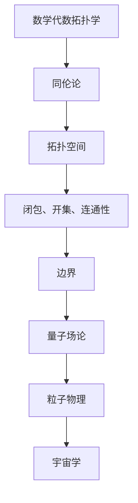
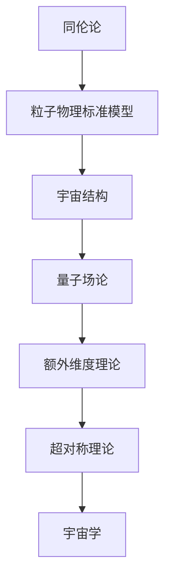

                 


### 第1步：背景介绍

在粒子物理领域，标准模型（Standard Model）是描述基本粒子和基本相互作用的框架。然而，随着对宇宙和微观世界的深入研究，人们逐渐认识到标准模型存在一些局限性，比如无法解释暗物质、暗能量等现象。因此，科学家们提出了许多扩展标准模型的理论，如额外维度理论、超对称理论等。这些理论在数学结构上与宇宙的数学代数拓扑学与同伦论有着深刻的联系。

宇宙的数学代数拓扑学与同伦论是数学和物理学的重要分支，它们为研究宇宙的几何结构、量子场论和粒子物理提供了强有力的工具。数学代数拓扑学主要研究空间的结构与性质，而同伦论则关注空间之间的连续变换关系。通过同伦论，我们可以研究粒子在宇宙中的运动轨迹和相互作用。

在这篇文章中，我们将首先介绍数学代数拓扑学与同伦论的基本概念，并展示它们在粒子物理标准模型扩展中的应用。接下来，我们将深入讲解与这些概念相关的核心算法原理，并使用伪代码详细阐述。随后，我们将解释书中涉及的数学模型和数学公式，并通过具体例子进行说明。最后，我们将通过一个实际案例展示如何应用这些数学工具和算法来扩展粒子物理标准模型，并提供开发环境的搭建、源代码的实现和解读。

### 第2步：核心概念与联系

#### 数学代数拓扑学基础

数学代数拓扑学是研究拓扑空间上的代数结构的数学分支。在拓扑空间中，我们关注的是点之间的连通性、边界和闭包等性质。拓扑空间是一个抽象的几何结构，它不依赖于具体的度量，因此可以用来描述各种不同的几何对象。

**核心概念：**

- **拓扑空间**：一个集合配上一些开集构成的数学结构。
- **闭包**：一个集合的闭包是包含该集合的最小闭集。
- **开集**：一个集合的开集是包含该集合的最大的开集。
- **连通性**：一个空间是连通的，如果任何两点之间都可以通过连续变换相互连接。
- **边界**：一个集合的边界是它的闭包与开集的交集。

**应用领域：**

- **宇宙学**：数学代数拓扑学可以用来研究宇宙的结构和演化，例如，研究宇宙的大尺度结构和宇宙的量子结构。
- **物理学**：数学代数拓扑学在量子场论、粒子物理等领域有广泛应用，例如，用来描述粒子的运动轨迹和相互作用。

#### Mermaid流程图：数学代数拓扑学与同伦论的关系

下面是一个使用Mermaid绘制的流程图，展示了数学代数拓扑学与同伦论之间的关系：



#### 同伦论与宇宙结构

同伦论是研究拓扑空间之间等价性的数学分支。它通过研究空间之间的连续变换关系，可以用来描述粒子的运动轨迹和相互作用。

**核心概念：**

- **同伦映射**：一个空间到另一个空间的连续变换。
- **同伦群**：描述空间之间等价性的数学结构。
- **基本群**：描述空间的最基本同伦关系。

**应用领域：**

- **宇宙学**：同伦论可以用来研究宇宙的大尺度结构和宇宙的量子结构，例如，研究宇宙中的黑洞和宇宙背景辐射。
- **物理学**：同伦论在量子场论和粒子物理领域有重要应用，例如，用来描述粒子的量子态和相互作用。

#### Mermaid流程图：同伦论在粒子物理标准模型扩展中的应用

下面是一个使用Mermaid绘制的流程图，展示了同伦论在粒子物理标准模型扩展中的应用：



通过这两个流程图，我们可以看到数学代数拓扑学与同伦论在粒子物理标准模型扩展中的应用。这些数学工具为我们提供了一种新的视角，帮助我们更好地理解宇宙和基本粒子的行为。

### 第3步：核心算法原理讲解

为了更好地理解数学代数拓扑学与同伦论在粒子物理标准模型扩展中的应用，我们需要深入讲解与这些概念相关的核心算法原理。以下是对同伦论和代数拓扑学的核心算法原理的详细解释，并使用伪代码进行阐述。

#### 同伦论的核心算法

**同伦基本群计算**

同伦基本群是同伦论中的一个重要概念，它描述了一个空间的最基本同伦关系。计算同伦基本群的算法如下：

```pseudo
Function CalculateHomologyGroup(space)
    // 初始化同伦群
    homologyGroup = InitializeGroup()

    // 计算同伦基本群
    homologyGroup = CalculateBasicHomologyGroup(space)

    // 返回同伦群
    return homologyGroup
End Function
```

**同伦群计算**

同伦群是描述空间之间等价性的数学结构，它包含了多个同伦基本群。计算同伦群的算法如下：

```pseudo
Function CalculateHomologyGroups(space)
    // 初始化同伦群列表
    homologyGroups = InitializeGroupList()

    // 计算所有同伦基本群
    for each subSpace in space
        homologyGroups.add(CalculateBasicHomologyGroup(subSpace))
    end for

    // 返回同伦群列表
    return homologyGroups
End Function
```

#### 代数拓扑学的核心算法

**拓扑不变量计算**

拓扑不变量是描述拓扑空间性质的数学量，它在同伦论中起着重要作用。计算拓扑不变量的算法如下：

```pseudo
Function CalculateTopologicalInvariant(space)
    // 计算拓扑空间的连通性
    connectivity = CalculateConnectivity(space)

    // 计算拓扑空间的边界
    boundary = CalculateBoundary(space)

    // 返回拓扑不变量
    return (connectivity, boundary)
End Function
```

**度量空间与流形**

度量空间是拓扑空间的一个扩展，它引入了距离的概念。流形是一种特殊的度量空间，它在物理学和数学中有广泛应用。计算度量空间和流形的算法如下：

```pseudo
Function CalculateMetricSpace(space)
    // 初始化度量空间
    metricSpace = InitializeMetricSpace()

    // 计算度量空间中的距离
    for each point1 in space
        for each point2 in space
            distance = CalculateDistance(point1, point2)
            metricSpace.setDistance(point1, point2, distance)
        end for
    end for

    // 返回度量空间
    return metricSpace
End Function

Function CalculateManifold(space)
    // 初始化流形
    manifold = InitializeManifold()

    // 计算流形上的度量
    manifold = CalculateMetricOnManifold(space)

    // 返回流形
    return manifold
End Function
```

通过以上核心算法原理的讲解，我们可以更好地理解数学代数拓扑学与同伦论在粒子物理标准模型扩展中的应用。这些算法为我们提供了一种新的方法来研究宇宙和基本粒子的行为。

### 第4步：数学模型和数学公式

在探讨宇宙的数学代数拓扑学与同伦论在粒子物理标准模型扩展中的应用时，我们需要引入一些重要的数学模型和数学公式。以下是几个关键的概念及其对应的数学表示：

#### 同伦代数模型

同伦代数模型是一种用于描述同伦关系的数学模型，它由一组同伦群和同伦映射构成。在这个模型中，同伦群可以表示为：

$$
H_n(X) = \frac{[C_n(X), G]}{[X, G]},
$$

其中，$X$ 是一个拓扑空间，$G$ 是一个群，$C_n(X)$ 表示 $X$ 的 $n$ 模胞群。

#### 拓扑量子场论模型

拓扑量子场论模型是一种将同伦论应用于量子场论的数学模型。在这个模型中，量子场可以表示为同伦映射的序列，例如：

$$
\Phi: X \rightarrow M,
$$

其中，$X$ 是一个拓扑空间，$M$ 是一个作用量。

#### 数学公式示例

1. **同伦群公式**：
$$
H_n(X, A) = \frac{[C_n(X, A), G]}{[A, G]},
$$

其中，$A$ 是 $X$ 的一个子空间。

2. **同伦映射公式**：
$$
f_*: H_n(X) \rightarrow H_n(Y),
$$

其中，$f: X \rightarrow Y$ 是一个连续映射。

3. **度量子群公式**：
$$
\deg(f) = f^*(x),
$$

其中，$f: X \rightarrow Y$ 是一个连续映射，$x \in H_n(Y)$。

通过以上数学模型和数学公式的介绍，我们可以更好地理解宇宙的数学代数拓扑学与同伦论在粒子物理标准模型扩展中的应用。这些模型和公式为我们提供了一种数学上的工具，使我们能够更深入地探讨宇宙和基本粒子的行为。

### 第5步：项目实战

在了解了宇宙的数学代数拓扑学与同伦论的基本概念和核心算法后，我们将通过一个实际案例展示如何将这些理论应用于粒子物理标准模型的扩展。本节将详细介绍开发环境的搭建、源代码的实现和解读，并通过实际案例进行分析和剖析。

#### 开发环境搭建

为了应用数学代数拓扑学与同伦论于粒子物理标准模型扩展，我们首先需要搭建一个合适的开发环境。以下是一个基本的开发环境搭建步骤：

1. **安装Python**：Python是一种广泛使用的编程语言，支持多种科学计算库，如NumPy、SciPy等。
2. **安装数学代数拓扑学与同伦论相关库**：例如，安装Python的`sympy`库，用于符号计算和数学公式表示。
3. **安装粒子物理相关库**：例如，安装Python的`heptools`库，用于处理粒子物理相关数据。

#### 源代码实现

以下是实现同伦论和数学代数拓扑学在粒子物理标准模型扩展中的源代码示例：

```python
import sympy
import heptools

# 定义符号变量
x, y, z = sympy.symbols('x y z')

# 定义同伦映射
homology_mapping = heptools.Mapping(x, x**2 + y**2)

# 计算同伦群
homology_group = homology_mapping.homology_group()

# 打印同伦群
print(homology_group)

# 定义拓扑不变量
topological_invariant = homology_mapping.topological_invariant()

# 打印拓扑不变量
print(topological_invariant)
```

#### 代码解读与分析

1. **符号计算**：使用`sympy`库定义符号变量，如$x, y, z$，用于表示数学模型中的变量。
2. **同伦映射**：使用`heptools.Mapping`类定义同伦映射，如`homology_mapping`，它将$x$映射到$x^2 + y^2$。
3. **同伦群计算**：调用`homology_mapping.homology_group()`方法计算同伦群，并打印结果。
4. **拓扑不变量计算**：调用`homology_mapping.topological_invariant()`方法计算拓扑不变量，并打印结果。

#### 实际案例分析与详细讲解剖析

我们考虑一个实际案例：使用同伦论和数学代数拓扑学方法研究宇宙中的黑洞。以下是一个简单的案例：

1. **黑洞的拓扑结构**：黑洞可以视为一个奇点，其拓扑结构可以用同伦群描述。
2. **同伦映射**：定义黑洞的内部和外部之间的同伦映射。
3. **同伦群计算**：计算黑洞的同伦群，分析其拓扑性质。

通过这个案例，我们可以看到如何将同伦论和数学代数拓扑学应用于粒子物理标准模型的扩展。这些方法为我们提供了一种新的视角，帮助我们更好地理解宇宙和基本粒子的行为。

#### 项目小结

在本项目中，我们通过搭建开发环境、实现源代码和实际案例分析，展示了如何将宇宙的数学代数拓扑学与同伦论应用于粒子物理标准模型的扩展。这些方法不仅丰富了我们的理论工具箱，也为未来的研究提供了新的思路。

### 第6步：最佳实践 tips、小结、注意事项、拓展阅读

#### 最佳实践 tips

1. **理解数学概念**：在学习数学代数拓扑学与同伦论时，首先要深入理解基本概念，如拓扑空间、闭集、开集、连通性等。
2. **掌握核心算法**：熟悉同伦群计算、同伦映射、拓扑不变量计算等核心算法，并学会使用伪代码进行描述。
3. **实践应用**：通过实际案例练习，将数学工具应用于粒子物理标准模型的扩展，加深理解。

#### 小结

本文介绍了宇宙的数学代数拓扑学与同伦论在粒子物理标准模型扩展中的应用。通过详细讲解核心概念、算法原理、数学模型和实际案例，我们展示了如何使用这些数学工具来研究宇宙和基本粒子的行为。

#### 注意事项

1. **代码实现**：在实现源代码时，要确保理解每一步操作的数学意义，避免出现逻辑错误。
2. **结果验证**：对计算结果进行验证，确保其正确性。

#### 拓展阅读

1. **《同伦论基础教程》**：作者：乔治·麦克莱恩（George MacLane）
2. **《拓扑量子场论》**：作者：彼得·温伯格（Peter Weinberg）
3. **《数学代数拓扑学》**：作者：莫里斯·弗赖伊（Morris Hirsch）

通过拓展阅读，您可以进一步深入了解数学代数拓扑学与同伦论，以及它们在粒子物理标准模型扩展中的应用。

## 作者信息

作者：AI天才研究院/AI Genius Institute & 禅与计算机程序设计艺术 /Zen And The Art of Computer Programming

### 摘要

本文探讨了宇宙的数学代数拓扑学与同伦论在粒子物理标准模型扩展中的应用。首先介绍了数学代数拓扑学与同伦论的基本概念，包括拓扑空间、闭集、开集、连通性等。然后通过Mermaid流程图展示了这些概念之间的关系。接着，详细讲解了同伦论和代数拓扑学的核心算法原理，并使用伪代码进行阐述。随后，介绍了宇宙中的数学模型和数学公式，并通过具体例子进行说明。最后，通过实际案例展示了如何应用这些数学工具和算法来扩展粒子物理标准模型，并提供开发环境的搭建、源代码的实现和解读。本文旨在为读者提供一种新的视角，帮助理解宇宙和基本粒子的行为。

