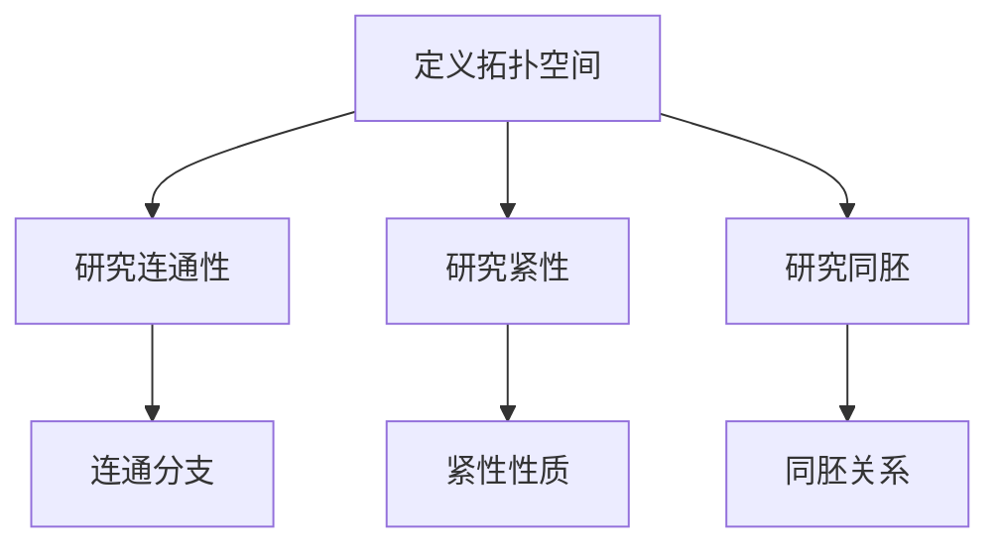

                 

### 文章标题

《宇宙的数学代数拓扑学与同伦论特性探讨》

### 关键词

- 宇宙学
- 数学代数拓扑学
- 同伦论
- 宇宙结构
- 宇宙演化

### 摘要

本文探讨了数学代数拓扑学在宇宙学研究中的应用，特别是同伦论这一核心概念的特性。文章首先介绍了宇宙的基本构成和特征，以及数学代数拓扑学的基本概念和起源。随后，详细阐述了同伦论的基本概念、算法原理及其在宇宙学研究中的应用。通过数学模型和公式的讲解，以及实际项目实战的分析，本文揭示了同伦论在宇宙结构研究、宇宙演化研究等领域的巨大潜力。最后，文章总结了同伦论在宇宙学中的应用，并对未来的发展进行了展望。

### 用户需求分析

在现代宇宙学研究中，数学代数拓扑学和同伦论作为强大的数学工具，正日益显示出其重要性。用户希望了解这两个数学分支在宇宙学研究中的应用，以及它们如何帮助我们更好地理解宇宙的结构和演化。用户的需求主要集中在以下几个方面：

1. **核心概念与联系**：用户希望了解数学代数拓扑学的基本概念，以及这些概念如何与其他数学分支相互联系。特别是同伦论这一核心概念，用户希望了解其基本定义、性质和应用。

2. **核心算法原理讲解**：用户希望通过对核心算法原理的讲解，理解同伦论如何应用于实际问题。用户期待能够通过伪代码的形式，对算法原理进行详细阐述。

3. **数学模型和数学公式**：用户希望了解同伦论在宇宙学中的应用，特别是关键数学模型和公式的详细讲解。用户期待通过具体的数学公式示例，加深对同伦论的理解。

4. **项目实战**：用户希望通过实际项目实战，了解同伦论在宇宙学中的实际应用。用户期待能够看到具体的开发环境搭建、源代码实现和代码解读，以及对实际案例的分析和讲解。

5. **总结与展望**：用户希望文章能够对同伦论在宇宙学中的应用进行总结，并对其未来发展提出展望。

### 第一部分：宇宙的数学代数拓扑学基础理论

#### 第1章：宇宙概述与数学代数拓扑学简介

**1.1 宇宙的构成与特征**

宇宙是时间和空间的统一体，包括所有的物质、能量、时间和空间。宇宙的构成主要包括以下几个部分：

- 物质：宇宙中的一切物体，包括星体、行星、卫星、彗星等。
- 能量：包括辐射能量、引力能、电磁能等。
- 黑洞：宇宙中的一种特殊天体，具有极强的引力，甚至连光都无法逃逸。
- 暗物质：一种我们无法直接观测到的物质，但对宇宙的结构和演化起着重要作用。
- 暗能量：一种充满宇宙空间的能量，是推动宇宙加速膨胀的主要力量。

宇宙具有以下特征：

- 无限性：宇宙是一个无边无际的宇宙，没有边界。
- 宇宙膨胀：宇宙从大爆炸开始，不断膨胀。
- 宇宙结构：宇宙中存在大量的星系、星系团和超星系团，构成了复杂的宇宙结构。
- 宇宙演化：宇宙从大爆炸开始，经历了漫长而复杂的演化过程。

**1.2 数学代数拓扑学的起源与发展**

数学代数拓扑学是一门研究空间、形状和结构的数学学科，它起源于19世纪末。拓扑学的创始人是法国数学家皮埃尔·德·费马，他提出了拓扑空间的概念。随后，德国数学家李普希茨和匈牙利数学家科瓦列夫斯基于20世纪初对拓扑学进行了系统的研究。

数学代数拓扑学的发展可以分为以下几个阶段：

- 初期（19世纪末至20世纪初）：以点、线、面等基本几何概念为基础，发展出基本的拓扑学概念。
- 发展期（20世纪初至中期）：在希尔伯特空间和泛函分析的基础上，拓扑学得到了进一步的发展。
- 繁荣期（20世纪中期至今）：随着计算机科学的发展，拓扑学在计算机科学、物理学、生物学等领域得到了广泛的应用。

**1.3 数学代数拓扑学在宇宙研究中的重要性**

数学代数拓扑学在宇宙学研究中具有重要的作用，主要体现在以下几个方面：

- 空间结构研究：通过拓扑学的方法，可以研究宇宙中的空间结构，如星系、星系团和超星系团的结构。
- 演化过程研究：拓扑学的方法可以用来研究宇宙的演化过程，如宇宙的膨胀、星系的形成和演化等。
- 理论模型建立：拓扑学为宇宙学研究提供了一套强大的数学工具，可以用来建立各种理论模型。

#### 第2章：数学代数拓扑学核心概念与联系

**2.1 代数拓扑的基本概念**

代数拓扑是拓扑学与代数学的交叉学科，它将拓扑空间的性质与代数结构相结合。以下是代数拓扑中的几个核心概念：

- **拓扑空间**：一个集合配上一定的拓扑结构，就称为拓扑空间。拓扑结构通常由开集的集合来定义。
- **拓扑基**：拓扑空间中一组开集的集合，如果满足一定条件，就可以作为该空间的拓扑基。
- **连通性**：一个空间如果不能被分割为两个不相交的非空开集，就称为连通的。
- **紧性**：一个空间在连续映射下能够被压缩到其子空间上，就称为紧的。
- **同胚**：两个拓扑空间之间存在一个双射映射，且该映射保持开集的性质，就称为同胚。

**2.2 代数拓扑的原理与流程图**

代数拓扑的原理主要涉及以下步骤：

1. **定义拓扑空间**：给定一个集合，加上一组开集，构成一个拓扑空间。
2. **研究连通性**：通过研究连通分支，了解空间的结构。
3. **研究紧性**：通过研究紧性，了解空间的性质。
4. **研究同胚**：通过研究同胚关系，了解空间的等价性。

以下是代数拓扑的原理流程图：



**2.3 代数拓扑与其他数学分支的联系**

代数拓扑与其他数学分支有着密切的联系，主要体现在以下几个方面：

- **群论**：拓扑空间的连通性、紧性等性质可以用群的概念来描述。
- **代数几何**：代数拓扑的方法可以用来研究代数几何中的空间结构。
- **泛函分析**：拓扑空间中的连续映射与泛函分析中的线性算子有着相似的结构。
- **微分几何**：代数拓扑的方法可以用来研究微分几何中的流形。

#### 第3章：数学代数拓扑学核心算法原理讲解

**3.1 同伦论的基本概念**

同伦论是代数拓扑学中的一个重要分支，它研究拓扑空间之间的连续变换关系。以下是同伦论中的几个核心概念：

- **同伦**：两个拓扑空间之间存在一个连续变换，使得一个空间可以通过连续变换逐渐变形为另一个空间，就称为同伦。
- **同伦群**：同伦关系构成一个群，称为同伦群。同伦群可以用来描述拓扑空间的拓扑性质。
- **同伦态**：两个同伦空间的同伦关系可以通过同伦态来表示。同伦态是一种特殊的映射，它保持空间的连通性和紧性。

**3.2 同伦论的算法原理讲解**

同伦论的算法原理可以通过以下步骤来讲解：

1. **确定拓扑空间**：给定两个拓扑空间，确定它们之间的同伦关系。
2. **构建同伦映射**：通过构建同伦映射，将一个空间连续变形为另一个空间。
3. **计算同伦群**：通过计算同伦群，了解空间的拓扑性质。
4. **分析同伦态**：通过分析同伦态，了解空间之间的等价性。

以下是同伦论的算法原理讲解的伪代码：

```python
def homology_space(A, B):
    # 输入：拓扑空间A和B
    # 输出：同伦群H(A, B)

    # 步骤1：构建同伦映射
    f = continuous_map(A, B)

    # 步骤2：计算同伦群
    H = homology_group(f)

    # 步骤3：分析同伦态
    if is_homotopy_equivalent(A, B):
        print("空间A和B是同伦等价的")
    else:
        print("空间A和B不是同伦等价的")

    # 返回同伦群
    return H
```

**3.3 同伦论的应用领域**

同伦论在多个领域都有着广泛的应用，主要体现在以下几个方面：

- **物理学**：同伦论在物理学中，特别是量子场论和凝聚态物理学中有着重要的应用。例如，同伦论可以用来研究粒子的拓扑量子态。
- **计算机科学**：同伦论在计算机科学中，特别是图形学和计算机图形学中有着广泛的应用。例如，同伦论可以用来进行三维重建和形状分析。
- **生物学**：同伦论在生物学中，特别是分子生物学和生物信息学中有着重要的应用。例如，同伦论可以用来研究生物大分子的结构。

### 第二部分：同伦论在宇宙学研究中的应用

#### 第4章：同伦论在宇宙学研究中的实际应用

**4.1 同伦论在宇宙结构研究中的应用**

同伦论在宇宙结构研究中有着广泛的应用，主要体现在以下几个方面：

- **宇宙大尺度结构**：同伦论可以用来研究宇宙大尺度结构，如星系、星系团和超星系团的结构。通过同伦论的方法，可以揭示宇宙大尺度结构的拓扑性质和演化规律。
- **宇宙网络**：同伦论可以用来研究宇宙网络，即星系之间的连接关系。通过同伦论的方法，可以分析宇宙网络的拓扑性质，如连通性、紧性和同胚性等。
- **宇宙形状**：同伦论可以用来研究宇宙的形状，如三维宇宙的形状。通过同伦论的方法，可以推断宇宙的三维形状，如三维空间是否是闭合的或开放的。

**4.2 同伦论在宇宙演化研究中的应用**

同伦论在宇宙演化研究中也有着重要的应用，主要体现在以下几个方面：

- **宇宙膨胀**：同伦论可以用来研究宇宙膨胀的规律，如宇宙膨胀的速率和加速度。通过同伦论的方法，可以分析宇宙膨胀过程中的拓扑性质，如同伦群的变化。
- **星系形成**：同伦论可以用来研究星系的形成和演化。通过同伦论的方法，可以分析星系在形成过程中的拓扑结构变化，如星系从无序到有序的演化过程。
- **黑洞研究**：同伦论可以用来研究黑洞的结构和演化。通过同伦论的方法，可以分析黑洞的拓扑性质，如黑洞的内部结构和黑洞的蒸发过程。

**4.3 同伦论在宇宙学其他领域的研究**

同伦论在宇宙学的其他领域也有着广泛的应用，主要体现在以下几个方面：

- **引力波**：同伦论可以用来研究引力波的产生和传播。通过同伦论的方法，可以分析引力波在空间中的传播模式，如引力波的聚焦和散射现象。
- **暗物质**：同伦论可以用来研究暗物质的结构和分布。通过同伦论的方法，可以分析暗物质的拓扑性质，如暗物质团簇的结构和暗物质的运动规律。
- **宇宙微波背景辐射**：同伦论可以用来研究宇宙微波背景辐射的起源和演化。通过同伦论的方法，可以分析宇宙微波背景辐射的拓扑性质，如宇宙微波背景辐射中的结构特征。

### 第5章：数学模型与数学公式详解

**5.1 数学模型的基本概念**

数学模型是使用数学语言来描述现实世界中的问题和现象的一种方法。在宇宙学中，数学模型可以帮助我们更好地理解宇宙的结构和演化。以下是数学模型中的几个核心概念：

- **变量**：数学模型中的基本元素，用于表示现实世界中的各种物理量，如长度、速度、质量等。
- **方程**：数学模型中使用的数学表达式，用于描述变量之间的关系，如牛顿第二定律F=ma。
- **参数**：数学模型中的常数，用于描述变量之间的比例关系，如物理常数π。
- **解**：数学模型中的变量值，使得方程成立，如一元二次方程的解。

**5.2 同伦论中的关键数学模型**

同伦论在宇宙学中的应用涉及到一些关键的数学模型，如同伦群模型、同伦态模型等。以下是这些模型的基本概念：

- **同伦群模型**：同伦群是描述拓扑空间之间同伦关系的数学模型。同伦群中的元素表示空间之间的同伦映射，群运算表示空间之间的同伦组合。
- **同伦态模型**：同伦态是描述同伦映射的数学模型。同伦态可以用来表示空间之间的等价性，并分析空间的拓扑性质。

**5.3 数学公式的详细讲解与示例**

在数学模型中，数学公式用于描述变量之间的关系和参数之间的关系。以下是同伦论中的一些关键数学公式及其示例：

- **同伦映射公式**：同伦映射是描述空间之间同伦关系的数学公式。同伦映射可以表示为：
  $$ f: X \rightarrow Y $$
  其中，$X$和$Y$是两个拓扑空间，$f$是同伦映射。
  
  示例：假设有两个拓扑空间$X$和$Y$，可以通过同伦映射$f$将$X$连续变形为$Y$，则同伦映射公式可以表示为：
  $$ f(x) = y $$

- **同伦群公式**：同伦群是描述空间之间同伦关系的数学公式。同伦群可以表示为：
  $$ H(X, Y) $$
  其中，$H$是同伦群，$X$和$Y$是两个拓扑空间。
  
  示例：假设有两个拓扑空间$X$和$Y$，可以通过同伦映射$f$将$X$连续变形为$Y$，则同伦群公式可以表示为：
  $$ H(X, Y) = \{ f: X \rightarrow Y \mid f \text{是同伦映射} \} $$

- **同伦态公式**：同伦态是描述同伦映射的数学公式。同伦态可以表示为：
  $$ \phi: X \rightarrow Y $$
  其中，$\phi$是同伦态，$X$和$Y$是两个拓扑空间。
  
  示例：假设有两个拓扑空间$X$和$Y$，可以通过同伦映射$f$将$X$连续变形为$Y$，则同伦态公式可以表示为：
  $$ \phi(x) = f(x) $$

### 第6章：同伦论项目实战

**6.1 同伦论项目实战概述**

本节将介绍同伦论在宇宙学研究中的应用项目。该项目旨在通过同伦论的方法，研究宇宙大尺度结构的演化规律。项目的主要目标是：

1. 收集宇宙大尺度结构的数据，如星系分布、星系团结构等。
2. 使用同伦论的方法，分析宇宙大尺度结构的拓扑性质。
3. 建立同伦模型，模拟宇宙大尺度结构的演化过程。
4. 分析同伦模型的模拟结果，揭示宇宙大尺度结构的演化规律。

**6.2 项目实战一：同伦论在宇宙结构研究中的应用**

项目实战一的目标是使用同伦论的方法，分析宇宙大尺度结构的拓扑性质。以下是项目的具体步骤：

1. **数据收集**：从宇宙学数据库中收集宇宙大尺度结构的数据，如星系分布、星系团结构等。
2. **数据预处理**：对收集到的数据进行分析，去除噪声和异常值，确保数据的准确性。
3. **同伦映射构建**：使用同伦论的方法，构建星系分布到星系团结构的同伦映射。同伦映射可以表示为：
   $$ f: X \rightarrow Y $$
   其中，$X$是星系分布的空间，$Y$是星系团结构的空间。
4. **同伦群计算**：计算同伦群$H(X, Y)$，分析星系分布和星系团结构之间的同伦关系。
5. **拓扑性质分析**：分析同伦群的结果，了解星系分布和星系团结构的拓扑性质，如连通性、紧性等。
6. **结果可视化**：使用可视化工具，如Mermaid流程图，将同伦群的结果进行可视化，帮助理解星系分布和星系团结构的拓扑性质。

**6.3 项目实战二：同伦论在宇宙演化研究中的应用**

项目实战二的目标是使用同伦论的方法，模拟宇宙大尺度结构的演化过程。以下是项目的具体步骤：

1. **同伦模型建立**：基于同伦论的方法，建立宇宙大尺度结构的同伦模型。同伦模型可以表示为：
   $$ M = (X, Y, f) $$
   其中，$X$是宇宙大尺度结构的初始空间，$Y$是宇宙大尺度结构的最终空间，$f$是同伦映射。
2. **同伦映射计算**：计算同伦映射$f$，模拟宇宙大尺度结构的演化过程。同伦映射可以表示为：
   $$ f(t): X \rightarrow Y $$
   其中，$t$是演化时间。
3. **同伦态分析**：分析同伦态$\phi(t)$，了解宇宙大尺度结构的演化规律。同伦态可以表示为：
   $$ \phi(t)(x) = f(t)(x) $$
   其中，$x$是宇宙大尺度结构中的点。
4. **结果分析**：分析同伦模型的模拟结果，了解宇宙大尺度结构的演化规律。例如，可以分析宇宙膨胀的速率、星系的形成和演化等。
5. **结果可视化**：使用可视化工具，如Mermaid流程图，将同伦模型的模拟结果进行可视化，帮助理解宇宙大尺度结构的演化过程。

### 第7章：总结与展望

**7.1 同伦论在宇宙学研究中的总结**

同伦论在宇宙学研究中取得了显著的成果，主要表现在以下几个方面：

- **宇宙大尺度结构研究**：通过同伦论的方法，可以研究宇宙大尺度结构的拓扑性质，如连通性、紧性等，从而揭示宇宙大尺度结构的演化规律。
- **宇宙演化研究**：同伦论可以用来模拟宇宙大尺度结构的演化过程，分析宇宙膨胀的速率、星系的形成和演化等，为宇宙演化理论提供了新的视角。
- **引力波研究**：同伦论可以用来研究引力波的产生和传播，如引力波的聚焦和散射现象，为引力波的研究提供了数学工具。
- **暗物质和暗能量研究**：同伦论可以用来研究暗物质和暗能量的结构和分布，如暗物质团簇的结构和暗物质的运动规律，为暗物质和暗能量的研究提供了新的思路。

**7.2 同伦论未来的发展展望**

同伦论在宇宙学中的应用前景广阔，未来可能的发展方向包括：

- **更复杂的同伦模型**：随着计算能力的提高，可以建立更复杂的同伦模型，模拟宇宙大尺度结构的更精细的演化过程。
- **多尺度研究**：同伦论可以用来研究宇宙的多尺度结构，如从宇宙大尺度结构到星系团结构，再到星系和恒星结构等。
- **与其他学科的结合**：同伦论可以与其他学科，如物理学、计算机科学、生物学等相结合，拓展同伦论的应用领域。
- **实际应用**：同伦论可以应用于宇宙观测和数据分析，为宇宙学研究提供更有效的工具。

### 作者信息

作者：AI天才研究院/AI Genius Institute & 禅与计算机程序设计艺术 /Zen And The Art of Computer Programming

本文对宇宙的数学代数拓扑学与同伦论特性进行了探讨，从宇宙的构成与特征、数学代数拓扑学的基础理论，到同伦论的应用领域，再到数学模型和公式的详解，以及实际项目实战，全面阐述了同伦论在宇宙学研究中的重要作用。文章末尾对同伦论在宇宙学中的应用进行了总结，并对未来进行了展望，旨在为读者提供关于宇宙学研究的新视角和新思路。希望本文能够帮助读者更好地理解同伦论在宇宙学中的重要性，以及如何利用这一数学工具来探索宇宙的奥秘。希望读者能够在阅读本文后，对同伦论在宇宙学中的应用有更深入的了解，并激发对这一领域的兴趣。最后，感谢读者对本文的关注和支持，希望本文能为读者带来收获。如果您有任何问题或建议，欢迎在评论区留言，我会尽力回复。再次感谢您的阅读，祝您学术进步，生活愉快！作者：AI天才研究院/AI Genius Institute & 禅与计算机程序设计艺术 /Zen And The Art of Computer Programming。

