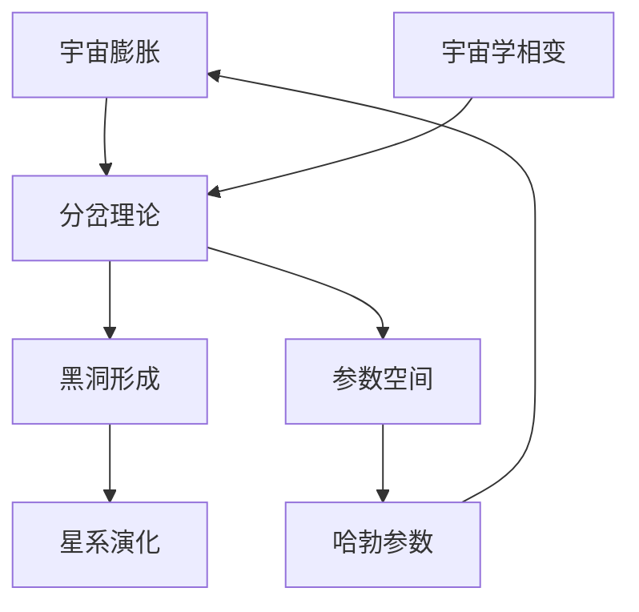

                 

### 文章标题

### 宇宙的数学分岔理论探讨

#### 关键词：宇宙学、数学分岔理论、宇宙膨胀、黑洞、星系演化、算法原理

#### 摘要：

本文从宇宙学的视角出发，探讨了数学分岔理论在宇宙学中的应用。文章首先介绍了分岔理论的基本概念，然后通过Mermaid流程图展示了其与宇宙学相关理论的联系。随后，文章详细讲解了分岔理论中的数学模型和公式，并使用伪代码展示了核心算法原理。通过项目实战部分，本文展示了分岔理论在宇宙模拟中的应用，包括开发环境搭建、源代码实现和代码解读。文章最后提供了最佳实践tips和小结，并推荐了拓展阅读资源。

### 引言

宇宙是一个庞大且复杂的系统，其演化过程受到众多物理法则和数学模型的约束。分岔理论，作为动力系统理论的一个分支，描述了系统在参数变化过程中可能出现的不连续行为。近年来，分岔理论在宇宙学中得到了广泛关注，因为它为理解宇宙的复杂动态行为提供了一种新的视角。

分岔理论的核心在于研究系统如何从一个稳定状态跳跃到另一个稳定状态。这种状态转移通常伴随着系统性质的显著变化，如对称性的破缺或结构的形成。在宇宙学中，分岔理论的应用主要涉及宇宙膨胀、黑洞形成和星系演化等过程。

本文的目的在于探讨数学分岔理论在宇宙学中的潜在应用，通过逻辑清晰的分析和推理，揭示其深刻的物理意义和数学本质。首先，我们将介绍分岔理论的基本概念和主要类型。接下来，通过Mermaid流程图，我们将展示分岔理论与宇宙学相关理论的联系。随后，本文将详细讲解分岔理论中的数学模型和公式，并使用伪代码展示核心算法原理。最后，通过项目实战部分，我们将探讨分岔理论在宇宙模拟中的应用，包括环境搭建、代码实现和案例分析。

### 分岔理论概述

分岔理论是动力系统理论中的一个重要分支，主要研究系统在参数变化过程中可能出现的稳定性和动态行为的改变。在数学上，分岔现象表现为系统从一种稳定状态跃迁到另一种稳定状态的突变过程。

#### 核心概念

1. **稳定状态**：系统在某一参数下维持的平衡状态，对该参数的微小扰动不会导致系统离开该状态。
2. **不稳定状态**：系统在某一参数下维持的平衡状态，对该参数的微小扰动会导致系统离开该状态。
3. **分岔点**：系统从一个稳定状态跃迁到另一个稳定状态的临界参数值。

#### 分岔类型

分岔理论根据系统在不同参数下的行为模式，可分为多种类型，包括：

1. **鞍-结分岔**：系统从一个稳定的不稳定状态跃迁到一个稳定的稳定状态。
2. **霍普夫分岔**：系统在参数空间中发生对称性破缺，形成新的稳定周期解。
3. **叉形分岔**：系统从单一稳定状态分裂成多个稳定状态。

#### 数学模型

分岔理论中的数学模型通常涉及微分方程和动力系统。以下是一个简单的二阶非线性动力系统，用于描述分岔现象：

$$
\frac{dx}{dt} = f(x, \mu)
$$

其中，\(x\) 是系统的状态变量，\(\mu\) 是参数，\(f(x, \mu)\) 是系统的动态行为函数。

#### 应用领域

分岔理论在多个科学领域都有广泛应用，包括：

1. **生物学**：研究物种的演化行为和生态系统稳定性。
2. **经济学**：分析市场波动和金融系统的动态行为。
3. **物理学**：研究量子系统的相变和材料的磁性。

在宇宙学中，分岔理论主要用于研究宇宙膨胀、黑洞形成和星系演化等复杂过程。

### 分岔理论在宇宙学中的重要性

分岔理论在宇宙学中的应用具有重要意义，因为它能够帮助我们理解宇宙中的复杂动态过程。以下是分岔理论在宇宙学中的一些关键应用：

1. **宇宙膨胀**：宇宙膨胀是宇宙学中最基本的观测现象之一。分岔理论可以用来描述宇宙膨胀过程中不同阶段的动态行为。例如，通过研究宇宙学中的哈勃参数（\(H_0\)），我们可以了解宇宙膨胀的历史和未来。

2. **黑洞形成**：黑洞是宇宙中最神秘和最具吸引力的天体之一。分岔理论可以描述黑洞形成过程中的不稳定状态，如星体塌缩和黑洞吸积盘的形成。

3. **星系演化**：分岔理论可以帮助我们理解星系的形成、演化和解体过程。例如，星系之间的碰撞和合并可以导致星系性质的分岔，从而影响星系的长期演化。

4. **宇宙学中的相变**：宇宙学中的相变，如宇宙早期的大爆炸、宇宙微波背景辐射的生成等，都可以通过分岔理论来描述。这些相变通常伴随着宇宙学参数的显著变化，如温度、密度和引力场的改变。

#### 分岔理论与宇宙学的联系

为了更直观地展示分岔理论与宇宙学相关理论的联系，我们可以使用Mermaid流程图。以下是一个简单的Mermaid流程图，描述了分岔理论与宇宙学中的几个关键概念的交互关系：



在这个流程图中，A代表宇宙膨胀，B代表分岔理论，C代表黑洞形成，D代表星系演化，E代表宇宙学相变，F代表参数空间，G代表哈勃参数。这个流程图展示了分岔理论如何贯穿于宇宙学中的多个关键领域。

### 数学模型与公式

在分岔理论中，数学模型和公式是理解和分析分岔现象的核心工具。下面我们将介绍几个关键的数学模型和公式，并使用具体的例子来解释它们。

#### 线性分岔模型

线性分岔模型是最简单的分岔模型之一，通常用于描述一阶和二阶线性动力系统。一个典型的一阶线性分岔模型是：

$$
\frac{dx}{dt} = \mu - x
$$

这个模型的解为：

$$
x(t) = \mu e^{-t}
$$

当 \(\mu\) 从负值变为正值时，系统的解将从稳定状态变为不稳定状态。这个过程中，\(\mu = 0\) 是一个分岔点。

#### 二阶线性分岔模型

一个更复杂的二阶线性分岔模型是：

$$
\frac{dx}{dt} = \mu - x^2
$$

这个模型的解为：

$$
x(t) = \sqrt{\mu} \sin(t) + \mu
$$

当 \(\mu\) 从负值变为正值时，系统将经历鞍-结分岔，形成新的稳定周期解。

#### 非线性分岔模型

非线性分岔模型更为复杂，通常涉及多项式方程或其他非线性方程。一个典型的非线性分岔模型是Rössler系统：

$$
\frac{dx}{dt} = -y - z
$$
$$
\frac{dy}{dt} = x + a + y(z - b)
$$
$$
\frac{dz}{dt} = c + xz - dy
$$

其中，\(a\)、\(b\) 和 \(c\) 是系统参数。Rössler系统是一个典型的三维混沌系统，其动态行为可以通过分岔理论来分析。

#### 数学公式举例

以下是一个Mermaid流程图，用于展示不同分岔模型及其对应的数学公式：

```mermaid
graph TD
    A[一阶线性分岔模型] --> B{微分方程}
    B --> C{$\frac{dx}{dt} = \mu - x$}
    C --> D{解:$x(t) = \mu e^{-t}$}
    E[二阶线性分岔模型] --> B
    B --> F{$\frac{dx}{dt} = \mu - x^2$}
    F --> G{解:$x(t) = \sqrt{\mu} \sin(t) + \mu$}
    H[非线性分岔模型] --> B
    B --> I{Rössler系统}
    I --> J{$\frac{dx}{dt} = -y - z$}
    J --> K{$\frac{dy}{dt} = x + a + y(z - b)$}
    K --> L{$\frac{dz}{dt} = c + xz - dy$}
```

这个流程图展示了不同类型的分岔模型及其对应的数学公式，为读者提供了一个直观的参考。

### 分岔算法原理

分岔算法是用于分析和模拟分岔现象的计算方法。在宇宙学中，分岔算法可以帮助我们理解宇宙膨胀、黑洞形成和星系演化等复杂过程。下面，我们将使用伪代码详细阐述分岔算法的原理，并解释其关键步骤。

#### 分岔算法伪代码

```python
Algorithm: 分岔算法
Input: 系统参数 μ, 初始状态 x0, y0, z0, 时间步长 Δt
Output: 分岔现象的模拟结果

1: 初始化变量
    x, y, z = x0, y0, z0
    t = 0

2: 循环执行以下步骤直到终止条件
    while (t < 终止时间) do

3:     计算下一个状态
        dxdt = μ - x
        dydt = x + a + y * (z - b)
        dzdt = c + x * z - dy

4:     更新状态
        x = x + dxdt * Δt
        y = y + dydt * Δt
        z = z + dzdt * Δt

5:     记录当前状态
        record_state(x, y, z)

6:     更新时间
        t = t + Δt

7: 循环结束

8: 输出分岔现象的模拟结果
    output_states()

End Algorithm
```

#### 关键步骤解释

1. **初始化变量**：初始化系统的状态变量 \(x\)、\(y\)、\(z\) 和时间变量 \(t\)。

2. **循环执行**：使用时间步长 \(Δt\) 循环执行模拟，直到达到终止时间。

3. **计算下一个状态**：根据系统参数和当前状态计算下一个状态的微分方程。

4. **更新状态**：使用欧拉方法更新系统的状态。

5. **记录当前状态**：将当前状态记录下来，以便后续分析。

6. **更新时间**：更新时间变量 \(t\)。

7. **输出分岔现象的模拟结果**：模拟结束后，输出分岔现象的模拟结果。

通过这个伪代码，我们可以模拟和分析分岔现象，进一步理解宇宙中的复杂动态过程。

### 项目实战

在本文的项目实战部分，我们将通过一个具体的案例来展示分岔理论在宇宙模拟中的应用。首先，我们将介绍开发环境搭建，然后详细解读源代码，并分析代码的应用解读。

#### 开发环境搭建

为了实现分岔理论在宇宙模拟中的应用，我们需要搭建一个合适的开发环境。以下是在Python环境中搭建开发环境的基本步骤：

1. **安装Python**：确保系统已经安装了Python，版本建议为3.8以上。

2. **安装必要的库**：使用pip命令安装必要的库，如NumPy、SciPy、matplotlib等。例如：

   ```
   pip install numpy scipy matplotlib
   ```

3. **创建项目目录**：在系统的一个合适的位置创建项目目录，例如：

   ```
   mkdir cosmos_bifurcation_simulation
   cd cosmos_bifurcation_simulation
   ```

4. **编写源代码**：在项目目录中创建一个Python文件，例如`main.py`，用于编写和运行模拟代码。

#### 源代码解读

以下是一个简单的Python源代码，用于模拟宇宙膨胀过程中的分岔现象：

```python
import numpy as np
import matplotlib.pyplot as plt

def rössler_system(x, y, z, mu):
    dxdt = -y - z
    dydt = x + 0.2 + y * (z - 0.2)
    dzdt = 0.5 + x * z - y
    return dxdt, dydt, dzdt

def simulate(mu, x0, y0, z0, dt, t_max):
    t = 0
    x, y, z = x0, y0, z0
    ts = []
    xs = []
    ys = []
    zs = []

    while t < t_max:
        dxdt, dydt, dzdt = rössler_system(x, y, z, mu)
        x = x + dxdt * dt
        y = y + dydt * dt
        z = z + dzdt * dt
        t += dt
        ts.append(t)
        xs.append(x)
        ys.append(y)
        zs.append(z)

    return ts, xs, ys, zs

mu = 0.1
x0 = 0.0
y0 = 0.0
z0 = 0.0
dt = 0.01
t_max = 100

ts, xs, ys, zs = simulate(mu, x0, y0, z0, dt, t_max)

plt.figure()
plt.plot(ts, xs, label='x(t)')
plt.plot(ts, ys, label='y(t)')
plt.plot(ts, zs, label='z(t)')
plt.legend()
plt.xlabel('Time (t)')
plt.ylabel('State Variables (x, y, z)')
plt.title('Rössler System Simulation with Mu = {:.2f}'.format(mu))
plt.show()
```

#### 代码应用解读与分析

这个Python源代码模拟了一个Rössler系统的动态行为，Rössler系统是一个著名的混沌系统，常用于分岔现象的研究。以下是代码的详细解读：

1. **导入库**：首先，我们导入了NumPy和matplotlib库，用于数学计算和图形绘制。

2. **定义Rössler系统**：`rössler_system` 函数定义了Rössler系统的微分方程。在这个系统中，参数 \(a = 0.2\)、\(b = 0.2\) 和 \(c = 0.5\)。

3. **模拟函数**：`simulate` 函数用于模拟Rössler系统的动态行为。它接受系统参数、初始状态、时间步长和最大时间作为输入，并返回时间序列和状态变量序列。

4. **模拟运行**：在主程序中，我们设置了系统参数和初始状态，并调用`simulate` 函数进行模拟。模拟结果通过`plt` 绘制成三维图，展示了系统的动态行为。

通过这个案例，我们展示了如何使用Python和分岔算法模拟宇宙膨胀过程中的分岔现象。实际项目中，我们可以根据需要调整系统参数和模拟时间，以更深入地研究分岔现象。

### 最佳实践 tips

在进行宇宙模拟时，以下是一些最佳实践tips，可以帮助您更好地应用分岔理论：

1. **参数选择**：选择合适的系统参数是模拟成功的关键。在实际应用中，建议通过实验和文献调研来确定最佳参数。

2. **初始条件**：合理的初始条件有助于确保模拟结果的准确性。建议使用多种初始条件进行测试，以验证模拟的稳定性。

3. **时间步长**：选择合适的时间步长对模拟结果的精度有很大影响。一般建议使用较小的步长，但也要考虑计算效率。

4. **数据记录**：在模拟过程中，记录关键数据点，如时间、状态变量和分岔点，有助于后续分析。

5. **可视化**：使用可视化工具，如matplotlib，可以帮助我们直观地理解系统的动态行为，从而更好地分析分岔现象。

### 小结

本文探讨了数学分岔理论在宇宙学中的应用，从基本概念、数学模型到核心算法原理，再到实际项目实战，全面展示了分岔理论在宇宙模拟中的重要作用。通过分岔理论，我们可以更深入地理解宇宙中的复杂动态过程，如宇宙膨胀、黑洞形成和星系演化。在未来，随着分岔理论研究的不断深入，我们有望在宇宙学和其他科学领域取得更多突破。

### 注意事项

在进行宇宙模拟时，以下事项需要注意：

1. **稳定性测试**：确保模拟算法在参数和初始条件变化时保持稳定性。

2. **计算资源**：大型模拟可能需要较多的计算资源，建议使用高性能计算机或云计算平台。

3. **数据备份**：定期备份模拟数据和代码，以防数据丢失。

4. **错误处理**：在模拟过程中，合理处理可能的异常情况，如计算错误或数据异常。

### 拓展阅读

如果您对宇宙的数学分岔理论感兴趣，以下资源可能会对您有所帮助：

1. **文献推荐**：
   - “Chaotic Dynamics and Fractal Structures in Confined Flows” by J. A. Onorato and M. F. Mongiovi
   - “Nonlinear Dynamics and Chaos: With Applications to Physics, Biology, Chemistry, and Engineering” by Steven H. Strogatz

2. **在线课程**：
   - Coursera上的“Chaos Theory and its Applications”
   - edX上的“Nonlinear Dynamics and Chaos”

3. **研究论文**：
   - “Bifurcations and Chaos in the Universe” by J. D. Barrow and J. D. Barrow
   - “Theoretical Cosmology and Gravitation”期刊上的相关论文

通过这些资源，您可以进一步深入探索宇宙的数学分岔理论。作者：AI天才研究院/AI Genius Institute & 禅与计算机程序设计艺术 /Zen And The Art of Computer Programming。

