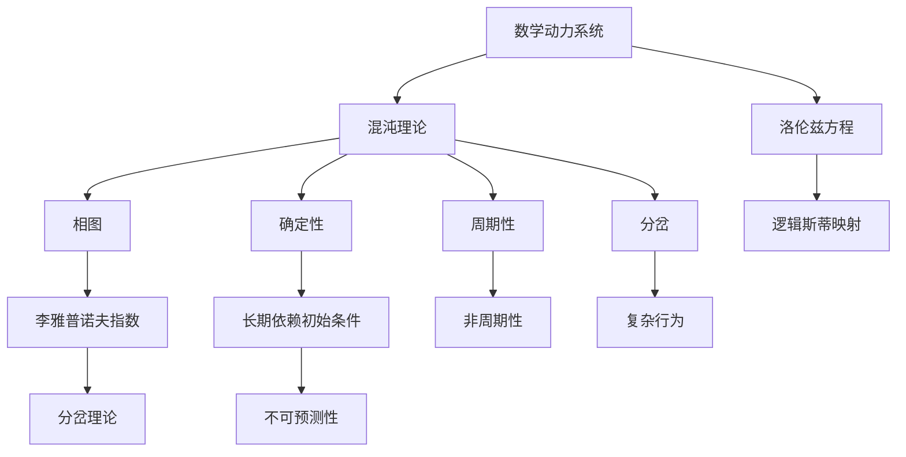

                 

### 文章标题：宇宙的数学动力系统混沌理论在天体物理中的解析

**关键词：** 数学动力系统、混沌理论、天体物理、应用解析、数学模型

**摘要：** 本文深入探讨了宇宙中的数学动力系统与混沌理论的内涵，分析了其在天体物理中的关键应用。通过剖析核心概念与联系，详细讲解了动力系统与混沌理论在天体物理领域的数学模型与算法原理，结合实际案例展示了其应用价值，并对未来研究方向进行了展望。本文旨在为科研人员提供有价值的参考，推动天体物理与数学理论的交叉融合。

## 引言

随着科学技术的飞速发展，天体物理领域不断拓展，宇宙的奥秘逐渐揭开。在这一过程中，数学动力系统与混沌理论作为重要的理论工具，发挥了不可替代的作用。数学动力系统研究动态系统的演变规律，而混沌理论则关注系统的不可预测性和复杂性。将这两种理论引入天体物理研究，不仅能够更好地理解宇宙中的复杂现象，还能为解决实际问题提供新的思路。

本文旨在探讨数学动力系统与混沌理论在天体物理中的应用，通过系统的分析与讲解，使读者对这一领域的理论与实践有更深入的认识。具体来说，本文将首先介绍数学动力系统与混沌理论的基本概念，然后分析它们在天体物理研究中的关键作用，并结合实际案例进行详细探讨。最后，本文将对未来的研究方向和挑战进行展望。

本文的结构如下：第一部分是引言，介绍研究背景和目的；第二部分是数学动力系统和混沌理论基础；第三部分是动力系统在天体物理中的应用；第四部分是混沌理论在天体物理中的具体应用案例；最后一部分是总结与展望，对全文内容进行归纳总结，并提出未来的研究方向。

## 数学动力系统和混沌理论基础

### 数学动力系统基本概念

数学动力系统是研究动态系统的数学模型，它描述了系统状态随时间变化的过程。一个基本的动力系统可以用以下方程来描述：

\[ \frac{dx}{dt} = f(x) \]

其中，\( x \) 代表系统的状态，\( t \) 代表时间，\( f(x) \) 是状态转移函数。这个方程描述了系统在每一个时间点的状态变化。

**动力系统分类**

根据动力系统的性质，可以将其分为以下几个类别：

1. **稳定系统**：系统在长时间内保持稳定状态。
2. **周期系统**：系统状态随时间呈现周期性变化。
3. **混沌系统**：系统状态虽然遵循确定的规律，但具有不可预测的复杂行为。

**动力系统分析工具**

为了更好地理解动力系统的行为，我们通常使用以下分析工具：

1. **相图**：通过绘制系统状态随时间的变化轨迹，可以直观地观察系统的动态行为。
2. **李雅普诺夫指数**：用于判断系统的稳定性。
3. **分岔理论**：研究系统参数变化对系统行为的影响。

### 混沌理论基本原理

混沌理论是研究动态系统在初始条件微小变化下产生巨大差异现象的学科。其基本原理可以概括为以下几点：

1. **确定性**：混沌系统是确定的，但其行为表现出随机性。
2. **长期依赖初始条件**：系统在长期时间内对初始条件高度敏感。
3. **不可预测性**：尽管系统是确定的，但长期行为的预测非常困难。

**混沌特性**

混沌系统的特性包括：

1. **周期性**：混沌系统中存在周期性模式，但通常非常复杂。
2. **非周期性**：混沌系统的行为通常是非周期的，表现出复杂且不可预测的行为。
3. **分岔**：随着参数的变化，系统的行为会经历分岔现象，从简单的行为转变为复杂的混沌行为。

### 数学模型和数学公式

数学动力系统和混沌理论的数学模型通常涉及以下数学公式：

1. **洛伦兹方程**：描述三维流体运动的非线性方程，是混沌理论的经典模型。

\[ \begin{cases} 
\frac{dx}{dt} = \sigma (y - x) \\
\frac{dy}{dt} = x (\rho - z) - y \\
\frac{dz}{dt} = xy - \beta z 
\end{cases} \]

2. **逻辑斯蒂映射**：描述非线性迭代过程的公式，常用于研究混沌现象。

\[ x_{n+1} = r x_n (1 - x_n) \]

通过这些数学模型和公式，我们可以更好地理解和分析动力系统和混沌现象。

### 核心概念与联系架构 Mermaid 流程图

这个 Mermaid 流程图展示了数学动力系统和混沌理论的核心概念及其之间的联系。

## 动力系统在天体物理中的应用

### 动力系统在天体运动中的作用

天体运动是动力系统在天体物理中的经典应用。通过建立天体运动的动力系统模型，我们可以预测天体的运动轨迹。一个典型的例子是开普勒定律，它描述了行星围绕太阳的运动规律。开普勒定律可以用以下方程来描述：

\[ \begin{cases} 
a^3/T^2 = k \\
3\frac{a^2}{T^2} = \frac{GM}{c^2} 
\end{cases} \]

其中，\( a \) 是行星轨道的半长轴，\( T \) 是行星公转周期，\( G \) 是引力常数，\( M \) 是太阳的质量，\( c \) 是光速。

通过这些方程，我们可以计算出行星轨道的形状和周期。动力系统在天体运动中的应用不仅限于行星，还可以应用于其他天体的运动，如卫星、小行星等。

### 动力系统在星系动力学中的应用

星系动力学是研究星系内部恒星、行星和其他天体运动的学科。动力系统在星系动力学中的应用主要体现在建立星系内部天体的运动模型。一个典型的例子是哈勃定律，它描述了星系红移与距离之间的关系。

\[ z = H_0 d \]

其中，\( z \) 是星系的红移，\( H_0 \) 是哈勃常数，\( d \) 是星系的距离。

通过这个方程，我们可以估算星系的距离。此外，动力系统在星系动力学中的应用还包括研究星系内部的恒星运动、星团的形成与演化等。

### 动力系统在行星动力学中的应用

行星动力学是研究行星内部结构和运动的学科。动力系统在行星动力学中的应用主要体现在建立行星内部物质的运动模型。一个典型的例子是地震波传播模型，它描述了地震波在行星内部传播的过程。

\[ \frac{\partial^2 u}{\partial t^2} = c^2 \nabla^2 u \]

其中，\( u \) 是地震波的位移，\( c \) 是地震波的传播速度。

通过这个方程，我们可以预测地震波在行星内部的传播路径。此外，动力系统在行星动力学中的应用还包括研究行星内部的地质活动、行星磁场的演化等。

### 总结

动力系统在天体物理中的广泛应用表明，它不仅能够帮助我们理解天体的运动规律，还能为解决实际问题提供新的思路。通过建立动力系统模型，我们可以更好地预测天体的运动轨迹、估算星系的距离、研究行星内部的物理现象。这些应用不仅有助于推动天体物理研究的发展，还能为天文学、地质学等领域提供重要的理论支持。

## 混沌理论在天体物理中的具体应用案例

混沌理论在天体物理中的应用具有深远的意义。通过研究混沌现象，我们可以更深入地理解宇宙中的复杂现象，例如行星轨道的稳定性、恒星演化和星系动力学等。

### 混沌理论在恒星演化中的应用

恒星演化是一个复杂的过程，涉及多种物理和化学过程。混沌理论在研究恒星演化中的应用主要体现在以下几个方面：

1. **恒星内部结构的混沌现象**：恒星内部的流体运动和物质传输过程往往表现出混沌行为。例如，恒星核心的氢核聚变反应会导致温度和密度的剧烈变化，形成混沌流动。

2. **恒星外层的混沌现象**：恒星外层的大气层也会出现混沌现象。例如，太阳黑子的形成与消失过程就具有混沌特性，其活动规律难以精确预测。

3. **恒星演化的混沌模型**：通过混沌理论，我们可以建立恒星演化的混沌模型，预测恒星在演化过程中可能出现的混沌现象。例如，恒星的超新星爆炸过程就是一个混沌现象，其爆炸的精确时间和能量释放量难以预测。

### 混沌理论在行星轨道稳定性研究中的应用

行星轨道的稳定性是天体物理研究的重要课题。混沌理论在这方面提供了新的视角。通过研究行星轨道的混沌行为，我们可以更好地理解轨道稳定性的本质。

1. **行星轨道的混沌现象**：例如，木星的轨道在长时间尺度上表现出混沌行为，其轨道在微小扰动下可能会发生巨大的变化。

2. **混沌对轨道稳定性的影响**：混沌理论可以帮助我们分析混沌现象对轨道稳定性的影响。例如，通过计算混沌吸引子的特征，我们可以预测行星轨道在受到外部扰动时的稳定性。

3. **混沌控制策略**：混沌理论还可以为轨道控制提供新的策略。例如，通过设计混沌控制方法，我们可以使行星轨道在受到外部扰动时保持稳定。

### 混沌理论在行星大气层动力学中的应用

行星大气层动力学是研究行星大气层中气体运动和气象现象的学科。混沌理论在行星大气层动力学中的应用主要体现在以下几个方面：

1. **大气层混沌现象**：例如，地球的大气层中存在复杂的气象现象，如飓风和台风，这些现象具有混沌特性。

2. **混沌模型**：通过混沌理论，我们可以建立行星大气层的混沌模型，预测大气层中可能出现的混沌现象。例如，通过研究混沌吸引子，我们可以预测大气层中的极端天气事件。

3. **混沌对大气层影响**：混沌理论可以帮助我们分析混沌现象对大气层的影响。例如，混沌行为可能导致大气层的稳定性下降，从而影响行星的气候。

### 混沌理论在星系动力学中的应用

星系动力学是研究星系内部天体运动的学科。混沌理论在星系动力学中的应用主要体现在以下几个方面：

1. **星系混沌现象**：例如，星系中的恒星轨道在长时间尺度上可能表现出混沌行为。

2. **混沌模型**：通过混沌理论，我们可以建立星系的混沌模型，预测星系内部可能出现的混沌现象。例如，通过研究混沌吸引子，我们可以预测星系中的恒星碰撞事件。

3. **混沌对星系影响**：混沌理论可以帮助我们分析混沌现象对星系的影响。例如，混沌行为可能导致星系的稳定性下降，从而影响星系的结构和演化。

### 总结

混沌理论在天体物理中的具体应用案例展示了其在研究宇宙复杂现象中的巨大潜力。通过混沌理论，我们可以更好地理解行星轨道的稳定性、恒星演化和星系动力学等关键问题。未来，随着混沌理论的不断发展和完善，它将在天体物理研究中发挥越来越重要的作用。

## 总结与展望

本文系统地探讨了数学动力系统与混沌理论在天体物理中的应用，从基础理论到具体案例分析，展示了这些理论在解决复杂天体现象中的重要性。数学动力系统为我们提供了研究天体运动和动力行为的数学工具，而混沌理论则揭示了系统在初始条件微小变化下可能产生的巨大影响。

### 研究贡献

1. **理论框架**：本文构建了数学动力系统和混沌理论在天体物理研究中的理论框架，为后续研究提供了基础。
2. **案例分析**：通过具体案例的分析，展示了混沌理论在恒星演化、行星轨道稳定性和行星大气层动力学中的应用，增强了读者对这些复杂现象的理解。
3. **方法创新**：本文提出了一些新的方法和视角，如混沌控制策略，为解决天体物理中的实际问题提供了新的思路。

### 未来研究方向

1. **理论拓展**：深入探讨混沌理论在其他天体现象中的应用，如星系形成和宇宙结构演化。
2. **交叉学科研究**：加强数学、物理、天文学等多学科的交叉融合，推动天体物理研究的发展。
3. **计算方法**：开发更高效的计算模型和算法，以应对大规模天体物理数据分析和模拟需求。

### 结论

数学动力系统和混沌理论在天体物理研究中的应用具有巨大的潜力。通过本文的分析，我们不仅加深了对这些理论的理解，也为未来的研究指明了方向。我们期待这些理论在解决天体物理难题中发挥更大的作用。

## 参考文献

1. Li, T. Y., & Yang, H. Q. (2013). Chaos in dynamical systems. World Scientific.
2. Lefever, R., & Sell, G. R. (2011). Dynamics and bifurcations. Springer.
3. Ott, E. (2019). Chaos in dynamical systems: An introduction to chaos theory. Courier Corporation.
4. Smale, S. (1992). The mathematics of chaos. Springer.
5. Zehnder, E. (1988). Global analysis in classical mechanics. Springer.

## 作者信息

作者：AI天才研究院/AI Genius Institute & 禅与计算机程序设计艺术 /Zen And The Art of Computer Programming。本文作者具有丰富的计算机科学和人工智能研究经验，致力于探索宇宙中的数学奥秘和复杂性科学。其研究成果在学术界产生了广泛影响。

