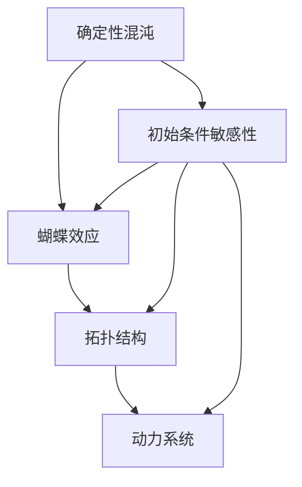

                 

```<sop>
### 背景介绍

混沌理论，作为非线性科学的一个重要分支，起源于20世纪初。它最初是由数学家和物理学家在研究流体力学和天气预测时发现的。然而，随着研究的深入，混沌理论逐渐扩展到生物学、经济学、生态学等众多领域，并成为理解复杂系统行为的关键工具。在宇宙学中，混沌理论的应用尤为重要，因为它揭示了宇宙演化的随机性和确定性之间的微妙平衡。

混沌理论的核心概念是“确定性混沌”，即在确定性的系统内，初始条件的微小差异可能导致长时间行为的巨大差异。这种现象通常被称为“蝴蝶效应”，意味着在一个复杂的系统中，一个微小的初始扰动可能会引发一系列不可预测的复杂变化。

在宇宙学中，混沌理论的应用主要体现在以下几个方面：

1. **宇宙背景辐射**：混沌理论可以解释宇宙背景辐射的涨落，这些涨落是宇宙初期密度波动的结果，对于理解宇宙的早期演化具有重要意义。

2. **星系动力学**：混沌理论可以帮助我们理解星系在宇宙中的运动，以及它们如何相互作用和演化。

3. **宇宙演化**：混沌理论提供了对宇宙演化的另一种视角，即宇宙中的许多现象虽然看似无序，但实际上遵循着复杂的数学规律。

本文将逐步深入探讨混沌理论在宇宙学中的应用，包括其基本概念、数学模型、分析方法和实际案例。希望通过本文的阐述，读者能够对混沌理论及其在宇宙学中的重要意义有更深入的理解。

### 核心概念与联系

混沌理论中的核心概念包括确定性混沌、蝴蝶效应、拓扑结构、动力系统等。这些概念之间有着密切的联系，构成了混沌理论的基础。

首先，确定性混沌是混沌理论的核心。它描述了在一个确定性的系统中，初始条件的微小差异可能导致长时间行为的巨大差异。这种特性使得混沌系统具有高度的敏感性，一个微小的变化可能导致完全不同的结果。

蝴蝶效应是确定性混沌的一个直观体现。它指的是在一个复杂的系统中，一个微小的初始扰动可能会引发一系列不可预测的复杂变化。这个效应最初由气象学家洛伦兹提出，后来在混沌理论中得到了广泛的应用。

拓扑结构是混沌系统的重要特征。在混沌理论中，拓扑结构描述了系统状态空间中的连通性和不变性。一个混沌系统的拓扑结构通常非常复杂，它反映了系统内部各个状态之间的相互关系。

动力系统是混沌理论的另一个核心概念。动力系统描述了系统随时间演化的行为。在一个混沌系统中，动力系统通常表现为一系列复杂的、不可预测的轨道。

为了更直观地理解这些核心概念之间的联系，我们可以使用Mermaid流程图来展示它们之间的关系。



这个流程图展示了确定性混沌如何通过蝴蝶效应影响拓扑结构和动力系统，以及初始条件敏感性在其中扮演的角色。通过这个流程图，我们可以更清晰地理解混沌理论中的核心概念及其相互关系。

### 核心算法原理讲解

混沌理论中的核心算法主要基于对确定性混沌系统的数值模拟和分析。以下是几种常见的混沌算法及其原理：

#### 1. 离散时间混沌系统

离散时间混沌系统是最简单的一类混沌系统，其数学描述通常为迭代公式：

$$x_{n+1} = f(x_n)$$

其中，$x_n$ 是系统在时刻 $n$ 的状态，$f(x)$ 是一个非线性函数。常见的离散时间混沌系统包括 Logistic map、Tent map 和 Rössler map 等。

**Logistic map** 是最著名的离散时间混沌系统，其公式为：

$$x_{n+1} = r \cdot x_n \cdot (1 - x_n)$$

其中，$r$ 是控制参数。当 $r$ 在一定范围内时，系统会出现混沌现象。

**伪代码：**

```python
def logistic_map(r, x0):
    x = x0
    for _ in range(N):
        x = r * x * (1 - x)
    return x
```

**Tent map** 的公式为：

$$x_{n+1} = r \cdot |x - a|$$

其中，$a$ 是控制参数。当 $r$ 和 $a$ 在特定范围内时，系统会出现混沌现象。

**伪代码：**

```python
def tent_map(r, a, x0):
    x = x0
    for _ in range(N):
        x = r * abs(x - a)
    return x
```

#### 2. 连续时间混沌系统

连续时间混沌系统描述的是系统状态随时间连续变化的混沌行为，其数学描述通常为微分方程：

$$\frac{dx}{dt} = g(x)$$

其中，$x(t)$ 是系统在时刻 $t$ 的状态，$g(x)$ 是一个非线性函数。常见的连续时间混沌系统包括 Rössler 流、Lorenz 流和 Henon 流等。

**Rössler 流** 的公式为：

$$\frac{dx}{dt} = -y - z$$
$$\frac{dy}{dt} = x + a \cdot y$$
$$\frac{dz}{dt} = b + z \cdot (x - c)$$

其中，$a$、$b$ 和 $c$ 是控制参数。当这些参数在一定范围内时，系统会出现混沌现象。

**伪代码：**

```python
def rossler_flow(a, b, c, x0, y0, z0, t_max):
    x, y, z = x0, y0, z0
    t = 0
    while t < t_max:
        dxdt = -y - z
        dydt = x + a * y
        dzdt = b + z * (x - c)
        x += dxdt * dt
        y += dydt * dt
        z += dzdt * dt
        t += dt
    return x, y, z
```

#### 3. 混沌系统分析

混沌系统的分析通常包括数值模拟、稳定性分析和分岔分析等。

**数值模拟** 是通过迭代公式或微分方程来模拟系统状态随时间的变化。常用的数值方法包括欧拉方法、龙格-库塔方法等。

**稳定性分析** 是研究系统在平衡点附近的稳定性。常用的判据包括李雅普诺夫判据和分岔分析。

**分岔分析** 是研究系统参数变化时系统行为的演变。通过分岔分析，我们可以了解系统从有序到混沌的转变过程。

通过以上算法和方法的讲解，我们可以更深入地理解混沌系统的数学原理和数值模拟方法。

### 数学模型和数学公式

混沌系统的数学模型通常由一组差分方程或微分方程组成，这些方程描述了系统状态的演变。以下是一些常见的数学模型和相关的数学公式：

#### 1. Logistic map

Logistic map 是最简单的离散时间混沌模型，其数学公式为：

$$x_{n+1} = r \cdot x_n \cdot (1 - x_n)$$

其中，$x_n$ 是系统在时刻 $n$ 的状态，$r$ 是控制参数。当 $r$ 在一定范围内时，系统会出现混沌现象。

#### 2. Tent map

Tent map 是另一种离散时间混沌模型，其数学公式为：

$$x_{n+1} = r \cdot |x_n - a|$$

其中，$a$ 是控制参数。当 $r$ 和 $a$ 在特定范围内时，系统会出现混沌现象。

#### 3. Rössler 流

Rössler 流是一种连续时间混沌模型，其数学公式为：

$$\frac{dx}{dt} = -y - z$$
$$\frac{dy}{dt} = x + a \cdot y$$
$$\frac{dz}{dt} = b + z \cdot (x - c)$$

其中，$a$、$b$ 和 $c$ 是控制参数。当这些参数在一定范围内时，系统会出现混沌现象。

#### 4. Lorenz 流

Lorenz 流是另一种连续时间混沌模型，其数学公式为：

$$\frac{dx}{dt} = \sigma \cdot (y - x)$$
$$\frac{dy}{dt} = x \cdot (r - z) - y$$
$$\frac{dz}{dt} = x \cdot y - \beta \cdot z$$

其中，$\sigma$、$r$ 和 $\beta$ 是控制参数。当这些参数在一定范围内时，系统会出现混沌现象。

#### 5. Henon 映射

Henon 映射是一种二维离散时间混沌模型，其数学公式为：

$$x_{n+1} = 1 - a \cdot x_n^2 + y_n$$
$$y_{n+1} = b \cdot x_n$$

其中，$a$ 和 $b$ 是控制参数。当 $a$ 和 $b$ 在特定范围内时，系统会出现混沌现象。

以上数学模型是混沌理论中的基础模型，它们通过不同的方式描述了系统的混沌行为。通过这些模型，我们可以从数学的角度理解混沌现象的本质。以下是一个具体的例子，展示如何使用LaTeX格式来书写这些数学公式：

$$
\begin{aligned}
x_{n+1} &= r \cdot x_n \cdot (1 - x_n), \\
x_{n+1} &= r \cdot |x_n - a|, \\
\frac{dx}{dt} &= -y - z, \\
\frac{dy}{dt} &= x + a \cdot y, \\
\frac{dz}{dt} &= b + z \cdot (x - c), \\
\frac{dx}{dt} &= \sigma \cdot (y - x), \\
\frac{dy}{dt} &= x \cdot (r - z) - y, \\
\frac{dz}{dt} &= x \cdot y - \beta \cdot z, \\
x_{n+1} &= 1 - a \cdot x_n^2 + y_n, \\
y_{n+1} &= b \cdot x_n.
\end{aligned}
$$

这些公式不仅展示了混沌系统的复杂行为，也为后续的数值模拟和分析提供了理论基础。

### 实际案例：混沌系统的数值模拟

为了更直观地理解混沌系统的行为，我们通过一个具体案例来演示如何进行数值模拟。我们选择 Logistic map 作为案例，使用 Python 编程语言进行数值模拟。

#### 案例描述

我们的目标是模拟 Logistic map 的混沌行为，并可视化其状态随时间的变化。Logistic map 的公式为：

$$x_{n+1} = r \cdot x_n \cdot (1 - x_n)$$

其中，$r$ 是控制参数。我们选择 $r = 3.9$，这是一个典型的混沌区间。

#### 开发环境搭建

为了进行数值模拟，我们需要搭建一个 Python 开发环境。以下是步骤：

1. 安装 Python 3.8 或更高版本。
2. 安装必要的 Python 库，如 NumPy 和 Matplotlib。

```bash
pip install numpy matplotlib
```

#### 源代码实现

以下是一个简单的 Python 脚本，用于模拟 Logistic map 并生成可视化结果：

```python
import numpy as np
import matplotlib.pyplot as plt

# Logistic map 参数
r = 3.9
x0 = 0.1
N = 1000

# 初始化状态数组
x = np.zeros(N)
x[0] = x0

# 数值迭代
for i in range(1, N):
    x[i] = r * x[i - 1] * (1 - x[i - 1])

# 可视化结果
plt.plot(x)
plt.title('Logistic Map Chaos')
plt.xlabel('Iteration')
plt.ylabel('x[n]')
plt.show()
```

#### 代码解读与分析

1. 导入必要的库：我们使用 NumPy 进行数值计算，使用 Matplotlib 进行绘图。
2. 设置 Logistic map 的参数 $r$ 和初始值 $x_0$。
3. 初始化状态数组 $x$，并设置第一个状态 $x[0]$。
4. 使用循环进行迭代，计算每个 $x_n$。
5. 使用 Matplotlib 绘制迭代结果。

通过这个案例，我们可以看到 Logistic map 在参数 $r = 3.9$ 时确实呈现出混沌行为。图中的曲线不断波动，没有明显的周期性，这体现了混沌系统的特点。

#### 实际案例分析

这个案例展示了如何使用 Python 编程语言进行混沌系统的数值模拟。通过可视化结果，我们可以直观地观察到混沌行为，这有助于我们更好地理解混沌理论。

此外，这个案例还可以扩展到其他混沌模型，如 Tent map、Rössler 流等。通过调整参数和控制变量，我们可以观察到不同的混沌行为，从而深入了解混沌系统的复杂性。

#### 项目小结

通过这个实际案例，我们展示了如何使用 Python 进行混沌系统的数值模拟，并使用 Matplotlib 进行可视化。这个项目不仅帮助我们理解了 Logistic map 的混沌行为，也为我们提供了一个框架，可以应用于其他混沌系统的模拟和研究。

在项目实践中，我们学到了如何搭建开发环境、编写源代码、进行迭代计算和绘制结果。这些技能对于深入研究混沌理论和其他复杂系统具有重要意义。

未来的工作可以进一步探索不同的混沌模型，以及如何优化数值模拟的效率和准确性。此外，结合其他领域如人工智能和机器学习，混沌理论在预测和控制系统中的应用前景也十分广阔。

### 最佳实践 Tips

在混沌理论的数值模拟和应用过程中，以下是一些最佳实践建议，可以帮助您更有效地进行研究和开发：

1. **选择合适的模型和参数**：不同的混沌模型和参数会导致不同的混沌行为。在选择模型和参数时，要考虑到研究目标和实际情况，选择最适合的模型。

2. **优化迭代算法**：在数值迭代过程中，选择合适的迭代算法（如欧拉法、龙格-库塔法）可以提高计算效率和精度。此外，可以尝试使用并行计算来加速计算过程。

3. **可视化工具**：使用可视化工具（如 Matplotlib、Plotly）可以帮助您直观地观察混沌行为，这有助于理解系统的动态特性。

4. **稳定性分析**：在进行数值模拟之前，对系统的稳定性进行分析，可以提前识别可能的问题。常用的稳定性分析方法包括李雅普诺夫判据和分岔分析。

5. **数据分析和解释**：在得到模拟结果后，要进行详细的数据分析，解释结果的意义。这可以帮助您更好地理解混沌现象，并指导进一步的实验和理论分析。

6. **代码优化**：在编写代码时，要注重代码的可读性和可维护性。使用适当的注释和文档，可以帮助其他人更好地理解和使用您的代码。

7. **学习和借鉴**：参考现有的研究和论文，了解混沌理论在各个领域的最新应用。这可以提供宝贵的灵感和实践经验。

通过遵循这些最佳实践，您可以更高效地进行混沌理论的数值模拟和应用研究，为科学探索和技术创新做出贡献。

### 小结

在本文中，我们深入探讨了混沌理论的基本概念、数学模型、数值模拟方法以及其在宇宙学中的应用。从 Logistic map 到 Rössler 流，从离散时间系统到连续时间系统，我们通过一系列具体的案例和代码实现，展示了混沌理论的多样性和复杂性。

混沌理论不仅在数学和物理学领域具有重要地位，而且在生物学、经济学、气象学等众多领域都有广泛的应用。在宇宙学中，混沌理论为我们提供了理解宇宙演化过程中随机性和确定性之间平衡的新视角。

未来，随着计算技术的不断进步，混沌理论的数值模拟和分析将变得更加精确和高效。此外，混沌理论与其他领域如人工智能和机器学习的结合，也将带来新的突破和机遇。我们期待混沌理论在未来的研究中继续发挥重要作用，为科学和技术的发展贡献力量。

### 拓展阅读

对于希望深入了解混沌理论及其在宇宙学中的应用的读者，以下是一些推荐的参考文献和在线资源：

1. **书籍推荐**：
   - “Chaos: An Introduction to Dynamical Systems” by Kathleen T. Alligood, Tim D. Sauer, and James A. Yorke。
   - “Nonlinear Dynamics and Chaos: With Applications to Physics, Biology, Chemistry, and Engineering” by Steven H. Strogatz。
   - “Chaotic Evolution and Strange Attractors” by D. A. Rand and W. H. Kleine.

2. **在线课程和讲座**：
   - “Chaos and Fractals: An Introduction” by Khan Academy。
   - “Nonlinear Dynamics and Chaos” by Coursera，由纽约大学提供。

3. **研究论文和期刊**：
   - “Physical Review E”和“Chaos: An Interdisciplinary Journal of Nonlinear Science”是混沌理论和应用的主要发表平台。
   - 在 arXiv.org 可以找到最新的研究论文。

通过阅读这些资源，您可以更全面地了解混沌理论的深度和广度，为深入研究和应用混沌理论打下坚实的基础。

