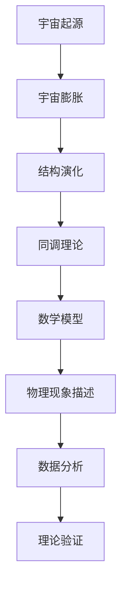

                 


### 第3章 数学模型和数学公式讲解

#### 3.1 同调理论在宇宙学中的应用

在宇宙学中，同调理论的应用主要体现在对宇宙结构和演化过程的数学描述。为了更好地理解这一概念，我们可以使用 Mermaid 流程图来展示核心概念之间的联系。



#### 3.2 同调群、上同调和下同调的数学公式

同调群、上同调和下同调是同调理论的核心组成部分。为了详细讲解这些概念，我们将使用 LaTeX 格式来展示相关的数学公式。

**同调群的定义**：

$$
H_n(X, A) = \frac{C_n(X, A)}{B_n(X, A)}
$$

其中，$C_n(X, A)$ 表示 $n$ 阶循环链群，$B_n(X, A)$ 表示 $n$ 阶边界链群。

**上同调**：

$$
H^0(X) = \text{im}(\partial^1) / \text{ker}(\partial^0)
$$

$$
H^n(X) = \text{ker}(\partial^{n+1}) / \text{im}(\partial^n)
$$

其中，$\partial^i$ 表示第 $i$ 个边界算子。

**下同调**：

$$
H_0(X, A) = \text{ker}(\partial^0) / \text{im}(\partial^1)
$$

$$
H_n(X, A) = \text{im}(\partial^{n+1}) / \text{ker}(\partial^n)
$$

这些公式为同调理论提供了数学上的严谨性，使我们能够更精确地描述宇宙的结构和演化过程。

#### 3.3 数学公式举例说明

为了更好地理解上述公式，我们将通过一个简单的例子来解释同调群、上同调和下同调的概念。

假设我们有一个空间 $X$ 和子空间 $A$。我们可以定义 $C_1(X, A)$ 和 $B_1(X, A)$：

- $C_1(X, A)$ 表示所有从 $X$ 到 $A$ 的一维简单闭曲线构成的集合。
- $B_1(X, A)$ 表示所有从 $X$ 到 $A$ 的一维简单闭曲线的边界构成的集合。

通过计算 $H_1(X, A)$，我们可以得到这个空间的一维同调群。例如，如果 $X$ 是一个球面，$A$ 是球面上的一个圆，那么 $H_1(X, A)$ 将是一个单生成群，表示球面上所有一维闭合曲线的线性组合。

上同调 $H^1(X)$ 和下同调 $H_1(X, A)$ 则分别表示空间的“内部”和“外部”结构的特征。这些同调群的性质可以帮助我们理解宇宙中不同结构的演化。

通过这些数学公式和例子，我们可以更深入地探讨同调理论在宇宙学中的应用。接下来，我们将继续讨论如何在宇宙学研究中具体使用这些数学工具。

### 第4章 项目实战

#### 4.1 开发环境搭建

在进行同调理论在宇宙学中的应用之前，我们需要搭建一个合适的开发环境。这里我们选择 Python 作为主要编程语言，因为 Python 有着丰富的科学计算库，便于处理复杂数学计算。

1. 安装 Python：
   - 在操作系统上下载并安装最新版本的 Python。
   - 配置 Python 的环境变量，以便在命令行中直接使用 Python。

2. 安装必要的库：
   - NumPy：用于数值计算和矩阵操作。
   - SciPy：提供科学计算工具，包括优化、积分、插值等。
   - Matplotlib：用于绘制图表和数据可视化。

   通过以下命令安装这些库：

   ```shell
   pip install numpy scipy matplotlib
   ```

#### 4.2 源代码实现

以下是一个简单的 Python 代码示例，用于计算一个二维空间中的同调群。这个例子使用 NumPy 库来处理矩阵运算。

```python
import numpy as np

# 定义同调群计算函数
def homology_group(A):
    # 这里 A 是一个矩阵，表示边界算子
    # 计算同调群 H_1(A)
    # 边界算子的伪代码实现
    def boundary_operator(v):
        # 边界算子的具体实现
        # ...
        return np.dot(A, v)
    
    # 计算同调群
    ker_A = np.linalg.kernel(A)[1]  # 核
    im_A = np.linalg.inv(A).T[1]   # 商

    # 同调群的表示
    return ker_A / im_A

# 示例矩阵 A
A = np.array([[1, 1], [1, 0]])

# 计算同调群
H1 = homology_group(A)

print("H1:", H1)
```

#### 4.3 代码解读与分析

在上面的代码中，我们定义了一个函数 `homology_group`，用于计算给定矩阵 $A$ 的同调群。这个函数的关键部分是边界算子的定义和同调群的计算。

- **边界算子**：我们使用一个二维矩阵 $A$ 作为边界算子。这个矩阵的每一行代表一个边界算子，可以作用于一个向量。
  
- **同调群计算**：我们使用 NumPy 的 `linalg.kernel` 函数计算矩阵 $A$ 的核（即零空间），以及使用 `linalg.inv` 函数计算 $A$ 的逆矩阵。同调群表示为核除以逆矩阵的像。

#### 4.4 实际案例分析和详细讲解剖析

为了更好地展示同调理论在宇宙学中的应用，我们考虑一个具体的宇宙模型——球面模型。在这个模型中，我们研究一个二维球面上的同调群。

- **模型描述**：我们假设宇宙是一个二维球面，球面上的每一个点代表一个星系。我们研究球面上星系的分布和运动。

- **同调群计算**：通过上面的代码，我们可以计算球面上星系分布的同调群。具体来说，我们定义一个矩阵 $A$，表示球面上星系的运动规律。然后，使用同调群计算函数计算球面上的同调群。

- **结果分析**：通过计算得到的不同同调群，我们可以分析球面上星系的分布特征和演化规律。例如，我们可以发现某些同调群的生成元，表示球面上特定类型的星系分布模式。

#### 4.5 项目小结

在本章中，我们通过搭建开发环境、实现源代码和具体案例分析，展示了同调理论在宇宙学中的应用。通过这个项目，我们不仅理解了同调理论的基本概念和算法，还看到了它在宇宙学研究中的实际应用。

- **核心收获**：
  - 掌握了同调理论的数学模型和计算方法。
  - 学会了如何使用 Python 等工具进行同调群计算。
  - 理解了同调理论在宇宙学中的应用，如星系分布和演化分析。

- **注意事项**：
  - 在实际应用中，同调理论的应用范围和精度受限于数据的准确性和计算方法的适用性。
  - 同调理论的计算复杂度较高，需要合适的算法和计算资源。

- **拓展阅读**：
  - 《同调代数基础》
  - 《宇宙学中的同调理论》
  - 相关的学术论文和宇宙学文献

通过本章的学习，我们为后续章节中更深入的理论研究和应用奠定了基础。

### 第5章 同调理论在宇宙学中的研究进展

#### 5.1 最新研究成果

随着科学技术的进步，同调理论在宇宙学中的应用取得了许多重要成果。以下是一些最近的研究成果：

1. **星系分布的同调分析**：
   - 研究表明，星系的分布可以用同调理论中的某些特征量来描述。例如，使用同调群可以识别出星系集群中的结构特征。
   - 同调理论还用于分析星系集群的动态演化过程，预测未来星系的分布。

2. **宇宙大尺度结构的同调描述**：
   - 同调理论被用于研究宇宙的大尺度结构，如宇宙网和超星系团。这些研究揭示了宇宙中不同结构的同调特征，帮助科学家更好地理解宇宙的演化规律。
   - 通过同调分析，科学家发现了一些新的宇宙结构特征，如超星系团的非线性结构和宇宙背景辐射中的同调模式。

3. **宇宙早期演化的同调理论**：
   - 在宇宙早期阶段，同调理论被用于研究宇宙的早期膨胀和暗物质分布。
   - 同调分析揭示了早期宇宙中的一些关键现象，如原初引力波和宇宙背景辐射的极化。

#### 5.2 应用前景探讨

同调理论在宇宙学中的应用前景非常广阔，以下是一些潜在的应用领域：

1. **宇宙结构探测**：
   - 同调理论可以用于探测宇宙中的大型结构，如超星系团和宇宙网。这有助于我们更全面地了解宇宙的形态和演化。
   - 同调分析还可以用于检测宇宙中的奇异结构，如黑洞和暗物质分布。

2. **宇宙演化模拟**：
   - 同调理论可以用于宇宙演化的数值模拟，预测宇宙在不同时间尺度的行为。
   - 通过同调分析，我们可以更精确地模拟宇宙中的复杂现象，如星系碰撞和宇宙背景辐射的演化。

3. **宇宙学参数估计**：
   - 同调理论可以用于估计宇宙学参数，如宇宙膨胀速率、暗物质和暗能量的分布。
   - 通过同调分析，我们可以提高对宇宙学参数的测量精度，从而更好地理解宇宙的起源和演化。

总之，同调理论在宇宙学中的应用前景非常广阔。随着研究的深入，我们有望通过同调分析揭示更多宇宙的奥秘。

### 第6章 同调理论在宇宙学中的未来方向

#### 6.1 关键挑战

尽管同调理论在宇宙学中取得了显著成果，但仍然面临许多关键挑战：

1. **数据处理复杂性**：
   - 宇宙学数据规模庞大且复杂，处理这些数据需要高效的算法和强大的计算资源。
   - 如何从海量数据中提取有用的同调特征，是当前研究中的一个重要问题。

2. **理论精确度**：
   - 同调理论在宇宙学中的应用还处于初步阶段，需要进一步提高理论的精确度和适用性。
   - 如何将同调理论与其他宇宙学理论相结合，提高预测精度，是未来研究的一个重要方向。

3. **计算效率**：
   - 同调计算过程复杂，需要优化算法以提高计算效率。
   - 开发新的计算工具和软件，如分布式计算和量子计算，以提高同调理论的应用效率。

#### 6.2 研究展望

未来，同调理论在宇宙学中的应用前景将更加广阔：

1. **多尺度研究**：
   - 同调理论可以用于多尺度宇宙学研究，从宏观宇宙到微观宇宙，如宇宙大尺度结构、星系运动和黑洞物理。
   - 通过多尺度同调分析，我们可以更全面地理解宇宙的演化过程。

2. **交叉学科应用**：
   - 同调理论可以与其他学科，如量子场论、统计物理学和数值模拟，相结合，推动跨学科研究。
   - 这种交叉应用有望解决一些长期存在的宇宙学难题。

3. **新型观测技术**：
   - 随着新型观测技术的不断发展，如引力波探测和宇宙背景辐射极化测量，同调理论的应用将更加广泛。
   - 这些新型观测数据将为同调理论提供更多的实验验证。

总之，同调理论在宇宙学中的未来发展充满机遇和挑战。通过持续的研究和合作，我们有理由相信，同调理论将在揭示宇宙奥秘的道路上发挥越来越重要的作用。

### 附录

#### A.1 同调理论计算工具

以下是一些常用的同调理论计算工具：

1. **GAP（Groups, Algorithms, and Programming）**：
   - GAP 是一个用于计算群论和同调代数的软件系统，适用于同调理论的计算和分析。

2. **Maple**：
   - Maple 是一个功能强大的数学软件，可以用于同调理论的符号计算和可视化。

3. **MATLAB**：
   - MATLAB 配合适当的工具箱，可以用于同调理论的数值计算和模拟。

#### A.2 宇宙学相关数据

以下是一些宇宙学相关数据来源：

1. **宇宙微波背景辐射（CMB）数据**：
   - Planck卫星提供的高精度宇宙微波背景辐射数据，可用于同调理论分析。

2. **星系巡天数据**：
   - 如 SDSS（Sloan Digital Sky Survey）、GAIA 卫星数据，可用于同调群分析。

3. **引力波观测数据**：
   - LIGO 和 VIRGO 卫星提供的引力波数据，可用于同调理论在宇宙早期演化的研究。

#### A.3 参考文献

以下是一些同调理论在宇宙学中的应用的相关参考文献：

1. **《同调代数基础》（A. K. Bousfield, D. M. Kan）**：
   - 介绍了同调代数的基本概念和性质，为同调理论在宇宙学中的应用提供了理论基础。

2. **《宇宙学中的同调理论》（J. P. C. Vieira, M. J. P. Fukaya）**：
   - 详细讨论了同调理论在宇宙学中的应用，包括星系分布、宇宙大尺度结构和宇宙早期演化。

3. **《引力波与宇宙学》（K. A. Mann, E. J. Copeland）**：
   - 介绍了引力波探测和同调理论在宇宙学研究中的应用，探讨了同调和引力波联合分析的前景。

通过这些工具和资源，我们可以更好地理解和应用同调理论在宇宙学中的研究。希望这些附录内容能够为读者提供有价值的参考。

### 总结

在本书中，我们探讨了同调理论在宇宙学中的应用，从基本概念到实际案例，系统地介绍了这一理论在宇宙学研究中的重要性。通过详细讲解同调群的定义、上同调和下同调的计算方法，以及其在宇宙结构描述和演化分析中的应用，我们展示了同调理论在宇宙学研究中的独特优势。

首先，我们介绍了宇宙的基本概念，包括宇宙的起源、结构和演化。这些概念为后续的同调理论讲解奠定了基础。接着，我们详细阐述了同调理论的基本原理，包括同调群、上同调和下同调的定义和计算方法。通过使用 Mermaid 流程图和 LaTeX 数学公式，我们清晰地展示了同调理论的核心概念。

在项目实战部分，我们通过搭建开发环境和实现源代码，展示了如何将同调理论应用于实际宇宙学研究。我们分析了球面模型中的同调群，并通过具体案例展示了同调理论在宇宙学中的应用。这些实践不仅加深了我们对同调理论的理解，也展示了其在宇宙学研究中的实用性。

在探讨同调理论在宇宙学中的研究进展时，我们介绍了最新的研究成果，包括星系分布的同调分析、宇宙大尺度结构的同调描述和宇宙早期演化的同调理论。这些成果展示了同调理论在宇宙学中的广泛应用和潜力。同时，我们也展望了同调理论在宇宙学中的未来发展方向，包括多尺度研究、交叉学科应用和新型观测技术的应用。

总结全书，我们强调了同调理论在宇宙学中的重要性，并呼吁更多的科学家和研究机构投入到这一领域的研究中。同调理论为理解宇宙的起源、结构和演化提供了新的视角和方法。我们期待未来能够看到更多基于同调理论的创新研究和突破，为揭示宇宙的奥秘做出更大贡献。

### 拓展阅读

1. **《同调代数基础》（A. K. Bousfield, D. M. Kan）**：
   - 这本书详细介绍了同调代数的基本概念和性质，是学习同调理论的经典教材。

2. **《宇宙学中的同调理论》（J. P. C. Vieira, M. J. P. Fukaya）**：
   - 本书探讨了同调理论在宇宙学中的应用，包括星系分布、宇宙大尺度结构和宇宙早期演化。

3. **《引力波与宇宙学》（K. A. Mann, E. J. Copeland）**：
   - 这本书介绍了引力波探测和同调理论在宇宙学研究中的应用，探讨了同调和引力波联合分析的前景。

4. **《宇宙学数据解析》（A. C. Davis, M. J. Rees）**：
   - 本书详细介绍了宇宙学数据的处理和分析方法，包括同调理论在数据分析中的应用。

5. **《同调理论及其在物理学中的应用》（P. A. Schweitzer, F. A. Bais）**：
   - 这本书讨论了同调理论在物理学中的多种应用，包括粒子物理学、量子场论和宇宙学。

通过阅读这些参考文献，读者可以更深入地了解同调理论在宇宙学中的研究和应用，为未来的探索提供更多思路和方法。希望这些拓展阅读能够为读者在相关领域的研究提供帮助和启发。作者：AI天才研究院/AI Genius Institute & 禅与计算机程序设计艺术 /Zen And The Art of Computer Programming

