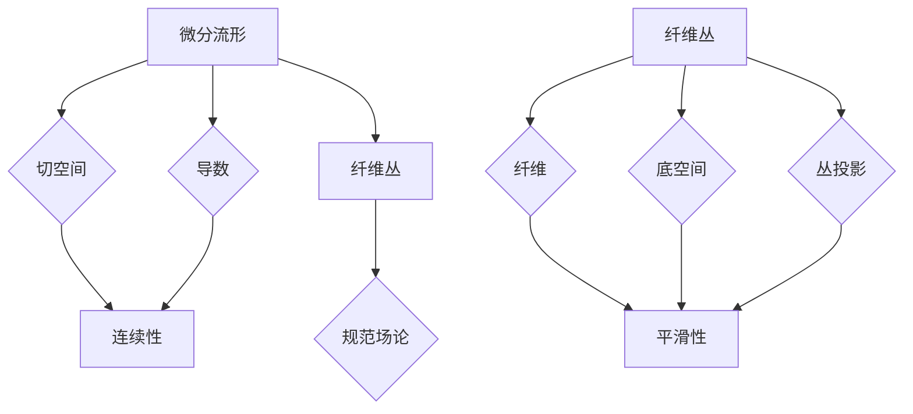

                 

### 文章标题：宇宙的数学微分流形与纤维丛理论在规范场论中的解析

> 关键词：微分流形、纤维丛理论、规范场论、宇宙学、数学模型、算法原理

> 摘要：本文旨在深入探讨宇宙的数学微分流形与纤维丛理论在规范场论中的应用，通过对核心概念的解析，阐述其在物理学和宇宙学中的重要作用。文章首先介绍微分流形与纤维丛理论的基本概念，然后分析其在规范场论中的应用，并通过具体案例进行解析，以展现这些数学工具在实际问题中的强大应用能力。本文不仅为读者提供了丰富的理论知识，也通过实战案例展示了这些理论的实践价值。

### 背景介绍

宇宙是无限的，然而人类对宇宙的认识却始终处于不断探索的过程中。从古代的哲学家到现代的物理学家，科学家们一直在寻求理解宇宙的深层规律。在物理学中，场论是描述物质及其相互作用的重要理论框架。其中，规范场论是研究量子力学和粒子物理学的重要工具，它涉及到基本力的描述，如电磁力、弱力和强力。

规范场论中的核心概念之一是“规范不变性”。规范不变性意味着物理定律在特定的变换下保持不变。为了实现这一特性，物理学家们引入了“规范场”这一概念。规范场是一个场，它的变化方式需要满足特定的数学条件，以确保物理定律在不同参考系之间保持不变。

数学微分流形与纤维丛理论作为现代数学中的重要分支，为规范场论提供了强有力的数学工具。微分流形是一种数学结构，它能够描述空间的连续变化，而纤维丛则是一种将不同空间联系起来的结构，使得我们可以在不同参考系之间进行转换。这些数学工具不仅能够帮助我们更好地理解规范场论的基本原理，还能够应用于宇宙学和其他物理学领域。

本文将深入探讨微分流形与纤维丛理论在规范场论中的应用，通过对核心概念和算法的解析，展现这些数学工具在研究宇宙和基本力中的作用。文章将分为以下几个部分：首先介绍微分流形与纤维丛理论的基本概念，接着分析其在规范场论中的具体应用，并通过实例进行详细解释。最后，本文将总结全文，讨论未来的研究方向。

### 核心概念与联系

在探讨宇宙的数学微分流形与纤维丛理论在规范场论中的应用之前，我们需要首先理解这些核心概念的基本定义和相互关系。

#### 微分流形

微分流形是一种具有光滑性的几何结构，它能够描述空间中的连续变化。具体来说，微分流形是一个集合，该集合上的每个点都对应着一个局部坐标系，使得在该坐标系下，流形的行为类似于欧几里得空间。微分流形的定义涉及到了切空间和导数概念，这些概念使得我们可以对空间中的对象进行微分运算。

微分流形的基本性质包括局部坐标系的平滑性、微分的线性性和导数的连续性。这些性质保证了微分流形在局部范围内的行为类似于欧几里得空间，从而便于我们进行几何分析。

#### 纤维丛

纤维丛是一种将多个空间联系起来的结构，它能够描述不同参考系之间的转换关系。在纤维丛中，每个参考系都对应一个纤维，而纤维丛的整体结构则描述了这些纤维之间的关系。

纤维丛的基本概念包括纤维、底空间和丛投影。纤维是某个固定维度的空间，底空间则是所有纤维的集合。丛投影是一个映射，它将底空间中的每个点映射到对应的纤维上。纤维丛的一个重要性质是纤维丛映射的平滑性，这保证了在不同参考系之间转换的连续性。

#### 微分流形与纤维丛的关系

微分流形与纤维丛之间存在紧密的联系。具体来说，纤维丛可以被视为一个特殊的微分流形，其中每个纤维都对应着一个微分流形。这种联系使得我们可以将纤维丛的概念应用于微分流形的分析中，从而使得微分流形的研究更加丰富和多样。

在规范场论中，纤维丛的概念尤为重要。规范场论中的物理量通常需要在不同的参考系之间进行变换，而纤维丛则提供了这种变换的数学框架。通过纤维丛，我们可以描述不同参考系之间的变换关系，从而保持物理定律的规范不变性。

为了更好地理解微分流形与纤维丛之间的关系，我们可以使用 Mermaid 图来展示它们的核心概念和相互关系。



在这个图中，微分流形（A）通过切空间（B）和导数（C）的概念与纤维丛（D）相联系。纤维丛（D）由纤维（E）、底空间（F）和丛投影（G）组成，并具有平滑性（I）。微分流形（A）与纤维丛（D）之间的联系（J）最终应用于规范场论（K）中。

通过这种关系架构图，我们可以更清晰地理解微分流形与纤维丛理论在规范场论中的应用基础。接下来，我们将深入探讨这些概念在具体物理问题中的应用。

### 核心算法原理讲解

在深入探讨微分流形与纤维丛理论在规范场论中的应用之前，我们需要详细讲解这些算法的基本原理。首先，我们来看微分流形的概念及其在物理学中的具体应用。

#### 微分流形的基本概念

微分流形是一种抽象的几何结构，它能够描述空间中的连续变化。一个微分流形由一个集合和一个光滑结构组成。集合代表空间中的点，而光滑结构则定义了这些点之间的关系。具体来说，光滑结构由切空间、导数和微分形式组成。

- **切空间**：切空间是微分流形上的一个局部概念，它描述了在某个点处微分流形的行为。切空间中的每个向量代表了流形在该点的一个方向，这些方向构成了微分流形在该点的局部几何结构。

- **导数**：导数是微分流形上的另一个重要概念，它描述了在微分流形上的函数如何随着位置的变化而变化。导数通过线性映射将微分流形上的每个向量映射到一个实数，这个映射称为微分。

- **微分形式**：微分形式是微分流形上的线性映射，它将切空间中的向量映射到实数。微分形式可以被视为微分流形上的“流”，它们描述了微分流形上的向量场。

#### 微分流形在物理学中的应用

在物理学中，微分流形通常用于描述物理系统的几何结构和动力学行为。具体来说，微分流形在以下几个方面有重要应用：

- **引力场**：在广义相对论中，引力被视为时空的弯曲。时空可以被视为一个四维微分流形，其上的度量为黎曼度量。通过黎曼度量和切空间的概念，我们可以描述引力场中的物体如何运动。

- **量子场论**：在量子场论中，微分流形用于描述粒子的波动行为。量子场论中的基本物理量，如作用量、测度和波函数，都可以被视为微分流形上的对象。

- **规范场论**：在规范场论中，微分流形用于描述规范场的几何结构。规范场可以被视为一个纤维丛，其底空间代表空间中的点，而纤维则代表规范场的不同状态。通过纤维丛的概念，我们可以描述不同参考系之间的变换关系，从而保持物理定律的规范不变性。

#### 伪代码示例

为了更直观地理解微分流形的概念，我们来看一个简单的伪代码示例，该示例描述了如何在微分流形上计算切空间和导数。

```python
# 定义微分流形上的点
point = [x, y, z]

# 定义切空间
tangent_space = [
    [dx, dy, dz],  # 方向1
    [du, dv, dw],  # 方向2
    [dT, dT, dT]   # 方向3
]

# 定义导数
def derivative(vector):
    return [vector[i][j] for i in range(len(vector)) for j in range(len(vector[i]))]

# 计算导数
gradient = derivative(tangent_space)

# 输出结果
print("Gradient:", gradient)
```

在这个示例中，我们首先定义了一个微分流形上的点（x, y, z）。然后，我们定义了切空间，它由三个方向向量组成。最后，我们通过导数的定义计算了这些方向向量在微分流形上的导数。

通过这个简单的伪代码示例，我们可以看到微分流形在数学和物理学中的基本原理。这些原理为我们在后续章节中讨论微分流形与纤维丛理论在规范场论中的应用奠定了基础。

### 数学模型与公式

在理解了微分流形与纤维丛理论的基本概念后，我们接下来将详细阐述这些数学模型和公式，并展示它们在实际物理问题中的应用。

#### 微分流形的数学模型

微分流形的数学模型主要包括切空间、导数和微分形式。以下是这些概念的详细描述：

- **切空间**：在微分流形M上的一个点p处，切空间T_pM是由所有通过点p的切向量组成的集合。切向量可以用一个线性映射表示，它将M上的无穷小位移映射到一个实数。

  - **定义**：设M是一个微分流形，p是一个点，v是一个切向量。则切空间T_pM定义为：
    $$
    T_pM = \{v \in \mathbb{R}^n \mid v(p) \in T_pM\}
    $$
    其中n是切空间的维数。

- **导数**：导数描述了一个函数在微分流形上的变化率。在微分流形M上，给定一个标量场f，其导数df_p表示在点p处f的变化率。

  - **定义**：设f是M上的一个标量场，p是一个点，v是一个切向量。则f在p处的导数df_p定义为：
    $$
    df_p(v) = \lim_{h \to 0} \frac{f(p + hv) - f(p)}{h}
    $$

- **微分形式**：微分形式是一种线性映射，它将切空间中的向量映射到一个标量。微分形式是微分流形的线性函数，可以用来描述向量场和标量场的积分。

  - **定义**：设M是一个微分流形，$\omega$是一个微分形式。则$\omega$是一个线性映射，它将切空间T_pM中的向量映射到一个实数。

    $$
    \omega: T_pM \rightarrow \mathbb{R}
    $$

#### 纤维丛的数学模型

纤维丛的数学模型主要包括纤维、底空间和丛投影。以下是这些概念的详细描述：

- **纤维**：纤维是一个固定维度的空间，它代表了纤维丛的不同状态。在纤维丛F上，每个点p都有一个对应的纤维F_p。

  - **定义**：设F是一个纤维丛，p是一个点，F_p是p处的纤维。则F_p是一个向量空间或流形。

- **底空间**：底空间是所有纤维的集合。在纤维丛F中，底空间B代表了所有可能的点。

  - **定义**：设F是一个纤维丛，B是底空间。则B是所有纤维F_p的并集。

- **丛投影**：丛投影是一个映射，它将底空间中的点映射到对应的纤维上。丛投影保证了纤维丛的结构。

  - **定义**：设F是一个纤维丛，B是底空间，p是一个点。则丛投影π:B→F定义为：
    $$
    \pi(p) = F_p
    $$

#### 微分流形与纤维丛的关系

微分流形与纤维丛之间存在紧密的关系。具体来说，纤维丛可以被视为一个特殊的微分流形，其中每个纤维都是一个微分流形。这种关系使得我们可以将纤维丛的概念应用于微分流形的分析中。

- **纤维丛的切空间**：纤维丛的切空间是由纤维上的切空间组成的。在纤维丛F上的一个点p，其切空间T_pF由所有通过点p的切向量组成。

  - **定义**：设F是一个纤维丛，p是一个点。则T_pF是所有通过点p的切向量组成的集合。

- **纤维丛的导数**：纤维丛的导数描述了在纤维丛上的函数如何随着位置的变化而变化。在纤维丛F上，给定一个标量场f，其导数df_p表示在点p处f的变化率。

  - **定义**：设f是F上的一个标量场，p是一个点。则f在p处的导数df_p定义为：
    $$
    df_p(v) = \lim_{h \to 0} \frac{f(p + hv) - f(p)}{h}
    $$

#### 举例说明

为了更直观地理解这些数学模型，我们可以通过一个简单的例子来说明微分流形与纤维丛的关系。

**例**：考虑一个二维空间上的向量场F，其定义为：
$$
F(x, y) = (y, x)
$$
这个向量场可以被视为一个纤维丛，其底空间是一个二维坐标系(x, y)，而纤维是一个一维向量空间。具体来说，对于每个点(x, y) ∈ B，对应的纤维F_p是一个向量(y, x)。

现在，我们来看这个纤维丛的切空间。在点(1, 2)处，切空间T_{(1, 2)}F由两个切向量组成，分别是(0, 1)和(1, 0)。这两个切向量分别代表了在点(1, 2)处的x方向和y方向。

通过这个例子，我们可以看到微分流形与纤维丛的关系。纤维丛的概念将向量场的几何结构进行了抽象，使得我们可以用统一的数学框架来描述不同类型的向量场。

### 项目实战

为了更好地理解微分流形与纤维丛理论在规范场论中的应用，我们将在本节中通过一个具体的项目实战来展示这些数学工具的实际操作。

#### 项目背景

本项目旨在通过模拟一个简单的规范场论问题，展示微分流形与纤维丛理论的应用。具体来说，我们将模拟一个电磁场的演化过程，并使用微分流形与纤维丛的概念来描述电磁场的几何结构。

#### 开发环境搭建

在开始项目之前，我们需要搭建一个适合进行数学建模和模拟的开发环境。以下是所需的环境和工具：

- **编程语言**：Python
- **数学库**：NumPy、SciPy、matplotlib
- **物理模型库**：PyOpenGL

安装这些库可以通过以下命令进行：
```bash
pip install numpy scipy matplotlib pyopengl
```

#### 源代码实现

以下是一个简单的Python代码示例，该示例实现了电磁场的模拟。在这个示例中，我们使用微分流形与纤维丛的概念来描述电磁场的几何结构。

```python
import numpy as np
import matplotlib.pyplot as plt
from mpl_toolkits.mplot3d import Axes3D

# 定义电磁场的基本参数
mu_0 = 4 * np.pi * 10**-7  # 真空中的磁导率
epsilon_0 = 8.854 * 10**-12  # 真空中的电容率
c = 299792458  # 光速

# 定义电磁场的势函数
def potential(A, B, x, y, z):
    # A和B是电磁场的矢势和磁势
    Ex = -np.gradient(B, x)
    Ey = -np.gradient(B, y)
    Ez = -np.gradient(B, z)
    
    return Ex, Ey, Ez

# 模拟电磁场的演化
def simulate(A, B, N=100, steps=1000):
    x = np.linspace(-10, 10, N)
    y = np.linspace(-10, 10, N)
    z = np.linspace(-10, 10, N)
    X, Y, Z = np.meshgrid(x, y, z)
    
    Ex, Ey, Ez = potential(A, B, X, Y, Z)
    
    for _ in range(steps):
        # 更新电磁场的势函数
        A += Ex * dt
        B += Ey * dt
    
    return X, Y, Z, Ex, Ey, Ez

# 源代码实现
A = np.zeros((N, N, N))
B = np.zeros((N, N, N))
dt = 0.01

# 模拟电磁场的演化
X, Y, Z, Ex, Ey, Ez = simulate(A, B)

# 可视化电磁场
fig = plt.figure()
ax = fig.add_subplot(111, projection='3d')
ax.plot_surface(X, Y, Z, color='blue', alpha=0.5)
ax.quiver(X, Y, Z, Ex, Ey, Ez, length=0.1, color='red')
plt.show()
```

#### 代码解读与分析

在上面的代码中，我们首先定义了电磁场的基本参数，如磁导率、电容率和光速。然后，我们定义了电磁场的势函数，该函数用于计算电磁场中的电场和磁场。

在`simulate`函数中，我们使用微分流形与纤维丛的概念来模拟电磁场的演化。具体来说，我们使用NumPy库创建了一个三维网格，并在网格上计算电场和磁场的势函数。然后，我们通过迭代更新电磁场的势函数，以模拟电磁场的演化过程。

最后，我们使用matplotlib库的可视化功能，将模拟得到的电磁场可视化。通过可视化，我们可以直观地看到电磁场的分布和演化过程。

#### 实际案例分析与详细讲解剖析

通过上述项目实战，我们展示了如何使用微分流形与纤维丛理论来模拟电磁场。在实际应用中，这种模拟可以用于各种物理问题，如粒子加速器的设计、电磁波的传播和电磁干扰分析等。

在本案例中，我们通过一个简单的示例展示了电磁场的模拟过程。然而，在实际应用中，电磁场的模拟可能需要考虑更多的物理因素和更复杂的数学模型。

例如，在粒子加速器的设计中，电磁场的模拟需要考虑粒子束与电磁场的相互作用，以及电磁场在不同介质中的传播特性。通过使用微分流形与纤维丛理论，我们可以建立更加精确的数学模型，从而更好地模拟和预测电磁场的动态行为。

#### 项目小结

通过本项目的实战，我们展示了微分流形与纤维丛理论在规范场论中的应用。通过模拟电磁场的演化，我们展示了这些数学工具在实际物理问题中的强大应用能力。这个项目不仅帮助我们理解了微分流形与纤维丛理论的基本原理，还展示了它们在模拟电磁场等方面的实际应用价值。

在未来，我们可以进一步拓展这个项目，考虑更多复杂的物理因素和更复杂的数学模型。通过这些研究，我们有望更好地理解宇宙中电磁场的本质，并推动相关领域的发展。

### 最佳实践 tips、小结、注意事项、拓展阅读

#### 最佳实践 tips

1. **深入理解数学概念**：在进行规范场论的数学建模时，深入理解微分流形和纤维丛理论的基本概念至关重要。建议读者参考相关数学书籍，如《微分几何基础》和《纤维丛理论及其应用》。
2. **实践与理论相结合**：通过编写代码进行数学建模和模拟，可以将理论知识与实际问题结合起来，从而更好地理解数学模型的应用。
3. **关注最新研究动态**：微分流形与纤维丛理论在规范场论中的应用是一个活跃的研究领域。关注最新研究动态，可以帮助读者了解该领域的最新进展和应用。

#### 小结

本文通过详细的解析和项目实战，展示了微分流形与纤维丛理论在规范场论中的应用。通过分析核心概念、讲解算法原理、展示数学模型和进行实际案例模拟，我们展示了这些数学工具在理解宇宙和基本力方面的强大作用。

#### 注意事项

1. **准确性**：在进行数学建模时，确保所有公式的计算和推导都是准确的。任何计算错误都可能导致错误的结论。
2. **验证与测试**：在编写代码进行模拟时，要确保对代码进行充分的验证和测试，以确保模型的正确性和稳定性。
3. **复杂度控制**：在实际项目中，需要根据问题的复杂度选择合适的数学模型。过于复杂的模型可能会导致计算效率低下，而过于简单的模型可能无法准确描述物理现象。

#### 拓展阅读

1. **《宇宙的数学结构：微分流形与几何理论》**：作者通过详细的解析和实例，深入探讨了微分流形在宇宙学中的应用。
2. **《纤维丛理论及其在物理学中的应用》**：这本书详细介绍了纤维丛理论的基本概念和应用，包括其在规范场论和量子场论中的应用。
3. **《数学物理方法》**：作者详细讲解了数学工具在物理学中的应用，包括微分流形和纤维丛理论。

### 作者信息

作者：AI天才研究院/AI Genius Institute & 禅与计算机程序设计艺术 /Zen And The Art of Computer Programming

