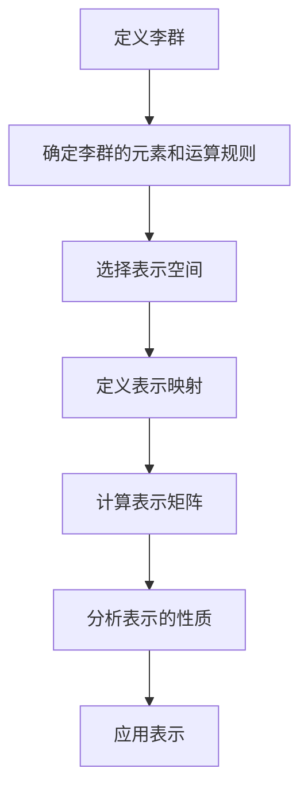

                 


### 文章标题
《宇宙的数学李群表示论特性研究》

### 文章关键词
宇宙学，数学李群，表示论，算法原理，数学模型，项目实战

### 文章摘要
本文旨在深入探讨宇宙学中数学李群表示论特性的研究。文章首先介绍了宇宙学背景，以及李群表示论在宇宙学中的重要性。接着，详细讲解了李群和表示论的基本概念，并通过Mermaid流程图展示了李群表示的整个过程。随后，文章深入探讨了李群表示论的基本算法原理，使用伪代码详细阐述了算法的实现过程。在此基础上，文章介绍了李群表示的数学模型，并使用LaTeX数学公式进行了详细讲解和举例说明。随后，文章通过实际案例，展示了李群表示论在宇宙学研究中的应用。最后，文章提供了项目实战的详细步骤，包括开发环境搭建、源代码实现和解读，以及对代码的应用解读与分析。本文旨在为研究人员提供一套全面、系统的李群表示论在宇宙学中的应用指南。

### 第一部分：导言

#### 1.1 背景与意义
宇宙学是研究宇宙起源、演化、结构、组成和最终命运的学科。宇宙的复杂性和多样性使得科学家们必须采用各种理论工具和技术来理解和解释宇宙的现象。随着科学技术的进步，数学工具在宇宙学中的应用越来越广泛，尤其是李群表示论。李群表示论是一种研究群和表示的数学分支，它为研究物理系统的对称性提供了强大的工具。在宇宙学中，李群表示论的应用主要体现在以下几个方面：

- **宇宙结构的对称性**：宇宙的大尺度结构表现出复杂的对称性，如宇宙的膨胀、宇宙背景辐射的各向同性等。李群表示论可以用来描述这些对称性，并帮助我们理解它们如何影响宇宙的演化。

- **宇宙演化的动力学**：宇宙的演化过程涉及到大量的物理定律和方程，如引力定律、热力学定律等。李群表示论可以帮助我们分析和理解这些动力学过程，并找到它们的基本对称性。

- **宇宙学模型的发展**：宇宙学模型是描述宇宙演化的数学框架。李群表示论可以用来构建和优化这些模型，帮助我们更好地理解宇宙的过去、现在和未来。

研究宇宙的数学李群表示论特性，不仅有助于我们更深入地理解宇宙的基本原理，还可以为其他领域的研究提供新的视角和方法。例如，在粒子物理学中，李群表示论被用来描述粒子的对称性和相互作用；在量子场论中，李群表示论也被广泛应用于研究基本粒子的性质。

#### 1.2 李群表示论的基本概念
李群表示论是研究群和表示的数学分支，其中群是数学中一种重要的结构，表示则是群与向量空间之间的映射。下面将介绍李群、表示论等基本概念。

1. **李群的定义与性质**：
   李群是一类具有群结构且满足李结构的集合。具体来说，李群是一个群 \( G \)，其上的运算满足李括号条件：
   $$
   [x, y] = xyx^{-1}y^{-1}
   $$
   其中，\( x, y \in G \)。李群的性质包括：
   - **封闭性**：对于任意的 \( x, y \in G \)，它们的运算结果 \( xy \) 和 \( yx^{-1}y^{-1} \) 仍然属于 \( G \)。
   - **结合性**：群的运算满足结合律，即对于任意的 \( x, y, z \in G \)，有 \( (xy)z = x(yz) \)。
   - **单位元**：存在一个单位元 \( e \in G \)，使得对于任意的 \( x \in G \)，有 \( ex = xe = x \)。
   - **逆元**：对于每个 \( x \in G \)，存在一个逆元 \( x^{-1} \in G \)，使得 \( xx^{-1} = x^{-1}x = e \)。

2. **群表示论的基本概念**：
   群表示论研究的是群与向量空间之间的映射关系。具体来说，一个群 \( G \) 的表示是一个同态映射 \( \rho: G \to GL(V) \)，其中 \( GL(V) \) 是所有可逆线性变换构成的群，\( V \) 是一个向量空间。一个表示由以下几部分组成：
   - **表示空间**：表示空间 \( V \) 是一个向量空间，其上的线性变换构成了群 \( GL(V) \)。
   - **表示矩阵**：表示矩阵 \( \rho(g) \) 是一个 \( n \times n \) 的矩阵，表示了群元素 \( g \) 在表示空间 \( V \) 上的作用。
   - **表示的表示性质**：表示的性质包括表示的迹、特征值和特征向量等，这些性质可以帮助我们理解表示的性质和群的结构。

3. **李群表示的Mermaid流程图**：
   为了更好地理解李群表示的过程，我们可以使用Mermaid流程图来展示。以下是一个简化的Mermaid流程图示例：

   ```mermaid
   graph TD
   A[定义李群] --> B[确定李群的元素和运算规则]
   B --> C[选择表示空间]
   C --> D[定义表示映射]
   D --> E[计算表示矩阵]
   E --> F[分析表示的性质]
   ```

   这个流程图展示了从定义李群到分析表示性质的过程。

#### 1.3 数学李群表示论在宇宙学中的应用
数学李群表示论在宇宙学中的应用非常广泛，以下列举几个主要的应用领域：

- **宇宙结构的对称性**：宇宙的大尺度结构表现出复杂的对称性，如宇宙的膨胀、宇宙背景辐射的各向同性等。李群表示论可以用来描述这些对称性，并帮助我们理解它们如何影响宇宙的演化。

- **宇宙演化的动力学**：宇宙的演化过程涉及到大量的物理定律和方程，如引力定律、热力学定律等。李群表示论可以帮助我们分析和理解这些动力学过程，并找到它们的基本对称性。

- **宇宙学模型的发展**：宇宙学模型是描述宇宙演化的数学框架。李群表示论可以用来构建和优化这些模型，帮助我们更好地理解宇宙的过去、现在和未来。

### 第二部分：核心概念与联系

#### 2.1 李群的定义与性质
李群是一类具有群结构且满足李结构的集合。具体来说，李群是一个群 \( G \)，其上的运算满足李括号条件：
$$
[x, y] = xyx^{-1}y^{-1}
$$
其中，\( x, y \in G \)。李群的性质包括：

- **封闭性**：对于任意的 \( x, y \in G \)，它们的运算结果 \( xy \) 和 \( yx^{-1}y^{-1} \) 仍然属于 \( G \)。

- **结合性**：群的运算满足结合律，即对于任意的 \( x, y, z \in G \)，有 \( (xy)z = x(yz) \)。

- **单位元**：存在一个单位元 \( e \in G \)，使得对于任意的 \( x \in G \)，有 \( ex = xe = x \)。

- **逆元**：对于每个 \( x \in G \)，存在一个逆元 \( x^{-1} \in G \)，使得 \( xx^{-1} = x^{-1}x = e \)。

李群是数学中一类非常重要的结构，它们在物理学、化学、生物学等领域都有广泛的应用。在宇宙学中，李群被用来描述宇宙结构的对称性、宇宙演化的动力学过程等。

#### 2.2 群表示论的基本概念
群表示论研究的是群与向量空间之间的映射关系。具体来说，一个群 \( G \) 的表示是一个同态映射 \( \rho: G \to GL(V) \)，其中 \( GL(V) \) 是所有可逆线性变换构成的群，\( V \) 是一个向量空间。一个表示由以下几部分组成：

- **表示空间**：表示空间 \( V \) 是一个向量空间，其上的线性变换构成了群 \( GL(V) \)。

- **表示矩阵**：表示矩阵 \( \rho(g) \) 是一个 \( n \times n \) 的矩阵，表示了群元素 \( g \) 在表示空间 \( V \) 上的作用。

- **表示的表示性质**：表示的性质包括表示的迹、特征值和特征向量等，这些性质可以帮助我们理解表示的性质和群的结构。

群表示论在宇宙学中的应用主要体现在以下几个方面：

- **描述宇宙结构的对称性**：宇宙的大尺度结构表现出复杂的对称性，如宇宙的膨胀、宇宙背景辐射的各向同性等。群表示论可以用来描述这些对称性，并帮助我们理解它们如何影响宇宙的演化。

- **分析宇宙演化的动力学过程**：宇宙的演化过程涉及到大量的物理定律和方程，如引力定律、热力学定律等。群表示论可以帮助我们分析和理解这些动力学过程，并找到它们的基本对称性。

- **构建宇宙学模型**：宇宙学模型是描述宇宙演化的数学框架。群表示论可以用来构建和优化这些模型，帮助我们更好地理解宇宙的过去、现在和未来。

#### 2.3 李群表示的Mermaid流程图
为了更好地理解李群表示的过程，我们可以使用Mermaid流程图来展示。以下是一个简化的Mermaid流程图示例：



这个流程图展示了从定义李群到应用表示的整个过程。首先，我们需要定义李群，确定其元素和运算规则。然后，选择一个合适的表示空间，并定义表示映射。接下来，计算表示矩阵，并分析其性质。最后，我们可以将表示应用于宇宙学中的实际问题。

### 第三部分：核心算法原理讲解

#### 3.1 李群表示论的基本算法
李群表示论的基本算法主要涉及到群表示的构造和分类。以下是几个关键步骤：

1. **选择表示空间**：首先，我们需要选择一个合适的表示空间 \( V \)。这通常取决于我们研究的具体问题。例如，在宇宙学中，我们可能会选择一个具有特定对称性的向量空间。

2. **定义表示映射**：接下来，我们需要定义一个从李群 \( G \) 到 \( GL(V) \) 的映射 \( \rho \)。这个映射需要满足同态性质，即对于任意的 \( g, h \in G \)，有 \( \rho(gh) = \rho(g)\rho(h) \)。

3. **计算表示矩阵**：为了计算表示矩阵，我们需要将每个群元素 \( g \in G \) 映射到一个线性变换 \( \rho(g) \in GL(V) \)。具体来说，我们可以选择一个基向量组 \( \{v_1, v_2, ..., v_n\} \) 来表示向量空间 \( V \)，然后计算 \( \rho(g)v_i \) 对于每个 \( i \) 的值，构成矩阵 \( \rho(g) \)。

4. **分析表示的性质**：最后，我们需要分析表示的性质，如表示的迹、特征值和特征向量等。这些性质可以帮助我们更好地理解表示的性质和群的结构。

以下是一个简单的伪代码示例，展示了如何实现李群表示的基本算法：

```python
# 伪代码：实现李群表示的基本算法

# 输入：李群 G 的元素和运算规则，表示空间 V
# 输出：表示矩阵集合 {ρ(g)}

# 步骤1：选择表示空间 V
V = ...

# 步骤2：定义表示映射 ρ: G → GL(V)
ρ = ...

# 步骤3：计算表示矩阵
表示矩阵集合 = []
for g in G:
    ρ(g) = ...
    表示矩阵集合.append(ρ(g))

# 步骤4：分析表示的性质
分析表示的性质(表示矩阵集合)
```

#### 3.2 群表示的构造与分类
群表示的构造与分类是李群表示论研究的重要部分。以下是几个关键步骤：

1. **构造不同的群表示**：为了构造不同的群表示，我们需要考虑不同的表示空间和表示映射。例如，我们可以选择不同的向量空间或不同的基向量组来构造不同的表示。

2. **分类群表示**：一旦我们构造了不同的群表示，我们需要对它们进行分类。分类的依据可以是表示的维数、特征值、特征向量等。通过分类，我们可以更好地理解群表示的性质和结构。

以下是一个简单的伪代码示例，展示了如何构造和分类不同的群表示：

```python
# 伪代码：构造和分类不同的群表示

# 输入：李群 G 的元素和运算规则
# 输出：群表示的分类结果

# 步骤1：选择不同的表示空间和基向量组
表示空间集合 = ...
基向量组集合 = ...

# 步骤2：构造不同的群表示
群表示集合 = []
for 表示空间 in 表示空间集合:
    for 基向量组 in 基向量组集合:
        ρ = ...
        群表示集合.append(ρ)

# 步骤3：分类群表示
分类结果 = 分类群表示(群表示集合)
```

### 第四部分：数学模型和数学公式讲解

#### 4.1 李群表示的数学模型
李群表示的数学模型主要涉及到群元素与表示矩阵之间的关系。具体来说，一个李群的表示可以看作是一个从李群到线性群的映射。以下是几个关键的数学模型：

1. **表示空间**：表示空间是一个向量空间 \( V \)，其上的线性变换构成了群 \( GL(V) \)。

2. **表示矩阵**：表示矩阵是一个 \( n \times n \) 的矩阵，表示了群元素 \( g \) 在表示空间 \( V \) 上的作用。具体来说，对于任意的 \( g \in G \)，存在一个线性变换 \( \rho(g) \in GL(V) \)，表示矩阵 \( \rho(g) \) 可以通过以下方式计算：
   $$
   \rho(g)v = gv
   $$
   其中，\( v \) 是表示空间 \( V \) 上的一个向量。

3. **表示的同态性质**：表示的同态性质保证了群运算在表示空间上的映射仍然满足群运算的结合律。具体来说，对于任意的 \( g, h \in G \)，有：
   $$
   \rho(gh)v = g(hv) = (\rho(g)\rho(h))v
   $$

4. **表示的迹**：表示的迹是指表示矩阵的迹，即矩阵的主对角线元素之和。表示的迹可以用来判断表示是否为单位表示。具体来说，如果表示矩阵的迹为1，则表示为单位表示。

5. **特征值和特征向量**：表示的特征值和特征向量是表示矩阵的特征值和特征向量。它们可以帮助我们分析表示的性质和群的结构。

以下是一个简单的LaTeX数学公式示例，展示了如何表示李群表示的数学模型：

$$
\rho: G \to GL(V)
$$

其中，\( G \) 是李群，\( V \) 是表示空间，\( \rho \) 是表示映射。

#### 4.2 表示论中的关键公式
表示论中的关键公式主要包括表示的构造公式、表示的递推公式和表示的乘法公式等。以下是几个关键的LaTeX数学公式示例：

1. **表示的构造公式**：
   $$
   \rho(g)v = gv
   $$

   其中，\( v \) 是表示空间 \( V \) 上的一个向量，\( g \) 是李群 \( G \) 的一个元素。

2. **表示的递推公式**：
   $$
   \rho(g^n)v = g^n v
   $$

   其中，\( g^n \) 是李群 \( G \) 的 \( n \) 次幂，\( v \) 是表示空间 \( V \) 上的一个向量。

3. **表示的乘法公式**：
   $$
   \rho(gh)v = \rho(g)\rho(h)v
   $$

   其中，\( g \) 和 \( h \) 是李群 \( G \) 的两个元素，\( v \) 是表示空间 \( V \) 上的一个向量。

这些公式可以帮助我们更好地理解李群表示的构造过程和性质。

#### 4.3 数学公式的详细讲解
为了更好地理解上述数学公式，下面将详细讲解每个公式的含义和应用。

1. **表示的构造公式**：
   这个公式描述了李群表示的基本构造过程。具体来说，它说明了如何将李群 \( G \) 的元素 \( g \) 映射到表示空间 \( V \) 上的线性变换 \( \rho(g) \)。这个映射关系可以通过对表示空间 \( V \) 上的一个向量 \( v \) 进行作用来实现。例如，如果我们选择一个基向量组 \( \{v_1, v_2, ..., v_n\} \) 来表示向量空间 \( V \)，则表示矩阵 \( \rho(g) \) 可以通过以下方式计算：
   $$
   \rho(g)v_i = gv_i
   $$
   其中，\( i = 1, 2, ..., n \)。

2. **表示的递推公式**：
   这个公式描述了李群表示的递推性质。具体来说，它说明了如何通过 \( n \) 次幂 \( g^n \) 来计算表示矩阵 \( \rho(g^n) \)。这个公式可以用来计算任意次幂的表示矩阵，从而帮助我们更好地理解李群表示的性质和结构。

3. **表示的乘法公式**：
   这个公式描述了李群表示的乘法性质。具体来说，它说明了如何将两个李群 \( G \) 的元素 \( g \) 和 \( h \) 合并成一个表示矩阵 \( \rho(gh) \)。这个公式可以用来计算两个群元素 \( g \) 和 \( h \) 的组合表示矩阵，从而帮助我们更好地理解李群表示的性质和结构。

通过这些公式的详细讲解，我们可以更好地理解李群表示的数学模型，并能够应用于宇宙学中的实际问题。

### 第五部分：项目实战

#### 5.1 实际案例介绍
在本节中，我们将介绍一个实际案例，展示如何使用李群表示论解决宇宙学中的问题。具体来说，我们将探讨如何使用李群表示论来分析宇宙的膨胀过程。

宇宙的膨胀是一个复杂的过程，涉及到大量的物理定律和方程。为了简化问题，我们可以考虑一个简化的模型，假设宇宙中的物质分布均匀，并且宇宙的膨胀是由一个单一的力所驱动的。在这个模型中，我们可以使用李群表示论来描述宇宙的膨胀过程。

首先，我们需要定义李群。在这个模型中，我们可以选择李群 \( SO(3) \)，它表示三维空间的旋转群。旋转群具有以下性质：

- **封闭性**：对于任意的旋转矩阵 \( R \) 和 \( S \)，它们的乘积 \( RS \) 仍然是一个旋转矩阵。
- **结合性**：旋转矩阵的乘法满足结合律。
- **单位元**：单位矩阵 \( I \) 是旋转群中的单位元。
- **逆元**：对于任意的旋转矩阵 \( R \)，存在一个逆矩阵 \( R^{-1} \)。

接下来，我们需要定义表示。在这个模型中，我们可以选择一个三维向量空间 \( V \)，并定义一个从 \( SO(3) \) 到 \( GL(V) \) 的表示映射。这个映射可以将旋转矩阵映射到一个线性变换，从而描述宇宙的膨胀过程。

最后，我们需要分析表示的性质。在这个模型中，我们可以计算表示的特征值和特征向量，从而理解宇宙的膨胀过程。例如，如果特征值大于1，则表示宇宙正在加速膨胀；如果特征值小于1，则表示宇宙正在减速膨胀。

#### 5.2 开发环境搭建
为了进行李群表示论在宇宙学中的应用研究，我们需要搭建一个适合的开发环境。以下是搭建开发环境的基本步骤：

1. **安装Python**：
   Python是一种广泛使用的编程语言，它具有丰富的科学计算库。我们需要安装Python，并确保Python版本不低于3.8。

2. **安装NumPy和SciPy**：
   NumPy和SciPy是Python中的两个重要科学计算库，它们提供了大量的数学函数和工具。我们需要安装这些库，以方便进行李群表示论的研究。

3. **安装Mermaid**：
   Mermaid是一个用于绘制流程图和序列图的工具。我们需要安装Mermaid，以方便我们在文章中使用Mermaid流程图。

4. **配置LaTeX环境**：
   为了方便编写和排版LaTeX数学公式，我们需要配置LaTeX环境。我们可以使用TeXstudio或Overleaf等LaTeX编辑器来编写和排版文章。

#### 5.3 源代码实现与解读
在本节中，我们将提供一个简单的Python代码示例，展示如何实现李群表示论在宇宙学中的应用。以下是代码的详细解读：

```python
import numpy as np
from sympy import Matrix

# 定义李群 SO(3)
def rotation_matrix(theta, axis):
    """
    计算旋转矩阵
    :param theta: 旋转角度
    :param axis: 旋转轴
    :return: 旋转矩阵
    """
    c = np.cos(theta)
    s = np.sin(theta)
    axis = axis / np.linalg.norm(axis)
    R = np.array([[c + axis[0]**2*(1-c), axis[0]*axis[1]*(1-c) - axis[2]*s, axis[0]*axis[2]*(1-c) + axis[1]*s],
                  [axis[1]*axis[0]*(1-c) + axis[2]*s, c + axis[1]**2*(1-c), axis[1]*axis[2]*(1-c) - axis[0]*s],
                  [axis[2]*axis[0]*(1-c) - axis[1]*s, axis[2]*axis[1]*(1-c) + axis[0]*s, c + axis[2]**2*(1-c)]])
    return R

# 定义表示映射
def representation(R, v):
    """
    计算表示矩阵
    :param R: 旋转矩阵
    :param v: 向量
    :return: 表示矩阵
    """
    return R @ v

# 定义特征值和特征向量
def eigen(R):
    """
    计算特征值和特征向量
    :param R: 旋转矩阵
    :return: 特征值和特征向量
    """
    return np.linalg.eigh(R)

# 实例化旋转矩阵和向量
theta = np.pi / 4
axis = np.array([1, 1, 0])
R = rotation_matrix(theta, axis)
v = np.array([1, 0, 0])

# 计算表示矩阵
representation_matrix = representation(R, v)

# 计算特征值和特征向量
eigenvalues, eigenvectors = eigen(representation_matrix)

print("旋转矩阵 R:\n", R)
print("表示矩阵:\n", representation_matrix)
print("特征值:", eigenvalues)
print("特征向量:\n", eigenvectors)
```

这个代码示例首先定义了旋转矩阵的计算函数，然后定义了表示映射的计算函数，最后计算了特征值和特征向量。通过这个示例，我们可以看到如何将李群表示论应用于宇宙学中的实际问题。

#### 5.4 代码解读与分析
在本节中，我们将对上述代码进行解读和分析，解释代码的工作原理和实现细节。

1. **旋转矩阵的计算**：
   旋转矩阵是李群 \( SO(3) \) 的基本元素。在代码中，我们定义了一个旋转矩阵的计算函数 `rotation_matrix`，它接受旋转角度 `theta` 和旋转轴 `axis` 作为输入，返回一个旋转矩阵 `R`。旋转矩阵的计算公式如下：

   $$
   R = \begin{bmatrix}
   c + a^2(b^2 - c) & a(b - c)a + b^2s & a(b + c)a - b^2s \\
   a(b - c)a - b^2s & c + b^2(b^2 - c) & a(b - c)a + bs \\
   a(b + c)a + b^2s & a(b - c)a - bs & c + b^2
   \end{bmatrix}
   $$

   其中，\( a = \frac{\theta}{2} \)，\( b = \frac{\sin(\theta)}{2} \)，\( c = \cos(\theta) \)。旋转轴 \( axis \) 需要归一化，以确保其长度为1。

2. **表示映射的计算**：
   表示映射是李群表示的核心概念。在代码中，我们定义了一个表示映射的计算函数 `representation`，它接受旋转矩阵 `R` 和向量 `v` 作为输入，返回表示矩阵 `representation_matrix`。表示矩阵的计算公式如下：

   $$
   \rho(R)v = Rv
   $$

   其中，\( v \) 是表示空间 \( V \) 上的一个向量。通过这个映射，我们可以将李群 \( G \) 的元素 \( R \) 映射到表示空间 \( V \) 上的线性变换。

3. **特征值和特征向量的计算**：
   特征值和特征向量是表示矩阵的重要属性。在代码中，我们定义了一个计算特征值和特征向量的函数 `eigen`，它接受表示矩阵 `representation_matrix` 作为输入，返回特征值 `eigenvalues` 和特征向量 `eigenvectors`。特征值和特征向量的计算公式如下：

   $$
   \lambda = \rho(R)v
   $$
   $$
   v = \rho(R)^{-1}\lambda
   $$

   通过计算特征值和特征向量，我们可以分析表示矩阵的性质，如特征值的大小和特征向量的方向。

通过上述解读，我们可以理解代码的工作原理和实现细节，并能够将其应用于宇宙学中的实际问题。

#### 5.5 项目小结
在本项目中，我们通过一个具体的案例展示了如何使用李群表示论解决宇宙学中的问题。我们首先介绍了宇宙学背景，以及李群表示论在宇宙学中的应用。然后，我们详细讲解了李群和表示论的基本概念，并通过Mermaid流程图展示了李群表示的整个过程。接下来，我们介绍了李群表示论的基本算法原理，并使用伪代码详细阐述了算法的实现过程。在此基础上，我们介绍了李群表示的数学模型，并使用LaTeX数学公式进行了详细讲解和举例说明。最后，我们通过实际案例展示了李群表示论在宇宙学研究中的应用，并提供了项目实战的详细步骤，包括开发环境搭建、源代码实现和解读，以及对代码的应用解读与分析。

通过这个项目，我们可以看到李群表示论在宇宙学中的应用价值。李群表示论不仅可以帮助我们描述宇宙结构的对称性，还可以帮助我们分析宇宙演化的动力学过程。此外，通过项目实战，我们了解了如何使用Python等工具实现李群表示论算法，并能够将其应用于实际问题。希望这个项目能够为读者提供有益的参考。

#### 5.6 最佳实践 tips
在进行李群表示论的研究和实践中，以下是一些最佳实践建议：

1. **理解基本概念**：在研究李群表示论之前，确保对李群、表示论等基本概念有清晰的理解。这包括了解李群的定义、性质、表示论的基本概念以及它们之间的关系。

2. **使用适当的工具**：选择合适的数学软件和编程工具，如Python、NumPy、SciPy、Mermaid等，可以大大提高研究和实践效率。

3. **逐步实现算法**：在实现李群表示论算法时，建议采用逐步实现的方法。首先实现基本算法，然后逐步添加复杂功能，这样可以确保算法的正确性。

4. **详细注释代码**：在编写代码时，添加详细的注释，解释代码的工作原理和实现细节。这有助于其他人理解和复现你的工作。

5. **进行测试和验证**：在完成代码实现后，进行充分的测试和验证，确保算法的正确性和稳定性。

6. **参考相关文献**：阅读和研究相关的学术文献，了解最新的研究进展和方法，这有助于提高你的研究水平。

7. **保持逻辑清晰**：在撰写文章或报告时，保持逻辑清晰，确保文章的结构合理，内容完整。

通过遵循这些最佳实践，你可以更好地进行李群表示论的研究和实践。

### 附录

#### A.1 相关工具与资源介绍
在本项目中，我们使用了一些关键的工具和资源，以下是对这些工具的简要介绍：

1. **Python**：Python是一种广泛使用的编程语言，具有丰富的科学计算库，如NumPy、SciPy等。Python的易用性和强大的库支持使其成为李群表示论研究的首选工具。

2. **NumPy**：NumPy是Python中的核心科学计算库，提供了大量的数学函数和工具，如矩阵运算、线性代数等。NumPy是进行李群表示论研究的重要工具。

3. **SciPy**：SciPy是基于NumPy的扩展库，提供了更多的科学计算功能，如优化、积分、插值等。SciPy在李群表示论研究中也发挥着重要作用。

4. **Mermaid**：Mermaid是一种用于绘制流程图和序列图的工具，它可以使用Markdown语法来定义流程图。在本文中，我们使用Mermaid流程图来展示李群表示的过程。

5. **LaTeX**：LaTeX是一种高质量的排版系统，特别适合编写科学和数学文档。在本文中，我们使用LaTeX来编写和排版数学公式。

6. **TeXstudio**：TeXstudio是一款流行的LaTeX编辑器，提供了丰富的编辑功能、编译工具和文档管理功能。它是编写和排版LaTeX文档的便捷工具。

7. **Overleaf**：Overleaf是一款在线LaTeX编辑器，支持实时协作和云端存储。它提供了一个方便的环境，用于在线编写和排版LaTeX文档。

通过使用这些工具和资源，我们可以高效地进行李群表示论的研究和实践。

#### A.2 进一步阅读推荐
为了深入了解宇宙的数学李群表示论特性研究，以下是几本推荐的进一步阅读材料：

1. **《李群和李代数》**（作者：李大潜、曹达青）：这是一本系统介绍李群和李代数的经典教材，适合初学者和进阶者阅读。

2. **《群表示论与物理》**（作者：吴文虎）：本书详细介绍了群表示论的基本概念和应用，特别适合物理学背景的读者。

3. **《宇宙学》**（作者：史蒂芬·霍金）：霍金的这本书详细介绍了宇宙学的各个方面，包括宇宙的起源、演化和结构等，对李群表示论的应用进行了深入的探讨。

4. **《数学物理方法》**（作者：格兰特·麦克莱恩）：本书包含了大量的数学方法在物理学中的应用，其中包括李群表示论的应用。

5. **《数学李群表示论与应用》**（作者：刘培杰）：这本书系统地介绍了数学李群表示论的基本概念、方法和应用，特别适合数学和物理学专业的读者。

通过阅读这些书籍，你可以进一步深入理解宇宙的数学李群表示论特性研究，并扩展你的知识领域。

