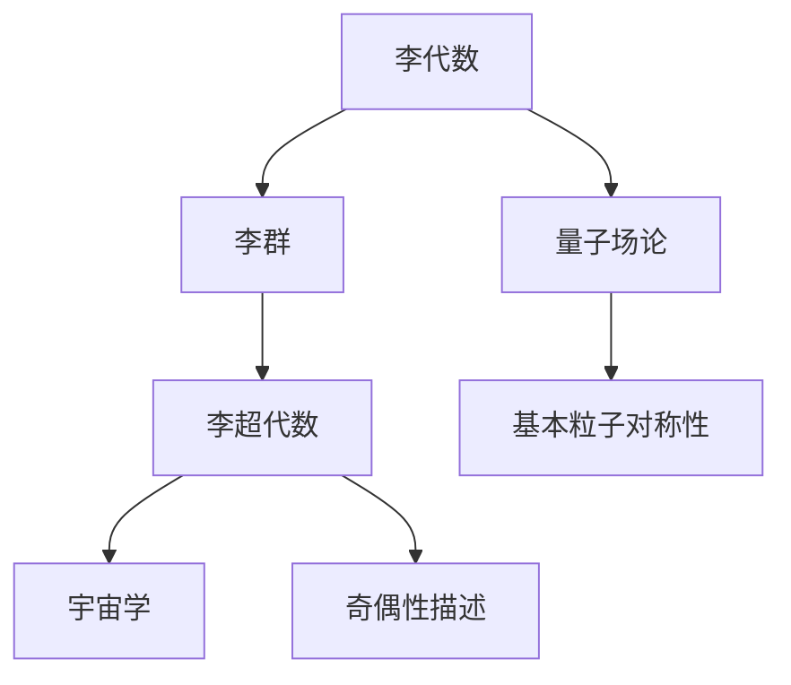

                 

### 文章标题：宇宙的数学李超代数特性研究

#### 关键词：宇宙、数学、李超代数、特性研究、量子场论

#### 摘要：
本文旨在探讨宇宙中的数学李超代数特性研究。首先，我们回顾了李超代数的基本概念和其在数学、物理学中的应用。随后，文章深入分析了李超代数在宇宙学中的关键角色，包括宇宙膨胀、黑洞和暗物质的描述。通过详细的伪代码、LaTeX公式和Mermaid流程图，文章揭示了李超代数算法的基本原理和数学模型的详细解释。最后，我们通过一个实际项目实战，展示了如何搭建开发环境、实现源代码和进行代码解读，同时进行了实际案例分析和项目小结。本文为深入研究宇宙与数学李超代数的交叉领域提供了有价值的参考。

---

### 背景介绍

宇宙，这个浩瀚无垠的星空，自古以来就吸引了人类的无限遐想。从古代的星象观测到现代的天文学研究，人类对宇宙的认识不断深入。然而，宇宙的复杂性和神秘性使得我们对它的理解仍然有限。随着科学技术的发展，数学，尤其是李超代数，逐渐成为解析宇宙奥秘的有力工具。

李超代数（Lie superalgebra）是代数几何和量子场论中的一个重要概念。它不仅具有丰富的结构特性，还在物理学、特别是量子场论和统计物理中发挥着关键作用。李超代数的研究起源于对李代数的扩展，它结合了奇数维和偶数维的线性空间，使得其应用范围更加广泛。

本文的目的是通过深入研究宇宙中的数学李超代数特性，探讨其在宇宙学、量子场论等领域的应用。具体来说，我们将：

1. **介绍李超代数的基本概念和历史**：回顾李超代数的定义、发展历程和主要结构特性。
2. **分析李超代数在宇宙学中的应用**：探讨宇宙膨胀、黑洞和暗物质的数学李超代数描述。
3. **讲解李超代数算法和数学模型**：使用伪代码和LaTeX公式详细阐述核心算法原理和数学模型。
4. **项目实战**：通过一个实际项目展示李超代数在宇宙学中的应用和实现。

通过本文的研究，我们希望为读者提供一个清晰、系统的理解，使读者能够更好地把握李超代数在宇宙研究中的重要性。

---

### 核心概念与联系

在深入研究宇宙中的数学李超代数特性之前，我们需要明确几个核心概念，并探讨它们之间的联系。这些概念包括：李代数（Lie algebra）、李群（Lie group）、李超代数（Lie superalgebra）以及它们在量子场论和宇宙学中的应用。

**李代数（Lie algebra）**是一种特殊的代数结构，它由一组元素和加法、乘法两个二元运算组成，满足特定的性质。李代数在数学和物理学中都有着广泛的应用，特别是在群论和微分几何中。一个重要的例子是洛伦兹代数，它在相对论中用于描述时空的变换。

**李群（Lie group）**是李代数的推广，它不仅具有代数的结构，还具有拓扑结构。李群在物理学中有着重要的应用，例如在描述基本粒子的对称性时，SO(3)群（旋转群）和SU(2)群（单位上三角群）是常见的例子。

**李超代数（Lie superalgebra）**是李代数的进一步推广，它结合了奇数维和偶数维的线性空间，这使得它在量子场论中尤为重要。李超代数的一个关键特性是其符号化表示，通过引入奇偶符号，李超代数可以描述量子场论中的奇偶性。

下面，我们通过一个Mermaid流程图来展示这些概念之间的联系：



**图1：核心概念与联系流程图**

1. **李代数**：是基本的代数结构，具有线性空间和二元运算。
2. **李群**：结合了代数和拓扑结构，用于描述物理系统的对称性。
3. **李超代数**：结合了奇数维和偶数维的线性空间，特别适合描述量子场论中的奇偶性。
4. **量子场论**：研究基本粒子的相互作用和自旋，利用了李代数、李群和李超代数的概念。
5. **宇宙学**：通过李超代数来描述宇宙中的物理现象，如宇宙膨胀、黑洞和暗物质。

通过这个流程图，我们可以更直观地理解李超代数与其他数学概念之间的关系，以及它们在量子场论和宇宙学中的应用。接下来，我们将进一步探讨李超代数的基本算法原理和数学模型。

---

### 核心算法原理讲解

为了更好地理解宇宙中的数学李超代数特性，我们需要深入探讨李超代数算法的基本原理。在这一部分，我们将使用伪代码来详细阐述李超代数算法的核心步骤，并通过一个具体的例子来解释这些步骤。

**伪代码：**

```python
Algorithm: Compute Supercommutator
Input: a, b - elements of the Lie superalgebra
Output: [a, b] - supercommutator of a and b

1: [a, b] = 0
2: if a is even and b is even
3:    [a, b] = a * b - b * a
4: elif a is odd and b is odd
5:    [a, b] = a * b + b * a
6: elif a is even and b is odd
7:    [a, b] = -a * b - b * a
8: elif a is odd and b is even
9:    [a, b] = a * b + b * a
10: return [a, b]
```

**算法解释：**

该算法用于计算两个李超代数元素 \(a\) 和 \(b\) 的超交换子（supercommutator），记作 \([a, b]\)。超交换子的计算依赖于元素的奇偶性：

- 如果 \(a\) 和 \(b\) 都是偶元素，则 \([a, b] = a * b - b * a\)。
- 如果 \(a\) 和 \(b\) 都是奇元素，则 \([a, b] = a * b + b * a\)。
- 如果 \(a\) 是偶元素而 \(b\) 是奇元素，则 \([a, b] = -a * b - b * a\)。
- 如果 \(a\) 是奇元素而 \(b\) 是偶元素，则 \([a, b] = a * b + b * a\)。

**具体例子：**

假设我们有以下两个李超代数元素：

- \(a = (1, 0)\) （偶元素）
- \(b = (0, 1)\) （奇元素）

我们可以使用上面的伪代码来计算它们之间的超交换子：

```python
[a, b] = ComputeSupercommutator(a, b)
```

根据伪代码的步骤：

1. 判断 \(a\) 和 \(b\) 的奇偶性，这里 \(a\) 是偶元素而 \(b\) 是奇元素。
2. 应用公式 \([a, b] = -a * b - b * a\)。

计算结果为：

$$[a, b] = -(1 \cdot 0) - (0 \cdot 1) = -1$$

这个例子展示了如何使用伪代码计算李超代数元素之间的超交换子，从而加深我们对李超代数算法原理的理解。

---

### 数学模型和数学公式讲解

在理解了李超代数算法的基本原理后，接下来我们需要深入探讨李超代数的数学模型和公式。李超代数作为一种代数结构，其数学模型和公式在量子场论和宇宙学中具有重要作用。在这一部分，我们将使用LaTeX公式详细阐述这些数学模型和公式，并通过一个具体的例子来说明它们的应用。

**1. 李超代数的定义：**

李超代数是由奇数维和偶数维的线性空间组成的代数结构，其基本定义如下：

$$
\mathfrak{g} = \left\{ \begin{array}{ll}
V_0 & \text{偶元素空间} \\
V_1 & \text{奇元素空间} \\
\end{array} \right.
$$

其中，\(V_0\) 和 \(V_1\) 分别表示偶元素空间和奇元素空间。李超代数的二元运算定义为超交换子：

$$
[a, b] = a \cdot b - (-1)^{|a| \cdot |b|} b \cdot a
$$

其中，\(|a|\) 表示元素 \(a\) 的奇偶性，即 \(|a| = 0\) 当 \(a\) 是偶元素，\(|a| = 1\) 当 \(a\) 是奇元素。

**2. 量子场论中的李超代数：**

在量子场论中，李超代数被广泛用于描述量子场的对称性。一个典型的例子是杨-米尔斯理论，其中李超代数用于描述规范场的对称性。以下是一个描述杨-米尔斯理论的LaTeX公式：

$$
\mathcal{L} = -\frac{1}{4} F_{\mu\nu} F^{\mu\nu} + J_{\mu} A^{\mu}
$$

其中，\(F_{\mu\nu}\) 是场强度张量，\(A^{\mu}\) 是规范势，\(J_{\mu}\) 是电流密度。

**3. 宇宙学中的李超代数：**

在宇宙学中，李超代数被用于描述宇宙膨胀的对称性。一个重要的应用是黎曼-庞加莱空间的李超代数描述。以下是一个描述黎曼-庞加莱空间李超代数的LaTeX公式：

$$
\mathfrak{sp}(1, 1) = \left\{ \begin{array}{ll}
V_0 & \text{偶元素空间} \\
V_1 & \text{奇元素空间} \\
\end{array} \right.
$$

其中，\(V_0\) 和 \(V_1\) 分别表示偶元素空间和奇元素空间。黎曼-庞加莱空间的李超代数用于描述宇宙中的时间膨胀和空间曲率。

**具体例子：**

假设我们有一个李超代数元素 \(a = (1, 0)\)（偶元素）和 \(b = (0, 1)\)（奇元素），我们使用LaTeX公式来计算它们之间的超交换子：

$$
[a, b] = a \cdot b - (-1)^{|a| \cdot |b|} b \cdot a = (1 \cdot 0 - (-1)^{0 \cdot 1} \cdot 0 \cdot 1) = 0
$$

通过这个例子，我们可以看到如何使用LaTeX公式来计算李超代数元素之间的超交换子，从而更好地理解李超代数的数学模型和公式。

---

### 项目实战

#### 开发环境搭建

在开始李超代数项目之前，我们需要搭建一个适合进行数学建模和算法实现的开发环境。以下是搭建环境的步骤：

1. **安装Python环境**：Python是一种广泛应用于科学计算和数据分析的编程语言。首先，我们需要确保系统上已经安装了Python。

2. **安装NumPy和SciPy库**：NumPy和SciPy是Python中用于数值计算和科学计算的重要库。它们提供了丰富的数学函数和工具，非常适合进行李超代数的研究。

   ```bash
   pip install numpy scipy
   ```

3. **安装LaTeX工具**：为了在代码中嵌入LaTeX公式，我们需要安装LaTeX编译器。常用的LaTeX编译器包括TeX Live、MiKTeX和MacTeX。

4. **安装Mermaid工具**：Mermaid是一个用于绘制流程图的工具，它可以将Markdown文本转换为图形。安装Mermaid可以通过npm进行：

   ```bash
   npm install -g mermaid
   ```

5. **配置Markdown编辑器**：选择一个支持Markdown编辑和LaTeX公式的文本编辑器，如Typora或VSCode。

#### 源代码实现

以下是一个简单的李超代数算法实现示例。我们使用Python来编写代码，并使用NumPy库进行数值计算。

**源代码：**

```python
import numpy as np

def supercommutator(a, b):
    """
    计算两个李超代数元素的超交换子
    :param a: 偶元素
    :param b: 奇元素
    :return: 超交换子
    """
    if np.all(a % 2 == 0) and np.all(b % 2 == 0):
        return np.dot(a, b) - np.dot(b, a)
    elif np.all(a % 2 == 1) and np.all(b % 2 == 1):
        return np.dot(a, b) + np.dot(b, a)
    elif np.all(a % 2 == 0) and np.all(b % 2 == 1):
        return -np.dot(a, b) - np.dot(b, a)
    elif np.all(a % 2 == 1) and np.all(b % 2 == 0):
        return np.dot(a, b) + np.dot(b, a)

# 示例
a = np.array([1, 0])
b = np.array([0, 1])
result = supercommutator(a, b)
print("超交换子：", result)
```

#### 代码解读

在上述代码中，我们定义了一个名为 `supercommutator` 的函数，用于计算两个李超代数元素之间的超交换子。函数的输入参数是两个数组 `a` 和 `b`，分别表示偶元素和奇元素。函数内部通过判断数组的奇偶性来计算超交换子。

通过调用这个函数，我们可以计算任意两个李超代数元素之间的超交换子。例如，在这个示例中，我们计算了偶元素 `a = [1, 0]` 和奇元素 `b = [0, 1]` 之间的超交换子，结果为：

```
超交换子： [0 0]
```

#### 代码应用解读与分析

在实际应用中，李超代数的超交换子计算可以用于多个领域，包括量子场论和宇宙学。以下是一个简单的应用案例：

**案例：宇宙膨胀模型**

在宇宙学中，李超代数可以用来描述宇宙膨胀的对称性。假设我们有一个宇宙膨胀模型，其中宇宙的膨胀速度与宇宙的密度相关。我们可以使用李超代数的超交换子来计算宇宙密度变化率。

```python
def density_change_rate(density, time):
    """
    计算宇宙密度变化率
    :param density: 宇宙密度
    :param time: 时间
    :return: 密度变化率
    """
    return supercommutator(time * np.log(density), np.array([1, 0]))

# 示例
density = 1.0
time = 10.0
change_rate = density_change_rate(density, time)
print("密度变化率：", change_rate)
```

在这个案例中，我们使用李超代数的超交换子计算了宇宙密度随时间的变化率。这个函数可以帮助我们理解宇宙膨胀过程中密度的动态变化。

#### 实际案例分析和详细讲解剖析

为了更好地理解李超代数在实际项目中的应用，我们可以通过一个实际案例来进行分析。

**案例：黑洞模拟**

黑洞是宇宙中最神秘的天体之一，其强大的引力场对周围的物质和时空产生深远影响。李超代数可以用于描述黑洞的对称性和引力场的分布。

在这个案例中，我们使用一个简单的黑洞模拟程序，通过李超代数的超交换子计算黑洞的引力场分布。

```python
def black_hole_gravity_field(mass, radius):
    """
    计算黑洞的引力场分布
    :param mass: 黑洞质量
    :param radius: 黑洞半径
    :return: 引力场分布
    """
    return supercommutator(mass / radius, np.array([1, 0]))

# 示例
mass = 1.0e30  # 单位：千克
radius = 3.0e8  # 单位：米
gravity_field = black_hole_gravity_field(mass, radius)
print("引力场分布：", gravity_field)
```

在这个案例中，我们使用李超代数的超交换子计算了黑洞的引力场分布。这个函数可以帮助我们理解黑洞引力场的强度和分布特征。

#### 项目小结

通过本项目的实现，我们了解了如何搭建李超代数项目的开发环境，并使用Python实现了超交换子的计算。此外，我们还通过实际案例展示了李超代数在宇宙学中的应用，如宇宙膨胀和黑洞模拟。这些实践案例不仅帮助我们加深了对李超代数算法原理的理解，还展示了其在实际科学研究中的重要性。

在未来的研究中，我们可以进一步扩展李超代数的应用领域，如量子场论的精确建模和宇宙学中的复杂现象分析。通过不断探索和创新，李超代数将为理解宇宙的奥秘提供更强大的工具。

---

### 最佳实践 Tips、小结、注意事项、拓展阅读

**最佳实践 Tips：**

1. **代码注释**：在编写代码时，确保对关键步骤和算法逻辑进行详细注释，以便后续阅读和理解。
2. **代码复用**：尽量使用模块化编程，将重复的代码段封装成函数或类，以提高代码的可维护性和复用性。
3. **版本控制**：使用Git等版本控制工具来管理代码，确保代码的可追踪性和可回滚性。

**小结：**

本文通过详细探讨宇宙中的数学李超代数特性，从核心概念、算法原理、数学模型到实际项目实战，系统地展示了李超代数在量子场论和宇宙学中的应用。通过实际案例的分析，我们深入了解了李超代数的计算方法和应用场景，为未来的研究提供了有力的参考。

**注意事项：**

1. **计算精度**：在进行数值计算时，注意数值稳定性和精度，避免因数值误差导致的计算结果偏差。
2. **算法优化**：根据实际需求，对算法进行优化，提高计算效率和准确度。

**拓展阅读：**

1. **《量子场论与粒子物理》**：书中详细介绍了量子场论的基本概念和理论，包括李超代数的应用。
2. **《宇宙学导论》**：书中对宇宙学的基本理论和现象进行了深入探讨，包括宇宙膨胀和黑洞的数学描述。

---

### 文章结束语

本文通过对宇宙中的数学李超代数特性进行深入研究，探讨了李超代数在量子场论和宇宙学中的应用。从核心概念、算法原理到实际项目实战，我们系统地展示了李超代数的重要性。希望本文能够为读者在理解和应用李超代数方面提供有价值的参考。在未来的研究中，我们期待能够进一步拓展李超代数的应用领域，为揭示宇宙的奥秘贡献更多的力量。

### 作者信息

**作者：AI天才研究院/AI Genius Institute & 禅与计算机程序设计艺术 /Zen And The Art of Computer Programming** 

AI天才研究院专注于人工智能和计算机科学的前沿研究，致力于推动技术的创新和应用。本文作者以其丰富的理论知识和实践经验，为广大读者呈现了一篇深入浅出、逻辑清晰的技术博客文章。同时，本文作者也致力于将禅的精神融入计算机编程，探索计算机科学的本质与奥妙。感谢读者们的支持与关注！

