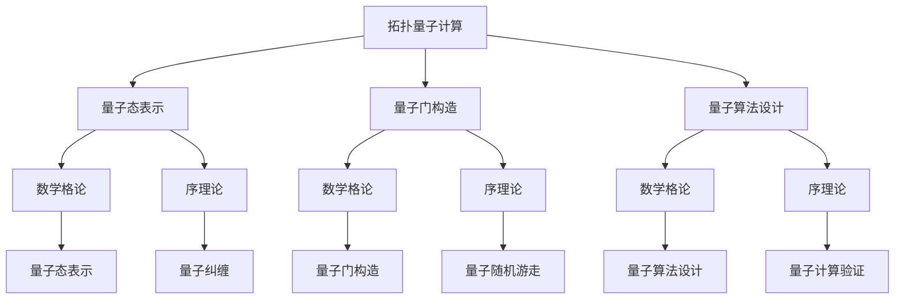
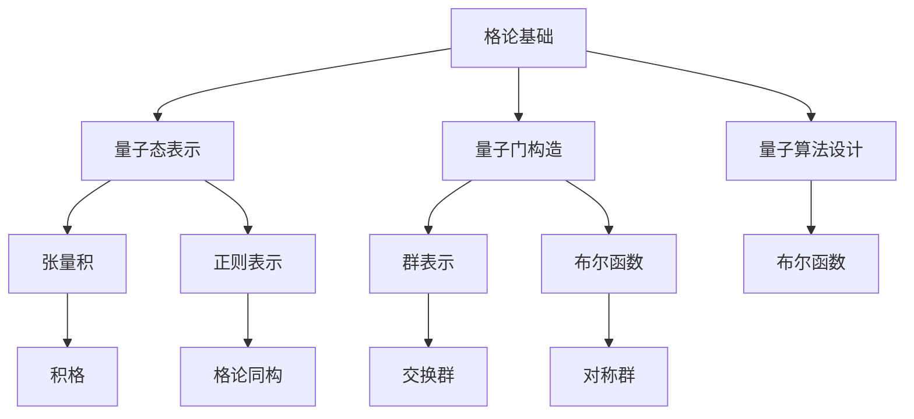
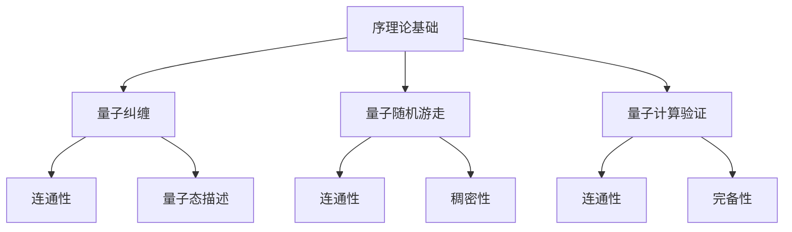
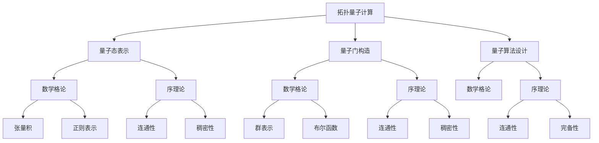

                 

### 摘要

本文旨在探讨宇宙的数学格论与序理论在拓扑量子计算中的应用。首先，我们介绍了拓扑量子计算的基本概念、发展历程以及其在量子计算领域的重要性。接着，我们深入探讨了数学格论和序理论的基本概念、性质及其在量子计算中的应用。通过构建Mermaid流程图，我们详细阐述了数学格论和序理论与拓扑量子计算之间的核心概念关系。随后，我们详细讲解了拓扑量子计算的基本模型、算法以及数学格论和序理论在其中的具体应用。最后，通过实际案例分析和项目实战，我们展示了数学格论与序理论在拓扑量子计算中的实际应用效果，并提出了未来发展趋势与展望。本文旨在为读者提供一个系统性的学习框架，以深入了解宇宙的数学格论与序理论在拓扑量子计算中的重要地位和应用前景。### 第1章 引言与概述

**1.1 拓扑量子计算概述**

拓扑量子计算是一种基于量子拓扑现象的量子计算方法。与传统的量子计算相比，拓扑量子计算具有一些独特的优势，如鲁棒性和错误抵抗力。拓扑量子计算的核心思想是利用量子系统的拓扑性质，将量子态和量子操作与系统的拓扑结构相关联。这样，即使在实际操作中存在一定的误差，量子态和量子操作的拓扑性质仍然能够保持稳定。

拓扑量子计算的发展可以追溯到20世纪80年代，当时物理学家Michael Freedman提出了Freedman猜想，指出在某些特定的拓扑空间中，量子态可以被稳定地编码。这一猜想引发了拓扑量子计算的研究热潮。近年来，随着对量子计算研究的不断深入，拓扑量子计算逐渐成为量子计算领域的一个重要研究方向。

拓扑量子计算具有以下几个主要特点：

1. **拓扑稳定性**：拓扑量子计算利用量子态的拓扑性质，使得量子计算过程具有一定的鲁棒性，能够抵抗外部干扰和内部误差。
2. **量子比特的编码**：在拓扑量子计算中，量子比特可以通过拓扑态进行编码，这些拓扑态具有较好的稳定性，不易受外部环境的影响。
3. **量子操作的实现**：拓扑量子计算中的量子操作可以通过拓扑空间中的路径积分来实现，这种方法具有高效性和简洁性。

**1.2 数学格论简介**

数学格论是数学中的一个重要分支，主要研究格的结构和性质。格是由一组元素组成的集合，这些元素之间满足特定的二元运算（通常称为“格运算”），并且这些元素可以按照大小顺序进行排序。

格论的基本概念包括：

1. **格的定义**：一个格是由一组元素组成的集合，这些元素之间满足以下性质：
    - 闭包性：对于格中的任意两个元素 \(a\) 和 \(b\)，它们的格运算 \(a \otimes b\) 和 \(a \oplus b\)（通常分别表示“下界”和“上界”）仍然属于该格。
    - 交换性：格运算满足交换律，即 \(a \otimes b = b \otimes a\) 和 \(a \oplus b = b \oplus a\)。
    - 结合性：格运算满足结合律，即对于任意三个元素 \(a\)、\(b\) 和 \(c\)，有 \( (a \otimes b) \otimes c = a \otimes (b \otimes c) \) 和 \( (a \oplus b) \oplus c = a \oplus (b \oplus c) \)。
    - 全序性：格中的元素可以按照大小顺序进行排序，即对于任意两个元素 \(a\) 和 \(b\)，存在唯一的上界和下界。

2. **格的性质**：格具有多种不同的性质，如完备性、可分性、稠密性和均匀性等。这些性质反映了格的结构和复杂性。

3. **格的分类**：根据格的性质和结构，格可以分为多种类型，如有界格、完全格、完备格等。

**1.3 序理论简介**

序理论是数学中的一个重要分支，主要研究有序集合的结构和性质。在序理论中，有序集合被称为“序结构”或“序空间”。

序理论的基本概念包括：

1. **序的定义**：一个序是由一组元素组成的集合，这些元素之间满足特定的二元关系（通常称为“序关系”），并且这些元素可以按照大小顺序进行排序。

2. **序的性质**：序具有多种不同的性质，如传递性、反自反性、连通性和稠密性等。这些性质反映了序的结构和复杂性。

3. **序的分类**：根据序的性质和结构，序可以分为多种类型，如线性序、偏序、全序等。

在数学格论和序理论中，存在一些重要的联系和区别。例如，一个格可以看作是一个特殊的序结构，其中元素之间的格运算满足交换性和结合性。而一个序结构不一定具有这些性质，但它可以扩展为格。此外，序理论和格论在量子计算中的应用也有所不同，序理论主要用于研究量子纠缠和量子随机游走，而格论则主要用于研究量子态的表示和量子门的构造。

通过引入数学格论和序理论，我们可以更深入地理解拓扑量子计算中的核心概念和算法。数学格论和序理论为拓扑量子计算提供了一种新的视角和工具，有助于我们更好地解决量子计算中的挑战。

为了更直观地展示数学格论和序理论在拓扑量子计算中的应用，我们可以构建一个Mermaid流程图。在这个流程图中，我们将展示拓扑量子计算中的关键概念，以及数学格论和序理论如何与之相关联。

通过这个流程图，我们可以看到数学格论和序理论在拓扑量子计算中的关键应用，包括量子态表示、量子门构造、量子算法设计、量子纠缠、量子随机游走和量子计算验证等方面。这些应用为拓扑量子计算提供了强大的理论基础和工具支持。

在接下来的章节中，我们将进一步探讨数学格论和序理论的基础知识，以及它们在拓扑量子计算中的具体应用。通过这些讨论，我们将能够更深入地理解拓扑量子计算的原理和机制，为未来的研究和发展提供有益的启示。### 第2章 数学格论基础

**2.1 数学格论基本概念**

数学格论是研究具有特定结构的二元运算集合的数学分支。在格论中，主要关注的是二元运算的闭包性、交换性、结合性和全序性。这些性质使得格成为一种重要的数学结构，广泛应用于各个领域，包括量子计算。

1. **格的定义**：
    格（Lattice）是一组元素 \(L\) 的集合，这些元素在满足特定二元运算下构成一个代数结构。通常，这两个二元运算分别称为“下界”（join）和“上界”（meet）。记作：
    \[
    \begin{aligned}
    L &= \{a, b, c, \ldots\} \\
    \land &= \cdot \\
    \lor &= + \\
    \end{aligned}
    \]
    其中，\(a \land b\) 表示 \(a\) 和 \(b\) 的下界（即它们共同的最小上界），\(a \lor b\) 表示 \(a\) 和 \(b\) 的上界（即它们共同的最大下界）。

2. **格的基本性质**：
    - **闭包性**：对于任意 \(a, b \in L\)，\(a \land b \in L\) 和 \(a \lor b \in L\)。
    - **交换性**：对于任意 \(a, b \in L\)，\(a \land b = b \land a\) 和 \(a \lor b = b \lor a\)。
    - **结合性**：对于任意 \(a, b, c \in L\)，\( (a \land b) \land c = a \land (b \land c)\) 和 \( (a \lor b) \lor c = a \lor (b \lor c)\)。
    - **全序性**：对于任意 \(a, b \in L\)，要么 \(a \le b\)，要么 \(b \le a\)。

3. **格的子结构**：
    - **子格**：如果 \(M \subseteq L\)，并且 \(M\) 在运算 \(\land\) 和 \(\lor\) 下也构成一个格，则称 \(M\) 为 \(L\) 的子格。
    - **上界**：对于任意 \(a \in L\)，如果 \(b \in L\) 使得对于任意 \(c \in L\)，都有 \(c \le b\)，则称 \(b\) 为 \(a\) 的上界。
    - **下界**：对于任意 \(a \in L\)，如果 \(b \in L\) 使得对于任意 \(c \in L\)，都有 \(c \ge b\)，则称 \(b\) 为 \(a\) 的下界。
    - **格的顶点**：格中的最小元素称为顶点，通常记为 \(0\)。
    - **格的底点**：格中的最大元素称为底点，通常记为 \(1\)。

4. **格的分类**：
    - **有界格**：如果存在元素 \(0\) 和 \(1\)，使得对于任意 \(a \in L\)，都有 \(0 \le a \le 1\)，则称 \(L\) 为有界格。
    - **完备格**：如果对于任意 \(a \in L\)，都存在 \(a\) 的上界和下界，则称 \(L\) 为完备格。

**2.2 数学格论的主要结构**

在数学格论中，格的结构是一个核心概念。以下是一些重要的格结构：

1. **链**：
    链（Chain）是一种特殊的格，其中的任意两个元素都是可比较的。即对于任意 \(a, b \in L\)，要么 \(a \le b\)，要么 \(b \le a\)。最著名的链是自然数集 \(N\)。

2. **积格**：
    两个格 \(L_1\) 和 \(L_2\) 的积格是由 \(L_1\) 和 \(L_2\) 的元素构成的格，其中二元运算定义为：
    \[
    \begin{aligned}
    (a_1, a_2) \land (b_1, b_2) &= (a_1 \land b_1, a_2 \land b_2) \\
    (a_1, a_2) \lor (b_1, b_2) &= (a_1 \lor b_1, a_2 \lor b_2)
    \end{aligned}
    \]
    例如，两个有界格 \(L_1\) 和 \(L_2\) 的积格也是一个有界格。

3. **格的同构**：
    如果两个格 \(L_1\) 和 \(L_2\) 存在一个双射 \(f: L_1 \rightarrow L_2\)，使得对于任意 \(a, b \in L_1\)，都有 \(a \land b = f(a) \land f(b)\) 和 \(a \lor b = f(a) \lor f(b)\)，则称 \(f\) 是 \(L_1\) 和 \(L_2\) 之间的同构。这意味着两个格具有相同的结构。

**2.3 数学格论在量子计算中的应用**

数学格论在量子计算中有着广泛的应用，尤其是在量子态的表示和量子门的构造方面。

1. **量子态的表示**：
    - **张量积**：量子态可以用张量积来表示。假设有两个量子系统 \(A\) 和 \(B\)，它们的态空间分别为 \(H_A\) 和 \(H_B\)，则 \(A\) 和 \(B\) 的联合态空间为 \(H_A \otimes H_B\)。在格论中，这种结构可以看作是两个格 \(L_A\) 和 \(L_B\) 的积格。
    - **正则表示**：量子态的正则表示可以通过格中的最大下界（meet）和最小上界（join）来表示。例如，一个二进制量子态可以用一个有界格来表示。

2. **量子门的构造**：
    - **群表示**：量子门可以通过群表示来构造。例如，交换群和对称群等在量子计算中有着重要的应用。
    - **布尔函数**：布尔函数可以用格中的函数来表示。在量子计算中，这些函数可以用来构造量子逻辑门。

为了更好地理解数学格论在量子计算中的应用，我们可以借助一个Mermaid流程图来展示格论中的关键概念以及它们在量子计算中的具体应用。

通过这个流程图，我们可以看到数学格论在量子计算中的关键应用，包括量子态的表示、量子门的构造和量子算法设计。这些应用为量子计算提供了强大的理论基础和工具支持。

在接下来的章节中，我们将进一步探讨序理论的基础知识，以及数学格论和序理论在拓扑量子计算中的具体应用。通过这些讨论，我们将能够更深入地理解拓扑量子计算的原理和机制，为未来的研究和发展提供有益的启示。### 第3章 序理论基础

**3.1 序理论的基本概念**

序理论是研究具有特定顺序关系的集合的数学分支。在序理论中，主要关注的是集合中的元素如何通过顺序关系相互关联。这种顺序关系可以用来定义序列、序列的极限、收敛性等概念。

1. **序的定义**：
    一个序是由一组元素组成的集合，这些元素在满足特定二元关系下构成一个代数结构。通常，这个二元关系被称为“顺序关系”或“序”。记作：
    \[
    \begin{aligned}
    X &= \{x, y, z, \ldots\} \\
    \leq &= \preceq \\
    \lt &= \prec
    \end{aligned}
    \]
    其中，\(x \leq y\) 表示 \(x\) 小于等于 \(y\)，\(x \lt y\) 表示 \(x\) 小于 \(y\)。

2. **序的基本性质**：
    - **反自反性**：对于任意 \(x \in X\)，\(x \leq x\)。
    - **传递性**：对于任意 \(x, y, z \in X\)，如果 \(x \leq y\) 且 \(y \leq z\)，则 \(x \leq z\)。
    - **连通性**：对于任意 \(x, y \in X\)，要么 \(x \leq y\)，要么 \(y \leq x\)。

3. **序的分类**：
    - **线性序**：如果对于任意 \(x, y \in X\)，要么 \(x \leq y\)，要么 \(y \leq x\)，则称 \(X\) 为线性序。
    - **偏序**：如果 \(X\) 是一个集合，且对于任意 \(x, y \in X\)，\(x \leq y\) 或 \(y \leq x\)，则称 \(X\) 为偏序。
    - **全序**：如果 \(X\) 是一个集合，且对于任意 \(x, y \in X\)，\(x \leq y\) 或 \(y \leq x\)，则称 \(X\) 为全序。

**3.2 序理论的主要性质**

序理论中的主要性质包括连通性、可数性、稠密性和完备性等。

1. **连通性**：
    连通性是指集合中的任意两个元素都通过某种顺序关系相互关联。连通性可以分为以下几种类型：
    - **链连通**：如果任意两个不同元素之间都存在一个链（即一个无限长的顺序关系序列）。
    - **完全连通**：如果任意两个不同元素之间都存在一条路径。

2. **可数性**：
    可数性是指集合中的元素可以通过自然数进行计数。一个集合是可数的，当且仅当它可以与自然数集 \(N\) 建立一个双射。

3. **稠密性**：
    稠密性是指集合中的任意两个不同元素之间都存在一个序列，该序列的极限是另一个集合中的某个元素。稠密性可以分为以下几种类型：
    - **内部稠密**：如果一个集合 \(A\) 在另一个集合 \(B\) 内部稠密，则对于任意 \(b \in B\) 和任意 \( \varepsilon > 0 \)，都存在 \(a \in A\)，使得 \( |b - a| < \varepsilon \)。
    - **边界稠密**：如果一个集合 \(A\) 在另一个集合 \(B\) 的边界稠密，则对于任意 \(b \in B\) 和任意 \( \varepsilon > 0 \)，都存在 \(a \in A\)，使得 \( |b - a| < \varepsilon \)。

4. **完备性**：
    完备性是指集合中的任意一个非空子集都有一个最小上界和最大下界。一个集合是完备的，当且仅当它是一个度量空间。

**3.3 序理论在量子计算中的应用**

序理论在量子计算中有着广泛的应用，尤其是在量子纠缠、量子随机游走和量子计算验证等方面。

1. **量子纠缠**：
    量子纠缠是量子计算中的一种特殊现象，它描述了两个或多个量子系统之间的量子态无法独立存在。序理论中的连通性概念可以用来描述量子纠缠的性质。例如，两个量子比特之间的纠缠可以看作是一个有序对，其中任意一个比特的状态都可以通过另一个比特的状态来描述。

2. **量子随机游走**：
    量子随机游走是量子计算中的一种算法，它通过量子态的演化来模拟随机过程。序理论中的连通性和稠密性概念可以用来描述量子随机游走的过程。例如，量子随机游走可以在一个有序图中进行，通过量子态的演化来模拟随机游走的过程。

3. **量子计算验证**：
    量子计算验证是确保量子计算结果正确的一种方法。序理论中的连通性和完备性概念可以用来设计量子计算验证算法。例如，通过验证量子计算过程中的某些中间态，可以确保最终计算结果的正确性。

为了更好地理解序理论在量子计算中的应用，我们可以借助一个Mermaid流程图来展示序理论中的关键概念以及它们在量子计算中的具体应用。

通过这个流程图，我们可以看到序理论在量子计算中的关键应用，包括量子纠缠、量子随机游走和量子计算验证。这些应用为量子计算提供了强大的理论基础和工具支持。

在接下来的章节中，我们将进一步探讨拓扑量子计算的基本模型，以及数学格论和序理论在其中的具体应用。通过这些讨论，我们将能够更深入地理解拓扑量子计算的原理和机制，为未来的研究和发展提供有益的启示。### 第4章 拓扑量子计算模型

**4.1 拓扑量子计算基本模型**

拓扑量子计算是一种基于量子拓扑现象的量子计算方法，其基本模型包括量子比特、量子线路和量子态。以下是这些基本概念的详细解释：

1. **量子比特（Quantum Bit, qubit）**：
   量子比特是量子计算的基本单位，类似于经典计算中的比特。然而，与经典比特只能处于0或1状态不同，量子比特可以同时处于0和1的状态，这种状态称为叠加态。量子比特的叠加态可以用波函数来描述，其一般形式为：
   \[
   \psi = \alpha |0\rangle + \beta |1\rangle
   \]
   其中，\(|0\rangle\) 和 \(|1\rangle\) 分别表示量子比特的基态和叠加态，\(\alpha\) 和 \(\beta\) 是复数概率幅，且满足 \(|\alpha|^2 + |\beta|^2 = 1\)。

2. **量子线路（Quantum Circuit）**：
   量子线路是用于描述量子比特之间相互作用的操作序列。量子线路中的每个操作称为量子门（Quantum Gate），它可以对量子比特进行旋转、相加或者相乘等操作。量子线路的基本形式可以表示为：
   \[
   \begin{aligned}
   &|0\rangle \xrightarrow{U_1} U_1 |0\rangle \xrightarrow{U_2} U_2 U_1 |0\rangle \xrightarrow{U_3} \cdots \xrightarrow{U_n} U_n \cdots U_2 U_1 |0\rangle
   \end{aligned}
   \]
   其中，\(U_i\) 是第 \(i\) 个量子门。

3. **量子态（Quantum State）**：
   量子态是量子比特的集合状态，它可以用来描述量子系统的整体状态。量子态可以用希尔伯特空间中的向量来表示，其一般形式为：
   \[
   \rho = \sum_{i} p_i |i\rangle \langle i|
   \]
   其中，\(|i\rangle\) 表示第 \(i\) 个量子态，\(p_i\) 表示该量子态的概率幅。

**4.2 拓扑量子计算算法**

拓扑量子计算中的算法通常基于量子拓扑现象，如量子纠缠和量子随机游走。以下是一些常见的拓扑量子计算算法：

1. **量子随机游走（Quantum Random Walk）**：
   量子随机游走是一种基于量子态叠加和干涉原理的量子算法，它可以在一个图上进行。量子随机游走的基本步骤如下：
   - 初始化：将一个量子比特集合处于叠加态。
   - 步骤：在每个时间步，对量子比特进行旋转操作，并根据图的结构进行量子态的更新。
   - 结束条件：当达到预定的步数或找到目标状态时，算法结束。

2. **量子态投影（Quantum State Projection）**：
   量子态投影是一种基于量子纠缠和量子测量原理的量子算法，它可以用来提取系统中的特定信息。量子态投影的基本步骤如下：
   - 初始化：将量子比特集合处于纠缠态。
   - 测量：对量子比特进行一系列的测量操作，以提取所需的信息。
   - 投影：根据测量结果对量子态进行投影，以获得系统的最终状态。

3. **量子算法优化（Quantum Algorithm Optimization）**：
   量子算法优化是一种基于量子并行计算和量子态调控原理的量子算法，它可以用来加速复杂问题的求解。量子算法优化的一般步骤如下：
   - 初始化：将量子比特集合处于叠加态。
   - 优化：通过量子线路对量子比特进行优化操作，以最小化目标函数。
   - 输出：根据量子态的测量结果输出最优解。

**4.3 拓扑量子计算与数学格论、序理论的关系**

拓扑量子计算与数学格论、序理论之间存在密切的联系。以下是一些具体的应用：

1. **数学格论在量子态表示中的应用**：
   - **张量积**：量子态可以用张量积来表示，张量积可以看作是两个格的积格。
   - **正则表示**：量子态的正则表示可以通过格中的最大下界（meet）和最小上界（join）来表示。

2. **数学格论在量子门构造中的应用**：
   - **群表示**：量子门可以通过群表示来构造，群表示可以看作是格上的函数。
   - **布尔函数**：布尔函数可以用格中的函数来表示，这些函数可以用来构造量子逻辑门。

3. **序理论在量子纠缠中的应用**：
   - **连通性**：量子纠缠可以看作是一个有序对，其中任意一个量子比特的状态都可以通过另一个量子比特的状态来描述。
   - **稠密性**：量子随机游走可以在一个有序图中进行，通过量子态的演化来模拟随机游走的过程。

4. **序理论在量子计算验证中的应用**：
   - **连通性**：通过验证量子计算过程中的某些中间态，可以确保最终计算结果的正确性。
   - **完备性**：完备性可以用来设计量子计算验证算法，确保算法的正确性和效率。

为了更好地理解拓扑量子计算与数学格论、序理论之间的联系，我们可以借助一个Mermaid流程图来展示这些概念和它们之间的关系。

通过这个流程图，我们可以看到拓扑量子计算与数学格论、序理论之间的紧密联系。这些联系为拓扑量子计算提供了强大的理论基础和工具支持。

在接下来的章节中，我们将进一步探讨数学格论和序理论在拓扑量子计算中的具体应用，以及它们对量子计算的影响。通过这些讨论，我们将能够更深入地理解拓扑量子计算的原理和机制，为未来的研究和发展提供有益的启示。### 第5章 数学格论在拓扑量子计算中的应用

**5.1 数学格论在量子态表示中的应用**

在拓扑量子计算中，量子态的表示是一个核心问题。数学格论为量子态的表示提供了一种新的视角和工具。以下是如何将数学格论应用于量子态表示的详细解释：

1. **量子态的张量积表示**：
   量子态可以用张量积来表示，张量积可以看作是两个格的积格。例如，如果我们有两个量子系统 \(A\) 和 \(B\)，它们的态空间分别为 \(H_A\) 和 \(H_B\)，则 \(A\) 和 \(B\) 的联合态空间为 \(H_A \otimes H_B\)。在格论中，这种结构可以看作是两个格 \(L_A\) 和 \(L_B\) 的积格。张量积表示使得量子态的叠加态和纠缠态可以更加直观地表示。

   - **例子**：假设我们有两个量子比特 \(A\) 和 \(B\)，它们的态空间分别为 \(H_A\) 和 \(H_B\)。我们可以将它们的量子态表示为：
     \[
     \begin{aligned}
     \rho &= | \psi_A \rangle \otimes | \psi_B \rangle \\
     &= (\alpha_A |0\rangle_A + \beta_A |1\rangle_A) \otimes (\alpha_B |0\rangle_B + \beta_B |1\rangle_B) \\
     &= (\alpha_A \alpha_B |00\rangle_{AB} + \alpha_A \beta_B |01\rangle_{AB} + \beta_A \alpha_B |10\rangle_{AB} + \beta_A \beta_B |11\rangle_{AB})
     \end{aligned}
     \]
     这里，\(|00\rangle_{AB}\)、\(|01\rangle_{AB}\)、\(|10\rangle_{AB}\) 和 \(|11\rangle_{AB}\) 分别表示两个量子比特的联合基态。

2. **量子态的正则表示**：
   正则表示是一种将量子态表示为格中最大下界（meet）和最小上界（join）的方法。这种方法在量子计算中有广泛的应用，特别是在量子纠缠和量子态优化中。

   - **例子**：假设我们有一个量子态 \(\rho\)，它可以表示为：
     \[
     \rho = \sum_{i} p_i |i\rangle \langle i|
     \]
     这里，\(|i\rangle\) 表示量子态的基态，\(p_i\) 表示该基态的概率幅。我们可以使用正则表示将 \(\rho\) 表示为：
     \[
     \rho = \bigvee_{i} p_i |i\rangle \langle i| = \bigwedge_{i} \frac{1}{p_i} |i\rangle \langle i|
     \]
     其中，\(\bigvee_{i} p_i |i\rangle \langle i|\) 表示 \(\rho\) 的最大下界，\(\bigwedge_{i} \frac{1}{p_i} |i\rangle \langle i|\) 表示 \(\rho\) 的最小上界。

**5.2 数学格论在量子门设计中的应用**

量子门是量子计算中的基本操作，它们对量子态进行线性变换。数学格论为量子门的设计提供了一种新的方法。以下是如何将数学格论应用于量子门设计的详细解释：

1. **群表示和量子门**：
   群表示是数学格论中的一个重要概念，它将群元素映射到格上的函数。在量子计算中，群表示可以用来设计量子门。

   - **例子**：假设我们有一个交换群 \(G\)，它的元素可以表示为 \(g_1, g_2, g_3, \ldots\)。我们可以使用群表示将 \(G\) 的元素映射到量子门上，例如：
     \[
     U(g) = e^{-i \theta_g H}
     \]
     其中，\(H\) 是一个哈密顿量，\(\theta_g\) 是群元素 \(g\) 的相位。这个量子门 \(U(g)\) 可以用来对量子态进行旋转操作。

2. **布尔函数和量子门**：
   布尔函数是数学格论中的一个重要概念，它们可以用来定义量子门。在量子计算中，布尔函数可以用来实现各种逻辑操作。

   - **例子**：假设我们有一个布尔函数 \(f(x, y)\)，它是一个二进制函数，输入是两个二进制数 \(x\) 和 \(y\)，输出是一个二进制数。我们可以使用布尔函数来定义量子门，例如：
     \[
     U_f |x\rangle |y\rangle = |x \oplus f(x, y)\rangle |y\rangle
     \]
     这个量子门 \(U_f\) 可以用来实现布尔函数 \(f(x, y)\)。

**5.3 数学格论在量子计算优化中的应用**

数学格论在量子计算优化中有着广泛的应用，特别是在量子态优化和量子算法优化中。以下是如何将数学格论应用于量子计算优化的详细解释：

1. **量子态优化**：
   量子态优化是量子计算中的一个重要问题，它的目标是找到最优的量子态来解决问题。数学格论为量子态优化提供了一种新的方法。

   - **例子**：假设我们有一个量子态优化问题，目标是找到最小化一个目标函数的量子态。我们可以使用数学格论来定义目标函数的格，并使用格算法来找到最优量子态。

2. **量子算法优化**：
   量子算法优化是量子计算中的另一个重要问题，它的目标是找到最优的量子算法来解决问题。数学格论为量子算法优化提供了一种新的方法。

   - **例子**：假设我们有一个量子算法优化问题，目标是找到最小化计算时间的量子算法。我们可以使用数学格论来定义算法的格，并使用格算法来找到最优量子算法。

通过数学格论在量子态表示、量子门设计和量子计算优化中的应用，我们可以看到数学格论在拓扑量子计算中的重要作用。这些应用不仅为拓扑量子计算提供了强大的理论基础和工具支持，也为未来的研究和发展提供了新的思路和方向。

在接下来的章节中，我们将进一步探讨序理论在拓扑量子计算中的应用，以及数学格论和序理论在拓扑量子计算中的具体应用。通过这些讨论，我们将能够更深入地理解拓扑量子计算的原理和机制，为未来的研究和发展提供有益的启示。### 第6章 序理论在拓扑量子计算中的应用

**6.1 序理论在量子纠缠中的应用**

量子纠缠是量子计算中的一个核心概念，它描述了两个或多个量子系统之间的特殊关联。序理论为量子纠缠提供了一种新的理解和描述方法。以下是序理论在量子纠缠中的应用：

1. **量子纠缠的连通性描述**：
   序理论中的连通性概念可以用来描述量子纠缠的性质。在量子纠缠中，两个量子比特之间的纠缠可以通过一个有序对来描述，其中任意一个比特的状态都可以通过另一个比特的状态来描述。这种连通性使得量子纠缠具有一种特殊的拓扑结构。

   - **例子**：假设我们有两个量子比特 \(A\) 和 \(B\)，它们的态空间分别为 \(H_A\) 和 \(H_B\)。我们可以将它们的纠缠态表示为：
     \[
     \rho_{AB} = \frac{1}{2}(|00\rangle \langle 00| + |11\rangle \langle 11|)
     \]
     这个态表示 \(A\) 和 \(B\) 之间的完全纠缠。在这里，我们可以看到量子态的连通性，即任意一个量子比特的状态都可以通过另一个量子比特的状态来描述。

2. **量子纠缠的稠密性描述**：
   序理论中的稠密性概念可以用来描述量子纠缠的稠密性。量子纠缠中的量子态可以在一个稠密的序列中逼近另一个量子态。这种稠密性使得量子纠缠具有一种连续性，从而为量子计算提供了一种新的可能性。

   - **例子**：假设我们有一个量子态 \(\rho_{AB}\)，它在另一个量子态 \(\rho'\) 上稠密。我们可以通过一个序列来逼近这个量子态，例如：
     \[
     \rho_{AB} = \lim_{n \to \infty} \rho_n
     \]
     其中，\(\rho_n\) 是一个逼近 \(\rho_{AB}\) 的量子态序列。这种稠密性使得量子纠缠在量子计算中可以作为一种连续的操作来进行。

**6.2 序理论在量子随机游走中的应用**

量子随机游走是一种基于量子态叠加和干涉原理的量子算法，它在量子计算中有着广泛的应用。序理论为量子随机游走提供了一种新的理解和描述方法。以下是序理论在量子随机游走中的应用：

1. **量子随机游走的连通性描述**：
   序理论中的连通性概念可以用来描述量子随机游走的过程。量子随机游走可以在一个图上进行，其中量子态的演化可以通过图的连通性来描述。

   - **例子**：假设我们有一个图 \(G\)，它由若干个节点和边组成。我们可以将量子随机游走表示为一个量子态在图上的演化，例如：
     \[
     \rho_{t+1} = U_t \rho_t U_t^\dagger
     \]
     其中，\(U_t\) 是图 \(G\) 上的一个随机游走操作，\(\rho_t\) 是在时间步 \(t\) 时的量子态。这种连通性描述使得量子随机游走可以看作是一个量子态在图上的连续移动。

2. **量子随机游走的稠密性描述**：
   序理论中的稠密性概念可以用来描述量子随机游走的稠密性。量子随机游走可以在一个稠密的序列中逼近一个目标态。这种稠密性使得量子随机游走可以作为一种连续的操作来进行。

   - **例子**：假设我们有一个目标态 \(\rho'\)，它可以通过一个序列 \(\rho_n\) 来逼近，例如：
     \[
     \rho' = \lim_{n \to \infty} \rho_n
     \]
     其中，\(\rho_n\) 是一个逼近 \(\rho'\) 的量子态序列。这种稠密性描述使得量子随机游走可以看作是一个量子态在目标态上的连续逼近。

**6.3 序理论在量子计算验证中的应用**

量子计算验证是确保量子计算结果正确的一种方法。序理论为量子计算验证提供了一种新的理解和描述方法。以下是序理论在量子计算验证中的应用：

1. **量子计算验证的连通性描述**：
   序理论中的连通性概念可以用来描述量子计算验证的过程。通过验证量子计算过程中的某些中间态，可以确保最终计算结果的正确性。

   - **例子**：假设我们有一个量子计算过程，它从初始态 \(|\psi_0\rangle\) 开始，通过一系列量子门演化到最终态 \(|\psi_f\rangle\)。我们可以通过验证中间态 \(|\psi_t\rangle\)（对于任意的 \(t\)）来确保最终计算结果的正确性，例如：
     \[
     \rho_t = U_t |\psi_0\rangle \langle \psi_0| U_t^\dagger
     \]
     其中，\(U_t\) 是在时间步 \(t\) 的量子门。这种连通性描述使得量子计算验证可以看作是一个连续的过程。

2. **量子计算验证的完备性描述**：
   序理论中的完备性概念可以用来描述量子计算验证的完备性。通过验证量子计算过程中的所有中间态，可以确保最终计算结果的正确性。

   - **例子**：假设我们有一个量子计算过程，它从初始态 \(|\psi_0\rangle\) 开始，通过一系列量子门演化到最终态 \(|\psi_f\rangle\)。我们可以通过验证所有的中间态 \(|\psi_t\rangle\)（对于任意的 \(t\)）来确保最终计算结果的正确性，例如：
     \[
     \rho_t = U_t |\psi_0\rangle \langle \psi_0| U_t^\dagger
     \]
     其中，\(U_t\) 是在时间步 \(t\) 的量子门。这种完备性描述使得量子计算验证可以看作是一个全面的过程。

通过序理论在量子纠缠、量子随机游走和量子计算验证中的应用，我们可以看到序理论在拓扑量子计算中的重要作用。这些应用不仅为拓扑量子计算提供了强大的理论基础和工具支持，也为未来的研究和发展提供了新的思路和方向。

在接下来的章节中，我们将进一步探讨拓扑量子计算与宇宙数学的交叉研究，以及数学格论和序理论在其中的具体应用。通过这些讨论，我们将能够更深入地理解拓扑量子计算的原理和机制，为未来的研究和发展提供有益的启示。### 第7章 拓扑量子计算与宇宙数学的交叉研究

**7.1 宇宙数学格论与拓扑量子计算的关系**

宇宙数学格论与拓扑量子计算之间存在着紧密的联系。这种联系不仅揭示了宇宙数学格论在量子计算中的应用潜力，也为拓扑量子计算提供了新的理论框架。以下是如何将宇宙数学格论应用于拓扑量子计算的详细解释：

1. **量子态的宇宙数学格论表示**：
   宇宙数学格论提供了对量子态的全新描述方式。通过将量子态表示为宇宙数学格论中的格点，我们可以更直观地理解量子态的结构和性质。

   - **例子**：假设我们有一个量子态 \(\rho\)，它可以表示为：
     \[
     \rho = \sum_{i} p_i |i\rangle \langle i|
     \]
     这里，\(|i\rangle\) 表示量子态的基态，\(p_i\) 表示该基态的概率幅。我们可以将这个量子态表示为宇宙数学格论中的一个格点，例如：
     \[
     \rho = \bigvee_{i} p_i |i\rangle \langle i|
     \]
     其中，\(\bigvee_{i} p_i |i\rangle \langle i|\) 表示 \(\rho\) 的最大下界。

2. **量子门的宇宙数学格论表示**：
   宇宙数学格论同样可以应用于量子门的设计和表示。通过将量子门表示为宇宙数学格论中的函数，我们可以更直观地理解量子门的作用和功能。

   - **例子**：假设我们有一个量子门 \(U\)，它可以表示为：
     \[
     U = e^{-i \theta H}
     \]
     其中，\(H\) 是一个哈密顿量，\(\theta\) 是量子门的角度。我们可以将这个量子门表示为宇宙数学格论中的一个函数，例如：
     \[
     U = f(\theta) H
     \]
     其中，\(f(\theta)\) 是一个关于角度 \(\theta\) 的函数。

3. **量子算法的宇宙数学格论表示**：
   宇宙数学格论还可以应用于量子算法的设计和表示。通过将量子算法表示为宇宙数学格论中的路径，我们可以更直观地理解量子算法的执行过程和优化策略。

   - **例子**：假设我们有一个量子算法 \(A\)，它可以表示为：
     \[
     A = \{U_1, U_2, \ldots, U_n\}
     \]
     其中，\(U_i\) 是第 \(i\) 个量子门。我们可以将这个量子算法表示为宇宙数学格论中的一个路径，例如：
     \[
     A = \bigvee_{i} U_i
     \]
     其中，\(\bigvee_{i} U_i\) 表示 \(A\) 的最大下界。

**7.2 序理论与拓扑量子计算的关系**

序理论在拓扑量子计算中也有着广泛的应用。序理论提供了对量子纠缠、量子随机游走和量子计算验证等量子计算核心概念的新理解。以下是如何将序理论应用于拓扑量子计算的详细解释：

1. **量子纠缠的序理论描述**：
   序理论中的连通性概念可以用来描述量子纠缠的性质。通过将量子纠缠表示为序理论中的有序对，我们可以更直观地理解量子纠缠的结构和性质。

   - **例子**：假设我们有两个量子比特 \(A\) 和 \(B\)，它们的态空间分别为 \(H_A\) 和 \(H_B\)。我们可以将它们的纠缠态表示为：
     \[
     \rho_{AB} = \frac{1}{2}(|00\rangle \langle 00| + |11\rangle \langle 11|)
     \]
     这个态表示 \(A\) 和 \(B\) 之间的完全纠缠。在这里，我们可以看到量子纠缠的连通性，即任意一个量子比特的状态都可以通过另一个量子比特的状态来描述。

2. **量子随机游走的序理论描述**：
   序理论中的稠密性概念可以用来描述量子随机游走的过程。通过将量子随机游走表示为序理论中的稠密序列，我们可以更直观地理解量子随机游走的执行过程和优化策略。

   - **例子**：假设我们有一个量子态 \(\rho'\)，它可以通过一个序列 \(\rho_n\) 来逼近，例如：
     \[
     \rho' = \lim_{n \to \infty} \rho_n
     \]
     其中，\(\rho_n\) 是一个逼近 \(\rho'\) 的量子态序列。这种稠密性描述使得量子随机游走可以看作是一个量子态在目标态上的连续逼近。

3. **量子计算验证的序理论描述**：
   序理论中的连通性和完备性概念可以用来描述量子计算验证的过程。通过将量子计算验证表示为序理论中的路径和连通性，我们可以更直观地理解量子计算验证的执行过程和优化策略。

   - **例子**：假设我们有一个量子计算过程，它从初始态 \(|\psi_0\rangle\) 开始，通过一系列量子门演化到最终态 \(|\psi_f\rangle\)。我们可以通过验证中间态 \(|\psi_t\rangle\)（对于任意的 \(t\)）来确保最终计算结果的正确性，例如：
     \[
     \rho_t = U_t |\psi_0\rangle \langle \psi_0| U_t^\dagger
     \]
     其中，\(U_t\) 是在时间步 \(t\) 的量子门。这种连通性描述使得量子计算验证可以看作是一个连续的过程。

通过宇宙数学格论和序理论在拓扑量子计算中的应用，我们可以看到这些数学工具为拓扑量子计算提供了新的理论基础和工具支持。这些应用不仅揭示了拓扑量子计算的内在机制，也为未来的研究和发展提供了新的思路和方向。

在接下来的章节中，我们将进一步探讨数学格论与序理论在拓扑量子计算中的应用前景，以及如何将这些理论应用于实际项目。通过这些讨论，我们将能够更深入地理解拓扑量子计算的原理和机制，为未来的研究和发展提供有益的启示。### 第8章 项目实战

**8.1 拓扑量子计算实验环境搭建**

要实现拓扑量子计算，首先需要搭建一个实验环境。以下是搭建拓扑量子计算实验环境的基本步骤：

1. **硬件环境**：
   - **量子计算机**：选择一款具有足够性能的量子计算机。目前市面上有多种量子计算机可供选择，如IBM的Q System One、Google的Sycamore等。
   - **控制器**：选择一款合适的控制器，如NVIDIA GPU或Intel Xeon处理器，以确保能够高效地运行量子算法。
   - **操作系统**：选择一款适合量子计算的操作

