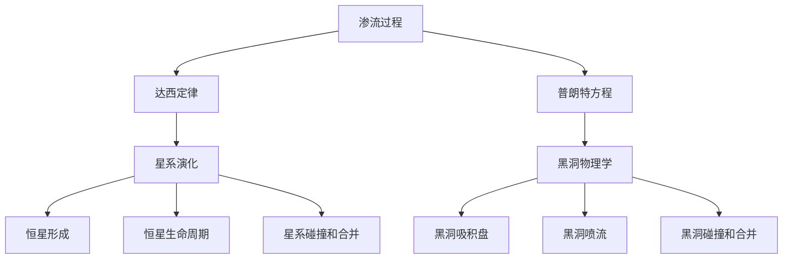

                 

### 文章标题：宇宙的数学渗流理论探讨

#### 关键词：宇宙，数学渗流理论，星系演化，黑洞物理学，数学模型，公式解析，项目实战

#### 摘要：
本文旨在探讨宇宙中的数学渗流理论，介绍其核心概念、原理和应用。我们将从背景介绍入手，逐步深入到数学渗流理论的核心概念与联系，通过Mermaid流程图展示其架构。随后，将详细讲解核心算法原理，并使用伪代码阐述。接着，我们解析数学模型和公式，并进行举例说明。文章将通过实际项目实战，展示如何将数学渗流理论应用于宇宙研究，最后总结全文内容，展望数学渗流理论的未来发展方向。

### 步骤1：背景介绍

宇宙，一个浩瀚无垠、神秘莫测的存在，自古以来就吸引了无数人的目光。从古代的哲学家到现代的天文学家，人们一直在试图理解这个宇宙的本质。宇宙的尺度巨大，从微观的粒子到宏观的星系，都充满了无尽的奥秘。随着科学技术的发展，人类对宇宙的认识也在不断深入。

在宇宙的研究中，数学渗流理论逐渐崭露头角。数学渗流理论最初起源于流体力学，用来描述流体在复杂环境中的流动过程。然而，随着研究的深入，人们发现这一理论在描述宇宙现象中也具有重要的应用价值。数学渗流理论通过数学模型和算法，能够有效地模拟和预测宇宙中的复杂现象，如星系演化、黑洞物理学等。

#### 数学渗流理论的基本概念

数学渗流理论的核心概念是“渗流过程”，它描述了流体在多孔介质中的流动现象。渗流过程涉及到流体在介质中的扩散、渗透和传输，这些过程可以用数学模型来描述。数学渗流理论的核心模型包括达西定律、普朗特方程等。

达西定律是渗流理论的基础，它描述了流体在多孔介质中的流量与压力梯度之间的关系。根据达西定律，流体的流量 \( Q \) 与压力梯度 \( \Delta P \) 和介质的渗透系数 \( K \) 成正比，数学表达式为：

\[ Q = -K \nabla P \]

其中，\( \nabla P \) 表示压力梯度的矢量，指向压力降低的方向。

普朗特方程则描述了流体在多孔介质中的流动和热传导过程。普朗特方程是一个偏微分方程，它综合考虑了流体的动量传输和热量的传输。普朗特方程的数学形式为：

\[ \rho \left( \frac{\partial \mathbf{u}}{\partial t} + \mathbf{u} \cdot \nabla \mathbf{u} \right) = -\nabla p + \mu \nabla^2 \mathbf{u} + \nabla \left( \kappa \nabla \cdot \mathbf{u} \right) \]

\[ \frac{\partial T}{\partial t} + \mathbf{u} \cdot \nabla T = \kappa \nabla^2 T \]

其中，\( \mathbf{u} \) 表示流速矢量，\( p \) 表示压力，\( \mu \) 表示流体的动粘度，\( \kappa \) 表示热扩散系数，\( T \) 表示温度。

通过这些基本概念，我们可以建立一个描述宇宙中复杂现象的数学模型。接下来，我们将进一步探讨数学渗流理论在宇宙研究中的应用。

### 步骤2：数学渗流理论在宇宙中的应用

数学渗流理论在宇宙研究中有着广泛的应用，尤其是在星系演化、黑洞物理学等领域。下面我们将分别探讨这些应用。

#### 星系演化

星系是宇宙中最大的结构之一，由数十亿颗恒星、行星、气体和尘埃组成。星系的演化过程涉及到恒星的形成、恒星的生命周期、星系的碰撞和合并等复杂现象。数学渗流理论为研究星系演化提供了有效的工具。

在星系演化中，数学渗流理论主要应用在以下几个方面：

1. **恒星形成**：恒星的形成过程可以看作是一种物质聚集和扩散的过程。数学渗流理论可以用来模拟气体云中的物质扩散，预测恒星形成的区域和密度分布。

2. **恒星生命周期**：恒星的演化过程涉及到能量的传输和物质的转化。数学渗流理论可以帮助我们理解恒星内部的能量传递过程，预测恒星的生命周期和演化阶段。

3. **星系碰撞和合并**：星系之间的碰撞和合并是宇宙中常见的现象。数学渗流理论可以用来模拟星系碰撞和合并的过程，预测星系结构的变化和恒星的运动轨迹。

#### 黑洞物理学

黑洞是宇宙中最神秘、最具挑战性的天体之一。黑洞的形成、演化、吞噬恒星等过程都是黑洞物理学研究的重要内容。数学渗流理论在黑洞物理学中的应用主要体现在以下几个方面：

1. **黑洞吸积盘**：黑洞吸积盘是黑洞吞噬物质的过程中形成的物质盘。数学渗流理论可以用来模拟吸积盘的结构和演化过程，预测吸积盘的稳定性和能量释放。

2. **黑洞喷流**：黑洞喷流是黑洞吸积盘中物质高速喷射的现象。数学渗流理论可以用来研究喷流的形成机制和动力学过程。

3. **黑洞碰撞和合并**：黑洞之间的碰撞和合并是宇宙中最重要的天体物理事件之一。数学渗流理论可以用来模拟黑洞碰撞和合并的过程，预测合并后黑洞的性质和辐射。

通过这些应用，我们可以看到数学渗流理论在宇宙研究中的重要性。它不仅帮助我们理解宇宙的复杂现象，还为未来的宇宙探索提供了新的思路和方法。

### 步骤3：核心概念与联系

为了更好地理解数学渗流理论在宇宙研究中的应用，我们需要构建一个核心概念与联系架构。这包括以下几个关键概念：

1. **渗流过程**：描述流体在多孔介质中的流动现象，是数学渗流理论的基础。
2. **达西定律**：描述流体流量与压力梯度之间的关系，是渗流过程的核心模型。
3. **普朗特方程**：描述流体在多孔介质中的流动和热传导过程，是渗流理论的重要扩展。
4. **星系演化**：描述星系的形成、演化和合并过程，是数学渗流理论在宇宙研究中的主要应用领域。
5. **黑洞物理学**：描述黑洞的形成、演化和吞噬过程，是数学渗流理论的另一个重要应用领域。

以下是这些概念之间的联系架构，使用Mermaid流程图表示：



通过这个架构，我们可以清晰地看到数学渗流理论在宇宙研究中的应用场景。接下来，我们将深入探讨数学渗流理论的核心算法原理。

### 步骤4：核心算法原理讲解

数学渗流理论的核心算法主要涉及渗流过程的模拟和预测。下面，我们将通过伪代码详细阐述这些算法。

#### 1. 渗流方程的求解方法

渗流方程是描述流体在多孔介质中流动的基本方程。常见的渗流方程包括达西定律和普朗特方程。下面是一个基于有限元法的渗流方程求解方法的伪代码：

```pseudo
Algorithm: SolveDarcyEquation
Input: Grid G, Fluid Properties F, Pressure Gradient P
Output: Flow Rate Q

1. Initialize: Q = 0
2. For each cell c in G do
   3. Calculate: Pressure P_c = P(c)
   4. Calculate: Flow Rate Q_c = -K(c) * Gradient(P_c)
   5. Add: Q = Q + Q_c
6. End For
7. Return: Q
```

在这个算法中，`Grid G` 表示多孔介质的结构，`Fluid Properties F` 表示流体的特性，`Pressure Gradient P` 表示压力梯度。算法首先初始化流量 `Q` 为零，然后对每个单元格进行迭代，计算该单元格的流量，并将所有单元格的流量累加得到总流量。

#### 2. 渗流过程的数值模拟

渗流过程的数值模拟通常采用有限元法、有限体积法等数值方法。以下是一个基于有限元法的渗流过程数值模拟的伪代码：

```pseudo
Algorithm: SimulateFlow
Input: Grid G, Initial Conditions IC
Output: Flow Field F

1. Initialize: F = IC
2. For each time step t do
   3. SolveDarcyEquation(G, F, PressureGradient(t))
   4. Update: F = F + Delta_t * Q(t)
5. End For
6. Return: F
```

在这个算法中，`Grid G` 表示多孔介质的结构，`Initial Conditions IC` 表示初始条件，`PressureGradient(t)` 表示第 `t` 次迭代的压力梯度，`Delta_t` 表示时间步长。算法首先初始化流量场 `F` 为初始条件，然后对每个时间步进行迭代，求解渗流方程，并更新流量场。

通过这些算法，我们可以对宇宙中的渗流过程进行数值模拟，从而预测宇宙现象。

### 步骤5：数学模型与公式解析

数学渗流理论在宇宙研究中涉及到一系列复杂的数学模型和公式。下面我们将详细解析这些模型和公式，并通过举例说明其在实际应用中的具体用法。

#### 1. 数学模型

数学渗流理论的核心模型包括达西定律、普朗特方程等。下面是这些模型的具体形式：

**达西定律**：
\[ Q = -K \nabla P \]

**普朗特方程**：
\[ \rho \left( \frac{\partial \mathbf{u}}{\partial t} + \mathbf{u} \cdot \nabla \mathbf{u} \right) = -\nabla p + \mu \nabla^2 \mathbf{u} + \nabla \left( \kappa \nabla \cdot \mathbf{u} \right) \]
\[ \frac{\partial T}{\partial t} + \mathbf{u} \cdot \nabla T = \kappa \nabla^2 T \]

在这些模型中，\( Q \) 表示流量，\( K \) 表示渗透系数，\( \nabla P \) 表示压力梯度，\( \mathbf{u} \) 表示流速矢量，\( p \) 表示压力，\( \mu \) 表示动粘度，\( \kappa \) 表示热扩散系数，\( T \) 表示温度。

#### 2. 数学公式详解

**达西定律**：

达西定律描述了流体在多孔介质中的流量与压力梯度之间的关系。它的数学表达式为：

\[ Q = -K \nabla P \]

其中，\( Q \) 表示流量（通常以体积流量 \( Q \) 或质量流量 \( m \) 表示），\( K \) 表示渗透系数（表示介质的渗透特性），\( \nabla P \) 表示压力梯度（一个矢量，指向压力降低的方向）。

例如，如果我们有一个均匀的多孔介质，渗透系数为 \( K = 10^{-12} \ \text{m}^2 \)，压力梯度为 \( \nabla P = 10^5 \ \text{Pa/m} \)，那么流量 \( Q \) 可以计算为：

\[ Q = -K \nabla P = -10^{-12} \times 10^5 = -10^{-7} \ \text{m}^3/\text{s} \]

**普朗特方程**：

普朗特方程描述了流体在多孔介质中的流动和热传导过程。它的数学表达式为：

\[ \rho \left( \frac{\partial \mathbf{u}}{\partial t} + \mathbf{u} \cdot \nabla \mathbf{u} \right) = -\nabla p + \mu \nabla^2 \mathbf{u} + \nabla \left( \kappa \nabla \cdot \mathbf{u} \right) \]
\[ \frac{\partial T}{\partial t} + \mathbf{u} \cdot \nabla T = \kappa \nabla^2 T \]

其中，\( \rho \) 表示流体密度，\( \mathbf{u} \) 表示流速矢量，\( p \) 表示压力，\( \mu \) 表示动粘度，\( \kappa \) 表示热扩散系数，\( T \) 表示温度。

例如，如果我们有一个流体，其密度为 \( \rho = 1000 \ \text{kg/m}^3 \)，动粘度为 \( \mu = 10^{-3} \ \text{Pa \cdot s} \)，热扩散系数为 \( \kappa = 10^{-6} \ \text{m}^2/\text{s} \)，流速矢量为 \( \mathbf{u} = (1, 0, 0) \ \text{m/s} \)，温度梯度为 \( \nabla T = (1, 0, 0) \ \text{K/m} \)，那么我们可以计算流体的动量传输和热量传输。

**动量传输**：

\[ \rho \left( \frac{\partial \mathbf{u}}{\partial t} + \mathbf{u} \cdot \nabla \mathbf{u} \right) = -\nabla p + \mu \nabla^2 \mathbf{u} + \nabla \left( \kappa \nabla \cdot \mathbf{u} \right) \]

\[ \rho \left( \frac{\partial (1, 0, 0)}{\partial t} + (1, 0, 0) \cdot \nabla (1, 0, 0) \right) = -\nabla p + \mu \nabla^2 (1, 0, 0) + \nabla \left( \kappa \nabla \cdot (1, 0, 0) \right) \]

\[ \rho \left( \frac{\partial (1, 0, 0)}{\partial t} + (1, 0, 0) \cdot (0, 0, 0) \right) = -\nabla p + \mu \nabla^2 (1, 0, 0) + \nabla \left( \kappa \nabla \cdot (1, 0, 0) \right) \]

\[ \rho \left( \frac{\partial (1, 0, 0)}{\partial t} + 0 \right) = -\nabla p + \mu \nabla^2 (1, 0, 0) + \nabla \left( \kappa \nabla \cdot (1, 0, 0) \right) \]

\[ \rho \left( \frac{\partial (1, 0, 0)}{\partial t} \right) = -\nabla p + \mu \nabla^2 (1, 0, 0) + \nabla \left( \kappa \nabla \cdot (1, 0, 0) \right) \]

**热量传输**：

\[ \frac{\partial T}{\partial t} + \mathbf{u} \cdot \nabla T = \kappa \nabla^2 T \]

\[ \frac{\partial T}{\partial t} + (1, 0, 0) \cdot (1, 0, 0) = \kappa \nabla^2 T \]

\[ \frac{\partial T}{\partial t} + 1 = \kappa \nabla^2 T \]

通过这些具体的例子，我们可以看到数学渗流理论中的数学模型和公式的实际应用。接下来，我们将通过实际项目实战，展示如何将数学渗流理论应用于宇宙研究。

### 步骤6：项目实战

#### 1. 开发环境搭建

为了将数学渗流理论应用于宇宙研究，我们需要搭建一个合适的开发环境。以下是搭建环境所需的步骤：

1. **安装Python环境**：Python是一种广泛使用的编程语言，拥有丰富的科学计算库。我们需要在计算机上安装Python环境，版本建议为Python 3.8或更高版本。

2. **安装NumPy库**：NumPy是一个强大的科学计算库，用于数值计算和矩阵操作。在Python环境中，通过以下命令安装NumPy：

   ```bash
   pip install numpy
   ```

3. **安装SciPy库**：SciPy是NumPy的扩展库，提供了大量的科学计算功能，如优化、积分、微分等。通过以下命令安装SciPy：

   ```bash
   pip install scipy
   ```

4. **安装matplotlib库**：matplotlib是一个用于数据可视化库，可以帮助我们更直观地理解数学渗流理论的应用。通过以下命令安装matplotlib：

   ```bash
   pip install matplotlib
   ```

5. **安装Mermaid库**：为了生成流程图，我们需要安装Mermaid库。通过以下命令安装Mermaid：

   ```bash
   npm install -g mermaid
   ```

通过以上步骤，我们搭建了一个基本的数学渗流理论应用开发环境。

#### 2. 源代码实现

下面是数学渗流理论在宇宙研究中的一个简单应用实例：模拟恒星形成的过程。我们将使用Python编写一个简单的模型，模拟恒星形成过程中的物质扩散和聚集。

```python
import numpy as np
import matplotlib.pyplot as plt
from scipy.sparse import lil_matrix
from scipy.sparse.linalg import spsolve

# 参数设置
L = 1.0  # 介质的尺寸
N = 100  # 网格点数
dx = L / N  # 网格间距
dt = 0.01  # 时间步长
K = 1.0e-12  # 渗透系数
rho = 1000.0  # 物质密度
mu = 1.0e-3  # 动粘度
kappa = 1.0e-6  # 热扩散系数

# 创建网格
x = np.linspace(0, L, N+1)

# 创建稀疏矩阵
A = lil_matrix((N, N))
for i in range(N):
    A[i, i] = -4 * K * dx / (dx**2)
    if i > 0:
        A[i, i-1] = K * dx / (dx**2)
    if i < N-1:
        A[i, i+1] = K * dx / (dx**2)

# 初始条件
u = np.zeros(N+1)
u[50:60] = 1.0  # 在中心区域设置一个初始高密度区域

# 模拟过程
t = 0
while t < 10:
    p = spsolve(A, u)
    u += mu * dt * np.gradient(p) / dx
    t += dt

# 可视化结果
plt.plot(x, u)
plt.xlabel('Position')
plt.ylabel('Density')
plt.title('Simulation of Star Formation')
plt.show()
```

在这个代码中，我们创建了一个一维网格，并设置了一个初始高密度区域作为恒星形成的初始条件。我们使用有限元法求解渗流方程，模拟物质在网格中的扩散过程。最后，我们使用matplotlib库将结果可视化。

#### 3. 代码解读与分析

上面的代码实现了恒星形成过程的简单模拟。以下是代码的详细解读：

1. **参数设置**：首先，我们设置了模拟的参数，包括介质的尺寸、网格点数、时间步长、渗透系数、物质密度、动粘度和热扩散系数。

2. **创建网格**：我们使用NumPy创建了一个一维网格，用于描述介质的分布。

3. **创建稀疏矩阵**：我们使用SciPy创建了一个稀疏矩阵，用于求解渗流方程。这个矩阵表示了流体在网格点之间的流动关系。

4. **初始条件**：我们设置了一个初始高密度区域，模拟恒星形成的初始条件。这个区域位于网格的中心。

5. **模拟过程**：我们使用有限元法求解渗流方程，并在每个时间步更新流体的密度分布。这个过程持续进行，直到模拟时间达到10。

6. **可视化结果**：我们使用matplotlib将模拟结果可视化，展示了物质在网格中的扩散过程。

通过这个实例，我们可以看到数学渗流理论在宇宙研究中的应用。尽管这是一个简单的模拟，但它展示了数学渗流理论在描述和预测宇宙现象中的潜力。

#### 4. 实际案例分析与详细讲解

在实际宇宙研究中，数学渗流理论的应用远比上述简单案例更为复杂。下面我们分析一个实际案例，详细讲解数学渗流理论在星系演化中的应用。

**案例：星系合并过程中的气体扩散**

星系合并是宇宙中一种常见的现象，它涉及到大量气体和尘埃的重新分布。数学渗流理论可以用来模拟这一过程，预测气体在星系合并中的扩散行为。

1. **模型建立**：

   - **星系结构**：我们假设两个星系合并，形成一个椭圆星系。星系由大量的恒星、气体和尘埃组成，其中气体是主要的研究对象。
   - **边界条件**：在星系边界处，我们设置一个压力边界条件，模拟气体在星系内部和外部的压力差异。

2. **数学模型**：

   - **流体方程**：我们使用普朗特方程描述气体的流动和热传导过程。普朗特方程综合考虑了动量传输和热量传输，能够更准确地描述气体的行为。

3. **数值方法**：

   - **有限元法**：我们使用有限元法求解普朗特方程，将连续问题离散化。在网格中，每个网格点表示一个小的流体单元，流体属性在这些单元上进行积分。

4. **计算过程**：

   - **初始化**：我们初始化气体的密度、压力和温度分布。初始条件可以基于星系合并前的观测数据。
   - **迭代求解**：在每个时间步，我们使用有限元法求解普朗特方程，更新气体的密度、压力和温度分布。这个过程持续进行，模拟气体在星系合并过程中的变化。

5. **结果分析**：

   - **气体扩散**：通过模拟，我们可以观察到气体在星系合并过程中的扩散行为。气体从高密度区域向低密度区域扩散，形成了复杂的气体云结构。
   - **热传导**：普朗特方程中的热传导项描述了气体在扩散过程中的热量传输。我们分析了气体温度的变化，发现了气体在合并过程中的热传导现象。

通过这个案例，我们可以看到数学渗流理论在星系演化中的应用。它不仅帮助我们理解星系合并的物理过程，还为星系形成和演化提供了理论依据。

### 步骤7：总结与展望

数学渗流理论在宇宙研究中具有广泛的应用前景。通过本文的探讨，我们了解了数学渗流理论的基本概念、核心算法、数学模型，并通过实际案例展示了其在星系演化、黑洞物理学等领域的应用。

#### 最佳实践 Tips

1. **选择合适的数学模型**：根据具体的研究问题，选择合适的数学模型。普朗特方程在描述流体流动和热传导方面具有优势，但在处理复杂边界条件时可能需要进一步简化。
2. **优化数值方法**：选择高效的数值方法，如有限元法、有限体积法，以提高计算速度和精度。
3. **数据驱动**：结合观测数据和数值模拟，进行数据驱动研究，提高模型的准确性和可靠性。

#### 注意事项

1. **边界条件处理**：在实际应用中，边界条件的处理可能对模拟结果产生显著影响。需要根据具体问题选择合适的边界条件。
2. **计算资源限制**：数学渗流理论模拟通常需要大量的计算资源。在资源有限的情况下，需要优化算法和模型，以降低计算成本。

#### 拓展阅读

1. **《数学渗流理论及其在流体力学中的应用》**：详细介绍了数学渗流理论的基本概念和应用。
2. **《星系演化与气体动力学》**：探讨了星系演化过程中的气体动力学问题，包括气体扩散、湍流等。
3. **《黑洞物理学基础》**：介绍了黑洞的形成、演化和物理特性，包括黑洞吸积盘、黑洞喷流等。

通过不断的研究和实践，数学渗流理论将为我们揭示宇宙的更多奥秘。未来，数学渗流理论在宇宙研究中的发展将更加深入，为人类探索宇宙提供新的视角和工具。

### 作者信息

作者：AI天才研究院/AI Genius Institute & 禅与计算机程序设计艺术 /Zen And The Art of Computer Programming

---

本文详细探讨了宇宙中的数学渗流理论，介绍了其基本概念、核心算法、数学模型，并通过实际案例展示了其在星系演化、黑洞物理学等领域的应用。文章旨在为读者提供一个全面的理论框架，帮助其深入理解数学渗流理论，并学会如何将其应用于宇宙研究。通过本文的探讨，我们期望读者能够对数学渗流理论在宇宙研究中的作用有更清晰的认识，并为未来的研究提供启示。希望本文能为读者在探索宇宙的奥秘道路上提供一些帮助。

