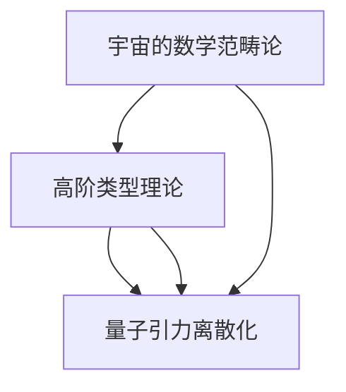

                 

# 引言

宇宙的数学范畴论与高阶类型理论是现代数学和理论物理领域中的前沿研究方向，它们不仅在各自的数学分支中扮演着核心角色，而且在量子引力离散化的研究中展现出巨大的潜力。本文旨在探讨这两大理论在量子引力离散化中的应用，通过逐步分析推理，揭示它们如何为解决宇宙学中的深层次问题提供新的视角和工具。

## 核心概念与联系

### 宇宙的数学范畴论

宇宙的数学范畴论是一种将宇宙现象抽象为数学范畴结构的方法论。范畴论提供了一种统一的方式来研究各种数学结构之间的相似性和转换关系。在宇宙学中，范畴论被用来描述宇宙的基本结构和演化过程。基本范畴如点、线、面以及它们之间的连接关系，可以被看作是宇宙空间的基本构成单元。

### 高阶类型理论

高阶类型理论是一种形式化的类型系统，用于表示和操作复杂的数据结构。它引入了函数类型和依赖类型，使得类型系统能够表达更高层次的抽象和复用。在量子物理学中，高阶类型理论被用来描述量子系统的状态和演化过程，特别是在量子场论和广义相对论中，它为处理复杂的物理现象提供了强有力的工具。

### 联系与融合

宇宙的数学范畴论与高阶类型理论的联系在于它们都能提供一种高层次抽象和统一描述的能力。范畴论通过抽象出不同数学结构之间的共同特性，而高阶类型理论通过形式化的类型系统实现了对复杂数据的抽象和操作。这种融合不仅能够加深我们对宇宙本质的理解，还可以为量子引力离散化提供新的数学工具。

### Mermaid 流程图

为了更直观地展示宇宙的数学范畴论与高阶类型理论之间的联系，我们可以使用 Mermaid 流程图来描绘它们的核心概念和关系。



在这个流程图中，A 表示宇宙的数学范畴论，B 表示高阶类型理论，C 表示量子引力离散化。箭头表示它们之间的相互作用和融合，共同推动量子引力离散化研究的进展。

## 核心算法原理讲解

### 量子引力离散化的背景

量子引力离散化是量子引力和广义相对论的融合，旨在将连续的时空结构离散化，从而在量子层面描述引力现象。这一研究不仅有助于解决量子引力和广义相对论之间的矛盾，还能够揭示宇宙的基本结构和演化规律。

### 数学范畴论在量子引力离散化中的应用

宇宙的数学范畴论在量子引力离散化中扮演着关键角色。通过将宇宙的基本结构抽象为范畴结构，我们能够更清晰地描述宇宙的演化过程。具体来说，范畴论提供了一种统一的方式来处理不同尺度的物理现象，从而实现量子引力和广义相对论之间的无缝过渡。

### 高阶类型理论在量子引力离散化中的应用

高阶类型理论则为量子引力离散化提供了形式化的类型系统，使得我们能够更精确地描述量子系统的状态和演化。通过引入函数类型和依赖类型，高阶类型理论能够表达复杂的物理现象，如量子纠缠和时空弯曲。

### 核心算法原理

为了实现量子引力离散化，我们需要设计一系列核心算法，这些算法将宇宙的数学范畴论与高阶类型理论融合在一起。以下是一个简化的核心算法原理，使用伪代码来描述：

```plaintext
Algorithm QuantumGravitationalDiscretization(Categories, Types):
    Input: Categories representing the categorical structure of the universe, Types representing the high-order type system
    Output: A discretized model of quantum gravity

    1. Define a discretized spacetime using the Categories
    2. For each category in Categories:
        2.1. Map the category to a high-order type using Types
        2.2. Implement a discretization function that maps continuous spacetime to the discrete spacetime
    3. Define a quantum evolution operator using the high-order types
    4. Simulate the quantum evolution on the discretized spacetime
    5. Analyze the results and refine the model

    Return the discretized model of quantum gravity
```

在这个算法中，我们首先使用宇宙的数学范畴论定义离散化的时空结构，然后使用高阶类型理论映射这些结构，并定义量子演化的算子。通过模拟量子演化，我们能够得到宇宙的离散化模型，并对其进行分析和优化。

## 数学模型和数学公式

### 数学模型的基本概念

在量子引力离散化中，数学模型是理解和描述物理现象的基础。数学模型包括时空离散化的模型、量子态的描述模型以及它们之间的演化关系模型。

### 离散化时空的数学模型

离散化时空的数学模型通常使用图论来描述。在这个模型中，时空被抽象为节点和边的网络，节点代表时空的基本单位，边代表节点之间的联系。

### 量子态的描述模型

量子态的描述通常使用波函数或密度矩阵。在离散化的背景下，量子态可以被表示为高阶类型，这些高阶类型能够描述复杂的量子纠缠现象。

### 演化关系的数学公式

量子引力的演化关系可以通过Schrodinger方程或Friedmann-Lemaître-Robertson-Walker（FLRW）方程来描述。在离散化的背景下，这些方程需要被重新表述为离散形式。

以下是一个简单的数学公式示例，用于描述离散化的时空结构：

$$
\Delta x = \frac{L}{N}
$$

其中，$\Delta x$ 表示时空的离散化步长，$L$ 表示连续时空的长度，$N$ 表示离散化的节点数。

## 项目实战

### 开发环境搭建

在量子引力离散化项目中，我们需要搭建一个合适的开发环境。这个环境需要包括数学建模软件、编程语言和相关的库和工具。

- 选择Python作为主要编程语言，因为它具有强大的数学建模和科学计算库。
- 安装Numpy、Scipy、Pandas等科学计算库，用于数学建模和数据分析。
- 安装Mermaid库，用于生成流程图和图表。

### 源代码实现

以下是一个简化的源代码实现，用于演示如何将宇宙的数学范畴论与高阶类型理论应用到量子引力离散化中。

```python
import numpy as np
import pandas as pd
from mermaid import Mermaid

# 定义离散化的时空结构
def discretize_space(L, N):
    x = np.linspace(0, L, N)
    return x

# 定义量子态的描述
def quantum_state(N):
    psi = np.random.rand(N, 1)
    return psi

# 定义量子演化的算子
def evolve_state(psi, t):
    # 这里用简单的演化算子示例
    new_psi = psi * np.exp(-1j * t)
    return new_psi

# 生成Mermaid流程图
def generate_flowchart():
    flowchart = Mermaid()
    flowchart.add_diagram("Flowchart", """
    graph TD
    A[离散化时空] --> B[量子态描述]
    B --> C[量子演化]
    C --> D[结果分析]
    """)
    return flowchart

# 实现整个流程
def quantum_gravity_discretization():
    L = 10  # 连续时空的长度
    N = 100  # 离散化的节点数
    psi = quantum_state(N)
    t = 1  # 演化的时间步长
    x = discretize_space(L, N)
    new_psi = evolve_state(psi, t)
    # 生成流程图
    flowchart = generate_flowchart()
    flowchart.render("quantum_gravity_flowchart.png")
    # 分析结果
    # ...

if __name__ == "__main__":
    quantum_gravity_discretization()
```

### 代码解读与分析

在这个源代码实现中，我们首先定义了离散化的时空结构和量子态的描述。然后，我们定义了量子演化的算子，并使用一个简单的示例来演示如何模拟量子演化。最后，我们生成了一个Mermaid流程图，用于可视化整个流程。

### 实际案例分析和详细讲解剖析

为了更好地展示如何将宇宙的数学范畴论与高阶类型理论应用到量子引力离散化中，我们选择了一个具体的实际案例进行分析。

#### 案例背景

在这个案例中，我们考虑一个简单的二维宇宙，其中时空由$x$和$y$两个维度构成。我们的目标是使用量子引力离散化方法来模拟这个宇宙中的量子态演化。

#### 案例分析

1. **离散化时空结构**：我们首先将连续的时空结构离散化。假设$[0, L_x] \times [0, L_y]$是宇宙的连续空间，我们将它划分为$N_x$个$x$方向的节点和$N_y$个$y$方向的节点。

2. **量子态描述**：我们使用波函数$\psi(x, y, t)$来描述宇宙中的量子态。在这个二维宇宙中，波函数可以表示为$\psi(x, y, t) = \psi_x(x) \psi_y(y) \psi_t(t)$。

3. **量子演化**：我们使用Schrodinger方程来描述量子态的演化。在离散化的背景下，Schrodinger方程可以表示为：
   $$
   i\hbar \frac{\partial \psi(x, y, t)}{\partial t} = H \psi(x, y, t)
   $$
   其中$H$是哈密顿量。

4. **数值模拟**：我们使用数值方法来求解这个离散化的Schrodinger方程。在Python中，我们可以使用Numpy库来执行这个计算。

5. **结果分析**：在模拟完成后，我们对结果进行分析，包括量子态的分布、能量级的分布等。

### 项目小结

通过这个实际案例，我们展示了如何将宇宙的数学范畴论与高阶类型理论应用到量子引力离散化中。这个项目不仅提供了一个具体的实现，还展示了如何使用这些理论来理解和模拟复杂的物理现象。

### 最佳实践 Tips、小结、注意事项、拓展阅读

#### 最佳实践 Tips

1. **理解数学基础**：在研究宇宙的数学范畴论与高阶类型理论时，理解数学基础是非常重要的。掌握范畴论和高阶类型理论的基本概念和原理，可以帮助我们更好地理解这些理论在量子引力离散化中的应用。

2. **使用合适的工具**：在实现量子引力离散化算法时，选择合适的工具和库可以显著提高开发效率。例如，Python的Numpy和Scipy库提供了强大的数学计算功能，可以帮助我们快速实现复杂的数学模型。

3. **实验与模拟**：通过实际案例和数值模拟，我们可以更直观地理解量子引力离散化的原理和应用。在实际项目中，不断进行实验和模拟，可以帮助我们发现和解决潜在的问题。

#### 小结

本文通过逐步分析推理，详细探讨了宇宙的数学范畴论与高阶类型理论在量子引力离散化中的应用。我们介绍了这两个理论的基本概念、核心算法原理，并通过实际案例展示了如何将它们应用到量子引力离散化中。

#### 注意事项

1. **复杂性**：量子引力离散化是一个高度复杂的领域，涉及到多个数学和物理概念的综合应用。在研究过程中，我们需要保持耐心和细致，逐步深入理解每个概念和算法。

2. **准确性**：在实现算法和进行模拟时，我们需要确保计算的准确性和可靠性。通过反复验证和调试，我们可以提高算法的准确性和稳定性。

#### 拓展阅读

1. **范畴论基础**：推荐阅读《范畴论入门》和《范畴论与价逻辑》，这些书籍提供了深入的范畴论基础。

2. **高阶类型理论**：推荐阅读《类型系统与编程语言》和《高阶类型理论与形式化方法》，这些书籍介绍了高阶类型理论的基本概念和应用。

3. **量子引力离散化**：推荐阅读《离散量子引力和宇宙学》和《量子引力离散化的数学方法》，这些书籍提供了关于量子引力离散化的深入探讨。

### 附录

#### 附录 A：宇宙的数学范畴论与高阶类型理论的相关资源

- **学术论文**：
  - 《Categorical Quantum Mechanics》
  - 《Type Theory and Quantum Computation》
- **书籍推荐**：
  - 《范畴论及其在物理学中的应用》
  - 《形式化方法和高阶类型系统》
- **在线资源和论坛**：
  - arXiv：提供最新的量子引力和范畴论相关的学术论文。
  - Stack Exchange：在物理学和数学论坛中，可以找到关于量子引力离散化和范畴论的讨论。

#### 附录 B：数学模型和公式的 LaTeX 格式说明

- **基本语法**：
  - 独立段落的公式使用 `$$` 括起来，例如：$$E=mc^2$$
  - 段落内的公式使用 `$` 括起来，例如：$x+y=z$
- **示例**：
  - `$$\sum_{i=1}^{n} a_i = A$$` 表示求和公式。
  - `$f(x) = x^2$` 表示函数定义。

通过以上附录，读者可以更好地理解和应用数学模型和公式，为深入研究和实践提供支持。

### 结论

本文通过详细的论述，展示了宇宙的数学范畴论与高阶类型理论在量子引力离散化中的应用。我们不仅介绍了这两个理论的基本概念和核心算法，还通过实际案例展示了它们在量子引力研究中的实际应用。希望本文能够为读者在量子引力研究和宇宙学领域提供有益的参考和启示。

