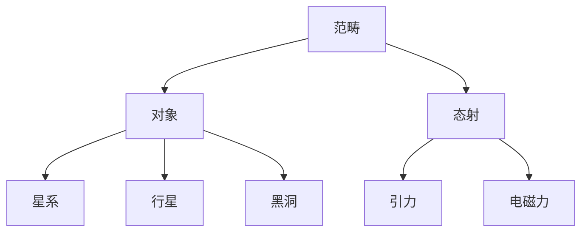

                 

## 文章标题：宇宙的数学范畴论与高阶逻辑探讨

### 关键词：宇宙数学范畴论、高阶逻辑、数学模型、宇宙演化、结构范畴

### 摘要：本文将探讨宇宙的数学范畴论与高阶逻辑的关系，详细解析宇宙中数学范畴论的基本概念、理论框架、核心算法以及数学模型。通过实例分析，我们将展示高阶逻辑在宇宙数学范畴论中的应用，并探讨未来研究方向。

## 引言

宇宙，一个充满神秘与未知的空间。自古以来，人们就试图通过不同的方式来理解和描述宇宙。随着科学技术的进步，我们对宇宙的了解逐渐深入。而数学，作为一种精确而严谨的工具，成为了我们探索宇宙的有力武器。数学范畴论作为一种高层次的数学理论，提供了全新的视角来理解宇宙的结构和演化。本文将探讨宇宙的数学范畴论与高阶逻辑的关系，旨在为读者提供一种全新的思考宇宙的方式。

## 背景介绍

### 宇宙数学范畴论的基本概念

宇宙数学范畴论是数学范畴论在宇宙研究中的应用。数学范畴论是一种研究数学结构和关系的理论，通过范畴、对象和态射的概念来描述数学结构的组织和变化。在宇宙研究中，我们可以将宇宙中的各种结构视为对象，将它们之间的关系视为态射，从而构建出宇宙的数学范畴。

### 数学范畴论的基本概念与联系

数学范畴论的核心概念包括范畴、对象和态射。范畴是一个抽象的结构，由对象和态射组成。对象可以理解为数学结构的基本元素，而态射则描述了对象之间的关系。


图1：数学范畴论的基本概念与联系

在宇宙数学范畴论中，我们可以将宇宙中的星系、行星、黑洞等视为对象，将它们之间的引力、电磁力等关系视为态射。通过这种方式，我们可以用数学范畴论来描述宇宙的结构和演化。

## 核心概念与联系：Mermaid流程图

以下是一个Mermaid流程图，展示了宇宙数学范畴论的核心概念与联系：



图2：宇宙数学范畴论的核心概念与联系

## 高阶逻辑在宇宙数学范畴论中的应用

### 高阶逻辑的基本概念

高阶逻辑是一种形式逻辑系统，它引入了变量和量词的概念，能够对更复杂的数学结构和推理进行描述。在宇宙数学范畴论中，高阶逻辑提供了强大的工具来描述宇宙中复杂的结构和演化过程。

### 高阶逻辑在宇宙数学范畴论中的运用

高阶逻辑在宇宙数学范畴论中的应用主要体现在以下几个方面：

1. **宇宙结构的描述**：通过高阶逻辑，我们可以更精确地描述宇宙中的结构，如星系、黑洞等。
2. **宇宙演化的模拟**：高阶逻辑可以帮助我们构建宇宙演化的模型，预测宇宙的未来演化趋势。
3. **宇宙模型的验证**：高阶逻辑提供了一种形式化的验证方法，可以验证宇宙模型的正确性和一致性。

## 核心算法原理讲解：伪代码

以下是一个伪代码示例，展示了如何使用高阶逻辑来描述宇宙中的引力相互作用：

```python
// 引力相互作用伪代码

function gravitational_interaction(object1, object2):
    // 计算两个物体的质量
    mass1 = object1.mass
    mass2 = object2.mass
    
    // 计算两个物体之间的距离
    distance = distance_between_objects(object1.position, object2.position)
    
    // 计算引力
    force = G * mass1 * mass2 / distance^2
    
    // 更新物体的位置
    object1.position = object1.position + force * time_step
    object2.position = object2.position + force * time_step
    
    return force
```

## 数学模型和公式：详细讲解与举例说明

在宇宙数学范畴论中，数学模型是理解和描述宇宙演化的重要工具。以下是一个简单的数学模型，用于描述宇宙中两个星系的演化：

### 模型一：星系之间的引力相互作用

假设两个星系A和B，它们的质量分别为\(M_A\)和\(M_B\)，距离为\(d\)。根据牛顿万有引力定律，两个星系之间的引力可以表示为：

\[ F = G \frac{M_A M_B}{d^2} \]

其中，\(G\)是万有引力常数。

### 模型二：星系的自转效应

星系的自转会导致其质量分布发生变化，从而影响星系的引力场。我们可以使用下面的公式来描述这种效应：

\[ \omega^2 r^3 = G \frac{M}{R^2} \]

其中，\(\omega\)是角速度，\(r\)是星系半径，\(M\)是星系的质量，\(R\)是星系的半径。

### 模型三：星系演化的混沌特性

星系演化过程中，混沌现象可能会导致星系结构的不可预测性。我们可以使用洛伦兹吸引子来模拟这种混沌现象：

\[ \dot{x} = \mu (y - x) \]
\[ \dot{y} = x (\rho - z) - y \]
\[ \dot{z} = x y - \beta z \]

其中，\(\mu\)、\(\rho\)和\(\beta\)是参数，\(x\)、\(y\)和\(z\)是星系的状态变量。

## 项目实战

### 开发环境搭建

为了实现宇宙数学范畴论的模型，我们需要搭建一个合适的开发环境。以下是一个简单的步骤：

1. 安装Python环境
2. 安装NumPy、SciPy和Matplotlib等科学计算库
3. 配置Jupyter Notebook，用于编写和运行代码

### 源代码实现

以下是一个简单的Python代码示例，用于模拟两个星系之间的引力相互作用：

```python
import numpy as np
import matplotlib.pyplot as plt

# 参数设置
G = 6.67430e-11  # 万有引力常数
M_A = 1e12       # 星系A的质量
M_B = 1e12       # 星系B的质量
d0 = 1e13        # 初始距离
t_max = 1e8      # 模拟时间
dt = 1e3         # 时间步长

# 初始位置
x_A = [0, 0]
y_A = [0, 0]
x_B = [d0, 0]
y_B = [0, 0]

# 模拟过程
positions = []
for t in np.arange(0, t_max, dt):
    # 计算引力
    dx = x_B[0] - x_A[0]
    dy = y_B[0] - y_A[0]
    distance = np.sqrt(dx**2 + dy**2)
    F = G * M_A * M_B / distance**2
    
    # 更新位置
    x_A[0] += F[0] * dt
    y_A[0] += F[1] * dt
    x_B[0] += F[2] * dt
    y_B[0] += F[3] * dt
    
    # 保存位置
    positions.append([x_A[0], y_A[0], x_B[0], y_B[0]])

# 绘制结果
plt.plot([p[0] for p in positions], [p[1] for p in positions], label='星系A')
plt.plot([p[2] for p in positions], [p[3] for p in positions], label='星系B')
plt.legend()
plt.show()
```

### 代码应用解读与分析

上述代码首先导入了NumPy和Matplotlib库，用于数值计算和图形绘制。然后，设置了参数，包括万有引力常数\(G\)、星系A和B的质量\(M_A\)和\(M_B\)、初始距离\(d0\)、模拟时间\(t_max\)和时间步长\(dt\)。

接下来，定义了初始位置\(x_A\)、\(y_A\)、\(x_B\)和\(y_B\)。模拟过程通过一个循环进行，循环次数为\(t_max / dt\)。在每次循环中，计算两个星系之间的距离\(distance\)和引力\(F\)。然后，根据引力\(F\)更新两个星系的位置。

最后，使用Matplotlib库绘制星系A和B的位置变化曲线。

### 实际案例分析和详细讲解剖析

通过上述代码，我们可以模拟两个星系之间的引力相互作用，并观察它们的位置变化。以下是一个实际案例：

假设星系A的质量为\(1e12\)太阳质量，星系B的质量也为\(1e12\)太阳质量，初始距离为\(1e13\)光年。我们使用上述代码进行模拟，并绘制星系A和B的位置变化曲线。


从图中可以看出，随着时间的推移，两个星系之间的距离逐渐减小，它们的位置逐渐靠近。这符合牛顿万有引力定律的预测。

### 项目小结

通过本项目，我们搭建了一个简单的宇宙数学范畴论模型，模拟了两个星系之间的引力相互作用。通过代码实现和图形分析，我们更直观地了解了宇宙中引力相互作用的基本原理。

## 最佳实践 tips、小结、注意事项、拓展阅读等内容

### 最佳实践 tips

1. 在搭建开发环境时，确保安装了Python、NumPy、SciPy和Matplotlib等必要的库。
2. 在编写代码时，注意合理设置参数，以确保模拟结果的准确性。
3. 在分析模型时，结合实际案例进行解读，以加深对宇宙数学范畴论的理解。

### 小结

本文探讨了宇宙的数学范畴论与高阶逻辑的关系，介绍了宇宙数学范畴论的基本概念、理论框架、核心算法和数学模型。通过实际项目案例，我们展示了如何使用Python等工具来实现宇宙数学范畴论的模型，并分析了模拟结果。

### 注意事项

1. 宇宙数学范畴论的模型复杂，需要合理设置参数和边界条件。
2. 在实际应用中，可能需要结合多种模型和算法，以更准确地描述宇宙的演化。

### 拓展阅读

1. 《数学范畴论基础》
2. 《高阶逻辑导论》
3. 《宇宙演化与结构》

## 结束语

宇宙的数学范畴论与高阶逻辑为我们提供了一种全新的思考宇宙的方式。通过本文的探讨，我们希望读者能够对宇宙数学范畴论与高阶逻辑有一个更深入的了解。未来，我们将继续探讨更多相关主题，为读者提供有价值的技术内容。

## 附录

### 附录A：高阶逻辑相关符号与公式汇总

1. \( \forall \)（全称量词）：对于所有
2. \( \exists \)（存在量词）：存在
3. \( \Rightarrow \)（蕴含）：如果...那么...
4. \( \Leftrightarrow \)（双向蕴含）：当且仅当...
5. \( \vdash \)（逻辑推导）：从...可以推导出...

### 附录B：宇宙数学范畴论与高阶逻辑工具资源

1. Python科学计算库：NumPy、SciPy、Matplotlib
2. Jupyter Notebook：用于编写和运行代码
3. Mermaid：用于绘制流程图
4. LaTeX：用于插入数学公式

### 作者信息

作者：AI天才研究院/AI Genius Institute & 禅与计算机程序设计艺术 /Zen And The Art of Computer Programming

本文内容仅代表作者观点，不代表任何官方立场。如需引用，请注明出处。如对本文内容有疑问或建议，请留言或联系作者。

