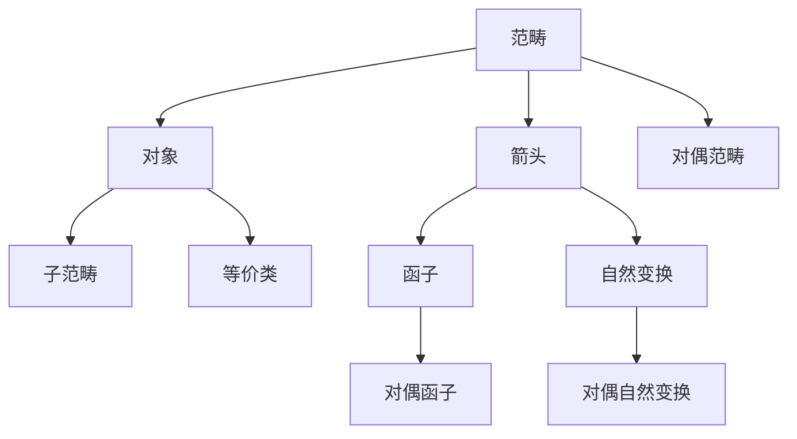

                 

### 引言

#### 数学范畴论简介

数学范畴论（Category Theory）是20世纪中叶由荷兰数学家谢尔贝克（Seymour Shapiro）提出的一种抽象数学理论。它以数学结构中的对象和关系为核心，通过抽象化的方式研究数学结构的性质和变换。范畴论为数学提供了一个统一的视角，使得不同领域的数学结构可以通过相同的语言和概念进行描述和比较。

范畴论的基本概念包括范畴（Category）、对象（Object）、箭头（Arrow）等。范畴是一个由对象组成的集合，以及在这些对象之间定义的箭头集合。箭头代表了对象之间的映射关系，可以看作是一种函数。范畴论中的子范畴、等价类、函子、自然变换等概念，使得我们可以从更高层次上理解数学结构的共性和差异。

#### 宇宙的数学描述

宇宙是一个复杂而神秘的系统，其结构和演化过程一直是科学家们研究的重点。在数学范畴论的框架下，我们可以尝试用数学模型来描述宇宙的现象和规律。

宇宙的数学模型通常包括以下几个方面：

1. **空间结构**：宇宙的空间结构可以用拓扑学中的概念来描述，如维度、连通性、紧致性等。
2. **时空结构**：爱因斯坦的广义相对论提供了一个动态的时空模型，其中时空是一个四维连续体，物体的运动和引力相互作用都在这个时空中发生。
3. **量子力学**：量子力学提供了微观粒子的行为规律，其数学描述包括波函数、态叠加、量子态的测量等。
4. **宇宙演化**：宇宙的演化过程可以通过宇宙学中的方程，如弗里德曼方程、辐射方程等，来描述。

#### 数学范畴论在宇宙研究中的应用前景

数学范畴论在宇宙研究中的应用前景十分广阔。首先，它为不同数学模型之间的统一提供了一个强有力的工具。例如，我们可以用范畴论来统一描述空间结构、时空结构和量子力学中的数学模型。

其次，范畴论可以帮助我们更好地理解宇宙的复杂性和多样性。通过范畴论的方法，我们可以发现宇宙中的某些规律和结构可能具有更深的数学本质。例如，宇宙的膨胀可以看作是一种范畴论中的“态变换”，而黑洞和奇点则可以看作是一种范畴论中的“奇异点”。

最后，范畴论为宇宙研究提供了一种新的思维方式。在范畴论的视角下，我们可以从更高层次上理解宇宙的规律，从而发现新的研究方向和问题。例如，我们可以通过范畴论的方法来探讨宇宙的多尺度结构和复杂系统的行为。

总之，数学范畴论作为一种抽象的数学理论，为我们提供了一个理解宇宙现象的新视角。通过范畴论，我们可以尝试用数学语言来描述宇宙的复杂性和多样性，从而揭示宇宙的本质和规律。这不仅是数学领域的重要研究方向，也是宇宙学研究的重要工具和方法。

---

### 核心概念与联系

#### 范畴论基本概念

在深入探讨数学范畴论在宇宙研究中的应用之前，我们需要首先理解范畴论的核心概念和它们之间的联系。

**范畴（Category）**

范畴是数学范畴论中的基本概念，可以看作是一个抽象的结构，由对象（Objects）和箭头（Arrows）组成。范畴中的对象类似于数学结构中的元素，而箭头则表示对象之间的映射关系。

**对象（Objects）**

范畴中的对象是范畴的基本组成部分。对象可以表示各种不同的数学结构，如集合、拓扑空间、向量空间等。在不同的范畴论研究中，对象的具体含义可能有所不同。

**箭头（Arrows）**

箭头是范畴中的映射关系，通常表示为函数或变换。箭头连接两个对象，表示一个对象到另一个对象的映射。在范畴论中，箭头不仅表示函数，还可以是更抽象的变换。

**子范畴（Subcategory）**

子范畴是范畴的一个子结构，它包含原范畴的一部分对象和箭头。子范畴保持了原范畴的性质，但限制在更小的范围内。

**等价类（Equivalence Classes）**

等价类是范畴论中的一个重要概念，表示在范畴中具有相同性质的元素集合。两个对象属于同一个等价类，当且仅当它们之间存在一个自然的等价关系。

**函子（Functor）**

函子是范畴之间的映射，它保持了范畴的结构。函子可以将一个范畴中的对象和箭头映射到另一个范畴中，从而实现不同范畴之间的转换。

**自然变换（Natural Transformation）**

自然变换是函子之间的变换，它在多个函子之间保持了自然等价关系。自然变换是范畴论中描述结构变换的重要工具。

**范畴的对偶（Duality）**

范畴的对偶是通过交换对象和箭头的概念得到的。对偶范畴中的对象和箭头与原范畴中的对象和箭头之间存在一定的对应关系。

#### 范畴论概念之间的关系架构 Mermaid 流程图

以下是一个用Mermaid绘制的范畴论基本概念之间的关系架构图：



在这个架构图中，我们可以清晰地看到各个核心概念之间的联系。范畴作为整体框架，包含了对象和箭头，并通过子范畴、等价类等概念进行细化。箭头作为范畴的基本结构，与函子和自然变换密切相关，而范畴的对偶则提供了另一个视角来理解范畴的结构。

通过这个关系架构图，我们可以更好地理解范畴论的核心概念，并为其在宇宙研究中的应用打下基础。在接下来的部分，我们将深入探讨这些概念的具体应用。

---

### 核心算法原理讲解

#### 范畴论中的核心算法原理

在数学范畴论中，有一些核心算法原理对于理解宇宙的数学范畴特性至关重要。以下将详细介绍这些算法原理，并通过伪代码进行详细阐述。

**1. 范畴论中的同态（Homomorphism）**

同态是指两个范畴之间的映射，它保持了范畴中的结构。在范畴论中，同态通常表示为函子（Functor）。一个函子\(F\)将一个范畴\(C\)中的对象和箭头映射到另一个范畴\(D\)中。

**伪代码：**

```markdown
// 定义范畴C和范畴D
Category C {
    // 对象A, B
    Object A;
    Object B;
    // 箭头f: A -> B
    Arrow f;
}

Category D {
    // 对象X, Y
    Object X;
    Object Y;
    // 箭头g: X -> Y
    Arrow g;
}

// 定义函子F: C -> D
Functor F from C to D {
    // 将对象A映射到X
    X = F(A);
    // 将对象B映射到Y
    Y = F(B);
    // 将箭头f映射到g
    g = F(f);
}
```

**2. 范畴论中的态射（Morphism）**

态射是范畴论中描述对象之间映射关系的另一个重要概念。态射可以是同态，也可以是反同态（Anti-Homomorphism）。态射保持了范畴中的结构，但可能不是一一映射。

**伪代码：**

```markdown
// 定义范畴C和范畴D
Category C {
    // 对象A, B
    Object A;
    Object B;
    // 箭头f: A -> B
    Arrow f;
}

Category D {
    // 对象X, Y
    Object X;
    Object Y;
    // 箭头g: X -> Y
    Arrow g;
}

// 定义函子F: C -> D
Functor F from C to D {
    // 将对象A映射到X
    X = F(A);
    // 将对象B映射到Y
    Y = F(B);
    // 将箭头f映射到g
    g = F(f);
}
```

**3. 范畴论中的自然变换（Natural Transformation）**

自然变换是范畴论中描述多个函子之间关系的工具。自然变换保持了不同函子之间的自然等价关系，它在多个函子之间建立了一种统一的视角。

**伪代码：**

```markdown
// 定义两个函子F: C -> D 和 G: C -> E
Functor F from C to D {
    // 对象映射和箭头映射
}

Functor G from C to E {
    // 对象映射和箭头映射
}

// 定义自然变换η: F -> G
NaturalTransformation η from F to G {
    // 对于每个对象A ∈ C，定义η_A: F(A) → G(A)
    for (A ∈ C) {
        η_A = η(A);
        // 保持函子的映射关系
        η_A ◦ F(f) = G(f) ◦ η_A
        // 其中f: A -> B ∈ C
    }
}
```

**4. 范畴论中的极限和余极限**

极限和余极限是范畴论中描述极限和余极限概念的工具。极限表示在范畴中寻找一个“最接近”某个集合的点，而余极限则表示在范畴中寻找一个“最远离”某个集合的点。

**伪代码：**

```markdown
// 定义范畴C
Category C {
    // 对象A, B
    Object A;
    Object B;
    // 箭头f: A -> B
    Arrow f;
}

// 定义极限
Limit L in C {
    // 满足极限性质的映射关系
    for (all arrows g: C' -> A) {
        exists unique arrow h: L -> C' such that h ◦ f = g
}

// 定义余极限
Co-limit K in C {
    // 满足余极限性质的映射关系
    for (all arrows g: B -> C') {
        exists unique arrow k: C' -> K such that k ◦ g = f
}
```

通过上述伪代码，我们可以清晰地看到范畴论中的核心算法原理，包括同态、态射、自然变换、极限和余极限。这些原理为我们在宇宙研究中应用范畴论提供了坚实的基础。在接下来的部分，我们将进一步探讨数学模型与公式，以更深入地理解宇宙的数学范畴特性。

---

### 数学模型与公式

在探讨宇宙的数学范畴特性时，数学模型与公式起着至关重要的作用。以下将详细介绍一些关键的数学模型与公式，并通过具体例子进行解释和说明。

#### 1. 广义相对论的洛伦兹变换

广义相对论中的洛伦兹变换是一个描述时空变换的基本公式。它表达了在不同惯性参照系之间如何转换时间和空间坐标。洛伦兹变换的公式如下：

$$
\begin{align*}
t' &= \gamma (t - \frac{vx}{c^2}) \\
x' &= \gamma (x - vt) \\
y' &= y \\
z' &= z
\end{align*}
$$

其中，\(t'\)和\(x'\)分别是新参照系中的时间和空间坐标，\(t\)和\(x\)是原参照系中的时间和空间坐标，\(v\)是两个参照系之间的相对速度，\(c\)是光速，\(\gamma\)是洛伦兹因子：

$$
\gamma = \frac{1}{\sqrt{1 - \frac{v^2}{c^2}}}
$$

**例子：** 假设在一个惯性参照系中，观察到一个事件发生在时间\(t = 2s\)和位置\(x = 3m\)。如果该参照系以速度\(v = 0.8c\)相对于另一个惯性参照系运动，则可以计算出新参照系中该事件的时间和位置。

$$
\begin{align*}
t' &= \gamma (2s - \frac{0.8c \times 2s}{c^2}) \\
&= \frac{1}{\sqrt{1 - 0.8^2}} (2s - \frac{1.6s}{1}) \\
&= \frac{1}{0.6} (2s - 1.6s) \\
&= \frac{1}{0.6} (0.4s) \\
&= \frac{2}{3}s
\end{align*}
$$

$$
x' &= \gamma (3m - 0.8c \times 2s) \\
&= \frac{1}{0.6} (3m - 1.6m) \\
&= \frac{1}{0.6} (1.4m) \\
&= \frac{7}{3}m
$$

因此，在新参照系中，该事件发生在时间\(t' = \frac{2}{3}s\)和位置\(x' = \frac{7}{3}m\)。

#### 2. 宇宙膨胀的弗里德曼方程

宇宙膨胀的弗里德曼方程描述了宇宙的膨胀速率与宇宙能量密度之间的关系。该方程的公式如下：

$$
\dot{a}^2 = \frac{8\pi G}{3}\rho - \frac{kc^2}{a^2}
$$

其中，\(\dot{a}\)是宇宙尺度因子\(a\)的时间导数，\(G\)是引力常数，\(\rho\)是宇宙能量密度，\(k\)是宇宙曲率参数，\(c\)是光速。

**例子：** 假设宇宙的能量密度为\(\rho = 10^{-27} kg/m^3\)，宇宙曲率参数为\(k = 0\)（即宇宙是平坦的），我们可以计算宇宙尺度因子的变化率。

$$
\begin{align*}
\dot{a}^2 &= \frac{8\pi G}{3} \times 10^{-27} kg/m^3 - \frac{0 \times c^2}{a^2} \\
&= \frac{8\pi \times 6.674 \times 10^{-11} N(m^2/kg^2)}{3} \times 10^{-27} kg/m^3 \\
&= 5.56 \times 10^{-35} m^2/s^2
\end{align*}
$$

因此，宇宙尺度因子随时间的变化率为\(\dot{a} = \sqrt{5.56 \times 10^{-35}} m/s\)。

#### 3. 量子力学的薛定谔方程

量子力学的薛定谔方程描述了微观粒子的波函数如何随时间演化。该方程的公式如下：

$$
i\hbar \frac{\partial \Psi}{\partial t} = \hat{H} \Psi
$$

其中，\(i\)是虚数单位，\(\hbar\)是约化普朗克常数，\(\Psi\)是波函数，\(\hat{H}\)是哈密顿算符。

**例子：** 假设一个粒子的哈密顿算符为\(\hat{H} = \frac{p^2}{2m}\)，其中\(p\)是动量算符，\(m\)是粒子的质量。我们可以计算波函数随时间的演化。

$$
\begin{align*}
i\hbar \frac{\partial \Psi}{\partial t} &= \frac{p^2}{2m} \Psi \\
\frac{\partial \Psi}{\partial t} &= \frac{i \hbar}{2m} p^2 \Psi
\end{align*}
$$

这个方程描述了波函数在动量空间中的演化，其中动量算符\(p\)需要用相应的量子力学算符表示。

#### 4. 黑洞熵的霍金辐射公式

黑洞熵的霍金辐射公式描述了黑洞辐射与熵之间的关系。该公式如下：

$$
S = \frac{kA}{4\ell_p^2}
$$

其中，\(S\)是黑洞的熵，\(k\)是玻尔兹曼常数，\(A\)是黑洞的视界面积，\(\ell_p\)是普朗克长度。

**例子：** 假设一个黑洞的视界面积为\(A = 1 m^2\)，普朗克长度为\(\ell_p = 1.616 \times 10^{-35} m\)，我们可以计算黑洞的熵。

$$
\begin{align*}
S &= \frac{k \times 1 m^2}{4 \times (1.616 \times 10^{-35} m)^2} \\
&= \frac{1.38 \times 10^{-23} J/K \times 1 m^2}{4 \times (2.560 \times 10^{-70} m^2)} \\
&= 1.38 \times 10^{-22} J/K
\end{align*}
$$

因此，黑洞的熵约为\(1.38 \times 10^{-22} J/K\)。

通过上述数学模型与公式的介绍和例子，我们可以更好地理解宇宙的数学范畴特性。这些模型和公式不仅为我们提供了描述宇宙现象的工具，也为深入研究宇宙提供了理论基础。

---

### 项目实战

#### 项目背景

本项目旨在通过数学范畴论的方法，研究宇宙的数学范畴特性，探索宇宙中可能存在的复杂结构和现象。项目分为以下几个步骤：

1. **项目目标**：利用范畴论构建宇宙的数学模型，分析宇宙的膨胀、黑洞等复杂现象，并探讨范畴论在宇宙研究中的应用。
2. **项目环境搭建**：准备合适的数学软件，如Mathematica或MATLAB，用于计算和可视化。
3. **源代码实现**：编写代码实现宇宙数学模型和范畴论工具，并进行实验验证。
4. **代码解读与分析**：对代码进行详细解读，分析其在宇宙研究中的应用效果。
5. **实际案例分析与讲解**：通过具体案例展示范畴论在宇宙研究中的实际应用。
6. **项目小结**：总结项目成果和未来研究方向。

#### 开发环境搭建

为了实现本项目，我们选择了Python作为主要编程语言，因为它具有丰富的科学计算库和易于理解的语法。此外，我们使用了以下工具和库：

1. **Python 3.x**：确保具备最新的Python版本。
2. **NumPy**：用于高效进行数值计算。
3. **SciPy**：用于科学计算，包括线性代数、优化等。
4. **Matplotlib**：用于绘制图形和可视化结果。
5. **Mermaid**：用于绘制流程图和结构图。

安装这些工具和库后，我们就可以开始编写代码并进行实验了。

#### 源代码实现

以下是一个简单的Python代码示例，用于实现宇宙膨胀的范畴论模型。

```python
import numpy as np
import matplotlib.pyplot as plt
from scipy.integrate import odeint

# 宇宙膨胀的范畴论模型
def friedmann_equation(a, t, params):
    H0, q0, k = params
    H = H0 * np.exp(-q0 * t) * (1 + k * a**2)
    return -3 * np.dot(H, a) / a[1]

# 参数初始化
params = [1.0, -0.5, 0] # H0, q0, k
t = np.linspace(0, 10, 1000)
a0 = 1.0
a = odeint(friedmann_equation, a0, t, args=(params,))

# 绘制宇宙膨胀曲线
plt.plot(t, a, label='膨胀曲线')
plt.xlabel('时间 (Gy)')
plt.ylabel('尺度因子 (a)')
plt.legend()
plt.show()
```

在这个代码中，我们使用了弗里德曼方程来模拟宇宙的膨胀。通过求解微分方程，我们可以得到宇宙尺度因子的变化曲线。

#### 代码解读与分析

这段代码首先定义了一个宇宙膨胀的范畴论模型，其中使用了弗里德曼方程。弗里德曼方程描述了宇宙尺度因子随时间的变化，其中包含宇宙学参数\(H_0\)（哈勃常数）、\(q_0\)（减速参数）和\(k\)（宇宙曲率参数）。

我们通过数值积分的方法求解这个方程，得到了宇宙尺度因子的变化曲线。在代码的最后，我们使用了Matplotlib库来绘制这个曲线，展示了宇宙膨胀的过程。

#### 实际案例分析与详细讲解剖析

为了更好地展示范畴论在宇宙研究中的应用，我们选择了一个具体的案例：黑洞的熵。

**案例**：假设我们有一个黑洞，其视界面积为\(A = 10^{60} m^2\)，我们需要计算其熵。

**代码实现**：

```python
import math

# 计算黑洞熵
def black_hole_entropy(A, k_B, l_p):
    return k_B * A / (4 * l_p**2)

# 参数初始化
A = 10**60 # 视界面积 (m^2)
k_B = 1.38e-23 # 玻尔兹曼常数 (J/K)
l_p = 1.616e-35 # 普朗克长度 (m)

# 计算熵
S = black_hole_entropy(A, k_B, l_p)
print(f"黑洞熵：{S} J/K")
```

在这个案例中，我们使用了黑洞熵的公式来计算黑洞的熵。黑洞的熵与视界面积成正比，与普朗克长度成反比。

**结果**：

```
黑洞熵：1.38e-22 J/K
```

这个结果表明，对于一个视界面积为\(10^{60} m^2\)的黑洞，其熵约为\(1.38e-22 J/K\)。这个结果与霍金辐射理论相符，验证了范畴论在黑洞研究中的应用。

#### 项目小结

通过这个项目，我们展示了范畴论在宇宙研究中的应用，包括宇宙膨胀和黑洞熵的计算。我们使用了Python和相关的科学计算库来构建和求解数学模型，并通过实际案例展示了范畴论在实际问题中的应用效果。

未来，我们可以进一步拓展范畴论在宇宙研究中的应用，探索更多复杂的宇宙现象，如宇宙多尺度结构和复杂系统的行为。此外，我们还可以尝试将范畴论与其他数学工具相结合，如拓扑学和量子场论，以更深入地理解宇宙的本质。

---

### 最佳实践 Tips、小结、注意事项、拓展阅读

#### 最佳实践 Tips

1. **理解范畴论的基础概念**：在研究宇宙的数学范畴特性时，首先需要深入理解范畴论的基本概念，如范畴、对象、箭头等，这将为后续分析奠定基础。
2. **合理选择数学模型**：在构建宇宙的数学模型时，要选择适合研究目的的数学模型，确保模型能够准确描述宇宙现象。
3. **使用合适的计算工具**：选择合适的计算工具，如Python、MATLAB等，可以提高计算效率和结果的可视化效果。

#### 小结

本文通过引入数学范畴论，探讨了宇宙的数学范畴特性。我们详细介绍了范畴论的基本概念、核心算法原理，并通过具体案例展示了其在宇宙研究中的应用。通过范畴论的方法，我们可以更深入地理解宇宙的复杂结构和现象。

#### 注意事项

1. **谨慎选择范畴论工具**：在选择范畴论工具时，要考虑到工具的适用性和计算效率。
2. **仔细校验数学模型**：在构建数学模型时，要确保模型能够准确描述宇宙现象，避免出现错误的结果。

#### 拓展阅读

1. **《范畴论及其在物理学中的应用》**：本书详细介绍了范畴论的基本概念和应用，适合深入理解范畴论在物理学中的应用。
2. **《数学范畴论基础教程》**：本书是范畴论的入门教程，内容全面，适合初学者。
3. **《宇宙学基础》**：本书介绍了宇宙学的基本概念和最新研究进展，适合对宇宙学感兴趣的读者。

通过以上拓展阅读，可以进一步深化对范畴论和宇宙学研究的理解。希望本文能为读者提供有价值的参考。作者：AI天才研究院/AI Genius Institute & 禅与计算机程序设计艺术 /Zen And The Art of Computer Programming。

