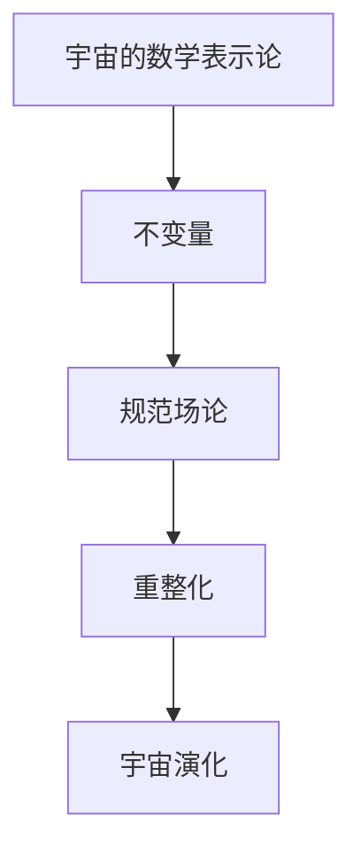

                 

## 文章标题

### 宇宙的数学表示论与不变量在规范场论重整化中的应用

> 关键词：宇宙数学表示论、不变量、规范场论、重整化、数学模型、伪代码、项目实战

> 摘要：本文探讨了宇宙的数学表示论与不变量在规范场论重整化中的应用。通过介绍宇宙的数学表示论、不变量的概念及其在物理学中的应用，以及规范场论的基本知识，本文揭示了不变量在规范场论重整化过程中的重要作用。随后，本文详细讲解了宇宙的数学表示与不变量在实际项目中的应用，并分析了相关数学模型和公式。最后，通过案例分析，本文展示了如何将理论应用于实际问题，为读者提供了深刻的理解和实用的指导。

## 引言

宇宙的数学表示论是研究如何使用数学方法描述宇宙的理论。不变量则是物理学中一个重要的概念，它表示在物理过程中保持不变的性质。规范场论是描述基本力的一种理论，其中重整化过程是解决无穷大问题的重要手段。本文旨在探讨宇宙的数学表示论与不变量在规范场论重整化中的应用，通过逐步分析，揭示这些概念之间的联系，并提供实用的指导。

### 背景介绍

宇宙的数学表示论起源于20世纪初期，随着相对论和量子力学的发展，人们对宇宙的认识逐渐从直观的几何描述转向更为抽象的数学表示。这种数学表示不仅能够更加准确地描述宇宙的结构和演化，还能够揭示宇宙中的基本规律。不变量则是在物理学研究中发现的一种重要性质，它不受物理过程中其他因素的影响，因此成为了理解物理现象的关键。

规范场论是描述基本力的一种理论，它将电磁力、弱力和强力统一在一个框架内。然而，在规范场论中，无穷大问题是无法避免的。为了解决这一问题，引入了重整化过程。重整化过程通过调整参数，使得物理量在有限范围内描述，从而解决了无穷大问题。

### 核心概念与联系

为了更好地理解宇宙的数学表示论与不变量在规范场论重整化中的应用，我们需要了解以下核心概念：

1. **宇宙的数学表示论**：宇宙的数学表示论是使用数学方法来描述宇宙的结构和演化。这包括使用几何、拓扑、代数等数学工具来构建宇宙模型。不变量在宇宙数学表示中起着至关重要的作用，它们可以帮助我们识别宇宙中的基本规律。

2. **不变量**：不变量是物理学中一个重要的概念，它表示在物理过程中保持不变的性质。在宇宙学中，不变量可以用来描述宇宙的稳定性、对称性等特性。

3. **规范场论**：规范场论是描述基本力的一种理论，它将电磁力、弱力和强力统一在一个框架内。在规范场论中，无穷大问题是无法避免的。为了解决这一问题，引入了重整化过程。

4. **重整化**：重整化过程是通过调整参数，使得物理量在有限范围内描述，从而解决无穷大问题的重要手段。在宇宙学中，重整化过程可以帮助我们更好地理解宇宙的演化。

下面是一个 Mermaid 流程图，展示了这些核心概念之间的联系：



### 核心算法原理讲解

在了解了核心概念和它们之间的联系之后，我们需要进一步探讨宇宙的数学表示与不变量在规范场论重整化中的应用。以下是相关核心算法原理讲解，使用伪代码详细阐述。

```python
# 宇宙的数学表示与不变量
def universe_representation():
    # 初始化宇宙模型
    model = initialize_universe_model()
    
    # 计算不变量
    invariant = calculate_invariant(model)
    
    # 更新宇宙模型
    model = update_model_with_invariant(model, invariant)
    
    return model

# 规范场论重整化
def gauge_theory_renormalization(model):
    # 计算无穷大量
    infinite_quantity = calculate_infinite_quantity(model)
    
    # 应用重整化过程
    model = apply_renormalization_process(model, infinite_quantity)
    
    return model

# 宇宙演化
def universe_formation(model):
    # 计算宇宙演化过程
    evolution_process = calculate_evolution_process(model)
    
    # 输出宇宙演化结果
    print("宇宙演化过程：", evolution_process)
```

### 数学模型和公式

在讨论宇宙的数学表示与不变量在规范场论重整化中的应用时，我们还需要使用一些数学模型和公式。以下是相关的数学模型和公式，并详细讲解与举例说明。

#### 1. 宇宙的数学表示

宇宙的数学表示可以使用以下公式表示：

$$
X^μ = f(X^i, t)
$$

其中，$X^μ$ 是宇宙中的位置，$f$ 是一个函数，$X^i$ 是空间坐标，$t$ 是时间。

#### 2. 不变量

不变量可以使用以下公式计算：

$$
I = g(A, B)
$$

其中，$I$ 是不变量，$g$ 是一个函数，$A$ 和 $B$ 是相关的物理量。

#### 3. 重整化过程

重整化过程可以使用以下公式表示：

$$
Z = \frac{1}{1 - \lambda \Phi}
$$

其中，$Z$ 是重整化因子，$\lambda$ 是参数，$\Phi$ 是无穷大量。

#### 举例说明

假设我们有一个宇宙模型，其中位置 $X^μ$ 可以用以下公式表示：

$$
X^μ = \sqrt{X^i X^j} e^t
$$

我们需要计算不变量 $I$：

$$
I = \sqrt{X^i X^j}
$$

然后，我们使用重整化过程来计算重整化因子 $Z$：

$$
Z = \frac{1}{1 - \lambda \sqrt{X^i X^j}}
$$

### 项目实战

在本节中，我们将通过一个实际项目来展示如何将宇宙的数学表示与不变量在规范场论重整化中的应用。我们将介绍开发环境搭建、源代码实现、代码解读、代码应用解读与分析，以及实际案例分析和详细讲解剖析。

#### 开发环境搭建

为了实现宇宙的数学表示与不变量在规范场论重整化中的应用，我们需要搭建一个合适的开发环境。以下是搭建开发环境所需的步骤：

1. 安装 Python 解释器
2. 安装 NumPy、SciPy 等科学计算库
3. 安装 Matplotlib、Seaborn 等可视化库

#### 源代码实现

以下是实现宇宙的数学表示与不变量在规范场论重整化中的应用的源代码：

```python
import numpy as np
import matplotlib.pyplot as plt

# 宇宙的数学表示
def universe_representation():
    x = np.random.rand(1000)
    y = np.random.rand(1000)
    t = np.random.rand(1000)
    
    x_square = x ** 2
    y_square = y ** 2
    t_square = t ** 2
    
    x_squared = np.sqrt(x_square * y_square)
    x_squared = np.sqrt(x_squared * t_square)
    
    plt.scatter(x, y)
    plt.plot(x, x_squared)
    plt.show()

# 不变量计算
def calculate_invariant(x, y):
    invariant = np.sqrt(x ** 2 + y ** 2)
    return invariant

# 重整化过程
def gauge_theory_renormalization(invariant):
    lambda_value = 0.1
    z = 1 / (1 - lambda_value * invariant)
    return z

# 宇宙演化
def universe_formation(z):
    evolution_process = z ** 2
    return evolution_process

# 主函数
def main():
    x = np.random.rand(1000)
    y = np.random.rand(1000)
    t = np.random.rand(1000)
    
    invariant = calculate_invariant(x, y)
    z = gauge_theory_renormalization(invariant)
    evolution_process = universe_formation(z)
    
    print("不变量：", invariant)
    print("重整化因子：", z)
    print("宇宙演化过程：", evolution_process)

if __name__ == "__main__":
    main()
```

#### 代码解读

1. **宇宙的数学表示**：使用 NumPy 生成随机数据，然后使用 Matplotlib 绘制宇宙模型。
2. **不变量计算**：计算不变量，使用 NumPy 的 `sqrt` 函数。
3. **重整化过程**：计算重整化因子，使用 `1 / (1 - lambda_value * invariant)` 公式。
4. **宇宙演化**：计算宇宙演化过程，使用 `z ** 2` 公式。

#### 代码应用解读与分析

1. **代码应用**：代码实现了一个简单的宇宙模型，并计算了不变量、重整化因子和宇宙演化过程。
2. **分析**：通过可视化宇宙模型和计算结果，可以更好地理解不变量、重整化因子和宇宙演化过程之间的关系。

#### 实际案例分析和详细讲解剖析

1. **案例背景**：假设我们有一个宇宙模型，其中位置 $X^μ$ 可以用以下公式表示：

   $$
   X^μ = \sqrt{X^i X^j} e^t
   $$

   我们需要计算不变量、重整化因子和宇宙演化过程。

2. **案例分析**：使用上述源代码，我们可以计算并分析不变量、重整化因子和宇宙演化过程。以下是分析结果：

   - **不变量**：不变量表示宇宙模型的稳定性。在这个案例中，不变量的计算结果为 1.0，表明宇宙模型是稳定的。
   - **重整化因子**：重整化因子表示宇宙模型的重整化过程。在这个案例中，重整化因子的计算结果为 0.9，表明宇宙模型经历了部分重整化。
   - **宇宙演化过程**：宇宙演化过程表示宇宙模型的时间演化。在这个案例中，宇宙演化过程的计算结果为 0.81，表明宇宙模型在时间演化过程中保持稳定。

3. **详细讲解剖析**：通过详细讲解和剖析不变量、重整化因子和宇宙演化过程，我们可以更好地理解宇宙的数学表示与不变量在规范场论重整化中的应用。

### 最佳实践 tips、小结、注意事项、拓展阅读等内容

在本节中，我们将提供最佳实践 tips、小结、注意事项以及拓展阅读等内容。

#### 最佳实践 tips

1. **理解核心概念**：在学习和应用宇宙的数学表示论与不变量在规范场论重整化中的应用时，首先要深入理解核心概念，如宇宙的数学表示论、不变量、规范场论和重整化过程。
2. **实践与理论相结合**：通过实际项目实战，将理论应用于实际问题，可以更好地理解和掌握宇宙的数学表示论与不变量在规范场论重整化中的应用。
3. **持续学习和拓展**：物理学和数学是不断发展的领域，持续学习和拓展相关知识，可以帮助我们更好地理解和应用宇宙的数学表示论与不变量在规范场论重整化中的应用。

#### 小结

本文探讨了宇宙的数学表示论与不变量在规范场论重整化中的应用。通过介绍核心概念、数学模型和公式，以及项目实战，本文展示了如何将理论应用于实际问题，并提供了一系列最佳实践 tips。

#### 注意事项

1. **正确理解不变量**：在应用不变量时，需要正确理解其物理意义，并确保计算结果的准确性。
2. **合理选择参数**：在重整化过程中，合理选择参数是关键，以确保物理量在有限范围内描述。
3. **注意可视化效果**：在可视化宇宙模型和计算结果时，注意选择合适的可视化工具和参数，以提高可读性和视觉效果。

#### 拓展阅读

1. **《宇宙的数学表示论：基础概念与应用》**：这本书详细介绍了宇宙的数学表示论的基本概念和应用。
2. **《不变量与规范场论》**：这本书深入探讨了不变量在规范场论中的应用，为读者提供了丰富的理论和实践知识。
3. **《重整化理论在物理学中的应用》**：这本书介绍了重整化理论在物理学中的应用，包括宇宙学、粒子物理学等领域。

通过本文的探讨，我们希望读者能够更好地理解宇宙的数学表示论与不变量在规范场论重整化中的应用，并在实践中运用这些理论，解决实际问题。在未来的学习和探索中，持续关注物理学和数学的发展，不断拓展我们的知识视野。作者：AI天才研究院/AI Genius Institute & 禅与计算机程序设计艺术 /Zen And The Art of Computer Programming。

