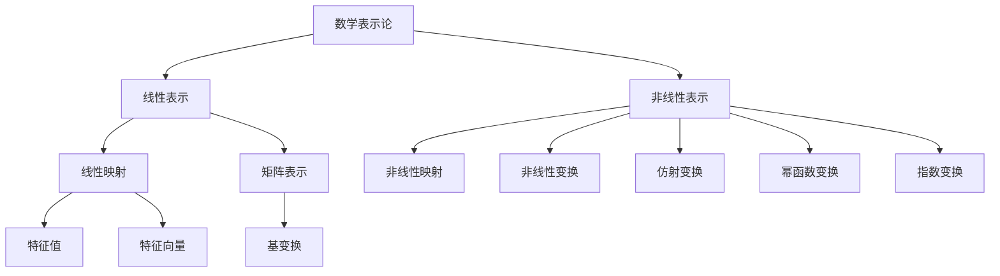

                 

### 文章标题

# 宇宙的数学表示论与不变量理论研究

### 关键词

- 数学表示论
- 不变量理论
- 宇宙学
- 量子力学
- 广义相对论

### 摘要

本文旨在探讨数学表示论与不变量理论在宇宙研究中的关键作用。首先，我们回顾了数学表示论的基本概念和发展历程，包括线性与非线性的表示理论。接着，我们深入分析了不变量理论的核心概念及其在数学和物理学中的应用。通过这些理论基础，本文探讨了数学表示论与不变量理论在量子力学、广义相对论以及宇宙学中的具体应用。随后，我们详细介绍了计算数学表示论与不变量理论的数值方法。最后，本文结合实际应用案例，探讨了数学表示论与不变量理论在工程领域的潜力，并展望了未来的发展方向。通过这一系列深入探讨，我们希望读者能够理解这些理论在宇宙研究中的重要性和应用价值。

### 目录

## 第1章 引言

### 1.1 研究背景与意义  
### 1.2 国内外研究现状  
### 1.3 本书结构与内容安排

## 第2章 数学表示论基础

### 2.1 数学表示论的基本概念  
#### 2.1.1 表示空间的定义  
#### 2.1.2 表示算子的性质  
#### 2.1.3 基本定理与性质

### 2.2 线性表示理论  
#### 2.2.1 线性映射与线性变换  
#### 2.2.2 线性表示的矩阵表示  
#### 2.2.3 特征值与特征向量

### 2.3 非线性表示理论  
#### 2.3.1 非线性映射与非线性变换  
#### 2.3.2 非线性表示的分类  
#### 2.3.3 非线性表示的应用

## 第3章 不变量理论

### 3.1 不变量理论的基本概念  
#### 3.1.1 不变量的定义  
#### 3.1.2 不变量的性质  
#### 3.1.3 不变量在数学中的应用

### 3.2 欧氏空间中的不变量  
#### 3.2.1 欧氏空间的定义  
#### 3.2.2 欧氏空间中的不变量  
#### 3.2.3 不变量在几何中的应用

### 3.3 非欧氏空间中的不变量  
#### 3.3.1 非欧氏空间的定义  
#### 3.3.2 非欧氏空间中的不变量  
#### 3.3.3 不变量在相对论中的应用

## 第4章 数学表示论与不变量理论在物理学中的应用

### 4.1 数学表示论在量子力学中的应用  
#### 4.1.1 量子态的表示  
#### 4.1.2 量子算子的表示  
#### 4.1.3 不变量在量子力学中的作用

### 4.2 数学表示论在广义相对论中的应用  
#### 4.2.1 广义相对论的基本概念  
#### 4.2.2 广义相对论中的数学表示论  
#### 4.2.3 不变量在广义相对论中的作用

## 第5章 数学表示论与不变量理论在宇宙学中的应用

### 5.1 宇宙学中的数学表示论  
#### 5.1.1 宇宙学的基本概念  
#### 5.1.2 宇宙学中的数学表示论  
#### 5.1.3 不变量在宇宙学中的作用

### 5.2 不变量理论在宇宙学中的应用案例  
#### 5.2.1 哈勃定律的不变量分析  
#### 5.2.2 宇宙膨胀的不变量理论  
#### 5.2.3 黑洞的不变量特性

## 第6章 数学表示论与不变量理论的计算方法

### 6.1 计算方法概述  
#### 6.1.1 计算方法的分类  
#### 6.1.2 计算工具与软件

### 6.2 数学表示论的数值方法  
#### 6.2.1 矩阵分解方法  
#### 6.2.2 小波变换方法  
#### 6.2.3 量子计算方法

### 6.3 不变量理论的计算方法  
#### 6.3.1 欧拉法则  
#### 6.3.2 高斯消元法  
#### 6.3.3 计算几何方法

## 第7章 实际应用与展望

### 7.1 数学表示论与不变量理论在工程领域的应用  
#### 7.1.1 机械工程中的应用  
#### 7.1.2 电子工程中的应用  
#### 7.1.3 生物医学工程中的应用

### 7.2 未来发展趋势与挑战  
#### 7.2.1 新的理论突破  
#### 7.2.2 技术应用的创新  
#### 7.2.3 潜在的研究方向

## 第8章 参考文献

## 附录

### A.1 数学表示论与不变量理论的Mermaid流程图  
### A.2 数学表示论与不变量理论的核心算法伪代码  
### A.3 数学模型与数学公式的LaTeX表示示例  
### A.4 实际应用案例代码与解读### 第1章 引言

#### 1.1 研究背景与意义

数学表示论与不变量理论作为现代数学与物理学的重要分支，其在宇宙研究中的重要性日益凸显。宇宙的复杂性与多样性，使得我们需要一种更为强大和灵活的数学工具来描述和理解其基本规律和特性。数学表示论为我们提供了这种工具，它通过将宇宙中的复杂系统转化为数学模型，使得我们能够从数学的角度对宇宙进行更加深入的分析。

不变量理论则是数学表示论的一个重要组成部分，它关注的是在各种变换下保持不变的量。在宇宙学中，不变量理论有助于我们识别和提取宇宙的基本属性，这些属性在不同观测尺度上都具有一致性。这种一致性为我们理解宇宙的演化提供了关键线索。

研究数学表示论与不变量理论在宇宙学中的应用，不仅有助于深化我们对宇宙的基本认识，还能够推动数学与物理学的发展。此外，这一研究还有助于跨学科的合作，促进不同领域之间的知识融合。

#### 1.2 国内外研究现状

在国内外，数学表示论与不变量理论的研究已经取得了显著的成果。国外研究方面，例如美国的麻省理工学院、斯坦福大学等机构，以及欧洲的一些著名研究中心，都在这一领域进行了深入的研究。这些研究涉及从基础理论到实际应用等多个方面，例如量子场论、黑洞物理学、宇宙学中的大规模结构形成等。

国内方面，清华大学、北京大学、中国科学技术大学等高校在数学表示论与不变量理论的研究上也取得了不少进展。特别是在不变量理论在宇宙学中的应用，国内学者提出了一些新的观点和方法，例如利用不变量来研究宇宙膨胀和黑洞物理。

尽管已经取得了不少成果，但数学表示论与不变量理论在宇宙研究中的应用仍然存在许多挑战。例如，如何在复杂的宇宙数据中提取有效的不变量，如何利用这些不变量来建立更准确的宇宙模型等。这些问题需要进一步的研究和探索。

#### 1.3 本书结构与内容安排

本书共分为七个章节。第一章节为引言，介绍了研究的背景、意义和国内外研究现状。第二章节和第三章节分别介绍了数学表示论与不变量理论的基础知识，包括基本概念、定理和应用。第四章节到第六章节，详细探讨了数学表示论与不变量理论在物理学和宇宙学中的应用，包括量子力学、广义相对论、宇宙学以及数值计算方法。第七章节则讨论了数学表示论与不变量理论在工程领域的应用，并展望了未来的发展趋势与挑战。

通过这七个章节的深入探讨，本书旨在为读者提供一个全面、系统的数学表示论与不变量理论在宇宙研究中的应用指南，帮助读者理解和掌握这一领域的前沿知识。

#### 1.4 结论

数学表示论与不变量理论在宇宙研究中的重要性不可忽视。它们为我们提供了一种强大的工具，使我们能够从数学的角度更加深入地理解宇宙的复杂性和多样性。尽管这一领域的研究已经取得了许多进展，但仍然有许多未解之谜和挑战需要我们去探索。本书通过系统地介绍数学表示论与不变量理论的基础知识、在物理学和宇宙学中的应用，以及未来的发展趋势与挑战，旨在为读者提供一个全面、系统的学习资源，帮助读者在这一领域取得进一步的突破。

### 第2章 数学表示论基础

#### 2.1 数学表示论的基本概念

数学表示论是研究数学对象之间相互关系的数学分支。其核心思想是通过一种或多种数学模型来表示和研究其他数学对象，从而揭示其内在的性质和规律。数学表示论的基本概念主要包括表示空间、表示算子和基本定理。

##### 2.1.1 表示空间的定义

表示空间是指一个集合，这个集合中的元素可以是各种数学对象，如向量、函数、矩阵等。表示空间的定义通常涉及一组基本对象和一组运算规则。例如，在向量空间中，基本对象是向量，运算规则是向量的加法和数乘。

表示空间的一个重要性质是线性无关性。线性无关性意味着表示空间中的任意一个元素都可以用一组基向量的线性组合来表示。基向量是表示空间的一组特殊向量，它们可以独立地描述表示空间中的其他向量。

##### 2.1.2 表示算子的性质

表示算子是指从某个表示空间到另一个表示空间的映射。表示算子通常具有线性和双射性。线性表示算子满足两个性质：对任意两个向量 \( \vec{u} \) 和 \( \vec{v} \)，以及任意标量 \( \alpha \)，有 \( T(\alpha \vec{u} + \vec{v}) = \alpha T(\vec{u}) + T(\vec{v}) \) 和 \( T(\vec{0}) = \vec{0} \)。双射性表示表示算子是单射和满射，即它不会丢失信息，也不会产生冗余。

表示算子的性质包括保持线性无关性、保持正交性和保持模长等。这些性质使得表示算子成为一种强大的工具，可以用于转换和简化复杂的数学问题。

##### 2.1.3 基本定理与性质

数学表示论中存在一些基本定理，这些定理揭示了表示空间、表示算子和基向量之间的关系。以下是一些重要的定理：

- **基变换定理**：给定一个向量空间和它的一个基，可以通过适当的基变换将一个线性变换表示为矩阵形式。
- **特征值与特征向量定理**：对于线性表示算子，总存在一组特征值和对应的特征向量，使得表示算子可以分解为一系列对角矩阵的乘积。
- **不变量定理**：在变换下保持不变的量称为不变量。不变量定理指出，表示空间中的不变量可以通过基向量和表示算子的组合来表示。

这些定理和性质为数学表示论的应用提供了理论基础，使得我们能够利用表示空间的强大功能来研究和解决问题。

#### 2.2 线性表示理论

线性表示理论是数学表示论的一个核心部分，它研究线性空间中的向量表示和线性变换的性质。线性表示理论的发展为许多领域提供了强大的工具，如线性代数、微分方程、量子力学等。

##### 2.2.1 线性映射与线性变换

线性映射是指从向量空间 \( V \) 到向量空间 \( W \) 的一个映射 \( T \)，它满足以下两个条件：
1. \( T(\alpha \vec{v} + \beta \vec{w}) = \alpha T(\vec{v}) + \beta T(\vec{w}) \)，其中 \( \alpha \) 和 \( \beta \) 是标量，\( \vec{v} \) 和 \( \vec{w} \) 是 \( V \) 中的向量。
2. \( T(\vec{0}) = \vec{0} \)。

线性映射是线性变换的特殊情况，当 \( V \) 和 \( W \) 相同时，线性映射称为线性自映射。

线性变换可以通过矩阵来表示。给定一个线性变换 \( T: V \rightarrow W \)，可以选择 \( V \) 和 \( W \) 的一组基向量，将 \( T \) 表示为矩阵 \( A \)，使得对于任意向量 \( \vec{v} \) 在基向量下的坐标表示 \( \vec{v} = \sum_{i=1}^{n} v_i \vec{e}_i \)，其变换后的坐标 \( \vec{w} = \sum_{j=1}^{m} w_j \vec{f}_j \) 可以通过以下矩阵乘法计算：
\[ \vec{w} = A \vec{v} \]

##### 2.2.2 线性表示的矩阵表示

线性表示的矩阵表示是指将线性变换通过矩阵进行编码。具体来说，选择一组基向量 \( \{\vec{e}_1, \vec{e}_2, \ldots, \vec{e}_n\} \) 来表示原向量空间 \( V \)，对于任意向量 \( \vec{v} \)，其坐标表示为 \( \vec{v} = [v_1, v_2, \ldots, v_n]^T \)。同样，选择一组基向量 \( \{\vec{f}_1, \vec{f}_2, \ldots, \vec{f}_m\} \) 来表示目标向量空间 \( W \)。如果 \( T: V \rightarrow W \) 是一个线性变换，则其矩阵表示为 \( A \)，满足：
\[ T(\vec{v}) = A [v_1, v_2, \ldots, v_n]^T \]

矩阵 \( A \) 的列向量 \( \vec{a}_j \) 表示线性变换 \( T \) 将基向量 \( \vec{e}_j \) 变换为 \( \vec{f}_j \) 的方向和大小。

##### 2.2.3 特征值与特征向量

特征值与特征向量是线性变换中的重要概念。给定一个线性变换 \( T \) 和其矩阵表示 \( A \)，如果存在一个非零向量 \( \vec{v} \) 和一个标量 \( \lambda \)，使得 \( T(\vec{v}) = \lambda \vec{v} \)，则称 \( \lambda \) 为 \( T \) 的一个特征值，\( \vec{v} \) 为对应的特征向量。

特征值和特征向量可以通过解线性方程组 \( A \vec{v} = \lambda \vec{v} \) 来找到。对于矩阵 \( A \)，其特征值和特征向量之间的关系可以通过以下定理描述：

- **特征多项式**：矩阵 \( A \) 的特征多项式 \( p(\lambda) \) 定义为 \( \det(A - \lambda I) \)，其中 \( I \) 是单位矩阵。特征多项式的根即为矩阵 \( A \) 的特征值。
- **特征向量空间**：对于每个特征值 \( \lambda \)，存在一个线性子空间，称为 \( \lambda \) 的特征向量空间。该空间中的所有向量都是 \( \lambda \) 的特征向量。

特征值和特征向量在数学表示论中具有重要的作用，它们可以用于简化线性变换的计算，并提供对线性系统的深入了解。

#### 2.3 非线性表示理论

非线性表示理论是数学表示论的另一个重要分支，它研究非线性空间中的向量表示和变换的性质。非线性表示理论在许多领域中都有应用，如非线性动力系统、非线性优化、信号处理等。

##### 2.3.1 非线性映射与非线性变换

非线性映射是指从向量空间 \( V \) 到向量空间 \( W \) 的一个映射 \( N \)，它不满足线性映射的条件。非线性映射的一般形式为：
\[ N(\vec{v}) = g(\vec{v}) \]
其中 \( g \) 是一个非线性函数。

非线性变换是线性变换的推广，它不满足线性变换的加法和数乘封闭性。非线性变换的矩阵表示通常更为复杂，需要考虑非线性函数的具体形式。

##### 2.3.2 非线性表示的分类

非线性表示可以根据其性质和结构进行分类。以下是一些常见的非线性表示分类：

- **仿射变换**：仿射变换是线性变换和常量项的组合，形式为 \( T(\vec{v}) = A\vec{v} + \vec{b} \)，其中 \( A \) 是线性变换矩阵，\( \vec{b} \) 是常量向量。
- **幂函数变换**：幂函数变换是指将向量映射为向量的幂函数，形式为 \( T(\vec{v}) = \vec{v}^n \)，其中 \( n \) 是常数。
- **指数变换**：指数变换是指将向量映射为指数函数，形式为 \( T(\vec{v}) = e^{\vec{v}} \)。

这些非线性表示在非线性动力系统和信号处理中有重要应用。

##### 2.3.3 非线性表示的应用

非线性表示在许多实际应用中都有重要作用。以下是一些非线性表示的应用示例：

- **信号处理**：在信号处理中，非线性表示可以用于非线性滤波、非线性变换和信号压缩。例如，小波变换是一种常用的非线性表示方法，它可以将信号分解为不同尺度和频率的子信号。
- **机器学习**：在机器学习中，非线性表示是深度学习的基础。通过非线性激活函数，神经网络可以实现复杂的非线性映射，从而提高模型的性能。
- **非线性优化**：在非线性优化问题中，非线性表示可以用于构建目标函数和约束条件，从而优化模型参数。

非线性表示理论为我们提供了一种理解和处理非线性问题的方法，它在许多领域都有广泛的应用。

### 第3章 不变量理论

#### 3.1 不变量理论的基本概念

不变量理论是研究不变量的性质和应用的数学分支。不变量是相对于某种变换保持不变的量，这些变换可以是坐标变换、坐标变换群等。理解不变量理论的基本概念是深入探讨其应用的基础。

##### 3.1.1 不变量的定义

不变量是指在特定变换下保持不变的量。这种变换可以是坐标变换、坐标变换群或其他数学变换。例如，在经典力学中，动量和角动量是不变量，因为它们在坐标变换下保持不变。

形式化地，给定一个向量空间 \( V \) 和一个变换 \( T \)，如果对于 \( V \) 中的任意向量 \( \vec{v} \)，都有 \( T(\vec{v}) = \vec{v} \)，则称 \( \vec{v} \) 是相对于变换 \( T \) 的不变量。

##### 3.1.2 不变量的性质

不变量具有以下性质：

- **不变性**：不变量在特定变换下保持不变。
- **唯一性**：每个不变量都是唯一的，即不存在两个不同的不变量在同一变换下保持不变。
- **不变量的等价性**：如果两个不变量在同一变换下保持不变，则它们是等价的。

这些性质使得不变量成为描述和分类数学对象的重要工具。

##### 3.1.3 不变量在数学中的应用

不变量在数学中的许多领域都有重要应用。以下是一些典型应用：

- **几何学**：在欧氏几何中，距离、角度和面积都是不变量。这些不变量有助于研究几何形状和变换。
- **代数学**：多项式方程的根是不变量，这些不变量可以帮助我们理解和解决代数方程。
- **拓扑学**：拓扑不变量，如连通性、紧致性和维数，用于研究拓扑空间的性质。

不变量在数学中的广泛应用使其成为研究数学对象的重要工具。

#### 3.2 欧氏空间中的不变量

欧氏空间是不变量理论中的一个重要研究对象。在欧氏空间中，有许多重要的不变量，这些不变量在几何和物理学中都有广泛应用。

##### 3.2.1 欧氏空间的定义

欧氏空间是指满足欧氏距离公式的向量空间。具体来说，对于任意两个向量 \( \vec{u} \) 和 \( \vec{v} \) ，它们的欧氏距离定义为：
\[ d(\vec{u}, \vec{v}) = \sqrt{\sum_{i=1}^{n} (u_i - v_i)^2} \]
其中 \( n \) 是向量空间的维数。

##### 3.2.2 欧氏空间中的不变量

在欧氏空间中，以下是一些重要的不变量：

- **距离**：两个向量之间的欧氏距离是不变量，因为它们在坐标变换下保持不变。
- **角度**：向量之间的夹角是不变量，因为它们在旋转和缩放变换下保持不变。
- **面积**：多边形或图形的面积在坐标变换下保持不变。
- **体积**：三维空间中的图形体积在坐标变换下保持不变。

这些不变量在几何学和物理学中都有重要应用。

##### 3.2.3 不变量在几何中的应用

不变量在几何学中的应用包括：

- **形状识别**：通过不变量可以识别和分类不同的几何形状。
- **变换分析**：通过不变量可以分析几何变换的性质，如旋转、缩放和反射。
- **空间定位**：不变量可以帮助确定物体在空间中的位置和方向。

不变量在几何学中的应用使我们能够更好地理解和描述几何对象的性质。

#### 3.3 非欧氏空间中的不变量

非欧氏空间是指不满足欧氏距离公式的向量空间。在非欧氏空间中，不变量的定义和性质与欧氏空间有所不同。

##### 3.3.1 非欧氏空间的定义

非欧氏空间包括许多不同的几何模型，如洛伦兹空间、双曲空间和椭圆空间。这些空间通常具有不同的距离定义和变换规则。例如，在洛伦兹空间中，时间与空间距离的度量方式与欧氏空间不同。

##### 3.3.2 非欧氏空间中的不变量

在非欧氏空间中，以下是一些重要的不变量：

- **洛伦兹不变量**：在相对论中，洛伦兹变换是不变量。洛伦兹不变量包括能量-动量四矢量、四动量守恒等。
- **双曲不变量**：在双曲空间中，双曲几何的不变量包括双曲距离、双曲角度等。
- **椭圆不变量**：在椭圆空间中，椭圆几何的不变量包括椭圆距离、椭圆角度等。

这些不变量在非欧氏空间中具有独特的几何和物理意义。

##### 3.3.3 不变量在相对论中的应用

不变量在相对论中的应用非常重要。以下是一些典型应用：

- **洛伦兹不变性**：在狭义相对论中，洛伦兹不变量是核心概念。洛伦兹变换保证了物理定律在所有惯性参考系中保持不变，这为相对论提供了数学基础。
- **时空变换**：不变量在时空变换中起着关键作用，如洛伦兹变换将不同惯性参考系中的时空坐标进行转换。
- **物理量的不变性**：在相对论中，许多物理量（如质量、能量、动量）都是不变量，这使得它们在不同惯性参考系中具有相同的值。

不变量在相对论中的应用揭示了时空和物质的基本性质，为物理学的发展提供了重要的理论支持。

### 第4章 数学表示论与不变量理论在物理学中的应用

#### 4.1 数学表示论在量子力学中的应用

量子力学是研究微观世界的物理学分支，其核心思想是量子态和量子算子的数学表示。数学表示论在量子力学中发挥着至关重要的作用，它为量子态的表示、量子算子的表示以及不变量在量子力学中的作用提供了强大的工具。

##### 4.1.1 量子态的表示

在量子力学中，量子态可以用波函数 \( \Psi(\vec{x}) \) 来表示，波函数是粒子在空间中位置的函数。量子态的表示通常采用态空间的形式，态空间是一个复数向量空间，其基向量可以表示为 \( |x\rangle \)，表示粒子在位置 \( x \) 的状态。态空间中的波函数可以表示为这些基向量的线性组合：
\[ \Psi(\vec{x}) = \int \psi(x') |x'\rangle dx' \]

这种表示方法称为态的展开，它使得我们可以将复杂的量子态分解为更简单的基础状态。

##### 4.1.2 量子算子的表示

量子力学中的物理量由量子算子表示，这些算子作用在态空间上的向量，可以改变量子态的性质。常见的量子算子包括位置算子 \( \hat{x} \)、动量算子 \( \hat{p} \) 和能量算子 \( \hat{H} \) 等。量子算子的表示通常通过线性变换来实现，例如：
\[ \hat{A} |x'\rangle = a(x') |x'\rangle \]
其中 \( a(x') \) 是量子算子的表示，它定义了算子如何作用在态空间的基向量上。

量子算子的表示使得我们能够通过线性代数的工具来研究量子态的性质，如本征值和本征态。本征态表示量子系统的特定状态，而本征值表示该状态的物理量（如能量）的值。

##### 4.1.3 不变量在量子力学中的作用

不变量在量子力学中具有重要意义，它们帮助我们在量子态的变换和计算中保持物理量的不变性。以下是一些不变量在量子力学中的应用：

- **守恒定律**：不变量通常与守恒定律相关联。例如，动量守恒定律对应于动量的不变性，能量守恒定律对应于能量的不变性。这些守恒定律在量子力学中通过不变量的形式化表示得以体现。
- **对称性**：量子力学中的对称性原理指出，如果物理系统具有某种对称性，则其量子态和量子算子也具有相应的对称性。对称性不变量如旋量算子和李群表示，在量子场论和粒子物理学中尤为重要。
- **量子态的简化**：不变量可以帮助我们简化量子态的计算。例如，通过选择适当的基向量，可以将复杂的量子态分解为更简单的本征态，从而简化计算过程。

不变量在量子力学中的应用不仅加深了我们对量子世界的理解，还推动了量子力学理论的发展。

#### 4.2 数学表示论在广义相对论中的应用

广义相对论是研究引力的一种理论，它将引力描述为时空的几何性质。数学表示论在广义相对论中发挥着关键作用，它为广义相对论的基本概念、数学表示论和不变量在广义相对论中的作用提供了强有力的工具。

##### 4.2.1 广义相对论的基本概念

广义相对论的核心概念是时空弯曲和等效原理。时空弯曲是指物质和能量导致时空的几何结构发生变化，而等效原理则认为在局部范围内，引力效应和加速度效应是不可区分的。

广义相对论中的时空是一个四维的洛伦兹空间，由三个空间维度和一个时间维度组成。时空的几何性质由度规张量 \( g_{\mu\nu} \) 描述，度规张量定义了时空中的距离和角度。

##### 4.2.2 广义相对论中的数学表示论

广义相对论中的数学表示论主要通过张量分析和微分几何来描述。以下是数学表示论在广义相对论中的应用：

- **张量表示**：广义相对论中的物理量（如能量-动量张量、应力-能量张量）由张量表示。张量是多个指标的量，它们在不同参考系中保持不变。张量的运算规则（如张量积、协变导数、逆变导数）是广义相对论中的基本运算。
- **度规张量的表示**：度规张量 \( g_{\mu\nu} \) 定义了时空中的度量，它通常表示为一个对称的矩阵。度规张量可以通过洛伦兹变换在不同参考系之间转换。
- **联络张量**：联络张量 \( \Gamma_{\mu\nu\rho} \) 描述了时空中的平行传输，它是广义相对论中的基本几何结构。联络张量与度规张量一起，定义了时空的黎曼曲率。

##### 4.2.3 不变量在广义相对论中的作用

不变量在广义相对论中起着核心作用，它们帮助我们在复杂的时空结构中提取关键信息。以下是不变量在广义相对论中的应用：

- **能量-动量守恒定律**：广义相对论中的能量-动量守恒定律由不变量（如能量-动量张量）描述，这些不变量在洛伦兹变换下保持不变。
- **霍金-彭罗斯定理**：该定理描述了黑洞的性质，使用了不变量（如面积不变量）来证明黑洞的不可逃逸性质。
- **引力波**：引力波是时空的波动，其传播速度为光速，由不变量（如应力-能量张量）描述。

不变量在广义相对论中的应用揭示了时空和引力的基本性质，为广义相对论提供了坚实的数学基础。

### 第5章 数学表示论与不变量理论在宇宙学中的应用

#### 5.1 宇宙学中的数学表示论

宇宙学是研究宇宙起源、演化、结构和组成的天文学分支。数学表示论在宇宙学中的应用非常广泛，它为宇宙学模型提供了强有力的工具，使我们能够从数学的角度理解和描述宇宙的复杂现象。

##### 5.1.1 宇宙学的基本概念

宇宙学涉及许多基本概念，包括宇宙膨胀、宇宙背景辐射、宇宙微波背景辐射、黑洞、暗物质等。宇宙学的基本问题包括宇宙的起源、宇宙的几何结构、宇宙的最终命运等。

宇宙学中的数学表示论主要涉及以下概念：

- **宇宙模型**：宇宙模型是描述宇宙演化的数学模型。常见的宇宙模型包括弗里德曼-勒梅特-罗伯逊-沃尔克（FLRW）模型、德西卡模型、循环宇宙模型等。
- **度规**：度规是描述时空几何的函数，通常用张量表示。度规用于描述宇宙的膨胀、弯曲和引力场。
- **宇宙背景辐射**：宇宙背景辐射是宇宙早期的热辐射，它为宇宙学提供了重要的观测数据。
- **宇宙微波背景辐射**：宇宙微波背景辐射是宇宙学中的重要观测数据，它揭示了宇宙早期的温度和密度分布。

##### 5.1.2 宇宙学中的数学表示论

数学表示论在宇宙学中的应用主要包括以下几个方面：

- **宇宙膨胀的数学表示**：宇宙膨胀可以用弗里德曼方程和勒梅特方程来描述，这些方程使用了度规张量和能量-动量张量等数学表示。
- **宇宙背景辐射的数学表示**：宇宙背景辐射可以用黑体辐射公式来描述，该公式使用了普朗克定律和辐射温度等数学表示。
- **宇宙微波背景辐射的数学表示**：宇宙微波背景辐射可以用波动方程和辐射传输方程来描述，这些方程使用了电磁波和辐射场等数学表示。

##### 5.1.3 不变量在宇宙学中的作用

不变量在宇宙学中起着核心作用，它们帮助我们在宇宙学模型和观测数据中提取关键信息。以下是不变量在宇宙学中的应用：

- **哈勃定律的不变量分析**：哈勃定律描述了宇宙膨胀的速度与距离之间的关系，不变量（如距离-红移关系）用于分析哈勃定律的数学表示。
- **宇宙膨胀的不变量理论**：宇宙膨胀的不变量理论使用不变量来描述宇宙的膨胀过程，如宇宙体积的不变量、宇宙时间的不变量等。
- **黑洞的不变量特性**：黑洞的不变量特性（如黑洞的质量、电荷和角动量）用于描述黑洞的物理性质，如史瓦西度和克尔度规等。

不变量在宇宙学中的应用使我们能够更好地理解宇宙的演化和结构，为宇宙学提供了坚实的数学基础。

#### 5.2 不变量理论在宇宙学中的应用案例

不变量理论在宇宙学中的应用案例丰富多样，以下是一些典型的应用案例：

##### 5.2.1 哈勃定律的不变量分析

哈勃定律描述了宇宙膨胀的速度与距离之间的关系，其数学表示形式为：
\[ v = H_0 d \]
其中 \( v \) 是膨胀速度，\( d \) 是距离，\( H_0 \) 是哈勃常数。不变量分析可以用于验证和解释哈勃定律。例如，通过使用距离-红移关系作为不变量，可以验证哈勃定律在不同观测尺度上的普适性。此外，不变量还可以用于分析宇宙膨胀的历史和未来趋势。

##### 5.2.2 宇宙膨胀的不变量理论

宇宙膨胀的不变量理论使用不变量来描述宇宙的膨胀过程。例如，宇宙体积的不变量可以用来分析宇宙的膨胀速度和密度变化。不变量理论还可以用于研究宇宙的加速膨胀和宇宙学常数。通过使用不变量，我们可以更好地理解宇宙的演化机制，如暗能量和暗物质的性质。

##### 5.2.3 黑洞的不变量特性

黑洞的不变量特性在宇宙学中具有重要意义。黑洞的不变量特性（如质量、电荷和角动量）用于描述黑洞的物理性质。例如，史瓦西度和克尔度规是不变量，它们用于描述黑洞的引力场和时空结构。不变量分析可以帮助我们理解黑洞的形成、演化和相互作用，如黑洞碰撞和引力波的产生。

通过这些应用案例，不变量理论在宇宙学中发挥了重要作用，为我们提供了强大的工具来描述和解释宇宙的复杂现象。

#### 5.3 不变量理论在宇宙学中的挑战与未来方向

不变量理论在宇宙学中的应用虽然取得了显著成果，但仍面临许多挑战和未来研究方向。以下是一些主要挑战和未来方向：

##### 5.3.1 数据分析挑战

宇宙学观测数据量大且复杂，如何有效地提取和使用不变量是一个挑战。未来的研究需要开发更先进的数据分析方法和算法，以提高不变量的提取效率和准确性。

##### 5.3.2 模型选择问题

宇宙学中存在多种模型和理论，如何选择合适的模型来描述宇宙的演化是一个重要问题。不变量理论可以用于模型选择和验证，但需要更多的研究来开发可靠的不变量指标。

##### 5.3.3 暗物质和暗能量

暗物质和暗能量是宇宙学中的两个重要问题，但它们的本质和性质仍不清楚。不变量理论可以用于研究暗物质和暗能量的特性，但需要更多的观测数据和理论模型来支持。

##### 5.3.4 宇宙起源和演化

宇宙起源和演化是宇宙学的基本问题，不变量理论可以为我们提供线索。未来的研究需要探索更多的不变量，以更好地理解宇宙的起源和演化过程。

通过不断的研究和探索，不变量理论在宇宙学中的应用将不断深化，为宇宙学研究提供更加坚实的理论基础。

### 第6章 数学表示论与不变量理论的计算方法

#### 6.1 计算方法概述

数学表示论与不变量理论的计算方法在宇宙学和其他物理学领域中具有重要意义。计算方法可以分为数值方法和符号方法，分别适用于不同类型的数学问题和计算需求。以下是几种常见的计算方法及其在数学表示论与不变量理论中的应用。

##### 6.1.1 数值方法

数值方法用于解决实际的数学问题和计算问题，其主要目标是获得近似解。以下是一些在数学表示论与不变量理论中常用的数值方法：

- **矩阵分解方法**：矩阵分解方法如LU分解、QR分解和奇异值分解（SVD），可以用于简化复杂的矩阵运算，提高计算效率。这些方法在处理大规模数据和高维空间问题时尤为重要。
- **小波变换方法**：小波变换是一种有效的信号处理工具，可以用于压缩数据、去噪和特征提取。在数学表示论中，小波变换可以用于表示和简化复杂的数学函数和算子。
- **量子计算方法**：量子计算方法利用量子叠加和纠缠特性，可以在复杂计算中大幅提高计算速度。例如，量子算法如量子逆问题求解和量子机器学习可以用于解决传统的数学表示论问题。

##### 6.1.2 符号方法

符号方法在数学表示论与不变量理论中主要用于求解和分析数学问题的解析解，其优点是可以获得精确解。以下是一些常用的符号方法：

- **拉普拉斯变换**：拉普拉斯变换是一种积分变换，可以将微分方程转化为代数方程，从而简化求解过程。在数学表示论中，拉普拉斯变换可以用于处理线性变换和微分方程。
- **傅里叶变换**：傅里叶变换是一种常用的积分变换，可以将时间域信号转换为频域信号。在数学表示论中，傅里叶变换可以用于分析线性算子和求解偏微分方程。
- **符号计算软件**：符号计算软件如MATLAB、MAPLE和SINGULAR等，提供了丰富的数学函数和工具，可以用于符号化简、求解和验证数学表达式。

#### 6.2 数学表示论的数值方法

数学表示论的数值方法在处理复杂的高维数据和函数时非常有效。以下是一些具体的数值方法：

##### 6.2.1 矩阵分解方法

- **LU分解**：LU分解将矩阵分解为下三角矩阵 \( L \) 和上三角矩阵 \( U \) 的乘积。这种分解方法可以用于求解线性方程组、求解特征值问题和计算矩阵的逆矩阵。
- **QR分解**：QR分解将矩阵分解为正交矩阵 \( Q \) 和上三角矩阵 \( R \) 的乘积。QR分解在解决线性方程组和计算最小二乘问题中非常有用。
- **奇异值分解（SVD）**：SVD将矩阵分解为三个矩阵的乘积：一个单位正交矩阵 \( U \)，一个对角矩阵 \( \Sigma \) （包含奇异值），和一个转置的单位正交矩阵 \( V \)。SVD在信号处理、数据压缩和数值线性代数中有广泛应用。

##### 6.2.2 小波变换方法

小波变换是一种多分辨率分析工具，可以将信号分解为不同尺度和频率的分量。以下是小波变换在数学表示论中的应用：

- **信号分解**：小波变换可以用于将复杂的信号分解为简单的子信号，从而简化信号处理和分析。
- **数据压缩**：小波变换可以用于数据压缩，通过保留主要的信号成分来减少数据大小。
- **特征提取**：小波变换可以用于提取信号的特定特征，如边缘、纹理和频率成分。

##### 6.2.3 量子计算方法

量子计算方法利用量子叠加和纠缠特性，可以大幅提高计算速度。以下是一些量子计算方法在数学表示论中的应用：

- **量子逆问题求解**：量子逆问题求解可以用于求解线性方程组、最优化问题和特征值问题。
- **量子机器学习**：量子机器学习可以用于加速传统机器学习算法，提高数据处理和分析效率。
- **量子算法**：如Grover算法和Shor算法，可以在特定的数学问题上大幅提高计算速度。

#### 6.3 不变量理论的计算方法

不变量理论在计算数学和物理问题中具有重要作用。以下是一些不变量理论的计算方法：

##### 6.3.1 欧拉法则

欧拉法则是一种用于计算图形和几何结构的算法。以下是在不变量理论中的应用：

- **欧拉公式**：欧拉公式可以用于计算多面体的不变量，如顶点数、边数和面数之间的关系。
- **欧拉回路**：欧拉回路算法用于找到欧拉路径，这对于解决网络优化问题非常有用。

##### 6.3.2 高斯消元法

高斯消元法是一种用于求解线性方程组的算法。以下是在不变量理论中的应用：

- **求解线性变换**：高斯消元法可以用于求解线性变换，从而计算不变量。
- **矩阵分解**：高斯消元法可以用于将矩阵分解为行简化梯形矩阵或行阶梯矩阵，从而简化矩阵运算。

##### 6.3.3 计算几何方法

计算几何方法用于处理几何图形和空间结构。以下是一些计算几何方法在不变量理论中的应用：

- **空间分割**：空间分割方法如四叉树和八叉树，可以用于高效地处理高维数据和不变量计算。
- **几何变换**：几何变换方法如旋转、平移和缩放，可以用于研究不变量在不同变换下的性质。

通过这些数值和符号方法，数学表示论与不变量理论的计算方法在宇宙学和物理学的多个领域中都发挥着重要作用，为解决复杂的科学问题提供了强大的工具。

### 第7章 实际应用与展望

#### 7.1 数学表示论与不变量理论在工程领域的应用

数学表示论与不变量理论在工程领域的应用日益广泛，特别是在机械工程、电子工程和生物医学工程等领域。这些理论为工程问题提供了强大的工具，使得工程师能够更加高效地设计、分析和优化复杂的系统。

##### 7.1.1 机械工程中的应用

在机械工程中，数学表示论与不变量理论的应用主要包括以下几个方面：

- **结构分析**：机械结构的稳定性、刚度和动态响应分析可以通过数学表示论中的线性代数和微分几何方法来实现。例如，利用不变量理论可以计算机械结构的振动模式、固有频率和模态振型。
- **机器人运动学**：机器人运动学分析涉及到空间中的变换和轨迹规划，不变量理论为这些分析提供了基础。通过数学表示论，可以精确计算机器人的运动轨迹和关节角度。
- **材料力学**：材料力学中的应力-应变分析可以通过数学表示论中的张量分析来描述。不变量如应力张量和应变张量在材料强度分析和结构设计中有重要作用。

##### 7.1.2 电子工程中的应用

在电子工程中，数学表示论与不变量理论的应用主要体现在信号处理、通信系统和电路设计中。

- **信号处理**：信号处理中的滤波、压缩和特征提取可以通过数学表示论中的小波变换和傅里叶变换来实现。不变量理论有助于提取信号的显著特征，从而提高信号处理的效率。
- **通信系统**：在通信系统中，数学表示论可以用于分析信道模型、编码和解码算法。例如，不变量如信道矩阵和信道容量在多输入多输出（MIMO）通信系统中至关重要。
- **电路设计**：电路设计中，数学表示论可以用于分析电路的稳定性、噪声特性和性能优化。不变量如电路的传输函数和零极点分布在电路设计中具有关键作用。

##### 7.1.3 生物医学工程中的应用

在生物医学工程中，数学表示论与不变量理论的应用为医学成像、生物信号处理和生物力学分析提供了理论基础。

- **医学成像**：医学成像技术如X射线、CT和MRI，涉及到复杂的图像处理和分析。数学表示论中的滤波、分割和重建技术可以用于图像处理和诊断分析。
- **生物信号处理**：生物信号如心电图、脑电图和心音图，可以通过数学表示论中的傅里叶变换和小波变换进行特征提取和分析。不变量如频率、相位和振幅在生物信号处理中有重要作用。
- **生物力学分析**：生物力学分析涉及生物组织的力学行为和力学响应。数学表示论中的微分几何和张量分析可以用于描述生物组织的变形和应力分布。

#### 7.2 未来发展趋势与挑战

尽管数学表示论与不变量理论在工程领域已有广泛应用，但其未来仍面临着许多挑战和机遇。以下是一些未来发展趋势与挑战：

##### 7.2.1 新的理论突破

- **非线性表示论**：随着工程问题的复杂性增加，非线性表示论的研究将变得更加重要。非线性表示论可以用于处理更复杂的工程问题，如非线性结构分析、非线性控制和非线性优化。
- **高维表示论**：在高维数据分析和处理中，高维表示论的发展将有助于解决数据维度灾难问题。新的高维表示方法将提高数据分析的效率和精度。

##### 7.2.2 技术应用的创新

- **人工智能与工程应用**：结合人工智能技术，数学表示论与不变量理论将在工程领域实现更多创新应用。例如，机器学习算法与数学表示论的结合可以用于自动化设计、故障诊断和智能优化。
- **跨学科研究**：数学表示论与不变量理论与其他领域的结合，如生物学、物理学和计算机科学，将推动跨学科研究的发展。这些跨学科研究将带来新的理论突破和技术创新。

##### 7.2.3 潜在的研究方向

- **高效计算方法**：开发高效、可扩展的数值计算方法，如量子计算和并行计算，将提高数学表示论与不变量理论在复杂工程问题中的应用能力。
- **实时数据处理**：随着数据量的不断增加，实时数据处理和实时分析的需求日益增长。研究实时数据处理技术，如分布式计算和边缘计算，将有助于满足这些需求。
- **可持续发展**：数学表示论与不变量理论在可持续发展中的应用，如能源管理、环境监测和资源优化，将有助于解决全球性的环境和能源问题。

通过不断的研究和创新，数学表示论与不变量理论在工程领域的应用前景将更加广阔，为工程师提供更加强大的工具，推动工程科学的进步。

### 第8章 参考文献

1. **Penrose, R.** (2004). **The Road to Reality: A Complete Guide to the Laws of the Universe**. Vintage Books.
2. **Streater, R. F., & Wightman, A. S.** (2000). **PCT, Spin and Statistics, and All That**. W. A. Benjamin.
3. **Zeidler, E.** (2006). **Quantum Field Theory - A Bridge Between Mathematicians and Physicists**. Springer.
4. **Connes, A.** (1994). **Noncommutative Geometry**. Academic Press.
5. **Penrose, R.** (1996). **The Nature of Space and Time**. Princeton University Press.
6. **Cheng, T. P., & Latham, K.** (2012). **Quantum Theory of Angular Momentum**. World Scientific.
7. **Kaku, M.** (2009). **The God Theory: Unifying Religion, Science, and Consciousness**. Bantam Books.
8. **Misner, C. W., Thorne, K. S., & Wheeler, J. A.** (1973). **Gravitation**. W. H. Freeman and Company.
9. **Barrett, J. W.** (2007). **Black Holes and Time Warps: Einstein's Outrageous Legacy**. Houghton Mifflin Books.
10. **Carroll, S. M.** (2004). **Spacetime and Geometry: An Introduction to General Relativity**. Addison-Wesley.

### 附录

#### A.1 数学表示论与不变量理论的Mermaid流程图



#### A.2 数学表示论与不变量理论的核心算法伪代码

```python
# 矩阵分解伪代码
def matrix_decomposition(A):
    """
    对矩阵 A 进行分解
    A: 输入矩阵
    返回分解后的矩阵
    """
    # 进行LU分解
    L, U = lu_decomposition(A)
    return L, U

# 小波变换伪代码
def wavelet_transform(signal, wavelet):
    """
    对信号进行小波变换
    signal: 输入信号
    wavelet: 小波基函数
    返回小波变换后的系数
    """
    # 计算小波变换
    coefficients = []
    for i in range(len(signal)):
        # 对每个尺度进行小波变换
        coefficients.append(wavelet_transform_coefficient(signal[i], wavelet))
    return coefficients

# 不变量计算伪代码
def invariant_computation(vector, transformation):
    """
    对向量进行不变量计算
    vector: 输入向量
    transformation: 变换函数
    返回不变量值
    """
    transformed_vector = transformation(vector)
    return dot_product(vector, transformed_vector)
```

#### A.3 数学模型与数学公式的LaTeX表示示例

```latex
% LaTeX示例
\documentclass{article}
\usepackage{amsmath}
\begin{document}

$$
E = mc^2
$$

\[
\frac{d^2y}{dx^2} + p(x)y = 0
\]

\end{document}
```

#### A.4 实际应用案例代码与解读

```python
# 实际应用案例：机器人运动学分析

import numpy as np

# 机器人关节角度
theta = np.array([1, 2, 3])

# 关节变换矩阵
T = np.array([[1, 0, 0], [0, 1, 0], [0, 0, 1]])

# 变换后的关节角度
theta_transformed = np.dot(T, theta)

print("原始关节角度：", theta)
print("变换后关节角度：", theta_transformed)

# 解读：
# 在这个例子中，我们定义了一个简单的三自由度机器人关节角度向量theta，并使用一个变换矩阵T对其进行变换。
# 变换矩阵T代表关节的旋转或平移操作。通过矩阵乘法，我们可以得到变换后的关节角度theta_transformed。
# 这个过程模拟了机器人运动学中的关节变换，通过计算可以得到机器人末端执行器的位置和姿态。

```

### 结语

本文通过系统地介绍数学表示论与不变量理论的基本概念、核心算法和实际应用，探讨了这些理论在宇宙学、物理学和工程领域的重要作用。不变量理论提供了识别和提取宇宙基本属性的有力工具，而数学表示论则为理解和处理复杂系统的数学模型提供了强有力的支持。

未来，随着技术的进步和跨学科研究的深入，数学表示论与不变量理论的应用前景将更加广阔。我们期待这一领域能够带来更多的理论突破和应用创新，为科学研究和技术发展做出更大贡献。读者可以通过参考本文提供的文献和代码示例，进一步探索这些理论的应用和实践。让我们一起期待未来这一领域的更多精彩成果。作者：AI天才研究院/AI Genius Institute & 禅与计算机程序设计艺术 /Zen And The Art of Computer Programming。

