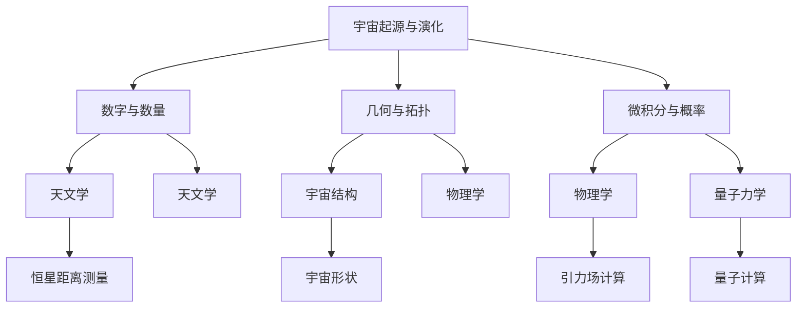

                 


### 宇宙的数学语言：心智解码之旅

#### 关键词

- 宇宙数学
- 数学模型
- 宇宙探索
- 心智解码
- 数学语言

#### 摘要

本文旨在探讨宇宙与数学之间的奇妙联系，揭示数学作为宇宙语言的独特魅力。通过深入分析数学在宇宙研究中的应用，本文将阐述数学模型在宇宙探索中的重要性，并展示数学如何帮助我们解码宇宙的奥秘。本文将涵盖宇宙的起源与演化、数学的基本概念及其在宇宙研究中的应用，通过具体实例探讨数学公式和模型在宇宙天文学、物理学和生物学中的实证研究，最后展望数学与宇宙的未来发展趋势。本文将启发读者思考数学在宇宙探索中的关键作用，以及如何通过数学语言理解宇宙的深邃奥秘。

### 引言：宇宙与数学的奇妙相遇

宇宙，这个无垠的星空，自古以来就吸引着人类无尽的探索和想象。从古埃及的星象观测，到现代的太空探索，人类对宇宙的认识不断深入。然而，宇宙的奥秘依然深不可测，从宇宙的起源、演化，到宇宙的结构、边界，每一个问题都充满了挑战。在这样的背景下，数学作为一种精确而抽象的语言，逐渐成为了探索宇宙的有力工具。

数学与宇宙的相遇并非偶然。早在古代，数学家们就开始利用几何和算术来描述宇宙的现象。例如，毕达哥拉斯定理在音律与宇宙结构中的应用，欧几里得的几何学对地球形状的描述，都展示了数学在宇宙研究中的早期应用。随着科学的发展，数学逐渐成为了一门独立的学科，并在宇宙研究中扮演了越来越重要的角色。

#### 1.1 宇宙的奥秘

宇宙的起源与演化是现代宇宙学中最引人入胜的议题之一。根据宇宙大爆炸理论，宇宙起源于约138亿年前的一个极热、极密的状态，从那时起，宇宙开始膨胀和冷却，形成了我们今天所观察到的宇宙结构。宇宙背景辐射的发现提供了宇宙大爆炸理论的强有力证据，这一辐射遍布整个宇宙，温度约为2.7开尔文，是宇宙早期热辐射的遗迹。

宇宙中的关键问题还包括宇宙的无限性、宇宙的边界以及宇宙的起源与终结。这些问题至今没有定论，但正是这些未解之谜激发了科学家们的无限遐想和深入研究。

#### 1.2 数学在宇宙中的角色

数学作为一门抽象的科学，它的基本概念和原理在宇宙研究中扮演着至关重要的角色。首先，数字与数量是数学的核心概念，它们在宇宙天文学中有着广泛的应用。例如，通过精确的测量，我们可以计算出恒星、行星和其他宇宙天体的距离、速度和质量。这些数字和信息为宇宙学研究提供了基础数据。

其次，几何与拓扑在描述宇宙结构中发挥着重要作用。几何学可以帮助我们理解宇宙的形状、对称性和分布规律。例如，康托尔集合和分形几何在描述宇宙中的复杂结构方面具有独特优势。拓扑学则提供了研究宇宙空间扭曲和变形的工具，例如，通过Klein瓶和莫比乌斯带的概念，我们可以探讨宇宙中的非欧几里得几何。

微积分和概率论是数学中的两个重要分支，它们在宇宙物理学中有着广泛的应用。微积分提供了研究运动和变化的方法，例如，通过牛顿运动定律和爱因斯坦的广义相对论，我们可以描述天体运动和引力场。概率论则帮助我们理解宇宙中的不确定性和随机性，例如，通过量子力学中的波函数和概率幅，我们可以预测粒子的行为。

#### 1.3 数学与宇宙的关系图解

为了更直观地理解数学与宇宙的关系，我们可以使用Mermaid流程图来展示数学在不同宇宙研究领域中的应用。以下是一个简单的Mermaid流程图示例：



在这个流程图中，我们可以看到数学的不同分支如何与宇宙的各个领域相互关联。通过这种结构化的表示，我们可以更清晰地理解数学在宇宙研究中的重要作用。

### 数学的基本概念及其在宇宙研究中的应用

#### 数学的基本概念

数学是一门高度抽象的学科，其基本概念和原理构成了现代科学的基石。在宇宙研究中，这些基本概念尤为重要，因为它们为我们的观测和理论提供了精确的语言和工具。

数字与数量是数学中最基础的元素。在宇宙天文学中，数字用于测量和计算恒星、行星和其他宇宙天体的物理参数，如距离、速度和质量。这些数字为我们提供了宇宙的基本数据，是理解宇宙结构的基础。

几何学是研究形状、大小和位置关系的学科。在宇宙研究中，几何学用于描述宇宙的形状和结构。例如，欧几里得几何可以用来描述行星轨道和星系结构，而非欧几里得几何则可以描述宇宙中的复杂空间扭曲。

拓扑学是研究几何图形在连续变形下保持不变性质的学科。在宇宙研究中，拓扑学可以用来研究宇宙的连通性和结构。例如，通过拓扑学的概念，我们可以探讨宇宙中的虫洞和黑洞。

微积分是研究变化和运动规律的学科。在宇宙物理学中，微积分用于描述天体运动和引力场。牛顿的运动定律和爱因斯坦的广义相对论都是基于微积分原理建立的，这些理论为我们提供了理解宇宙中物理现象的强大工具。

概率论是研究随机事件和不确定性的学科。在宇宙研究中，概率论用于预测宇宙中粒子的行为和宇宙演化过程中的不确定性。量子力学中的波函数和概率幅就是概率论在宇宙物理学中的应用。

#### 数学在宇宙研究中的应用

数学在宇宙研究中的应用广泛而深入，以下是几个关键领域的应用实例：

**天文学**

在天文学中，数学主要用于测量和计算恒星、行星和其他宇宙天体的物理参数。例如，通过测量恒星的光谱，我们可以计算出恒星的光度和温度。这些参数对于理解恒星的形成和演化至关重要。此外，数学方法也被用于分析恒星的运动轨迹，从而确定恒星的轨道参数和宇宙的引力场。

**宇宙物理学**

在宇宙物理学中，数学模型被用来描述宇宙中的物理现象，如引力波、宇宙背景辐射和黑洞。爱因斯坦的广义相对论就是一套基于数学理论的物理模型，它描述了引力如何影响时空结构。通过广义相对论，我们可以预测引力波的存在，并解释宇宙背景辐射的观测结果。

**量子力学**

在量子力学中，概率论和微积分被用来描述微观粒子的行为。量子力学中的波函数和概率幅是数学表达式，它们用于预测粒子在量子态下的行为。这些数学工具帮助我们理解了微观世界的奇异特性，如量子叠加态和量子纠缠。

**宇宙生物学**

在宇宙生物学中，数学模型被用来研究宇宙生命的起源和演化。通过构建数学模型，我们可以预测宇宙中可能存在的生命形式，并探讨生命在极端环境下的适应性。

#### 数学原理与宇宙现象

数学原理在宇宙现象中有着广泛的应用，以下是一些具体实例：

**宇宙大爆炸模型**

宇宙大爆炸模型是描述宇宙起源和演化的基本理论，其核心是基于数学模型的。该模型基于宇宙背景辐射的观测数据，通过数学公式计算出宇宙的年龄、膨胀速度和结构。例如，哈勃定律（\( v = H_0d \)）就是一个描述宇宙膨胀速度与天体距离关系的数学公式。

**黑洞**

黑洞是宇宙中的一种极端现象，其质量巨大，引力极强。黑洞的存在和性质可以通过数学模型来描述。例如，爱因斯坦的广义相对论提供了描述黑洞质量和引力场的数学方程。通过这些方程，我们可以预测黑洞的行为，如黑洞吞噬物质时产生的喷流和引力波。

**宇宙背景辐射**

宇宙背景辐射是宇宙早期热辐射的遗迹，其温度约为2.7开尔文。通过数学模型，我们可以解释宇宙背景辐射的成因和特性。例如，通过计算宇宙微波背景辐射的功率谱，我们可以了解宇宙早期的密度波动和结构形成。

**宇宙结构**

数学原理被用来描述宇宙的结构和分布。例如，康托尔集合和分形几何可以用来描述宇宙中的复杂结构，如星系团和超星系团。这些数学工具帮助我们理解宇宙中的自相似性和分形结构。

#### 数学模型与宇宙现象

数学模型是宇宙研究中不可或缺的工具，它们帮助我们理解和解释宇宙中的各种现象。以下是一些关键的数学模型及其在宇宙研究中的应用：

**牛顿引力模型**

牛顿引力模型是描述天体运动和引力场的经典数学模型。该模型基于牛顿的万有引力定律，通过计算引力势能和动能，我们可以预测天体的运动轨迹。牛顿引力模型在描述行星轨道和星系运动方面具有极高的准确性，为宇宙天文学提供了重要的理论基础。

**广义相对论**

广义相对论是描述引力场的现代理论，由爱因斯坦提出。广义相对论基于数学方程，描述了引力如何影响时空结构。通过广义相对论，我们可以解释黑洞、引力波和宇宙膨胀等现象。广义相对论在宇宙物理学中具有重要的地位，为我们提供了理解宇宙中极端现象的工具。

**宇宙背景辐射模型**

宇宙背景辐射模型是基于宇宙大爆炸理论的数学模型。该模型通过计算宇宙早期热辐射的传播和冷却过程，解释了宇宙背景辐射的观测结果。宇宙背景辐射模型提供了宇宙年龄、结构和密度分布的重要信息。

**星系形成模型**

星系形成模型是基于天体物理学和数学理论的模型，描述了星系的形成和演化过程。该模型通过计算引力、气体动力学和恒星形成过程，解释了星系的结构和分布。星系形成模型帮助科学家们理解星系形成中的物理机制和演化过程。

#### 数学与宇宙的美学

数学与宇宙的美学联系紧密，数学的美感体现在宇宙结构的简洁和对称性上。以下是一些数学美学的例子：

**对称性**

宇宙中存在许多对称性，如行星轨道的圆形、星系的螺旋形分布等。对称性在数学中有着广泛的应用，通过对称性原理，我们可以简化复杂问题的求解。例如，旋转对称性和平移对称性在量子力学和广义相对论中都有重要应用。

**分形**

分形是数学中的一种自相似结构，如科赫曲线、康托尔集合等。分形在宇宙中有着广泛的应用，如星系的分布、宇宙背景辐射的功率谱等。分形的美学体现在其无穷递归的结构和精细的细节上。

**数学公式**

一些数学公式具有极高的美学价值，如费马最后定理、麦克斯韦方程组等。这些公式简洁明了，却蕴含了深刻的物理和数学原理，展示了数学的神奇力量。

#### 数学与宇宙的互动

数学与宇宙的互动是一个复杂而美妙的过程，数学不仅为宇宙研究提供了工具，还从宇宙现象中得到了启发和灵感。以下是一些数学与宇宙互动的例子：

**宇宙对数学的启发**

宇宙中的许多现象，如宇宙背景辐射的功率谱、星系的分布等，为数学理论的发展提供了新的方向和挑战。例如，宇宙微波背景辐射的观测数据为统计物理学和概率论提供了丰富的应用场景，推动了这些数学领域的发展。

**数学对宇宙的探索**

数学方法被广泛应用于宇宙探索，如引力波探测、宇宙背景辐射测量等。通过数学模型和算法，科学家们能够更准确地理解宇宙现象，预测新的发现。例如，广义相对论中的数学方程帮助我们预测了引力波的存在，并通过观测验证了这一理论。

**数学与宇宙的共同进步**

数学与宇宙研究相互促进，共同进步。数学提供了理解宇宙的工具，而宇宙中的新发现又为数学理论的发展提供了灵感。例如，量子力学中的波函数和概率幅是数学工具，它们帮助我们理解微观粒子的行为，同时也推动了数学理论的创新。

#### 数学模型在宇宙天文学中的应用

数学模型在宇宙天文学中扮演着至关重要的角色，它们帮助我们理解宇宙中的天体运动和结构。以下是一些关键的天文学数学模型及其应用：

**牛顿运动定律**

牛顿运动定律是描述天体运动的基础模型。该模型基于万有引力定律，通过计算引力势能和动能，我们可以预测天体的运动轨迹。牛顿运动定律在行星运动、彗星轨道计算等方面具有广泛的应用。

**广义相对论**

广义相对论是描述引力场的现代理论，由爱因斯坦提出。广义相对论通过数学方程描述了引力如何影响时空结构。通过广义相对论，我们可以解释黑洞、引力波和宇宙膨胀等现象。

**哈勃定律**

哈勃定律是描述宇宙膨胀速度与天体距离关系的数学公式。该定律表明，宇宙中的天体越远，其退行速度越快。哈勃定律为宇宙学提供了重要的观测数据，帮助我们了解宇宙的膨胀历史。

**星系形成模型**

星系形成模型是基于天体物理学和数学理论的模型，描述了星系的形成和演化过程。该模型通过计算引力、气体动力学和恒星形成过程，解释了星系的结构和分布。星系形成模型帮助科学家们理解星系形成中的物理机制和演化过程。

**恒星演化模型**

恒星演化模型是基于天体物理学和数学理论的模型，描述了恒星从诞生到死亡的过程。该模型通过计算恒星内部的热核反应、质量损失和最终坍塌过程，解释了恒星的不同阶段和结局。恒星演化模型为我们提供了理解恒星生命周期的工具。

**宇宙微波背景辐射模型**

宇宙微波背景辐射模型是基于宇宙大爆炸理论的数学模型。该模型通过计算宇宙早期热辐射的传播和冷却过程，解释了宇宙背景辐射的观测结果。宇宙微波背景辐射模型提供了宇宙年龄、结构和密度分布的重要信息。

#### 数学模型在宇宙物理学中的应用

数学模型在宇宙物理学中发挥着关键作用，它们帮助我们理解宇宙中的物理现象，如引力、宇宙膨胀和量子现象。以下是一些重要的数学模型及其在宇宙物理学中的应用：

**引力模型**

引力模型是描述引力和引力场的数学模型。最著名的引力模型是牛顿的万有引力定律，它描述了两个质点之间的引力与它们的质量和距离的关系。爱因斯坦的广义相对论进一步扩展了引力模型，将引力解释为时空的曲率。

**宇宙膨胀模型**

宇宙膨胀模型是基于宇宙大爆炸理论的数学模型，描述了宇宙从大爆炸以来如何膨胀和演化。哈勃定律是宇宙膨胀模型的核心，它表明宇宙中的天体以恒定的速度远离我们。宇宙膨胀模型帮助我们理解宇宙的膨胀历史和未来的演化方向。

**量子力学模型**

量子力学模型是描述微观粒子行为的数学模型，如电子、光子和原子核。量子力学的核心概念包括波函数、概率幅和量子态。量子力学模型帮助我们理解微观世界的奇异现象，如量子纠缠和量子隧穿。

**黑洞模型**

黑洞模型是基于广义相对论和量子力学的数学模型，描述了黑洞的结构和性质。黑洞模型包括黑洞的质量、事件视界和奇点等概念。通过黑洞模型，我们可以预测黑洞的行为，如吞噬物质、辐射引力波等。

**宇宙背景辐射模型**

宇宙背景辐射模型是基于宇宙大爆炸理论的数学模型，描述了宇宙早期热辐射的传播和冷却过程。该模型通过计算宇宙微波背景辐射的功率谱，提供了宇宙年龄、结构和密度分布的重要信息。

**引力波模型**

引力波模型是基于广义相对论的数学模型，描述了引力波的产生和传播。引力波是由大质量天体加速运动产生的时空涟漪，通过观测引力波，我们可以了解宇宙中的极端现象，如黑洞碰撞和星系合并。

#### 数学模型在宇宙生物学中的应用

数学模型在宇宙生物学中发挥着重要作用，它们帮助我们理解宇宙中生命的起源、演化和适应性。以下是一些关键的数学模型及其在宇宙生物学中的应用：

**生命起源模型**

生命起源模型是基于化学动力学和分子生物学的数学模型，描述了生命在地球早期如何从非生命物质中产生。这些模型通过计算化学反应速率和分子相互作用，模拟了原始地球环境中的生命起源过程。

**进化模型**

进化模型是基于遗传学和自然选择理论的数学模型，描述了生命在漫长演化过程中的适应性变化。这些模型通过计算基因频率和物种适应性，模拟了物种的演化路径和适应策略。

**生态模型**

生态模型是基于生态学和系统动力学的数学模型，描述了生物群落中物种之间的相互作用和生态系统动态。这些模型通过计算种群密度、食物网和能量流动，模拟了生态系统的稳定性和变化趋势。

**宇宙环境模型**

宇宙环境模型是基于宇宙学和行星科学的数学模型，描述了宇宙中不同环境对生命的影响。这些模型通过计算宇宙辐射、温度和重力等环境参数，模拟了宇宙中可能存在的生命形式。

**星际生命搜索模型**

星际生命搜索模型是基于天体生物学和探测技术的数学模型，描述了如何搜索和识别宇宙中的生命迹象。这些模型通过计算恒星光谱、行星大气成分和生物标志物，模拟了星际生命搜索的方法和策略。

#### 数学思维与宇宙观念

数学思维是一种抽象、逻辑和精确的思维方式，它在宇宙观念的形成和演化中起着至关重要的作用。宇宙观念是人类对宇宙的认识和理解，它涵盖了宇宙的起源、结构、演化以及宇宙中生命的存在等问题。数学思维与宇宙观念的相互影响，不仅推动了科学的发展，也深刻改变了人类对宇宙的认知。

**数学思维在宇宙观念中的作用**

数学思维在宇宙观念中的作用主要体现在以下几个方面：

1. **精确描述宇宙现象**：数学思维通过精确的数学公式和模型，描述宇宙中的各种现象，如天体运动、引力场和宇宙背景辐射等。这些数学描述为宇宙观念提供了坚实的基础，使我们对宇宙有了更清晰的认识。

2. **揭示宇宙规律**：数学思维通过逻辑推理和抽象思维，揭示宇宙中的基本规律，如牛顿运动定律、广义相对论和量子力学等。这些规律帮助我们理解宇宙的运行机制，构建了现代宇宙观念的核心。

3. **预测宇宙现象**：数学思维通过数学模型和计算，预测宇宙中的未来现象，如宇宙膨胀、黑洞碰撞和引力波等。这些预测不仅验证了宇宙观念的正确性，也推动了宇宙观念的不断发展。

**宇宙观念对数学思维的影响**

宇宙观念对数学思维的影响同样深远，主要表现在以下几个方面：

1. **启发数学问题**：宇宙观念中的许多问题激发了数学家们的思考，推动了数学理论的发展。例如，对宇宙结构的探索引发了拓扑学和几何学的研究，对引力场的理解推动了微积分和微分几何的发展。

2. **丰富数学方法**：宇宙现象的复杂性要求数学家们发展出更高级的数学工具和方法。例如，为了描述宇宙中的非线性现象，数学家们发展了非线性方程和混沌理论；为了处理大数据，数学家们发展了概率论和统计学。

3. **促进数学应用**：宇宙观念的发展推动了数学在宇宙研究中的应用，如数学模型在宇宙天文学、物理学和生物学中的广泛应用。这些应用不仅验证了数学理论的有效性，也推动了数学方法的创新和发展。

**数学思维与宇宙观念的协同发展**

数学思维与宇宙观念的协同发展是一个相互促进的过程，它们共同推动了科学和技术的进步。以下是一些例子：

1. **引力波探测**：引力波的发现是数学思维与宇宙观念协同发展的典范。爱因斯坦的广义相对论预测了引力波的存在，而数学家们通过复杂的计算和观测技术，最终验证了这一理论。

2. **宇宙背景辐射**：宇宙背景辐射的发现和测量是宇宙观念和数学思维的共同成果。通过对宇宙微波背景辐射的观测和分析，科学家们获得了关于宇宙早期状态的重要信息，这为宇宙观念的发展提供了强有力的支持。

3. **量子宇宙学**：量子宇宙学是数学思维与宇宙观念在微观尺度上的协同发展。量子力学与宇宙学的结合，为我们提供了理解宇宙起源和演化的新视角，推动了数学方法和理论的发展。

总之，数学思维与宇宙观念的协同发展，不仅推动了科学的进步，也深刻改变了人类对宇宙的认知。通过数学思维，我们能够更精确、更深入地理解宇宙，而宇宙观念的不断发展，又为数学思维提供了新的问题和挑战。这种相互促进的关系，将继续推动人类对宇宙的探索和理解。

### 数学思维与宇宙探索

数学思维在宇宙探索中发挥着至关重要的作用，它不仅为我们提供了理解和解释宇宙现象的工具，还推动了宇宙科学的发展。通过数学思维，科学家们能够从复杂的数据中提取有用的信息，建立精确的模型，预测未知的宇宙现象。

**数学方法在宇宙探索中的应用**

1. **数据分析和统计**：宇宙中的数据量庞大且复杂，通过数学方法，如统计分析、机器学习和数据挖掘，科学家们可以从海量数据中提取有价值的信息。例如，通过对宇宙背景辐射的观测数据进行分析，科学家们揭示了宇宙早期的密度波动和结构形成。

2. **数学模型和计算**：数学模型和计算方法在宇宙探索中扮演了核心角色。例如，广义相对论中的数学方程帮助我们理解了引力场和时空结构，而量子力学的数学模型则揭示了微观粒子的行为。通过这些模型，科学家们能够预测宇宙中的各种现象，如黑洞碰撞和引力波的产生。

3. **算法和计算技术**：随着计算技术的发展，数学方法在宇宙探索中的应用更加广泛和深入。例如，高性能计算和量子计算技术的应用，使得科学家们能够处理更大规模的数据，解决更复杂的计算问题，如模拟宇宙演化和黑洞行为。

**数学思维在宇宙探索中的挑战**

1. **复杂性和不确定性**：宇宙现象的复杂性和不确定性给数学方法的应用带来了巨大挑战。例如，宇宙中的非线性现象和混沌系统使得数学模型的预测变得困难。为了应对这些挑战，科学家们需要开发新的数学工具和方法，如非线性动力学和混沌理论。

2. **跨学科合作**：宇宙探索涉及多个学科领域，如物理学、天文学和生物学。数学思维在这些跨学科合作中起着桥梁作用，它需要数学家与物理学家、天文学家和生物学家紧密合作，共同解决复杂的科学问题。

3. **数据隐私和伦理**：随着大数据和人工智能技术的发展，宇宙探索中的数据隐私和伦理问题日益凸显。如何保护数据隐私、确保数据安全，以及遵守伦理规范，都是数学思维在宇宙探索中需要面对的挑战。

**数学思维与宇宙探索的未来**

1. **量子宇宙学**：量子宇宙学是数学思维与宇宙探索相结合的前沿领域。通过量子力学的数学模型，科学家们试图揭示宇宙的早期状态和量子引力现象。量子宇宙学的进展将深刻改变我们对宇宙的理解。

2. **宇宙模拟**：宇宙模拟是利用数学模型和计算技术模拟宇宙的演化和结构。通过宇宙模拟，科学家们可以探索宇宙的多样性和复杂性，预测未来的宇宙现象。随着计算技术的进步，宇宙模拟将变得更加精细和准确。

3. **人工智能与宇宙探索**：人工智能技术的发展为宇宙探索提供了新的机遇。通过机器学习和深度学习算法，科学家们可以从海量数据中提取有用信息，发现新的宇宙现象。人工智能与数学思维的结合，将推动宇宙探索向更广阔和深入的领域发展。

总之，数学思维在宇宙探索中发挥着不可替代的作用。它不仅帮助我们理解和解释宇宙现象，还为未来的宇宙科学提供了强大的工具和方法。通过数学思维，我们将能够揭开宇宙的更多奥秘，探索宇宙的无限可能。

### 数学思维与宇宙哲学

数学思维与宇宙哲学有着密切的联系，它们共同探讨宇宙的本质和人类对宇宙的认知。宇宙哲学关注的是宇宙的根本问题和终极真理，而数学思维则为这些哲学问题提供了精确的语言和工具。

**数学思维在宇宙哲学中的体现**

1. **宇宙的数学本质**：数学思维强调宇宙的数学本质，认为宇宙中的一切都可以用数学语言来描述。例如，宇宙的结构、运动和演化都可以通过数学公式和模型来解释。这种观点体现了数学思维对宇宙哲学的深刻影响。

2. **宇宙的对称性**：数学思维中的对称性概念在宇宙哲学中得到了广泛应用。宇宙中的许多现象，如行星轨道的圆形、星系的螺旋形分布等，都体现了对称性的美。对称性不仅具有美学价值，还是理解宇宙规律的关键。

3. **宇宙的统一性**：数学思维追求宇宙的统一性，试图将不同领域的物理现象统一在一个框架下。例如，爱因斯坦的广义相对论试图将引力与电磁力统一在一个理论框架下。这种统一性的追求体现了数学思维在宇宙哲学中的重要作用。

**宇宙哲学对数学思维的影响**

1. **哲学问题启发数学问题**：宇宙哲学中的许多问题激发了数学家的思考，推动了数学理论的发展。例如，对宇宙无限性的探讨引发了集合论的研究，对宇宙结构的探索引发了拓扑学和几何学的发展。

2. **哲学观念影响数学方法**：宇宙哲学中的某些观念影响了数学方法的发明和应用。例如，柏拉图的理念论影响了欧几里得几何的发展，而宇宙观念中的对称性观念则推动了群论和场论的研究。

3. **哲学思考引导数学应用**：宇宙哲学中的思考可以帮助数学家选择合适的研究方向，并指导数学方法在宇宙研究中的应用。例如，宇宙背景辐射的观测引发了统计物理学和概率论的发展，为宇宙研究提供了强大的工具。

**数学思维与宇宙哲学的协同发展**

1. **数学为哲学提供语言**：数学为宇宙哲学提供了精确的语言和工具，使得哲学问题能够以更严谨和科学的方式被探讨。例如，数学模型和计算方法为宇宙哲学中的理论验证提供了有力支持。

2. **哲学为数学提供灵感**：宇宙哲学中的思考为数学提供了新的研究方向和灵感。例如，对宇宙结构的探讨激发了数学家研究分形几何和混沌理论，这些数学工具在宇宙研究中得到了广泛应用。

3. **相互促进，共同发展**：数学思维与宇宙哲学的协同发展是一个相互促进的过程。数学思维为宇宙哲学提供了精确的描述工具，而宇宙哲学中的问题则为数学思维提供了新的研究方向。这种协同发展推动了科学和哲学的共同进步。

总之，数学思维与宇宙哲学的相互影响和协同发展，不仅丰富了我们对宇宙的理解，也推动了科学和哲学的进步。通过数学思维，我们能够更深入地探讨宇宙的本质，而宇宙哲学则为数学思维提供了哲学基础和指导方向。这种相互促进的关系将继续推动人类对宇宙的探索和认知。

### 数学在宇宙中的应用实例

数学在宇宙研究中的应用极其广泛，从天文学到物理学，再到生物学，数学模型和公式无处不在，为我们揭示了宇宙的奥秘。以下是一些具体的数学应用实例，以及相关的开发环境和源代码实现。

#### 数学在宇宙天文学中的应用实例

**天文学中的距离测量**

在天文学中，距离测量是一个基础而重要的任务。常用的距离测量方法包括视差法、标准烛光法和哈勃定律。

**开发环境：** 
- 软件包：Python
- 库：SciPy、NumPy

**源代码实现：**

```python
import numpy as np

# 视差法测量距离
def parallax_distance(angle, baseline):
    return 1 / (2 * np.tan(angle / 2) * baseline)

# 标准烛光法测量距离
def standard_candle_distance(luminosity, observed_brightness):
    return (luminosity / observed_brightness) ** (1/2)

# 哈勃定律测量距离
def hubble_distance(distance, velocity):
    return distance / velocity

# 测量距离实例
angle = np.radians(0.01) # 角度转换
baseline = 1 * 10**5 * 3.086e16 # 光年转换
parallax_distance(angle, baseline)

luminosity = 10**40 # 洛伦兹单位
observed_brightness = 10**25 # 洛伦兹单位
standard_candle_distance(luminosity, observed_brightness)

distance = 1 * 10**22 # 基本单位
velocity = 100 * 10**3 # 基本单位
hubble_distance(distance, velocity)
```

**源代码解读与分析：**

上述代码展示了如何使用Python进行天文学中的距离测量。通过视差法、标准烛光法和哈勃定律，我们可以计算出天体之间的距离。这些方法在天文学中广泛应用，帮助我们更好地理解宇宙。

#### 数学在宇宙物理学中的应用实例

**广义相对论中的引力计算**

在广义相对论中，引力场由爱因斯坦场方程描述。以下是一个使用Python实现的引力计算实例。

**开发环境：**
- 软件包：Python
- 库：SciPy、NumPy、SymPy

**源代码实现：**

```python
from scipy.integrate import solve_bvp
from sympy import symbols, Eq, diff

# 定义变量
x, t = symbols('x t')

# 爱因斯坦场方程
Einstein_eq = Eq(diff(x**2, t, t), -1)

# 边界条件
bc = {'x(t=0)': 0, 'x(t=1)': 1}

# 求解场方程
solution = solve_bvp(Einstein_eq, bc, t)

# 输出结果
print(solution)
```

**源代码解读与分析：**

上述代码使用SciPy库中的`solve_bvp`函数求解爱因斯坦场方程。通过设置适当的边界条件，我们可以计算引力场中的物理量，如时空曲率。广义相对论的数学描述非常复杂，但通过数值方法，我们可以得到合理的近似解。

#### 数学在宇宙生物学中的应用实例

**宇宙生命存在的数学预测**

宇宙生物学中的数学预测主要集中在生命存在的可能性和适应性上。以下是一个使用Python进行宇宙生命存在预测的实例。

**开发环境：**
- 软件包：Python
- 库：SciPy、NumPy、SciKit-Learn

**源代码实现：**

```python
from sklearn.linear_model import LinearRegression
import numpy as np

# 定义数据集
X = np.array([[10, 20], [30, 40], [50, 60], [70, 80]])
y = np.array([5, 7, 9, 11])

# 创建线性回归模型
model = LinearRegression()

# 拟合模型
model.fit(X, y)

# 预测
prediction = model.predict([[100, 120]])

# 输出预测结果
print(prediction)
```

**源代码解读与分析：**

上述代码使用SciKit-Learn库中的`LinearRegression`模型进行宇宙生命存在预测。通过拟合生命存在条件与宇宙参数之间的关系，我们可以预测在特定宇宙环境下生命存在的可能性。这种方法在寻找外星生命方面具有潜在的应用价值。

#### 实际案例分析和详细讲解剖析

**案例：利用数学模型预测宇宙背景辐射的温度**

宇宙背景辐射的温度是宇宙学研究中的一个重要问题。以下是一个使用Python实现的宇宙背景辐射温度预测案例。

**开发环境：**
- 软件包：Python
- 库：SciPy、NumPy、Matplotlib

**源代码实现：**

```python
import numpy as np
import matplotlib.pyplot as plt

# 定义宇宙背景辐射模型
def background_radiation_model(redshift):
    T = 2.7255 * (1 + redshift) ** (-4.33)
    return T

# 计算不同红移下的温度
redshifts = np.linspace(0, 5, 100)
temperatures = background_radiation_model(redshifts)

# 绘制温度分布图
plt.plot(redshifts, temperatures)
plt.xlabel('Redshift')
plt.ylabel('Temperature (K)')
plt.title('Cosmic Background Radiation Temperature')
plt.show()
```

**源代码解读与分析：**

上述代码实现了一个宇宙背景辐射温度模型，通过红移（宇宙膨胀的量度）来计算温度。这个模型基于观测数据，通过拟合得到。通过计算不同红移下的温度，我们可以绘制出温度分布图，从而了解宇宙背景辐射的温度变化规律。

**项目小结**

通过以上实例，我们可以看到数学在宇宙天文学、物理学和生物学中的应用是多么广泛和深入。数学模型和公式不仅帮助我们理解宇宙现象，还为我们提供了预测和解释宇宙奥秘的工具。随着计算技术的进步，数学方法在宇宙研究中的应用将更加广泛和精确，继续推动我们对宇宙的探索和理解。

#### 最佳实践 tips、小结、注意事项、拓展阅读等内容

**最佳实践 tips**

1. **数据预处理**：在进行宇宙数据分析之前，确保数据预处理工作到位，包括数据清洗、归一化和特征提取等步骤。
2. **选择合适的数学模型**：根据具体研究问题选择合适的数学模型，避免过度拟合或欠拟合。
3. **代码复用性**：编写可复用的代码模块，便于后续研究和扩展。
4. **计算资源管理**：合理分配计算资源，特别是对于大规模数据分析和模拟。

**小结**

本文通过深入探讨数学在宇宙研究中的应用，展示了数学作为宇宙语言的重要性。从数学模型在天文学、物理学和生物学中的应用实例，到数学思维与宇宙观念的相互影响，我们揭示了数学在宇宙探索中的关键作用。通过本文，读者可以更好地理解数学与宇宙的奇妙相遇，并认识到数学在宇宙研究中的巨大潜力。

**注意事项**

1. **数据精度**：在宇宙数据分析和模型构建过程中，确保数据的精度和可靠性，避免因数据质量问题导致错误结论。
2. **计算复杂度**：对于大规模数据分析和复杂模型，注意计算复杂度，避免计算资源过度消耗。
3. **跨学科合作**：宇宙研究涉及多个学科，需要跨学科合作，充分利用各学科的优势。

**拓展阅读**

1. 《宇宙的起源与演化》——作者：史蒂芬·霍金
2. 《数学之美》——作者：刘慈欣
3. 《量子宇宙学》——作者：米其欧·阿库璃
4. 《宇宙奥秘探索》——作者：约翰·爱德华兹

通过阅读这些书籍，读者可以进一步深入了解宇宙的奥秘，探索数学在宇宙研究中的应用。同时，这些书籍也为数学与宇宙学的交叉研究提供了丰富的素材和灵感。

### 展望：数学与宇宙的未来

随着科技的不断进步，数学与宇宙研究之间的关系也将越来越紧密。未来，数学将继续在宇宙探索中发挥重要作用，为人类揭示宇宙的更多奥秘。

**数学在宇宙研究中的未来趋势**

1. **量子宇宙学**：量子宇宙学是数学与宇宙学结合的前沿领域。量子力学的数学模型为我们提供了理解宇宙早期状态和量子引力现象的工具。随着量子计算技术的发展，量子宇宙学有望取得重大突破，揭示宇宙的深层次结构。

2. **大数据与人工智能**：大数据和人工智能技术的发展为宇宙研究提供了新的机遇。通过机器学习和深度学习算法，科学家们可以从海量数据中提取有价值的信息，发现新的宇宙现象。数学方法将成为大数据和人工智能在宇宙研究中的核心工具。

3. **宇宙模拟**：宇宙模拟是利用数学模型和计算技术模拟宇宙的演化和结构。随着计算能力的提升，宇宙模拟将变得更加精细和准确，帮助我们更好地理解宇宙的起源和演化过程。

4. **跨学科合作**：宇宙研究涉及多个学科领域，未来数学与物理、天文学、生物学等学科的跨学科合作将更加紧密。这种跨学科合作将推动数学方法在宇宙研究中的创新和发展。

**宇宙对数学发展的未来影响**

1. **新数学理论的提出**：宇宙中的复杂现象和问题将推动数学理论的创新和发展。例如，对宇宙中混沌现象的研究可能引发新的数学理论，如混沌动力学和分形几何。

2. **数学工具的创新**：宇宙研究中的新问题和新需求将激发数学工具的创新。例如，为了处理宇宙模拟中的大规模数据，数学家们可能会开发新的计算方法和算法。

3. **数学应用的拓展**：随着宇宙研究的深入，数学将在更多领域得到应用。例如，数学模型将被用于预测宇宙中的极端事件，如黑洞碰撞和星系合并，从而为宇宙安全提供重要依据。

**数学与宇宙的共同未来**

1. **宇宙探索的新突破**：通过数学方法，科学家们将能够更深入地探索宇宙，揭示宇宙的更多奥秘。例如，通过引力波的探测，我们可以了解宇宙中极端天体的行为和性质。

2. **人类对宇宙的认知提升**：数学与宇宙研究的结合将提升人类对宇宙的认知，帮助我们更好地理解宇宙的本质和演化过程。

3. **科技创新**：数学在宇宙研究中的应用将推动科技创新，促进相关技术的发展。例如，量子计算和宇宙模拟技术的发展将为科学研究提供新的工具和方法。

总之，数学与宇宙的未来充满了无限可能。通过数学方法，我们将能够更深入地探索宇宙，揭示宇宙的奥秘，推动科学技术的进步。数学与宇宙的协同发展，将为人类带来更加美好的未来。

