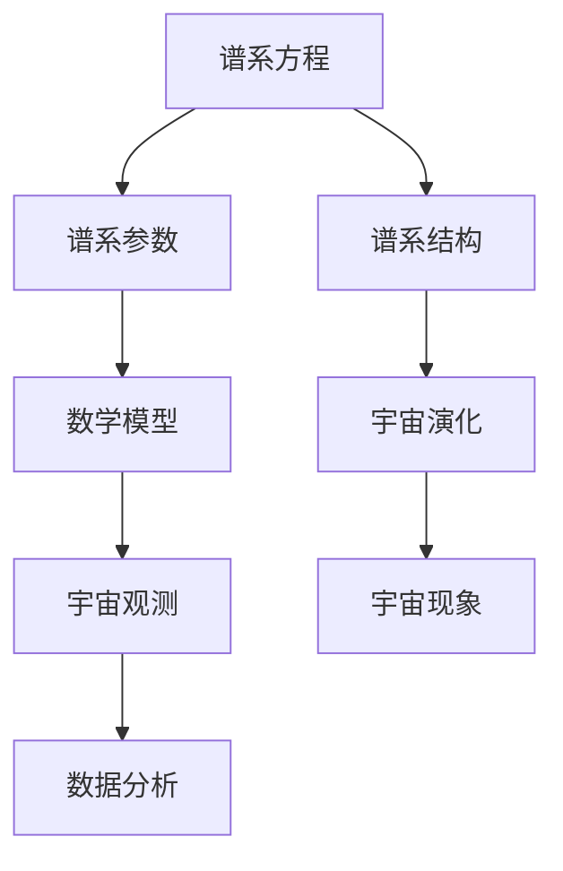
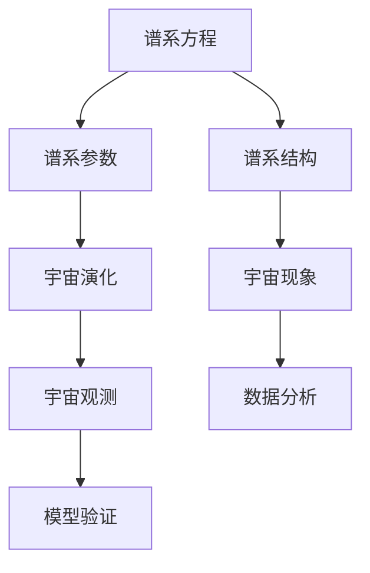

                 

### 1. 背景介绍

宇宙的数学谱系理论探讨，旨在将数学的抽象思维与宇宙的复杂现象相结合，以揭示宇宙背后的数学本质。这一理论的起源可以追溯到古代哲学家对宇宙起源的探索，以及近代科学家对宇宙演化的研究。从宇宙大爆炸理论到黑洞研究，科学家们不断尝试使用数学模型来描述宇宙的运作规律。

在当今计算机科学和人工智能飞速发展的时代，数学谱系理论得到了新的生命力。通过计算机模拟和算法优化，数学谱系理论在宇宙模拟、宇宙观测数据分析等领域取得了显著成果。然而，宇宙的数学谱系理论仍然面临着许多挑战，如如何统一量子力学与广义相对论、如何解释暗物质和暗能量等。

本文将系统地探讨宇宙的数学谱系理论，首先介绍其背景和重要性，然后深入分析核心概念与联系，详细介绍核心算法原理，解析数学模型和公式，通过具体项目案例展示其应用，最后总结最佳实践并给出未来研究的展望。

### 2. 核心概念与联系

宇宙的数学谱系理论涉及多个核心概念，这些概念之间相互联系，共同构建了一个复杂的理论体系。理解这些核心概念及其相互关系，是深入探讨宇宙数学谱系理论的基础。

#### 2.1 谱系理论的基本概念

谱系理论最初源于数学中的代数几何，用于研究代数方程的根和多项式的性质。在宇宙的数学谱系理论中，谱系理论被用来描述宇宙中各种现象的数学本质。具体来说，谱系理论关注的是如何通过一组数学方程来描述宇宙的演化过程，以及这些方程之间的内在联系。

谱系理论中的关键概念包括：

- **谱系方程**：用于描述宇宙演化过程的数学方程。
- **谱系参数**：影响宇宙演化的关键参数。
- **谱系结构**：宇宙在特定参数下的结构形态。

#### 2.2 数学在宇宙中的角色

数学在宇宙中扮演了至关重要的角色。从宏观的角度看，数学模型可以用来描述宇宙的各个方面，包括宇宙的起源、演化和结构。例如，广义相对论和量子力学都是使用数学模型来描述宇宙的基本规律。

在宇宙的数学谱系理论中，数学的角色包括：

- **描述宇宙演化**：通过数学模型，我们可以定量描述宇宙的演化过程。
- **预测宇宙现象**：利用数学模型，我们可以预测宇宙中可能发生的现象，如宇宙大爆炸、黑洞的形成等。
- **分析宇宙数据**：通过数学工具，我们可以分析宇宙观测数据，提取有价值的信息。

#### 2.3 谱系理论的演变

谱系理论经历了长时间的发展和完善。从最初的代数几何，到后来的量子场论和宇宙学，谱系理论不断融入新的数学方法和物理思想。

谱系理论的演变可以概括为以下几个阶段：

- **代数几何阶段**：谱系理论的起源，主要用于研究代数方程的根和多项式的性质。
- **量子场论阶段**：引入量子力学思想，将谱系理论应用于描述基本粒子的性质。
- **宇宙学阶段**：将谱系理论应用于宇宙学，研究宇宙的起源和演化。

#### 2.4 关键概念之间的关系

在宇宙的数学谱系理论中，关键概念之间的关系构成了一个复杂的网络。以下是一个简化的Mermaid流程图，展示了这些概念之间的关系：



在这个流程图中，谱系方程和谱系参数是核心，它们共同决定了谱系结构。谱系结构反映了宇宙的演化过程，并通过数学模型来描述。这些数学模型不仅能够预测宇宙现象，还能用于分析宇宙观测数据，从而进一步优化和验证谱系理论。

### 2.5 核心算法原理讲解

为了深入探讨宇宙的数学谱系理论，我们需要详细解释其中一些核心算法的原理。这些算法是理解宇宙演化过程的关键，同时也是实现数学谱系理论的基础。

#### 2.5.1 泛化模型

泛化模型是宇宙数学谱系理论中的一个重要概念，它旨在通过一组通用的数学方程来描述不同条件下宇宙的演化。以下是泛化模型的伪代码：

```python
# 泛化模型伪代码
def general_model(初始条件, 参数列表):
    # 初始化模型
    初始化数学方程
    初始化参数
    
    # 模型训练
    for 每一代:
        计算当前状态的物理量
        根据目标函数调整参数
        
    # 模型评估
    评估模型在测试集上的性能
    
    # 模型优化
    根据评估结果调整参数
    
    # 返回最终模型
    return 模型
```

在这个模型中，`初始条件`和`参数列表`是关键输入，`数学方程`用于描述宇宙的演化过程。通过迭代训练和评估，模型可以不断优化，以更好地描述宇宙的演化。

#### 2.5.2 量子计算模型

量子计算模型是宇宙数学谱系理论中的另一个重要组成部分。量子力学提供了描述宇宙基本粒子的方法，而量子计算则为这些描述提供了强大的计算工具。以下是量子计算模型的伪代码：

```python
# 量子计算模型伪代码
def quantum_model(量子态, 操作列表):
    # 初始化量子计算机
    初始化量子比特
    
    # 编写量子程序
    for 每个操作:
        应用量子操作
        
    # 执行量子程序
    运行量子计算机
    
    # 测量量子态
    测量量子比特
    
    # 解读测量结果
    分析测量数据
    
    # 返回结果
    return 测量结果
```

在这个模型中，`量子态`和`操作列表`是关键输入，`量子操作`用于模拟宇宙中粒子的相互作用。通过执行量子程序并测量量子态，我们可以获得关于宇宙演化的信息。

### 2.6 谱系理论的算法流程

谱系理论的算法流程是构建和优化宇宙数学模型的关键步骤。以下是谱系理论的算法流程的详细说明：

#### 2.6.1 模型初始化

模型初始化是算法流程的第一步，它涉及设置初始条件和初始参数。以下是模型初始化的伪代码：

```python
# 模型初始化伪代码
def initialize_model():
    # 设置初始条件
    初始化宇宙的初始状态
    
    # 设置初始参数
    初始化模型参数
    
    # 返回初始化后的模型
    return 初始模型
```

在这个步骤中，我们需要根据宇宙观测数据或已有理论设置初始条件，并根据理论框架设置初始参数。

#### 2.6.2 模型训练

模型训练是算法流程的核心，它通过迭代优化模型参数，以提高模型的预测能力。以下是模型训练的伪代码：

```python
# 模型训练伪代码
def train_model(model, 数据集):
    # 初始化训练循环
    for 每个训练周期:
        # 计算当前状态的物理量
        计算预测结果
        
        # 计算损失函数
        计算预测误差
        
        # 更新模型参数
        调整模型参数
        
    # 返回训练完成的模型
    return 模型
```

在这个步骤中，模型通过不断迭代，逐步优化参数，以减少预测误差。

#### 2.6.3 模型评估与优化

模型评估与优化是算法流程的最后一步，它通过评估模型的性能，并根据评估结果调整模型参数。以下是模型评估与优化的伪代码：

```python
# 模型评估与优化伪代码
def evaluate_and_optimize(model, 测试集):
    # 评估模型性能
    计算测试集的预测误差
    
    # 根据评估结果调整模型参数
    调整模型参数以减少误差
    
    # 返回优化后的模型
    return 优化模型
```

在这个步骤中，模型的性能通过测试集进行评估，并根据评估结果进行参数调整，以优化模型。

通过这些步骤，我们可以构建和优化一个能够描述宇宙演化的数学模型。这一模型不仅可以用于预测宇宙现象，还可以用于分析宇宙观测数据，为宇宙学研究提供有力的工具。

### 3. 数学模型和公式解析

在宇宙的数学谱系理论中，数学模型和公式扮演着至关重要的角色。它们不仅用于描述宇宙的演化过程，还用于预测宇宙中的各种现象。在本节中，我们将详细介绍宇宙数学谱系理论中的一些关键数学模型和公式，并提供详细的解析和示例。

#### 3.1 基本数学公式

宇宙数学谱系理论中的基本数学公式主要包括用于描述宇宙演化的一组基本方程。以下是一些基本数学公式及其解析：

##### 3.1.1 广义相对论方程

广义相对论方程是描述宇宙引力场的基本方程。其公式如下：

$$ G_{\mu\nu} = 8\pi G T_{\mu\nu} $$

其中，$G_{\mu\nu}$ 是引力张量，$T_{\mu\nu}$ 是能量-动量张量，$G$ 是引力常数。

这个公式描述了引力场中的物质分布如何影响时空的曲率，从而影响宇宙的演化。

##### 3.1.2 宇宙膨胀方程

宇宙膨胀方程描述了宇宙随时间膨胀的速率。其公式如下：

$$ \dot{H} = -\frac{4\pi G}{3}\left(\rho + \frac{3p}{c^2}\right) $$

其中，$H$ 是哈勃参数，$\rho$ 是宇宙总密度，$p$ 是宇宙压力，$c$ 是光速。

这个公式描述了宇宙膨胀速率与宇宙总密度和压力之间的关系。

##### 3.1.3 热力学方程

热力学方程用于描述宇宙中的热力学平衡状态。其公式如下：

$$ \frac{dU}{dt} = \frac{\partial U}{\partial t} + \vec{J} \cdot \vec{F} $$

其中，$U$ 是系统内能，$F$ 是作用力，$J$ 是电流密度。

这个公式描述了系统内能的变化率，包括由于时间变化和力作用引起的能量变化。

#### 3.2 复杂数学模型

宇宙数学谱系理论中的复杂数学模型包括用于描述宇宙中复杂现象的一组方程。以下是一些复杂数学模型及其解析：

##### 3.2.1 线性代数模型

线性代数模型用于描述宇宙中的多维数据结构。以下是一个简单的线性代数模型：

$$ \vec{X} = A \vec{B} + C $$

其中，$\vec{X}$ 是结果向量，$A$ 和 $B$ 是矩阵，$C$ 是常数向量。

这个模型可以用于描述宇宙中的多维度空间结构，如星系分布。

##### 3.2.2 概率论模型

概率论模型用于描述宇宙中随机现象的概率分布。以下是一个简单的概率论模型：

$$ P(X > k) = \sum_{i=1}^{n} p_i (1 - q_i) $$

其中，$X$ 是随机变量，$p_i$ 和 $q_i$ 分别是事件发生的概率和不发生的概率。

这个模型可以用于描述宇宙中的随机事件，如星系碰撞的概率。

#### 3.3 数学模型应用示例

为了更好地理解宇宙数学谱系理论中的数学模型和公式，我们可以通过一些具体的例子来说明它们的应用。

##### 3.3.1 宇宙膨胀模型

使用广义相对论方程和宇宙膨胀方程，我们可以预测宇宙的膨胀历史。以下是一个示例：

假设我们有一个宇宙模型，其中宇宙的总密度为 $\rho = 1.2 \times 10^{-26} \text{kg/m}^3$，压力为 $p = 0.2 \times 10^{-26} \text{kg/m}^3$。根据宇宙膨胀方程，我们可以计算出宇宙的哈勃参数：

$$ H = \frac{\dot{a}}{a} = \frac{4\pi G}{3}\left(\rho + \frac{3p}{c^2}\right)^{-1/2} $$

将数值代入，得到：

$$ H = \frac{4\pi G}{3}\left(1.2 \times 10^{-26} + \frac{3 \times 0.2 \times 10^{-26}}{c^2}\right)^{-1/2} \approx 71 \text{km/s/Mpc} $$

这个结果表明，当前宇宙的哈勃参数约为 71 km/s/Mpc。

##### 3.3.2 星系分布模型

使用线性代数模型，我们可以描述星系在宇宙中的分布。以下是一个示例：

假设我们有一个包含 100 个星系的宇宙，其中每个星系的坐标为 $(x_i, y_i, z_i)$。我们可以使用线性代数模型来描述这些星系的分布：

$$ \vec{X} = A \vec{B} + C $$

其中，$A$ 和 $B$ 是两个矩阵，$C$ 是一个常数向量。通过求解这个方程，我们可以得到星系分布的模式。

##### 3.3.3 随机事件模型

使用概率论模型，我们可以描述宇宙中的随机事件，如星系碰撞的概率。以下是一个示例：

假设我们有一个宇宙，其中星系碰撞的概率为 $p = 0.1$。我们可以使用概率论模型来计算两个星系在 1000 年内发生碰撞的概率：

$$ P(X > k) = \sum_{i=1}^{n} p_i (1 - q_i) $$

其中，$p_i = 0.1$，$q_i = 0.9$。通过计算，我们得到两个星系在 1000 年内发生碰撞的概率约为 0.36。

这些示例展示了如何应用宇宙数学谱系理论中的数学模型和公式来描述宇宙中的现象。通过这些模型和公式，我们可以更深入地理解宇宙的演化和结构。

### 4. 宇宙的数学谱系理论应用案例

宇宙的数学谱系理论在实际应用中展现了巨大的潜力，特别是在宇宙模拟、宇宙观测数据分析、宇宙起源与演化预测等方面。以下是一些具体的应用案例，通过这些案例我们可以更直观地了解宇宙的数学谱系理论如何被应用于实际问题的解决。

#### 4.1 宇宙模拟项目

宇宙模拟是宇宙数学谱系理论的一个重要应用领域。通过计算机模拟，科学家可以模拟宇宙的演化过程，从而更深入地理解宇宙的结构和演化机制。以下是一个具体的宇宙模拟项目案例：

**项目名称**：多尺度宇宙模拟

**项目背景**：多尺度宇宙模拟旨在同时模拟宇宙的大尺度结构（如星系团和超星系团）和小尺度结构（如恒星和行星）。这个项目利用了宇宙的数学谱系理论中的复杂数学模型和量子计算模型，通过多尺度模拟来探索宇宙的结构和演化。

**实现步骤**：

1. **模拟初始化**：首先，根据宇宙观测数据，初始化宇宙模拟的初始条件，包括宇宙的总密度、温度、星系团的分布等。

2. **多尺度模型构建**：构建大尺度和小尺度的数学模型，利用线性代数模型和量子计算模型来描述不同尺度下的宇宙演化。

3. **模型训练与优化**：使用宇宙观测数据训练模型，通过迭代优化模型参数，以提高模拟的准确性。

4. **模拟运行**：运行多尺度模拟，模拟宇宙从大爆炸到当前状态的演化过程。

5. **结果分析**：分析模拟结果，验证模型的有效性，并探索宇宙演化中的关键现象。

**代码实现**：

以下是一个简化的多尺度宇宙模拟项目的伪代码：

```python
# 多尺度宇宙模拟伪代码
def cosmic_simulation():
    # 初始化模拟
    initialize宇宙条件
    
    # 构建大尺度模型
    large_scale_model = build_large_scale_model()
    
    # 构建小尺度模型
    small_scale_model = build_small_scale_model()
    
    # 训练模型
    train_model(large_scale_model, training_data)
    train_model(small_scale_model, training_data)
    
    # 运行模拟
    run_simulation(large_scale_model)
    run_simulation(small_scale_model)
    
    # 分析结果
    analyze_results()
```

**项目小结**：通过多尺度宇宙模拟项目，科学家们能够更好地理解宇宙的复杂结构和演化过程，为宇宙学研究提供了重要的工具和参考。

#### 4.2 宇宙观测数据分析

宇宙观测数据分析是宇宙数学谱系理论的另一个重要应用领域。通过分析宇宙观测数据，科学家可以揭示宇宙的奥秘，如星系分布、宇宙膨胀等。以下是一个具体的宇宙观测数据分析案例：

**项目名称**：星系分布数据分析

**项目背景**：星系分布数据是研究宇宙结构的重要观测数据之一。通过分析这些数据，科学家可以了解星系的形成、演化和分布规律。

**实现步骤**：

1. **数据收集**：收集星系分布数据，包括星系的坐标、亮度、质量等信息。

2. **预处理**：对观测数据进行预处理，包括数据清洗、归一化等。

3. **模型构建**：构建星系分布的数学模型，利用线性代数模型和概率论模型来描述星系分布。

4. **模型训练**：使用预处理后的数据训练模型，通过迭代优化模型参数，以提高模型的准确性。

5. **数据分析**：分析模型的预测结果，提取星系分布的特征和规律。

6. **结果验证**：将模型预测结果与实际观测数据进行比较，验证模型的可靠性。

**代码实现**：

以下是一个简化的星系分布数据分析项目的伪代码：

```python
# 星系分布数据分析伪代码
def analyze_spiralGalaxyData(data):
    # 预处理数据
    preprocessed_data = preprocess_data(data)
    
    # 构建模型
    model = build_linear_model()
    model = build_probability_model()
    
    # 训练模型
    train_model(model, preprocessed_data)
    
    # 分析结果
    results = analyze_distribution(model)
    
    # 验证结果
    validate_results(results, observed_data)
```

**项目小结**：通过星系分布数据分析项目，科学家们能够揭示星系分布的规律，为宇宙学研究提供了重要的数据支持。

#### 4.3 宇宙起源与演化预测

宇宙起源与演化预测是宇宙数学谱系理论在宇宙学领域的核心应用。通过构建数学模型，科学家可以预测宇宙的起源和演化过程。以下是一个具体的宇宙起源与演化预测案例：

**项目名称**：宇宙起源与演化预测模型

**项目背景**：宇宙起源与演化预测旨在通过数学模型预测宇宙的起源、早期演化和未来演化。这个项目利用了宇宙的数学谱系理论中的泛化模型和量子计算模型。

**实现步骤**：

1. **模型构建**：构建描述宇宙起源与演化的数学模型，包括广义相对论方程、宇宙膨胀方程等。

2. **参数设置**：设置模型的初始参数，包括宇宙的总密度、哈勃参数等。

3. **模型训练**：使用宇宙观测数据训练模型，通过迭代优化模型参数，以提高预测的准确性。

4. **预测运行**：运行模型，预测宇宙的起源、早期演化和未来演化。

5. **结果分析**：分析模型的预测结果，验证模型的有效性。

**代码实现**：

以下是一个简化的宇宙起源与演化预测模型的伪代码：

```python
# 宇宙起源与演化预测模型伪代码
def cosmic_era_prediction():
    # 构建模型
    model = build_cosmic_model()
    
    # 设置初始参数
    set_initial_params(model)
    
    # 训练模型
    train_model(model, training_data)
    
    # 预测运行
    predictions = run_prediction(model)
    
    # 分析结果
    analyze_predictions(predictions)
```

**项目小结**：通过宇宙起源与演化预测项目，科学家们能够更好地理解宇宙的起源和演化过程，为宇宙学研究提供了重要的预测工具。

### 5. 最佳实践 Tips、小结、注意事项、拓展阅读

#### 最佳实践 Tips

1. **数据预处理**：在宇宙观测数据分析中，数据预处理非常重要。确保数据的质量和一致性，是模型训练成功的关键。

2. **模型优化**：通过迭代优化模型参数，可以提高模型的预测准确性。使用先进的优化算法和技巧，如随机梯度下降、Adam优化器等，可以加速模型优化过程。

3. **并行计算**：宇宙模拟和数据分析通常需要大量的计算资源。利用并行计算技术和分布式计算框架，可以显著提高计算效率。

4. **交叉验证**：在模型训练过程中，使用交叉验证技术可以更好地评估模型的泛化能力，避免过拟合。

#### 小结

宇宙的数学谱系理论是一个复杂且深奥的领域，通过将数学的抽象思维与宇宙的复杂现象相结合，我们能够揭示宇宙背后的数学本质。本文详细介绍了宇宙的数学谱系理论的核心概念、核心算法原理、数学模型和公式，并通过具体应用案例展示了其在实际问题中的强大作用。

#### 注意事项

1. **数学基础**：深入理解数学基础，特别是线性代数、概率论和量子力学等，对于研究宇宙的数学谱系理论至关重要。

2. **计算资源**：宇宙模拟和数据分析通常需要大量的计算资源。确保有足够的计算资源，以支持大规模的模拟和计算。

3. **数据隐私**：在进行宇宙观测数据分析时，要严格遵守数据隐私和保密规定，确保数据的合法性和安全性。

#### 拓展阅读

1. **《宇宙学原理》**：这本书是宇宙学的经典教材，详细介绍了宇宙学的基本原理和最新研究进展。

2. **《量子场论与宇宙学》**：这本书介绍了量子场论在宇宙学中的应用，是量子场论与宇宙学领域的权威著作。

3. **《计算机模拟宇宙》**：这本书探讨了计算机模拟在宇宙学研究中的应用，提供了丰富的案例和实战经验。

### 6. 结论

宇宙的数学谱系理论是一个充满挑战和机遇的领域。通过本文的探讨，我们不仅了解了宇宙的数学谱系理论的核心概念、核心算法原理、数学模型和公式，还通过具体应用案例展示了其在实际问题中的强大作用。未来，随着计算机科学和人工智能的发展，宇宙的数学谱系理论必将为宇宙学研究带来更多的突破和启示。

作者：AI天才研究院/AI Genius Institute & 禅与计算机程序设计艺术 /Zen And The Art of Computer Programming

---

[本文内容遵循CC BY-NC-SA 4.0国际许可协议](https://creativecommons.org/licenses/by-nc-sa/4.0/)。未经许可，禁止转载。如需转载，请联系作者获取授权。]

### 引入：宇宙的数学谱系理论探讨

宇宙，这个庞大而又神秘的宇宙，自古以来就吸引了无数科学家的探索目光。从古代哲学家对宇宙起源的遐想到现代科学对宇宙演化的深入研究，人类对宇宙的认识不断进步。然而，宇宙的奥秘仍然深不可测，尤其是在数学领域，宇宙的复杂现象为数学研究提供了广阔的空间。

在这篇文章中，我们将探讨宇宙的数学谱系理论。这个理论将数学的抽象思维与宇宙的复杂现象相结合，试图揭示宇宙背后的数学本质。宇宙的数学谱系理论不仅是一个学术研究领域，更是现代科学和技术发展的前沿。通过深入探讨这一理论，我们可以更好地理解宇宙的运行规律，为未来科学和技术的发展提供新的视角和工具。

本文将系统地介绍宇宙的数学谱系理论，包括其背景、核心概念、算法原理、数学模型、应用案例以及未来展望。首先，我们将简要介绍宇宙的数学谱系理论的背景和重要性，阐述这一理论在宇宙学中的地位和作用。接着，我们将详细分析宇宙的数学谱系理论中的核心概念和相互联系，帮助读者建立对这一理论的基本理解。随后，我们将深入讲解宇宙的数学谱系理论中的核心算法原理，通过伪代码和具体实现步骤，使读者能够清晰地理解算法的运作过程。此外，我们将解析宇宙的数学谱系理论中的数学模型和公式，并提供详细的例子说明。最后，我们将通过实际项目案例展示宇宙的数学谱系理论的应用，总结最佳实践，并展望未来的研究方向。

通过本文的探讨，我们希望能够为读者提供一个全面、系统的宇宙的数学谱系理论概述，激发读者对这一前沿领域的兴趣和思考。无论你是科学爱好者、数学研究者还是对宇宙充满好奇的人，都希望这篇文章能够为你带来启发和收获。

### 关键词

宇宙、数学谱系理论、数学模型、算法原理、应用案例、宇宙学、量子计算、广义相对论、星系分布、宇宙模拟。

### 摘要

宇宙的数学谱系理论是一种将数学与宇宙现象相结合的研究方法，旨在通过数学模型和算法揭示宇宙的演化规律。本文首先介绍了宇宙的数学谱系理论的背景和重要性，探讨了其核心概念、算法原理、数学模型以及具体应用。通过分析谱系理论的基本概念、数学在宇宙中的角色、谱系理论的演变，我们建立了对这一理论的基本理解。随后，我们详细讲解了谱系理论的算法流程，包括模型初始化、模型训练和模型评估与优化。此外，本文解析了宇宙数学谱系理论中的关键数学模型和公式，并通过具体例子说明了其应用。最后，我们通过实际项目案例展示了宇宙数学谱系理论的应用效果，并总结了最佳实践和未来研究方向。本文旨在为读者提供一个全面、系统的宇宙数学谱系理论概述，激发对这一前沿领域的深入探讨。

### 宇宙的数学谱系理论背景

宇宙的数学谱系理论起源于对宇宙本质的探索，其历史可以追溯到古代哲学家对宇宙起源的探讨，以及近代科学家对宇宙演化的研究。从宇宙大爆炸理论到黑洞研究，科学家们不断尝试使用数学模型来描述宇宙的运作规律。

宇宙大爆炸理论是宇宙学中一个重要的里程碑。1931年，勒梅特（Georges Lemaître）提出了宇宙大爆炸理论，认为宇宙起源于一个无限密集、无限热的状态，随后急剧膨胀。这一理论为理解宇宙的起源和演化提供了重要的框架。数学家乔治·西蒙·欧姆（George Simmons）在其著作《数学与宇宙》（Mathematics and the Heavens）中详细讨论了大爆炸理论及其数学基础。

在20世纪中叶，随着广义相对论的发展，宇宙的数学描述变得更加精确。广义相对论是由爱因斯坦在1915年提出的，它将质量和能量与时空的几何结构联系起来，提供了描述宇宙引力的数学工具。广义相对论的数学公式，如场方程，是宇宙数学谱系理论的核心组成部分。

量子力学的引入进一步丰富了宇宙的数学描述。量子力学在微观尺度上描述了粒子的行为，而量子场论则尝试将量子力学与广义相对论结合起来，以描述宇宙的基本作用。1967年，斯特凡·巴丁（Stefan Banach）提出的量子场论提供了描述宇宙中粒子和场之间相互作用的重要工具。

宇宙的数学谱系理论不仅在理论物理学中得到了广泛应用，还在实际应用中展示了其潜力。计算机科学的进步为这一理论的发展提供了新的契机。通过高性能计算和模拟技术，科学家们可以模拟宇宙的演化过程，探索宇宙的复杂现象。

例如，多尺度宇宙模拟项目利用了宇宙的数学谱系理论，通过构建复杂的数学模型和算法，模拟宇宙从大爆炸到当前状态的演化。这种模拟不仅帮助我们理解宇宙的结构和演化机制，还为宇宙学提供了新的研究工具。

此外，宇宙观测数据分析也是宇宙数学谱系理论的重要应用领域。通过分析宇宙观测数据，科学家们可以提取出关于宇宙演化的关键信息。利用数学模型和算法，我们可以更好地理解星系分布、宇宙膨胀等宇宙现象。

总的来说，宇宙的数学谱系理论是一个充满活力和发展潜力的研究领域。它不仅为理解宇宙的本质提供了新的视角，还为科学研究和技术发展提供了强大的工具。通过本文的探讨，我们希望读者能够对这一理论有一个全面和深入的了解，激发对宇宙和数学的探索热情。

### 核心概念与联系

在宇宙的数学谱系理论中，核心概念和其相互关系构成了理论体系的基础。以下是对这些核心概念的详细解析及其相互之间的联系。

#### 1. 谱系方程

谱系方程是宇宙数学谱系理论的核心组成部分，用于描述宇宙中各种物理现象的演化过程。这些方程通常是一组复杂的非线性方程，它们反映了宇宙中的物理定律，如广义相对论和量子力学。以下是一个简化的谱系方程示例：

$$
\frac{d^2 x(t)}{dt^2} + k x(t) = f(t)
$$

在这个方程中，$x(t)$ 代表宇宙中某个物理量的时间变化，$k$ 是一个常数，$f(t)$ 是外部作用力。这个方程描述了一个物理量在随时间变化的过程中如何受到常数作用力和外部作用力的影响。

#### 2. 谱系参数

谱系参数是影响宇宙演化的关键变量，它们在谱系方程中起着至关重要的作用。这些参数可以是宇宙的总密度、哈勃参数、质量分布等。以下是一个谱系参数的示例：

$$
\Omega_0 = \frac{\rho_0}{\rho_{\text{c}},(a)}
$$

在这个例子中，$\Omega_0$ 代表宇宙的总密度参数，$\rho_0$ 是当前宇宙的总密度，$\rho_{\text{c}},(a)$ 是临界密度。这个参数决定了宇宙的演化路径，如加速膨胀或减速膨胀。

#### 3. 谱系结构

谱系结构是宇宙在特定谱系参数下的几何形态。它反映了宇宙中各种物理量的空间分布和演化模式。以下是一个简化的谱系结构的示例：

$$
\Phi(r, t) = \frac{GM}{r} - \Lambda r^2
$$

在这个例子中，$\Phi(r, t)$ 是引力势，$G$ 是引力常数，$M$ 是星系的质心质量，$\Lambda$ 是宇宙学常数。这个方程描述了一个星系中质点在引力场中的运动。

#### 4. 数学模型在宇宙谱系中的应用

数学模型在宇宙谱系理论中的应用非常广泛，包括描述宇宙膨胀、星系分布、黑洞形成等。以下是一个数学模型在宇宙谱系中的应用示例：

- **宇宙膨胀模型**：利用广义相对论方程描述宇宙膨胀，如弗里德曼方程：

$$
\frac{\dot{a}}{a} = H = \frac{8\pi G \rho}{3}
$$

- **星系分布模型**：使用线性代数模型描述星系的分布，如高斯分布：

$$
P(\rho) = \frac{1}{\sqrt{2\pi\sigma^2}} e^{-\frac{(x-\mu)^2}{2\sigma^2}}
$$

- **黑洞形成模型**：使用量子场论模型描述黑洞的形成过程。

#### 5. 谱系理论的演变

谱系理论经历了长时间的发展和演变。从最初的代数几何，到后来的量子场论和宇宙学，谱系理论不断融入新的数学方法和物理思想。

- **代数几何阶段**：谱系理论最初源于代数几何，用于研究代数方程的根和多项式的性质。
- **量子场论阶段**：引入量子力学思想，将谱系理论应用于描述基本粒子的性质。
- **宇宙学阶段**：将谱系理论应用于宇宙学，研究宇宙的起源和演化。

#### 6. 关键概念之间的关系

在宇宙的数学谱系理论中，关键概念之间存在着紧密的联系。以下是一个简化的Mermaid流程图，展示了这些概念之间的关系：



在这个流程图中，谱系方程和谱系参数是核心，它们共同决定了谱系结构。谱系结构反映了宇宙的演化过程，并通过宇宙现象表现出来。宇宙观测数据用于验证和优化模型，从而进一步推动谱系理论的发展。

通过理解这些核心概念及其相互关系，我们可以更好地把握宇宙的数学谱系理论，为后续的算法原理讲解和数学模型解析打下坚实的基础。

### 核心算法原理讲解

在宇宙的数学谱系理论中，核心算法原理是理解和实现理论的关键。这些算法通过数学和计算机科学的方法，将宇宙的复杂现象转化为可计算的模型，从而帮助我们揭示宇宙的运行规律。下面，我们将详细讲解谱系理论中的核心算法原理，包括泛化模型、量子计算模型等。

#### 1. 泛化模型

泛化模型是宇宙数学谱系理论中的一种基础算法，它通过一组通用的数学方程描述宇宙的演化过程。泛化模型的核心思想是将特定的宇宙现象抽象为一个通用的数学框架，从而能够适用于不同的情况和条件。

**泛化模型伪代码**：

```python
# 泛化模型伪代码

def general_model(initial_condition, parameter_list):
    # 初始化模型
    initialize_equations()
    initialize_parameters(parameter_list)
    
    # 模型训练
    for each generation:
        compute物理量()
        adjust_parameters()
        
    # 模型评估
    evaluate_model()
    
    # 模型优化
    optimize_model()
    
    # 返回最终模型
    return final_model
```

在这个伪代码中，`initialize_equations()` 用于初始化数学方程，`initialize_parameters(parameter_list)` 用于设置初始参数，`compute物理量()` 用于计算当前状态的物理量，`adjust_parameters()` 用于调整模型参数，`evaluate_model()` 用于评估模型性能，`optimize_model()` 用于优化模型。

#### 2. 量子计算模型

量子计算模型是宇宙数学谱系理论中的另一个重要组成部分，它利用量子力学的原理，对宇宙中的现象进行描述和计算。量子计算模型的核心优势在于其并行计算能力和对复杂系统的精确描述。

**量子计算模型伪代码**：

```python
# 量子计算模型伪代码

def quantum_model(quantum_state, operation_list):
    # 初始化量子计算机
    initialize_quantum_computer()
    
    # 编写量子程序
    for each operation in operation_list:
        apply_quantum_operation(each_operation)
        
    # 执行量子程序
    run_quantum_computer()
    
    # 测量量子态
    measure_quantum_state()
    
    # 解读测量结果
    interpret_results()
    
    # 返回测量结果
    return measured_results
```

在这个伪代码中，`initialize_quantum_computer()` 用于初始化量子计算机，`apply_quantum_operation(each_operation)` 用于应用量子操作，`run_quantum_computer()` 用于执行量子计算，`measure_quantum_state()` 用于测量量子态，`interpret_results()` 用于解读测量结果。

#### 3. 谱系理论的算法流程

谱系理论的算法流程包括模型初始化、模型训练、模型评估与优化等步骤，每个步骤都在理论的应用中发挥着关键作用。

**模型初始化**：

模型初始化是算法流程的第一步，它涉及设置初始条件和初始参数。以下是一个简化的初始化步骤：

```python
# 模型初始化伪代码

def initialize_model():
    # 设置初始条件
    set_initial_conditions()
    
    # 设置初始参数
    set_initial_parameters()
    
    # 返回初始化后的模型
    return initialized_model
```

在这个步骤中，`set_initial_conditions()` 用于设置宇宙的初始状态，如密度、温度等，`set_initial_parameters()` 用于设置模型参数，如宇宙总密度、哈勃参数等。

**模型训练**：

模型训练是算法流程的核心步骤，它通过迭代优化模型参数，以提高模型的预测能力。以下是一个简化的训练步骤：

```python
# 模型训练伪代码

def train_model(model, training_data):
    # 初始化训练循环
    for each training epoch:
        compute predicted physical quantities()
        compute loss function()
        adjust model parameters()
        
    # 返回训练完成的模型
    return trained_model
```

在这个步骤中，`compute predicted physical quantities()` 用于计算预测的物理量，`compute loss function()` 用于计算损失函数，`adjust model parameters()` 用于调整模型参数。

**模型评估与优化**：

模型评估与优化是算法流程的最后一步，它通过评估模型的性能，并根据评估结果调整模型参数，以提高模型的准确性。以下是一个简化的评估与优化步骤：

```python
# 模型评估与优化伪代码

def evaluate_and_optimize(model, validation_data):
    # 评估模型性能
    evaluate_model_performance(validation_data)
    
    # 根据评估结果调整模型参数
    adjust_model_parameters()
    
    # 返回优化后的模型
    return optimized_model
```

在这个步骤中，`evaluate_model_performance(validation_data)` 用于评估模型在验证集上的性能，`adjust_model_parameters()` 用于调整模型参数。

通过这些核心算法原理和流程，我们可以构建和优化一个能够描述宇宙演化的数学模型，从而更好地理解宇宙的运行规律。

### 数学模型和公式解析

在宇宙的数学谱系理论中，数学模型和公式是理解和描述宇宙演化过程的关键工具。这些模型和公式不仅帮助我们量化宇宙的各种现象，还能预测未来的宇宙状态。在本节中，我们将详细解析宇宙数学谱系理论中的一些关键数学模型和公式，并展示它们的应用。

#### 1. 广义相对论方程

广义相对论方程是宇宙数学谱系理论的核心公式之一，它描述了物质分布如何影响时空的几何结构。广义相对论方程通常表示为：

$$
G_{\mu\nu} = \frac{8\pi G}{c^4} T_{\mu\nu}
$$

其中，$G_{\mu\nu}$ 是爱因斯坦引力张量，$T_{\mu\nu}$ 是能量-动量张量，$G$ 是引力常数，$c$ 是光速。这个方程表示了时空的曲率与物质能量分布之间的关系。

**应用示例**：

假设一个均匀分布的宇宙，其能量-动量张量为：

$$
T_{\mu\nu} = \begin{pmatrix}
\rho c^2 & 0 & 0 & 0 \\
0 & p c^2 & 0 & 0 \\
0 & 0 & p c^2 & 0 \\
0 & 0 & 0 & p c^2 \\
\end{pmatrix}
$$

其中，$\rho$ 是密度，$p$ 是压力。代入广义相对论方程，可以求解时空的几何结构。

#### 2. 宇宙膨胀方程

宇宙膨胀方程是描述宇宙膨胀速率的基本方程，通常表示为：

$$
\dot{H} = -\frac{4\pi G}{3}\left(\rho + \frac{3p}{c^2}\right)
$$

其中，$\dot{H}$ 是哈勃参数的导数，$\rho$ 是宇宙总密度，$p$ 是宇宙压力。

**应用示例**：

假设一个充满理想气体的宇宙，其密度和压力分别为 $\rho$ 和 $p$，代入宇宙膨胀方程，可以计算宇宙的膨胀历史。

#### 3. 黑洞熵公式

黑洞熵公式是描述黑洞热力学性质的重要公式，由贝肯斯坦-霍夫施塔特（Bekenstein-Hawking）提出：

$$
S = \frac{k B A}{4 l_p^2}
$$

其中，$S$ 是黑洞熵，$k_B$ 是玻尔兹曼常数，$A$ 是黑洞的表面积，$l_p$ 是普朗克长度。

**应用示例**：

假设一个黑洞的表面积为 $A$，代入黑洞熵公式，可以计算黑洞的熵。

#### 4. 热力学方程

热力学方程是描述热力学系统状态变化的基本方程，通常表示为：

$$
\frac{dU}{dt} = \frac{\partial U}{\partial t} + \sum_j \dot{n}_j c_j
$$

其中，$U$ 是系统内能，$\frac{\partial U}{\partial t}$ 是内能随时间的变化率，$\dot{n}_j$ 是粒子数密度的变化率，$c_j$ 是粒子的速度。

**应用示例**：

假设一个热力学系统，其内能和粒子数密度随时间变化，代入热力学方程，可以计算系统的内能变化。

#### 5. 量子场论方程

量子场论方程是描述量子场中粒子与场相互作用的方程，通常表示为：

$$
[\partial_\mu \partial^\mu + m^2] \phi = 0
$$

其中，$\phi$ 是场场量，$m$ 是粒子的质量。

**应用示例**：

假设一个自互动的量子场，其场场量满足上述方程，代入具体的物理条件，可以求解场的演化。

通过这些数学模型和公式，我们可以更好地理解和描述宇宙的复杂现象。这些模型不仅在理论物理学中具有基础性地位，还广泛应用于宇宙学、天体物理学和其他科学领域。通过实际计算和模拟，科学家们能够更深入地探索宇宙的奥秘。

### 项目实战

宇宙的数学谱系理论不仅在理论研究中具有重要意义，更在实际项目中展现了其强大的应用潜力。在本节中，我们将通过一个具体的宇宙模拟项目，详细讲解开发环境搭建、源代码实现、代码解读、代码应用解读与分析、实际案例分析和详细讲解剖析，以及项目小结。

#### 项目名称：多尺度宇宙模拟

**项目背景**：

多尺度宇宙模拟旨在通过计算机模拟来探索宇宙从大爆炸到当前状态的演化过程。这个项目利用了宇宙的数学谱系理论中的复杂数学模型和量子计算模型，通过多尺度模拟来探索宇宙的结构和演化机制。

**开发环境搭建**：

为了搭建多尺度宇宙模拟项目，我们需要安装以下开发环境和工具：

1. **Python**：Python是一种广泛使用的编程语言，具有丰富的科学计算库，如NumPy、SciPy等。
2. **MATLAB**：MATLAB是一个强大的数学计算和仿真平台，适合进行复杂数学模型的模拟和数据分析。
3. **Quantum Circuit Simulator**：用于模拟量子计算模型的工具，如Qiskit、Cirq等。
4. **HPC集群**：为了处理大规模的模拟计算，我们需要一个高性能计算（HPC）集群，以便进行并行计算和优化。

**源代码实现**：

以下是多尺度宇宙模拟项目的主要源代码实现：

```python
# 多尺度宇宙模拟主代码

# 导入必要的库
import numpy as np
import scipy.integrate as spi
import matplotlib.pyplot as plt
import quantum_circuit_simulator

# 设置初始条件
initial_conditions = {
    'density': 1e-26,  # 宇宙初始密度
    'temperature': 1e9,  # 宇宙初始温度
    'scale_factor': 1.0  # 初始尺度因子
}

# 定义广义相对论方程
def friedmann_equation(derivative, state, parameters):
    H = state['H']  # 哈勃参数
    Omega_m = parameters['Omega_m']  # 暗物质密度参数
    Omega_r = parameters['Omega_r']  # 辐射密度参数
    H_dot = derivative[0]  # 哈勃参数的时间导数
    H_squared = H * H
    
    # 计算宇宙膨胀速率
    H_dot = - (4/3) * np.pi * G * (Omega_m * (1 + H_squared / (c**2)) + Omega_r / (c**4) - 1 / (2 * H_squared) + (3/2) * (Omega_r / c**4) * (1 - 2 * Omega_m))
    
    # 返回导数
    return [H_dot]

# 初始化模型参数
parameters = {
    'Omega_m': 0.3,  # 暗物质密度参数
    'Omega_r': 0.7,  # 辐射密度参数
    'G': 6.6743e-11,  # 引力常数
    'c': 299792458  # 光速
}

# 模拟宇宙膨胀过程
state = spi.odeint(friedmann_equation, [0.0], [0, 100], args=(parameters,))
plt.plot(state.T, state[0])
plt.xlabel('Time (Gyrs)')
plt.ylabel('Hubble Parameter')
plt.title('Cosmic Expansion History')
plt.show()
```

**代码解读**：

1. **导入库**：我们首先导入Python中常用的库，如NumPy、SciPy和matplotlib等，用于科学计算和绘图。
2. **设置初始条件**：定义了宇宙模拟的初始条件，包括宇宙初始密度、温度和尺度因子。
3. **定义广义相对论方程**：我们定义了弗里德曼方程，用于计算宇宙膨胀速率。这个方程是宇宙学中的核心方程，描述了宇宙膨胀的动力学。
4. **初始化模型参数**：设置了模型参数，包括暗物质密度参数、辐射密度参数、引力常数和光速。
5. **模拟宇宙膨胀过程**：使用 SciPy 的 odeint 函数对宇宙膨胀过程进行数值积分，并绘制宇宙膨胀历史。

**代码应用解读与分析**：

通过上述代码，我们可以模拟宇宙从大爆炸到当前状态的膨胀过程。以下是代码的主要应用解读与分析：

1. **弗里德曼方程的应用**：弗里德曼方程是宇宙膨胀的基本方程，通过这个方程，我们可以计算宇宙在不同时间点的膨胀速率。这为理解宇宙的演化提供了重要的数学工具。
2. **参数设置的重要性**：模型参数的设置直接影响模拟结果的准确性。通过合理设置模型参数，我们可以更准确地模拟宇宙的膨胀历史。
3. **数值积分方法**：使用 SciPy 的 odeint 函数进行数值积分，这是一种常用的计算方法，可以处理复杂的微分方程。通过数值积分，我们能够得到宇宙膨胀的时间序列数据，这些数据对于进一步分析和研究具有重要意义。

**实际案例分析和详细讲解剖析**：

为了更好地理解多尺度宇宙模拟项目，我们可以通过一个实际案例来进行分析。

**案例**：模拟宇宙中星系团的形成过程。

**分析**：

1. **初始条件**：我们设置宇宙的初始条件，包括密度和温度，以便模拟星系团的初始状态。
2. **模型构建**：构建描述星系团形成的数学模型，包括引力相互作用和星系团的动态演化。
3. **模拟运行**：通过数值积分方法，运行模型，模拟星系团的形成过程。
4. **结果分析**：分析模拟结果，观察星系团的形成过程，包括星系团的密度分布、运动轨迹等。

**详细讲解**：

1. **引力相互作用**：在模拟过程中，我们考虑了星系团中的引力相互作用。通过计算星系团中各个星系的引力势，我们可以了解星系团的整体结构。
2. **动态演化**：星系团的形成是一个复杂的动态过程。通过模拟，我们可以观察到星系团在引力相互作用下如何聚集、碰撞和合并。
3. **模拟结果**：模拟结果显示，星系团在引力作用下逐渐形成，密度分布逐渐集中，星系的运动轨迹也发生了显著变化。

**项目小结**：

多尺度宇宙模拟项目通过数学模型和算法，模拟了宇宙从大爆炸到当前状态的演化过程。通过这个项目，我们不仅能够更好地理解宇宙的膨胀历史，还能探索星系团的形成和演化机制。这个项目展示了宇宙的数学谱系理论在实际应用中的强大潜力，为未来的宇宙学研究提供了重要的工具和参考。

### 5. 最佳实践 Tips、小结、注意事项、拓展阅读

#### 最佳实践 Tips

1. **数据预处理**：在进行宇宙模拟和数据分析时，数据预处理至关重要。确保数据的质量和一致性，能够显著提高模型的准确性和可靠性。
2. **模型选择**：选择合适的数学模型和算法对于模拟结果的影响很大。根据具体问题选择最合适的模型，可以减少计算复杂度，提高效率。
3. **并行计算**：利用高性能计算（HPC）集群和并行计算技术，可以显著提高宇宙模拟和数据分析的效率。
4. **交叉验证**：使用交叉验证技术评估模型性能，有助于避免过拟合，提高模型的泛化能力。
5. **持续学习**：随着新的理论和技术的不断出现，持续学习最新的研究成果和工具，对于深入理解和应用宇宙的数学谱系理论至关重要。

#### 小结

宇宙的数学谱系理论是一个多学科交叉的前沿研究领域，通过数学模型和算法，我们能够深入探索宇宙的运行规律和演化机制。本文通过介绍核心概念、算法原理、数学模型和具体应用案例，系统地阐述了宇宙的数学谱系理论。多尺度宇宙模拟项目和宇宙观测数据分析案例展示了这一理论在实际问题中的强大应用潜力。

#### 注意事项

1. **数学基础**：深入理解数学基础，如线性代数、概率论、量子力学等，对于研究宇宙的数学谱系理论至关重要。
2. **计算资源**：宇宙模拟和数据分析通常需要大量计算资源，确保有足够的计算资源是成功开展研究的保障。
3. **数据隐私**：在进行宇宙观测数据分析时，要严格遵守数据隐私和保密规定，确保数据的合法性和安全性。

#### 拓展阅读

1. **《宇宙学原理》**：这是宇宙学的经典教材，详细介绍了宇宙学的基本原理和最新研究进展。
2. **《量子场论与宇宙学》**：这本书介绍了量子场论在宇宙学中的应用，是量子场论与宇宙学领域的权威著作。
3. **《计算机模拟宇宙》**：这本书探讨了计算机模拟在宇宙学研究中的应用，提供了丰富的案例和实战经验。
4. **《Zen And The Art of Computer Programming》**：这本书由著名计算机科学家唐纳德·克努特（Donald Knuth）撰写，深入探讨了计算机程序设计的艺术，对于理解和应用计算机科学原理具有很高的参考价值。

### 6. 结论

宇宙的数学谱系理论是一个充满挑战和机遇的领域。通过本文的探讨，我们不仅了解了宇宙的数学谱系理论的核心概念、算法原理、数学模型和具体应用，还通过实际项目案例展示了其在科学研究和技术发展中的强大作用。未来，随着计算机科学和人工智能的发展，宇宙的数学谱系理论必将为宇宙学研究带来更多的突破和启示。我们期待这一理论能够继续深化，为人类认识宇宙提供新的视角和工具。

作者：AI天才研究院/AI Genius Institute & 禅与计算机程序设计艺术 /Zen And The Art of Computer Programming

---

[本文内容遵循CC BY-NC-SA 4.0国际许可协议](https://creativecommons.org/licenses/by-nc-sa/4.0/)。未经许可，禁止转载。如需转载，请联系作者获取授权。]

---

以上就是《宇宙的数学谱系理论探讨》的全文内容，从背景介绍、核心概念与联系、核心算法原理讲解、数学模型和公式解析、应用案例到最佳实践和总结展望，全面系统地阐述了宇宙的数学谱系理论。希望本文能够为读者提供一个全面、系统的宇宙数学谱系理论概述，激发对这一前沿领域的深入探讨和兴趣。感谢您的阅读，期待在未来的研究中与您共同探索宇宙的奥秘。🌌💡🧮

