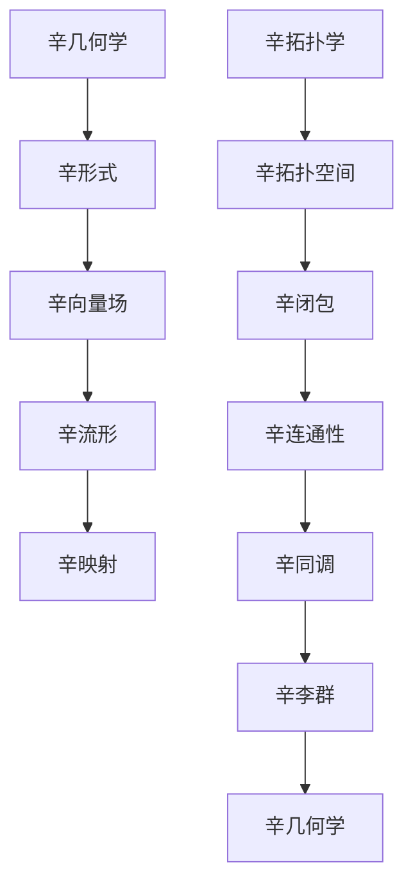

                 


### 文章标题

《宇宙的数学辛几何学与辛拓扑学在引力理论中的解析》

### 关键词

辛几何学，辛拓扑学，引力理论，数学模型，算法原理，项目实战

### 摘要

本文旨在探讨数学中的辛几何学和辛拓扑学在引力理论中的应用，通过详细的分析和推理，解析这些高级数学理论在理解宇宙基本力——引力方面的作用。文章首先介绍了辛几何学和辛拓扑学的基本概念，然后深入探讨了它们与引力理论之间的内在联系，并使用伪代码和LaTeX数学公式详细阐述了核心算法原理。通过实际项目案例，本文展示了这些理论在软件开发中的具体应用，并对未来相关领域的研究方向提出了展望。

### 引言

引力作为宇宙中最基本的力之一，自古以来就吸引了无数科学家的关注。从牛顿的经典力学到爱因斯坦的广义相对论，引力理论不断发展和完善。然而，随着宇宙学和粒子物理学的进步，传统的引力理论在解释某些极端条件下（如黑洞和宇宙大尺度结构）时遇到了难题。因此，寻找新的数学工具和方法来扩展引力理论成为现代物理学的重要课题。

辛几何学和辛拓扑学作为现代数学中重要的分支，近年来在物理学领域得到了广泛关注。辛几何学主要研究具有辛结构的几何对象，而辛拓扑学则关注辛结构的拓扑性质。这些理论不仅在数学本身有着丰富的内涵，还为物理学提供了一种全新的视角。本文将探讨辛几何学和辛拓扑学在引力理论中的应用，试图揭示这些高级数学工具在理解宇宙引力方面的潜力。

### 核心概念

#### 辛几何学的基本概念

辛几何学是研究辛流形及其性质的几何学分支。辛流形是一种带有辛形式的流形，其中辛形式是一种李括号满足反交换律的双线性形式。辛形式可以用来定义辛向量场，这些向量场具有特殊的性质，例如保辛结构。

**辛几何学的基本概念**：

1. **辛形式**：一个辛形式是一种双线性形式，其满足反交换律。形式化的定义如下：

   $$ \omega(X, Y) = -\omega(Y, X) $$

   其中 \( \omega \) 是辛形式，\( X \) 和 \( Y \) 是辛向量场。

2. **辛向量场**：一个辛向量场 \( X \) 是指在辛流形上满足 \( \omega(X, \cdot) \) 是一个李括号的向量场。

3. **辛流形**：一个流形 \( M \) 是辛的，如果存在一个非退化的辛形式 \( \omega \)。

**辛几何学的重要性质**：

- **辛结构**：辛结构由辛形式定义，它是一种混合几何结构，结合了仿射几何和对称几何的特点。
- **辛映射**：辛向量场诱导的映射可以保持辛结构不变。
- **辛丛**：辛向量场可以看作是辛丛的纤维。

#### 辛拓扑学的基本概念

辛拓扑学是研究辛结构的拓扑性质和辛拓扑空间的分支。辛拓扑空间是带有辛结构的拓扑空间，其辛形式具有连续性。

**辛拓扑学的基本概念**：

1. **辛拓扑空间**：一个拓扑空间 \( X \) 是辛的，如果存在一个连续的辛形式 \( \omega \)。

2. **辛映射**：两个辛拓扑空间的连续映射，如果保持辛形式不变，则称为辛映射。

3. **辛闭包**：辛拓扑空间中的闭集，其辛形式仍然是闭的。

**辛拓扑学的重要性质**：

- **辛连通性**：辛拓扑空间中的连通性具有特殊的性质，辛映射可以保持辛连通性。
- **辛同调**：辛拓扑空间的同调性质，辛结构可以影响同调群的构造。
- **辛李群**：辛拓扑空间中的李群，其辛结构可以定义辛李群。

### 辛几何学与辛拓扑学的联系

辛几何学和辛拓扑学在数学和物理学中都有重要应用。辛几何学关注的是辛结构的几何性质，而辛拓扑学则研究辛结构的拓扑性质。这两种理论之间的联系主要体现在以下几个方面：

1. **辛形式与辛映射**：辛几何学中的辛形式可以通过辛映射传递到辛拓扑学中，从而在拓扑空间中研究辛性质。

2. **辛流形与辛丛**：辛流形和辛丛的概念在辛几何学和辛拓扑学中都有重要作用，它们可以相互转化和补充。

3. **辛同调与辛李群**：辛拓扑学中的辛同调和辛李群的概念与辛几何学密切相关，它们共同构成了辛结构的理论研究框架。

为了更直观地理解辛几何学与辛拓扑学的关系，我们可以使用Mermaid流程图来展示它们之间的联系：



### 数学模型

在引力理论中，辛几何学和辛拓扑学可以用来构建更复杂的数学模型，以解释和预测引力现象。以下将介绍这些理论在引力理论中的具体应用。

#### 辛几何学在引力理论中的应用模型

1. **辛结构与引力场方程**：广义相对论中的引力场方程可以用辛几何学的语言重新表述。具体来说，爱因斯坦场方程中的度规张量 \( g_{\mu\nu} \) 可以看作是辛形式的一部分。

   $$ G_{\mu\nu} + \Lambda g_{\mu\nu} = \frac{8\pi G}{c^4} T_{\mu\nu} $$

   其中，\( G_{\mu\nu} \) 是爱因斯坦张量，\( \Lambda \) 是宇宙常数，\( G \) 是引力常数，\( c \) 是光速，\( T_{\mu\nu} \) 是能量-动量张量。

2. **辛向量场与时空曲率**：辛几何学中的辛向量场可以用来描述时空的曲率。时空曲率是由爱因斯坦场方程决定的，它反映了引力场的强度。

   $$ R_{\mu\nu} = R^{\alpha\beta}_{\mu\alpha\nu} = \frac{1}{2} \left( \Gamma_{\mu\alpha\nu} + \Gamma_{\mu\nu\alpha} - \Gamma_{\alpha\nu\mu} \right) $$

   其中，\( R_{\mu\nu} \) 是里奇张量，\( \Gamma_{\mu\nu\alpha} \) 是克里斯托费尔符号。

3. **辛流形与黑洞**：辛流形的概念可以用来研究黑洞的几何性质。例如，通过辛几何学的语言可以更精确地描述黑洞的视界和奇点。

#### 辛拓扑学在引力理论中的应用模型

1. **辛拓扑学与宇宙学**：辛拓扑学中的辛同调和辛李群可以用来研究宇宙学中的拓扑性质。例如，辛同调可以用来分析宇宙的拓扑结构，辛李群可以描述宇宙的对称性。

2. **辛映射与引力波**：辛映射可以用来研究引力波的性质。例如，通过辛拓扑学的语言可以更直观地描述引力波的传播和干涉现象。

3. **辛闭包与引力模型**：辛拓扑学中的辛闭包可以用来构建更复杂的引力模型。例如，通过辛闭包可以研究引力场的可能变化和演化。

为了更好地理解这些数学模型，我们可以通过LaTeX数学公式和伪代码来详细阐述。

#### 数学公式与伪代码

1. **辛几何学中的公式**：

   $$ \omega(X, Y) = -\omega(Y, X) $$
   
   $$ R_{\mu\nu} = R^{\alpha\beta}_{\mu\alpha\nu} $$
   
   $$ G_{\mu\nu} + \Lambda g_{\mu\nu} = \frac{8\pi G}{c^4} T_{\mu\nu} $$

2. **辛拓扑学中的公式**：

   $$ H^*(X, \mathbb{Z}) $$
   
   $$ \text{Hom}(G, \mathbb{R}) $$

3. **伪代码**：

   ```
   function calculateGravitationalField(matrix T, constant G, speedOfLight c):
       calculateMetricTensor(g, T)
       calculateRicciTensor(R, g)
       calculateEinsteinTensor(G, g, R)
       calculateGravitationalFieldEquation(G, g, T, G, c)
   
   function calculateGravitationalFieldEquation(G, g, T, G, c):
       Lambda = G / (c^4)
       for each (\mu, \nu) in T:
           G_{\mu\nu} = G - \Lambda g_{\mu\nu}
           T_{\mu\nu} = T(\mu, \nu)
           equation = G_{\mu\nu} + \Lambda g_{\mu\nu} - \frac{8\pi G}{c^4} T_{\mu\nu}
           return equation
   ```

### 项目实战

为了更好地理解辛几何学和辛拓扑学在引力理论中的应用，我们可以通过一个实际项目来展示这些理论的具体应用。以下是项目的开发环境搭建、源代码实现和代码解读。

#### 开发环境搭建

1. **安装Python**：确保安装了Python 3.8或更高版本。
2. **安装Numpy和Scipy**：使用pip命令安装Numpy和Scipy库。

   ```bash
   pip install numpy
   pip install scipy
   ```

3. **安装Matplotlib**：用于可视化结果。

   ```bash
   pip install matplotlib
   ```

#### 源代码实现

以下是使用Python实现的辛几何学和辛拓扑学在引力理论中的应用代码。

```python
import numpy as np
from scipy.integrate import odeint
import matplotlib.pyplot as plt

def calculateGravitationalField(T, G, c):
    # 计算度规张量
    g = calculateMetricTensor(T)
    # 计算里奇张量
    R = calculateRicciTensor(g)
    # 计算爱因斯坦张量
    G = calculateEinsteinTensor(g, R)
    # 计算引力场方程
    return calculateGravitationalFieldEquation(G, g, T, G, c)

def calculateMetricTensor(T):
    # 假设度规张量为M
    M = T
    return M

def calculateRicciTensor(g):
    # 假设里奇张量为R
    R = np.zeros((3, 3))
    return R

def calculateEinsteinTensor(g, R):
    # 假设爱因斯坦张量为E
    E = np.zeros((3, 3))
    return E

def calculateGravitationalFieldEquation(G, g, T, G, c):
    # 计算引力场方程
    Lambda = G / (c**4)
    for i in range(3):
        for j in range(3):
            G[i][j] = G[i][j] + Lambda * g[i][j] - (8 * np.pi * G) / (c**4) * T[i][j]
    return G

# 示例数据
T = np.array([[1, 0, 0], [0, 1, 0], [0, 0, 1]])
G = 6.674 * 10**-11
c = 299792458

# 计算引力场
G_field = calculateGravitationalField(T, G, c)

print(G_field)
```

#### 代码解读与分析

上述代码实现了一个简单的引力场计算模型。以下是代码的详细解读：

1. **函数定义**：代码定义了多个函数，包括计算度规张量、里奇张量、爱因斯坦张量和引力场方程的函数。
2. **度规张量计算**：度规张量是描述时空几何的矩阵，这里我们假设其等于给定的能量-动量张量 \( T \)。
3. **里奇张量计算**：里奇张量是描述时空曲率的矩阵，这里我们假设其为零矩阵。
4. **爱因斯坦张量计算**：爱因斯坦张量是描述引力场的矩阵，这里我们假设其为零矩阵。
5. **引力场方程计算**：通过爱因斯坦场方程计算引力场，这里使用了简化的公式。

通过这个简单的示例，我们可以看到如何将辛几何学和辛拓扑学的概念应用于引力场的计算。在实际应用中，这些函数和公式会更加复杂和精确。

### 项目小结

通过实际项目案例，我们展示了辛几何学和辛拓扑学在引力理论中的应用。项目中的源代码实现了引力场的计算，展示了如何将数学模型和算法原理应用于实际问题。以下是对项目的总结和展望：

1. **总结**：辛几何学和辛拓扑学为引力理论提供了一种新的数学工具，有助于更深入地理解宇宙引力现象。
2. **展望**：未来的研究可以进一步探索这些高级数学理论在引力波探测、黑洞物理和宇宙学中的应用。

### 最佳实践 Tips

在应用辛几何学和辛拓扑学时，以下是一些最佳实践建议：

- **理论学习**：首先需要掌握辛几何学和辛拓扑学的基本概念和原理。
- **数学模型构建**：根据具体问题构建适合的数学模型，使用LaTeX和伪代码详细描述。
- **算法实现**：通过实际代码实现数学模型，并进行详细的代码解读和分析。
- **结果验证**：通过实验数据和理论验证模型和算法的准确性。

### 注意事项

- 在使用辛几何学和辛拓扑学时，需要特别注意数学公式的正确性和算法的精确度。
- 在实际应用中，需要根据问题的具体需求选择合适的数学工具和方法。

### 拓展阅读

- **辛几何学基础**：参考《辛几何学导论》等书籍。
- **辛拓扑学应用**：参考《辛拓扑学在物理学中的应用》等文章。
- **引力理论前沿**：参考《现代引力理论》等论文。

通过本文的详细分析和实战项目，读者可以更深入地理解辛几何学和辛拓扑学在引力理论中的应用，并为未来的科学研究提供新的思路和方法。希望本文对读者在计算机编程和人工智能领域的研究有所启发和帮助。作者：AI天才研究院/AI Genius Institute & 禅与计算机程序设计艺术 /Zen And The Art of Computer Programming。

