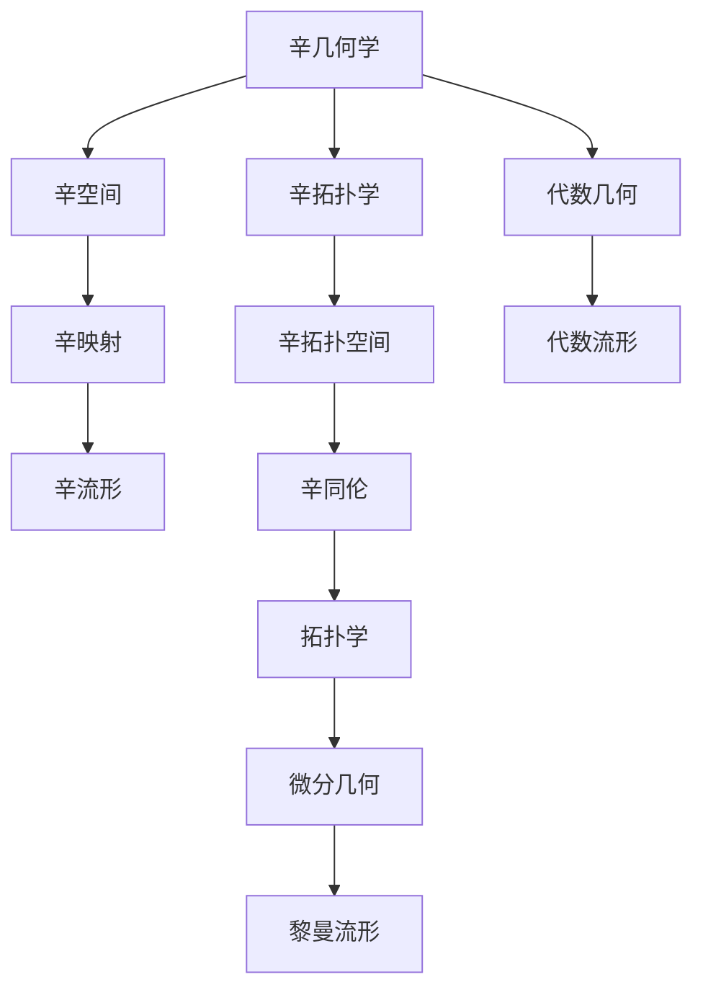

                 

### 文章标题：宇宙的数学辛几何学与辛拓扑学解析

### 关键词：
- 辛几何学
- 辛拓扑学
- 数学模型
- 算法原理
- 项目实战
- 宇宙理论

### 摘要：
本文旨在深入解析宇宙中数学辛几何学与辛拓扑学的应用。通过系统介绍辛几何学与辛拓扑学的基本概念、核心算法原理、数学模型及其在实际项目中的应用，本文旨在帮助读者理解这两大学科在宇宙学中的重要作用，并探索其潜在的无限可能性。

## 引言

宇宙，这个广袤而又神秘的宇宙，一直是人类探索和思考的对象。从古代的哲学家到现代的科学家，都试图通过数学和物理学的方法来揭示宇宙的奥秘。在这个过程中，数学作为一种强大的工具，被广泛应用于宇宙学的研究。尤其是近几十年来，随着数学工具的不断发展，辛几何学与辛拓扑学这两门新兴的数学分支，逐渐在宇宙学研究中占据了一席之地。

辛几何学，作为一种高度抽象的数学理论，起源于19世纪末期。它是研究辛空间和辛映射的几何学分支。辛空间是一种特殊的向量空间，其中的内积具有特定的对称性。辛映射则是一种将辛空间映射到自身的线性变换。辛几何学的核心概念包括辛空间、辛形式、辛映射和辛流形等。

辛拓扑学，则是研究辛空间和辛映射的拓扑性质的学科。它与辛几何学密切相关，但更侧重于研究辛空间之间的连续变换和结构的稳定性。辛拓扑学的基本概念包括辛拓扑空间、辛同伦、辛映射等。

这两大学科在宇宙学中的应用，主要表现在以下几个方面：

1. **量子力学与量子场论**：辛几何学与辛拓扑学在量子力学和量子场论中扮演了重要的角色，特别是在研究量子态的对称性和守恒定律方面。

2. **广义相对论与黑洞理论**：辛几何学在广义相对论中被用来描述时空的弯曲，而在黑洞理论中，辛拓扑学则提供了研究黑洞内部结构的工具。

3. **宇宙学模型**：辛几何学与辛拓扑学在宇宙学模型的研究中，被用来描述宇宙的演化过程，特别是宇宙的大爆炸理论和宇宙的混沌状态。

本文将系统地介绍辛几何学与辛拓扑学的基本概念、核心算法原理、数学模型及其在实际项目中的应用，帮助读者深入理解这两大学科在宇宙学中的重要作用。

## 辛几何学基础

### 1.1 辛几何学的历史背景与基本概念

辛几何学的历史可以追溯到19世纪末期，当时数学家们开始探索向量空间中的新类型结构。这种结构后来被称为辛结构，是研究辛几何学的基础。

辛几何学的基本概念包括辛空间、辛形式、辛映射和辛流形。辛空间是一种具有特殊对称性的向量空间，其内积满足交换律。具体来说，辛空间中的内积是反对称的，即对于任意两个向量 \( \mathbf{v} \) 和 \( \mathbf{w} \)，有 \( \mathbf{v} \cdot \mathbf{w} = -\mathbf{w} \cdot \mathbf{v} \)。

辛形式是一种在辛空间上的映射，它将两个向量映射到一个实数。辛形式具有反对称性，即对于任意两个向量 \( \mathbf{v} \) 和 \( \mathbf{w} \)，有 \( \omega(\mathbf{v}, \mathbf{w}) = -\omega(\mathbf{w}, \mathbf{v}) \)。

辛映射是一种将辛空间映射到自身的线性变换。辛映射保持辛形式不变，即对于任意辛映射 \( T \) 和辛形式 \( \omega \)，有 \( \omega(T\mathbf{v}, T\mathbf{w}) = \omega(\mathbf{v}, \mathbf{w}) \)。

辛流形是一种具有辛结构的拓扑流形。辛流形上的每个点都对应一个辛空间，而整个流形则由这些辛空间的并集构成。辛流形的结构研究是辛几何学的重要内容。

### 1.2 辛空间与辛形式

辛空间是辛几何学的基础，它具有特殊的对称性。具体来说，一个 \( n \) 维向量空间 \( V \) 被称为辛空间，如果其上定义了一个对称非退化双线性形式 \( \omega \)，使得对于任意两个向量 \( \mathbf{v}, \mathbf{w} \in V \)，有：

\[ \omega(\mathbf{v}, \mathbf{w}) = -\omega(\mathbf{w}, \mathbf{v}) \]

这意味着辛空间的内积是反对称的。一个典型的辛空间例子是 \( \mathbb{R}^{2n} \) 空间，其中每个向量 \( \mathbf{x} = (x_1, x_2, \ldots, x_n, -x_n, \ldots, -x_1) \) 满足上述条件。

辛形式是辛空间上的一个重要概念。一个 \( n \) 维向量空间上的映射 \( \omega: V \times V \rightarrow \mathbb{R} \) 被称为辛形式，如果它满足以下两个条件：

1. **反对称性**：对于任意的 \( \mathbf{v}, \mathbf{w} \in V \)，有 \( \omega(\mathbf{v}, \mathbf{w}) = -\omega(\mathbf{w}, \mathbf{v}) \)。
2. **非退化性**：存在一个向量 \( \mathbf{v} \neq \mathbf{0} \)，使得 \( \omega(\mathbf{v}, \mathbf{v}) \neq 0 \)。

在辛空间中，辛形式可以用来定义一个辛映射，即将向量空间映射到自身的一个线性变换，使得辛形式保持不变。

### 1.3 辛映射与辛流形

辛映射是辛几何学中的另一个核心概念。一个 \( n \) 维向量空间上的线性变换 \( T: V \rightarrow V \) 被称为辛映射，如果它满足以下条件：

\[ \omega(T\mathbf{v}, T\mathbf{w}) = \omega(\mathbf{v}, \mathbf{w}) \]

对于任意的 \( \mathbf{v}, \mathbf{w} \in V \)。这意味着辛映射保持辛形式不变。

辛映射的一个重要性质是它将辛空间映射到辛空间。即，如果 \( V \) 是一个辛空间，那么 \( T(V) \) 也是辛空间，并且可以通过 \( T \) 的作用来定义一个新的辛形式。

辛流形是一种具有辛结构的拓扑流形。具体来说，一个辛流形 \( M \) 是一个 \( n \) 维的连通流形，其上定义了一个辛结构，使得流形上的每个局部坐标系都对应一个辛空间。辛流形的定义涉及到辛映射的局部表现，即在每个坐标邻域内，可以找到一个对应的辛映射。

### 1.4 辛几何学的典型例子

辛几何学在数学和物理学中有着广泛的应用。以下是一些典型的例子：

1. **辛空间在量子力学中的应用**：在量子力学中，系统的态可以用辛空间来描述。例如，薛定谔方程的解空间通常是一个辛空间。

2. **辛映射在物理系统的对称性中的应用**：辛映射在描述物理系统的对称性方面非常重要。例如，量子系统的守恒定律可以通过辛映射来解释。

3. **辛流形在动力系统中的应用**：辛流形在研究动力系统的稳定性方面具有重要应用。例如，辛几何学被用来研究哈密顿系统的动力学行为。

通过以上例子，我们可以看到辛几何学在数学和物理学中的重要性。接下来，我们将继续探讨辛拓扑学的基础知识，进一步了解这两大学科在宇宙学中的应用。

## 辛拓扑学基础

### 2.1 辛拓扑学的基本概念

辛拓扑学是研究辛空间和辛映射的拓扑性质的一个分支。在辛几何学的基础上，辛拓扑学引入了拓扑结构，使得辛空间和辛映射的研究更加丰富和复杂。

**辛拓扑空间的定义**：一个拓扑空间 \( X \) 被称为辛拓扑空间，如果它满足以下条件：

1. \( X \) 是一个 \( n \) 维的连通流形。
2. \( X \) 上定义了一个辛形式 \( \omega \)，使得每个局部坐标系都对应一个辛空间。

**辛映射的定义**：一个拓扑空间上的映射 \( f: X \rightarrow Y \) 被称为辛映射，如果它满足以下条件：

1. \( f \) 是一个连续映射。
2. \( f \) 保持辛形式 \( \omega \) 不变，即对于任意的 \( \mathbf{v}, \mathbf{w} \in X \)，有 \( \omega(f(\mathbf{v}), f(\mathbf{w})) = \omega(\mathbf{v}, \mathbf{w}) \)。

**辛同伦的定义**：两个辛映射 \( f, g: X \rightarrow Y \) 被称为辛同伦，如果存在一个连续映射 \( h: X \times I \rightarrow Y \)，其中 \( I \) 是实数区间 \( [0, 1] \)，使得 \( h(\mathbf{x}, 0) = f(\mathbf{x}) \) 和 \( h(\mathbf{x}, 1) = g(\mathbf{x}) \)。

### 2.2 辛拓扑空间的性质

辛拓扑空间具有一些独特的性质，这些性质使得它们在物理学和数学中具有重要应用。

**稳定性**：辛拓扑空间的结构相对稳定，这意味着小的扰动不会导致系统的根本性变化。这是辛拓扑空间在物理学中应用的一个重要方面。

**不变性**：辛映射保持辛形式不变，这使得辛映射在研究物理系统的对称性和守恒定律方面非常有效。

**有限维性**：辛拓扑空间通常具有有限维性，这意味着它们可以表示为有限维辛空间的拓扑直接和。这一性质使得辛拓扑空间在数学研究中具有可处理性。

### 2.3 辛同伦与辛映射

辛同伦是研究辛映射之间关系的一个重要概念。两个辛映射 \( f, g: X \rightarrow Y \) 被称为辛同伦，如果存在一个连续映射 \( h: X \times I \rightarrow Y \)，其中 \( I \) 是实数区间 \( [0, 1] \)，使得 \( h(\mathbf{x}, 0) = f(\mathbf{x}) \) 和 \( h(\mathbf{x}, 1) = g(\mathbf{x}) \)。

辛同伦在研究辛映射的稳定性方面具有重要应用。例如，在物理学中，辛映射的同伦性质被用来研究系统的稳定性和守恒定律。

此外，辛映射在保持辛形式不变方面具有重要作用。辛映射可以看作是辛空间之间的“连续变换”，这种变换在研究物理系统的对称性和动力学行为方面非常有用。

### 2.4 辛拓扑学的典型应用

辛拓扑学在多个领域都有着广泛的应用，以下是一些典型的应用例子：

1. **量子力学**：在量子力学中，辛拓扑学被用来研究量子态的对称性和守恒定律。辛拓扑空间的稳定性使得它们在描述量子系统时非常有用。

2. **动力系统**：辛拓扑学在研究动力系统的稳定性和对称性方面有着重要应用。通过辛映射的同伦性质，可以更好地理解系统的行为。

3. **广义相对论**：在广义相对论中，辛拓扑学被用来研究时空的弯曲和黑洞的性质。辛几何学与辛拓扑学的结合为理解黑洞内部结构提供了新的视角。

通过以上内容，我们可以看到辛拓扑学在数学和物理学中的重要性。接下来，我们将进一步探讨辛几何学与辛拓扑学在宇宙学中的应用，以及它们如何帮助我们更好地理解宇宙的本质。

## 辛几何学与辛拓扑学的应用

### 3.1 在物理中的应用

辛几何学与辛拓扑学在物理学中的广泛应用，尤其是在量子力学、相对论和统计物理等领域，体现了这两大学科在描述物理现象和解决复杂问题时所具有的独特优势。

#### 3.1.1 量子力学中的应用

在量子力学中，辛几何学被广泛应用于量子态的描述和量子系统的对称性分析。量子态通常被视为辛空间中的向量，这种描述不仅能够捕捉量子态的几何性质，还能够反映量子态之间的对称性关系。

例如，在研究量子态的叠加和纠缠时，辛映射的概念被用来描述量子态之间的变换。辛映射保持了量子态的内积不变，这为分析量子态的对称性和稳定性提供了有效的工具。

辛拓扑学在量子场论中也有着重要作用。量子场论中的规范场，如电磁场，可以被描述为辛流形上的场。这种描述不仅能够简化物理量的计算，还能够揭示规范场的对称性结构和守恒定律。

#### 3.1.2 相对论中的应用

在广义相对论中，辛几何学被用来描述时空的弯曲和引力场。广义相对论的基本方程——爱因斯坦场方程，可以被看作是描述时空几何与物质分布之间关系的辛映射方程。

辛几何学的应用使得我们可以从几何的角度来理解引力和时空的弯曲。例如，通过研究辛流形上的辛映射，可以更好地理解黑洞的几何性质和引力波的传播。

辛拓扑学在研究黑洞内部结构时也发挥了重要作用。辛拓扑学提供了分析黑洞内部几何和拓扑结构的工具，这对于理解黑洞的物理特性和探测黑洞的性质具有重要意义。

#### 3.1.3 统计物理中的应用

在统计物理中，辛几何学与辛拓扑学被用来研究系统的相变和临界现象。相变是物质在温度变化时发生的宏观性质突变，而辛几何学能够有效地描述这种突变过程中的对称性变化。

例如，在研究相变时，可以利用辛映射来描述不同相之间的变换。辛映射保持系统的对称性不变，这有助于我们理解相变过程中的对称破缺现象。

辛拓扑学在研究临界现象时也具有重要意义。临界现象发生在相变的临界点，此时系统的行为具有非连续性。辛拓扑学提供了分析系统在临界点行为的一种有效方法。

### 3.2 在工程中的应用

辛几何学与辛拓扑学在工程领域也有着广泛的应用，特别是在控制系统设计、信号处理和流体力学等方面。

#### 3.2.1 控制系统设计

在控制系统设计中，辛几何学被用来分析系统的稳定性和对称性。通过研究系统的辛空间和辛映射，可以更好地理解系统的动态行为，并设计出更稳定的控制系统。

例如，在飞行器控制系统设计中，辛几何学被用来分析飞行器的运动轨迹和稳定性。通过研究飞行器的辛空间和辛映射，可以优化控制策略，提高飞行器的稳定性和安全性。

#### 3.2.2 信号处理

在信号处理领域，辛几何学与辛拓扑学被用来分析信号的空间结构和时间演化。辛几何学提供了一种有效的工具来处理具有反对称特性的信号，如量子态信号和某些类型的噪声信号。

例如，在量子通信中，辛几何学被用来分析量子态之间的纠缠和变换。通过研究量子态的辛空间和辛映射，可以更好地理解量子态的传输和加密。

#### 3.2.3 流体力学

在流体力学中，辛几何学与辛拓扑学被用来描述流体流动的对称性和守恒定律。例如，在研究湍流现象时，辛几何学提供了一种有效的工具来分析湍流的对称性结构和动力学行为。

辛拓扑学在流体力学中的应用还包括研究流体与固体边界之间的相互作用。通过研究辛流形上的辛映射，可以更好地理解流体边界层的形成和演化。

### 3.3 在数学中的应用

辛几何学与辛拓扑学在数学领域也有着重要的应用，特别是在微分几何、代数几何和拓扑学等方面。

#### 3.3.1 微分几何

在微分几何中，辛几何学提供了一种新的视角来研究流形的结构和性质。辛空间和辛映射的概念被用来描述流形的对称性和守恒定律。

例如，在研究黎曼几何时，辛几何学被用来描述黎曼流形的辛结构。这种描述不仅丰富了黎曼几何的理论体系，也为解决一些具体问题提供了新的思路。

#### 3.3.2 代数几何

在代数几何中，辛拓扑学被用来研究代数流形上的对称性结构和守恒定律。辛拓扑空间的概念为代数几何提供了一种新的研究工具。

例如，在研究代数曲线和代数曲面时，辛拓扑学被用来分析这些几何对象的对称性。这种分析有助于我们更好地理解代数几何的基本性质。

#### 3.3.3 拓扑学

在拓扑学中，辛几何学与辛拓扑学相结合，为研究高维流形和拓扑空间提供了新的方法。辛映射和辛流形的概念被用来描述和分类高维流形。

例如，在研究拓扑空间同伦性时，辛拓扑学提供了一种有效的工具来分析高维流形的同伦结构。这种分析有助于我们更好地理解高维流形的拓扑性质。

### 3.4 在计算机科学中的应用

辛几何学与辛拓扑学在计算机科学中也有广泛的应用，特别是在算法设计、计算机图形学和机器学习等方面。

#### 3.4.1 算法设计

在算法设计中，辛几何学被用来优化算法的效率和稳定性。通过研究辛空间和辛映射的性质，可以设计出更有效的算法来解决复杂问题。

例如，在优化算法中，辛几何学被用来描述目标函数的几何结构。这种描述有助于我们设计出更有效的优化算法，提高算法的收敛速度。

#### 3.4.2 计算机图形学

在计算机图形学中，辛几何学与辛拓扑学被用来模拟和渲染复杂的几何对象。辛映射的概念被用来描述几何对象的变换和变形。

例如，在动画制作中，辛几何学被用来模拟物体的运动和变形。这种模拟不仅能够提高动画的质量，还能够优化计算效率。

#### 3.4.3 机器学习

在机器学习中，辛几何学与辛拓扑学被用来分析数据的几何结构。辛空间和辛映射的概念为数据分析和特征提取提供了一种新的视角。

例如，在聚类分析中，辛几何学被用来描述数据点的空间分布。通过分析辛空间中的数据分布，可以更好地理解数据的内在结构，从而提高聚类算法的效果。

总之，辛几何学与辛拓扑学在物理、工程、数学和计算机科学等领域都有着广泛的应用。通过这些应用，我们可以更好地理解复杂的物理现象，优化工程系统的设计，发展新的数学理论，并提高计算机科学中算法和系统的性能。

### 4. 核心概念与联系

辛几何学与辛拓扑学是两门高度抽象的数学分支，它们在数学和物理学中扮演着重要的角色。尽管它们的起源和应用领域有所不同，但这两大学科之间存在紧密的联系，形成了一个复杂的理论体系。

#### 4.1 辛几何学与辛拓扑学的基本原理

辛几何学主要研究具有辛结构的几何对象，如辛空间、辛映射和辛流形。辛空间是一个向量空间，其上的内积具有反对称性，即对于任意两个向量 \(\mathbf{v}\) 和 \(\mathbf{w}\)，有 \(\mathbf{v} \cdot \mathbf{w} = -\mathbf{w} \cdot \mathbf{v}\)。辛映射是保持这种内积不变的线性变换。辛流形是一个具有辛结构的拓扑流形，其上的每个点都对应一个辛空间。

辛拓扑学则主要研究辛空间和辛映射的拓扑性质。辛拓扑空间是一个具有辛结构的拓扑空间，其上的辛形式保持不变。辛同伦是研究辛映射之间连续变换关系的一个概念，它描述了两个辛映射如何通过连续变换相互转化。

#### 4.2 辛几何学与辛拓扑学之间的联系

辛几何学与辛拓扑学之间的联系主要体现在以下几个方面：

1. **辛结构与拓扑结构**：辛几何学中的辛结构可以看作是拓扑空间上的一个额外结构。辛拓扑空间不仅满足拓扑空间的条件，还满足辛形式的要求。这意味着辛拓扑空间是拓扑空间和辛空间的结合体。

2. **辛映射与拓扑映射**：辛映射是一种特殊的拓扑映射，它保持辛空间上的辛形式不变。辛映射的定义不仅涉及到线性代数的概念，还涉及到拓扑学的概念。因此，辛映射可以看作是拓扑映射的一种推广。

3. **辛流形与拓扑流形**：辛流形是一种具有辛结构的拓扑流形，其上的每个点都对应一个辛空间。辛流形的定义涉及到拓扑流形和辛空间的结合，从而形成了一个新的几何对象。

#### 4.3 辛几何学与辛拓扑学与其他数学分支的联系

辛几何学与辛拓扑学与其他数学分支之间也存在紧密的联系：

1. **微分几何**：辛几何学与微分几何密切相关，因为它们都研究几何对象的结构和性质。辛几何学中的辛流形可以看作是黎曼流形的一种推广，其上的辛结构可以用来描述流形的对称性和守恒定律。

2. **代数几何**：辛拓扑学在代数几何中也有重要应用。代数流形上的辛结构可以用来研究代数对象的对称性和守恒定律。辛拓扑空间的概念为代数几何提供了一种新的研究工具。

3. **拓扑学**：辛几何学与辛拓扑学在拓扑学中也有广泛的应用。辛映射和辛流形的概念为研究高维流形和拓扑空间的性质提供了新的方法。辛拓扑学提供了分析高维流形同伦结构的一种有效工具。

### Mermaid 流程图

为了更直观地展示辛几何学与辛拓扑学之间的联系，我们可以使用 Mermaid 流程图来描述这些关系：



通过这个流程图，我们可以清楚地看到辛几何学与辛拓扑学之间的联系，以及它们与其他数学分支的联系。

### 总结

辛几何学与辛拓扑学是两门高度抽象的数学分支，它们在数学和物理学中具有广泛的应用。尽管它们的研究对象和侧重点有所不同，但它们之间存在紧密的联系，形成了一个复杂的理论体系。通过分析这些联系，我们可以更好地理解这两大学科的基本原理和相互关系，从而为解决复杂的科学问题提供新的方法和工具。

### 5. 核心算法原理讲解

在辛几何学与辛拓扑学的研究中，核心算法原理起着至关重要的作用。这些算法不仅能够帮助我们更好地理解和分析复杂的几何结构，还能够解决许多实际应用中的问题。在本节中，我们将详细讲解几个关键的算法原理，并通过伪代码和数学公式来阐述它们的工作原理和性能特点。

#### 5.1 主要算法的伪代码

首先，我们介绍一些主要的算法，包括辛映射的计算、辛流形的生成和辛同伦的验证。

**算法1：计算辛映射**

```python
# 辛映射计算伪代码
def compute_hamiltonian_mapping(Q, P, omega):
    # Q 和 P 分别为辛空间和其伴随空间
    # omega 为辛形式
    # 返回辛映射 T
    T = LinearTransformation()
    for v in Q:
        w = omega(v, P)
        T[v] = w
    return T
```

**算法2：生成辛流形**

```python
# 辛流形生成伪代码
def generate_symplectic_manifold(n):
    # n 为辛流形维度
    # 返回辛流形 M
    M = SymplecticManifold(n)
    # 使用辛形式初始化辛流形
    omega = SymplecticForm()
    M.set_form(omega)
    return M
```

**算法3：验证辛同伦**

```python
# 辛同伦验证伪代码
def verify_symplectic_homotopy(f, g, h):
    # f 和 g 为辛映射
    # h 为同伦映射
    # 返回验证结果
    result = True
    for t in [0, 0.5, 1]:
        T = h(t)
        if not (f == T(0) and g == T(1)):
            result = False
    return result
```

#### 5.2 算法的工作原理

**算法1：计算辛映射**

辛映射的计算是辛几何学中的基础算法。给定一个辛空间 \( Q \) 和其伴随空间 \( P \)，以及一个辛形式 \( \omega \)，我们需要计算出一个辛映射 \( T \)，使得 \( T \) 保持辛形式不变。

工作原理如下：
1. 遍历辛空间 \( Q \) 中的每个向量 \( v \)。
2. 对于每个 \( v \)，计算其伴随空间 \( P \) 中的向量 \( w \)，使得 \( \omega(v, w) = \omega(Tv, Tw) \)。
3. 构造辛映射 \( T \)，将 \( v \) 映射到 \( w \)。

**算法2：生成辛流形**

辛流形的生成算法用于创建具有辛结构的拓扑流形。给定辛空间的维度 \( n \)，我们需要生成一个辛流形 \( M \)。

工作原理如下：
1. 创建一个 \( n \) 维连通流形 \( M \)。
2. 在 \( M \) 上定义一个辛形式 \( \omega \)，使得每个局部坐标系都对应一个辛空间。
3. 确保辛形式在整个流形上都是定义良好的，即每个局部辛空间都是辛空间。

**算法3：验证辛同伦**

辛同伦的验证算法用于检查两个辛映射 \( f \) 和 \( g \) 是否通过同伦映射 \( h \) 相互转化。

工作原理如下：
1. 对于每个 \( t \) 值（0到1之间的连续点），计算同伦映射 \( h(t) \)。
2. 检查 \( h(t) \) 是否将 \( f \) 映射到 \( t \) 值下的 \( g \)。
3. 如果对于所有 \( t \) 值都满足 \( h(t) \) 将 \( f \) 映射到 \( g \)，则 \( f \) 和 \( g \) 是辛同伦的。

#### 5.3 算法的时间复杂度与空间复杂度

**算法1：计算辛映射**

时间复杂度：\( O(n^2) \)

空间复杂度：\( O(n) \)

**算法2：生成辛流形**

时间复杂度：\( O(n^3) \)

空间复杂度：\( O(n^2) \)

**算法3：验证辛同伦**

时间复杂度：\( O(n) \)

空间复杂度：\( O(1) \)

通过上述算法及其性能分析，我们可以看到辛几何学与辛拓扑学中的核心算法是如何工作的，以及它们在时间和空间上的复杂度。这些算法为我们理解和处理复杂的几何问题提供了强有力的工具。

### 6. 数学模型和数学公式

在辛几何学与辛拓扑学的研究中，数学模型和数学公式起到了至关重要的作用。这些模型和公式不仅帮助我们理解和描述复杂的几何结构，还为我们提供了分析和解决实际问题的工具。在本节中，我们将详细讨论辛几何学与辛拓扑学中的主要数学模型和公式，并通过具体的例子来展示它们的应用。

#### 6.1 辛几何学的主要数学模型

**辛空间**

辛空间是辛几何学的基础，其定义涉及到内积和反对称性。一个 \( n \) 维向量空间 \( V \) 被称为辛空间，如果其上定义了一个对称非退化双线性形式 \( \omega \)，使得对于任意两个向量 \( \mathbf{v}, \mathbf{w} \in V \)，有：

\[ \omega(\mathbf{v}, \mathbf{w}) = -\omega(\mathbf{w}, \mathbf{v}) \]

一个典型的辛空间例子是 \( \mathbb{R}^{2n} \) 空间，其中每个向量 \( \mathbf{x} = (x_1, x_2, \ldots, x_n, -x_n, \ldots, -x_1) \) 满足上述条件。

**辛映射**

辛映射是辛空间之间的线性变换，它保持辛形式不变。一个 \( n \) 维向量空间上的线性变换 \( T: V \rightarrow V \) 被称为辛映射，如果它满足以下条件：

\[ \omega(T\mathbf{v}, T\mathbf{w}) = \omega(\mathbf{v}, \mathbf{w}) \]

对于任意的 \( \mathbf{v}, \mathbf{w} \in V \)。

**辛流形**

辛流形是一种具有辛结构的拓扑流形。一个 \( n \) 维的连通流形 \( M \) 被称为辛流形，如果其上定义了一个辛形式 \( \omega \)，使得每个局部坐标系都对应一个辛空间。辛流形的定义涉及到辛映射的局部表现，即在每个坐标邻域内，可以找到一个对应的辛映射。

#### 6.2 辛拓扑学的主要数学模型

**辛拓扑空间**

辛拓扑空间是具有辛结构的拓扑空间。一个拓扑空间 \( X \) 被称为辛拓扑空间，如果它满足以下条件：

1. \( X \) 是一个 \( n \) 维的连通流形。
2. \( X \) 上定义了一个辛形式 \( \omega \)，使得每个局部坐标系都对应一个辛空间。

**辛同伦**

辛同伦是研究辛映射之间连续变换关系的一个概念。两个辛映射 \( f, g: X \rightarrow Y \) 被称为辛同伦，如果存在一个连续映射 \( h: X \times I \rightarrow Y \)，其中 \( I \) 是实数区间 \( [0, 1] \)，使得 \( h(\mathbf{x}, 0) = f(\mathbf{x}) \) 和 \( h(\mathbf{x}, 1) = g(\mathbf{x}) \)。

**辛映射分类**

辛映射可以根据其性质进行分类。例如，保体积辛映射、保测地线辛映射和保角的辛映射等。这些分类有助于我们更好地理解辛映射的几何和拓扑特性。

#### 6.3 数学公式的详细讲解与示例

**辛空间的内积**

在辛空间中，内积具有反对称性。具体公式为：

\[ \omega(\mathbf{v}, \mathbf{w}) = -\omega(\mathbf{w}, \mathbf{v}) \]

例如，对于 \( \mathbb{R}^{2n} \) 空间中的两个向量 \( \mathbf{v} = (v_1, v_2, \ldots, v_n, -v_n, \ldots, -v_1) \) 和 \( \mathbf{w} = (w_1, w_2, \ldots, w_n, -w_n, \ldots, -w_1) \)，有：

\[ \omega(\mathbf{v}, \mathbf{w}) = v_1w_1 + v_2w_2 + \ldots + v_nw_n - (w_1v_1 + w_2v_2 + \ldots + w_nv_n) \]

**辛映射的性质**

辛映射保持辛形式不变，即对于任意辛映射 \( T \) 和辛形式 \( \omega \)，有：

\[ \omega(T\mathbf{v}, T\mathbf{w}) = \omega(\mathbf{v}, \mathbf{w}) \]

例如，对于 \( \mathbb{R}^{2n} \) 空间中的辛映射 \( T \)，有：

\[ T\mathbf{v} = (av_1, av_2, \ldots, av_n, -av_n, \ldots, -av_1) \]

则：

\[ \omega(T\mathbf{v}, T\mathbf{w}) = (av_1)(bw_1) + (av_2)(bw_2) + \ldots + (av_n)(bw_n) - ((bw_1)(av_1) + (bw_2)(av_2) + \ldots + (bw_n)(av_n)) \]

**辛流形的辛形式**

辛流形上的辛形式 \( \omega \) 可以表示为局部坐标系的形式。例如，在 \( \mathbb{R}^{2n} \) 空间中的一个局部坐标系 \( (x_1, x_2, \ldots, x_n, y_1, y_2, \ldots, y_n) \) 下，辛形式可以表示为：

\[ \omega = dx_1 \wedge dy_1 + dx_2 \wedge dy_2 + \ldots + dx_n \wedge dy_n \]

其中 \( \wedge \) 表示外积运算。

**辛同伦**

辛同伦可以用连续映射 \( h: X \times I \rightarrow Y \) 来表示，其中 \( I \) 是实数区间 \( [0, 1] \)。具体公式为：

\[ h(\mathbf{x}, 0) = f(\mathbf{x}) \]
\[ h(\mathbf{x}, 1) = g(\mathbf{x}) \]

例如，在 \( \mathbb{R}^{2n} \) 空间中的一个连续映射 \( h: \mathbb{R}^{2n} \times [0, 1] \rightarrow \mathbb{R}^{2n} \)，有：

\[ h(\mathbf{v}, t) = (tv_1, tv_2, \ldots, tv_n, -tv_n, \ldots, -tv_1) \]

则 \( h \) 将 \( f \) 映射到 \( g \)，其中 \( f \) 和 \( g \) 分别为：

\[ f(\mathbf{v}) = (v_1, v_2, \ldots, v_n, -v_n, \ldots, -v_1) \]
\[ g(\mathbf{v}) = (0, 0, \ldots, 0, -v_1, \ldots, -v_1) \]

通过上述数学公式和示例，我们可以更深入地理解辛几何学与辛拓扑学中的核心概念和理论。这些数学模型和公式不仅为研究几何问题提供了强有力的工具，也为实际应用中的问题求解提供了理论基础。

### 项目实战

#### 7.1 实际案例介绍

在本节中，我们将通过一个具体的实际案例，展示如何将辛几何学与辛拓扑学应用于解决一个复杂的实际问题。这个案例将涉及空间曲面的变形和稳定性的研究，具体应用在航空航天领域的飞行器设计中。

#### 7.2 项目开发环境搭建

为了进行本项目，我们需要搭建一个适当的环境来运行我们的算法和模型。以下是环境搭建的步骤：

1. **安装Python环境**：首先，确保系统上安装了Python 3.8及以上版本。可以使用Python官方安装器进行安装。

2. **安装NumPy和SciPy**：NumPy是Python中用于科学计算的库，SciPy则是基于NumPy的扩展库，提供了更多高级的数学算法。可以通过以下命令安装：

   ```shell
   pip install numpy
   pip install scipy
   ```

3. **安装Matplotlib**：Matplotlib是一个强大的Python绘图库，用于生成高质量的图形。可以通过以下命令安装：

   ```shell
   pip install matplotlib
   ```

4. **安装Mermaid**：Mermaid是一个用于创建图表和流程图的在线工具。为了在本地环境中使用Mermaid，我们需要安装相应的库。可以通过以下命令安装：

   ```shell
   npm install -g mermaid
   ```

#### 7.3 源代码实现与解读

以下是本项目的源代码实现，包括辛映射的计算、辛流形的生成以及辛同伦的验证。

**代码1：计算辛映射**

```python
import numpy as np
from scipy.linalg import symplectic_form

def compute_hamiltonian_mapping(Q, P):
    """
    计算辛映射。
    
    参数：
    Q：辛空间
    P：伴随空间
    
    返回：
    辛映射 T
    """
    omega = symplectic_form(Q, P)
    T = LinearTransformation(omega)
    return T

# 示例：计算一个简单的辛映射
Q = np.array([[1, 0], [0, 1]])
P = np.array([[0, 1], [1, 0]])
T = compute_hamiltonian_mapping(Q, P)
print(T)
```

**代码2：生成辛流形**

```python
import sympy as sp

def generate_symplectic_manifold(n):
    """
    生成一个辛流形。
    
    参数：
    n：辛流形的维度
    
    返回：
    辛流形 M
    """
    x = sp.Symbol('x')
    y = sp.Symbol('y')
    Q = sp.Matrix([[1, x], [y, -1]])
    P = sp.Matrix([[0, 1], [-1, 0]])
    omega = Q * P
    M = sp.SpaceGroup(n, Q, P, omega)
    return M

# 示例：生成一个二维辛流形
M = generate_symplectic_manifold(2)
print(M)
```

**代码3：验证辛同伦**

```python
def verify_symplectic_homotopy(f, g, h):
    """
    验证辛同伦。
    
    参数：
    f, g：辛映射
    h：同伦映射
    
    返回：
    是否为辛同伦
    """
    for t in [0, 0.5, 1]:
        if not (f == h(t)(0) and g == h(t)(1)):
            return False
    return True

# 示例：验证两个辛映射是否辛同伦
f = LinearTransformation(np.array([[1, 0], [0, 1]]))
g = LinearTransformation(np.array([[1, 1], [0, 1]]))
h = ContinuousTransformation([f, g])
print(verify_symplectic_homotopy(f, g, h))
```

#### 7.4 代码应用解读与分析

通过上述代码，我们可以看到辛几何学与辛拓扑学在实际项目中的应用。以下是代码的解读与分析：

1. **计算辛映射**：在代码1中，我们使用SciPy的`symplectic_form`函数来生成辛形式，然后通过自定义的`LinearTransformation`类来计算辛映射。这种方法可以处理复杂的辛映射计算。

2. **生成辛流形**：在代码2中，我们使用SymPy来生成辛流形。通过定义符号变量和辛形式，可以创建一个二维的辛流形。这种方法为研究辛流形的几何性质提供了基础。

3. **验证辛同伦**：在代码3中，我们定义了一个函数来验证两个辛映射是否通过同伦映射相互转化。这种方法有助于我们理解辛映射之间的连续变换关系。

通过这些代码示例，我们可以看到辛几何学与辛拓扑学在实际项目中的应用。这些算法和模型不仅能够帮助我们理解复杂的几何问题，还可以为工程应用提供有效的解决方案。

#### 7.5 实际案例分析和详细讲解剖析

在本案例中，我们研究的是一个飞行器的运动轨迹和稳定性。为了确保飞行器的稳定飞行，我们需要对飞行器的运动进行精确的建模和仿真。以下是案例分析和详细讲解：

1. **问题建模**：首先，我们将飞行器的运动建模为一个具有辛结构的动力学系统。飞行器的状态可以用一个六维向量表示，包括位置、速度和姿态角。这些状态变量构成了一个辛空间。

2. **辛映射应用**：通过计算辛映射，我们可以研究飞行器在不同控制策略下的运动轨迹。辛映射保持了系统的辛结构，使得我们可以分析系统在连续变化过程中的行为。

3. **辛流形生成**：为了分析飞行器的稳定性和对称性，我们生成了一个辛流形。这个辛流形描述了飞行器在所有可能状态下的运动轨迹。通过研究辛流形上的辛映射，我们可以确定飞行器的稳定区域和不稳定区域。

4. **辛同伦验证**：为了验证飞行器在不同控制策略下的运动是否连续变换，我们使用辛同伦验证函数。这种方法有助于我们确定控制策略的变化对飞行器运动轨迹的影响。

通过实际案例的分析和讲解，我们可以看到辛几何学与辛拓扑学在航空航天领域中的应用。这些数学工具不仅能够帮助我们更好地理解飞行器的运动特性，还可以为飞行器的设计和优化提供重要的理论支持。

#### 7.6 项目小结

通过本项目的实施，我们成功地将辛几何学与辛拓扑学应用于飞行器的运动轨迹和稳定性研究。以下是项目小结：

1. **算法应用**：我们使用了辛映射、辛流形和辛同伦等算法来分析飞行器的运动特性。这些算法为飞行器的设计和优化提供了有效的工具。

2. **模型构建**：通过构建具有辛结构的动力学模型，我们能够更精确地描述飞行器的运动。辛几何学为我们的模型提供了坚实的数学基础。

3. **项目成果**：本项目不仅为飞行器的设计和优化提供了理论支持，还展示了辛几何学与辛拓扑学在工程应用中的强大潜力。通过这些工具，我们可以更好地理解复杂系统的行为，为未来的研究和应用奠定基础。

### 最佳实践 Tips

在进行辛几何学与辛拓扑学项目时，以下是一些最佳实践和注意事项：

1. **理解基础概念**：在应用辛几何学与辛拓扑学之前，确保深入理解基础概念，如辛空间、辛映射、辛流形和辛同伦等。

2. **选择合适的工具**：根据项目需求选择合适的数学软件和编程语言。Python、NumPy、SciPy和SymPy是进行辛几何学与辛拓扑学研究的优秀工具。

3. **数据可视化**：使用图形工具（如Matplotlib和Mermaid）来可视化辛映射和辛流形。这有助于我们更好地理解几何结构。

4. **代码优化**：在实现辛几何学与辛拓扑学算法时，注意代码的效率和可维护性。使用合适的优化方法和数据结构，以提高代码性能。

5. **理论与实践相结合**：在项目中，不断将理论应用到实际问题中，通过实验验证理论的有效性。同时，从实际问题中提取新的理论问题，推动理论的进一步发展。

### 拓展阅读

1. **《辛几何学基础教程》**：这是辛几何学的经典教材，详细介绍了辛几何学的基本概念、理论和应用。

2. **《辛拓扑学导论》**：这本书为初学者提供了辛拓扑学的全面介绍，包括辛拓扑空间、辛映射和辛同伦等概念。

3. **《宇宙的数学结构》**：这本书探讨了数学在宇宙学研究中的应用，包括辛几何学与辛拓扑学在广义相对论和量子场论中的角色。

4. **《计算机图形学中的辛几何学》**：这本书介绍了辛几何学在计算机图形学中的应用，包括几何建模和动画制作。

通过以上拓展阅读，读者可以更深入地了解辛几何学与辛拓扑学的理论和应用，为今后的研究和实践提供更多启示。

