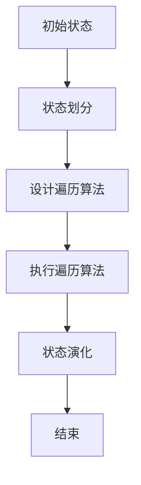

                 

# 宇宙的数学遍历理论探讨

## 关键词

宇宙、数学、遍历理论、数学模型、算法、应用实例

## 摘要

本文旨在探讨宇宙的数学遍历理论，介绍其基本概念、理论框架、应用实例以及未来展望。宇宙的数学遍历理论是一种将数学与宇宙学相结合的研究方法，通过对宇宙状态的数学描述和遍历算法的研究，揭示宇宙演化的内在规律。本文将首先介绍宇宙、数学和遍历理论的基本概念，然后详细阐述宇宙的数学遍历理论的核心原理，并探讨其在不同领域的应用。最后，本文将对宇宙的数学遍历理论面临的挑战和未来发展方向进行展望。

## 引言

### 宇宙与数学

宇宙是所有物质和能量的总和，包括星球、星系、黑洞等。宇宙学研究的是宇宙的结构、演化、起源和终极命运。而数学则是一种用于描述宇宙的抽象语言，包括几何、代数、微积分等。数学在宇宙学研究中的作用非常重要，它不仅为宇宙学提供了有力的工具，也帮助人类更深入地理解宇宙的本质。

### 遍历理论简介

遍历理论是数学中研究随机过程和动力系统的一种理论，主要研究系统在长时间内如何遍历其状态空间。在遍历理论中，一个系统可能经历多种状态，但在长期演化过程中，最终会遍历其状态空间中的所有状态。这一理论在物理学、经济学、生物学等领域都有广泛的应用。

### 宇宙的数学遍历理论的提出与发展

宇宙的数学遍历理论是将数学和宇宙学相结合的一种研究方法。它通过对宇宙状态的数学描述和遍历算法的研究，试图揭示宇宙演化的内在规律。这一理论最早可以追溯到20世纪初，随着数学和宇宙学的发展，逐渐形成了一套完整的理论体系。

## 数学基础

### 数学工具与方法

在探讨宇宙的数学遍历理论之前，我们需要了解一些基本的数学工具和方法。这些工具和方法包括：

1. **集合论**：集合论是数学的基础，它用于描述宇宙中的物体和关系。
2. **拓扑学**：拓扑学研究空间的性质，包括连通性、紧致性等，这在宇宙研究中非常重要。
3. **概率论**：概率论用于描述宇宙中随机事件的发生概率，这是研究宇宙演化的重要工具。
4. **微积分**：微积分用于研究宇宙中的连续变化，如宇宙的膨胀、星系的形成等。

### 宇宙的数学描述

宇宙的数学描述通常使用多元函数来表示。这些函数描述了宇宙中各个物体的位置、速度、能量等。例如，一个简单的宇宙模型可以表示为：

$$ X(t) = f(X(t-1), t) $$

其中，$X(t)$ 表示宇宙在时间 $t$ 的状态，$f$ 表示宇宙状态的演化规则。

### 遍历理论的基本概念

遍历理论的核心概念是遍历性。一个系统如果在长时间内遍历其状态空间中的所有状态，我们称该系统具有遍历性。在宇宙的数学遍历理论中，我们研究的是宇宙在长时间内如何遍历其所有可能的状态。

## 理论框架

### 宇宙的数学遍历理论的核心原理

宇宙的数学遍历理论的核心原理可以概括为以下几点：

1. **状态空间的划分**：宇宙的状态空间可以被划分为若干个子空间，每个子空间代表宇宙的一种可能状态。
2. **遍历算法的设计**：设计一种能够遍历宇宙状态空间中的所有状态的算法。
3. **宇宙状态的演化**：研究宇宙状态的演化过程，理解宇宙在长时间内的行为。

### 数学模型与算法

宇宙的数学遍历理论涉及多种数学模型和算法，以下是其中两种重要的模型和算法：

1. **马尔可夫模型**：马尔可夫模型是一种用于描述随机过程的数学模型，它可以用来模拟宇宙状态的演化。
2. **分治算法**：分治算法是一种用于解决大规模问题的算法，它可以用来高效地遍历宇宙的状态空间。

### 宇宙的数学遍历理论的Mermaid流程图

为了更直观地理解宇宙的数学遍历理论，我们可以使用Mermaid流程图来描述其核心流程。以下是一个简单的Mermaid流程图示例：

## 应用实例

### 宇宙探索中的应用

宇宙的数学遍历理论在宇宙探索中有着广泛的应用。例如，科学家可以使用这一理论来模拟宇宙的演化过程，预测宇宙的未来状态。通过设计合适的遍历算法，科学家可以快速地遍历宇宙的状态空间，找到宇宙演化过程中的关键节点。

### 宇宙物理学中的应用

在宇宙物理学中，宇宙的数学遍历理论可以帮助研究者理解宇宙中的物理现象。例如，通过研究宇宙的状态空间和遍历算法，科学家可以揭示黑洞的形成机制、宇宙背景辐射的起源等。

### 宇宙生物学中的应用

在宇宙生物学中，宇宙的数学遍历理论可以用于研究生命的起源和演化。通过模拟宇宙的状态空间和遍历算法，科学家可以探索生命在不同环境下的适应策略，预测生命的未来演化方向。

## 挑战与展望

### 宇宙的数学遍历理论面临的挑战

尽管宇宙的数学遍历理论在宇宙学、物理学、生物学等领域有着广泛的应用，但它也面临着一些挑战：

1. **复杂性**：宇宙的状态空间极其庞大，设计高效的遍历算法是一个巨大的挑战。
2. **不确定性**：宇宙中的许多现象都具有不确定性，这给遍历算法的设计和实现带来了困难。
3. **计算资源**：大规模的宇宙状态空间遍历需要大量的计算资源，这给计算能力的提升提出了要求。

### 未来发展方向

随着数学和计算机技术的发展，宇宙的数学遍历理论有着广阔的发展前景。未来的研究可以集中在以下几个方面：

1. **算法优化**：研究更高效的遍历算法，提高计算效率。
2. **多学科交叉**：将宇宙的数学遍历理论与其他学科相结合，探索新的应用领域。
3. **理论完善**：进一步完善宇宙的数学遍历理论，提高其解释能力和预测能力。

## 总结

宇宙的数学遍历理论是一种将数学与宇宙学相结合的研究方法，通过对宇宙状态的数学描述和遍历算法的研究，揭示了宇宙演化的内在规律。本文介绍了宇宙的数学遍历理论的基本概念、理论框架、应用实例以及未来展望。随着数学和计算机技术的不断发展，宇宙的数学遍历理论将在宇宙学、物理学、生物学等领域发挥越来越重要的作用。

### 作者

作者：AI天才研究院/AI Genius Institute & 禅与计算机程序设计艺术 /Zen And The Art of Computer Programming

## 目录大纲

- 引言
  - 宇宙与数学
  - 遍历理论简介
  - 宇宙的数学遍历理论的提出与发展
- 数学基础
  - 数学工具与方法
  - 宇宙的数学描述
  - 遍历理论的基本概念
- 理论框架
  - 宇宙的数学遍历理论的核心原理
  - 数学模型与算法
  - 宇宙的数学遍历理论的Mermaid流程图
- 应用实例
  - 宇宙探索中的应用
  - 宇宙物理学中的应用
  - 宇宙生物学中的应用
- 挑战与展望
  - 宇宙的数学遍历理论面临的挑战
  - 未来发展方向

## 最佳实践 Tips

- 在研究宇宙的数学遍历理论时，要充分理解数学和宇宙学的基本概念，这有助于更好地设计和实现遍历算法。
- 在实际应用中，要关注宇宙的状态空间和遍历算法的效率，这直接影响到研究的精确度和计算成本。
- 对于复杂的宇宙状态空间，可以考虑使用分治算法来提高遍历效率。
- 定期回顾和更新遍历算法，以适应新的理论发展和计算资源的变化。

## 注意事项

- 在进行宇宙的数学遍历理论研究时，要确保数据的准确性和完整性，避免因数据问题导致的研究偏差。
- 在设计遍历算法时，要充分考虑宇宙状态空间的不确定性和随机性，确保算法的鲁棒性和稳定性。
- 在实际应用中，要遵循科研伦理，确保研究结果的公正性和客观性。

## 拓展阅读

- [1] Hawking, S. W., & Mlodinow, L. (2010). 《大设计：我们的宇宙，我们自己》。
- [2] Penrose, R. (2005). 《宇宙的大设计：一个科学的探索》。
- [3] Ruse, M. (2014). 《科学、神学与宇宙：从宇宙大爆炸到智能设计》。

## 附录

- 附录A：宇宙的数学模型与算法的详细说明
- 附录B：宇宙状态空间遍历算法的伪代码实现
- 附录C：宇宙的数学遍历理论在宇宙生物学中的应用实例分析

[本文内容仅代表作者个人观点，不构成任何投资建议或决策依据。]

