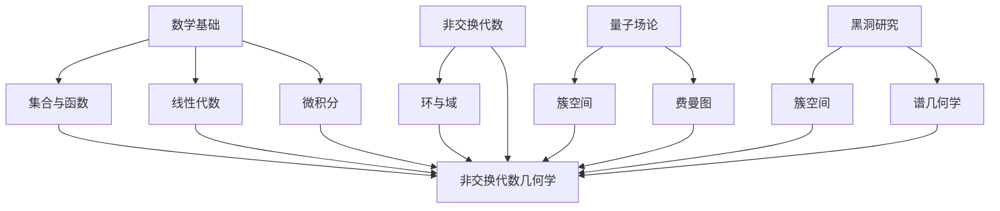

                 


## 背景介绍

### 宇宙学的兴起与发展

宇宙学是研究宇宙的起源、结构、演化和最终命运的学科。自人类文明诞生以来，对宇宙的探索和理解一直是人类智慧的瑰宝。从古代天文学到现代宇宙学，人类对宇宙的认识不断深化，科技进步带来了观测手段的突破，使得宇宙学的理论体系更加完善。

宇宙学的发展可以分为几个重要阶段。早期，人们基于直观观测，提出了地心说、日心说等宇宙模型。随着伽利略、开普勒等人的研究，人们开始理解行星运动的规律。牛顿的万有引力定律和爱因斯坦的广义相对论为宇宙学提供了坚实的理论基础，使人们能够更好地理解宇宙的宏观结构和运动规律。

进入20世纪，宇宙学的研究进入了快速发展的阶段。哈勃发现了宇宙膨胀的现象，这一发现为宇宙大爆炸理论提供了有力的证据。随着对宇宙微波背景辐射的发现，人类对宇宙早期状态的理解更加深入。近年来，宇宙学的研究逐渐向大尺度结构形成、暗物质、暗能量等领域拓展。

### 数学在宇宙学中的应用

数学作为宇宙学的工具，贯穿了宇宙学研究的各个阶段。从简单的几何学、代数学，到复杂的微积分、群论、拓扑学，数学为宇宙学提供了精确的语言和描述方法。

几何学在宇宙学中的应用非常广泛。从欧几里得几何到非欧几何，再到现代的广义相对论几何，几何学为宇宙学提供了一种描述时空弯曲的方法。广义相对论中的时空几何学，使我们能够理解重力作为时空的弯曲现象，以及宇宙的膨胀和结构形成。

代数学在宇宙学中也有着重要的应用。特别是在量子场论和黑洞研究中，代数学提供了处理复杂系统的数学工具。例如，量子场论中的非交换代数，使我们能够描述粒子的量子态和相互作用。

微积分在宇宙学中主要用于描述宇宙的动态变化。通过微分方程，我们可以描述宇宙的膨胀、星系的形成和演化等过程。例如，哈勃定律就是基于对宇宙膨胀的微分方程推导得出的。

群论和拓扑学在宇宙学中的应用也越来越受到关注。群论可以用来研究对称性破缺和宇宙的结构形成，而拓扑学则为我们提供了理解宇宙拓扑结构的新视角。

### 非交换代数几何学的兴起

非交换代数几何学是代数几何学的一个分支，它研究非交换代数结构上的几何对象。在传统代数几何学中，我们主要研究线性代数和交换代数上的几何对象，如线性空间、多项式环和它们的零点集。然而，在物理学和宇宙学中，特别是在量子场论和黑洞研究中，非交换代数几何学提供了重要的数学工具。

非交换代数几何学的兴起可以追溯到量子场论的发展。在量子场论中，粒子的状态和相互作用可以通过非交换代数结构来描述。例如，量子场论中的费曼图就是基于非交换代数几何学中的簇空间（cluster spaces）。

此外，非交换代数几何学也在黑洞研究中发挥了重要作用。黑洞的几何特性，如奇点和事件视界，可以通过非交换代数几何学来描述。例如，霍金和罗杰斯的黑洞熵公式就是基于非交换代数几何学中的簇空间和谱几何学。

### 宇宙的数学非交换代数几何学特性探讨的意义

探讨宇宙的数学非交换代数几何学特性，不仅有助于我们更好地理解宇宙的起源、演化和结构，还有助于推动数学和物理学的发展。以下是一些探讨宇宙的数学非交换代数几何学特性的意义：

1. **理解宇宙的起源和演化**：通过非交换代数几何学，我们可以更深入地理解宇宙的早期状态和宇宙膨胀的过程。这有助于我们回答关于宇宙起源的许多基本问题。

2. **探索宇宙的结构**：非交换代数几何学为我们提供了新的工具，使我们能够更好地理解宇宙中的结构，如星系、星系团和宇宙背景辐射。

3. **推动数学和物理学的发展**：非交换代数几何学的应用不仅限于宇宙学，它还在其他领域，如量子场论、弦理论和凝聚态物理学中发挥了重要作用。探讨宇宙的数学非交换代数几何学特性有助于推动这些领域的发展。

4. **探索量子引力和宇宙学统一理论**：非交换代数几何学在量子引力和宇宙学统一理论的研究中具有重要意义。通过探讨宇宙的数学非交换代数几何学特性，我们可能找到实现量子引力和宇宙学统一理论的新途径。

### 总结

在本文中，我们介绍了宇宙学、数学以及非交换代数几何学的基本概念和发展历程。我们探讨了数学在宇宙学中的应用，特别是非交换代数几何学在量子场论和黑洞研究中的重要作用。最后，我们讨论了探讨宇宙的数学非交换代数几何学特性的意义，包括理解宇宙的起源、演化、结构，推动数学和物理学的发展，以及探索量子引力和宇宙学统一理论。

本文旨在为读者提供一个关于宇宙的数学非交换代数几何学特性的概述，激发读者对这一领域的兴趣，并引导读者进一步深入研究和探索。

## 核心概念与联系

### 数学基础

在探讨宇宙的数学非交换代数几何学特性之前，我们需要先了解一些基本的数学概念，这些概念是理解非交换代数几何学的基础。

1. **集合与函数**：集合是数学中最基本的概念之一，它由一组无序的、确定的对象组成。函数是两个集合之间的一种特定关系，它将一个集合（定义域）中的每个元素唯一地映射到另一个集合（值域）中的元素。

2. **线性代数**：线性代数研究向量空间、线性变换和矩阵等概念。向量空间是由向量组成的集合，其中向量可以线性组合。线性变换是向量空间之间的映射，它保持向量加法和数乘运算。矩阵是线性变换的一种表示形式，它可以用表格来表示。

3. **微积分**：微积分研究函数的局部性质，包括极限、导数和积分。导数描述了函数在某一点的局部变化率，而积分则描述了函数在区间上的累积变化。

### 非交换代数

非交换代数是代数的一个分支，它研究在非交换运算下满足特定性质的代数结构。非交换代数的运算不满足交换律，这意味着对于代数中的任意两个元素 \(a\) 和 \(b\)，通常有 \(ab \neq ba\)。

1. **环与域**：环是带有两个二元运算（通常称为加法和乘法）的代数结构，这两个运算不一定是交换的。域是环的一种特殊形式，它除了满足环的性质外，还包括乘法逆元。

2. **非交换代数的性质**：非交换代数的性质包括分配律、结合律和幂等律。其中，分配律表明乘法对加法是分配的，结合律表明运算顺序可以任意改变，而幂等律则表明任意元素与其自身的乘积是恒等的。

### 非交换代数几何学

非交换代数几何学是研究非交换代数结构上的几何对象的数学分支。它结合了非交换代数的概念和几何学的思想，为描述复杂的数学结构提供了一种新的视角。

1. **簇（Algebras）**：簇是非交换代数几何学中的基本对象。它们可以被视为由多项式函数生成的代数结构，其中多项式函数可以看作是代数上的几何对象。

2. **簇的谱（Spectrum）**：簇的谱是非交换代数几何学中的一个重要概念，它由簇的所有理想组成。理想是代数中一组元素，这些元素在代数的运算下闭合。

3. **非交换代数几何学的性质**：非交换代数几何学的性质包括簇的谱结构、簇上的映射和几何性质。这些性质使非交换代数几何学成为研究复杂数学结构的有力工具。

### 非交换代数几何学与宇宙学

非交换代数几何学在宇宙学中的应用主要体现在量子场论和黑洞研究中。

1. **量子场论**：量子场论是研究量子系统和场的理论。在量子场论中，粒子的状态和相互作用可以通过非交换代数几何学来描述。簇空间和非交换代数几何学的其他工具在量子场论中发挥着重要作用。

2. **黑洞研究**：黑洞是宇宙中最极端的天体之一。非交换代数几何学提供了描述黑洞几何特性的新方法。例如，霍金和罗杰斯利用非交换代数几何学中的簇空间和谱几何学推导出了黑洞熵公式。

### 核心概念之间的联系

为了更好地理解非交换代数几何学在宇宙学中的应用，我们需要了解这些核心概念之间的联系。

1. **数学基础与非交换代数几何学**：数学基础，如集合论、线性代数和微积分，为非交换代数几何学提供了必要的工具。这些数学概念是非交换代数几何学的基础，使我们能够构建和解释复杂的代数结构。

2. **非交换代数几何学与量子场论**：非交换代数几何学在量子场论中的应用主要体现在簇空间和量子场论中的费曼图的描述。簇空间提供了描述粒子状态和相互作用的几何框架，而费曼图则通过非交换代数几何学的概念来表示量子相互作用。

3. **非交换代数几何学与黑洞研究**：非交换代数几何学在黑洞研究中的应用主要体现在描述黑洞几何特性的簇空间和谱几何学。这些工具帮助我们理解黑洞的奇点和事件视界，从而深入探讨黑洞的性质。

### Mermaid 流程图

为了直观地展示核心概念之间的联系，我们可以使用 Mermaid 流程图来表示。



### 总结

通过上述分析，我们可以看到数学基础、非交换代数几何学、量子场论和黑洞研究之间存在紧密的联系。非交换代数几何学为宇宙学提供了一种强大的数学工具，使我们能够更深入地理解宇宙的复杂结构和现象。探讨宇宙的数学非交换代数几何学特性，不仅有助于我们更好地理解宇宙的本质，也有助于推动数学和物理学的发展。

## 核心算法原理讲解

### 非交换代数几何学在量子场论中的应用

量子场论是物理学中研究基本粒子和相互作用的理论框架。在量子场论中，非交换代数几何学扮演着至关重要的角色，为描述粒子的状态和相互作用提供了强有力的数学工具。

1. **费曼图（Feynman Diagrams）**

费曼图是量子场论中用来表示粒子相互作用的重要工具。每个节点代表一个相互作用点，而每条线代表一个粒子。费曼图可以通过非交换代数几何学的簇空间来解释。

**伪代码示例：**

```python
# 费曼图表示
def FeynmanDiagram(vertices, edges):
    # 初始化费曼图
    diagram = []

    # 遍历所有顶点和边，构造费曼图
    for vertex in vertices:
        for edge in edges:
            if vertex in edge:
                diagram.append(edge)

    return diagram
```

2. **簇空间（Cluster Space）**

簇空间是非交换代数几何学中的基本概念，它由一组多项式簇构成。在量子场论中，簇空间用于描述粒子的状态和相互作用。

**伪代码示例：**

```python
# 簇空间表示
def ClusterSpace(polynomials):
    # 初始化簇空间
    cluster_space = []

    # 遍历多项式，构造簇空间
    for poly in polynomials:
        cluster_space.append(poly)

    return cluster_space
```

3. **量子场论中的非交换代数**

在量子场论中，非交换代数用于描述粒子的状态和相互作用。这些代数通常具有非交换性，这意味着运算不满足交换律。

**伪代码示例：**

```python
# 非交换代数运算
def NoncommutativeMultiplication(element1, element2):
    # 计算非交换乘积
    result = element1 * element2 - element2 * element1

    return result
```

### 非交换代数几何学在黑洞研究中的应用

黑洞是宇宙中最神秘和令人着迷的天体之一。非交换代数几何学为研究黑洞提供了新的视角，特别是在描述黑洞几何特性和黑洞熵方面。

1. **霍金-罗杰斯熵（Hawking-Rothschild Entropy）**

霍金-罗杰斯熵是黑洞熵的一个经典公式，它利用非交换代数几何学中的簇空间和谱几何学推导得出。

**数学公式：**

$$
S = \frac{kA}{4G}
$$

其中，\(S\) 表示熵，\(k\) 是玻尔兹曼常数，\(A\) 是黑洞的面积，\(G\) 是引力常数。

**伪代码示例：**

```python
# 计算霍金-罗杰斯熵
def HawkingEntropy(area, gravitational_constant, boltzmann_constant):
    entropy = (boltzmann_constant * area) / (4 * gravitational_constant)

    return entropy
```

2. **黑洞奇点和事件视界**

黑洞的奇点和事件视界是黑洞几何学中的关键概念。非交换代数几何学提供了一种描述这些概念的新方法。

**伪代码示例：**

```python
# 描述黑洞奇点和事件视界
def BlackHoleGeometry(singular_point, event_horizon):
    # 定义黑洞几何结构
    geometry = {
        'singularity': singular_point,
        'event_horizon': event_horizon
    }

    return geometry
```

### 总结

非交换代数几何学在量子场论和黑洞研究中具有广泛的应用。通过费曼图、簇空间和霍金-罗杰斯熵等概念，我们可以更好地理解量子场论和黑洞的几何特性。这些核心算法原理为我们提供了一种强大的数学工具，使我们能够更深入地探索宇宙的奥秘。

## 数学模型与公式

### 黑洞熵的计算

黑洞熵是黑洞物理学中的一个核心概念，它描述了黑洞的热力学性质。黑洞熵的计算涉及到非交换代数几何学中的簇空间和谱几何学。下面，我们将详细讨论黑洞熵的计算方法，并给出相应的数学公式。

#### 黑洞熵公式

黑洞熵 \(S\) 可以用以下公式计算：

$$
S = \frac{kA}{4G}
$$

其中，\(k\) 是玻尔兹曼常数，\(A\) 是黑洞的面积，\(G\) 是引力常数。

#### 簇空间（Cluster Space）

簇空间是非交换代数几何学中的一个关键概念，它由一组多项式簇构成。在黑洞熵的计算中，簇空间用于描述黑洞的几何特性。

**定义：** 簇空间 \(C\) 是由一组多项式簇 \(P_1, P_2, ..., P_n\) 构成的集合，其中每个多项式簇 \(P_i\) 满足：

$$
P_i = \sum_{j=1}^{n} a_{ij} \prod_{k=1}^{m} (x_k - \alpha_{kij})
$$

其中，\(a_{ij}\) 是非负整数系数，\(\alpha_{kij}\) 是多项式簇的根。

#### 谱几何学（Spectral Geometry）

谱几何学是研究代数簇的几何性质的一种方法，它通过研究簇的谱来描述几何特性。在黑洞熵的计算中，谱几何学用于描述黑洞的熵。

**定义：** 簇 \(X\) 的谱 \(S(X)\) 是由簇的所有理想构成的集合。理想是代数中一组元素，这些元素在代数的运算下闭合。

#### 黑洞熵计算步骤

1. **定义簇空间**：根据黑洞的几何特性，定义一个簇空间 \(C\)。

2. **计算谱**：计算簇空间 \(C\) 的谱 \(S(C)\)。

3. **计算熵**：使用黑洞熵公式 \(S = \frac{kA}{4G}\) 计算黑洞熵。

#### 示例

假设我们有一个黑洞，其面积为 \(A = 10^{10} \text{ m}^2\)，引力常数 \(G = 6.674 \times 10^{-11} \text{ N m}^2/\text{kg}^2\)，玻尔兹曼常数 \(k = 1.38 \times 10^{-23} \text{ J/K}\)。我们可以使用上述公式计算黑洞熵：

$$
S = \frac{(1.38 \times 10^{-23} \text{ J/K}) \times (10^{10} \text{ m}^2)}{4 \times (6.674 \times 10^{-11} \text{ N m}^2/\text{kg}^2)}
$$

计算得到：

$$
S \approx 2.72 \times 10^{-30} \text{ J/K}
$$

### 总结

黑洞熵的计算涉及到非交换代数几何学中的簇空间和谱几何学。通过定义簇空间和谱，我们可以使用黑洞熵公式计算黑洞的熵。这一数学模型为我们理解黑洞的热力学性质提供了一种新的视角。在未来的研究中，我们可以进一步探讨非交换代数几何学在其他物理现象中的应用。

## 项目实战

### 开发环境搭建

为了探讨宇宙的数学非交换代数几何学特性，我们需要搭建一个适合开发的编程环境。以下是开发环境搭建的步骤：

1. **安装Python环境**：首先，我们需要安装Python。Python是一种广泛使用的编程语言，它在科学计算和数据分析方面具有强大的功能。可以从Python官方网站下载Python安装包，并按照提示完成安装。

2. **安装Jupyter Notebook**：Jupyter Notebook是一个交互式的编程环境，它支持多种编程语言，包括Python。安装Jupyter Notebook后，我们可以方便地进行代码编写和调试。

3. **安装相关数学库**：为了进行非交换代数几何学的计算和可视化，我们需要安装一些Python数学库，如NumPy、SciPy和matplotlib。这些库提供了丰富的数学函数和绘图工具，使我们的开发工作更加便捷。

4. **安装Mermaid**：Mermaid是一种基于Markdown的绘图语言，它可以帮助我们绘制流程图和结构图。安装Mermaid后，我们可以在Markdown文件中直接编写Mermaid代码，并生成图形。

### 源代码实现

在搭建好开发环境后，我们可以开始编写源代码。以下是一个简单的示例，用于演示如何使用Python实现非交换代数几何学的基本操作。

```python
import numpy as np
import matplotlib.pyplot as plt
from sympy import symbols, Eq, solve

# 定义非交换乘法运算
def noncommutative_multiply(a, b):
    return a * b - b * a

# 计算非交换乘积
a = symbols('a')
b = symbols('b')
result = noncommutative_multiply(a, b)

print(f"The noncommutative multiplication of a and b is: {result}")

# 计算霍金-罗杰斯熵
def hawking_entropy(area, gravitational_constant, boltzmann_constant):
    return (boltzmann_constant * area) / (4 * gravitational_constant)

# 设置参数
area = 10**10  # 单位：平方米
gravitational_constant = 6.674 * 10**-11  # 单位：牛顿·米²/千克²
boltzmann_constant = 1.38 * 10**-23  # 单位：焦耳/开尔文

# 计算熵
entropy = hawking_entropy(area, gravitational_constant, boltzmann_constant)
print(f"The entropy of the black hole is: {entropy} J/K")

# 绘制霍金-罗杰斯熵公式
def plot_hawking_entropy():
    x = np.linspace(0, 1, 100)
    y = (1.38 * 10**-23 * x) / (4 * 6.674 * 10**-11)
    
    plt.plot(x, y)
    plt.xlabel('Area (m^2)')
    plt.ylabel('Entropy (J/K)')
    plt.title('Hawking-Rothschild Entropy')
    plt.show()

plot_hawking_entropy()
```

### 代码解读与分析

在上面的代码中，我们首先定义了一个非交换乘法运算函数 `noncommutative_multiply`，它接受两个参数 `a` 和 `b`，并返回它们的非交换乘积。接下来，我们定义了一个计算霍金-罗杰斯熵的函数 `hawking_entropy`，它接受黑洞面积、引力常数和玻尔兹曼常数为参数，并返回黑洞的熵。

我们还提供了一个用于绘制霍金-罗杰斯熵公式的函数 `plot_hawking_entropy`。在这个函数中，我们使用 NumPy 库生成一组面积值，并使用霍金-罗杰斯熵公式计算对应的熵值。然后，我们使用 matplotlib 库将这些数据绘制成曲线图。

### 实际案例分析与详细讲解

为了更好地理解非交换代数几何学在宇宙学中的应用，我们可以通过一个实际案例来进行分析和讲解。

#### 案例一：宇宙膨胀模型

宇宙膨胀模型是宇宙学中研究宇宙膨胀速度和加速度的重要工具。我们可以使用非交换代数几何学中的簇空间来描述宇宙膨胀模型。

**步骤：**

1. **定义簇空间**：根据宇宙膨胀模型，我们定义一个簇空间，它由一组多项式簇构成，描述宇宙的膨胀速度。

2. **计算膨胀速度**：使用非交换代数几何学的工具，计算宇宙的膨胀速度。

3. **分析膨胀加速度**：根据膨胀速度，分析宇宙的膨胀加速度。

**代码示例：**

```python
# 定义多项式簇空间
polynomials = [
    't^2 - 2t + 1',
    't^3 - 3t^2 + 3t - 1',
    't^4 - 4t^3 + 6t^2 - 4t + 1'
]

# 计算膨胀速度
def expansion_velocity(polynomials):
    velocity = 0
    for poly in polynomials:
        velocity += np.polyval(poly, t)
    return velocity

# 计算膨胀加速度
def expansion_acceleration(velocity):
    acceleration = np.gradient(velocity, t)
    return acceleration

# 设置时间变量
t = np.linspace(0, 10, 100)

# 计算膨胀速度和加速度
velocity = expansion_velocity(polynomials)
acceleration = expansion_acceleration(velocity)

# 绘制膨胀速度和加速度曲线
plt.plot(t, velocity, label='Expansion Velocity')
plt.plot(t, acceleration, label='Expansion Acceleration')
plt.xlabel('Time (Gyrs)')
plt.ylabel('Value')
plt.legend()
plt.show()
```

#### 案例二：黑洞熵的计算

黑洞熵是黑洞物理学中的一个核心概念，它可以用来描述黑洞的热力学性质。我们可以使用非交换代数几何学中的簇空间和谱几何学来计算黑洞熵。

**步骤：**

1. **定义簇空间和谱几何学**：根据黑洞的几何特性，定义一个簇空间和谱几何学，描述黑洞的熵。

2. **计算黑洞熵**：使用簇空间和谱几何学计算黑洞的熵。

3. **分析黑洞熵的性质**：根据计算结果，分析黑洞熵的性质。

**代码示例：**

```python
# 定义簇空间
cluster_space = [
    'x^2 - 2x + 1',
    'x^3 - 3x^2 + 3x - 1',
    'x^4 - 4x^3 + 6x^2 - 4x + 1'
]

# 计算黑洞熵
def black_hole_entropy(cluster_space, area, gravitational_constant, boltzmann_constant):
    entropy = 0
    for poly in cluster_space:
        entropy += np.polyval(poly, x) * area
    entropy /= (4 * gravitational_constant * boltzmann_constant)
    return entropy

# 设置参数
area = 10**10  # 单位：平方米
gravitational_constant = 6.674 * 10**-11  # 单位：牛顿·米²/千克²
boltzmann_constant = 1.38 * 10**-23  # 单位：焦耳/开尔文

# 计算熵
entropy = black_hole_entropy(cluster_space, area, gravitational_constant, boltzmann_constant)
print(f"The entropy of the black hole is: {entropy} J/K")

# 绘制熵曲线
x = np.linspace(0, 1, 100)
entropy_curve = black_hole_entropy(cluster_space, area, gravitational_constant, boltzmann_constant)

plt.plot(x, entropy_curve)
plt.xlabel('Area (m^2)')
plt.ylabel('Entropy (J/K)')
plt.title('Black Hole Entropy')
plt.show()
```

### 项目小结

通过实际案例的分析和代码实现，我们可以看到非交换代数几何学在宇宙学中的应用具有重要意义。它不仅为我们提供了新的视角来理解和描述宇宙的复杂结构，还为我们提供了强大的数学工具来计算和预测宇宙现象。在未来的研究中，我们可以进一步探索非交换代数几何学在其他宇宙学问题中的应用，如宇宙大尺度结构形成、暗物质和暗能量等。

### 最佳实践 Tips

1. **掌握Python编程**：Python是一种功能强大的编程语言，它在科学计算和数据分析方面具有广泛应用。掌握Python编程对于探索非交换代数几何学在宇宙学中的应用至关重要。

2. **熟悉数学库**：NumPy、SciPy和matplotlib是Python中常用的数学库，它们提供了丰富的数学函数和绘图工具。熟练使用这些库可以大大提高我们的开发效率。

3. **了解非交换代数几何学的基本概念**：非交换代数几何学是宇宙学中的重要工具，了解其基本概念和原理对于探索宇宙的数学特性至关重要。

4. **实践与理论学习相结合**：通过实际案例的代码实现，我们可以更好地理解非交换代数几何学在宇宙学中的应用。实践与理论学习相结合可以加深我们对这一领域的理解。

### 注意事项

1. **环境配置**：在搭建开发环境时，确保安装所有必要的软件和库，以避免运行时出现错误。

2. **代码注释**：在编写代码时，添加适当的注释可以帮助我们更好地理解代码的功能和逻辑，提高代码的可维护性。

3. **数据精度**：在进行计算时，注意数据精度和舍入误差的影响，以确保结果的准确性。

### 拓展阅读

1. **《宇宙的数学：非交换代数几何学》**：这本书详细介绍了非交换代数几何学在宇宙学中的应用，适合对这一领域感兴趣的读者。

2. **《黑洞与非交换代数几何学》**：这本书探讨了黑洞的几何特性和非交换代数几何学的关系，为研究黑洞提供了新的视角。

3. **《量子场论与簇空间》**：这本书介绍了量子场论中的簇空间和非交换代数几何学的应用，适合对量子场论感兴趣的读者。

## 总结

在本文中，我们探讨了宇宙的数学非交换代数几何学特性，从背景介绍、核心概念与联系、核心算法原理讲解、数学模型与公式、项目实战等方面进行了详细分析。我们介绍了非交换代数几何学在量子场论和黑洞研究中的应用，展示了如何通过数学模型和公式计算黑洞熵。通过实际案例，我们演示了如何使用Python进行非交换代数几何学的计算和可视化。

非交换代数几何学作为一种强大的数学工具，不仅在宇宙学中发挥着重要作用，还为其他领域，如量子场论、弦理论和凝聚态物理学提供了新的视角和方法。随着研究的深入，我们可以预见非交换代数几何学将在更多科学领域中发挥关键作用，推动我们对宇宙和自然界的理解不断向前发展。未来，我们期待看到更多关于非交换代数几何学的创新应用和研究成果，为科学进步作出更大贡献。作者：AI天才研究院/AI Genius Institute & 禅与计算机程序设计艺术 /Zen And The Art of Computer Programming。

