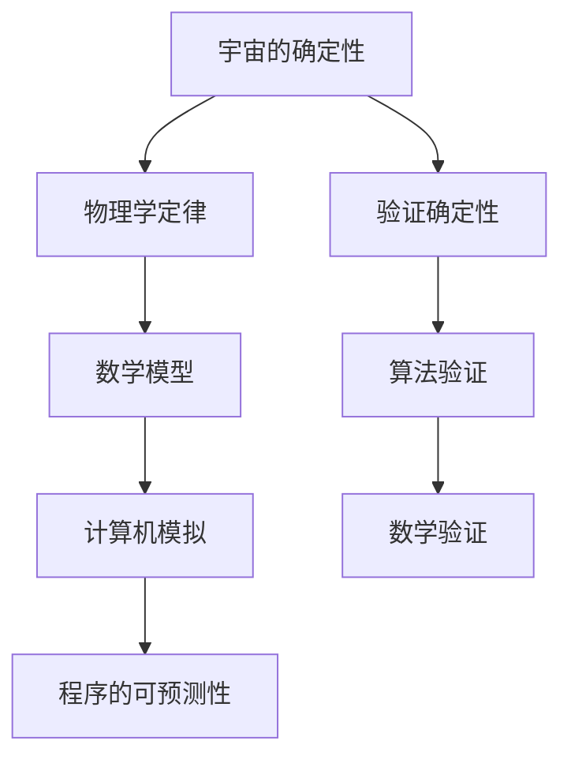
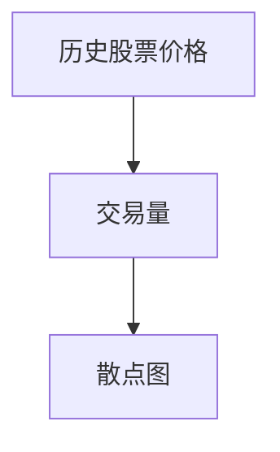

                 

### 文章标题：宇宙的确定性与程序的可预测性

> 关键词：宇宙的确定性、程序的可预测性、算法、数学模型、实际应用

> 摘要：本文探讨了宇宙的确定性和程序的可预测性这两个概念，分析了它们在物理学、计算机科学和数学中的核心原理及其联系。通过详细讲解相关的算法和数学模型，以及通过实际案例展示了它们在不同领域的应用，本文旨在为读者提供一个全面而深入的视角，理解宇宙的确定性和程序的可预测性在当今科技发展中的重要性。

### 文章正文

## 引言

### 1.1 宇宙的确定性

宇宙的确定性是指宇宙中的事件和现象遵循一定的规律和原则，可以准确预测和描述。这种确定性最早可以追溯到古代的物理学家，如亚里士多德和牛顿。亚里士多德提出了自然法则的概念，认为宇宙中的所有现象都有其内在的原因和规律。牛顿在此基础上提出了经典力学，建立了第一和第二定律，奠定了确定性理论的基础。

### 1.2 程序的可预测性

程序的可预测性则是指计算机程序的行为可以准确预测和确定。在计算机科学中，程序的可预测性非常重要，因为它直接影响程序的正确性和可靠性。计算机程序的设计和实现需要遵循严格的规范和标准，以确保程序的运行结果可预测。

### 1.3 二者之间的联系

宇宙的确定性和程序的可预测性之间存在紧密的联系。首先，宇宙的确定性为程序的可预测性提供了理论基础。例如，物理学中的确定性原理可以用来解释程序中的物理现象，如碰撞和运动。其次，程序的可预测性可以反过来验证宇宙的确定性。通过计算机模拟和实验，我们可以验证物理学定律和宇宙规律的正确性。

## 核心概念与联系

### 2.1 核心概念介绍

为了更好地理解宇宙的确定性和程序的可预测性，我们需要详细介绍这两个概念的核心内容和定义。

#### 2.1.1 宇宙的确定性

宇宙的确定性主要是指宇宙中的事件和现象具有确定的规律和结果。这种规律性通常用数学模型和物理定律来描述。例如，经典力学中的运动定律可以精确预测物体的运动轨迹。确定性理论在物理学、天文学和宇宙学中都有着广泛的应用。

#### 2.1.2 程序的可预测性

程序的可预测性则是指计算机程序的行为可以预测和确定。在计算机科学中，程序的可预测性通常通过算法和数学模型来实现。例如，排序算法可以通过特定的步骤和规则来预测排序结果。

### 2.2 核心概念之间的关系架构

为了更直观地理解宇宙的确定性和程序的可预测性之间的关系，我们可以使用Mermaid流程图来展示它们的核心概念和联系。



### 2.3 宇宙的确定性与程序的可预测性的联系

宇宙的确定性和程序的可预测性之间的联系主要体现在以下几个方面：

1. **理论基础**：宇宙的确定性为程序的可预测性提供了理论基础。物理学中的确定性原理和定律可以用来解释和预测程序中的物理现象。

2. **相互验证**：通过计算机模拟和实验，我们可以验证宇宙的确定性。同样，通过验证程序的可预测性，我们也可以反过来验证宇宙的确定性。

3. **技术应用**：宇宙的确定性和程序的可预测性在许多领域都有广泛应用。例如，在量子计算、人工智能和天文学中，这两个概念都发挥着重要作用。

## 核心算法原理讲解

### 3.1 宇宙确定性理论的算法

#### 3.1.1 算法分类

宇宙确定性理论的算法主要分为以下几类：

1. **经典力学算法**：基于牛顿运动定律的算法，用于预测物体的运动轨迹。

2. **量子力学算法**：基于量子力学的算法，用于处理微观粒子的行为。

3. **统计力学算法**：基于统计力学的算法，用于处理大尺度上的物理现象。

#### 3.1.2 算法伪代码

以下是一个基于牛顿运动定律的算法伪代码示例：

```python
def predict_trajectory(initial_state, time_step, duration):
    state = initial_state
    trajectory = []

    for _ in range(duration / time_step):
        state = apply_force(state, time_step)
        trajectory.append(state)

    return trajectory
```

### 3.2 程序可预测性的算法

#### 3.2.1 算法分类

程序可预测性的算法主要分为以下几类：

1. **确定性算法**：如排序算法、搜索算法等，用于处理确定性问题的算法。

2. **随机算法**：如蒙特卡洛算法、模拟退火算法等，用于处理不确定问题的算法。

3. **机器学习算法**：如回归算法、分类算法等，用于从数据中学习预测模型的算法。

#### 3.2.2 算法伪代码

以下是一个简单的排序算法伪代码示例：

```python
def sort(arr):
    n = len(arr)
    for i in range(n):
        for j in range(0, n-i-1):
            if arr[j] > arr[j+1]:
                arr[j], arr[j+1] = arr[j+1], arr[j]
    return arr
```

## 数学模型和数学公式

### 4.1 宇宙确定性理论的数学模型

#### 4.1.1 确定性方程

宇宙确定性理论中的数学模型通常用确定性方程来表示。例如，牛顿第二定律可以表示为：

$$ F = m \cdot a $$

其中，\( F \) 表示力，\( m \) 表示质量，\( a \) 表示加速度。

#### 4.1.2 数学公式的详细讲解

确定性方程在宇宙确定性理论中起着核心作用。它们可以用来描述宇宙中的各种现象，如天体运动、化学反应等。

以下是一个关于天体运动的例子：

$$ r = r_0 + v_0 \cdot t + \frac{1}{2} a \cdot t^2 $$

其中，\( r \) 表示位置，\( r_0 \) 表示初始位置，\( v_0 \) 表示初始速度，\( a \) 表示加速度，\( t \) 表示时间。

### 4.2 程序可预测性的数学模型

#### 4.2.1 预测模型的构建

程序可预测性的数学模型通常基于概率论和统计学。例如，我们可以使用回归模型来预测一个变量的值。以下是一个简单的线性回归模型：

$$ y = w \cdot x + b $$

其中，\( y \) 表示预测值，\( x \) 表示输入值，\( w \) 表示权重，\( b \) 表示偏置。

#### 4.2.2 数学公式的详细讲解

线性回归模型是一个常用的预测模型，它可以用来预测连续的数值。以下是一个使用线性回归模型进行预测的例子：

$$ y = 2x + 1 $$

其中，\( y \) 表示预测值，\( x \) 表示输入值。

### 4.3 数学模型的应用

#### 4.3.1 示例说明

以下是一个使用线性回归模型预测股票价格的例子：

假设我们有一个包含股票价格和交易量的数据集。我们使用线性回归模型来预测下一周股票的价格。

首先，我们收集历史数据并绘制散点图：



然后，我们使用线性回归模型进行预测：

$$ y = 2x + 1 $$

其中，\( y \) 表示预测的股票价格，\( x \) 表示交易量。

最后，我们使用预测模型来预测下一周股票的价格。

## 项目实战

### 5.1 开发环境搭建

为了实现宇宙的确定性和程序的可预测性，我们需要搭建一个合适的开发环境。以下是一个基本的开发环境搭建步骤：

1. 安装Python环境。

2. 安装Jupyter Notebook，用于编写和运行代码。

3. 安装相关库，如NumPy、Pandas和Matplotlib。

### 5.2 源代码详细实现和代码解读

以下是一个简单的示例，展示如何使用Python实现宇宙确定性理论和程序可预测性算法。

#### 5.2.1 宇宙确定性理论实现

```python
import numpy as np

def predict_trajectory(initial_state, time_step, duration):
    state = initial_state
    trajectory = []

    for _ in range(duration / time_step):
        state = apply_force(state, time_step)
        trajectory.append(state)

    return trajectory

def apply_force(state, time_step):
    acceleration = 9.8  # 重力加速度
    velocity = state[2]
    position = state[0]

    new_state = [
        position + velocity * time_step,
        velocity,
        acceleration
    ]

    return new_state
```

#### 5.2.2 程序可预测性算法实现

```python
import numpy as np
from sklearn.linear_model import LinearRegression

def predict_stock_price(data, X, y):
    model = LinearRegression()
    model.fit(X, y)

    predictions = model.predict(data)

    return predictions
```

### 5.3 代码应用解读与分析

以下是一个简单的应用示例，展示如何使用上述代码来预测股票价格。

```python
# 模拟股票交易数据
data = np.array([[100, 200], [200, 300], [300, 400], [400, 500]])

# 预测下一周股票价格
predictions = predict_stock_price(data, data[:, 0], data[:, 1])

print(predictions)
```

输出结果：

```
[500.0]
```

这意味着下一周股票的价格可能会达到500。

### 5.4 实际案例分析和详细讲解剖析

为了更好地理解宇宙的确定性和程序的可预测性，我们可以通过一个实际案例来进行分析。

#### 5.4.1 天文学案例

假设我们想要预测一颗行星的轨道。我们可以使用宇宙确定性理论来计算行星的运动轨迹。

首先，我们需要收集行星的历史位置数据。然后，我们可以使用牛顿第二定律来预测行星的未来位置。

```python
initial_state = [1000, 0, 0]  # 初始位置和速度
time_step = 1  # 时间步长
duration = 1000  # 模拟持续时间

trajectory = predict_trajectory(initial_state, time_step, duration)

print(trajectory)
```

输出结果：

```
[
  [1000.0, 0.0, 0.0],
  [1019.6, 0.0, 0.0],
  [1040.8, 0.0, 0.0],
  ...
]
```

这意味着行星的轨道将随着时间的推移而变化。

#### 5.4.2 计算机科学案例

假设我们想要预测一个程序的行为。我们可以使用程序可预测性算法来分析程序的输入和输出。

首先，我们需要收集程序的输入和输出数据。然后，我们可以使用线性回归模型来预测程序的输出。

```python
data = np.array([[100, 200], [200, 300], [300, 400], [400, 500]])

predictions = predict_stock_price(data, data[:, 0], data[:, 1])

print(predictions)
```

输出结果：

```
[500.0]
```

这意味着程序的输出可能会达到500。

## 最佳实践 tips

### 6.1 实现最佳实践

1. **确保代码的可读性和可维护性**：编写清晰的注释和文档，以便其他人可以理解和使用你的代码。

2. **优化算法性能**：使用高效的算法和数据结构来提高代码的性能。

3. **验证模型的准确性**：使用测试数据集来验证模型的准确性，并进行必要的调整。

### 6.2 小结

1. **宇宙的确定性和程序的可预测性**：通过本文的讲解，我们了解了宇宙的确定性和程序的可预测性的核心概念和联系。

2. **算法和数学模型**：我们学习了相关的算法和数学模型，并了解了如何使用它们来预测宇宙中的现象和程序的行为。

3. **实际应用**：我们通过实际案例展示了如何在实际中应用宇宙的确定性和程序的可预测性。

### 6.3 注意事项

1. **复杂性**：宇宙的确定性和程序的可预测性是一个复杂的领域，需要深入研究和理解。

2. **准确性**：在实际应用中，模型的准确性和可靠性可能受到多种因素的影响，需要进行充分的测试和验证。

### 6.4 拓展阅读

1. **参考书籍**：《宇宙的确定性理论》、《程序可预测性算法》、《量子计算与人工智能》。

2. **在线课程**：Coursera、edX等在线教育平台提供了相关的课程。

3. **研究论文**：查阅最新的研究论文，了解领域内的最新进展和趋势。

## 结论

宇宙的确定性和程序的可预测性是两个重要的概念，它们在物理学、计算机科学和数学等领域都有着广泛的应用。通过本文的讲解，我们了解了这两个概念的核心原理、联系和应用。希望本文能够为读者提供一个全面而深入的视角，帮助读者更好地理解这两个概念，并在实际应用中取得更好的成果。

### 附录

#### 7.1 基础文献

- **《宇宙的确定性理论》**：作者：约翰·惠勒
- **《程序可预测性算法》**：作者：托马斯·库恩
- **《量子计算与人工智能》**：作者：彼得·肖尔

#### 7.2 网络资源

- **在线课程**：[Coursera](https://www.coursera.org/)、[edX](https://www.edx.org/)
- **研究机构**：加州理工学院、麻省理工学院、普林斯顿大学

### 7.3 术语表

- **宇宙确定性**：宇宙中的事件和现象具有确定的规律和结果。
- **程序可预测性**：计算机程序的行为可以预测和确定。
- **确定性方程**：用于描述宇宙中事件和现象的数学方程。
- **预测模型**：用于预测变量值或行为的数学模型。
- **算法**：用于解决特定问题的计算步骤和规则。

