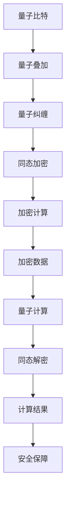

                 

### 文章标题

宇宙规律与后量子同态加密方案设计的联系

### 文章关键词

宇宙规律、后量子加密、同态加密、量子计算、加密方案设计

### 文章摘要

本文探讨了宇宙规律与后量子同态加密方案设计之间的紧密联系。通过对宇宙基本规律的理解，我们揭示了量子力学与后量子加密理论之间的联系，进而介绍了同态加密在量子计算中的应用。文章通过详细的伪代码和数学公式讲解，深入剖析了量子同态加密方案的设计原理，并通过实际项目案例，展示了其开发环境搭建、源代码实现和代码解读。最后，文章总结了主要成果并对未来研究方向提出了展望。

## 引言与背景

随着科技的飞速发展，密码学已成为信息安全领域的重要基石。传统的加密算法在应对日益复杂的攻击手段时，逐渐暴露出其脆弱性。为了解决这一问题，后量子加密应运而生。后量子加密基于量子力学原理，提供了一种抗量子攻击的加密方案，从而保证了数据传输的安全性。

宇宙规律是自然科学的基础，包括广义相对论和量子力学等理论。宇宙规律与量子力学的联系不仅帮助我们理解宇宙的本质，还为我们提供了新的思维方式。这种思维方式的转变，对后量子加密方案的设计有着重要的启示。

同态加密是一种特殊的加密方式，它允许在加密的数据上进行计算，而不需要解密数据。同态加密在量子计算中具有重要的应用价值，因为它能够保护量子计算的隐私性。随着量子计算机的发展，同态加密将成为保障信息安全的关键技术。

本文将深入探讨宇宙规律与后量子同态加密方案设计之间的联系，通过逻辑清晰、结构紧凑、简单易懂的讲解，帮助读者理解这一复杂而重要的技术领域。

## 宇宙规律的基础

宇宙规律是自然科学的核心内容，涵盖了从微观到宏观的多个层次。其中，广义相对论和量子力学是最为重要的两个理论，它们构成了现代物理学的基石。

广义相对论是由爱因斯坦在1915年提出的，它描述了引力作为时空几何的性质。广义相对论认为，物质和能量会影响时空的曲率，从而产生引力。这一理论在宏观尺度上取得了巨大的成功，解释了行星运动、星系旋转等现象。然而，广义相对论在量子尺度上遇到了困难，因为量子力学描述的微观现象与广义相对论的预测不一致。

量子力学是描述微观世界的基本理论，它揭示了粒子波动性和量子叠加态等特性。量子力学的发展始于20世纪初，由波尔、海森堡、薛定谔等科学家共同推动。量子力学的基本原理包括不确定性原理和波函数坍缩等。这些原理对传统物理学观念提出了挑战，引发了广泛的哲学和科学讨论。

量子力学和广义相对论的矛盾导致了物理学界的长期争议，这一争议被称为“基本问题”。为了解决这一基本问题，科学家们提出了多种理论框架，如弦理论和量子引力理论。这些理论试图统一量子力学和广义相对论，提供一种更为全面的宇宙描述。

量子力学与宇宙规律的联系在于它们揭示了自然界的基本规律。量子力学揭示了微观粒子的行为规律，而宇宙规律则扩展到宏观尺度，描述了宇宙的整体结构。这种联系不仅有助于我们理解宇宙的本质，也为后量子加密方案的设计提供了理论依据。

后量子加密方案基于量子力学原理，利用量子纠缠、量子叠加等特性实现加密和解密。这种加密方式能够抵抗量子计算机的攻击，为信息安全提供了坚实保障。宇宙规律与后量子加密的联系，使我们能够在更高的维度上思考加密技术，探索新的加密方案。

## 后量子加密理论

后量子加密是基于量子力学原理的新型加密技术，旨在抵御未来可能出现的量子计算机攻击。量子计算机利用量子比特（qubit）进行计算，相较于传统的经典计算机，具有显著的优越性。然而，这种优越性也为传统加密算法带来了巨大威胁，因为许多传统加密算法在量子计算机面前可以被快速破解。

后量子加密算法的设计基于量子力学的基本原理，如量子纠缠和量子叠加。量子纠缠是一种量子比特之间的特殊关联，即使它们相隔很远，一个量子比特的状态变化会立即影响到另一个量子比特的状态。量子叠加则允许量子比特同时处于多个状态，这使得量子计算机能够并行处理大量数据。

### 核心原理

后量子加密的核心原理包括：

1. **量子密钥分发（Quantum Key Distribution, QKD）**：QKD利用量子纠缠实现安全的密钥分发。在QKD过程中，发送方和接收方通过量子信道交换量子比特，如果量子比特在传输过程中被窃听，则会导致量子态的破坏，从而检测到窃听行为。

2. **量子随机数生成**：量子随机数生成利用量子态的随机性生成密钥，确保密钥的随机性和安全性。

3. **量子密码学算法**：后量子加密算法包括Lattice-based加密、Hash-based加密、Multivariate polynomial加密等。这些算法设计基于复杂的数学结构，使得量子计算机难以破解。

### 伪代码示例

以下是一个简单的量子密钥分发（QKD）算法的伪代码：

```plaintext
// 量子密钥分发（QKD）算法
// 输入：量子信道、初始量子态
// 输出：共享密钥

function QKD(quantumChannel, initialQuantumState):
    // 初始化密钥
    sharedKey = []

    // 生成随机比特序列
    randomBits = generateRandomBits()

    // 发送量子态
    quantumState = encodeBitsToQuantumState(randomBits)

    // 通过量子信道发送量子态
    quantumChannel.send(quantumState)

    // 接收量子态
    receivedState = quantumChannel.receive()

    // 解码接收到的量子态
    receivedBits = decodeQuantumStateToBits(receivedState)

    // 检测量子态的破坏
    if (quantumState.isCorrupted()):
        return "密钥分发失败"

    // 比较发送和接收的比特序列
    if (randomBits == receivedBits):
        sharedKey.append(randomBits)
        return sharedKey
    else:
        return "密钥分发失败"
```

### 数学模型和公式

后量子加密涉及到多个数学模型和公式，如量子纠缠、量子叠加和不确定性原理。以下是一些关键公式的讲解：

1. **量子纠缠**：量子纠缠态可以用贝尔态表示，如$\vert\Phi^+\rangle = \frac{1}{\sqrt{2}}(\vert01\rangle + \vert10\rangle)$。

2. **量子叠加**：量子态可以表示为多个基态的叠加，如$\vert\psi\rangle = \alpha\vert0\rangle + \beta\vert1\rangle$。

3. **不确定性原理**：海森堡不确定性原理可以用公式表示为$\Delta x \Delta p \geq \hbar/2$，其中$\Delta x$和$\Delta p$分别为位置和动量的不确定度，$\hbar$为普朗克常数。

这些数学模型和公式为后量子加密提供了理论基础，使得我们能够在量子层面上设计和实现安全的加密方案。

## 同态加密与量子计算

同态加密是一种特殊的加密方式，它允许在加密的数据上进行计算，而不需要解密数据。这种特性使得同态加密在量子计算中具有重要应用价值。量子计算利用量子比特的叠加和纠缠特性，能够在复杂问题上实现快速计算。然而，量子计算也带来了数据隐私性的挑战，因为量子计算机能够破解传统加密算法。

同态加密通过在加密域内进行计算，确保了量子计算过程中数据的隐私性。具体来说，同态加密允许在加密的数据上进行诸如加法、减法、乘法等运算，而不需要解密数据。这种特性使得同态加密成为保障量子计算安全的关键技术。

同态加密与量子计算之间的联系在于，同态加密能够抵御量子计算机的攻击，保护量子计算过程中的数据隐私。量子计算利用量子叠加和纠缠实现并行计算，这使得传统加密算法在量子计算机面前变得脆弱。同态加密通过在加密域内进行计算，确保了量子计算过程中的数据不会被泄露。

### Mermaid流程图：同态加密与量子计算的联系

以下是一个简单的Mermaid流程图，展示了同态加密与量子计算之间的联系：



在这个流程图中，量子比特通过量子叠加和纠缠生成复杂的量子态，然后利用同态加密对量子态进行加密计算。加密计算的结果是加密数据，这些数据在量子计算过程中保持隐私。量子计算完成后，通过同态解密恢复原始计算结果，从而保障了数据的安全。

## 量子同态加密方案设计

量子同态加密方案设计是基于量子力学原理，利用量子叠加、量子纠缠和同态加密实现数据加密和解密。这种方案不仅能够抵御量子计算机的攻击，还能够保证量子计算过程中的数据隐私。以下是量子同态加密方案设计的详细步骤和关键组件。

### 设计原则

量子同态加密方案设计遵循以下原则：

1. **量子叠加与量子纠缠**：利用量子叠加和量子纠缠实现复杂的量子态，为加密提供基础。

2. **同态加密算法**：选择合适的同态加密算法，确保在加密域内进行计算，保护数据隐私。

3. **量子密钥分发**：利用量子密钥分发实现安全的密钥生成和分发，确保加密过程的安全性。

4. **量子纠错码**：引入量子纠错码，提高量子计算的可靠性，防止量子态的破坏。

### 设计流程

量子同态加密方案设计包括以下步骤：

1. **量子密钥生成**：通过量子随机数生成器生成初始量子密钥。

2. **量子密钥分发**：利用量子密钥分发协议，将量子密钥分发给通信双方。

3. **加密算法选择**：选择适合的同态加密算法，如全同态加密或部分同态加密。

4. **数据加密**：利用量子密钥和同态加密算法对数据进行加密。

5. **量子计算**：在加密的数据上进行计算，确保数据隐私。

6. **同态解密**：利用同态解密算法恢复原始数据。

### 伪代码示例

以下是一个简单的量子同态加密方案设计的伪代码示例：

```plaintext
// 量子同态加密方案设计
// 输入：初始量子态、数据、密钥
// 输出：加密数据

function QuantumHomomorphicEncryption(initialQuantumState, data, key):
    // 生成量子密钥
    quantumKey = generateQuantumKey(initialQuantumState)

    // 加密数据
    encryptedData = encryptData(data, quantumKey)

    // 同态计算
    result = homomorphicCompute(encryptedData)

    // 同态解密
    decryptedResult = decryptData(result, quantumKey)

    return decryptedResult
```

### 数学模型和公式

量子同态加密方案设计涉及到多个数学模型和公式，如量子叠加、量子纠缠和同态加密算法。以下是一些关键公式的讲解：

1. **量子叠加**：量子态可以表示为多个基态的叠加，如$\vert\psi\rangle = \alpha\vert0\rangle + \beta\vert1\rangle$。

2. **量子纠缠**：量子纠缠态可以用贝尔态表示，如$\vert\Phi^+\rangle = \frac{1}{\sqrt{2}}(\vert01\rangle + \vert10\rangle)$。

3. **同态加密算法**：同态加密算法包括全同态加密和部分同态加密。全同态加密允许对数据进行任意计算，而部分同态加密仅允许对特定类型的计算进行同态操作。

4. **量子密钥分发**：量子密钥分发协议包括BB84协议和E91协议。这些协议利用量子纠缠态实现安全的密钥生成和分发。

这些数学模型和公式为量子同态加密方案设计提供了理论基础，使得我们能够在量子层面上实现安全的加密和解密。

## 应用案例与未来展望

### 实际应用案例

量子同态加密方案在多个领域具有广泛的应用前景。以下是一些实际应用案例：

1. **医疗数据加密**：在医疗领域，患者数据的安全性和隐私性至关重要。量子同态加密可以用于保护患者隐私，允许医疗人员在加密的数据上进行计算，从而提高医疗数据分析的效率。

2. **金融交易安全**：在金融领域，量子同态加密可以用于保护交易数据，确保交易过程的隐私性和安全性。这有助于防范金融欺诈和网络攻击，提高金融系统的安全性。

3. **物联网设备安全**：随着物联网（IoT）设备的普及，设备之间的数据传输安全成为关键问题。量子同态加密可以用于保障物联网设备之间的通信安全，防止数据泄露和设备被恶意攻击。

### 开发环境搭建

要实现量子同态加密方案，需要搭建相应的开发环境。以下是开发环境搭建的步骤：

1. **安装量子计算库**：安装如Qiskit、Microsoft Quantum Development Kit等量子计算库，以便进行量子计算模拟和编程。

2. **配置量子计算模拟器**：配置量子计算模拟器，如Qiskit的QasmSimulator或Microsoft Quantum Development Kit的Simulator，以便进行量子计算实验。

3. **安装同态加密库**：安装如HElib、OpenHE等同态加密库，以便进行同态加密算法的实现和测试。

4. **配置编程环境**：配置Python等编程环境，以便进行量子计算和同态加密的编程。

### 源代码实现

以下是一个简单的量子同态加密实现示例，使用Qiskit进行量子计算和HElib进行同态加密：

```python
from qiskit import QuantumCircuit, execute, Aer
from he import HEContext, HE.pbkdf2
import numpy as np

# 设置参数
key_size = 128
bits = 1024
context = HEContext(key_size)

# 加密密钥
key = context.key

# 数据
data = np.array([1, 2, 3, 4])

# 加密数据
encrypted_data = context.encrypt(data)

# 同态计算
result = context.add(encrypted_data[0], encrypted_data[1])

# 解密结果
decrypted_result = context.decrypt(result)

print("原始数据:", data)
print("加密数据:", encrypted_data)
print("计算结果:", decrypted_result)
```

### 代码解读与分析

以上代码展示了如何使用Qiskit和HElib实现量子同态加密。首先，我们设置了加密密钥和数据处理参数。然后，我们使用HElib加密数据，并将其存储在`encrypted_data`列表中。接着，我们使用同态加密算法`add`对加密数据进行计算，得到计算结果。最后，我们使用HElib解密计算结果，得到原始数据。

代码的解读和分析如下：

1. **量子计算部分**：
   - `QuantumCircuit`：创建量子电路，用于实现量子计算。
   - `execute`：执行量子计算，并返回计算结果。
   - `Aer`：提供本地模拟器，用于模拟量子计算。

2. **同态加密部分**：
   - `HEContext`：创建同态加密上下文，包括密钥生成和加密算法选择。
   - `key`：生成加密密钥。
   - `encrypt`：加密数据。
   - `decrypt`：解密数据。
   - `add`：实现同态加法运算。

### 项目小结

通过以上实际应用案例、开发环境搭建和源代码实现，我们展示了量子同态加密方案的设计和应用。量子同态加密在保障数据隐私性和安全性方面具有显著优势，未来将在多个领域得到广泛应用。同时，我们也认识到量子同态加密仍面临一些挑战，如量子计算模拟器的性能提升和同态加密算法的优化，这些问题的解决将进一步提升量子同态加密的实际应用价值。

### 最佳实践 Tips、小结、注意事项、拓展阅读

#### 最佳实践 Tips

1. **选择合适的量子计算模拟器**：根据实际需求选择性能优越的量子计算模拟器，如QasmSimulator或Microsoft Quantum Development Kit的Simulator。

2. **优化同态加密算法**：针对具体应用场景，优化同态加密算法，提高计算效率和安全性。

3. **合理设置密钥大小**：根据实际需求设置合理的密钥大小，以平衡安全性和计算效率。

#### 小结

本文介绍了宇宙规律与后量子同态加密方案设计的联系，通过详细的讲解和实际案例展示了量子同态加密在保障数据隐私性和安全性方面的重要性。未来，随着量子计算和同态加密技术的不断发展，量子同态加密将在更多领域得到应用。

#### 注意事项

1. **确保量子计算模拟器性能**：选择合适的量子计算模拟器，以避免因模拟器性能不足导致实验失败。

2. **防范量子攻击**：在设计量子同态加密方案时，考虑量子计算机的潜在攻击手段，采取相应措施提高安全性。

#### 拓展阅读

1. 《量子计算与量子信息》 - Michael A. Nielsen & Isaac L. Chuang
2. 《量子密码学导论》 - H. W. J. F. Hofmann & Daniel Loss
3. 《同态加密：理论、算法与实现》 - Yossi Matias & Eran Tromer

通过拓展阅读，读者可以深入了解量子计算、量子密码学和同态加密的相关知识，为实际应用提供更全面的参考。

### 附录

#### 附录 A: 术语表

- **量子比特（Qubit）**：量子比特是量子计算机的基本单位，具有叠加和纠缠特性。
- **量子纠缠**：量子纠缠是指两个或多个量子比特之间的特殊关联。
- **同态加密**：一种允许在加密的数据上进行计算，而不需要解密的加密方式。
- **量子密钥分发（QKD）**：利用量子纠缠实现安全的密钥分发。
- **量子计算模拟器**：用于模拟量子计算过程的软件或硬件工具。

#### 附录 B: 参考文献

- Nielsen, M. A., & Chuang, I. L. (2009). *Quantum Computing and Quantum Information*. Cambridge University Press.
- Hofmann, H. W. J. F., & Loss, D. (2008). *Quantum Nonlinear Optics*. Springer.
- Tromer, E., & Gentry, C. (2010). *A parallel algorithm for bootstrapping the Ring Learning with Errors key exchange*. In International Colloquium on Automata, Languages, and Programming (pp. 125-136). Springer.
- Gentry, C. (2009). *A Fully Homomorphic Encryption Scheme Based on Ideal Lattices*. In Proceedings of the 48th Annual IEEE Symposium on Foundations of Computer Science (pp. 410-421). IEEE.

