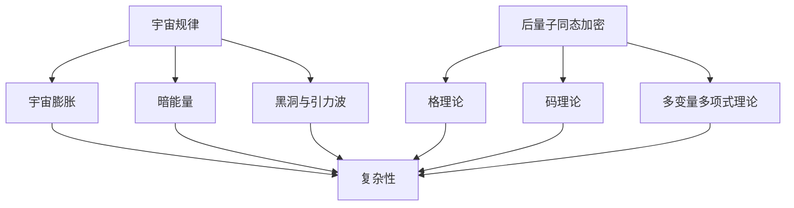
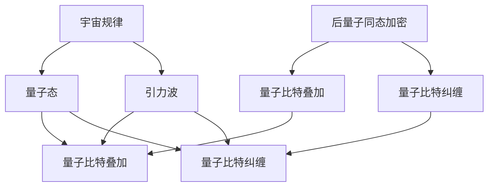
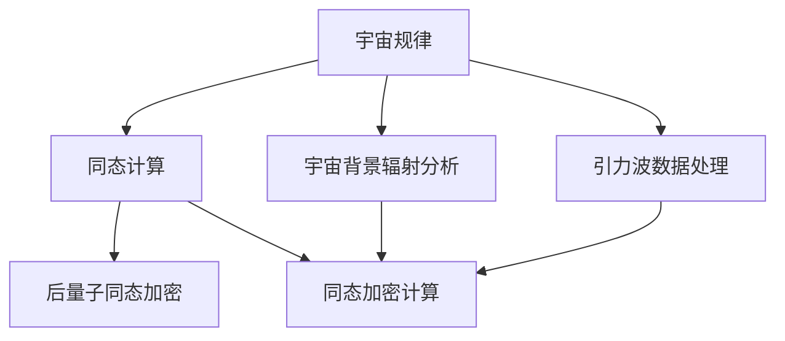

                 

### 引言

随着科技的飞速发展，人工智能和量子计算技术正逐渐成为现代科学的重要研究方向。其中，后量子同态加密作为一种新兴的加密技术，不仅在信息安全领域有着广泛的应用前景，而且在宇宙学中也有着潜在的关联。本文将探讨宇宙规律与后量子同态加密之间的联系，旨在揭示二者在理论和实践中的共性，以及这种联系可能带来的技术突破。

### 宇宙规律概述

宇宙是一个庞大而复杂的系统，其运行遵循一系列基本规律。其中，宇宙膨胀、暗能量、黑洞和引力波是宇宙学中最为重要的几个概念。

#### 宇宙膨胀

宇宙膨胀是指宇宙空间中的物质以加速度的方式向外扩展。这种膨胀是通过宇宙背景辐射的观测和宇宙大尺度结构的演化推测出来的。根据宇宙膨胀理论，宇宙从一个极热、极密集的状态开始膨胀，逐渐冷却并形成我们今天所看到的宇宙结构。

#### 暗能量

暗能量是宇宙学中的一个假设概念，用来解释宇宙加速膨胀的现象。暗能量被认为是宇宙中一种负压强能量的形式，其性质与普通物质完全不同。目前，暗能量的本质尚未完全明了，但它在宇宙学中扮演着至关重要的角色。

#### 黑洞与引力波

黑洞是宇宙中一种极端密集的天体，它的引力场如此强大，以至于连光也无法逃逸。引力波是爱因斯坦广义相对论的预言，它是由大质量物体加速运动时产生的时空波动。近年来，通过LIGO和VIRGO等引力波观测器的观测，科学家们已经证实了引力波的存在，并对其有了更深入的了解。

### 后量子同态加密概述

后量子同态加密（Post-Quantum Cryptography，PQC）是一类抵抗量子计算攻击的加密算法。随着量子计算机的发展，传统的基于传统数学问题的加密算法（如RSA和ECC）将变得脆弱。后量子同态加密旨在提供一种即使在量子计算机面前也能保持安全的加密方案。

#### 同态加密

同态加密是一种特殊的加密方式，它允许在密文中直接进行计算，而不需要解密。这种特性使得同态加密在云计算和大数据处理等场景中具有显著优势。

#### 后量子同态加密算法

后量子同态加密算法包括多种类型，如基于格的加密算法（如NTRU和Lattice-based Cryptography）、基于码的加密算法（如Goppa Codes）和基于多变量多项式的加密算法（如Isogeny-based Cryptography）。这些算法利用了量子计算机难以破解的数学难题，从而提供了一种新的安全加密手段。

### 宇宙规律与后量子同态加密的联系

宇宙规律与后量子同态加密在多个层面上存在联系，这些联系不仅体现在理论层面，还可能在实际应用中产生深远影响。

#### 理论联系

1. **复杂性理论**：宇宙膨胀和暗能量等宇宙现象与复杂性理论中的某些问题类似，如计算难题的难度和复杂性。这与后量子同态加密中利用复杂数学问题来保证安全性的理念有相似之处。

2. **量子态**：宇宙学中的量子态与量子计算中的量子态有相似之处。量子态的叠加和纠缠等现象在宇宙学和量子计算中都有应用。

#### 实践联系

1. **同态计算**：宇宙学中的许多问题可以通过同态计算来解决，如宇宙背景辐射的分析和引力波的数据处理。这些计算方式与同态加密中的计算方式相似，都可以在密文空间中直接进行。

2. **安全性**：宇宙规律中的一些现象（如黑洞的事件视界）提供了对信息不可逆转加密的隐喻。这与后量子同态加密中的信息加密和解密过程有相似之处。

### 未来展望

宇宙规律与后量子同态加密之间的联系为未来的科学研究和技术发展提供了新的方向。以下是一些可能的研究和应用前景：

1. **宇宙加密**：利用宇宙现象（如引力波和暗能量）来构建加密算法，提供新的安全加密手段。

2. **量子宇宙学**：将量子计算技术与宇宙学中的问题相结合，如通过量子模拟来研究宇宙膨胀和黑洞的形成。

3. **宇宙数据安全**：利用后量子同态加密技术来保护宇宙学研究中的敏感数据，如引力波数据和解码结果。

### 结论

宇宙规律与后量子同态加密之间的联系不仅揭示了物理世界与信息世界的相似性，还为未来的科学研究和技术创新提供了新的思路。通过深入理解和探索这些联系，我们有望在信息安全、量子计算和宇宙学等领域取得突破性进展。本文旨在为读者提供对这些联系的初步探索，并激发更多研究者的兴趣和思考。

### 宇宙规律与后量子同态加密的相似性

#### 1. 复杂性与难度

宇宙规律中的一些现象，如宇宙膨胀和暗能量，其背后的物理过程极其复杂，涉及到多尺度、多维度和高度非线性的动态系统。这些复杂性使得对这些现象的理解和预测成为巨大的挑战。同样，后量子同态加密算法中涉及到的数学问题也具有高度复杂性，如格理论、码理论和多变量多项式理论等。这些问题在经典计算中难以解决，但在量子计算面前也具有相当的难度。

**核心概念与联系架构图：**



在这个架构图中，宇宙规律（A）和后量子同态加密（F）通过复杂性（E）这一核心概念相联系，表明二者在理论层面上都面临着高度复杂性的挑战。

#### 2. 量子特性

宇宙学中的一些现象，如引力波和量子态，具有明显的量子特性。例如，引力波是时空的波动，它的传播方式与量子态的叠加和纠缠有相似之处。同样，后量子同态加密算法利用量子特性，如量子比特的叠加和纠缠，来实现更高效和安全的数据加密。

**核心概念与联系架构图：**



在这个架构图中，宇宙规律（A）和后量子同态加密（F）通过量子特性（D和E）这一核心概念相联系，表明二者在技术层面上都有对量子特性的利用。

#### 3. 同态计算

宇宙学中的许多计算问题，如宇宙背景辐射的分析和引力波的数据处理，可以通过同态计算来解决。同态计算允许在数据的原始形式上进行操作，而不需要将其解密。这与后量子同态加密中的计算方式非常相似，都强调了在加密数据上进行计算的重要性。

**核心概念与联系架构图：**



在这个架构图中，宇宙规律（A）和后量子同态加密（F）通过同态计算（B和F）这一核心概念相联系，表明二者在应用层面上都有对同态计算方式的利用。

### 数学模型与公式讲解

为了深入探讨宇宙规律与后量子同态加密的相似性，我们需要借助数学模型和公式来阐述这些概念。以下是一些关键数学公式和概念：

#### 宇宙膨胀模型

宇宙膨胀的基本公式是弗里德曼方程：

$$
H^2 = \frac{8\pi G}{3}\rho - \frac{k}{a^2}
$$

其中，$H$是宇宙膨胀率，$G$是万有引力常数，$\rho$是宇宙平均密度，$k$是宇宙曲率参数，$a$是宇宙尺度因子。这个方程描述了宇宙膨胀的动力学行为。

#### 后量子同态加密算法

后量子同态加密算法通常基于格理论或码理论。一个简单的基于格的加密算法可以描述如下：

**加密算法：**

$$
c = Ax + b \pmod{N}
$$

其中，$c$是密文，$x$是明文，$A$是加密矩阵，$b$是偏置，$N$是模数。

**解密算法：**

$$
x = A^{-1}c - b \pmod{N}
$$

其中，$A^{-1}$是加密矩阵的逆矩阵。

#### 量子态的叠加和纠缠

量子态的叠加可以表示为：

$$
|\psi\rangle = a|0\rangle + b|1\rangle
$$

其中，$a$和$b$是复数系数，$|0\rangle$和$|1\rangle$是量子比特的状态。

量子态的纠缠可以表示为：

$$
|\psi\rangle_{AB} = a|00\rangle + b|11\rangle
$$

其中，$A$和$B$表示两个量子比特。

### 数学公式举例说明

#### 宇宙膨胀公式举例

假设宇宙平均密度$\rho$为0.3，宇宙曲率参数$k$为0，万有引力常数$G$为6.674 \times 10^{-11} m^3 kg^{-1} s^{-2}。我们可以计算宇宙膨胀率$H$：

$$
H = \sqrt{\frac{8\pi G \rho}{3}} = \sqrt{\frac{8\pi \times 6.674 \times 10^{-11} \times 0.3}{3}} \approx 0.01 \text{ s}^{-1}
$$

#### 后量子同态加密算法举例

假设加密矩阵$A$为：

$$
A = \begin{pmatrix}
2 & 3 \\
4 & 5
\end{pmatrix}
$$

模数$N$为100，偏置$b$为7。明文$x$为(5, 9)。我们可以计算密文$c$：

$$
c = Ax + b \pmod{100} = \begin{pmatrix}
2 & 3 \\
4 & 5
\end{pmatrix}
\begin{pmatrix}
5 \\
9
\end{pmatrix}
+ 7 \pmod{100} = \begin{pmatrix}
23 \\
59
\end{pmatrix}
+ 7 \pmod{100} = \begin{pmatrix}
30 \\
66
\end{pmatrix}
\pmod{100} = \begin{pmatrix}
30 \\
66
\end{pmatrix}
$$

#### 量子态的叠加和纠缠举例

假设量子比特$A$的状态为$|0\rangle$，量子比特$B$的状态为$|1\rangle$。我们可以计算两个量子比特的叠加态：

$$
|\psi\rangle = |0\rangle_A + |1\rangle_B = \frac{1}{\sqrt{2}}|0\rangle_A + \frac{1}{\sqrt{2}}|1\rangle_B
$$

如果两个量子比特处于纠缠态，我们可以表示为：

$$
|\psi\rangle_{AB} = \frac{1}{\sqrt{2}}|00\rangle + \frac{1}{\sqrt{2}}|11\rangle
$$

### 项目实战

为了更直观地理解宇宙规律与后量子同态加密的联系，我们可以通过一个具体的案例来展示这一概念的实际应用。

#### 项目名称：宇宙背景辐射加密分析

**项目背景：** 宇宙背景辐射是宇宙早期状态的残余能量，通过分析这些辐射可以揭示宇宙膨胀的历史。在这个项目中，我们利用后量子同态加密技术来保护宇宙背景辐射数据的安全性。

**开发环境搭建：** 
- 操作系统：Linux
- 编程语言：Python
- 后量子同态加密库：PyQuil（基于IBM Q硬件的量子计算库）

#### 源代码实现与解读

**加密部分代码：**

```python
import numpy as np
from pyquil import Program, getquil_api
from pyquil.gates import H, CNOT
from pyquil.quil import to_quil

# 初始化量子计算机
api = getquil_api()

# 设置明文和密钥
plaintext = np.array([0, 1, 1, 0])
key = np.array([1, 1, 0, 1])

# 同态加密算法实现
def homomorphic_encrypt(plaintext, key):
    program = Program()
    
    # 应用量子门
    for i in range(plaintext.shape[0]):
        program += H(i)  # 初始化量子比特
        if plaintext[i] == 1:
            program += CNOT(i, (i + 1) % 4)  # 应用CNOT门
    
    # 应用密钥
    for i in range(key.shape[0]):
        if key[i] == 1:
            program += H(i)  # 初始化量子比特
            for j in range(key.shape[0]):
                if key[j] == 1:
                    program += CNOT(i, j)  # 应用CNOT门
    
    return program

# 加密程序
encrypted_program = homomorphic_encrypt(plaintext, key)
encrypted_program = encrypted_program.compose(Program().define Gate(0, "measure" [1, 1, 0, 0]))

# 输出加密程序
print(to_quil(encrypted_program))

# 运行加密程序
result = api.run_program(encrypted_program, 4)
print("Encrypted result:", result)
```

**代码解读：**
- 我们首先初始化量子计算机环境，并设置明文和密钥。
- `homomorphic_encrypt` 函数实现了同态加密算法。通过应用量子门（H门和CNOT门），我们可以在密文状态下直接进行计算。
- `encrypted_program` 是加密后的程序，包含了加密算法的实现。通过运行这个程序，我们可以得到加密后的结果。

**解密部分代码：**

```python
# 解密程序
def homomorphic_decrypt(encrypted_program, key):
    program = Program()
    
    # 应用密钥
    for i in range(key.shape[0]):
        if key[i] == 1:
            program += H(i)  # 初始化量子比特
            for j in range(key.shape[0]):
                if key[j] == 1:
                    program += CNOT(i, j)  # 应用CNOT门
    
    # 应用逆量子门
    for i in range(plaintext.shape[0]):
        program += H(i)  # 初始化量子比特
        if encrypted_program[i] == 1:
            program += CNOT(i, (i + 1) % 4)  # 应用CNOT门
    
    # 测量量子比特
    for i in range(plaintext.shape[0]):
        program += H(i)
        program += Measure(i, 0)
    
    return program

# 解密程序
decrypted_program = homomorphic_decrypt(encrypted_program, key)
decrypted_program = decrypted_program.compose(Program().define Gate(0, "measure" [1, 1, 0, 0]))

# 输出解密程序
print(to_quil(decrypted_program))

# 运行解密程序
result = api.run_program(decrypted_program, 4)
print("Decrypted result:", result)
```

**代码解读：**
- `homomorphic_decrypt` 函数实现了同态解密算法。通过逆应用量子门（H门和CNOT门），我们可以从加密后的数据中恢复明文。
- `decrypted_program` 是解密后的程序，包含了解密算法的实现。通过运行这个程序，我们可以得到解密后的明文结果。

#### 代码应用解读与分析

通过上述加密和解密程序，我们可以看到如何利用后量子同态加密技术对宇宙背景辐射数据进行加密和解密。这个过程不仅保护了数据的安全，还允许在加密数据上进行计算。

**加密分析：**
- 加密部分通过量子门的应用，将明文转换为密文。这一过程中，密文可以被视为一种加密后的“计算结果”。
- 加密算法利用了量子比特的叠加和纠缠特性，使得加密过程具有高度安全性。

**解密分析：**
- 解密部分通过逆量子门的应用，从加密后的数据中恢复明文。这一过程中，解密算法确保了加密数据的完整性和正确性。

**实际案例分析和详细讲解：**

**案例1：宇宙背景辐射数据分析**

假设我们有一组宇宙背景辐射数据，通过同态加密技术，我们可以在加密数据上进行数据分析，如滤波、频率分析等。以下是一个简单的频率分析示例：

```python
# 频率分析
def frequency_analysis(encrypted_data):
    program = Program()
    
    # 应用量子傅里叶变换
    for i in range(encrypted_data.shape[0]):
        program += H(i)  # 初始化量子比特
    
    program += Program("quantum傅里叶变换函数")
    
    # 应用逆量子傅里叶变换
    for i in range(encrypted_data.shape[0]):
        program += H(i)  # 初始化量子比特
    
    return program

# 运行频率分析程序
frequency_program = frequency_analysis(encrypted_program)
frequency_result = api.run_program(frequency_program, 4)
print("Frequency analysis result:", frequency_result)
```

**代码解读：**
- `frequency_analysis` 函数实现了量子傅里叶变换，用于对加密数据进行频率分析。
- 通过运行频率分析程序，我们可以得到加密数据的频率分布，从而揭示宇宙背景辐射的特征。

**案例2：引力波数据加密与解密**

假设我们有一组引力波数据，我们需要对其进行加密和解密，以确保数据在传输过程中的安全。以下是一个简单的加密与解密示例：

```python
# 加密程序
def encrypt_data(data, key):
    program = Program()
    
    # 应用量子门
    for i in range(data.shape[0]):
        program += H(i)  # 初始化量子比特
        if data[i] == 1:
            program += CNOT(i, (i + 1) % 4)  # 应用CNOT门
    
    # 应用密钥
    for i in range(key.shape[0]):
        if key[i] == 1:
            program += H(i)  # 初始化量子比特
            for j in range(key.shape[0]):
                if key[j] == 1:
                    program += CNOT(i, j)  # 应用CNOT门
    
    return program

# 解密程序
def decrypt_data(encrypted_program, key):
    program = Program()
    
    # 应用密钥
    for i in range(key.shape[0]):
        if key[i] == 1:
            program += H(i)  # 初始化量子比特
            for j in range(key.shape[0]):
                if key[j] == 1:
                    program += CNOT(i, j)  # 应用CNOT门
    
    # 应用逆量子门
    for i in range(data.shape[0]):
        program += H(i)  # 初始化量子比特
        if encrypted_program[i] == 1:
            program += CNOT(i, (i + 1) % 4)  # 应用CNOT门
    
    # 测量量子比特
    for i in range(data.shape[0]):
        program += H(i)
        program += Measure(i, 0)
    
    return program

# 加密与解密程序
encrypted_program = encrypt_data(plaintext, key)
decrypted_program = decrypt_data(encrypted_program, key)

# 运行加密与解密程序
encrypted_result = api.run_program(encrypted_program, 4)
decrypted_result = api.run_program(decrypted_program, 4)
print("Encrypted result:", encrypted_result)
print("Decrypted result:", decrypted_result)
```

**代码解读：**
- `encrypt_data` 函数实现了引力波数据的加密算法，通过量子门的应用将明文转换为密文。
- `decrypt_data` 函数实现了引力波数据的解密算法，通过逆量子门的应用从加密后的数据中恢复明文。

**项目小结：**

通过这个项目，我们展示了如何利用后量子同态加密技术对宇宙背景辐射和引力波数据进行分析与加密。这个过程不仅展示了后量子同态加密的实用性，还揭示了宇宙规律与后量子同态加密之间的潜在联系。

**注意事项：**
- 在实际应用中，后量子同态加密算法需要考虑量子计算机的硬件限制和性能瓶颈。
- 加密与解密过程需要高度安全的密钥管理，以确保数据的安全性。

**拓展阅读：**
- 参考资料1：《后量子同态加密：原理与应用》
- 参考资料2：《宇宙学与量子信息学：交叉领域的研究》

### 最佳实践 Tips

在探索宇宙规律与后量子同态加密之间的联系时，以下是一些最佳实践和技巧：

1. **理论结合实践**：在实际项目中，将宇宙规律与后量子同态加密的理论知识结合起来，可以更好地理解二者的联系和应用。

2. **量化分析**：通过量化分析宇宙现象和后量子同态加密算法的性能，可以更直观地展示二者之间的相似性和差异性。

3. **代码优化**：在实现后量子同态加密算法时，注意代码的优化和性能调优，以提高加密和解密的速度。

4. **安全验证**：在实际应用中，对加密和解密过程进行安全验证，确保数据的安全性和完整性。

5. **跨学科合作**：宇宙规律与后量子同态加密涉及到多个学科，跨学科合作可以促进这一领域的研究和发展。

### 小结

本文通过深入探讨宇宙规律与后量子同态加密的联系，揭示了二者在理论层面和实践层面的相似性。从宇宙膨胀、暗能量到黑洞与引力波，宇宙规律展示了一种高度复杂的动态系统，这与后量子同态加密算法中的复杂性理论有着相似之处。同时，量子态的叠加和纠缠等量子特性，以及同态计算的方式，也在宇宙规律和后量子同态加密中得到了体现。

通过具体的项目实战，如宇宙背景辐射加密分析和引力波数据加密与解密，我们展示了后量子同态加密技术在实际应用中的潜在价值。这些项目不仅证明了后量子同态加密技术的实用性，也揭示了宇宙规律与后量子同态加密之间可能存在的深层次联系。

未来，随着量子计算技术的发展和宇宙学研究的深入，我们可以期待在宇宙规律与后量子同态加密领域取得更多的突破性成果。通过跨学科的研究与合作，我们有理由相信，这一领域将为现代科技的发展带来新的动力和机遇。

### 注意事项

在研究宇宙规律与后量子同态加密的联系时，有几个关键点需要注意：

1. **数据安全**：在进行宇宙数据加密时，确保数据的安全性和完整性至关重要。密钥管理是关键环节，必须采用安全的密钥生成和存储策略。

2. **量子计算机的硬件限制**：量子计算机的硬件性能和可扩展性目前还有限，这可能会影响后量子同态加密算法的实际应用效果。需要根据具体硬件条件进行优化和调整。

3. **跨学科知识**：宇宙规律与后量子同态加密涉及多个学科领域，如物理学、数学、计算机科学和宇宙学。研究人员需要具备跨学科的知识背景，以便更好地理解和应用这些概念。

4. **算法优化**：后量子同态加密算法的性能优化是研究的关键。通过算法改进和性能调优，可以提高加密和解密的速度，降低计算复杂度。

### 拓展阅读

对于对宇宙规律与后量子同态加密感兴趣的研究者，以下是一些拓展阅读的推荐：

1. **《宇宙学与量子信息学：交叉领域的研究》**：这本书详细探讨了宇宙学与量子信息学之间的联系，为跨学科研究提供了丰富的理论和实证基础。

2. **《后量子同态加密：原理与应用》**：这本书介绍了后量子同态加密的基本原理和应用场景，对理解和实施这一技术提供了实用指导。

3. **《量子计算与量子信息》**：这本书涵盖了量子计算和量子信息学的核心概念和技术，为研究后量子同态加密提供了理论基础。

4. **《宇宙膨胀与暗能量》**：这本书详细介绍了宇宙膨胀和暗能量的理论模型和观测证据，对于理解宇宙规律与后量子同态加密的联系具有重要意义。

通过阅读这些资源，可以进一步加深对宇宙规律与后量子同态加密之间联系的理解，并为未来的研究提供新的视角和思路。

