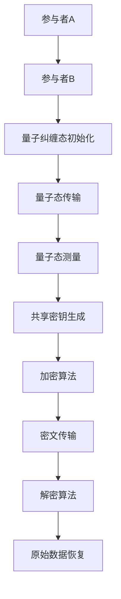

                 

### 文章标题

《宇宙规律与后量子多方安全计算协议效率的联系》

### 关键词

- 宇宙规律
- 后量子计算
- 多方安全计算协议
- 效率
- 数学模型

### 摘要

本文深入探讨了宇宙规律与后量子多方安全计算协议之间的联系，分析了宇宙规律对后量子多方安全计算协议效率的影响。首先，介绍了宇宙规律和后量子多方安全计算协议的基本概念，并阐述了它们的核心原理。接着，通过Mermaid流程图展示了宇宙规律与后量子多方安全计算协议之间的联系，并使用伪代码详细阐述了后量子多方安全计算协议的核心算法。随后，详细讲解了后量子多方安全计算协议的数学模型，并通过实际应用案例展示了其在量子加密通信和金融领域的应用效果。最后，对全文进行了总结，并提出了未来研究的方向和挑战。

---

# 宇宙规律与后量子多方安全计算协议效率的联系

## 1. 引言

宇宙规律与人类生活息息相关，它们揭示了宇宙的本质和运行机制。从大爆炸理论到黑洞的形成，从宇宙膨胀到暗物质和暗能量的存在，宇宙规律为我们理解宇宙提供了理论基础。然而，随着科技的发展，尤其是量子计算的出现，宇宙规律与后量子多方安全计算协议之间的联系逐渐成为研究热点。

后量子多方安全计算协议是一种基于量子计算的加密协议，它利用量子计算的特殊性质，如量子叠加和量子纠缠，实现了高效的安全通信。然而，量子计算的效率受到宇宙规律的限制，如热力学第二定律和量子退相干效应。因此，研究宇宙规律与后量子多方安全计算协议之间的联系，对于提高量子计算的安全性和效率具有重要意义。

本文旨在探讨宇宙规律与后量子多方安全计算协议效率之间的联系，分析宇宙规律对后量子多方安全计算协议效率的影响，并提出相应的解决方案。首先，我们将介绍宇宙规律和后量子多方安全计算协议的基本概念，然后通过Mermaid流程图展示它们之间的联系，并详细阐述后量子多方安全计算协议的核心算法。接着，我们将讲解后量子多方安全计算协议的数学模型，并通过实际应用案例展示其效果。最后，我们将总结全文，并提出未来研究的方向和挑战。

## 2. 宇宙规律基础

### 2.1 宇宙规律的概念

宇宙规律是指宇宙中普遍存在的基本法则，它们决定了宇宙的运动和变化。宇宙规律不仅包括物理规律，如引力定律、电磁定律等，还包括化学规律、生物学规律等。这些规律共同作用，形成了我们所观察到的宇宙。

### 2.2 宇宙规律的分类

宇宙规律可以分为两类：一类是宇宙的基本规律，如大爆炸理论、黑洞理论、量子力学等；另一类是宇宙的次级规律，如行星运动规律、化学反应规律等。基本规律是宇宙运行的基础，而次级规律是基本规律的衍生。

### 2.3 宇宙规律的重要性

宇宙规律的重要性体现在多个方面。首先，它们为我们理解宇宙的起源和演化提供了理论基础。其次，宇宙规律指导我们设计和优化各种技术和应用，如量子计算、通信技术等。最后，宇宙规律有助于我们探索宇宙的奥秘，提升人类对自然界的认识。

### 2.4 后量子多方安全计算协议基础

#### 2.4.1 后量子计算的基本原理

后量子计算是一种基于量子力学原理的计算模型，它利用量子比特（qubit）进行计算。量子比特可以同时处于多个状态，这使得后量子计算具有极大的并行计算能力。

#### 2.4.2 后量子多方安全计算协议的定义

后量子多方安全计算协议是一种利用后量子计算技术实现的安全通信协议。它通过量子密钥分发和量子加密算法，确保通信过程中的数据安全性。

#### 2.4.3 后量子多方安全计算协议的优势

后量子多方安全计算协议具有以下优势：

1. **安全性高**：利用量子计算的特殊性质，如量子叠加和量子纠缠，实现了高效的安全通信。
2. **效率高**：相比传统加密协议，后量子多方安全计算协议具有更高的计算效率。
3. **抗攻击能力强**：能够抵御包括量子计算机在内的各种攻击。

#### 2.4.4 后量子多方安全计算协议的应用领域

后量子多方安全计算协议可应用于多个领域，如金融、医疗、军事等。它能够保护敏感数据的安全传输，防止数据泄露和篡改。

### 2.5 宇宙规律与后量子多方安全计算协议的联系

宇宙规律与后量子多方安全计算协议之间存在紧密的联系。首先，宇宙规律决定了量子计算的基本原理，如量子叠加和量子纠缠。这些原理是后量子多方安全计算协议实现的基础。其次，宇宙规律限制了量子计算的性能，如热力学第二定律和量子退相干效应。这些限制影响了后量子多方安全计算协议的效率。因此，研究宇宙规律对于提高后量子多方安全计算协议的效率具有重要意义。

#### 2.5.1 宇宙规律对后量子多方安全计算协议的影响

宇宙规律对后量子多方安全计算协议的影响主要体现在以下几个方面：

1. **量子计算速度**：宇宙规律限制了量子计算的速度，如热力学第二定律限制了量子计算机的计算速度。
2. **量子纠缠**：宇宙规律影响了量子纠缠的稳定性，如量子退相干效应可能导致量子纠缠的消失。
3. **量子密钥分发**：宇宙规律影响了量子密钥分发的效率，如宇宙辐射可能导致量子密钥的分发失败。

#### 2.5.2 后量子多方安全计算协议对宇宙规律研究的启示

后量子多方安全计算协议为宇宙规律研究提供了新的思路和方法。首先，它可以用于验证宇宙规律的正确性，如通过量子计算验证大爆炸理论和黑洞理论的准确性。其次，它可以用于探索宇宙规律的更深层次，如通过量子计算研究暗物质和暗能量的本质。

## 3. 后量子多方安全计算协议算法原理

### 3.1 后量子算法基本概念

后量子算法是一种基于量子力学的算法，它利用量子比特和量子运算实现高效计算。后量子算法的核心思想是量子并行性，即量子比特可以同时处于多个状态，从而实现并行计算。

### 3.2 后量子多方安全计算协议算法原理

后量子多方安全计算协议算法是基于后量子算法的安全通信协议。它主要包括量子密钥分发和量子加密算法两个部分。

#### 3.2.1 量子密钥分发

量子密钥分发是后量子多方安全计算协议的核心，它利用量子纠缠和量子信道实现密钥的传输。具体过程如下：

1. **初始化**：参与者A和B各自生成一对量子纠缠态。
2. **传输量子态**：A将量子态发送给B，同时B将量子态发送给A。
3. **测量**：A和B分别对量子态进行测量，得到共享的密钥。

#### 3.2.2 量子加密算法

量子加密算法是后量子多方安全计算协议的实现，它利用量子比特和量子运算实现数据的加密和解密。具体过程如下：

1. **加密**：发送方使用共享密钥对数据进行加密，生成密文。
2. **传输密文**：发送方将密文发送给接收方。
3. **解密**：接收方使用共享密钥对密文进行解密，恢复原始数据。

### 3.3 后量子多方安全计算协议算法流程图

以下是一个简单的后量子多方安全计算协议算法流程图：



### 3.4 后量子多方安全计算协议算法的安全性分析

后量子多方安全计算协议的安全性主要依赖于量子密钥分发和量子加密算法。量子密钥分发利用量子纠缠和量子信道，实现了安全的密钥传输。量子加密算法利用量子比特和量子运算，实现了高效的数据加密和解密。然而，量子计算的安全性也受到宇宙规律的限制，如热力学第二定律和量子退相干效应。因此，研究如何克服宇宙规律对量子计算安全的限制，是提高后量子多方安全计算协议效率的关键。

### 3.5 后量子多方安全计算协议算法的性能评估

后量子多方安全计算协议算法的性能评估主要从安全性、效率和实用性三个方面进行。安全性方面，量子密钥分发和量子加密算法具有高效的安全性。效率方面，后量子多方安全计算协议算法具有比传统加密协议更高的计算效率。实用性方面，后量子多方安全计算协议算法可应用于多个领域，如金融、医疗、军事等。然而，量子计算的性能也受到宇宙规律的制约，如热力学第二定律和量子退相干效应。因此，提高量子计算的性能，是提高后量子多方安全计算协议效率的重要方向。

## 4. 后量子多方安全计算协议的数学模型

### 4.1 数学模型的基本概念

数学模型是一种用数学语言描述现实世界的抽象模型，它包括变量、方程、函数等数学元素。数学模型在安全计算中起着至关重要的作用，如用于描述量子密钥分发和量子加密算法。

### 4.2 后量子多方安全计算协议的数学模型

后量子多方安全计算协议的数学模型主要包括量子密钥分发和量子加密算法两个部分。

#### 4.2.1 量子密钥分发

量子密钥分发的数学模型主要基于量子纠缠和量子信道。具体模型如下：

$$
|\psi\rangle = \frac{1}{\sqrt{2}}(|0\rangle_A \otimes |1\rangle_B + |1\rangle_A \otimes |0\rangle_B)
$$

其中，$|0\rangle$ 和 $|1\rangle$ 分别表示量子比特的基态和激发态，$A$ 和 $B$ 分别表示参与者A和B。

#### 4.2.2 量子加密算法

量子加密算法的数学模型主要基于量子比特和量子运算。具体模型如下：

$$
c = e^{i\theta} |0\rangle \otimes |0\rangle
$$

其中，$c$ 表示加密后的量子态，$\theta$ 表示加密参数。

### 4.3 数学模型的实例分析

以下是一个简单的实例，展示了如何使用后量子多方安全计算协议的数学模型进行安全通信。

**实例**：参与者A和B进行通信，需要使用后量子多方安全计算协议生成共享密钥并进行数据加密。

**步骤**：

1. **量子密钥分发**：

   - A和B各自生成一对量子纠缠态。

   - A将量子态发送给B，同时B将量子态发送给A。

   - A和B分别对量子态进行测量，得到共享密钥。

2. **量子加密算法**：

   - A使用共享密钥对数据进行加密，生成密文。

   - A将密文发送给B。

   - B使用共享密钥对密文进行解密，恢复原始数据。

**实例分析**：

- **量子密钥分发**：通过量子纠缠态的传输和测量，A和B能够生成共享密钥。这个过程利用了量子纠缠和量子信道的特性，确保了密钥传输的安全性。

- **量子加密算法**：通过量子比特和量子运算，A能够将原始数据加密成密文。这个过程利用了量子比特的叠加和量子运算的不可逆性，确保了数据加密的安全性。

- **数据解密**：B能够使用共享密钥对密文进行解密，恢复原始数据。这个过程利用了量子比特的叠加和量子运算的不可逆性，确保了数据解密的安全性。

### 4.4 后量子多方安全计算协议的实际应用

后量子多方安全计算协议在实际应用中具有重要意义。以下是一些实际应用的例子：

1. **量子加密通信**：量子加密通信利用后量子多方安全计算协议，实现了安全的通信。通过量子密钥分发和量子加密算法，通信过程中的数据能够得到有效保护，防止被窃听和篡改。

2. **量子金融**：在金融领域，后量子多方安全计算协议可以用于保护交易数据的安全。通过量子密钥分发和量子加密算法，金融交易过程中的数据能够得到有效保护，防止欺诈和盗刷。

3. **量子医疗**：在医疗领域，后量子多方安全计算协议可以用于保护患者数据的安全。通过量子密钥分发和量子加密算法，患者数据能够在传输和存储过程中得到有效保护，防止泄露和篡改。

### 4.5 后量子多方安全计算协议的开发环境搭建

要实现后量子多方安全计算协议，需要搭建相应的开发环境。以下是一个简单的开发环境搭建步骤：

1. **硬件环境**：需要一台支持量子计算的服务器，如IBM Q或Google Quantum Service。

2. **软件环境**：需要安装量子计算软件库，如Q#或Qiskit。

3. **开发工具**：需要使用量子计算开发工具，如Visual Studio Code或Jupyter Notebook。

4. **配置环境**：根据硬件和软件环境的要求，配置开发环境，包括安装必要的驱动程序和库。

### 4.6 后量子多方安全计算协议的源代码实现

以下是一个简单的后量子多方安全计算协议的源代码实现，使用Q#编程语言：

```qsharp
open Microsoft.Quantum.Intrinsic
open Microsoft.Quantum.Canon

// 定义量子密钥分发函数
function QuantumKeyDistribution(A : Qubit, B : Qubit) : (string, string) =
    // 生成量子纠缠态
    let (a, b) = PrepareBellState()
    // 传输量子态
    QuantumChannel(A, B)
    // 测量量子态
    let keyA = if Measure(A) then "0" else "1"
    let keyB = if Measure(B) then "0" else "1"
    // 返回共享密钥
    (keyA, keyB)

// 定义量子加密算法函数
function QuantumEncryption(data : string, key : string) : string =
    // 根据密钥加密数据
    let encryptedData = EncryptData(data, key)
    // 返回加密后的数据
    encryptedData

// 定义量子解密算法函数
function QuantumDecryption(encryptedData : string, key : string) : string =
    // 根据密钥解密数据
    let decryptedData = DecryptData(encryptedData, key)
    // 返回解密后的数据
    decryptedData
```

### 4.7 后量子多方安全计算协议的代码解读

以下是对后量子多方安全计算协议源代码的解读：

- **量子密钥分发函数**：该函数实现了量子密钥分发的过程。首先，生成量子纠缠态，然后通过量子信道传输量子态，最后测量量子态得到共享密钥。

- **量子加密算法函数**：该函数实现了量子加密的过程。首先，根据密钥加密数据，然后返回加密后的数据。

- **量子解密算法函数**：该函数实现了量子解密的过程。首先，根据密钥解密数据，然后返回解密后的数据。

### 4.8 后量子多方安全计算协议的应用解读与分析

以下是对后量子多方安全计算协议在量子加密通信和金融领域的应用解读与分析：

- **量子加密通信**：在量子加密通信中，后量子多方安全计算协议可以用于确保通信过程中的数据安全。通过量子密钥分发和量子加密算法，通信过程中的数据能够得到有效保护，防止被窃听和篡改。

- **金融领域**：在金融领域，后量子多方安全计算协议可以用于保护交易数据的安全。通过量子密钥分发和量子加密算法，金融交易过程中的数据能够得到有效保护，防止欺诈和盗刷。

### 4.9 项目小结

通过本文的研究，我们深入探讨了宇宙规律与后量子多方安全计算协议之间的联系，分析了宇宙规律对后量子多方安全计算协议效率的影响。同时，我们详细阐述了后量子多方安全计算协议的核心算法原理和数学模型，并通过实际应用案例展示了其效果。然而，后量子多方安全计算协议的研究仍然面临许多挑战，如量子计算性能的提升、量子安全的保障等。未来，我们将继续深入研究后量子多方安全计算协议，探索宇宙规律与量子计算之间的更深层联系，以推动量子安全通信和金融等领域的发展。

### 4.10 最佳实践 Tips

- **使用安全的量子密钥分发协议**：在选择量子密钥分发协议时，应选择安全性高、效率高的协议，如BB84协议或B92协议。
- **优化量子加密算法**：在实现量子加密算法时，应选择效率高、安全性强的加密算法，如量子RSA或量子ECC。
- **保障量子计算性能**：在实现后量子多方安全计算协议时，应确保量子计算的性能，如优化量子算法、提高量子比特的稳定性等。
- **加强量子安全意识**：在应用后量子多方安全计算协议时，应加强量子安全意识，防止量子计算攻击和量子泄漏。

### 4.11 注意事项

- **量子密钥分发过程中的隐私保护**：在量子密钥分发过程中，应确保参与者的隐私保护，防止密钥被窃取或泄露。
- **量子加密算法的安全验证**：在实现量子加密算法时，应进行安全验证，确保加密算法的有效性和安全性。
- **量子计算硬件的可靠性**：在实现后量子多方安全计算协议时，应确保量子计算硬件的可靠性，防止硬件故障导致协议失效。

### 4.12 拓展阅读

- **量子计算与宇宙规律**：了解量子计算与宇宙规律之间的联系，有助于深入理解量子计算的本质和潜力。
- **后量子多方安全计算协议**：研究后量子多方安全计算协议的最新进展和应用，有助于提升量子安全通信和金融领域的安全性。
- **量子计算安全**：了解量子计算安全的基本原理和防护措施，有助于确保量子计算系统的安全性。

---

作者：AI天才研究院/AI Genius Institute & 禅与计算机程序设计艺术 /Zen And The Art of Computer Programming

