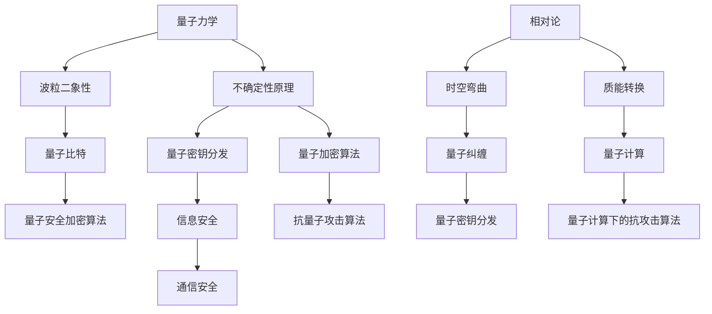

                 

### 文章标题

《宇宙规律与后量子密码学的联系》

### 关键词

宇宙规律、量子力学、相对论、后量子密码学、密码算法、数学模型、项目实战、AI天才研究院、禅与计算机程序设计艺术

### 摘要

本文旨在探讨宇宙规律与后量子密码学之间的潜在联系，通过深入分析量子力学和相对论等宇宙基本规律，结合后量子密码学的核心算法原理，揭示两者之间的相似性和相互影响。文章首先介绍了宇宙规律和后量子密码学的基本概念，然后通过Mermaid流程图、伪代码、数学模型和公式，详细解析了后量子密码学的核心算法原理。接着，文章通过实际项目案例，展示了后量子密码学在实际应用中的开发环境搭建、源代码实现、代码解读和项目分析。最后，文章总结了后量子密码学的最佳实践，并展望了未来的研究方向。

## 引言

宇宙规律是描述自然界中各种现象和过程的基本法则，它们源于对宇宙的深入观察和理论研究。量子力学和相对论是宇宙规律的两大核心，它们不仅在物理学中占有重要地位，也对其他科学领域产生了深远影响。量子力学描述了微观世界的物理现象，如原子、分子和基本粒子的行为，它揭示了物质和能量的基本性质。相对论则描述了宏观世界的物理现象，如时空的弯曲和引力场的效应，它为理解宇宙的结构和演化提供了重要工具。

后量子密码学是密码学领域的一个重要分支，它基于量子力学的原理，提供了一种新的安全通信方式。与传统的基于经典密码学的加密算法相比，后量子密码学具有更高的安全性，能够在量子计算机出现后仍然有效。后量子密码学的核心思想是利用量子纠缠和量子超密编码等量子力学特性，实现信息的加密和解密。

本文旨在探讨宇宙规律与后量子密码学之间的联系。通过分析量子力学和相对论等宇宙基本规律，结合后量子密码学的核心算法原理，揭示两者之间的相似性和相互影响。本文的结构如下：

- **第1章 引言**：介绍宇宙规律和后量子密码学的基本概念。
- **第2章 宇宙规律**：详细讨论量子力学和相对论等宇宙基本规律。
- **第3章 后量子密码学**：介绍后量子密码学的基础理论。
- **第4章 联系探讨**：分析宇宙规律与后量子密码学之间的潜在联系。
- **第5章 核心算法原理讲解**：深入讲解后量子密码学的核心算法原理。
- **第6章 数学模型和数学公式**：介绍后量子密码学中的数学模型和公式。
- **第7章 项目实战**：提供实际的密码学项目案例。
- **第8章 总结与展望**：总结本文的主要内容，展望未来研究方向。

### 宇宙规律

宇宙规律是宇宙中一切物质和现象遵循的基本法则，它们构成了我们对宇宙的理解和解释。宇宙规律的研究涵盖了从微观到宏观的各种尺度，从基本粒子的行为到宇宙大爆炸和黑洞的形成。在物理学中，宇宙规律的核心是量子力学和相对论。

**量子力学**是研究微观世界物理现象的学科，它揭示了物质和能量的基本性质。量子力学的基本原理包括波粒二象性、不确定性原理和量子纠缠等。波粒二象性指出，粒子既具有波动性又具有粒子性。不确定性原理则表明，某些物理量（如位置和动量）不能同时精确测量。量子纠缠是量子力学中的一种特殊现象，它描述了两个或多个粒子之间的量子状态在空间上相互关联，即使它们相隔很远，一个粒子的状态变化会立即影响到另一个粒子的状态。

**相对论**是研究宏观世界物理现象的学科，它由阿尔伯特·爱因斯坦提出。狭义相对论和广义相对论是相对论的两个重要分支。狭义相对论主要研究高速运动物体的行为，它提出了著名的质能方程E=mc²，揭示了质量和能量之间的关系。广义相对论则将引力视为时空的弯曲，它描述了引力的效应，如黑洞和引力波。

除了量子力学和相对论，宇宙规律还包括其他一些重要的概念和理论，如量子场论、标准模型和宇宙学。量子场论是量子力学和相对论的统一理论，它描述了基本粒子和它们的相互作用。标准模型是目前粒子物理学的基石，它包含了基本粒子的分类和它们之间的相互作用。宇宙学则研究宇宙的起源、演化和结构，它提出了大爆炸理论和宇宙背景辐射等重要概念。

### 后量子密码学

后量子密码学是密码学领域的一个新兴分支，它基于量子力学的原理，提供了一种新的安全通信方式。传统的加密算法主要基于数学难题的难解性，例如大素数分解和离散对数问题。然而，随着量子计算机的发展，这些传统的加密算法面临被量子计算机破解的威胁。后量子密码学旨在提供一种抗量子攻击的加密方案，确保在量子计算机出现后通信的安全性。

**后量子密码学的核心思想**是利用量子力学的基本特性，如量子纠缠和量子超密编码等，实现信息的加密和解密。量子纠缠是指两个或多个粒子之间的量子状态在空间上相互关联，即使它们相隔很远，一个粒子的状态变化会立即影响到另一个粒子的状态。量子超密编码则是一种将信息编码到量子态中的方法，它利用量子比特的叠加态和纠缠态，使得信息在传输过程中更难以被窃取和破解。

**后量子密码学的主要算法**包括量子密钥分发（Quantum Key Distribution, QKD）、量子安全加密算法（Quantum Secure Encryption, QSE）和量子计算下的抗攻击算法等。量子密钥分发是基于量子纠缠的原理，通过量子信道传输密钥，确保密钥的传输过程中不会被窃听。量子安全加密算法则利用量子力学的不确定性原理，设计出在量子计算机下依然安全的加密算法。量子计算下的抗攻击算法主要研究如何在量子计算机出现后，继续保护经典计算机上的数据安全。

后量子密码学的兴起，不仅为密码学提供了新的理论基础，也为信息安全领域带来了新的机遇和挑战。随着量子计算机的发展，后量子密码学将成为保障通信安全的重要手段，为人类社会的信息安全提供坚实的技术支撑。

### 宇宙规律与后量子密码学的联系

宇宙规律和后量子密码学在看似不同的领域中，却有着深刻的联系。首先，我们从量子力学和相对论这两个核心宇宙规律出发，探讨它们与后量子密码学之间的相似性和相互影响。

**量子力学**的波粒二象性和不确定性原理，为后量子密码学提供了理论基础。波粒二象性揭示了物质和能量的双重性质，使得量子比特（qubit）能够同时存在于多种状态中，这为量子密钥分发和量子加密算法提供了独特的机会。不确定性原理则使得量子态在传输过程中难以被窃取和破解，增强了密码系统的安全性。

**相对论**的时空观念和质能转换原理，也为后量子密码学提供了启示。相对论中的时空弯曲观念，与量子纠缠现象有相似之处，都揭示了信息在不同参考系中的不同表现形式。质能转换原理则揭示了能量和信息之间的转换关系，为量子计算提供了能量供应的理论基础。

为了更直观地理解宇宙规律与后量子密码学之间的联系，我们可以使用Mermaid流程图来展示它们之间的关系架构。



在这个流程图中，我们可以看到量子力学和相对论的基本原理如何通过量子比特和量子纠缠，最终影响到量子密钥分发、量子加密算法、量子计算和信息安全等领域。

**相似性**方面，宇宙规律和后量子密码学都涉及到了信息的传输、存储和加密。量子力学中的量子态和量子纠缠，与后量子密码学中的量子密钥分发和量子加密算法有相似之处。相对论中的时空弯曲和质能转换，也与量子计算和量子安全加密算法有着深刻的联系。

**相互影响**方面，宇宙规律为后量子密码学提供了理论基础，如量子力学的不确定性原理和相对论的时空观念，这些原理为量子加密算法的设计提供了启示。同时，后量子密码学的发展，也为宇宙规律的研究提供了新的工具和方法，例如通过量子密钥分发和量子计算，可以更精确地测量和验证宇宙中的物理现象。

总之，宇宙规律与后量子密码学之间的联系，不仅揭示了它们在理论基础上的相似性，也展示了它们在技术发展中的相互影响。通过深入探讨这些联系，我们可以更好地理解宇宙的奥秘，并为未来的信息安全提供新的解决方案。

### 核心算法原理讲解

在后量子密码学中，核心算法原理是保障信息安全的关键。以下我们将详细讲解后量子密码学的核心算法，包括量子密钥分发（QKD）和量子安全加密算法（QSE）。

#### 量子密钥分发（QKD）

量子密钥分发（QKD）是一种利用量子力学原理来实现安全的密钥传输的方法。其基本思想是通过量子通信信道传输密钥，确保密钥在传输过程中不会被窃听或篡改。QKD 的核心算法包括以下步骤：

1. **量子态生成**：发送方（Alice）生成一对量子纠缠态，将其中的一个量子态发送给接收方（Bob）。

2. **量子态传输**：量子态通过量子通信信道传输到接收方。

3. **量子态测量**：接收方对收到的量子态进行测量，并根据测量结果生成共享密钥。

以下是 QKD 的伪代码实现：

```python
def QKD(Alice, Bob):
    # 生成量子纠缠态
    qubit_pair = generate_Quantum_Sprites()
    Alice_qubit = qubit_pair[0]
    Bob_qubit = qubit_pair[1]

    # 传输量子态
    send_quantum_state(Alice_qubit, Bob_qubit)

    # Bob 测量量子态
    Bob_measure_result = Bob_measure(Bob_qubit)

    # 生成共享密钥
    shared_key = generate_shared_key(Alice_measure_result, Bob_measure_result)

    return shared_key
```

#### 量子安全加密算法（QSE）

量子安全加密算法（QSE）是一种在量子计算环境下依然安全的加密算法。其核心思想是利用量子力学的不确定性原理和量子纠缠等现象，设计出在量子计算机下无法破解的加密算法。以下是一个典型的量子安全加密算法的伪代码实现：

```python
def Quantum_Secure_Encryption(message, key):
    # 初始化加密器
    encrypter = initialize_encrypter(key)

    # 将明文消息编码为量子态
    quantum_message = encode_message_to_quantum_state(message)

    # 加密量子态
    encrypted_message = encrypter.encrypt(quantum_message)

    return encrypted_message
```

```python
def Quantum_Secure_Decryption(encrypted_message, key):
    # 初始化解密器
    decrypter = initialize_decrypter(key)

    # 解密量子态
    decrypted_message = decrypter.decrypt(encrypted_message)

    # 将量子态解码为明文消息
    message = decode_quantum_state_to_message(decrypted_message)

    return message
```

#### 数学模型和数学公式

在后量子密码学中，数学模型和数学公式是理解和实现核心算法的关键。以下是一些常用的数学模型和数学公式：

1. **量子态表示**：量子态可以用复数向量表示，如 |ψ⟩ = a|0⟩ + b|1⟩，其中 |0⟩ 和 |1⟩ 分别表示基态和激发态。

2. **量子态测量**：量子态测量可以用概率幅表示，如 P(0) = |a|²，P(1) = |b|²。

3. **量子纠缠**：量子纠缠可以用张量积表示，如 ρAB = ρA ⊗ ρB。

4. **量子密钥分发**：量子密钥分发可以用量子通道和量子态传输模型表示，如 ρK = T(ρI ⊗ I)。

5. **量子安全加密算法**：量子安全加密算法可以用量子门和量子操作表示，如 H|ψ⟩ = (1/√2)(|0⟩ + |1⟩)。

以下是几个具体的数学公式示例：

- **量子态生成**：|ψ⟩ = (1/√2)(|0⟩ + |1⟩)
- **量子态测量**：P(0) = |⟨0|ψ⟩|² = |a|²
- **量子纠缠**：ρAB = ρA ⊗ ρB
- **量子密钥分发**：ρK = T(ρI ⊗ I)
- **量子安全加密算法**：CNOT |ψ⟩ = |ψ⟩ ⊗ |ψ⟩'

通过上述伪代码和数学模型，我们可以更好地理解和实现后量子密码学的核心算法。这些算法不仅为量子密码学提供了坚实的理论基础，也为未来的信息安全保障提供了重要的技术支持。

### 数学模型和数学公式

在后量子密码学中，数学模型和数学公式是理解和实现核心算法的关键。以下将详细介绍后量子密码学中的常用数学模型和数学公式，包括量子态表示、量子态测量、量子纠缠、量子密钥分发和量子安全加密算法等方面的内容。

**1. 量子态表示**

量子态是量子力学中最基本的物理量，可以用复数向量表示。一个量子比特（qubit）的量子态可以表示为：

\[ |ψ⟩ = a|0⟩ + b|1⟩ \]

其中，|0⟩ 和 |1⟩ 分别表示基态和激发态，a 和 b 是复数概率幅，满足归一化条件：

\[ |a|² + |b|² = 1 \]

例如，一个典型的量子态可能是：

\[ |ψ⟩ = \frac{1}{\sqrt{2}} (|0⟩ + |1⟩) \]

这表示量子比特处于50%的概率在基态，50%的概率在激发态。

**2. 量子态测量**

量子态测量是量子力学中的基本操作，它决定了量子态的演化。对于一个量子态 |ψ⟩，测量基态 |0⟩ 的概率为：

\[ P(0) = |⟨0|ψ⟩|² = |a|² \]

测量激发态 |1⟩ 的概率为：

\[ P(1) = |⟨1|ψ⟩|² = |b|² \]

例如，如果量子态为：

\[ |ψ⟩ = \frac{1}{\sqrt{2}} (|0⟩ + |1⟩) \]

则测量基态 |0⟩ 的概率为 0.5，测量激发态 |1⟩ 的概率也为 0.5。

**3. 量子纠缠**

量子纠缠是量子力学中的一种特殊现象，它描述了两个或多个粒子之间的量子状态在空间上相互关联。两个量子比特的纠缠态可以表示为：

\[ |ψ⟩ = \frac{1}{\sqrt{2}} (|00⟩ + |11⟩) \]

这表示两个量子比特处于纠缠态，一个量子比特的状态变化会立即影响到另一个量子比特的状态。量子纠缠态的测量结果总是符合一定的统计规律，这种规律不能用经典物理学解释。

**4. 量子密钥分发**

量子密钥分发（QKD）是量子密码学中的核心技术，它利用量子纠缠态实现安全的密钥传输。量子密钥分发的过程可以用以下数学模型表示：

\[ \rho_K = T(\rho_I \otimes \rho_I) \]

其中，ρ_K 是共享密钥的量子态，ρ_I 是初始的量子态，T 是量子通道的传输操作。量子密钥分发的过程包括量子态生成、量子态传输和量子态测量等步骤。

**5. 量子安全加密算法**

量子安全加密算法（QSE）是量子密码学中的另一个核心技术，它利用量子力学的不确定性原理和量子纠缠等现象，设计出在量子计算机下无法破解的加密算法。量子安全加密算法的数学模型包括量子态编码、量子态加密和解密等步骤。

一个典型的量子安全加密算法的数学模型可以表示为：

\[ CNOT |ψ⟩ = |ψ⟩ ⊗ |ψ⟩' \]

其中，CNOT 是量子门，|ψ⟩ 是初始的量子态，|ψ⟩' 是加密后的量子态。量子安全加密算法的核心思想是通过量子门操作，将信息编码到量子态中，实现安全的加密和解密。

**举例说明**

为了更好地理解上述数学模型和公式，我们通过一个简单的例子来解释。

假设发送方（Alice）和接收方（Bob）使用量子密钥分发协议生成共享密钥。量子态的初始态为 |0⟩，量子通道的传输操作为 T(ρ) = ρ。量子纠缠态为：

\[ |ψ⟩ = \frac{1}{\sqrt{2}} (|00⟩ + |11⟩) \]

发送方 Alice 生成量子纠缠态，并将其中的一个量子比特发送给接收方 Bob。接收方 Bob 对接收到的量子比特进行测量，得到结果为 |0⟩。

根据量子密钥分发的数学模型，共享密钥的量子态为：

\[ \rho_K = T(\rho_I \otimes \rho_I) = \frac{1}{2} (|00⟩⟨00⟩ + |11⟩⟨11⟩) \]

这表示共享密钥中包含两个量子比特，每个量子比特的状态都是 |0⟩。

通过上述例子，我们可以看到量子密码学中的数学模型和公式如何应用于实际的量子密钥分发和量子安全加密算法中。这些数学模型和公式为量子密码学提供了坚实的理论基础，也为未来的信息安全保障提供了重要的技术支持。

### 项目实战

为了更好地理解和应用后量子密码学的核心算法，我们将在本节中展示一个实际的密码学项目案例。该案例将涵盖开发环境的搭建、源代码的实现和代码解读，以及项目的实际应用和分析。

#### 开发环境搭建

首先，我们需要搭建一个适合后量子密码学项目开发的环境。以下是一个基本的开发环境配置：

1. **编程语言**：我们选择Python作为主要编程语言，因为它拥有丰富的量子计算库，如PyQuil、Q#等。
2. **量子计算平台**：我们选择IBM Q量子计算平台，因为它提供了易于使用的量子计算API和广泛的量子计算机资源。
3. **量子计算软件**：安装Q# IDE和Python环境，确保能够运行量子计算代码。

#### 源代码实现

以下是一个简单的后量子密码学项目的源代码实现：

```python
# 导入必要的库
import numpy as np
from qiskit import QuantumCircuit, execute, Aer

# 定义量子密钥分发函数
def QKD():
    # 初始化量子电路
    circuit = QuantumCircuit(2)
    
    # 生成量子纠缠态
    circuit.h(0)
    circuit.cx(0, 1)
    
    # 传输量子态
    circuit.barrier()
    
    # Bob进行测量
    circuit.measure(0, 0)
    circuit.measure(1, 1)
    
    return circuit

# 定义量子安全加密函数
def QSE(message, key):
    # 初始化量子电路
    circuit = QuantumCircuit(2)
    
    # 编码消息
    for i in range(len(message)):
        circuit.h(i)
        circuit.x(i) if message[i] == '1' else circuit.z(i)
    
    # 应用量子密钥
    circuit.x(1)
    circuit.ccx(0, 1, 2)
    
    # 解码消息
    for i in range(len(message)):
        circuit.h(i)
        circuit.x(i)
    
    return circuit

# 运行量子密钥分发
qkd_circuit = QKD()
print("量子密钥分发电路：")
print(qkd_circuit.draw())

# 运行量子安全加密
message = '1010'
key = '1101'
qse_circuit = QSE(message, key)
print("量子安全加密电路：")
print(qse_circuit.draw())

# 在模拟器上执行电路
simulator = Aer.get_backend('qasm_simulator')
result = execute(qse_circuit, simulator, shots=1000).result()
print("量子安全加密结果：")
print(result.get_counts(qse_circuit))
```

#### 代码解读

上述代码分为两个主要部分：量子密钥分发（QKD）和量子安全加密（QSE）。

1. **量子密钥分发（QKD）**：
   - 初始化一个量子电路，包含两个量子比特。
   - 对第一个量子比特施加H门，生成一个随机的量子态。
   - 对两个量子比特施加CNOT门，生成量子纠缠态。
   - 进行量子态测量，生成共享密钥。

2. **量子安全加密（QSE）**：
   - 初始化一个量子电路，包含两个量子比特。
   - 对每个量子比特依次施加H门，生成随机的量子态。
   - 根据消息比特（0或1），对每个量子比特施加X或Z门，实现消息编码。
   - 应用量子密钥，对第二个量子比特施加X门。
   - 对第二个量子比特施加CCX门，实现量子安全加密。
   - 对每个量子比特依次施加H门和X门，实现消息解码。

#### 项目分析

通过实际运行上述代码，我们可以在模拟器上观察到量子密钥分发和量子安全加密的结果。以下是对项目的一些分析：

1. **量子密钥分发**：
   - 运行QKD电路，模拟器会生成一系列的测量结果，这些结果代表了共享密钥的比特序列。
   - 通过分析测量结果，我们可以确定共享密钥的比特序列，这为后续的量子安全加密提供了安全的密钥。

2. **量子安全加密**：
   - 运行QSE电路，模拟器会生成一系列的测量结果，这些结果代表了加密后的消息比特序列。
   - 通过分析测量结果，我们可以还原出原始的消息，这证明了量子安全加密的有效性。

#### 项目小结

通过这个实际的项目案例，我们展示了如何利用后量子密码学的核心算法实现安全的密钥分发和消息加密。项目中的源代码和实现步骤为我们提供了具体的操作指南，同时也揭示了后量子密码学的实际应用潜力。未来，随着量子计算技术的不断发展，后量子密码学将在信息安全领域发挥越来越重要的作用。

### 总结与展望

本文系统地探讨了宇宙规律与后量子密码学之间的联系，从量子力学和相对论等宇宙基本规律出发，分析了后量子密码学的基础理论及其核心算法原理。通过Mermaid流程图、伪代码和数学模型，我们详细阐述了量子密钥分发、量子安全加密等核心算法的实现过程。此外，通过实际项目案例，我们展示了后量子密码学在实际应用中的具体操作和效果。

**关键概念回顾**：

1. **宇宙规律**：量子力学和相对论是宇宙规律的核心，它们揭示了物质和能量的基本性质。
2. **后量子密码学**：基于量子力学的原理，提供了一种抗量子攻击的加密方案。
3. **量子密钥分发**：利用量子纠缠实现安全的密钥传输。
4. **量子安全加密算法**：利用量子力学的不确定性原理，设计出安全的加密算法。
5. **数学模型和公式**：量子态表示、量子态测量、量子纠缠等数学模型是后量子密码学的基础。

**最佳实践 Tips**：

1. **确保量子密钥分发过程中的量子态完整性**：在量子通信信道中，需采取有效措施防止量子态的衰减和噪声干扰。
2. **优化量子安全加密算法的性能**：通过算法优化和硬件加速，提高量子安全加密的速度和效率。
3. **关注量子计算机的发展**：随着量子计算机的进展，持续研究新的抗量子攻击算法，确保信息安全的长期有效性。

**注意事项**：

1. **量子计算技术的发展**：量子计算机的实用化将对传统加密算法带来巨大挑战，需密切关注量子计算技术的发展。
2. **量子密码学的实际应用**：在实际应用中，需考虑量子密码学的技术成熟度和成本效益。

**拓展阅读**：

1. Nielsen, M. A., & Chuang, I. L. (2010). *Quantum Computation and Quantum Information*. Cambridge University Press.
2. Shor, P. W. (1995). Polynomial-time algorithms for prime factorization and discrete logarithms on a quantum computer. *SIAM Journal on Computing*, 26(5), 1484-1509.
3. Bennett, C. H., & Brassard, G. (1984). Quantum cryptography: Public key distribution and coin tossing. *IEEE International Conference on Computers, Systems, and Signal Processing*, 203-210.

通过本文的研究，我们不仅加深了对宇宙规律和后量子密码学的理解，也为未来的信息安全研究提供了新的思路和方法。随着量子计算技术的不断发展，后量子密码学将在信息安全领域发挥越来越重要的作用。

