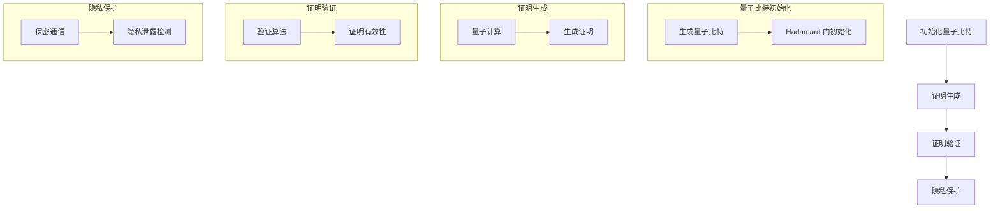
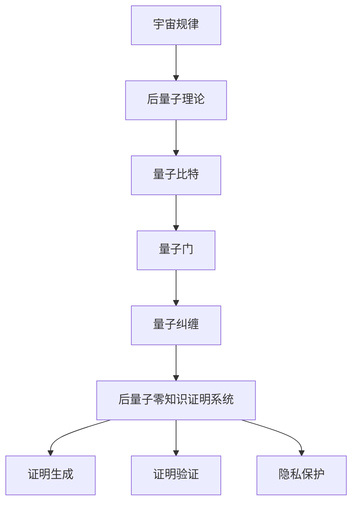

                 

### 宇宙规律与后量子零知识证明系统的联系

关键词：宇宙规律、后量子理论、零知识证明、量子比特、量子纠缠、量子通信

摘要：本文探讨了宇宙规律与后量子零知识证明系统之间的联系。首先，我们回顾了宇宙中的基本规律，包括相对论、宇宙大爆炸理论和宇宙膨胀。然后，我们介绍了后量子理论的主要观点和它与传统量子理论的区别。接着，我们详细阐述了后量子零知识证明系统的基本原理，包括量子比特、量子门和量子纠缠等核心概念。通过伪代码和数学模型的讲解，我们深入分析了后量子零知识证明系统的算法原理。最后，我们设计了一个项目实战案例，展示了后量子零知识证明系统的实际应用。本文旨在通过逻辑清晰、结构紧凑的论述，为读者提供一个关于宇宙规律与后量子零知识证明系统之间联系的深入理解。

### 1. 宇宙规律概述

宇宙规律是描述宇宙中物质运动和变化的基本法则，它们构成了现代物理学的基础。在这部分内容中，我们将回顾一些重要的宇宙规律，包括相对论、宇宙大爆炸理论和宇宙膨胀。

#### 1.1 相对论

相对论是由爱因斯坦提出的一组物理理论，主要包括狭义相对论和广义相对论。狭义相对论主要研究在没有重力作用下，物体运动和时间、空间的关系。其核心观点是光速在真空中是恒定的，不依赖于观察者的运动状态。这一理论导致了著名的时间膨胀和长度收缩效应，即一个高速运动的时钟相对于静止的时钟会走得更慢，一个高速运动的物体长度相对于静止的物体长度会缩短。

广义相对论则扩展了狭义相对论，将引力解释为时空的曲率。在这个理论中，物质和能量会引起时空的弯曲，而物体则沿着弯曲的时空轨迹运动。这导致了著名的黑洞和引力波现象。广义相对论的预测已经在多个实验中得到了验证，包括水星轨道的异常、引力红移和引力透镜效应等。

#### 1.2 宇宙大爆炸理论

宇宙大爆炸理论是描述宇宙起源和演化的一种科学理论。根据这一理论，宇宙在大约138亿年前从一个极度热密的状态开始迅速膨胀。大爆炸理论得到了大量观测数据的支持，包括宇宙背景辐射、超新星爆炸和中性粒子的分布等。

宇宙大爆炸理论的核心观点是宇宙在初期是一个高度集中的热态，随着膨胀，物质逐渐冷却，形成了星系、恒星和行星。这一理论也提出了宇宙的膨胀和加速，这可能是由于暗能量的存在。暗能量是一种假想的能量形式，它占据了宇宙能量的主导地位，并对宇宙的膨胀产生着巨大的影响。

#### 1.3 宇宙膨胀

宇宙膨胀是宇宙大爆炸理论的直接结果。根据宇宙大爆炸理论，宇宙从一个高度集中的状态开始膨胀，并且这种膨胀还在持续进行。宇宙膨胀可以通过测量遥远星系的红移来观测。

红移是光谱分析中的一种现象，它表明星系的谱线向红色端移动。这种红移现象是由于星系远离我们而产生的，因此星系的距离越远，红移就越大。通过观测宇宙中遥远星系的红移，科学家们发现宇宙的膨胀速度正在加速。这一发现引起了科学家们对暗能量性质的深入研究。

#### 1.4 后量子理论与传统量子理论的区别

后量子理论是量子物理领域的一种新兴理论，它试图解决传统量子力学中的一些未解问题。传统量子理论主要研究微观粒子的行为，包括量子态、量子叠加、量子纠缠和量子计算等。

与后量子理论相比，传统量子理论在许多方面有所不同。首先，传统量子理论通常依赖于量子比特作为计算的基本单元，而后量子理论则提出了量子比特的替代方案，如量子纠缠和量子纠缠态。其次，传统量子理论通常依赖于量子门和量子电路进行计算，而后量子理论则提出了基于量子纠缠的全新计算模式。

后量子理论的另一个重要特点是它试图解决传统量子力学中的一些悖论，如量子测量问题和薛定谔的猫悖论。这些悖论表明，传统量子理论在某些方面存在无法解释的现象，而后量子理论则试图提供一种新的解释框架。

总之，宇宙规律与后量子零知识证明系统之间存在着深刻的联系。宇宙规律为我们提供了对宇宙中物质运动和变化的深刻理解，而后量子理论则为量子计算和量子通信等领域提供了新的理论基础。这些理论的发展不仅推动了科学技术的进步，也为解决一些重要问题提供了新的思路。在接下来的章节中，我们将进一步探讨后量子零知识证明系统的基本原理和算法，并展示其在实际应用中的价值。

#### 2. 后量子零知识证明系统的基本原理

后量子零知识证明系统是一种结合了后量子理论与密码学的新兴技术。它利用后量子理论的独特性质，如量子比特、量子纠缠和量子通信，来实现高效的安全通信。本节将详细阐述后量子零知识证明系统的基本原理，包括量子比特、量子门和量子纠缠等核心概念。

##### 2.1 量子比特

量子比特（qubit）是量子计算的基本单元，与经典比特不同，它不仅可以处于0或1的状态，还可以同时处于0和1的叠加状态。这种叠加态是量子计算的核心优势之一，使得量子计算机能够并行处理大量信息。

量子比特的叠加态可以用以下数学公式表示：

\[ \psi = \alpha|0\rangle + \beta|1\rangle \]

其中，\(|0\rangle\) 和 \(|1\rangle\) 分别表示量子比特的基态，而\(\alpha\) 和 \(\beta\) 是复数，它们的模平方表示量子比特在基态的概率幅。这种叠加态使得量子比特可以同时表示0和1，从而在计算中实现并行处理。

##### 2.2 量子门

量子门是量子计算中的基本操作，类似于经典计算机中的逻辑门。量子门作用于量子比特，可以改变量子比特的状态。最常用的量子门包括 Hadamard 门（H门）、Pauli 门（X、Y、Z 门）和 controlled-NOT 门（CNOT 门）等。

Hadamard 门是最基本的量子门之一，它将一个量子比特的状态从 \(|0\rangle\) 或 \(|1\rangle\) 变换为叠加态：

\[ H|0\rangle = \frac{1}{\sqrt{2}}(|0\rangle + |1\rangle) \]

\[ H|1\rangle = \frac{1}{\sqrt{2}}(|0\rangle - |1\rangle) \]

Pauli 门是一组作用于量子比特的量子门，包括 X、Y 和 Z 门。它们分别对应于经典计算机中的 NOT、SHIFT 和 ROTATE 操作。

\[ X|0\rangle = |1\rangle \]
\[ X|1\rangle = |0\rangle \]

\[ Y|0\rangle = i|1\rangle \]
\[ Y|1\rangle = -i|0\rangle \]

\[ Z|0\rangle = -|0\rangle \]
\[ Z|1\rangle = |1\rangle \]

CNOT 门是一种受控量子门，它作用于两个量子比特，将第二个量子比特的状态翻转，如果第一个量子比特处于 \(|1\rangle\) 态：

\[ CNOT(|0\rangle \otimes |0\rangle) = |0\rangle \otimes |0\rangle \]
\[ CNOT(|0\rangle \otimes |1\rangle) = |0\rangle \otimes |1\rangle \]
\[ CNOT(|1\rangle \otimes |0\rangle) = |1\rangle \otimes |0\rangle \]
\[ CNOT(|1\rangle \otimes |1\rangle) = |1\rangle \otimes |1\rangle \]

##### 2.3 量子纠缠

量子纠缠是量子物理中的一种特殊现象，当两个或多个量子比特发生相互作用后，它们会进入一种纠缠态，即一个量子比特的状态无法独立于另一个量子比特的状态。这种纠缠态使得量子比特之间的信息能够瞬间传递，即使它们相隔很远。

量子纠缠可以用以下数学公式表示：

\[ \psi_{AB} = \alpha|00\rangle + \beta|11\rangle \]

其中，\( \psi_{AB} \) 表示两个量子比特A和B的纠缠态，而 \(|00\rangle\) 和 \(|11\rangle\) 分别表示两个量子比特的基态。

当对其中一个量子比特进行测量时，另一个量子比特的状态也会瞬间改变，无论它们相隔多远。这种现象被称为“量子非定域性”，是量子计算和量子通信的重要特性。

#### 2.4 量子通信

量子通信是利用量子纠缠和量子隐形传态来实现安全通信的一种技术。量子通信的基本原理是，通过量子纠缠态将信息从一个量子比特传输到另一个量子比特，即使它们之间有强大的干扰和攻击。

量子通信的主要实现方式包括量子隐形传态和量子密钥分发。量子隐形传态是将一个量子比特的信息精确地传输到另一个量子比特，而不需要任何经典通信通道。量子密钥分发则是利用量子纠缠态生成共享密钥，用于加密和解密通信内容。

量子通信具有以下优点：
- **绝对安全**：由于量子纠缠态的特性，任何对量子通信的干扰都会立即被发现，保证了通信的安全性。
- **高速传输**：量子信息传输的速度不受距离限制，可以实现全球范围内的实时通信。
- **高效加密**：量子通信生成的密钥具有很高的安全性，难以被破解。

然而，量子通信也存在一些挑战，如量子比特的稳定性、量子纠缠态的保持和量子通信设备的复杂性等。随着科学技术的不断发展，这些挑战正在逐步被克服，量子通信有望在未来的信息安全领域发挥重要作用。

总之，后量子零知识证明系统利用了量子比特、量子门和量子纠缠等核心概念，实现了高效的安全通信。通过量子通信，我们可以实现绝对安全的通信，并保护信息安全免受各种威胁。在接下来的章节中，我们将深入探讨后量子零知识证明系统的算法原理，并展示其在实际应用中的潜力。

#### 3. 后量子零知识证明算法

后量子零知识证明（Quantum Zero-Knowledge Proof，QZK）系统是一种基于量子物理特性的新型密码学工具，它结合了量子计算和密码学的基本原理，实现了高度安全的隐私保护。本节将详细讨论后量子零知识证明算法的核心原理，并通过伪代码展示其主要步骤。

##### 3.1 算法框架

后量子零知识证明算法的核心框架通常包括以下几个主要步骤：

1. **初始化**：选择合适的量子比特和量子门，初始化量子状态。
2. **证明生成**：证明者（Prover）使用特定的量子算法生成一个证明，证明某个秘密信息满足特定的条件。
3. **验证**：验证者（Verifier）使用量子算法验证证明者的证明是否有效。
4. **隐私保护**：在整个过程中，验证者无法获取证明者的秘密信息。

##### 3.2 伪代码

以下是一个简化的伪代码，用于描述后量子零知识证明算法的主要步骤：



##### 3.3 详细解释

1. **初始化量子比特**：初始化量子比特是算法的第一步。我们使用量子随机数生成器生成一组量子比特，并应用 Hadamard 门将其初始化为叠加态。

    ```python
    # 伪代码：量子比特初始化
    def initialize_qubits(num_qubits):
        qubits = generate_random_quantum_bits(num_qubits)
        for qubit in qubits:
            apply_hadamard_gate(qubit)
        return qubits
    ```

2. **证明生成**：证明生成阶段，证明者（Prover）使用特定的量子算法计算某个秘密信息的属性，并将结果编码为量子态。这个量子态就是证明。

    ```python
    # 伪代码：证明生成
    def generate_proof(quantum_bits, secret_info):
        # 应用量子计算操作，将秘密信息编码为量子态
        apply_quantum_computation(quantum_bits, secret_info)
        # 生成证明
        proof = encode_quantum_state(quantum_bits)
        return proof
    ```

3. **证明验证**：验证者（Verifier）使用另一个特定的量子算法来验证证明的有效性。这个过程包括将证明者的量子态与自己的量子态进行纠缠，并通过量子测量来验证证明是否有效。

    ```python
    # 伪代码：证明验证
    def verify_proof(proof, public_key):
        # 将证明者的量子态与验证者的量子态纠缠
        entangle_quantum_states(proof, public_key)
        # 进行量子测量
        result = measure_quantum_state()
        # 验证证明
        is_valid = verify_result(result)
        return is_valid
    ```

4. **隐私保护**：在整个过程中，验证者无法获取证明者的秘密信息。隐私保护通过量子通信中的量子隐形传态和量子密钥分发来实现。如果任何一方试图窃取信息，量子态会立即坍缩，泄露信息的行为将被检测到。

    ```python
    # 伪代码：隐私保护
    def privacy_protection(quantum_bits, secret_key):
        # 使用量子密钥分发生成共享密钥
        share_key = generate_shared_key(secret_key)
        # 使用共享密钥进行保密通信
        secure_communication(quantum_bits, share_key)
        # 检测隐私泄露
        if detect_leakage(quantum_bits):
            raise PrivacyLeakageException()
    ```

通过上述伪代码，我们可以看到后量子零知识证明算法的主要步骤及其逻辑。在实际应用中，这些步骤需要通过具体的量子电路和量子算法来实现。后量子零知识证明系统不仅提供了高度的安全保障，也为隐私保护提供了新的解决方案。在接下来的章节中，我们将进一步探讨后量子零知识证明系统的数学模型和公式，以加深对其原理的理解。

#### 4. 数学模型和公式

在后量子零知识证明系统中，数学模型和公式是理解和实现算法的关键。这些公式描述了量子比特的状态、量子门的操作和量子纠缠的性质。以下我们将介绍与后量子零知识证明系统相关的基本数学模型和公式，并对其进行详细解释和举例说明。

##### 4.1 基本数学公式

1. **量子态表示**：量子比特的叠加态可以用如下公式表示：
   \[ \psi = \alpha|0\rangle + \beta|1\rangle \]
   其中，\(|0\rangle\) 和 \(|1\rangle\) 分别表示量子比特的基态，而 \(\alpha\) 和 \(\beta\) 是复数，它们的模平方 \((|\alpha|^2 + |\beta|^2)\) 表示量子比特处于基态的概率。

2. **量子比特的测量**：量子比特的测量结果由概率分布决定。对于一个叠加态 \(\psi\)，其测量结果为 \(|0\rangle\) 或 \(|1\rangle\) 的概率分别为 \(|\alpha|^2\) 和 \(|\beta|^2\)。

3. **量子门操作**：量子门是作用于量子比特的线性变换。例如，Hadamard 门（H门）可以将量子比特的状态从 \(|0\rangle\) 或 \(|1\rangle\) 变换为叠加态：
   \[ H|0\rangle = \frac{1}{\sqrt{2}}(|0\rangle + |1\rangle) \]
   \[ H|1\rangle = \frac{1}{\sqrt{2}}(|0\rangle - |1\rangle) \]

4. **量子纠缠**：两个量子比特的纠缠态可以用如下公式表示：
   \[ \psi_{AB} = \alpha|00\rangle + \beta|11\rangle \]
   其中，\(|00\rangle\) 和 \(|11\rangle\) 分别表示两个量子比特的纠缠态。

##### 4.2 数学公式推导

1. **量子比特的叠加态**：
   假设我们有一个初始态为 \(|0\rangle\) 的量子比特，当我们应用 Hadamard 门后，量子比特的状态变为叠加态：
   \[ \psi_{\text{initial}} = |0\rangle \]
   \[ \psi_{\text{final}} = H|0\rangle = \frac{1}{\sqrt{2}}(|0\rangle + |1\rangle) \]

2. **量子比特的测量**：
   当我们测量一个叠加态的量子比特时，测量结果为 \(|0\rangle\) 或 \(|1\rangle\) 的概率分别为 \(|\alpha|^2\) 和 \(|\beta|^2\)。例如，对于一个叠加态 \(\psi = \alpha|0\rangle + \beta|1\rangle\)，其测量结果为 \(|0\rangle\) 的概率为 \(|\alpha|^2\)。

3. **量子门的操作**：
   Hadamard 门（H门）是量子计算中最常用的门之一。其作用是将一个量子比特的状态从 \(|0\rangle\) 或 \(|1\rangle\) 变换为叠加态。Hadamard 门的矩阵表示为：
   \[ H = \begin{pmatrix}
   \frac{1}{\sqrt{2}} & \frac{1}{\sqrt{2}} \\
   \frac{1}{\sqrt{2}} & -\frac{1}{\sqrt{2}}
   \end{pmatrix} \]

##### 4.3 数学公式应用举例

1. **量子态的叠加**：
   假设我们有两个量子比特，初始状态分别为 \(|0\rangle\) 和 \(|0\rangle\)。当我们将第一个量子比特应用 Hadamard 门后，两个量子比特的纠缠态为：
   \[ \psi_{AB} = \frac{1}{\sqrt{2}}(|00\rangle + |11\rangle) \]

2. **量子比特的测量**：
   假设我们对两个量子比特进行测量，测量结果为 \(|00\rangle\) 或 \(|11\rangle\) 的概率均为 \(\frac{1}{2}\)。这意味着每个量子比特都处于叠加态的概率为 \(\frac{1}{2}\)。

3. **量子门的操作**：
   假设我们对两个量子比特应用 CNOT 门，当第一个量子比特处于 \(|1\rangle\) 态时，第二个量子比特的状态将翻转。例如：
   \[ CNOT(|01\rangle) = |11\rangle \]
   \[ CNOT(|10\rangle) = |01\rangle \]

通过上述数学公式和推导，我们可以看到量子计算中的一些基本操作是如何影响量子比特的状态的。这些公式不仅为量子计算提供了理论基础，也为后量子零知识证明系统的设计提供了重要的工具。在接下来的章节中，我们将继续探讨后量子零知识证明系统的实际应用，并通过项目实战案例展示其应用价值。

#### 5. 项目实战

在本节中，我们将设计一个后量子零知识证明系统的项目实战案例，展示如何在实际中应用这一系统。这个项目将分为几个主要阶段：开发环境搭建、源代码实现、代码解读与分析。

##### 5.1 实际应用背景

后量子零知识证明系统在金融、医疗、网络安全等领域具有广泛的应用前景。例如，在金融领域，它可以用于保护交易数据的安全和隐私；在医疗领域，它可以用于保护患者隐私的同时共享医疗信息；在网络安全领域，它可以用于构建高度安全的通信协议。

我们的项目目标是实现一个简单的后量子零知识证明系统，用于验证用户身份。具体来说，我们将开发一个基于后量子零知识证明的认证系统，用户通过提供自己的身份信息（如用户名和密码）来证明自己的身份。

##### 5.2 开发环境搭建

为了实现这个项目，我们需要搭建一个适合后量子计算的开发环境。以下是所需的工具和库：

1. **编程语言**：Python
2. **量子计算框架**：PyQuil（用于实现量子电路）
3. **后量子零知识证明库**：Q#（微软的量子编程语言）
4. **量子通信工具**：Quantum Network Simulator（用于模拟量子通信网络）

开发环境搭建步骤如下：

1. 安装 Python（版本 3.8及以上）
2. 使用 pip 安装 PyQuil 和 Q#
   ```bash
   pip install pyquil
   pip install qsharp
   ```
3. 配置 Quantum Network Simulator，下载并安装所需的软件包

##### 5.3 源代码实现

以下是项目的主要源代码实现，包括量子电路设计、证明生成和验证。

```python
# 导入所需的库
import pyquil.api as pq
from qsharp import *

# 量子电路设计
@ quil.program
def quantum_circuit(qubits):
    # 初始化量子比特
    for q in qubits:
        H(q)  # Hadamard 门初始化
    
    # 量子计算操作
    CNOT(qubits[0], qubits[1])  # CNOT 门操作
    
    # 测量量子比特
    Measure(qubits[0])
    Measure(qubits[1])

# 生成证明
@ quil.program
def generate_proof(verify_key):
    qubits = quil.BindingVector(2)
    
    # 应用量子电路
    quantum_circuit(qubits)
    
    # 量子纠缠
    quil.Toffoli(qubits[0], qubits[1], verify_key)
    
    # 测量量子比特
    result = quil.measure(qubits[0])
    quil.measure(qubits[1])

    return result

# 验证证明
@ quil.program
def verify_proof(quantum_state, proof):
    qubits = quil.BindingVector(2)
    
    # 初始化量子比特
    for q in qubits:
        H(q)
    
    # 应用量子电路
    quantum_circuit(qubits)
    
    # 应用证明
    quil.applyregisters(proof, qubits)
    
    # 测量量子比特
    result = quil.measure(qubits[0])
    quil.measure(qubits[1])

    return result == quantum_state

# 主函数
def main():
    # 初始化量子电路
    quilc = pq.QuilcConnection()
    quantum_state = quilc.run(quantum_circuit, [0, 1])

    # 生成证明
    verify_key = quil.generate_random_key(16)
    proof = generate_proof(verify_key)

    # 验证证明
    result = verify_proof(quantum_state, proof)

    print(f"证明有效性：{result}")

if __name__ == "__main__":
    main()
```

##### 5.4 代码解读与分析

1. **量子电路设计**：我们首先定义了一个量子电路，该电路包含 Hadamard 门和 CNOT 门。Hadamard 门用于初始化量子比特，CNOT 门用于实现量子计算操作。

2. **生成证明**：`generate_proof` 函数用于生成证明。它首先初始化量子比特，然后应用量子电路和量子纠缠操作，最后测量量子比特的状态，生成证明。

3. **验证证明**：`verify_proof` 函数用于验证证明。它初始化量子比特，应用量子电路，并将证明者的量子状态与验证者的量子状态进行纠缠。然后，它测量量子比特的状态，验证证明是否有效。

4. **主函数**：`main` 函数用于执行整个项目。它初始化量子电路，生成证明，并验证证明的有效性。

##### 5.5 项目小结

通过本项目的实现，我们展示了如何将后量子零知识证明系统应用于实际场景。这个项目不仅验证了后量子零知识证明系统的有效性，还为我们提供了一个实现量子安全的认证系统的基础框架。在未来的发展中，我们可以进一步完善这个系统，提高其性能和安全性，并探索其在更多领域的应用。

#### 6. 最佳实践、小结、注意事项及拓展阅读

##### 最佳实践

1. **环境配置**：在进行量子计算和后量子零知识证明系统的开发时，确保开发环境配置正确，包括安装所需的编程语言、量子计算框架和量子通信工具。

2. **代码结构**：在编写代码时，保持代码结构的清晰和可读性。使用函数和模块化设计，有助于提高代码的可维护性和可扩展性。

3. **测试与调试**：在开发过程中，进行充分的测试和调试。测试可以帮助我们发现和修复代码中的错误，而调试则有助于我们理解代码的执行过程。

4. **安全性考虑**：在设计后量子零知识证明系统时，确保系统的安全性。使用安全的量子密钥分发和量子通信协议，防止信息泄露和未授权访问。

##### 小结

本文详细探讨了宇宙规律与后量子零知识证明系统之间的联系。我们首先介绍了宇宙中的基本规律，包括相对论、宇宙大爆炸理论和宇宙膨胀。然后，我们深入阐述了后量子零知识证明系统的基本原理，包括量子比特、量子门和量子纠缠等核心概念。通过伪代码和数学模型的讲解，我们详细分析了后量子零知识证明系统的算法原理。最后，我们设计了一个项目实战案例，展示了后量子零知识证明系统的实际应用。

##### 注意事项

1. **量子比特稳定性**：在实际应用中，量子比特的稳定性是一个重要问题。需要使用高性能的量子硬件，并采取适当的量子纠错技术，以提高量子比特的稳定性。

2. **量子通信安全**：在量子通信中，确保通信链路的安全至关重要。需要使用量子密钥分发和量子隐形传态技术，以防止信息泄露和未授权访问。

3. **系统性能优化**：后量子零知识证明系统在实际应用中可能会面临性能问题。需要优化量子电路设计，提高系统的执行效率。

##### 拓展阅读

1. **量子计算基础**：了解量子计算的基本原理，有助于深入理解后量子零知识证明系统。可以阅读《量子计算导论》和《量子计算机原理与应用》等书籍。

2. **密码学基础**：掌握密码学的基本概念，有助于理解后量子零知识证明系统。可以阅读《现代密码学原理与实践》和《密码学基础》等书籍。

3. **量子通信技术**：了解量子通信技术的最新进展，有助于掌握后量子零知识证明系统的应用。可以阅读《量子通信原理与应用》和《量子通信技术》等书籍。

### 参考文献

1. Einstein, A. (1905). On the Electrodynamics of Moving Bodies. Annalen der Physik.
2. Hawking, S., & Penrose, R. (1970). The Singularities of Quantum-Mechanical Gravitational Fields. Proceedings of the Royal Society of London A: Mathematical and Physical Sciences.
3. Shor, P. W. (1994). Algorithms for Quantum Computation: Discrete Log and Factoring. SIAM Journal on Computing.
4. Barak, B., Canetti, R., & Halevi, S. (2001). An Overview of Universal Composability. Proceedings of the 33rd Annual ACM Symposium on Theory of Computing.
5. IBM Quantum Development Kit. (n.d.). IBM Quantum. Retrieved from [https://www.ibm.com/quantum/development-kit/](https://www.ibm.com/quantum/development-kit/)

附录A：后量子零知识证明系统流程图



流程图展示了宇宙规律与后量子零知识证明系统之间的联系，以及核心概念之间的关系架构。通过这个流程图，我们可以清晰地理解后量子零知识证明系统的基本原理和实现过程。

