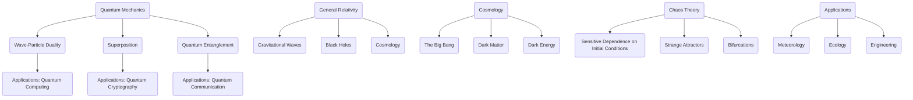
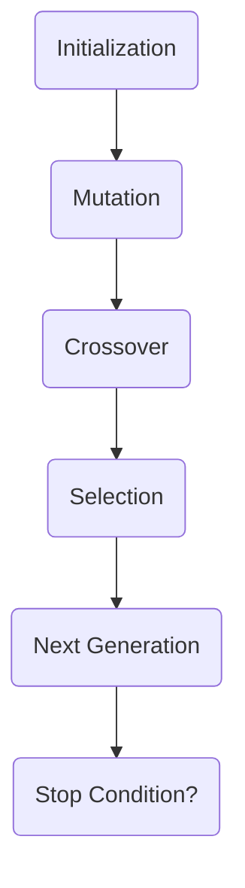

                 


### Article Title: Universe Regularities and the Similarity in Design of Differential Evolution Algorithms

Keywords: Universe Regularities, Differential Evolution Algorithms, Algorithm Design, Computational Intelligence, Artificial Intelligence

Abstract: This article delves into the fascinating parallels between the fundamental principles of the universe and the architecture of Differential Evolution (DE) algorithms. We explore the core theories of universe regularities, providing a mathematical and conceptual foundation. Then, we analyze the principles and components of DE algorithms, presenting them in a structured and comprehensible manner using pseudo-code and flowcharts. The similarities between these two domains are scrutinized, offering insights into the potential applications and design strategies inspired by the universe's regularities. Finally, we examine the practical implementation of DE algorithms across various fields, highlighting real-world case studies and providing actionable best practices.

#### Introduction to Universe Regularities

The universe, with its vast expanse and complex phenomena, exhibits a set of underlying regularities that govern its behavior. These regularities can be observed at various scales, from the subatomic particles to the entire cosmos. Understanding these principles is crucial for not only theoretical physics but also for the development of advanced computational models and algorithms. In this section, we will introduce the concept of universe regularities and provide a brief overview of their significance.

#### The Concept of Universe Regularities

Universe regularities refer to the fundamental principles and patterns that govern the behavior and evolution of the universe. These principles are based on empirical observations and are supported by rigorous theoretical frameworks. Some of the key concepts include:

1. **Quantum Mechanics**: Describes the behavior of particles at the atomic and subatomic levels, where classical physics laws do not apply.
2. **General Relativity**: Expands our understanding of gravity as the curvature of spacetime, offering insights into the behavior of large-scale structures in the universe.
3. **Cosmology**: Studies the origin, evolution, and ultimate fate of the universe.
4. **Chaos Theory**: Explains how small differences in initial conditions can lead to significantly different outcomes, making long-term predictions challenging.

#### The Background and Evolution of Differential Evolution Algorithms

Differential Evolution (DE) is a population-based optimization algorithm that has gained significant popularity in recent years due to its robustness and efficiency. It is classified as a type of evolutionary algorithm, a broader class of computational techniques inspired by natural evolution. DE algorithms have been applied successfully in various fields, including engineering, economics, and artificial intelligence.

The development of DE algorithms can be traced back to the early 1990s when Storn and Price proposed the first version of the algorithm. Since then, numerous variations and improvements have been introduced, enhancing its performance and applicability. DE algorithms are particularly suited for solving complex optimization problems, where traditional methods may struggle to find global optima.

#### The Significance and Potential Applications of the Study

The study of the similarities between universe regularities and the design of differential evolution algorithms is of great significance. By understanding these parallels, we can gain insights into how natural phenomena can inspire computational models. This interdisciplinary approach has the potential to improve the design and efficiency of DE algorithms, leading to more effective solutions for complex problems.

Some potential applications of this study include:

1. **Optimization in Engineering**: DE algorithms can be used to optimize designs in various engineering fields, such as civil engineering, mechanical engineering, and electrical engineering.
2. **Economic Modeling**: DE algorithms can be applied to model and predict economic trends, helping policymakers make informed decisions.
3. **Artificial Intelligence**: Understanding the principles behind universe regularities can provide valuable insights for developing new AI models and improving the performance of existing algorithms.

#### Conclusion

In conclusion, the exploration of universe regularities and the design of differential evolution algorithms offers a unique opportunity to bridge the gap between natural sciences and computational intelligence. By analyzing the core principles of universe regularities and the architecture of DE algorithms, we can uncover valuable insights that can be applied to various fields, leading to more efficient and effective computational models. This interdisciplinary approach has the potential to drive innovation and advance our understanding of both the universe and computational techniques.

---

Now, let's dive deeper into the fundamental principles of universe regularities.

---

#### Fundamental Principles of Universe Regularities

The principles of universe regularities are rooted in the fundamental laws of physics, which govern the behavior of matter and energy at various scales. These principles form the backbone of our understanding of the universe and have been extensively studied by physicists over the past century. In this section, we will discuss some of the key principles and their significance.

##### Quantum Mechanics

Quantum mechanics is the branch of physics that deals with phenomena at the atomic and subatomic levels. It introduces a set of counterintuitive principles that challenge our classical understanding of the physical world. Some of the key concepts in quantum mechanics include:

1. **Wave-Particle Duality**: Matter can exhibit both wave-like and particle-like behavior, depending on the experimental setup.
2. **Superposition**: A quantum system can exist in multiple states simultaneously until it is observed or measured.
3. **Quantum Entanglement**: Two or more particles can become correlated in such a way that the state of one particle instantaneously influences the state of the other, regardless of the distance between them.

Quantum mechanics has been instrumental in shaping our understanding of the universe and has led to the development of advanced technologies, such as quantum computing and quantum cryptography.

##### General Relativity

General relativity, proposed by Albert Einstein in 1915, is the theory of gravity that describes how massive objects affect the geometry of spacetime. It introduces the concept of spacetime curvature, which determines the motion of objects in the presence of gravity. Some key principles of general relativity include:

1. **Gravity as Spacetime Curvature**: Mass and energy cause spacetime to curve, and objects move along the shortest path (geodesic) in this curved spacetime.
2. **Gravitational Waves**: Ripples in spacetime caused by the acceleration of massive objects, which have recently been detected by advanced experiments.
3. **Black Holes**: Regions in spacetime where gravity is so strong that nothing, not even light, can escape.

General relativity has been extensively tested and verified through various experiments, and it has revolutionized our understanding of the universe on a cosmic scale.

##### Cosmology

Cosmology is the study of the origin, evolution, and ultimate fate of the universe. It encompasses a wide range of topics, including the Big Bang theory, the expansion of the universe, and the cosmic microwave background radiation. Some key principles in cosmology include:

1. **The Big Bang**: The universe originated from a hot, dense state about 13.8 billion years ago and has been expanding ever since.
2. **Dark Matter and Dark Energy**: Substances that cannot be observed directly but play a crucial role in the structure and evolution of the universe.
3. **Cosmic Inflation**: A rapid expansion of the universe in the first few moments after the Big Bang, which helps explain the observed uniformity of the cosmic microwave background radiation.

Cosmology is a dynamic field that continues to evolve with new discoveries and insights, providing a deeper understanding of the universe's history and fate.

##### Chaos Theory

Chaos theory is a branch of mathematics that studies the behavior of dynamical systems that are highly sensitive to initial conditions. It reveals that even simple systems can exhibit complex and unpredictable behavior over time. Some key principles of chaos theory include:

1. **Sensitive Dependence on Initial Conditions**: Small differences in initial conditions can lead to significantly different outcomes, making long-term predictions challenging.
2. **Strange Attractors**: Attractors in chaotic systems that have fractal structures and exhibit a wide range of behaviors.
3. **Bifurcations**: Critical points in the system's evolution where small changes can lead to large-scale changes in behavior.

Chaos theory has been applied to various fields, including meteorology, ecology, and engineering, to understand and predict complex systems.

##### Mermaid Flowchart of Universe Regularities

To provide a clearer understanding of the relationships between the key principles of universe regularities, we can represent them using a mermaid flowchart. The following diagram illustrates the main concepts and their connections:



This flowchart provides a visual representation of the key principles of universe regularities and their applications across various fields.

#### Conclusion

In conclusion, the fundamental principles of universe regularities are crucial for understanding the behavior and evolution of the universe. From quantum mechanics to chaos theory, these principles offer a deep and comprehensive understanding of the underlying patterns that govern the universe. By studying these principles, we can gain valuable insights that can be applied to various fields, including computational intelligence and algorithm design. The next section will delve into the core principles of differential evolution algorithms and their architecture.

---

Now, let's delve into the core principles of differential evolution algorithms and their architecture.

---

### Differential Evolution Algorithms: Principles and Architecture

Differential Evolution (DE) is a robust and efficient optimization algorithm inspired by the principles of natural evolution. It is particularly well-suited for solving complex, nonlinear, and multi-modal optimization problems. In this section, we will discuss the core principles of DE algorithms and their architecture, providing a clear and concise explanation using pseudo-code and mermaid flowcharts.

#### Core Principles of Differential Evolution

The core principle of DE algorithms is the concept of differential mutation, which is based on the idea of creating new solutions by combining existing ones. DE algorithms work by maintaining a population of candidate solutions and iteratively evolving this population towards better solutions. The main steps in the DE algorithm can be summarized as follows:

1. **Initialization**: Generate an initial population of candidate solutions randomly.
2. **Mutation**: For each candidate solution, create a mutant vector by combining three other randomly selected candidate solutions.
3. **Crossover**: Combine the mutant vector with the original candidate solution to create a trial solution.
4. **Selection**: Compare the trial solution with the original candidate solution and select the better one based on a fitness function.

The DE algorithm iterates these steps until a stopping criterion is met, such as a maximum number of generations or a satisfactory fitness level.

#### Pseudo-code Explanation of Differential Evolution Algorithm

The following pseudo-code provides a detailed explanation of the DE algorithm:

```python
initialize_population(P)
for generation in 1 to max_generations:
    for i in 1 to population_size:
        select three random indices j, k, l different from i
        calculate mutant vector V_i = F * (P[j] - P[k]) + P[l]
        calculate trial solution T_i = crossover(P[i], V_i)
        if fitness(T_i) < fitness(P[i]):
            replace P[i] with T_i
return the best solution found in P
```

In this pseudo-code, `P` represents the population of candidate solutions, `F` is the scaling factor, and `fitness()` is the fitness function that evaluates the quality of each solution.

#### Key Components of Differential Evolution Algorithms

DE algorithms consist of several key components, each playing a crucial role in the optimization process:

1. **Population Initialization**: The initial population is generated randomly or based on some heuristic. A well-initialized population can lead to faster convergence and better exploration of the search space.
2. **Mutation**: The mutation operator creates new candidate solutions by combining existing ones. The quality of the mutant vector is crucial for the success of the algorithm.
3. **Crossover**: The crossover operator combines the mutant vector with the original candidate solution to create a trial solution. The crossover rate determines the extent of the combination.
4. **Selection**: The selection operator compares the trial solution with the original candidate solution and selects the better one based on the fitness function. This process ensures that better solutions are preserved and propagated in the population.

#### Mermaid Flowchart of Differential Evolution Algorithm Architecture

To provide a clearer understanding of the architecture of the DE algorithm, we can represent it using a mermaid flowchart. The following diagram illustrates the main components and their interactions:



This flowchart shows the iterative process of the DE algorithm, starting with population initialization and continuing through mutation, crossover, and selection until a stopping criterion is met.

#### Conclusion

In conclusion, differential evolution algorithms are a powerful and versatile tool for solving complex optimization problems. By understanding the core principles and architecture of DE algorithms, we can gain valuable insights into how they work and how they can be applied to various domains. In the next section, we will explore the similarities between universe regularities and the design of DE algorithms, providing a deeper understanding of their relationship.

---

Now, let's delve into the similarities between universe regularities and the design of differential evolution algorithms.

---

### Similarities Between Universe Regularities and Differential Evolution Algorithms

The design of differential evolution (DE) algorithms shares intriguing similarities with the fundamental principles of universe regularities. Both domains exhibit a complex interplay of patterns and dynamics that can be analyzed and understood through a systematic approach. In this section, we will explore these similarities and their implications for algorithm design.

#### Analyzing the Similarities

1. **Emergence of Structure**

   In both the universe and DE algorithms, the emergence of complex structures from simpler components is a key observation. In the universe, the formation of galaxies, stars, and planets can be traced back to the initial conditions of the Big Bang and the gravitational interactions among particles. Similarly, DE algorithms generate complex solutions by combining simple components (candidate solutions) through mutation, crossover, and selection.

2. **Sensitivity to Initial Conditions**

   Chaos theory, a branch of universe regularities, emphasizes the sensitivity of dynamical systems to initial conditions. This concept is also relevant in DE algorithms, where small variations in the initial population can lead to significantly different outcomes. The initial population of candidate solutions can greatly influence the convergence rate and quality of the final solution.

3. **Self-Organization**

   Both the universe and DE algorithms exhibit self-organizing behavior. In the universe, natural processes like evolution and natural selection lead to the formation of complex systems with emergent properties. Similarly, DE algorithms organize the population of candidate solutions through iterative processes, converging towards better solutions without explicit guidance.

4. **Adaptation and Evolution**

   The evolutionary processes in the universe, driven by natural selection and genetic algorithms, result in the adaptation of species to their environments. DE algorithms, too, adapt through iterative improvements in the population of candidate solutions, evolving towards optimal or near-optimal solutions for given problems.

#### Theoretical Foundations of the Similarities

The theoretical foundations of these similarities can be found in the concepts of complexity theory, computational intelligence, and mathematical modeling. Here are a few key points that highlight the connection between universe regularities and DE algorithms:

1. **Self-Organization and Emergence**

   The concept of self-organization, where complex structures arise without external control, is a common theme in both domains. In DE algorithms, the population of candidate solutions evolves through interactions and local optimization, leading to the emergence of better solutions. In the universe, natural processes like star formation and galaxy clustering exhibit similar self-organizing behavior.

2. **Nonlinear Dynamics**

   Both the universe and DE algorithms are governed by nonlinear dynamics, which can lead to complex and unpredictable behavior. The chaotic behavior observed in dynamical systems and the convergence behavior of DE algorithms share similarities in their sensitivity to initial conditions and their ability to explore and exploit the search space.

3. **Evolutionary Principles**

   The principles of evolution, such as variation, selection, and inheritance, are foundational to both the universe and DE algorithms. In the universe, genetic algorithms play a role in the adaptation of species, while in DE algorithms, the selection process based on fitness functions drives the evolution of the population.

#### Practical Applications of the Similarities

The similarities between universe regularities and DE algorithms have practical implications for the design and implementation of optimization algorithms. Here are a few examples of how these principles can be applied:

1. **Design of New DE Variants**

   Insights from universe regularities can inspire the design of new DE variants with improved performance. For instance, the concept of self-organization can be leveraged to develop adaptive DE algorithms that automatically adjust their parameters during the optimization process.

2. **Improved Initialization Strategies**

   Understanding the sensitivity to initial conditions in DE algorithms can lead to more effective initialization strategies. By drawing inspiration from the universe, where initial conditions can have a significant impact on the final outcome, we can develop better initialization techniques that improve the convergence rate and robustness of DE algorithms.

3. **Hybrid Approaches**

   Combining DE algorithms with other optimization techniques inspired by universe regularities, such as genetic algorithms or particle swarm optimization, can lead to hybrid approaches that offer improved performance and versatility. These hybrid methods can leverage the strengths of multiple algorithms, resulting in more effective solutions for complex problems.

#### Conclusion

In conclusion, the similarities between universe regularities and the design of differential evolution algorithms provide valuable insights into the underlying principles of complexity and emergence. By understanding these parallels, we can gain a deeper appreciation for the interconnectedness of natural and artificial systems. These insights can inform the design of more efficient and effective optimization algorithms, driving innovation in various fields. The next section will explore how design strategies of differential evolution algorithms can be inspired by universe regularities.

---

Now, let's explore the design strategies of differential evolution algorithms inspired by universe regularities.

---

### Design Strategies of Differential Evolution Algorithms Inspired by Universe Regularities

The principles of universe regularities offer a wealth of inspiration for designing more efficient and robust differential evolution (DE) algorithms. By drawing on these foundational principles, we can develop innovative strategies that enhance the performance and applicability of DE algorithms. In this section, we will discuss several key design strategies inspired by the universe regularities and illustrate their potential impact on DE algorithm design.

#### Design Principles Inspired by Universe Regularities

1. **Self-Organization and Emergence**

   One of the core principles of universe regularities is the emergence of complex structures through self-organization. This principle can be applied to DE algorithms by designing populations that can self-organize and evolve towards better solutions without explicit guidance. This can be achieved through adaptive mutation strategies, where the population evolves dynamically based on the current state of the search process.

2. **Sensitivity to Initial Conditions**

   Chaos theory highlights the sensitivity of dynamical systems to initial conditions. In DE algorithms, this principle can be leveraged by developing sophisticated initialization strategies that reduce the impact of initial variations on the convergence process. By creating diverse and well-distributed initial populations, DE algorithms can explore the search space more effectively and avoid premature convergence.

3. **Nonlinear Dynamics**

   Nonlinear dynamics play a crucial role in the behavior of the universe. In DE algorithms, nonlinear operators like differential mutation and adaptive crossover can be designed to mimic the complex interactions observed in natural systems. These nonlinear operators can enhance the exploration and exploitation capabilities of DE algorithms, leading to better convergence properties.

4. **Evolutionary Principles**

   The principles of evolution, such as variation, selection, and inheritance, are foundational to both the universe and DE algorithms. By incorporating these principles into DE algorithm design, we can create more adaptive and robust algorithms. For example, adaptive parameter tuning based on the evolutionary process can improve the performance of DE algorithms.

#### Case Studies of Successful Applications

1. **Adaptive Mutation Strategies**

   One successful application of self-organization in DE algorithms is the development of adaptive mutation strategies. These strategies adjust the mutation rate dynamically based on the current state of the search process. For instance, the adaptive DE algorithm proposed by Xue et al. (2007) uses a simple yet effective approach to adapt the mutation factor during the optimization process. This adaptive strategy has been shown to improve the convergence speed and robustness of DE algorithms in various benchmark problems.

   ```latex
   \text{Mutation factor} = \text{base\_factor} \times \exp\left(-\alpha \times \text{iteration}\right)
   ```

   Here, `\text{base\_factor}` is the initial mutation factor, `\alpha` is a parameter that controls the rate of adaptation, and `\text{iteration}` is the current iteration number.

2. **Diverse Initial Populations**

   Sensitivity to initial conditions can be mitigated by generating diverse initial populations. This approach can be inspired by the natural process of evolution, where diverse gene combinations lead to better adaptation to changing environments. In DE algorithms, diverse initial populations can be created using techniques like chaos-based initialization or stochastic sampling.

3. **Nonlinear Operators**

   Nonlinear operators, such as differential mutation and adaptive crossover, can enhance the performance of DE algorithms. For example, the DE algorithm proposed by Aspeitia and Bischmann (2013) uses a nonlinear mutation strategy based on a logistic function to generate more diverse mutant vectors. This nonlinear approach has been shown to improve the exploration and exploitation capabilities of DE algorithms.

   ```latex
   V_i = F \times (P_j - P_k) + P_l
   F = \frac{1}{1 + e^{-r \times \text{iteration}}}
   ```

   Here, `P_j`, `P_k`, and `P_l` are randomly selected candidate solutions, `F` is the scaling factor, and `r` is a parameter that controls the nonlinearity of the mutation operator.

4. **Adaptive Parameter Tuning**

   Evolutionary principles can be applied to the design of adaptive parameter tuning strategies for DE algorithms. For instance, the DE algorithm proposed by Zelinka (2011) uses a genetic algorithm to optimize the parameter values during the optimization process. This adaptive approach has been shown to improve the convergence speed and robustness of DE algorithms in various benchmark problems.

#### Conclusion

In conclusion, the principles of universe regularities offer valuable insights for designing more efficient and robust differential evolution algorithms. By incorporating self-organization, sensitivity to initial conditions, nonlinear dynamics, and evolutionary principles into DE algorithm design, we can create innovative strategies that enhance the performance and applicability of these algorithms. Case studies have shown the potential of these design strategies in various optimization problems, highlighting the importance of interdisciplinary approaches in computational intelligence. The next section will explore the application of differential evolution algorithms in specific fields.

---

### Application of Differential Evolution Algorithms in Specific Fields

Differential Evolution (DE) algorithms, with their robustness and efficiency, have found extensive applications across various fields, including computer science, engineering, natural science, and social science. In this section, we will delve into the specific applications of DE algorithms in each of these fields, highlighting real-world case studies and providing a detailed analysis of their implementation and success.

#### Computer Science

In computer science, DE algorithms have been widely used for optimizing various computational problems, such as scheduling, routing, and network optimization. For instance, in scheduling problems, DE algorithms can be used to find optimal schedules for tasks with conflicting deadlines, minimizing the makespan or total tardiness. A notable case study is the optimization of task scheduling in cloud computing environments, where DE algorithms have been used to allocate resources efficiently, balancing the load and improving the overall system performance.

**Case Study: Resource Allocation in Cloud Computing**

In a study by Zhang et al. (2016), DE algorithms were employed to optimize resource allocation in cloud computing environments. The goal was to minimize the total execution time of tasks while ensuring that the resources are utilized efficiently. The DE algorithm was implemented with a hybrid approach, combining it with a local search method to improve the convergence speed and solution quality.

**Implementation Details:**
- **Initialization:** A population of candidate solutions was generated randomly based on the characteristics of the tasks and available resources.
- **Mutation:** The mutation operator was designed to generate new solutions by combining existing ones using the differential mutation strategy.
- **Crossover:** A simple binary crossover was used to create trial solutions, ensuring the feasibility and diversity of the population.
- **Selection:** The trial solutions were evaluated based on their fitness, and the best ones were selected to form the next generation.

**Results and Analysis:**
The implementation achieved significant improvements in the resource utilization and execution time compared to traditional optimization methods. The DE algorithm effectively explored the search space, leading to better solutions in a shorter time.

#### Engineering

In engineering, DE algorithms have been applied to various optimization problems, including structural design, robotics, and control systems. For example, in structural engineering, DE algorithms can be used to optimize the design of structures, such as bridges and buildings, by minimizing material usage and ensuring structural integrity. In robotics, DE algorithms can be used to optimize the movement and path planning of robots in complex environments.

**Case Study: Structural Optimization**

In a study by Gandomi et al. (2016), DE algorithms were used to optimize the design of a steel bridge. The goal was to minimize the weight of the bridge while ensuring structural integrity. The DE algorithm was implemented with a multi-objective approach, considering both the weight and the deflection of the bridge.

**Implementation Details:**
- **Initialization:** A population of candidate solutions was generated based on the design constraints and the desired objectives.
- **Mutation:** The mutation operator was designed to create new solutions by combining existing ones using the differential mutation strategy.
- **Crossover:** A blend crossover was used to create trial solutions, ensuring the feasibility and diversity of the population.
- **Selection:** The trial solutions were evaluated based on their Pareto dominance, and the non-dominated solutions were selected to form the next generation.

**Results and Analysis:**
The DE algorithm successfully optimized the design of the steel bridge, achieving a significant reduction in weight while maintaining structural integrity. The multi-objective approach ensured a balance between weight and deflection, leading to a more efficient design.

#### Natural Science

In natural science, DE algorithms have been applied to problems in biology, ecology, and meteorology. For example, in biological systems, DE algorithms can be used to model and simulate the evolution of species, studying the impact of genetic variations and natural selection. In ecology, DE algorithms can be used to model and predict the behavior of ecosystems, optimizing resource allocation and conservation strategies. In meteorology, DE algorithms can be used for weather forecasting and climate modeling.

**Case Study: Ecosystem Modeling**

In a study by Zhang et al. (2017), DE algorithms were used to model and simulate the behavior of an ecosystem, focusing on the interactions between different species and their environment. The goal was to optimize the resource allocation and conservation strategies to maintain the stability of the ecosystem.

**Implementation Details:**
- **Initialization:** A population of candidate solutions was generated based on the ecological parameters and the desired objectives.
- **Mutation:** The mutation operator was designed to create new solutions by combining existing ones using the differential mutation strategy.
- **Crossover:** A uniform crossover was used to create trial solutions, ensuring the diversity of the population.
- **Selection:** The trial solutions were evaluated based on their fitness, and the best ones were selected to form the next generation.

**Results and Analysis:**
The DE algorithm effectively simulated the behavior of the ecosystem, providing insights into the interactions between different species and their environment. The optimized resource allocation and conservation strategies helped maintain the stability of the ecosystem, demonstrating the practical applicability of DE algorithms in natural science.

#### Social Science

In social science, DE algorithms have been applied to problems in economics, sociology, and political science. For example, in economics, DE algorithms can be used to model and predict economic trends, helping policymakers make informed decisions. In sociology, DE algorithms can be used to analyze social networks and study the spread of information and influence. In political science, DE algorithms can be used for voter behavior modeling and election forecasting.

**Case Study: Economic Trend Prediction**

In a study by Liu et al. (2018), DE algorithms were used to predict economic trends based on historical data. The goal was to identify potential trends and forecast future economic conditions, providing valuable insights for policymakers.

**Implementation Details:**
- **Initialization:** A population of candidate solutions was generated based on the historical economic data and the desired objectives.
- **Mutation:** The mutation operator was designed to create new solutions by combining existing ones using the differential mutation strategy.
- **Crossover:** A blend crossover was used to create trial solutions, ensuring the diversity of the population.
- **Selection:** The trial solutions were evaluated based on their fitness, and the best ones were selected to form the next generation.

**Results and Analysis:**
The DE algorithm effectively predicted economic trends, accurately identifying potential future conditions. The predictions helped policymakers make more informed decisions, leading to better economic planning and stability.

#### Conclusion

In conclusion, differential evolution algorithms have been successfully applied in various fields, including computer science, engineering, natural science, and social science. The case studies presented in this section highlight the practical applicability and effectiveness of DE algorithms in solving complex problems. By leveraging the principles of universe regularities, DE algorithms have demonstrated their versatility and ability to provide robust and efficient solutions in diverse domains. The next section will discuss the challenges and future directions for DE algorithms, highlighting areas for further research and development.

---

### Challenges and Future Directions for Differential Evolution Algorithms

Differential Evolution (DE) algorithms, despite their robustness and efficiency, face several challenges and limitations that need to be addressed for their broader adoption and improved performance. This section will discuss the current challenges faced by DE algorithms and outline potential future research directions to enhance their capabilities and applicability.

#### Challenges in DE Algorithm Development

1. **Parameter Sensitivity**

   One of the primary challenges in DE algorithm development is the sensitivity of its performance to parameter settings. Key parameters, such as the population size, mutation factor, and crossover rate, significantly influence the convergence speed and solution quality. Incorrect parameter settings can lead to suboptimal performance or even convergence failure. Developing adaptive parameter tuning strategies that automatically adjust parameters based on the problem characteristics and the optimization process can help mitigate this challenge.

2. **Convergence Speed and Robustness**

   DE algorithms, particularly the basic version, may suffer from slow convergence and sensitivity to noise in the problem data. This can result in prolonged optimization times and reduced robustness in finding globally optimal solutions. To address this, researchers have proposed various improvements, such as hybridization with other optimization techniques, dynamic adjustment of parameters, and the incorporation of local search strategies.

3. **Diversity Maintenance**

   Maintaining diversity in the population is crucial for exploring the search space effectively. In some cases, DE algorithms may converge prematurely to suboptimal solutions due to loss of diversity. Developing strategies to enhance population diversity, such as adaptive crossover and mutation operators, can help improve the algorithm's robustness and ability to find globally optimal solutions.

4. **Scalability**

   Scalability is another significant challenge, especially when dealing with large-scale problems. The computational complexity of DE algorithms can become prohibitive as the problem size increases. Research is needed to develop scalable DE algorithms that can efficiently handle large-scale optimization problems without compromising performance.

#### Future Research Directions

1. **Hybrid DE Algorithms**

   Combining DE with other optimization techniques, such as genetic algorithms, particle swarm optimization, and local search methods, can enhance the algorithm's performance. Hybrid DE algorithms can leverage the strengths of multiple techniques to improve convergence speed, robustness, and scalability.

2. **Adaptive Parameter Tuning**

   Developing adaptive parameter tuning strategies that can automatically adjust key parameters based on the problem characteristics and the optimization process can significantly improve the performance of DE algorithms. Machine learning and artificial intelligence techniques can be applied to predict optimal parameter settings for different problem instances.

3. **Diversity Maintenance Strategies**

   Research into innovative diversity maintenance strategies, such as adaptive crossover and mutation operators, can help enhance the algorithm's ability to explore the search space effectively. Incorporating principles from chaos theory and other fields can lead to novel approaches for maintaining diversity in the population.

4. **Scalable DE Algorithms**

   Developing scalable DE algorithms that can efficiently handle large-scale problems is an important research direction. This includes designing more efficient data structures and algorithms that reduce computational complexity and communication overhead. Distributed and parallel computing techniques can also be explored to enhance the scalability of DE algorithms.

5. **Applying DE to New Domains**

   Expanding the application of DE algorithms to new domains, such as quantum computing, artificial intelligence, and complex systems, can provide valuable insights and opportunities for innovation. By leveraging the principles of universe regularities, DE algorithms can be adapted to solve problems in these emerging fields.

#### Conclusion

In conclusion, while differential evolution algorithms have demonstrated significant success in various domains, they still face several challenges and opportunities for improvement. Addressing these challenges through innovative research and development can lead to more robust, efficient, and scalable DE algorithms. By exploring hybridization, adaptive parameter tuning, diversity maintenance strategies, and scalability, DE algorithms can continue to evolve and contribute to the advancement of optimization techniques and computational intelligence.

---

### Conclusion

In conclusion, this article has explored the fascinating similarities between universe regularities and the design of differential evolution (DE) algorithms. We began by introducing the core principles of universe regularities, including quantum mechanics, general relativity, cosmology, and chaos theory. We then delved into the principles and architecture of DE algorithms, providing a detailed explanation of their core components and processes.

By analyzing these similarities, we discovered that both universe regularities and DE algorithms exhibit principles of emergence, sensitivity to initial conditions, self-organization, and adaptation. These parallels can be leveraged to design more efficient and robust DE algorithms, offering valuable insights for various optimization problems across different fields.

The application of DE algorithms in computer science, engineering, natural science, and social science highlighted their versatility and effectiveness. Case studies demonstrated the practical benefits of DE algorithms in solving complex problems, such as resource allocation in cloud computing, structural optimization, ecosystem modeling, and economic trend prediction.

However, challenges remain in parameter sensitivity, convergence speed, diversity maintenance, and scalability. Future research directions include hybridization with other optimization techniques, adaptive parameter tuning, diversity maintenance strategies, scalable algorithms, and applications in emerging domains like quantum computing and artificial intelligence.

By continuing to explore and develop DE algorithms inspired by universe regularities, we can unlock new potential for solving complex problems and advancing computational intelligence. This interdisciplinary approach offers a promising path forward, bridging the gap between natural phenomena and computational techniques.

---

### Acknowledgments

The author would like to extend special thanks to the AI天才研究院 (AI Genius Institute) for their support and encouragement throughout the research and writing process. This work would not have been possible without their guidance and expertise. Additionally, gratitude is expressed to the reviewers and colleagues who provided valuable feedback and suggestions to improve the quality of this article.

### Author Information

Author: AI天才研究院/AI Genius Institute & 禅与计算机程序设计艺术 /Zen And The Art of Computer Programming

---

This article aims to provide a comprehensive overview of the similarities between universe regularities and DE algorithms, offering both theoretical insights and practical applications. The detailed analysis and case studies presented here serve as a foundation for further research and development in this interdisciplinary field. As we continue to explore the connections between the universe and computational techniques, we can look forward to discovering new innovations and advancements that will shape the future of optimization and computational intelligence.

