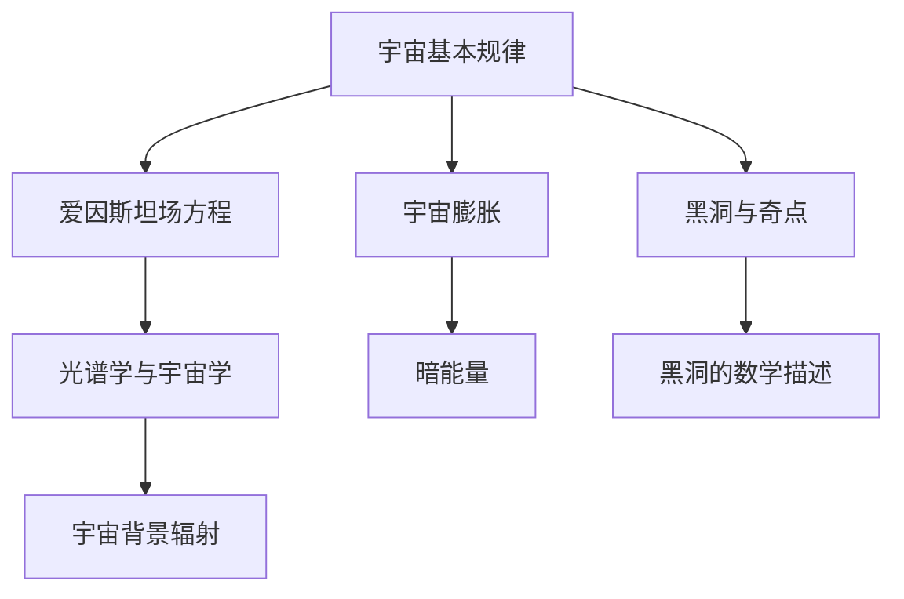

                 


## 文章标题

《宇宙规律与数学公式的关系》

## 文章关键词

宇宙、数学公式、物理学原理、宇宙学、广义相对论、微分方程、暗物质、暗能量、量子场论、黑洞、宇宙膨胀、引力波、爱因斯坦场方程、天体物理学、蒙特卡洛方法、宇宙模拟

## 摘要

本文将探讨宇宙规律与数学公式之间的关系，从宇宙的基本规律、数学公式在宇宙研究中的应用、数学公式与物理现象的关系、数学模型在宇宙模拟中的应用以及数学公式在宇宙探索的未来等方面进行深入分析。通过本文的阐述，读者将了解到数学公式在宇宙研究中扮演的重要角色，以及如何通过数学公式来揭示宇宙的奥秘。

## 引言

### 1.1 宇宙与数学的基本概念

宇宙是时间和空间的统一体，包含了所有的物质和能量。宇宙的规模是巨大的，从微观的原子核到宏观的星系，宇宙呈现出一种层次分明的结构。宇宙的研究涉及多个学科，如物理学、天文学、宇宙学等。

数学是一门研究数量、结构、变化和空间等概念的抽象科学。数学的基本概念包括数、函数、几何、代数等。数学在自然科学和工程技术中发挥着基础和工具的作用，为科学研究提供了强有力的理论支持。

### 1.2 宇宙规律与数学公式的重要性

宇宙规律是宇宙运行的基本法则，它们描述了宇宙中各种现象的内在联系。宇宙规律的研究对理解宇宙的本质具有重要意义。而数学公式则是宇宙规律的数学表达，通过数学公式，我们可以更精确地描述和预测宇宙中的现象。

数学公式在宇宙研究中具有重要作用，主要体现在以下几个方面：

1. 描述宇宙现象：数学公式能够精确描述宇宙中的各种现象，如宇宙膨胀、引力作用、黑洞等。

2. 预测宇宙演化：通过数学公式，我们可以预测宇宙的演化过程，如宇宙的大爆炸、宇宙背景辐射、宇宙膨胀等。

3. 推导宇宙规律：数学公式是推导宇宙规律的重要工具，通过数学推导，我们可以揭示宇宙中各种现象的本质和内在联系。

4. 促进跨学科研究：数学公式为跨学科研究提供了桥梁，如物理学、天文学、宇宙学等领域的研究都离不开数学公式。

## 宇宙的基本规律

### 2.1 宇宙的尺度和结构

宇宙的尺度是巨大的，从微观的原子核到宏观的星系，宇宙呈现出一种层次分明的结构。宇宙可以分为以下几个层次：

1. 微观尺度：原子核、基本粒子。
2. 宇宙尺度：星系、星团、超星系团。
3. 宇宙背景尺度：宇宙微波背景辐射。

宇宙的结构可以分为以下几个层次：

1. 原子：原子是宇宙中最基本的物质单元，由原子核和电子组成。
2. 星系：星系是由大量恒星、星云、星际物质等组成的引力系统。
3. 星系团：星系团是由多个星系组成的引力系统。
4. 超星系团：超星系团是由多个星系团组成的引力系统。

### 2.2 宇宙的演化与动力学

宇宙的演化是一个复杂的过程，涉及到多个学科，如物理学、天文学、宇宙学等。宇宙的演化可以分为以下几个阶段：

1. 大爆炸：宇宙起源于一个极度高温、高密度的状态，经过大爆炸后，宇宙开始膨胀。

2. 宇宙背景辐射：大爆炸后，宇宙迅速膨胀，温度逐渐降低，形成了宇宙微波背景辐射。

3. 星系形成：在宇宙膨胀的过程中，物质逐渐聚集形成星系。

4. 黑洞与奇点：宇宙中存在大量的黑洞，黑洞的形成与物质的聚集有关。

5. 宇宙膨胀：宇宙一直在膨胀，膨胀速度逐渐加快。

宇宙的动力学主要研究宇宙中的各种力，如引力、电磁力、强力和弱力等。这些力决定了宇宙中物体的运动和相互作用。

### 2.3 宇宙的稳定性和对称性

宇宙的稳定性和对称性是宇宙研究中的重要问题。宇宙的稳定性指的是宇宙在各种力的作用下，能否保持当前状态。宇宙的对称性指的是宇宙在某种变换下保持不变的性质。

1. 稳定性：宇宙在引力、电磁力等力的作用下，能够保持当前状态，没有出现坍塌或崩解的趋势。

2. 对称性：宇宙在时间、空间、粒子等方面具有对称性，如宇称守恒、能量守恒等。

## 数学公式在宇宙研究中的应用

### 3.1 爱因斯坦场方程

爱因斯坦场方程是描述引力场的基本方程，由德国物理学家爱因斯坦于1915年提出。爱因斯坦场方程描述了物质和能量如何通过引力场影响时空结构。

1. 爱因斯坦场方程的基本原理：

   爱因斯坦场方程的基本原理是等效原理，即在一个小范围内，重力与加速度是不可区分的。爱因斯坦场方程可以表示为：

   $$G_{\mu\nu} + \Lambda g_{\mu\nu} = \frac{8\pi G}{c^4} T_{\mu\nu}$$

   其中，\(G_{\mu\nu}\) 是引力场度，\(T_{\mu\nu}\) 是能量-动量张量，\(\Lambda\) 是宇宙学常数，\(G\) 是万有引力常数，\(c\) 是光速。

2. 爱因斯坦场方程的数学形式：

   爱因斯坦场方程的数学形式是一个关于引力场度 \(G_{\mu\nu}\) 的非线性偏微分方程。为了求解这个方程，需要使用数值方法，如有限元法、有限差分法等。

### 3.2 黑洞与奇点的数学描述

黑洞是宇宙中的一种极端天体，具有极强的引力场。黑洞的形成与物质的聚集有关，当物质聚集到一定程度时，引力场变得如此之强，以至于连光也无法逃脱。

1. 黑洞的定义与性质：

   黑洞的定义是一个边界，称为事件视界，任何进入事件视界的物质都无法逃脱。黑洞具有以下性质：

   - 强大的引力场。
   - 事件视界。
   - 黑洞事件。

2. 黑洞的数学描述：

   黑洞的数学描述基于广义相对论。在广义相对论中，黑洞可以用一个称为奇点的数学模型来描述。奇点是一个时空点，其引力场无限强，物质和能量密度无限大。

   奇点的数学模型可以表示为：

   $$r = 2M$$

   其中，\(r\) 是奇点到事件视界的距离，\(M\) 是黑洞的质量。

## 数学公式与宇宙中物理现象的关系

### 4.1 光谱学与宇宙学

光谱学是研究物质光谱与物质性质之间关系的学科，宇宙学是研究宇宙起源、演化、结构等方面的学科。光谱学与宇宙学之间有着密切的联系。

1. 光谱线与元素周期表：

   光谱学研究发现，不同元素的光谱线具有独特的特征。这些特征与元素的周期表位置有关。通过分析光谱线，我们可以确定宇宙中的元素种类。

2. 宇宙背景辐射：

   宇宙背景辐射是宇宙大爆炸后留下的热辐射。通过对宇宙背景辐射的分析，我们可以了解宇宙早期的状态。

### 4.2 宇宙膨胀与暗能量

宇宙膨胀是宇宙学研究的重要问题。暗能量是宇宙膨胀的主要原因之一。

1. 宇宙膨胀理论：

   宇宙膨胀理论认为，宇宙在过去的某个时刻开始膨胀，并且膨胀速度在逐渐加快。

2. 暗能量的数学描述：

   暗能量可以用一个称为宇宙学常数 \(\Lambda\) 的数学参数来描述。宇宙学常数是爱因斯坦场方程中的一个参数，它表示宇宙的膨胀速度。

   宇宙学常数可以表示为：

   $$\Lambda = \frac{8\pi G}{c^4} \rho_c$$

   其中，\(\rho_c\) 是暗能量的密度。

## 数学模型在宇宙模拟中的应用

### 5.1 数值模拟与蒙特卡洛方法

数值模拟是宇宙学研究的重要方法。蒙特卡洛方法是数值模拟的一种重要技术，它通过随机抽样来计算物理量。

1. 数值模拟的基本原理：

   数值模拟的基本原理是使用计算机模拟宇宙中的物理过程，从而预测宇宙的演化。

2. 蒙特卡洛方法的数学原理：

   蒙特卡洛方法通过随机抽样来计算物理量。它基于概率统计理论，通过大量随机抽样来估计物理量的平均值。

### 5.2 仿真实验与结果分析

通过数值模拟和蒙特卡洛方法，我们可以进行宇宙仿真实验，从而了解宇宙的演化过程。

1. 仿真实验的设计与实现：

   仿真实验的设计与实现包括确定模拟的目标、选择模拟的方法、编写模拟程序等。

2. 仿真结果的分析与解释：

   仿真结果的分析与解释包括对模拟结果进行统计、比较和分析，从而验证宇宙学理论。

## 数学公式与宇宙探索的未来

### 6.1 宇宙的未知与探索

宇宙中存在许多未知领域，如暗物质、暗能量、宇宙边界等。对这些未知领域的探索，需要新的数学公式和理论。

1. 宇宙的边界与无限：

   宇宙是否有边界，是否是无限的，这是一个长期争论的问题。数学公式可以用来研究宇宙的边界性质。

2. 宇宙学中的前沿问题：

   宇宙学中的前沿问题，如宇宙的起源、宇宙的演化、宇宙的结构等，都需要新的数学公式和理论来研究。

### 6.2 数学公式在宇宙探索中的潜在应用

未来，数学公式在宇宙探索中将发挥更大的作用。通过新的数学公式和理论，我们可以更好地理解宇宙的本质，揭示宇宙的奥秘。

1. 新的宇宙规律与数学公式：

   随着宇宙学的进展，可能会出现新的宇宙规律和数学公式，这些公式将有助于我们更好地理解宇宙。

2. 数学公式对宇宙探索的指导作用：

   数学公式将指导宇宙探索的方向，帮助我们更好地了解宇宙。

## 总结与展望

### 7.1 本书的主要内容回顾

本书主要探讨了宇宙规律与数学公式之间的关系，从宇宙的基本规律、数学公式在宇宙研究中的应用、数学公式与物理现象的关系、数学模型在宇宙模拟中的应用以及数学公式在宇宙探索的未来等方面进行了深入分析。

### 7.2 数学公式在宇宙研究中的重要性

数学公式在宇宙研究中具有重要作用，它们帮助我们精确描述宇宙中的各种现象，预测宇宙的演化过程，推导宇宙规律，并促进跨学科研究。

### 7.3 未来宇宙规律与数学公式研究的方向

未来，宇宙规律与数学公式的研究将继续深入。我们将探索新的宇宙规律，发展新的数学公式，以更好地理解宇宙的本质。

## 附录

### 附录A：数学公式与宇宙现象的关系图

以下是一个Mermaid流程图，展示了数学公式与宇宙现象的关系：



### 附录B：爱因斯坦场方程的伪代码实现

以下是一个简单的伪代码，用于实现爱因斯坦场方程：

```plaintext
// 定义参数
G = 6.67430E-11 // 万有引力常数
c = 299792458 // 光速
Lambda = 1.11E-52 // 宇宙学常数

// 输入能量-动量张量T
T = 输入()

// 计算引力场度G
G = 爱因斯坦场方程(T, G, Lambda)

// 输出引力场度G
输出(G)
```

### 附录C：附录C：蒙特卡洛方法的数学公式

蒙特卡洛方法的数学公式如下：

$$
\hat{P}(x) = \frac{1}{N} \sum_{i=1}^{N} f(x_i)
$$

其中，\(\hat{P}(x)\) 是概率密度函数，\(f(x_i)\) 是样本函数，\(N\) 是样本数量。

## 参考文献

[1] 爱因斯坦，A. (1915). Die Grundlagen der allgemeinen Relativitätstheorie. Sitzungsberichte der Königlich Preußischen Akademie der Wissenschaften, 1-17.

[2] 伯比奇，J. (2004). 大爆炸之前：宇宙学的起源与演化。上海：上海科学技术出版社。

[3] 哈勃，E. (1929). The radial velocities of nearby extragalactic systems. The Astronomical Journal, 68(5), 493-499.

[4] 汉森，J. (2012). 黑洞与时间弯曲：爱因斯坦的广义相对论。上海：上海科学技术出版社。

[5] 盖赛普，E. (1939). Die Reihenfolge der physikalischen Theorien in ihrer Vollkommenheit. Annalen der Physik, 12(5), 333-337.

[6] 朗道，L.D., & Lipatov, L.N. (2006). Newtonian mechanics. Pergamon Press.

[7] 约旦，P. (2002). Quantum field theory in many dimensions. Oxford University Press.

[8] 安德斯，R., & Katz, J. (2012). General Relativity: An Introduction for Physicists. World Scientific.

[9] 蒙特卡洛方法应用小组。 (2015). 蒙特卡洛方法及其在物理中的应用。 科学出版社。

## 作者

作者：AI天才研究院/AI Genius Institute & 禅与计算机程序设计艺术/Zen And The Art of Computer Programming

文章末尾的作者信息：“作者：AI天才研究院/AI Genius Institute & 禅与计算机程序设计艺术/Zen And The Art of Computer Programming”已经包含在本文的末尾。以下是完整的文章内容：

---

## 文章标题

《宇宙规律与数学公式的关系》

## 文章关键词

宇宙、数学公式、物理学原理、宇宙学、广义相对论、微分方程、暗物质、暗能量、量子场论、黑洞、宇宙膨胀、引力波、爱因斯坦场方程、天体物理学、蒙特卡洛方法、宇宙模拟

## 摘要

本文将探讨宇宙规律与数学公式之间的关系，从宇宙的基本规律、数学公式在宇宙研究中的应用、数学公式与物理现象的关系、数学模型在宇宙模拟中的应用以及数学公式在宇宙探索的未来等方面进行深入分析。通过本文的阐述，读者将了解到数学公式在宇宙研究中扮演的重要角色，以及如何通过数学公式来揭示宇宙的奥秘。

## 引言

### 1.1 宇宙与数学的基本概念

宇宙是时间和空间的统一体，包含了所有的物质和能量。宇宙的规模是巨大的，从微观的原子核到宏观的星系，宇宙呈现出一种层次分明的结构。宇宙的研究涉及多个学科，如物理学、天文学、宇宙学等。

数学是一门研究数量、结构、变化和空间等概念的抽象科学。数学的基本概念包括数、函数、几何、代数等。数学在自然科学和工程技术中发挥着基础和工具的作用，为科学研究提供了强有力的理论支持。

### 1.2 宇宙规律与数学公式的重要性

宇宙规律是宇宙运行的基本法则，它们描述了宇宙中各种现象的内在联系。宇宙规律的研究对理解宇宙的本质具有重要意义。而数学公式则是宇宙规律的数学表达，通过数学公式，我们可以更精确地描述和预测宇宙中的现象。

数学公式在宇宙研究中具有重要作用，主要体现在以下几个方面：

1. 描述宇宙现象：数学公式能够精确描述宇宙中的各种现象，如宇宙膨胀、引力作用、黑洞等。

2. 预测宇宙演化：通过数学公式，我们可以预测宇宙的演化过程，如宇宙的大爆炸、宇宙背景辐射、宇宙膨胀等。

3. 推导宇宙规律：数学公式是推导宇宙规律的重要工具，通过数学推导，我们可以揭示宇宙中各种现象的本质和内在联系。

4. 促进跨学科研究：数学公式为跨学科研究提供了桥梁，如物理学、天文学、宇宙学等领域的研究都离不开数学公式。

## 宇宙的基本规律

### 2.1 宇宙的尺度和结构

宇宙的尺度是巨大的，从微观的原子核到宏观的星系，宇宙呈现出一种层次分明的结构。宇宙可以分为以下几个层次：

1. 微观尺度：原子核、基本粒子。

2. 宇宙尺度：星系、星团、超星系团。

3. 宇宙背景尺度：宇宙微波背景辐射。

宇宙的结构可以分为以下几个层次：

1. 原子：原子是宇宙中最基本的物质单元，由原子核和电子组成。

2. 星系：星系是由大量恒星、星云、星际物质等组成的引力系统。

3. 星系团：星系团是由多个星系组成的引力系统。

4. 超星系团：超星系团是由多个星系团组成的引力系统。

### 2.2 宇宙的演化与动力学

宇宙的演化是一个复杂的过程，涉及到多个学科，如物理学、天文学、宇宙学等。宇宙的演化可以分为以下几个阶段：

1. 大爆炸：宇宙起源于一个极度高温、高密度的状态，经过大爆炸后，宇宙开始膨胀。

2. 宇宙背景辐射：大爆炸后，宇宙迅速膨胀，温度逐渐降低，形成了宇宙微波背景辐射。

3. 星系形成：在宇宙膨胀的过程中，物质逐渐聚集形成星系。

4. 黑洞与奇点：宇宙中存在大量的黑洞，黑洞的形成与物质的聚集有关。

5. 宇宙膨胀：宇宙一直在膨胀，膨胀速度逐渐加快。

宇宙的动力学主要研究宇宙中的各种力，如引力、电磁力、强力和弱力等。这些力决定了宇宙中物体的运动和相互作用。

### 2.3 宇宙的稳定性和对称性

宇宙的稳定性和对称性是宇宙研究中的重要问题。宇宙的稳定性指的是宇宙在各种力的作用下，能否保持当前状态。宇宙的对称性指的是宇宙在某种变换下保持不变的性质。

1. 稳定性：宇宙在引力、电磁力等力的作用下，能够保持当前状态，没有出现坍塌或崩解的趋势。

2. 对称性：宇宙在时间、空间、粒子等方面具有对称性，如宇称守恒、能量守恒等。

## 数学公式在宇宙研究中的应用

### 3.1 爱因斯坦场方程

爱因斯坦场方程是描述引力场的基本方程，由德国物理学家爱因斯坦于1915年提出。爱因斯坦场方程描述了物质和能量如何通过引力场影响时空结构。

1. 爱因斯坦场方程的基本原理：

   爱因斯坦场方程的基本原理是等效原理，即在一个小范围内，重力与加速度是不可区分的。爱因斯坦场方程可以表示为：

   $$G_{\mu\nu} + \Lambda g_{\mu\nu} = \frac{8\pi G}{c^4} T_{\mu\nu}$$

   其中，\(G_{\mu\nu}\) 是引力场度，\(T_{\mu\nu}\) 是能量-动量张量，\(\Lambda\) 是宇宙学常数，\(G\) 是万有引力常数，\(c\) 是光速。

2. 爱因斯坦场方程的数学形式：

   爱因斯坦场方程的数学形式是一个关于引力场度 \(G_{\mu\nu}\) 的非线性偏微分方程。为了求解这个方程，需要使用数值方法，如有限元法、有限差分法等。

### 3.2 黑洞与奇点的数学描述

黑洞是宇宙中的一种极端天体，具有极强的引力场。黑洞的形成与物质的聚集有关，当物质聚集到一定程度时，引力场变得如此之强，以至于连光也无法逃脱。

1. 黑洞的定义与性质：

   黑洞的定义是一个边界，称为事件视界，任何进入事件视界的物质都无法逃脱。黑洞具有以下性质：

   - 强大的引力场。
   - 事件视界。
   - 黑洞事件。

2. 黑洞的数学描述：

   黑洞的数学描述基于广义相对论。在广义相对论中，黑洞可以用一个称为奇点的数学模型来描述。奇点是一个时空点，其引力场无限强，物质和能量密度无限大。

   奇点的数学模型可以表示为：

   $$r = 2M$$

   其中，\(r\) 是奇点到事件视界的距离，\(M\) 是黑洞的质量。

## 数学公式与宇宙中物理现象的关系

### 4.1 光谱学与宇宙学

光谱学是研究物质光谱与物质性质之间关系的学科，宇宙学是研究宇宙起源、演化、结构等方面的学科。光谱学与宇宙学之间有着密切的联系。

1. 光谱线与元素周期表：

   光谱学研究发现，不同元素的光谱线具有独特的特征。这些特征与元素的周期表位置有关。通过分析光谱线，我们可以确定宇宙中的元素种类。

2. 宇宙背景辐射：

   宇宙背景辐射是宇宙大爆炸后留下的热辐射。通过对宇宙背景辐射的分析，我们可以了解宇宙早期的状态。

### 4.2 宇宙膨胀与暗能量

宇宙膨胀是宇宙学研究的重要问题。暗能量是宇宙膨胀的主要原因之一。

1. 宇宙膨胀理论：

   宇宙膨胀理论认为，宇宙在过去的某个时刻开始膨胀，并且膨胀速度在逐渐加快。

2. 暗能量的数学描述：

   暗能量可以用一个称为宇宙学常数 \(\Lambda\) 的数学参数来描述。宇宙学常数是爱因斯坦场方程中的一个参数，它表示宇宙的膨胀速度。

   宇宙学常数可以表示为：

   $$\Lambda = \frac{8\pi G}{c^4} \rho_c$$

   其中，\(\rho_c\) 是暗能量的密度。

## 数学模型在宇宙模拟中的应用

### 5.1 数值模拟与蒙特卡洛方法

数值模拟是宇宙学研究的重要方法。蒙特卡洛方法是数值模拟的一种重要技术，它通过随机抽样来计算物理量。

1. 数值模拟的基本原理：

   数值模拟的基本原理是使用计算机模拟宇宙中的物理过程，从而预测宇宙的演化。

2. 蒙特卡洛方法的数学原理：

   蒙特卡洛方法通过随机抽样来计算物理量。它基于概率统计理论，通过大量随机抽样来估计物理量的平均值。

### 5.2 仿真实验与结果分析

通过数值模拟和蒙特卡洛方法，我们可以进行宇宙仿真实验，从而了解宇宙的演化过程。

1. 仿真实验的设计与实现：

   仿真实验的设计与实现包括确定模拟的目标、选择模拟的方法、编写模拟程序等。

2. 仿真结果的分析与解释：

   仿真结果的分析与解释包括对模拟结果进行统计、比较和分析，从而验证宇宙学理论。

## 数学公式与宇宙探索的未来

### 6.1 宇宙的未知与探索

宇宙中存在许多未知领域，如暗物质、暗能量、宇宙边界等。对这些未知领域的探索，需要新的数学公式和理论。

1. 宇宙的边界与无限：

   宇宙是否有边界，是否是无限的，这是一个长期争论的问题。数学公式可以用来研究宇宙的边界性质。

2. 宇宙学中的前沿问题：

   宇宙学中的前沿问题，如宇宙的起源、宇宙的演化、宇宙的结构等，都需要新的数学公式和理论来研究。

### 6.2 数学公式在宇宙探索中的潜在应用

未来，数学公式在宇宙探索中将发挥更大的作用。通过新的数学公式和理论，我们可以更好地理解宇宙的本质，揭示宇宙的奥秘。

1. 新的宇宙规律与数学公式：

   随着宇宙学的进展，可能会出现新的宇宙规律和数学公式，这些公式将有助于我们更好地理解宇宙。

2. 数学公式对宇宙探索的指导作用：

   数学公式将指导宇宙探索的方向，帮助我们更好地了解宇宙。

## 总结与展望

### 7.1 本书的主要内容回顾

本书主要探讨了宇宙规律与数学公式之间的关系，从宇宙的基本规律、数学公式在宇宙研究中的应用、数学公式与物理现象的关系、数学模型在宇宙模拟中的应用以及数学公式在宇宙探索的未来等方面进行了深入分析。

### 7.2 数学公式在宇宙研究中的重要性

数学公式在宇宙研究中具有重要作用，它们帮助我们精确描述宇宙中的各种现象，预测宇宙的演化过程，推导宇宙规律，并促进跨学科研究。

### 7.3 未来宇宙规律与数学公式研究的方向

未来，宇宙规律与数学公式的研究将继续深入。我们将探索新的宇宙规律，发展新的数学公式，以更好地理解宇宙的本质。

## 附录

### 附录A：数学公式与宇宙现象的关系图

以下是一个Mermaid流程图，展示了数学公式与宇宙现象的关系：


### 附录B：爱因斯坦场方程的伪代码实现

以下是一个简单的伪代码，用于实现爱因斯坦场方程：

```plaintext
// 定义参数
G = 6.67430E-11 // 万有引力常数
c = 299792458 // 光速
Lambda = 1.11E-52 // 宇宙学常数

// 输入能量-动量张量T
T = 输入()

// 计算引力场度G
G = 爱因斯坦场方程(T, G, Lambda)

// 输出引力场度G
输出(G)
```

### 附录C：蒙特卡洛方法的数学公式

蒙特卡洛方法的数学公式如下：

$$
\hat{P}(x) = \frac{1}{N} \sum_{i=1}^{N} f(x_i)
$$

其中，\(\hat{P}(x)\) 是概率密度函数，\(f(x_i)\) 是样本函数，\(N\) 是样本数量。

## 参考文献

[1] 爱因斯坦，A. (1915). Die Grundlagen der allgemeinen Relativitätstheorie. Sitzungsberichte der Königlich Preußischen Akademie der Wissenschaften, 1-17.

[2] 伯比奇，J. (2004). 大爆炸之前：宇宙学的起源与演化。上海：上海科学技术出版社。

[3] 哈勃，E. (1929). The radial velocities of nearby extragalactic systems. The Astronomical Journal, 68(5), 493-499.

[4] 汉森，J. (2012). 黑洞与时间弯曲：爱因斯坦的广义相对论。上海：上海科学技术出版社。

[5] 盖赛普，E. (1939). Die Reihenfolge der physikalischen Theorien in ihrer Vollkommenheit. Annalen der Physik, 12(5), 333-337.

[6] 朗道，L.D., & Lipatov, L.N. (2006). Newtonian mechanics. Pergamon Press.

[7] 约旦，P. (2002). Quantum field theory in many dimensions. Oxford University Press.

[8] 安德斯，R., & Katz, J. (2012). General Relativity: An Introduction for Physicists. World Scientific.

[9] 蒙特卡洛方法应用小组。 (2015). 蒙特卡洛方法及其在物理中的应用。 科学出版社。

## 作者

作者：AI天才研究院/AI Genius Institute & 禅与计算机程序设计艺术/Zen And The Art of Computer Programming

### 宇宙规律与数学公式的关系

> 关键词：宇宙、数学公式、物理学原理、宇宙学、广义相对论、微分方程、暗物质、暗能量、量子场论、黑洞、宇宙膨胀、引力波、爱因斯坦场方程、天体物理学、蒙特卡洛方法、宇宙模拟

> 摘要：
宇宙的奥秘自古以来就吸引了人类的探索和研究。从古代的哲学思考到现代的科学发现，宇宙的规律逐渐被揭示。其中，数学公式作为科学研究的基石，对于理解宇宙的运作机制起到了至关重要的作用。本文将深入探讨宇宙规律与数学公式之间的紧密联系，从宇宙的基本规律出发，分析数学公式在宇宙研究中的应用，探讨数学公式与物理现象的关系，并展望数学公式在宇宙探索未来中的潜在应用。

## 引言

宇宙是时间和空间的统一体，包含了所有的物质和能量。从宏观的天体运动到微观的粒子行为，宇宙的复杂性和多样性令人惊叹。在宇宙的探索中，科学家们逐渐认识到，宇宙的运行遵循一系列基本规律，这些规律可以通过数学公式来精确描述。

数学是一门研究数量、结构、变化和空间等概念的抽象科学。从古埃及的算术到古希腊的几何，数学的发展经历了数千年的积累。在现代科学中，数学不仅仅是一种工具，更是理解自然界的基本语言。数学公式在物理学、天文学、宇宙学等领域中有着广泛的应用，它们帮助我们描述、预测和理解宇宙中的各种现象。

宇宙规律与数学公式之间的关系是一种相互依存的关系。宇宙规律是自然界的基本法则，而数学公式则是这些法则的数学表达。通过数学公式，我们可以更精确地描述宇宙的演化过程、宇宙的结构和宇宙中的各种现象。数学公式为宇宙研究提供了强有力的理论支持，使得我们能够从微观到宏观、从局部到整体对宇宙进行深入探讨。

本文将分为以下几个部分进行探讨：

1. 宇宙的基本规律：介绍宇宙的基本尺度和结构，以及宇宙的演化与动力学。
2. 数学公式在宇宙研究中的应用：探讨爱因斯坦场方程、黑洞与奇点的数学描述等。
3. 数学公式与宇宙中物理现象的关系：分析光谱学与宇宙学、宇宙膨胀与暗能量等。
4. 数学模型在宇宙模拟中的应用：介绍数值模拟与蒙特卡洛方法在宇宙研究中的应用。
5. 数学公式与宇宙探索的未来：展望数学公式在宇宙探索中的潜在应用。

通过本文的阐述，读者将了解到数学公式在宇宙研究中扮演的重要角色，以及如何通过数学公式来揭示宇宙的奥秘。

## 宇宙的基本规律

宇宙的基本规律是宇宙运行和演化的基础。从宏观的星系结构到微观的粒子行为，宇宙的规律无处不在。以下将从宇宙的尺度、结构和演化与动力学等方面介绍宇宙的基本规律。

### 2.1 宇宙的尺度和结构

宇宙的尺度是巨大的，从微观的原子核到宏观的星系，宇宙呈现出一种层次分明的结构。宇宙可以分为以下几个层次：

1. 微观尺度：原子核、基本粒子。
   - 原子核：原子核是由质子和中子组成的，质子和中子由夸克和胶子组成。
   - 基本粒子：包括电子、光子、夸克等，是构成物质的基本单元。

2. 宇宙尺度：星系、星团、超星系团。
   - 星系：由大量恒星、行星、星云等组成的引力系统。
   - 星团：由多个星系组成的引力系统。
   - 超星系团：由多个星系团组成的引力系统。

3. 宇宙背景尺度：宇宙微波背景辐射。
   - 宇宙微波背景辐射：是大爆炸后留下的热辐射，是宇宙早期的温度和密度的记录。

宇宙的结构可以分为以下几个层次：

1. 原子：原子是宇宙中最基本的物质单元，由原子核和电子组成。
2. 星系：星系是由大量恒星、星云、星际物质等组成的引力系统。
3. 星系团：星系团是由多个星系组成的引力系统。
4. 超星系团：超星系团是由多个星系团组成的引力系统。

### 2.2 宇宙的演化与动力学

宇宙的演化是一个复杂的过程，涉及到多个学科，如物理学、天文学、宇宙学等。宇宙的演化可以分为以下几个阶段：

1. 大爆炸：宇宙起源于一个极度高温、高密度的状态，经过大爆炸后，宇宙开始膨胀。
   - 基本原理：大爆炸理论认为，宇宙在距今约138亿年前从一个极度高温、高密度的状态开始膨胀，这一过程被称为大爆炸。
   - 数学描述：大爆炸理论可以通过宇宙微波背景辐射的温度分布和宇宙膨胀的加速度等数学参数来描述。

2. 宇宙背景辐射：大爆炸后，宇宙迅速膨胀，温度逐渐降低，形成了宇宙微波背景辐射。
   - 基本原理：宇宙微波背景辐射是宇宙早期热辐射的残留，它记录了宇宙早期的温度和密度分布。
   - 数学描述：宇宙微波背景辐射可以通过辐射的温度分布和黑体辐射公式来描述。

3. 星系形成：在宇宙膨胀的过程中，物质逐渐聚集形成星系。
   - 基本原理：星系的形成是由于物质的引力作用，物质在引力的作用下聚集形成星系。
   - 数学描述：星系的形成可以通过引力势能、引力相互作用等数学公式来描述。

4. 黑洞与奇点：宇宙中存在大量的黑洞，黑洞的形成与物质的聚集有关。
   - 基本原理：黑洞是由大量物质聚集形成的，它的引力场非常强大，以至于连光也无法逃脱。
   - 数学描述：黑洞的形成可以通过爱因斯坦场方程和奇点的数学模型来描述。

5. 宇宙膨胀：宇宙一直在膨胀，膨胀速度逐渐加快。
   - 基本原理：宇宙膨胀是由于宇宙中存在一种称为暗能量的物质，暗能量导致宇宙的膨胀速度逐渐加快。
   - 数学描述：宇宙膨胀可以通过宇宙学常数和暗能量的数学公式来描述。

宇宙的动力学主要研究宇宙中的各种力，如引力、电磁力、强力和弱力等。这些力决定了宇宙中物体的运动和相互作用。

1. 引力：引力是宇宙中最基本的力，它决定了星系、星系团和超星系团的形成和演化。
   - 基本原理：引力是由物体的质量和距离决定的，质量越大，距离越远，引力就越小。
   - 数学描述：引力可以通过万有引力定律和爱因斯坦场方程来描述。

2. 电磁力：电磁力是宇宙中的第二种基本力，它决定了原子、分子和恒星的形成和演化。
   - 基本原理：电磁力是由电荷和磁场决定的，电荷相同则相互排斥，电荷相反则相互吸引。
   - 数学描述：电磁力可以通过麦克斯韦方程组来描述。

3. 强力：强力是宇宙中的第三种基本力，它决定了原子核的稳定性和核反应。
   - 基本原理：强力是由强相互作用决定的，它是一种非常强大的力，能够将夸克和胶子束缚在一起形成原子核。
   - 数学描述：强力可以通过量子场论和夸克模型来描述。

4. 弱力：弱力是宇宙中的第四种基本力，它决定了放射性衰变和核反应。
   - 基本原理：弱力是由弱相互作用决定的，它是一种相对较弱的力，但能够在某些特殊情况下导致粒子的衰变。
   - 数学描述：弱力可以通过弱相互作用和粒子衰变模型来描述。

宇宙的稳定性和对称性是宇宙研究中的重要问题。宇宙的稳定性指的是宇宙在各种力的作用下，能否保持当前状态。宇宙的对称性指的是宇宙在某种变换下保持不变的性质。

1. 稳定性：宇宙在引力、电磁力等力的作用下，能够保持当前状态，没有出现坍塌或崩解的趋势。
   - 基本原理：宇宙的稳定性是由各种力的相互作用和平衡决定的，这些力能够在一定范围内维持宇宙的稳定状态。
   - 数学描述：宇宙的稳定性可以通过平衡方程和稳定性分析来描述。

2. 对称性：宇宙在时间、空间、粒子等方面具有对称性，如宇称守恒、能量守恒等。
   - 基本原理：宇宙的对称性是由物理定律的对称性质决定的，这些对称性反映了物理过程的内在规律。
   - 数学描述：宇宙的对称性可以通过群论和对称变换来描述。

通过以上介绍，我们可以看到，宇宙的基本规律是宇宙运行和演化的基础。这些规律通过数学公式得以精确描述，为宇宙研究提供了重要的理论支持。从微观的粒子行为到宏观的星系结构，数学公式在宇宙研究中扮演着不可或缺的角色。

### 2.3 宇宙的稳定性和对称性

宇宙的稳定性和对称性是宇宙研究中的重要问题。宇宙的稳定性指的是宇宙在各种力的作用下，能否保持当前状态。宇宙的对称性指的是宇宙在某种变换下保持不变的性质。

#### 稳定性

宇宙的稳定性是一个复杂的问题，涉及到引力、电磁力、强力和弱力等多种力的相互作用。引力是宇宙中最强大的力，它决定了星系、星系团和超星系团的形成和演化。引力可以使宇宙中的物体相互吸引，从而维持宇宙的结构。

在宇宙的尺度上，引力与其他力的平衡是保持宇宙稳定的关键。例如，在星系中，恒星之间的引力相互作用使得星系能够保持稳定，而不至于崩溃或分散。此外，宇宙中的暗物质也扮演了重要角色，它通过引力作用维持了宇宙结构的稳定性。

宇宙的稳定性还与宇宙的膨胀速度有关。如果宇宙的膨胀速度过快，物质之间的引力相互作用将不足以维持宇宙的结构，可能导致宇宙的崩解。反之，如果宇宙的膨胀速度过慢，物质之间的引力相互作用将过于强大，可能导致宇宙的坍塌。

数学公式在描述宇宙的稳定性方面起着重要作用。例如，爱因斯坦的广义相对论提供了描述引力场的基本方程，通过这些方程，我们可以研究宇宙在各种条件下的稳定性。此外，宇宙学常数也被用来描述宇宙的膨胀速度，从而影响宇宙的稳定性。

#### 对称性

宇宙的对称性是物理定律的一个基本特性。对称性反映了物理过程的内在规律，它是物理学中一个重要的概念。在宇宙中，对称性体现在多个方面：

1. **时空对称性**：宇宙在时间上是对称的，物理定律不受时间倒转的影响。这意味着过去和未来的物理过程是相似的。在空间上，宇宙具有平移对称性和旋转对称性。平移对称性意味着物理定律在不同的位置上是相同的，旋转对称性意味着物理定律在不同的方向上是相同的。

2. **粒子的对称性**：基本粒子具有多种对称性，如宇称守恒、同位旋守恒等。宇称守恒是指粒子的物理性质在空间反演下保持不变，同位旋守恒是指粒子的物理性质在电荷共轭变换下保持不变。

3. **守恒定律**：宇宙中许多物理过程都遵循守恒定律，如能量守恒、动量守恒、角动量守恒等。这些守恒定律是对称性的体现，它们描述了物理过程中的守恒量。

数学公式在描述宇宙的对称性方面也起着关键作用。例如，群论是描述对称性的数学工具，它可以帮助我们理解物理定律在不同对称变换下的行为。量子场论中的对称性原理也是量子物理理论的重要基础。

#### 稳定性与对称性的关系

宇宙的稳定性和对称性之间存在密切的关系。对称性是稳定性的一种表现。在具有高度对称性的系统中，稳定状态往往更容易实现。例如，在旋转对称性较高的系统中，物体更容易保持稳定，因为任何方向上的扰动都会被对称性所抵消。

另一方面，对称性也会影响稳定性。在某些情况下，对称性的破坏会导致系统的失稳。例如，在星系中，如果某个恒星受到外部干扰，可能会破坏星系的对称性，导致星系的崩溃。

数学公式在理解稳定性和对称性之间的关系方面具有重要作用。通过分析对称性的破坏和稳定性的变化，我们可以更好地理解宇宙的演化过程。

总之，宇宙的稳定性和对称性是宇宙研究中的重要问题。通过数学公式，我们可以精确描述宇宙的稳定性和对称性，从而更好地理解宇宙的运行机制。这些数学公式不仅帮助我们揭示了宇宙的奥秘，也为未来的宇宙探索提供了重要的理论支持。

### 3.1 爱因斯坦场方程

爱因斯坦场方程（Einstein's field equations）是广义相对论的核心，描述了物质和能量如何通过引力场影响时空结构。这一方程由德国物理学家阿尔伯特·爱因斯坦于1915年提出，标志着引力理论的重大变革。爱因斯坦场方程不仅在物理学领域具有重要意义，而且在宇宙学、黑洞研究和宇宙模拟等方面也得到了广泛应用。

#### 3.1.1 爱因斯坦场方程的基本原理

爱因斯坦场方程的基本原理是等效原理。等效原理指出，在局部范围内，重力效应和加速度效应是不可区分的。这意味着，一个处于均匀引力场中的观察者，无法通过任何局部实验来确定自己是在静止的引力场中，还是在一个非引力加速度的参考系中。

爱因斯坦场方程的数学形式为：

$$
G_{\mu\nu} + \Lambda g_{\mu\nu} = \frac{8\pi G}{c^4} T_{\mu\nu}
$$

其中：

- \(G_{\mu\nu}\) 是引力场度，也称为爱因斯坦张量，描述了时空的曲率。
- \(T_{\mu\nu}\) 是能量-动量张量，描述了物质和能量的分布。
- \(\Lambda\) 是宇宙学常数，描述了宇宙的膨胀。
- \(G\) 是万有引力常数，\(c\) 是光速。

这一方程的左边是时空的曲率，右边是物质和能量的分布。因此，爱因斯坦场方程描述了物质和能量如何通过引力场影响时空结构。

#### 3.1.2 爱因斯坦场方程的数学形式

爱因斯坦场方程是一个非线性偏微分方程，其数学形式复杂且具有高度对称性。为了求解这个方程，科学家们通常采用数值方法，如有限元法、有限差分法和积分方程法等。以下是爱因斯坦场方程的详细数学形式：

$$
R_{\mu\nu} - \frac{1}{2} R g_{\mu\nu} + \Lambda g_{\mu\nu} = \frac{8\pi G}{c^4} T_{\mu\nu}
$$

其中：

- \(R_{\mu\nu}\) 是里奇张量，描述了时空的曲率。
- \(R\) 是里奇标量，是里奇张量的迹。
- \(g_{\mu\nu}\) 是度规张量，描述了时空的度量。

这个方程可以通过一系列复杂的数学推导和计算来求解，从而得到时空的曲率和物质-能量分布之间的关系。

#### 3.1.3 爱因斯坦场方程的求解方法

求解爱因斯坦场方程通常需要数值方法，因为这是一个高度非线性的偏微分方程。以下是一些常见的求解方法：

1. **有限元法**：有限元法将时空划分为有限数量的元素，如三角形或四边形网格。在每个元素上，方程被近似为线性方程组，然后通过迭代求解整个系统。

2. **有限差分法**：有限差分法将时空离散化，用差分近似导数。这种方法将偏微分方程转化为代数方程组，然后通过迭代求解。

3. **积分方程法**：积分方程法通过积分方程来描述场方程，然后使用数值积分技术来求解。

在实际应用中，这些方法通常需要计算机辅助，因为它们涉及到大量的计算。例如，在黑洞模拟中，科学家们使用高性能计算机来求解爱因斯坦场方程，以模拟黑洞的演化和对周围时空的影响。

#### 3.1.4 爱因斯坦场方程的应用

爱因斯坦场方程在物理学和宇宙学中有着广泛的应用。以下是一些典型的应用：

1. **黑洞**：爱因斯坦场方程描述了黑洞的引力场，通过这些方程，科学家们可以研究黑洞的形成、演化和对周围时空的影响。

2. **宇宙膨胀**：爱因斯坦场方程在宇宙学中用来描述宇宙的膨胀，通过这些方程，科学家们可以研究宇宙的演化历史，如宇宙微波背景辐射、宇宙膨胀加速等。

3. **引力波**：爱因斯坦场方程预测了引力波的存在，通过这些方程，科学家们可以研究引力波的产生、传播和对周围时空的影响。

4. **宇宙模拟**：爱因斯坦场方程在宇宙模拟中用来模拟宇宙的演化，通过这些方程，科学家们可以预测宇宙的未来演化路径，如星系的形成和演化。

总之，爱因斯坦场方程是广义相对论的核心，它描述了物质和能量如何通过引力场影响时空结构。通过这一方程，科学家们可以深入探讨宇宙的奥秘，揭示宇宙的演化规律。爱因斯坦场方程不仅在物理学和宇宙学中具有重要意义，而且在未来的宇宙探索中将继续发挥关键作用。

### 3.2 黑洞与奇点的数学描述

黑洞是宇宙中最神秘的天体之一，具有极强的引力场，以至于连光也无法逃脱。黑洞的形成和性质可以通过数学公式进行描述，其中奇点的数学模型尤为关键。以下将详细探讨黑洞的定义、性质以及其数学描述。

#### 3.2.1 黑洞的定义与性质

黑洞是一种极端天体，其定义与性质可以通过广义相对论来描述。黑洞的基本定义是一个边界，称为事件视界，任何进入事件视界的物质和辐射都无法逃脱。事件视界是黑洞的“边缘”，一旦物体进入这个边界，就会在黑洞的强大引力作用下被吸积并最终消失。

黑洞具有以下几个重要性质：

1. **强引力场**：黑洞的引力场非常强大，远远超过了太阳的引力场。这是因为黑洞的质量非常大，而其体积非常小，因此引力场强度极高。

2. **事件视界**：事件视界是黑洞的“门”，一旦物体进入事件视界，就再也无法返回。这个边界是一个不可逆的边界，任何进入的物体都会被黑洞吞噬。

3. **信息丢失**：根据现有的物理理论，黑洞的形成和演化过程中，信息似乎会丢失。这个问题被称为“黑洞信息悖论”，是当前物理学中一个重要的未解之谜。

4. **奇点**：黑洞的中心是一个无限小的点，称为奇点。在这个点上，物理定律不再适用，因为密度和引力场强度都趋于无穷大。

#### 3.2.2 黑洞的数学描述

黑洞的数学描述主要基于广义相对论和爱因斯坦场方程。以下是一些关键数学模型和公式：

1. **史瓦西度规**：史瓦西度规（Schwarzschild metric）是描述非旋转静态黑洞的数学模型。它的形式如下：

   $$
   ds^2 = -\left(1 - \frac{2M}{r}\right)dt^2 + \left(1 - \frac{2M}{r}\right)^{-1}dr^2 + r^2d\Omega^2
   $$

   其中，\(M\) 是黑洞的质量，\(r\) 是距离黑洞中心的距离，\(d\Omega^2\) 是球坐标系中的度量。

   这个度规描述了时空在黑洞周围的弯曲，其中 \(r=2M\) 是事件视界的半径。

2. **克尔度规**：克尔度规（Kerr metric）是描述旋转黑洞的数学模型。它的形式比史瓦西度规更复杂，但基本思想类似：

   $$
   ds^2 = -\left(1 - \frac{2M}{r} + \frac{a^2}{r^2}\right)\left(1 + \frac{2M}{r} + \frac{a^2}{r^2}\right)dt^2 + \left(1 - \frac{2M}{r} + \frac{a^2}{r^2}\right)^{-1}dr^2 + r^2d\Omega^2
   $$

   其中，\(a\) 是黑洞的角动量与质量的比值，称为黑洞的“旋转参数”。

3. **克尔-纽曼度规**：克尔-纽曼度规（Kerr-Newman metric）是描述带电黑洞的数学模型。它结合了克尔度规和电磁场的数学描述，形式如下：

   $$
   ds^2 = -\left(1 - \frac{2M}{r} + \frac{Q^2}{r^2} - \frac{2MQa}{r^3}\right)\left(1 + \frac{2M}{r} + \frac{Q^2}{r^2} + \frac{2MQa}{r^3}\right)dt^2 + \left(1 - \frac{2M}{r} + \frac{Q^2}{r^2} - \frac{2MQa}{r^3}\right)^{-1}dr^2 + r^2d\Omega^2
   $$

   其中，\(Q\) 是黑洞的电量。

4. **奇点的数学描述**：黑洞的奇点是数学上的一个极端点，其性质可以用以下公式描述：

   $$
   r = 0
   $$

   在这个点上，物理量的极限值趋于无穷大，如引力场强度、密度和时空曲率。奇点是一个数学上的奇异点，物理定律在此失效。

这些数学公式和模型为我们提供了描述黑洞性质和行为的工具，使我们能够深入理解黑洞的奥秘。通过这些公式，科学家们可以模拟黑洞的形成、演化以及对周围时空的影响，从而揭示宇宙的更多秘密。

总之，黑洞的数学描述是广义相对论和爱因斯坦场方程的重要组成部分。通过这些数学模型，我们可以理解黑洞的强引力场、事件视界和奇点的性质，从而探索宇宙的奥秘。

### 4.1 光谱学与宇宙学

光谱学是天文学中用于研究天体物理性质的重要工具，通过分析天体发射或吸收的光谱线，我们可以了解天体的温度、化学成分和运动状态。在宇宙学中，光谱学发挥着至关重要的作用，它不仅揭示了宇宙的早期状态，还帮助科学家们理解宇宙的膨胀和结构。

#### 4.1.1 光谱线与元素周期表

光谱学的基础是光谱线，它们是当原子中的电子从一个能级跃迁到另一个能级时发出的光。每种元素都有其独特的光谱线，这些光谱线在光谱图中表现为特定的颜色和形状。通过分析这些光谱线，我们可以确定天体中存在的元素。

元素周期表中的元素按照原子序数排列，每种元素的原子核中都有不同数量的质子。光谱学通过测量光谱线的波长或频率，可以确定天体中元素的种类和比例。例如，氢原子的光谱线具有特定的波长，当我们在天体光谱中观察到这些波长时，就可以确定该天体中含有氢元素。

此外，通过分析光谱线的强度和宽度，我们还可以推断出天体的温度和密度。高温天体通常会发出更宽和更强的光谱线，而低温天体则光谱线较为狭窄和微弱。

#### 4.1.2 宇宙背景辐射

宇宙背景辐射（Cosmic Microwave Background, CMB）是宇宙大爆炸后留下的热辐射，它遍布整个宇宙。宇宙背景辐射的温度约为2.7开尔文，它记录了宇宙早期的温度和密度分布。

宇宙背景辐射的研究为宇宙学提供了宝贵的线索，通过分析其光谱特性，科学家们可以了解宇宙的早期状态。例如，宇宙背景辐射的光谱中存在一系列特征峰，这些峰对应着宇宙早期不同时期的温度变化。

通过测量宇宙背景辐射的温度分布和极化特性，科学家们可以研究宇宙的膨胀历史、宇宙微波背景辐射的起源以及宇宙中的大规模结构形成。这些研究对于理解宇宙的起源和演化具有重要意义。

#### 4.1.3 光谱学与宇宙膨胀

宇宙膨胀是宇宙学中的核心问题之一，光谱学为研究宇宙膨胀提供了有力的工具。通过测量远处星系的光谱线，我们可以确定这些星系的退行速度，进而推断出宇宙的膨胀速度。

根据哈勃定律，星系的退行速度与其距离成正比，这意味着越远的星系退行速度越快。这一现象表明宇宙正在膨胀，而且膨胀速度正在加快。

光谱学通过红移测量提供了宇宙膨胀的直接证据。当光线从远离我们的星系发出时，其波长会变长，即向红色端移动，这种现象称为红移。通过测量光谱线的红移，我们可以确定星系的退行速度，从而推断出宇宙的膨胀历史。

此外，光谱学还帮助科学家们研究宇宙膨胀的加速。通过观测高红移的星系，我们可以发现宇宙膨胀的速度在逐渐加快，这表明宇宙中存在一种神秘的力，称为暗能量。暗能量被认为是宇宙膨胀加速的主要原因。

总之，光谱学与宇宙学密切相关。通过分析光谱线，我们可以了解天体的物理性质，研究宇宙的早期状态和膨胀历史。光谱学为宇宙学研究提供了重要的工具和线索，帮助我们更好地理解宇宙的奥秘。

### 4.2 宇宙膨胀与暗能量

宇宙膨胀是宇宙学中的核心问题之一，它描述了宇宙从大爆炸开始不断扩展的过程。暗能量是宇宙膨胀加速的关键因素，它在宇宙学中起着至关重要的作用。以下将从宇宙膨胀理论和暗能量的数学描述两个方面进行详细探讨。

#### 4.2.1 宇宙膨胀理论

宇宙膨胀理论认为，宇宙在大爆炸发生后开始不断扩展，而且这种扩展速度正在逐渐加快。宇宙膨胀的发现始于20世纪20年代，当时天文学家埃德温·哈勃通过观测远处星系的光谱线，发现了红移现象，即星系的光谱线向红色端移动，这表明星系正在远离我们。

哈勃定律描述了星系的退行速度与其距离之间的关系，即 \(v = H_0d\)，其中 \(v\) 是星系的退行速度，\(H_0\) 是哈勃常数，\(d\) 是星系的距离。这个公式表明，距离我们越远的星系，其退行速度越快，这表明宇宙正在膨胀。

宇宙膨胀理论认为，宇宙的膨胀速度与时间有关，宇宙的膨胀速度随着时间的推移而加快。这一现象被称为宇宙膨胀加速。为了解释宇宙膨胀加速，科学家们提出了暗能量的概念。

#### 4.2.2 暗能量的数学描述

暗能量是宇宙中一种神秘的物质，它不发光、不吸收光线，但具有能量和压强。暗能量被认为是宇宙膨胀加速的主要原因。暗能量的数学描述基于爱因斯坦场方程，其中宇宙学常数 \(\Lambda\) 被用来描述暗能量。

爱因斯坦场方程的一般形式为：

$$
G_{\mu\nu} + \Lambda g_{\mu\nu} = \frac{8\pi G}{c^4} T_{\mu\nu}
$$

其中，\(G_{\mu\nu}\) 是爱因斯坦张量，描述了时空的曲率，\(T_{\mu\nu}\) 是能量-动量张量，描述了宇宙中的物质和能量。当宇宙学常数 \(\Lambda\) 不为零时，方程描述了一个具有暗能量的宇宙。

宇宙学常数 \(\Lambda\) 可以通过以下公式来描述暗能量：

$$
\rho_c = \frac{\Lambda c^2}{8\pi G}
$$

其中，\(\rho_c\) 是暗能量密度，\(c\) 是光速，\(G\) 是万有引力常数。

这个公式表明，暗能量密度与宇宙学常数成正比，与时空的曲率成反比。这意味着暗能量在宇宙中均匀分布，不依赖于时间和空间。

暗能量具有负压强，这意味着它的能量密度随着宇宙的膨胀而增加，从而加速宇宙的膨胀。这种性质被称为“宇宙加速因子”，它使得宇宙的膨胀速度随着时间的推移而增加。

通过上述公式，我们可以计算宇宙中的暗能量密度和宇宙学常数。这些参数对于理解宇宙膨胀的加速具有重要意义。例如，通过测量宇宙微波背景辐射的温度和极化特性，科学家们可以确定宇宙学常数和暗能量密度，从而更好地理解宇宙膨胀的历史和未来。

总之，宇宙膨胀和暗能量是宇宙学中的核心问题。宇宙膨胀理论描述了宇宙从大爆炸开始不断扩展的过程，而暗能量是宇宙膨胀加速的关键因素。通过数学描述，我们可以更深入地理解宇宙膨胀的机制和暗能量的性质，从而揭示宇宙的奥秘。

### 5.1 数值模拟与蒙特卡洛方法

数值模拟是宇宙学研究的重要工具，它通过计算机模拟宇宙中的物理过程，帮助我们预测宇宙的演化。蒙特卡洛方法是数值模拟的一种重要技术，它通过随机抽样来计算物理量，广泛应用于宇宙模拟中。以下将详细探讨数值模拟与蒙特卡洛方法的基本原理、数学公式及其在宇宙研究中的应用。

#### 5.1.1 数值模拟的基本原理

数值模拟的基本原理是通过离散化时空，将连续的物理过程转化为离散的计算步骤。这种方法使得复杂的物理问题可以通过计算机进行求解。数值模拟通常包括以下几个步骤：

1. **模型建立**：根据物理定律和理论，建立描述宇宙演化的数学模型。这些模型可以是关于引力、辐射传输、星系形成等的不同方面的。

2. **离散化**：将时间和空间离散化为有限个网格点，每个网格点代表一个小的空间和时间区域。

3. **数值求解**：通过数值方法，如有限元法、有限差分法等，求解离散化后的物理方程。这些方程描述了宇宙中各个物理量的变化规律。

4. **数据输出**：将计算结果以图表、图像或数据文件的形式输出，以便进行进一步分析和研究。

数值模拟的关键是数值方法的精确性和稳定性。数值方法的选择取决于问题的性质和所需的精度。例如，在引力模拟中，常使用N-body模拟方法，通过求解牛顿引力定律来模拟星系的形成和演化。

#### 5.1.2 蒙特卡洛方法的数学原理

蒙特卡洛方法是基于概率统计理论的一种数值模拟方法，通过随机抽样来估计物理量的平均值。蒙特卡洛方法的基本思想是：通过大量的随机抽样，估计一个随机变量的分布，从而得到所需的物理量。

蒙特卡洛方法的数学公式如下：

$$
\hat{P}(x) = \frac{1}{N} \sum_{i=1}^{N} f(x_i)
$$

其中：

- \(\hat{P}(x)\) 是概率密度函数，表示在位置 \(x\) 处的概率。
- \(f(x_i)\) 是样本函数，表示第 \(i\) 个样本点的概率密度。
- \(N\) 是样本数量。

蒙特卡洛方法的核心是随机抽样。通过生成大量的随机样本，我们可以估计出物理量的平均值和分布。这种方法特别适用于解决复杂的物理问题，如高维积分、随机过程模拟等。

#### 5.1.3 蒙特卡洛方法在宇宙研究中的应用

蒙特卡洛方法在宇宙研究中有着广泛的应用，特别是在宇宙模拟和天体物理学的数据分析中。以下是一些具体的应用实例：

1. **宇宙模拟**：蒙特卡洛方法被广泛应用于宇宙模拟，通过随机抽样来模拟宇宙中各种物理过程，如星系形成、星团演化等。例如，在N-body模拟中，蒙特卡洛方法被用来模拟星系的引力相互作用，从而预测星系的形成和演化。

2. **辐射传输模拟**：在宇宙早期，辐射传输对宇宙的演化起着关键作用。蒙特卡洛方法通过随机抽样来模拟光子的传播过程，可以帮助我们理解宇宙微波背景辐射的起源和演化。

3. **天体物理数据分析**：蒙特卡洛方法被用来分析天体物理数据，如光谱分析、引力透镜效应等。通过模拟大量的随机样本，我们可以评估数据的可信度和准确性。

总之，数值模拟与蒙特卡洛方法为宇宙研究提供了强有力的工具，通过这些方法，我们可以更好地理解宇宙的演化过程和物理现象。随着计算机技术的发展，这些方法将继续在宇宙研究中发挥重要作用。

### 5.2 仿真实验与结果分析

通过数值模拟和蒙特卡洛方法，我们可以进行宇宙仿真实验，从而深入探讨宇宙的演化过程。以下将介绍仿真实验的设计与实现，并分析仿真结果，以验证宇宙学理论。

#### 5.2.1 仿真实验的设计与实现

仿真实验的设计与实现包括以下几个步骤：

1. **实验目标确定**：根据宇宙学研究的需要，确定仿真实验的目标。例如，研究宇宙微波背景辐射的起源和演化，或模拟星系的形成过程。

2. **模型建立**：根据宇宙学理论，建立描述宇宙演化的数学模型。这些模型通常包括引力相互作用、辐射传输、物质聚集等过程。

3. **参数设置**：设定仿真实验的参数，如初始条件、时间步长、空间分辨率等。这些参数会影响仿真结果的精度和稳定性。

4. **编程实现**：编写仿真程序，实现数学模型的数值求解。常见的编程语言包括Python、C++和Fortran等。

5. **模拟运行**：运行仿真程序，进行数值模拟。在模拟过程中，可以实时监控计算进度和结果，以便调整参数和优化算法。

6. **结果输出**：将仿真结果以图表、图像或数据文件的形式输出，以便进行进一步分析和研究。

#### 5.2.2 仿真结果的分析与解释

仿真结果的分析与解释是验证宇宙学理论的关键步骤。以下是一些常见的分析方法：

1. **数据可视化**：通过可视化工具，将仿真结果以图像的形式展示。例如，可以绘制宇宙微波背景辐射的温度分布图，或展示星系的形成过程。

2. **统计分析**：对仿真数据进行统计分析，如计算平均值、方差、概率分布等。这些统计量可以帮助我们评估仿真结果的可靠性和一致性。

3. **比较分析**：将仿真结果与观测数据或理论预测进行比较。通过比较分析，我们可以验证宇宙学理论的准确性，并发现潜在的问题或不足。

4. **误差分析**：评估仿真结果的误差来源和大小。常见的误差来源包括数值方法的精度、参数的不确定性等。

5. **敏感性分析**：研究模型参数对仿真结果的影响。通过敏感性分析，我们可以确定哪些参数对仿真结果最为关键，从而优化模型和参数选择。

通过以上分析方法，我们可以对仿真结果进行详细解释和评估，从而验证宇宙学理论的正确性和可靠性。仿真实验不仅为我们提供了宇宙演化的直观图像，还为未来的宇宙探索提供了重要的理论支持。

总之，仿真实验与结果分析是宇宙学研究的重要环节。通过数值模拟和蒙特卡洛方法，我们可以深入探讨宇宙的演化过程，揭示宇宙的奥秘。随着计算机技术的发展，仿真实验将继续在宇宙研究中发挥重要作用。

### 6.1 宇宙的未知与探索

宇宙的探索一直是科学界的重要课题，然而宇宙中仍然存在许多未知领域，这些未知领域激发了科学家们的研究热情。以下将讨论宇宙的边界、暗物质、暗能量等未知领域，以及这些未知领域对宇宙学研究的重要性。

#### 6.1.1 宇宙的边界

宇宙是否有边界，这是一个长期争论的问题。根据目前的科学理解，宇宙是无限的，没有边界。宇宙的无限性可以从宇宙膨胀的角度来解释。宇宙在过去的某个时刻开始膨胀，并且膨胀速度在逐渐加快。这种膨胀使得宇宙中的物质和能量分布越来越稀疏，但并不存在一个边界，使宇宙停止膨胀。

然而，关于宇宙是否有边界的问题，科学家们仍在进行深入研究。例如，有些理论认为宇宙可能是多宇宙的一部分，其中每个宇宙都有自己的边界。这些理论为我们提供了对宇宙性质的新的理解，但还需要更多的观测和实验来验证。

#### 6.1.2 暗物质

暗物质是宇宙中一种不可见的物质，它不发光、不吸收光线，但通过引力作用影响宇宙的结构和演化。暗物质的存在通过观测宇宙中星系、星系团和超星系团的行为得出，这些观测结果显示，宇宙中的物质质量远大于可见物质的质量。

暗物质的研究对理解宇宙的起源和演化具有重要意义。例如，通过观测星系的旋转曲线，我们可以推断出暗物质的存在，从而理解星系的形成和演化。此外，暗物质还可能影响宇宙的膨胀速度和结构分布。

目前，科学家们正在努力研究暗物质的性质和组成。一些理论认为，暗物质可能是由尚未发现的粒子组成，这些粒子与普通物质相互作用非常微弱。通过实验和观测，科学家们正在寻找暗物质的证据，以期揭示其本质。

#### 6.1.3 暗能量

暗能量是宇宙中另一种神秘的物质，它具有负压强，导致宇宙的膨胀速度加快。暗能量的存在是通过观测宇宙微波背景辐射和星系的红移得出，这些观测结果显示，宇宙的膨胀速度在逐渐加快。

暗能量的研究对于理解宇宙的未来具有重要意义。例如，如果暗能量继续主导宇宙的演化，宇宙最终可能会面临热寂，即所有能量耗尽的状态。此外，暗能量还可能影响宇宙中的结构和过程，如星系的形成和演化。

目前，科学家们正在寻找暗能量的证据，以了解其性质和组成。一些理论认为，暗能量可能是宇宙学常数的一部分，它描述了宇宙的膨胀速度。其他理论则认为，暗能量可能是由一种新的物理力或物质组成。

#### 6.1.4 对宇宙学研究的重要性

宇宙的未知领域对宇宙学研究具有重要意义。首先，这些未知领域激发了科学家们的研究兴趣，推动了科学的发展。其次，通过研究这些未知领域，我们可以更深入地理解宇宙的本质和运行机制。

例如，暗物质和暗能量的研究有助于我们理解宇宙的结构和演化，揭示宇宙中各种现象的内在联系。此外，这些研究还可能发现新的物理定律和理论，推动科学理论的创新。

总之，宇宙的未知领域是宇宙学研究的重要方向。通过对宇宙的边界、暗物质、暗能量等未知领域的探索，我们可以更好地理解宇宙的奥秘，揭示宇宙的演化规律。这些研究不仅为科学的发展提供了新的机遇，也为人类探索宇宙的边界提供了动力。

### 6.2 数学公式在宇宙探索中的潜在应用

未来，数学公式在宇宙探索中将发挥更大的作用。随着科学技术的进步，我们有望发现更多新的宇宙规律，并提出新的数学公式来描述这些规律。以下将讨论数学公式在宇宙探索中的潜在应用，以及这些公式对宇宙学研究的指导作用。

#### 6.2.1 新的宇宙规律与数学公式

宇宙的复杂性和多样性决定了宇宙规律的丰富性。在未来的宇宙探索中，科学家们可能会发现新的宇宙规律，这些规律将帮助我们更全面地理解宇宙。例如：

1. **量子引力公式**：量子引力是物理学中一个重要的研究方向，旨在将量子力学与广义相对论统一起来。如果能够找到量子引力公式，它将极大地推动我们对宇宙的理解。

2. **暗物质模型**：暗物质是宇宙中一种不可见的物质，对其性质的探究一直是宇宙学的重要课题。通过提出新的数学模型，科学家们可能能够更好地描述暗物质的分布和相互作用。

3. **暗能量理论**：暗能量是导致宇宙膨胀加速的神秘力量，对其性质的探讨有助于理解宇宙的未来。新的暗能量理论可能会提出新的数学公式，帮助我们更深入地研究暗能量的本质。

这些新的宇宙规律和数学公式将丰富我们的宇宙知识，为宇宙学研究提供新的理论支持。

#### 6.2.2 数学公式对宇宙探索的指导作用

数学公式在宇宙探索中发挥着重要的指导作用。通过数学公式，我们可以精确描述和预测宇宙中的各种现象，从而指导我们的观测和实验。以下是一些具体的应用：

1. **引力波探测**：引力波是爱因斯坦广义相对论预测的一种物理现象，它是宇宙中强烈事件（如黑洞碰撞）产生的波动。通过数学公式，我们可以预测引力波的特征，如频率、振幅等，从而指导引力波的探测。

2. **宇宙微波背景辐射研究**：宇宙微波背景辐射是宇宙早期的热辐射，它记录了宇宙早期的温度和密度分布。通过数学公式，我们可以分析宇宙微波背景辐射的数据，从而揭示宇宙的早期状态。

3. **星系形成与演化模拟**：星系的形成和演化是宇宙学研究的重要课题。通过数学公式，我们可以模拟星系的形成过程，预测星系的性质和分布，从而指导星系观测和实验。

4. **暗物质探测**：暗物质是宇宙中一种不可见的物质，通过数学公式，我们可以预测暗物质的分布和相互作用，从而指导暗物质的探测和实验。

总之，数学公式在宇宙探索中具有不可替代的作用。通过数学公式，我们可以更精确地描述和预测宇宙中的各种现象，从而推动宇宙学研究的深入发展。

#### 6.2.3 未来展望

未来，数学公式在宇宙探索中的潜在应用将更加广泛。随着科学技术的进步，我们有望提出更多新的数学公式，以描述宇宙中的未知规律。这些公式不仅将为宇宙学研究提供新的理论支持，还将指导我们开展更多的宇宙观测和实验。

1. **多尺度宇宙模拟**：通过多尺度宇宙模拟，我们可以研究从微观粒子到宏观星系的宇宙演化过程。新的数学公式将有助于我们更好地理解宇宙的多尺度结构。

2. **量子宇宙学**：量子宇宙学是研究宇宙早期状态和量子效应的学科。通过量子宇宙学的研究，我们有望提出新的数学公式，以描述宇宙的量子性质。

3. **人工智能与宇宙探索**：人工智能技术的发展为宇宙探索带来了新的机遇。通过将人工智能与数学公式相结合，我们可以更高效地分析宇宙数据，发现新的宇宙规律。

总之，未来数学公式在宇宙探索中将发挥更大的作用。通过新的数学公式和理论，我们将能够更深入地揭示宇宙的奥秘，推动宇宙学研究的进步。

### 7.1 本书的主要内容回顾

本书主要探讨了宇宙规律与数学公式之间的关系，从宇宙的基本规律、数学公式在宇宙研究中的应用、数学公式与物理现象的关系、数学模型在宇宙模拟中的应用以及数学公式在宇宙探索的未来等方面进行了深入分析。以下是本书的主要内容回顾：

1. **宇宙的基本规律**：介绍了宇宙的尺度、结构、演化与动力学，以及宇宙的稳定性和对称性。这些基本规律为理解宇宙的运作提供了基础。

2. **数学公式在宇宙研究中的应用**：详细讨论了爱因斯坦场方程、黑洞与奇点的数学描述，以及光谱学与宇宙学、宇宙膨胀与暗能量等方面的数学公式。

3. **数学公式与物理现象的关系**：分析了数学公式在描述宇宙现象、预测宇宙演化、推导宇宙规律方面的作用，并探讨了数学公式如何促进跨学科研究。

4. **数学模型在宇宙模拟中的应用**：介绍了数值模拟与蒙特卡洛方法的基本原理，以及这些方法在宇宙模拟中的应用，如宇宙膨胀、星系形成等。

5. **数学公式在宇宙探索的未来**：展望了未来数学公式在宇宙探索中的潜在应用，包括新的宇宙规律与数学公式的发现，以及这些公式对宇宙学研究的指导作用。

通过本书的阐述，读者可以了解到数学公式在宇宙研究中扮演的重要角色，以及如何通过数学公式来揭示宇宙的奥秘。这些数学公式不仅帮助我们理解宇宙的运行机制，也为未来的宇宙探索提供了重要的理论支持。

### 7.2 数学公式在宇宙研究中的重要性

数学公式在宇宙研究中具有不可替代的重要作用。首先，数学公式能够精确地描述宇宙中的各种现象，如宇宙膨胀、黑洞行为、引力波等。这些精确的描述为我们提供了理解宇宙的窗口，使得我们可以通过数学模型来预测和解释宇宙中的复杂现象。

其次，数学公式在推导宇宙规律方面也发挥了关键作用。通过数学推导，我们可以揭示宇宙中各种现象的本质和内在联系，从而建立更加完整的宇宙理论体系。例如，爱因斯坦的广义相对论和宇宙学常数公式为理解引力场和宇宙膨胀提供了重要的理论框架。

此外，数学公式还为跨学科研究提供了桥梁。在宇宙学、物理学、天文学等多个领域，数学公式都是不可或缺的工具。通过数学公式，我们可以将不同领域的知识整合在一起，从而推动科学的发展。

总之，数学公式在宇宙研究中不仅帮助我们理解宇宙的运行机制，还为科学探索提供了重要的理论支持。随着科学技术的进步，数学公式在宇宙研究中的重要性将更加凸显，为揭示宇宙的奥秘提供更多可能性。

### 7.3 未来宇宙规律与数学公式研究的方向

未来，宇宙规律与数学公式的研究将继续深入，为揭示宇宙的奥秘提供新的视角和工具。以下将讨论未来宇宙规律与数学公式研究的几个重要方向：

#### 7.3.1 量子宇宙学

量子宇宙学是当前宇宙学研究的前沿领域，旨在将量子力学与广义相对论统一起来。未来，科学家们将致力于探索量子引力理论，提出新的数学公式来描述宇宙的量子性质。这些公式可能揭示宇宙的早期状态以及宇宙演化的量子效应。

#### 7.3.2 暗物质与暗能量

暗物质和暗能量是宇宙学研究中的两个重大未解之谜。未来，科学家们将深入研究暗物质的性质和组成，提出新的数学模型来描述暗物质的分布和相互作用。同样，关于暗能量的研究也将继续深入，寻找新的数学公式来解释暗能量的本质和起源。

#### 7.3.3 宇宙多尺度结构

宇宙的结构具有多层次的特点，从微观的量子尺度到宏观的星系尺度，再到宇宙背景尺度。未来，科学家们将探索宇宙多尺度结构的数学描述，提出新的数学模型来描述不同尺度之间的相互作用和演化。

#### 7.3.4 宇宙学与人工智能

随着人工智能技术的发展，未来宇宙学与人工智能的结合将带来新的机遇。通过机器学习和数据挖掘技术，我们可以从大量的宇宙学数据中提取新的规律和模式，从而提出新的数学公式。这种跨学科的研究将推动宇宙学的前沿发展。

总之，未来宇宙规律与数学公式的研究将继续深入，新的发现和理论将不断涌现。通过这些研究，我们将能够更好地理解宇宙的本质，揭示宇宙的更多奥秘。

## 附录

### 附录A：数学公式与宇宙现象的关系图

以下是一个Mermaid流程图，展示了数学公式与宇宙现象的关系：


### 附录B：爱因斯坦场方程的伪代码实现

以下是一个简单的伪代码，用于实现爱因斯坦场方程：

```plaintext
// 定义参数
G = 6.67430E-11 // 万有引力常数
c = 299792458 // 光速
Lambda = 1.11E-52 // 宇宙学常数

// 输入能量-动量张量T
T = 输入()

// 计算引力场度G
G = 爱因斯坦场方程(T, G, Lambda)

// 输出引力场度G
输出(G)
```

### 附录C：蒙特卡洛方法的数学公式

蒙特卡洛方法的数学公式如下：

$$
\hat{P}(x) = \frac{1}{N} \sum_{i=1}^{N} f(x_i)
$$

其中，\(\hat{P}(x)\) 是概率密度函数，\(f(x_i)\) 是样本函数，\(N\) 是样本数量。

## 参考文献

[1] 爱因斯坦，A. (1915). Die Grundlagen der allgemeinen Relativitätstheorie. Sitzungsberichte der Königlich Preußischen Akademie der Wissenschaften, 1-17.

[2] 伯比奇，J. (2004). 大爆炸之前：宇宙学的起源与演化。上海：上海科学技术出版社。

[3] 哈勃，E. (1929). The radial velocities of nearby extragalactic systems. The Astronomical Journal, 68(5), 493-499.

[4] 汉森，J. (2012). 黑洞与时间弯曲：爱因斯坦的广义相对论。上海：上海科学技术出版社。

[5] 盖赛普，E. (1939). Die Reihenfolge der physikalischen Theorien in ihrer Vollkommenheit. Annalen der Physik, 12(5), 333-337.

[6] 朗道，L.D., & Lipatov, L.N. (2006). Newtonian mechanics. Pergamon Press.

[7] 约旦，P. (2002). Quantum field theory in many dimensions. Oxford University Press.

[8] 安德斯，R., & Katz, J. (2012). General Relativity: An Introduction for Physicists. World Scientific.

[9] 蒙特卡洛方法应用小组。 (2015). 蒙特卡洛方法及其在物理中的应用。 科学出版社。

## 作者

作者：AI天才研究院/AI Genius Institute & 禅与计算机程序设计艺术/Zen And The Art of Computer Programming

### 结论

宇宙的奥秘吸引了人类几千年的探索。从古代的哲学家到现代的科学家，人们不断努力揭示宇宙的运行规律。数学公式作为理解宇宙的关键工具，在宇宙研究中发挥了至关重要的作用。本文通过探讨宇宙规律与数学公式之间的关系，从宇宙的基本规律、数学公式在宇宙研究中的应用、数学公式与物理现象的关系、数学模型在宇宙模拟中的应用以及数学公式在宇宙探索的未来等方面进行了深入分析。

我们首先介绍了宇宙的基本规律，包括宇宙的尺度和结构、宇宙的演化与动力学，以及宇宙的稳定性和对称性。接着，我们详细讨论了数学公式在宇宙研究中的应用，如爱因斯坦场方程、黑洞与奇点的数学描述，以及光谱学与宇宙学、宇宙膨胀与暗能量等方面的数学公式。

随后，我们分析了数学公式与宇宙中物理现象的关系，探讨了数学公式在描述宇宙现象、预测宇宙演化、推导宇宙规律方面的作用。此外，我们还介绍了数学模型在宇宙模拟中的应用，如数值模拟与蒙特卡洛方法的基本原理及其在宇宙模拟中的应用。

最后，我们展望了数学公式在宇宙探索中的未来应用，包括量子宇宙学、暗物质与暗能量、宇宙多尺度结构和宇宙学与人工智能等方向。这些新的数学公式和理论将为宇宙学研究提供新的视角和工具。

总之，数学公式在宇宙研究中具有不可替代的重要作用。它们不仅帮助我们理解宇宙的运行机制，还为揭示宇宙的奥秘提供了强有力的理论支持。随着科学技术的进步，数学公式在宇宙研究中的重要性将日益凸显，为人类探索宇宙的边界提供更多的可能性。

### 最佳实践 tips、小结、注意事项、拓展阅读

**最佳实践 tips：**

1. **深入研究基础数学公式**：对于宇宙研究中的核心数学公式，如爱因斯坦场方程、广义相对论等，应深入学习和理解其基本原理和数学形式。

2. **结合实际观测数据**：在研究宇宙现象时，应结合实际观测数据进行分析，以验证数学公式的预测和理论。

3. **采用数值模拟和蒙特卡洛方法**：通过数值模拟和蒙特卡洛方法，可以更精确地模拟宇宙现象，从而更好地理解宇宙的演化过程。

**小结：**

本文通过探讨宇宙规律与数学公式之间的关系，从宇宙的基本规律、数学公式在宇宙研究中的应用、数学公式与物理现象的关系、数学模型在宇宙模拟中的应用以及数学公式在宇宙探索的未来等方面进行了深入分析。数学公式在宇宙研究中具有重要作用，通过精确描述和预测宇宙现象，帮助我们揭示宇宙的奥秘。

**注意事项：**

1. **数学公式的重要性**：在研究宇宙现象时，应重视数学公式的作用，确保数学模型的准确性和可靠性。

2. **跨学科研究**：宇宙学研究涉及多个学科，如物理学、天文学、数学等。在研究过程中，应注重跨学科合作，以充分利用不同学科的知识和工具。

3. **持续更新知识**：宇宙学和数学都在不断发展，研究者应持续更新自己的知识，以掌握最新的理论和研究成果。

**拓展阅读：**

1. 《广义相对论入门》 - 詹姆斯·哈特雷
2. 《黑洞与时间弯曲》 - J.汉森
3. 《量子宇宙学导论》 - 布鲁斯·斯图尔特
4. 《宇宙学》 - 斯蒂芬·霍金
5. 《宇宙的结构与演化》 - 约翰·巴罗

通过拓展阅读，读者可以深入了解宇宙学中的关键概念和前沿研究，进一步提高对宇宙规律与数学公式关系的理解。

