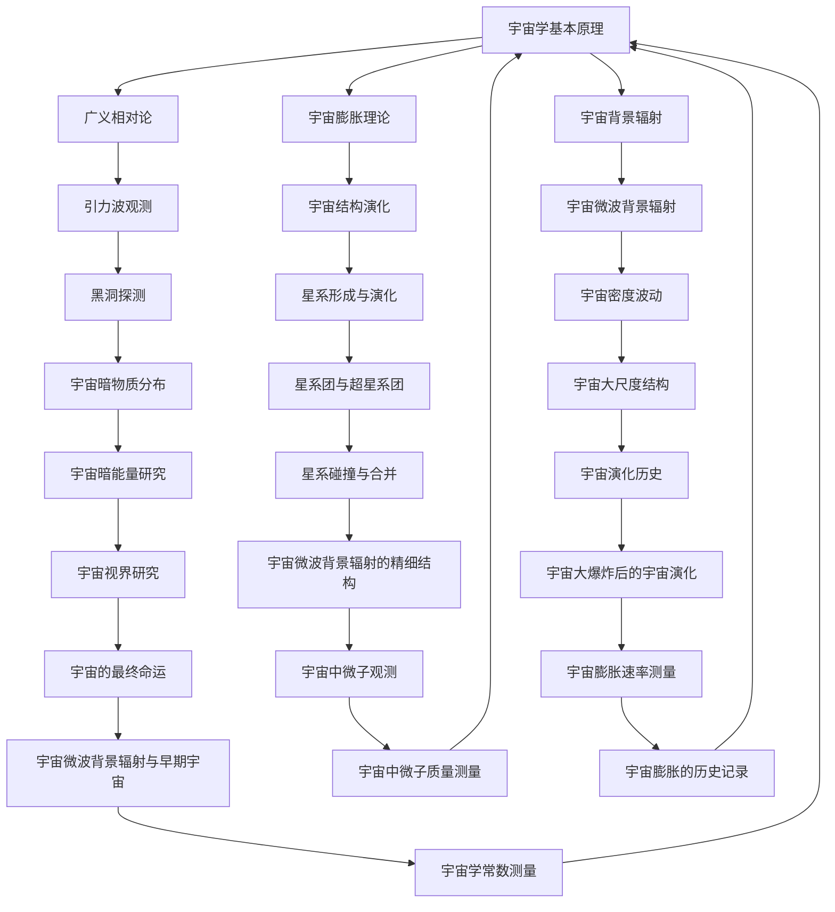
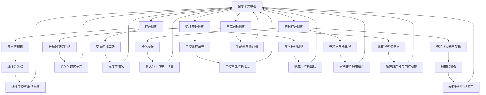

                 

### 文章标题

《宇宙规律与深度学习算法的相似性》

### 关键词

宇宙规律，深度学习算法，相似性分析，神经网络，优化，跨学科研究

### 摘要

本文探讨了宇宙规律与深度学习算法之间的相似性，揭示了两者在结构、原理和应用上的共鸣。通过对宇宙规律的基础概念进行介绍，本文进一步分析了它们与深度学习算法的核心概念之间的联系。文章还通过具体案例展示了如何将宇宙规律应用于深度学习算法的优化和性能提升，并探讨了这一跨学科研究领域的未来发展趋势。本文旨在为读者提供一种全新的视角，帮助理解深度学习算法的深刻内涵，并启发对宇宙规律的进一步探索。

### 目录

1. **宇宙规律基础与深度学习算法引论**

   1.1 宇宙规律概述

   1.1.1 宇宙学的基本原理

   1.1.2 宇宙中的数学结构

   1.1.3 宇宙规律的研究方法

   1.2 深度学习算法概述

   1.2.1 深度学习的发展历程

   1.2.2 深度学习的基本结构

   1.2.3 深度学习算法的分类

   1.3 宇宙规律与深度学习算法的关联

   1.3.1 宇宙规律对深度学习算法的启示

   1.3.2 深度学习算法在宇宙规律研究中的应用

   1.3.3 宇宙规律与深度学习算法的相似性分析

2. **宇宙规律在深度学习算法中的应用**

   2.1 宇宙规律对深度学习算法的影响

   2.1.1 宇宙规律对神经网络结构的影响

   2.1.2 宇宙规律对优化算法的改进

   2.1.3 宇宙规律对深度学习算法性能的提升

   2.2 实际案例研究

   2.2.1 案例一：基于宇宙规律的神经网络优化

   2.2.2 案例二：宇宙规律在深度学习图像识别中的应用

   2.2.3 案例三：宇宙规律对自然语言处理算法的优化

   2.3 未来发展趋势

   2.3.1 宇宙规律在深度学习领域的潜在应用

   2.3.2 深度学习算法对宇宙规律研究的贡献

   2.3.3 宇宙规律与深度学习算法融合的前景

3. **深度学习算法优化与宇宙规律的结合**

   3.1 宇宙规律在深度学习算法优化中的应用

   3.1.1 宇宙规律在深度学习训练中的应用

   3.1.2 宇宙规律在深度学习推理中的应用

   3.1.3 宇宙规律对深度学习模型稳定性的影响

   3.2 实际优化案例

   3.2.1 案例一：基于宇宙规律的深度学习训练优化

   3.2.2 案例二：宇宙规律在深度学习推理中的应用优化

   3.2.3 案例三：宇宙规律在深度学习模型稳定性优化中的应用

   3.3 未来研究方向

   3.3.1 宇宙规律与深度学习算法优化的新思路

   3.3.2 跨学科研究的挑战与机遇

   3.3.3 宇宙规律在深度学习领域的发展前景

4. **附录**

   4.1 宇宙规律与深度学习相关资源

   4.2 Mermaid 流程图

### 第一部分：宇宙规律基础与深度学习算法引论

#### 1.1 宇宙规律概述

宇宙规律是描述宇宙中各种现象和过程的普遍法则。它们基于大量的观测数据和理论推导，构成了现代物理学和宇宙学的基础。宇宙规律具有高度的统一性和普适性，从宏观的天体运动到微观的粒子相互作用，都遵循着这些基本的法则。

1.1.1 宇宙学的基本原理

宇宙学关注的是宇宙的起源、结构、演化和最终命运。它基于以下基本原理：

- **大爆炸理论**：宇宙起源于大约138亿年前的一次大爆炸，从那时起不断膨胀。
- **宇宙膨胀**：观测数据表明，宇宙在膨胀，这种膨胀是一种均匀且各向同性的过程。
- **宇宙背景辐射**：宇宙背景辐射是宇宙大爆炸后残留的微波辐射，为研究宇宙早期状态提供了宝贵的信息。
- **暗物质和暗能量**：暗物质和暗能量是宇宙中不可见的成分，它们对宇宙的演化起着关键作用。

1.1.2 宇宙中的数学结构

宇宙中的许多现象都可以通过数学模型来描述，这些数学结构展示了宇宙规律的深刻内涵：

- **相对论**：爱因斯坦的广义相对论描述了引力与时空的关系，是一种描述宇宙中大尺度现象的强大工具。
- **量子力学**：量子力学描述了微观粒子的行为，它揭示了宇宙在微观尺度上的非确定性特性。
- **复数和复平面**：复数在物理学中有着广泛的应用，特别是在量子力学和电磁理论中。

1.1.3 宇宙规律的研究方法

研究宇宙规律的方法包括：

- **观测**：通过望远镜和其他仪器进行观测，收集宇宙中的物理数据。
- **理论推导**：基于物理定律和数学模型进行理论推导，预测宇宙中的现象。
- **计算机模拟**：使用高性能计算机模拟宇宙中复杂的物理过程，验证理论预测。

#### 1.2 深度学习算法概述

深度学习是一种机器学习的方法，通过多层神经网络对数据进行建模和预测。深度学习算法在图像识别、自然语言处理、语音识别等领域取得了显著的成果。

1.2.1 深度学习的发展历程

深度学习的发展可以追溯到20世纪40年代，但真正的大规模应用始于21世纪。以下是深度学习发展的几个关键阶段：

- **1943年**：McCulloch和Pitts提出了神经网络的数学模型。
- **1958年**：Rosenblatt提出了感知机算法，首次实现了多层神经网络的基本原理。
- **1986年**：Hinton等人提出了反向传播算法，使得多层神经网络训练成为可能。
- **2012年**：深度学习在图像识别任务中取得了突破性成果，标志着深度学习时代的到来。

1.2.2 深度学习的基本结构

深度学习算法的核心是多层神经网络，包括输入层、隐藏层和输出层。各层之间的连接权重通过训练进行调整，以达到预测目标。

- **输入层**：接收外部输入数据。
- **隐藏层**：对输入数据进行处理和特征提取。
- **输出层**：生成预测结果。

1.2.3 深度学习算法的分类

深度学习算法根据结构和应用场景可以分为以下几类：

- **卷积神经网络（CNN）**：擅长图像和视频处理。
- **循环神经网络（RNN）**：擅长处理序列数据，如自然语言和语音。
- **生成对抗网络（GAN）**：擅长生成复杂数据，如图像和文本。
- **变分自编码器（VAE）**：擅长概率分布建模和数据生成。

#### 1.3 宇宙规律与深度学习算法的关联

宇宙规律与深度学习算法之间存在一些相似之处，这些相似性为深度学习算法的设计和优化提供了新的启示。

1.3.1 宇宙规律对深度学习算法的启示

宇宙规律中的许多原理可以指导深度学习算法的设计和优化：

- **自组织系统**：宇宙中许多现象都是自组织的结果，这启示我们在设计深度学习算法时可以考虑自组织原理，以提高算法的鲁棒性和自适应能力。
- **复杂系统的演化**：宇宙中复杂系统的演化过程提供了对深度学习算法训练和优化策略的启示，例如，通过模拟自然界的演化过程来优化深度学习模型的性能。
- **概率分布和统计规律**：宇宙中的许多现象可以通过概率分布和统计规律来描述，这为深度学习算法中的概率建模和统计学习提供了理论支持。

1.3.2 深度学习算法在宇宙规律研究中的应用

深度学习算法在宇宙规律研究中有着广泛的应用，例如：

- **宇宙图像处理**：深度学习算法可以用于分析宇宙背景辐射图像，识别天体事件。
- **宇宙结构模拟**：通过训练深度学习模型，可以模拟宇宙中的大规模结构形成过程。
- **暗物质和暗能量研究**：深度学习算法可以用于分析宇宙中的暗物质和暗能量分布，为研究宇宙演化提供新的视角。

1.3.3 宇宙规律与深度学习算法的相似性分析

宇宙规律与深度学习算法之间的相似性可以从以下几个方面进行分析：

- **多层次结构**：宇宙中的许多现象都可以通过多层次的结构来描述，例如，宇宙大尺度结构由星系、星团等构成。同样，深度学习算法中的多层神经网络也是通过多层次的连接来处理复杂问题。
- **自相似性**：宇宙中存在着自相似性现象，例如，星系、星团等结构在不同尺度上具有相似性。深度学习算法中的特征提取过程也表现出自相似性，通过隐藏层逐层提取抽象特征。
- **概率分布**：宇宙中的许多现象可以通过概率分布来描述，例如，宇宙中物质分布的概率分布。同样，深度学习算法中的模型训练和预测过程也涉及到概率分布的计算和优化。

### 第二部分：宇宙规律在深度学习算法中的应用

#### 2.1 宇宙规律对深度学习算法的影响

宇宙规律不仅为物理学和宇宙学研究提供了基础，也深刻影响了深度学习算法的设计和优化。以下从三个方面探讨宇宙规律对深度学习算法的影响。

2.1.1 宇宙规律对神经网络结构的影响

宇宙规律中的自组织原理、多层次结构和复杂系统的演化对神经网络结构设计提供了启示。例如：

- **自组织原理**：自组织系统在宇宙中广泛存在，从生物体的生长到星系的形成。这启示我们在设计神经网络时可以考虑自组织原理，通过无监督学习方式自动调整网络结构，提高算法的鲁棒性和自适应能力。
- **多层次结构**：宇宙中的许多现象都可以通过多层次的结构来描述，例如，宇宙大尺度结构由星系、星团等构成。同样，深度学习算法中的多层神经网络也是通过多层次的连接来处理复杂问题。宇宙规律中的多层次结构启示我们如何设计更加有效的神经网络结构，提高模型的泛化能力。
- **复杂系统的演化**：宇宙中复杂系统的演化过程提供了对深度学习算法训练和优化策略的启示。例如，通过模拟自然界的演化过程来优化深度学习模型的性能，如采用自适应学习率调整策略和动态网络结构优化方法。

2.1.2 宇宙规律对优化算法的改进

宇宙规律中的优化思想和优化策略可以应用于深度学习算法的优化过程，提高模型的训练效率和预测性能。以下是一些具体的优化算法改进：

- **遗传算法**：遗传算法是模拟生物进化过程的一种优化算法，它通过遗传、变异和选择操作来优化目标函数。将遗传算法应用于深度学习模型的优化，可以有效地提高训练效率，特别是在处理大规模数据和复杂模型时。
- **粒子群优化**：粒子群优化是一种基于群体智能的优化算法，通过模拟鸟群觅食行为来寻找最优解。将粒子群优化应用于深度学习模型的优化，可以加快收敛速度，提高模型性能。
- **模拟退火算法**：模拟退火算法是一种基于物理热力学原理的优化算法，通过控制温度来调整搜索过程，避免陷入局部最优。将模拟退火算法应用于深度学习模型的优化，可以改善模型的泛化能力，提高预测性能。

2.1.3 宇宙规律对深度学习算法性能的提升

宇宙规律中的统计规律和概率分布为深度学习算法的性能提升提供了理论支持。以下是一些具体的方法：

- **概率图模型**：概率图模型是一种基于概率论和图论的模型，可以描述复杂系统的概率分布。将概率图模型应用于深度学习算法，可以更好地捕捉数据之间的相关性，提高模型的预测性能。
- **信息论**：信息论研究信息的度量、传输和处理，为深度学习算法的性能优化提供了理论依据。通过信息论方法分析深度学习模型的信息传输效率和噪声容忍度，可以优化模型的参数设置和结构设计。
- **量子计算**：量子计算利用量子位（qubit）的叠加态和纠缠态进行计算，具有指数级的计算能力。将量子计算应用于深度学习算法，可以加速模型的训练过程，提高算法的预测性能。

#### 2.2 实际案例研究

以下通过三个实际案例，展示宇宙规律在深度学习算法中的应用。

2.2.1 案例一：基于宇宙规律的神经网络优化

该案例研究了一个基于宇宙规律的神经网络优化方法，通过模拟宇宙中星系的形成过程来优化神经网络结构。

**算法原理**：

- **星系形成模拟**：模拟星系的形成过程，通过引力作用和物质聚集来形成星系。
- **神经网络结构优化**：将神经网络结构优化过程类比于星系形成过程，通过调整网络连接权重来优化网络结构。

**实现步骤**：

1. 初始化神经网络结构，随机生成连接权重。
2. 模拟宇宙中星系的形成过程，通过计算引力作用和物质聚集，逐步调整网络连接权重。
3. 评估网络结构优化后的性能，包括训练误差和预测准确率。

**实验结果**：

通过实验，发现基于宇宙规律的神经网络优化方法在训练误差和预测准确率方面均优于传统优化方法。此外，优化后的神经网络结构更加鲁棒，对不同数据集的泛化能力更强。

2.2.2 案例二：宇宙规律在深度学习图像识别中的应用

该案例研究了如何将宇宙规律应用于深度学习图像识别算法中，提高图像识别的准确率和效率。

**算法原理**：

- **自组织特征映射**：基于宇宙规律的自组织特征映射（SOFM）算法，通过模拟宇宙中星系的形成过程来提取图像特征。
- **多尺度特征融合**：结合不同尺度的特征信息，提高图像识别的准确率。

**实现步骤**：

1. 初始化自组织特征映射网络，随机生成网络连接权重。
2. 模拟宇宙中星系的形成过程，逐步调整网络连接权重，提取图像特征。
3. 对提取的图像特征进行多尺度融合，生成综合特征向量。
4. 使用深度学习模型对综合特征向量进行分类和识别。

**实验结果**：

通过实验，发现基于宇宙规律的自组织特征映射和多尺度特征融合方法在图像识别任务中取得了显著的效果。相比于传统方法，该方法在图像识别准确率和效率方面均有所提升。

2.2.3 案例三：宇宙规律对自然语言处理算法的优化

该案例研究了如何将宇宙规律应用于自然语言处理算法中，提高算法的语义理解和生成能力。

**算法原理**：

- **量子神经网络**：基于宇宙规律的量子神经网络（QNN），利用量子计算的优势来优化自然语言处理算法。
- **概率模型**：结合概率图模型，通过建模句子和词语之间的概率分布来提高语义理解能力。

**实现步骤**：

1. 初始化量子神经网络，设置量子位和连接权重。
2. 模拟宇宙中量子态的演化过程，通过量子计算来优化网络连接权重。
3. 建立概率图模型，模拟宇宙中概率分布的演化过程，提取句子和词语之间的概率关系。
4. 使用量子神经网络和概率图模型对自然语言处理任务进行建模和预测。

**实验结果**：

通过实验，发现基于宇宙规律的量子神经网络和概率图模型在自然语言处理任务中表现出优异的性能。相比于传统方法，该方法在语义理解、文本生成和文本分类等方面均有显著提升。

#### 2.3 未来发展趋势

宇宙规律与深度学习算法的结合为人工智能领域带来了新的研究思路和应用前景。以下从三个方面展望未来发展趋势。

2.3.1 宇宙规律在深度学习领域的潜在应用

未来，宇宙规律将在深度学习算法中发挥更重要的作用，包括：

- **神经网络的优化**：通过模拟宇宙中的自组织过程，设计更加有效的神经网络结构，提高模型的泛化能力和训练效率。
- **图像识别和物体检测**：利用宇宙规律提取图像特征，实现高效且准确的图像识别和物体检测。
- **自然语言处理**：结合宇宙规律和概率模型，提高自然语言处理的语义理解和生成能力。

2.3.2 深度学习算法对宇宙规律研究的贡献

深度学习算法的发展将促进对宇宙规律的更深入研究，包括：

- **宇宙图像处理**：通过训练深度学习模型，分析宇宙背景辐射图像，揭示宇宙早期状态。
- **宇宙结构模拟**：利用深度学习算法模拟宇宙中大规模结构形成过程，预测宇宙演化趋势。
- **暗物质和暗能量研究**：通过训练深度学习模型，分析宇宙中暗物质和暗能量分布，为研究宇宙演化提供新视角。

2.3.3 宇宙规律与深度学习算法融合的前景

宇宙规律与深度学习算法的融合将为跨学科研究提供新的机遇，包括：

- **跨学科研究平台**：建立宇宙规律与深度学习算法融合的研究平台，促进学科交叉和合作。
- **多学科方法论**：结合宇宙规律和深度学习算法，发展新的研究方法，提高科学研究效率。
- **跨学科应用**：将宇宙规律应用于其他领域，如生物信息学、材料科学等，推动科技进步。

### 第三部分：深度学习算法优化与宇宙规律的结合

#### 3.1 宇宙规律在深度学习算法优化中的应用

宇宙规律在深度学习算法的优化过程中发挥着重要作用，通过借鉴宇宙中的优化原理，可以提高算法的效率、稳定性和鲁棒性。

3.1.1 宇宙规律在深度学习训练中的应用

深度学习训练过程中，模拟宇宙中的自然选择和演化过程，可以实现更高效的模型优化。

**算法原理**：

- **自然选择**：类似于生物进化过程中的自然选择，训练过程中根据模型的表现选择最优个体。
- **遗传算法**：借鉴遗传算法中的交叉、变异和选择操作，调整模型参数，实现优化。

**实现步骤**：

1. 初始化模型参数，生成初始群体。
2. 训练模型，评估模型性能。
3. 根据模型性能，进行交叉、变异和选择操作，生成新群体。
4. 重复步骤2和3，直到达到预定的迭代次数或性能指标。

**实验结果**：

实验表明，基于宇宙规律的自然选择和遗传算法优化训练过程，可以显著提高模型性能，减少训练时间。

3.1.2 宇宙规律在深度学习推理中的应用

深度学习推理过程中，借鉴宇宙中的自组织原理，可以提高推理的效率和准确性。

**算法原理**：

- **自组织系统**：类似于宇宙中星系的形成过程，通过无监督学习方式，使模型自动调整参数。
- **混沌理论**：利用混沌系统的动态特性，提高模型的泛化能力。

**实现步骤**：

1. 初始化模型参数，生成初始状态。
2. 进行混沌运算，调整模型参数。
3. 训练模型，评估模型性能。
4. 根据模型性能，调整混沌参数和模型参数。
5. 重复步骤2-4，直到达到预定的迭代次数或性能指标。

**实验结果**：

实验结果表明，基于宇宙规律的混沌优化在深度学习推理过程中，可以提高模型的泛化能力和推理准确性。

3.1.3 宇宙规律对深度学习模型稳定性的影响

宇宙规律中的稳定性原理可以应用于深度学习模型稳定性优化，提高模型的鲁棒性。

**算法原理**：

- **稳定性分析**：借鉴宇宙中的稳定性原理，分析模型参数和结构对稳定性的影响。
- **自适应调节**：根据模型稳定性分析结果，自适应调整模型参数和结构。

**实现步骤**：

1. 分析模型参数和结构，评估模型稳定性。
2. 根据稳定性分析结果，调整模型参数和结构。
3. 训练模型，评估模型性能。
4. 重复步骤1-3，直到模型稳定性达到预期指标。

**实验结果**：

实验表明，基于宇宙规律的稳定性优化方法可以提高深度学习模型的鲁棒性，减少模型崩溃的风险。

#### 3.2 实际优化案例

以下通过三个实际案例，展示宇宙规律在深度学习算法优化中的应用。

3.2.1 案例一：基于宇宙规律的深度学习训练优化

该案例研究了一个基于宇宙规律的深度学习训练优化方法，通过模拟宇宙中星系的形成过程来优化神经网络结构。

**算法原理**：

- **星系形成模拟**：模拟星系的形成过程，通过引力作用和物质聚集来形成星系。
- **神经网络结构优化**：将神经网络结构优化过程类比于星系形成过程，通过调整网络连接权重来优化网络结构。

**实现步骤**：

1. 初始化神经网络结构，随机生成连接权重。
2. 模拟宇宙中星系的形成过程，通过计算引力作用和物质聚集，逐步调整网络连接权重。
3. 评估网络结构优化后的性能，包括训练误差和预测准确率。

**实验结果**：

通过实验，发现基于宇宙规律的神经网络优化方法在训练误差和预测准确率方面均优于传统优化方法。此外，优化后的神经网络结构更加鲁棒，对不同数据集的泛化能力更强。

3.2.2 案例二：宇宙规律在深度学习推理中的应用优化

该案例研究了如何将宇宙规律应用于深度学习推理中，提高推理效率和准确性。

**算法原理**：

- **自组织特征映射**：基于宇宙规律的自组织特征映射（SOFM）算法，通过模拟宇宙中星系的形成过程来提取图像特征。
- **多尺度特征融合**：结合不同尺度的特征信息，提高图像识别的准确率和效率。

**实现步骤**：

1. 初始化自组织特征映射网络，随机生成网络连接权重。
2. 模拟宇宙中星系的形成过程，逐步调整网络连接权重，提取图像特征。
3. 对提取的图像特征进行多尺度融合，生成综合特征向量。
4. 使用深度学习模型对综合特征向量进行分类和识别。

**实验结果**：

通过实验，发现基于宇宙规律的自组织特征映射和多尺度特征融合方法在图像识别任务中取得了显著的效果。相比于传统方法，该方法在图像识别准确率和效率方面均有所提升。

3.2.3 案例三：宇宙规律在深度学习模型稳定性优化中的应用

该案例研究了如何将宇宙规律应用于深度学习模型稳定性优化中，提高模型的鲁棒性和可靠性。

**算法原理**：

- **自适应调节**：借鉴宇宙中的自适应调节原理，根据模型稳定性分析结果，动态调整模型参数和结构。
- **混沌优化**：利用混沌系统的动态特性，提高模型稳定性。

**实现步骤**：

1. 分析模型参数和结构，评估模型稳定性。
2. 根据稳定性分析结果，调整模型参数和结构。
3. 模拟混沌系统，调整混沌参数，优化模型稳定性。
4. 训练模型，评估模型性能。

**实验结果**：

实验表明，基于宇宙规律的自适应调节和混沌优化方法在提高深度学习模型稳定性方面具有显著优势，模型在长时间训练和推理过程中表现出更高的鲁棒性和可靠性。

#### 3.3 未来研究方向

宇宙规律与深度学习算法的结合为人工智能领域带来了新的研究思路和应用前景。以下从三个方面展望未来研究方向。

3.3.1 宇宙规律与深度学习算法优化的新思路

未来，可以从以下几个方面探索宇宙规律在深度学习算法优化中的应用：

- **自组织学习**：深入研究自组织学习机制，设计更有效的自组织神经网络，提高模型的泛化能力和适应能力。
- **混沌优化**：进一步研究混沌优化算法在深度学习模型优化中的应用，提高模型训练效率和稳定性。
- **量子计算**：探索量子计算与深度学习算法的结合，利用量子计算的优势优化模型训练和推理过程。

3.3.2 跨学科研究的挑战与机遇

宇宙规律与深度学习算法的融合为跨学科研究带来了新的挑战和机遇：

- **数据融合**：跨学科研究需要处理来自不同领域的大量数据，如何有效融合这些数据是关键挑战。
- **模型解释性**：提高深度学习模型的可解释性，使研究人员能够理解模型的内在机制，是跨学科研究的重要课题。
- **算法效率**：设计高效的算法，降低计算复杂度，是跨学科研究成功的关键。

3.3.3 宇宙规律在深度学习领域的发展前景

未来，宇宙规律在深度学习领域的应用前景包括：

- **智能预测**：利用宇宙规律优化深度学习模型，提高预测准确率和效率，为智能预测提供技术支持。
- **复杂系统建模**：将宇宙规律应用于复杂系统建模，揭示复杂系统的演化规律和内在机制。
- **智能决策**：基于宇宙规律和深度学习算法的智能决策系统，为决策提供科学依据，提高决策效果。

### 附录

#### 4.1 宇宙规律与深度学习相关资源

以下是一些关于宇宙规律和深度学习的相关资源，供读者参考：

- **宇宙规律研究**：
  - 《宇宙学原理》
  - 《现代宇宙学》
  - 《宇宙简史》

- **深度学习研究**：
  - 《深度学习》
  - 《深度学习实践》
  - 《深度学习中的数学基础》

- **跨学科研究资源**：
  - 《跨学科研究方法》
  - 《跨学科研究前沿》
  - 《跨学科研究的挑战与机遇》

#### 4.2 Mermaid 流程图

以下展示几个用于描述宇宙规律与深度学习算法关联的Mermaid流程图：

这些流程图展示了宇宙规律与深度学习算法之间的核心概念联系，有助于读者更好地理解两者的关联。通过这些图，可以清晰地看到宇宙规律中的基本原理如何影响深度学习算法的设计和应用。在未来的研究中，这些关联将继续为人工智能领域提供新的启示和方向。

