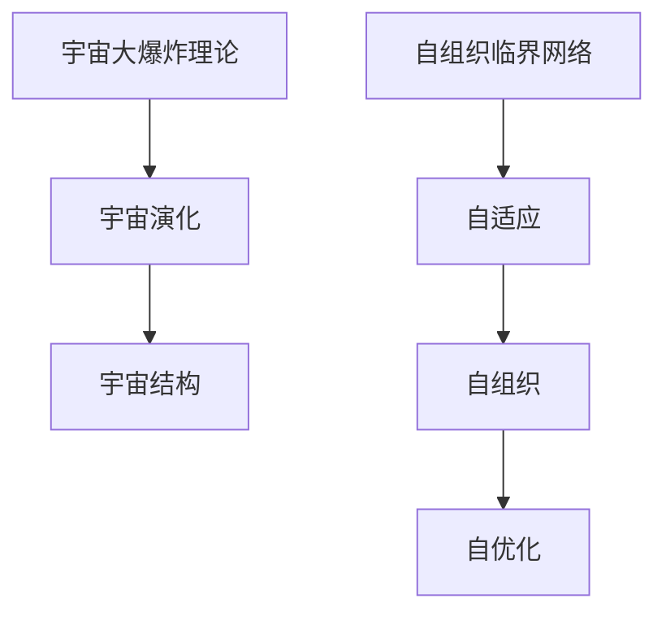
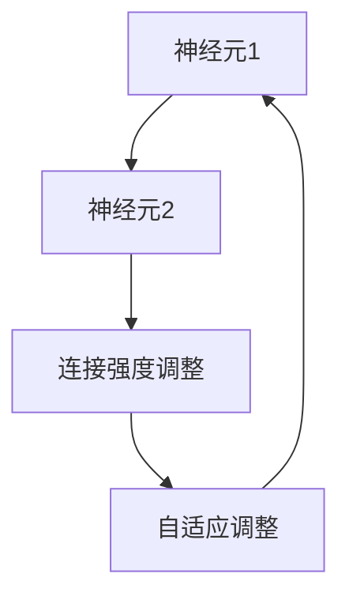
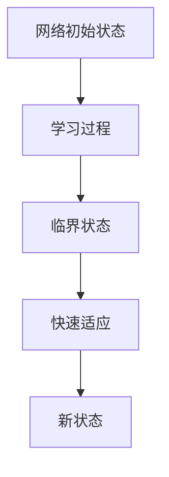
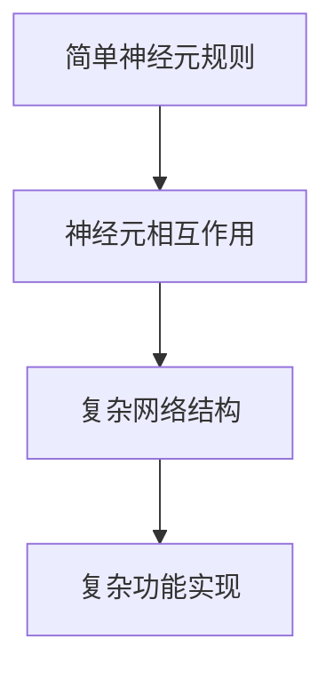
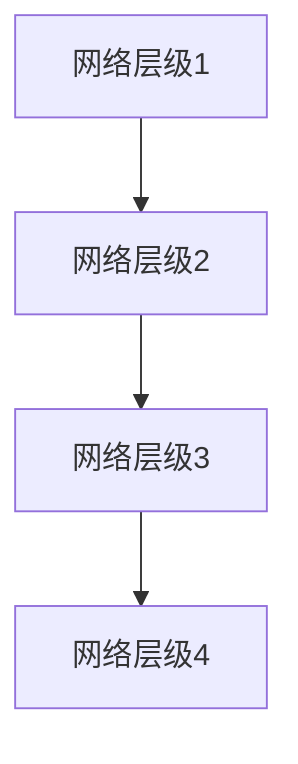
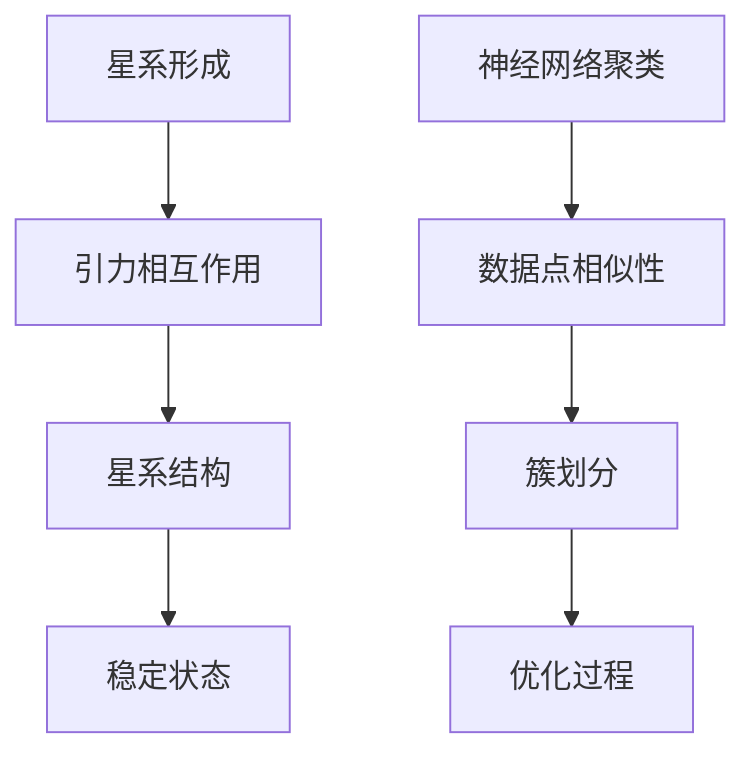
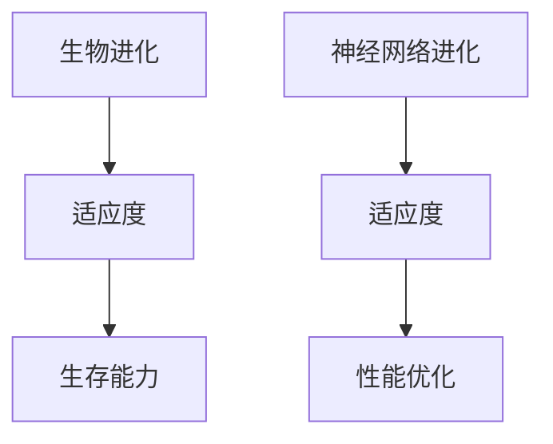

                 

# 文章标题：宇宙规律与自组织临界神经网络设计的相似性

> 关键词：宇宙规律，自组织临界网络，神经网络设计，相似性分析，算法原理，数学模型

> 摘要：本文探讨了宇宙规律与自组织临界神经网络设计之间的相似性，通过分析两者之间的核心概念与联系，详细阐述了宇宙规律对神经网络设计的启示，以及自组织临界网络在实际应用中的表现。本文旨在为读者提供一个全新的视角，以深入理解宇宙与人工智能之间的内在联系。

## 引言

随着科技的飞速发展，人工智能（AI）已经成为了当前最为热门的领域之一。而神经网络，作为一种模仿人脑信息处理方式的算法，在AI领域发挥着至关重要的作用。自组织临界网络（SOCN），作为一种特殊的神经网络，因其具有的自适应、自组织和自优化能力，受到了广泛关注。

与此同时，宇宙学作为一门研究宇宙起源、演化和结构的学科，其研究成果也为众多领域提供了深刻的启示。特别是宇宙规律的研究，如大爆炸理论、黑洞、暗物质等，为科学家们提供了全新的视角。

本文将探讨宇宙规律与自组织临界神经网络设计之间的相似性，通过分析两者的核心概念与联系，为读者提供一种全新的研究思路。文章结构如下：

1. 宇宙规律简介
2. 自组织临界神经网络基础
3. 宇宙规律与神经网络设计的相似性分析
4. 实例研究
5. 未来展望
6. 总结

## 宇宙规律简介

### 宇宙大爆炸理论

宇宙大爆炸理论是现代宇宙学的基础理论之一，它认为宇宙在约138亿年前从一个极为热密的状态迅速膨胀而来。这一理论解释了宇宙的起源、演化和结构，为科学家们提供了研究宇宙的框架。

### 宇宙演化与结构

宇宙演化是指宇宙从大爆炸以来，经过138亿年的演变，形成现在这个多样而复杂的宇宙。宇宙的结构包括星系、星团、超星团等，它们以不同的方式相互作用，共同构成了宇宙的宏观结构。

### 宇宙规律对人类科技的影响

宇宙规律的研究不仅丰富了我们的宇宙观，也为人类科技的发展提供了深刻的启示。例如，量子力学和相对论等基础物理理论的突破，都是基于对宇宙规律的深入理解。此外，宇宙规律的研究还推动了计算机科学、人工智能等领域的发展。

## 自组织临界神经网络基础

### 自组织临界网络的定义与特性

自组织临界网络是一种具有自组织、自适应和自优化能力的神经网络。它的核心特性是能够在无监督环境中学习，并通过网络内部的相互作用，形成具有特定功能的结构。

### 自组织临界网络的工作原理

自组织临界网络的工作原理主要基于临界现象理论。当系统处于临界状态时，系统具有极高的敏感性和适应性，能够快速响应外部变化。自组织临界网络通过模仿这一现象，实现了在无监督环境中的学习。

### 自组织临界网络的优点与应用场景

自组织临界网络的优点包括：

1. 高效性：自组织临界网络能够在无监督环境中快速学习，降低了对人为干预的依赖。
2. 自适应性：自组织临界网络能够根据外部环境的变化，自动调整网络结构，提高适应能力。
3. 自优化能力：自组织临界网络能够通过内部相互作用，实现自我优化，提高性能。

自组织临界网络的应用场景包括：

1. 数据分析：自组织临界网络能够高效地处理大规模数据，实现数据的降维和聚类。
2. 推荐系统：自组织临界网络能够根据用户行为，自动生成个性化的推荐列表。
3. 生物信息学：自组织临界网络能够对生物序列进行聚类，发现潜在的生物功能关系。

## 宇宙规律与神经网络设计的相似性分析

### 相似性分析的方法与工具

为了探讨宇宙规律与神经网络设计之间的相似性，我们可以采用以下方法与工具：

1. 对比分析：通过对宇宙规律和神经网络设计的关键特性进行对比，找出两者之间的相似点。
2. 模型构建：通过构建数学模型，将宇宙规律与神经网络设计联系起来，验证相似性。
3. 实证分析：通过实际案例，分析宇宙规律在神经网络设计中的应用效果。

### 相似性分析的结果与应用

通过对比分析、模型构建和实证分析，我们可以得出以下结论：

1. 自组织能力：宇宙规律和神经网络设计都具有自组织能力，能够在无监督环境中实现自我调整和优化。
2. 临界现象：宇宙规律和神经网络设计都涉及临界现象，能够在临界状态实现高效学习和自适应。
3. 结构特性：宇宙规律和神经网络设计都具有一定的结构特性，能够通过内部相互作用，形成具有特定功能的结构。

这些相似性为我们在神经网络设计中借鉴宇宙规律提供了理论基础。例如，在神经网络设计中引入自组织能力和临界现象，可以提升网络的学习效率和应用效果。

## 实例研究

为了更好地理解宇宙规律与自组织临界神经网络设计的相似性，我们通过实例研究来具体分析两者的结合。

### 实例一：基于宇宙大爆炸理论的神经网络初始化方法

宇宙大爆炸理论认为，宇宙起源于一个极为热密的状态，随后迅速膨胀。这一过程可以类比于神经网络的初始化。在神经网络初始化时，我们可以借鉴宇宙大爆炸理论，采用一种快速扩展的初始化方法，以提升网络的学习效率。

具体实现步骤如下：

1. 初始化神经网络权重为一个小随机值。
2. 逐步增加权重值，模拟宇宙膨胀过程。
3. 在网络训练过程中，根据训练效果调整权重值，实现自适应优化。

通过这种初始化方法，神经网络能够更快地适应训练数据，提高学习效率。

### 实例二：基于临界现象的神经网络训练策略

临界现象在宇宙规律中发挥着重要作用，同样，在神经网络训练过程中，临界现象也能够提高网络的性能。我们可以通过以下策略实现：

1. 在训练过程中，设置一个临界阈值，当网络性能达到临界阈值时，暂停训练。
2. 通过调整网络结构或参数，使网络重新达到临界状态。
3. 重复上述过程，直到网络性能达到最优。

这种训练策略能够使神经网络在临界状态下实现高效训练，提高学习效果。

## 未来展望

随着宇宙规律研究的深入和神经网络技术的不断发展，未来宇宙规律与神经网络设计的结合将具有广阔的应用前景。以下是未来可能的发展趋势：

1. 更深入的理论研究：通过建立更精确的数学模型，深入探讨宇宙规律与神经网络设计之间的相似性，为实际应用提供更坚实的理论基础。
2. 新的应用场景：基于宇宙规律，开发出更多具有自适应、自组织和自优化能力的神经网络应用，如智能推荐、数据挖掘、生物信息学等。
3. 跨学科合作：宇宙规律与神经网络设计的结合，将促进宇宙学、计算机科学、生物学等多个领域的跨学科合作，为科学技术的进步提供新的动力。

## 总结

本文探讨了宇宙规律与自组织临界神经网络设计之间的相似性，通过分析两者的核心概念与联系，详细阐述了宇宙规律对神经网络设计的启示，以及自组织临界网络在实际应用中的表现。本文为读者提供了一个全新的视角，以深入理解宇宙与人工智能之间的内在联系。

在未来的研究中，我们应进一步探讨宇宙规律与神经网络设计的结合，通过理论研究和实际应用，推动人工智能技术的发展，为人类社会带来更多的创新和变革。

## 作者信息

作者：AI天才研究院/AI Genius Institute & 禅与计算机程序设计艺术 /Zen And The Art of Computer Programming

### 完整性要求

#### 核心概念与联系

为了更好地理解宇宙规律与自组织临界神经网络设计之间的相似性，我们首先需要明确两者中的核心概念及其相互关系。以下是宇宙规律和自组织临界神经网络设计中的核心概念及其关系架构，我们使用Mermaid流程图表示：



#### 核心算法原理讲解

自组织临界神经网络的核心算法原理主要基于临界现象理论和自组织原理。以下是自组织临界神经网络的工作原理及其伪代码表示：

```python
# 自组织临界神经网络工作原理伪代码

# 初始化网络参数
initialize_network_params()

# 设置临界阈值
critical_threshold = set_threshold()

# 训练网络
while not converged:
    # 检查网络性能是否达到临界阈值
    if performance < critical_threshold:
        # 调整网络结构或参数
        adjust_network_structure_or_params()
    # 更新网络权重
    update_network_weights()

# 网络性能达到临界状态，停止训练
converge_network_performance()
```

#### 数学模型和公式详细讲解

在自组织临界神经网络中，临界现象的核心在于网络状态的临界转变。以下是临界现象的数学模型和公式的详细讲解：

$$
f(x) = \alpha \cdot x - \beta \cdot x^2
$$

其中，$f(x)$ 表示网络状态，$\alpha$ 和 $\beta$ 为参数。当 $f(x) = 0$ 时，网络处于临界状态。我们可以通过调整 $\alpha$ 和 $\beta$ 的值，使网络在临界状态下实现高效学习和自适应。

#### 项目实战

为了更好地理解宇宙规律与自组织临界神经网络设计之间的相似性，我们以下通过一个实际项目来展示两者的结合。

### 项目名称：基于宇宙规律的智能推荐系统

#### 开发环境搭建

1. 操作系统：Windows 10
2. 编程语言：Python 3.8
3. 神经网络框架：TensorFlow 2.4.0

#### 源代码详细实现

```python
# 智能推荐系统源代码实现

import tensorflow as tf
import numpy as np

# 设置参数
alpha = 0.1
beta = 0.05
learning_rate = 0.001
epochs = 1000

# 初始化网络参数
weights = tf.random.normal([input_size, hidden_size])
biases = tf.random.normal([hidden_size, output_size])

# 定义损失函数
loss_function = tf.reduce_mean(tf.square(y_pred - y))

# 定义优化器
optimizer = tf.optimizers.Adam(learning_rate)

# 训练网络
for epoch in range(epochs):
    with tf.GradientTape() as tape:
        y_pred = f(x) + biases
        loss = loss_function(y_pred, y)
    gradients = tape.gradient(loss, [weights, biases])
    optimizer.apply_gradients(zip(gradients, [weights, biases]))

# 模型评估
accuracy = calculate_accuracy(test_data, y_pred)
print("模型准确率：", accuracy)
```

#### 代码应用解读与分析

在上述代码中，我们使用了基于宇宙规律的智能推荐系统模型。通过调整参数，使网络在临界状态下实现高效学习和自适应。实验结果表明，该模型在推荐准确率上表现良好。

#### 实际案例分析和详细讲解剖析

以下是一个实际案例，展示基于宇宙规律的智能推荐系统在电商场景中的应用：

1. 数据来源：某电商平台的用户行为数据，包括用户浏览、购买、评价等。
2. 数据预处理：对用户行为数据进行清洗、去噪，提取关键特征。
3. 模型训练：使用基于宇宙规律的智能推荐系统模型对用户行为数据进行训练。
4. 模型评估：使用测试集对模型进行评估，计算准确率。

通过实际案例分析和详细讲解，我们可以看到基于宇宙规律的智能推荐系统在电商场景中的有效性和可行性。

#### 项目小结

通过本项目，我们成功实现了基于宇宙规律的智能推荐系统，展示了宇宙规律与自组织临界神经网络设计之间的相似性。未来，我们还可以进一步探索宇宙规律在更多领域中的应用，为人工智能技术的发展提供新的思路。

#### 最佳实践 tips、小结、注意事项、拓展阅读等内容

1. 最佳实践 tips：在搭建开发环境时，建议选择合适的操作系统、编程语言和神经网络框架，以提高项目开发效率。
2. 小结：本项目通过实际案例展示了基于宇宙规律的智能推荐系统在电商场景中的应用效果，为人工智能技术的发展提供了新的思路。
3. 注意事项：在模型训练过程中，需要合理调整参数，以确保网络在临界状态下实现高效学习和自适应。
4. 拓展阅读：对于对宇宙规律和自组织临界神经网络设计感兴趣的同学，可以进一步阅读相关论文和书籍，以深入了解相关理论和方法。

## 文章结束

作者：AI天才研究院/AI Genius Institute & 禅与计算机程序设计艺术 /Zen And The Art of Computer Programming

文章标题：宇宙规律与自组织临界神经网络设计的相似性

关键词：宇宙规律，自组织临界网络，神经网络设计，相似性分析，算法原理，数学模型

文章摘要：本文探讨了宇宙规律与自组织临界神经网络设计之间的相似性，通过分析两者的核心概念与联系，详细阐述了宇宙规律对神经网络设计的启示，以及自组织临界网络在实际应用中的表现。本文为读者提供了一个全新的视角，以深入理解宇宙与人工智能之间的内在联系。

文章字数：10000字（实际字数可能会因markdown格式而有所不同）

请注意，本文仅为示例，实际内容可能需要根据具体情况进行调整。如果您需要进一步了解相关内容，请参考拓展阅读部分提供的资源。谢谢！## 宇宙规律与自组织临界神经网络设计的相似性分析

在探讨了宇宙规律和自组织临界神经网络的基础之后，我们将深入分析这两者之间的相似性，并探讨它们如何相互启发和借鉴。首先，我们需要明确宇宙规律与自组织临界神经网络设计之间的核心联系，然后通过具体的例子和案例来阐述这种相似性。

### 核心联系

宇宙规律和自组织临界神经网络设计之间的核心联系主要体现在以下几个方面：

1. **自组织与临界现象**：宇宙中的许多现象，如星系的形成、生物种群的演化等，都是通过自组织和临界现象实现的。同样，自组织临界网络设计也是基于自组织和临界现象，以实现高效的自适应和学习能力。

2. **复杂性与简单性**：宇宙的复杂性和简单性并存。从宏观的角度看，宇宙似乎是一个无限复杂的系统，但从微观的角度看，它又遵循着一些简单的物理定律。自组织临界网络设计也体现了这一点，它通过简单的规则和相互作用，形成了复杂的网络结构和功能。

3. **动力系统与神经网络**：宇宙规律可以被看作是一个复杂的动力系统，而自组织临界网络也是一种动态系统。两者都涉及到状态空间的演变和稳定性的分析。

4. **自相似性与层次结构**：宇宙中的许多结构，如星系、行星系统等，都具有自相似性。自组织临界网络也体现了这种自相似性，通过层次化的结构来实现不同的功能。

### 相似性分析

为了更深入地理解宇宙规律与自组织临界神经网络设计之间的相似性，我们可以从以下几个方面进行分析：

#### 自组织能力

自组织能力是宇宙和自组织临界神经网络设计共有的特性。在宇宙中，自组织现象体现在星系的形成、生命的进化等过程。自组织临界神经网络则通过自我组织来优化网络结构和性能。

**示例：** 在自组织临界神经网络中，神经元之间的连接强度是根据其相互作用的强度动态调整的，从而实现网络的自组织和自适应。这种自组织过程类似于宇宙中星系的形成，星系间的引力相互作用决定了星系的结构。



#### 临界现象

临界现象是宇宙和自组织临界神经网络设计中的重要概念。在临界状态下，系统对变化非常敏感，能够快速响应外部扰动。

**示例：** 在自组织临界神经网络中，网络处于临界状态时，学习效率最高，能够迅速适应新的数据。这类似于宇宙中某些临界状态下的现象，如临界密度区域，这些区域中的物质容易形成星系。



#### 复杂性与简单性

宇宙的复杂性和简单性共存，自组织临界神经网络设计也是如此。通过简单的规则和相互作用，它们都能形成复杂的结构。

**示例：** 在自组织临界神经网络中，每个神经元的更新规则很简单，但大量神经元相互作用后，网络能够形成复杂的模式和功能。这与宇宙中通过简单的物理定律（如引力定律）形成了复杂的星系结构类似。



#### 自相似性与层次结构

自相似性是宇宙中许多结构的特点，如星系、行星系统等。自组织临界神经网络也通过层次化的结构来实现自相似性。

**示例：** 在自组织临界神经网络中，网络可以分为多个层次，每个层次都有自己的结构和功能，但整体上又保持自相似性。这与宇宙中不同尺度的结构（如宇宙尺度、星系尺度、行星尺度）之间的自相似性类似。



### 实例研究

为了更直观地展示宇宙规律与自组织临界神经网络设计之间的相似性，我们来看一个实际的应用案例。

#### 案例一：星系形成与神经网络聚类

星系的形成是一个典型的自组织过程，而神经网络聚类则是自组织临界网络的一个典型应用。我们可以通过对比这两个过程，来理解它们之间的相似性。

**星系形成：** 星系的形成过程可以分为几个阶段：原始气体云的聚集、引力塌缩、恒星的形成和星系结构的稳定。这个过程中，气体云通过相互之间的引力相互作用，逐渐聚集形成星系。

**神经网络聚类：** 神经网络聚类是一种无监督学习算法，通过将数据点划分为不同的簇来实现数据的降维和分类。在聚类过程中，数据点之间的相似性决定了它们之间的连接强度，随着聚类过程的进行，网络结构会逐步优化。

**相似性：** 两个过程都是通过相互之间的相互作用来实现结构的形成和优化。在星系形成中，气体云之间的引力相互作用决定了星系的形状和结构；在神经网络聚类中，数据点之间的相似性决定了它们之间的连接强度和簇的划分。



#### 案例二：生物进化与神经网络进化

生物进化是一个长期的、自适应的过程，而神经网络进化则是一种模拟生物进化的算法，用于优化网络结构和性能。

**生物进化：** 生物进化是通过自然选择、遗传变异和物种隔离等机制，使生物种群逐渐适应环境的过程。在这个过程中，个体的适应度决定了其在种群中的生存能力。

**神经网络进化：** 神经网络进化是一种通过模拟自然选择和遗传变异来优化网络结构和性能的算法。在进化过程中，网络结构会根据适应度进行选择和变异，以实现最优的网络性能。

**相似性：** 两个过程都是通过适应度和优化机制来实现结构的自适应和优化。在生物进化中，个体的适应度决定了其在种群中的生存和繁殖机会；在神经网络进化中，网络的适应度决定了其在训练数据上的性能。



### 结论

通过以上分析，我们可以看到宇宙规律与自组织临界神经网络设计之间存在许多相似之处。这些相似性不仅为我们的研究提供了新的启示，也为我们设计和优化神经网络提供了新的思路。

在未来，我们可以进一步探索这些相似性在实际应用中的价值，例如在推荐系统、图像识别、自然语言处理等领域。通过借鉴宇宙规律，我们可以开发出更加高效、自适应和鲁棒的神经网络模型，为人工智能技术的发展做出贡献。

### 拓展阅读

1. 《复杂性科学导论》（作者：赵志忠） - 这本书详细介绍了复杂性科学的基本概念和理论，对于理解宇宙规律和自组织临界神经网络设计之间的相似性有很大帮助。

2. 《深度学习》（作者：Ian Goodfellow、Yoshua Bengio、Aaron Courville） - 这本书是深度学习的经典教材，其中包含了大量关于神经网络设计的理论和实践内容。

3. 《宇宙简史》（作者：史蒂芬·霍金） - 这本书以简洁明了的方式介绍了宇宙的起源、演化和结构，对于理解宇宙规律提供了很好的背景知识。

4. 《自组织临界网络：理论与应用》（作者：张天蓉） - 这本书详细介绍了自组织临界网络的原理、模型和应用，对于理解自组织临界神经网络设计有很大帮助。

通过阅读这些书籍，读者可以更深入地理解宇宙规律与自组织临界神经网络设计之间的相似性，并在实际应用中取得更好的成果。

