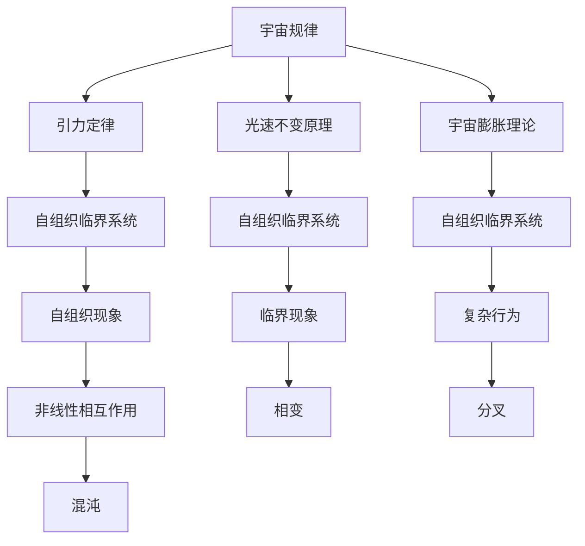

                 

### 文章标题：宇宙规律与自组织临界系统的相似性

### 关键词：宇宙规律、自组织临界系统、引力、光速、宇宙膨胀、大爆炸理论、黑洞、暗物质

### 摘要：
本文旨在探讨宇宙规律与自组织临界系统之间的相似性。通过对宇宙基本规律的介绍，如引力定律、光速不变原理和宇宙膨胀理论，以及自组织临界系统的定义、特点和研究方法，本文分析了两者之间的相似性，并通过实例研究，探讨了这些相似性在宇宙中的体现和应用。文章最后总结了当前研究的成果，展望了未来的研究方向，并对实际应用进行了分析。

## 引言

### 1.1 书籍背景与目的

宇宙是我们所在的空间和时间的整体，而自组织临界系统是一类具有复杂行为的开放系统，它们在临界点附近表现出强烈的非线性现象。近年来，科学家们发现宇宙规律与自组织临界系统之间存在许多相似之处，这一发现为理解宇宙的演化和复杂现象提供了新的视角。

本书旨在系统地探讨宇宙规律与自组织临界系统之间的相似性。通过介绍宇宙的基本规律、自组织临界系统的理论框架，以及两者之间的联系，本书旨在为读者提供一个全面而深入的理解。此外，本书还将通过实例研究，展示这些相似性在宇宙中的实际应用。

### 1.2 宇宙规律与自组织临界系统

宇宙规律是指描述宇宙中物质和能量行为的普遍原理。这些规律包括引力定律、光速不变原理和宇宙膨胀理论等。引力定律描述了物体之间的相互作用，光速不变原理揭示了光在真空中传播的速度是恒定的，宇宙膨胀理论则描述了宇宙在过去的140亿年里不断扩张的过程。

自组织临界系统是一类开放系统，它们在没有外部驱动力的作用下，通过内部相互作用自发形成复杂结构。自组织临界系统的特点是在临界点附近表现出强烈的非线性现象，如相变、分叉和混沌等。

### 1.3 书籍结构安排

本书分为五个部分。第一部分是引言，介绍书籍的背景、目的和结构。第二部分介绍宇宙的基本规律，包括引力定律、光速不变原理和宇宙膨胀理论。第三部分介绍自组织临界系统的理论框架，包括定义、特点和研究方法。第四部分分析宇宙规律与自组织临界系统之间的相似性，并通过实例研究探讨这些相似性的实际应用。最后一部分是结论与展望，总结当前研究的成果，展望未来的研究方向，并对实际应用进行分析。

## 宇宙规律介绍

### 2.1 宇宙的基本规律

宇宙的基本规律是描述宇宙中物质和能量行为的普遍原理。以下是三个最重要的宇宙基本规律：

#### 2.1.1 引力定律

引力定律描述了物体之间的相互作用。根据牛顿的万有引力定律，两个物体之间的引力与它们的质量的乘积成正比，与它们之间的距离的平方成反比。公式表示为：

\[ F = G \frac{m_1 m_2}{r^2} \]

其中，\( F \) 是引力，\( G \) 是引力常数，\( m_1 \) 和 \( m_2 \) 是两个物体的质量，\( r \) 是它们之间的距离。

#### 2.1.2 光速不变原理

光速不变原理是爱因斯坦相对论的核心内容之一。它表明，在任何惯性参考系中，光在真空中的速度都是恒定的，约为 \( 3 \times 10^8 \) 米/秒。这一原理打破了传统的时空观念，揭示了物质和能量之间的本质联系。

\[ c = \text{常数} \]

其中，\( c \) 是光速。

#### 2.1.3 宇宙膨胀理论

宇宙膨胀理论描述了宇宙在过去的140亿年里不断扩张的过程。根据这一理论，宇宙从一个非常热、密集的状态开始，随着时间的推移，宇宙温度逐渐降低，物质和能量逐渐扩散。目前，宇宙的膨胀速度正在加快，这一现象被称为宇宙加速膨胀。

\[ \dot{a} = H_0 a \]

其中，\( \dot{a} \) 是宇宙膨胀率，\( H_0 \) 是哈勃常数，\( a \) 是宇宙的尺度。

### 2.2 宇宙演化过程

宇宙的演化过程是宇宙从初始状态到当前状态的演变过程。这个过程包括以下几个重要阶段：

#### 2.2.1 大爆炸理论

大爆炸理论描述了宇宙从极热、极密的状态开始的演化过程。根据这一理论，宇宙在大约138亿年前经历了一次剧烈的膨胀，温度和密度迅速降低。大爆炸理论提供了宇宙演化的重要框架，解释了宇宙的起源和结构。

#### 2.2.2 星系形成与演化

在大爆炸之后，宇宙中的物质开始聚集形成星系。星系的形成与演化是一个复杂的过程，涉及到引力、辐射、星系相互作用等多种因素。星系可以分为螺旋星系、椭圆星系和不规则星系等不同类型。

#### 2.2.3 黑洞与暗物质

黑洞是宇宙中的一种极端天体，具有极强的引力，甚至连光也无法逃脱。黑洞的形成与演化过程与星系的形成密切相关。暗物质是宇宙中一种尚未被直接观测到的物质，它占据了宇宙总质量的约27%，对宇宙的演化起着重要作用。

## 自组织临界系统理论

### 3.1 自组织临界系统定义

自组织临界系统是一类开放系统，它们在没有外部驱动力的作用下，通过内部相互作用自发形成复杂结构。自组织临界系统的特点是在临界点附近表现出强烈的非线性现象，如相变、分叉和混沌等。这些系统具有以下基本特征：

1. **自组织性**：系统在没有外部驱动力的作用下，能够自发地形成复杂结构。
2. **临界性**：系统处于一种特殊的临界状态，此时系统对微小扰动非常敏感，容易发生大规模的结构变化。
3. **非线性**：系统内部存在复杂的相互作用，导致系统行为具有非线性特征。
4. **复杂行为**：系统在临界点附近表现出丰富的复杂行为，如分叉、混沌和相变等。

### 3.2 自组织临界系统的研究方法

自组织临界系统的研究方法包括数值模拟、观察与实验和理论模型等。

1. **数值模拟**：通过计算机模拟，模拟自组织临界系统的行为，探索系统的相变和复杂行为。
2. **观察与实验**：通过实验观测和观测数据，研究自组织临界系统的现象和特征。
3. **理论模型**：建立数学模型，描述自组织临界系统的行为和相互作用。

## 宇宙规律与自组织临界系统的相似性

### 4.1 宇宙规律的相似性分析

宇宙规律与自组织临界系统之间存在许多相似之处。以下是几个主要的相似性分析：

#### 4.1.1 引力与自组织临界系统的相互作用

引力是宇宙中最重要的相互作用之一，它决定了星系、黑洞和其他宇宙结构的形成和演化。自组织临界系统也表现出强烈的非线性相互作用，这些相互作用类似于引力作用。例如，在自组织临界系统中，系统中的个体之间的相互作用可能导致大规模的结构变化，类似于引力作用在宇宙中的星系和黑洞之间的相互作用。

#### 4.1.2 光速与临界现象的关系

光速不变原理是宇宙中的一个基本规律，它表明光在真空中的速度是恒定的。在自组织临界系统中，临界现象通常伴随着能量的释放和传播，类似于光速的传播。自组织临界系统中的临界点附近，系统对微小扰动非常敏感，这类似于光速传播中微小扰动引起的能量变化。

#### 4.1.3 宇宙膨胀与自组织临界系统的演变

宇宙膨胀理论描述了宇宙在过去的140亿年里不断扩张的过程。自组织临界系统也表现出随时间演化的特征。自组织临界系统在临界点附近表现出强烈的非线性现象，这些现象随着时间的变化而演化。宇宙膨胀和自组织临界系统的演变都涉及到系统的结构和行为的改变。

### 4.2 实例研究

为了更好地理解宇宙规律与自组织临界系统之间的相似性，我们可以通过实例研究来探讨这些相似性在宇宙中的体现和应用。

#### 4.2.1 宇宙中自组织临界现象的观察

在宇宙中，自组织临界现象已经被观察到。例如，星系的形成和演化就是一个典型的自组织临界现象。星系中的星体通过引力相互作用，自发地形成复杂的结构，类似于自组织临界系统中的个体通过相互作用形成复杂结构。

#### 4.2.2 自组织临界系统在宇宙中的应用

自组织临界系统在宇宙中的应用也非常广泛。例如，宇宙中的黑洞和暗物质可以被视为自组织临界系统的实例。黑洞的强大引力导致物质聚集形成，类似于自组织临界系统中的个体相互作用形成复杂结构。暗物质则是一个未知的物质形式，它对宇宙的演化和结构起着关键作用，类似于自组织临界系统中的关键成分。

#### 4.2.3 宇宙规律对自组织临界系统的启示

宇宙规律为我们理解自组织临界系统提供了一些重要的启示。例如，引力定律和光速不变原理为我们理解自组织临界系统中的相互作用和传播提供了基础。宇宙膨胀理论则揭示了自组织临界系统随时间演化的特征。通过研究宇宙规律，我们可以更好地理解自组织临界系统的行为和特征。

## 结论与展望

通过对宇宙规律与自组织临界系统的相似性分析，我们可以得出以下结论：

1. **宇宙规律与自组织临界系统之间存在许多相似之处**，这些相似性为我们理解宇宙和复杂系统提供了新的视角。
2. **引力、光速和宇宙膨胀等宇宙规律对自组织临界系统的研究具有重要启示**，这些启示有助于我们更深入地理解自组织临界系统的行为和特征。

未来的研究方向包括：

1. **进一步探讨宇宙规律与自组织临界系统之间的相似性**，以揭示更多的深层联系。
2. **研究宇宙规律在自组织临界系统中的应用**，探索自组织临界系统在宇宙演化中的角色和作用。
3. **发展更精确的自组织临界系统模型**，以更好地模拟和预测宇宙中的复杂现象。

在社会应用方面，自组织临界系统的研究可以为以下领域提供新的思路和方法：

1. **复杂系统建模**：自组织临界系统理论可以为复杂系统建模提供新的方法，有助于解决复杂系统中的非线性问题。
2. **人工智能**：自组织临界系统在人工智能领域有广泛的应用，例如在神经网络和学习算法中引入自组织临界性，以提高学习效率和性能。
3. **生态学**：自组织临界系统理论可以用于研究生态系统的演化和稳定性，为生态保护和恢复提供科学依据。

总之，宇宙规律与自组织临界系统之间的相似性为我们提供了一个全新的视角来理解宇宙和复杂系统。通过进一步的研究和应用，我们可以更好地理解宇宙的奥秘，推动科学技术的发展。

## 附录

### A.1 核心概念与联系流程图

以下是核心概念与联系流程图，展示了宇宙规律与自组织临界系统之间的相互作用和关联：



### A.2 核心算法原理讲解

以下是关于宇宙规律的核心算法原理的讲解，包括引力计算、光速传播和宇宙膨胀模拟的伪代码：

#### 1. 引力计算

```plaintext
// 伪代码：计算两个物体之间的引力
function calculate_gravity(m1, m2, distance) {
    G = 6.674 * 10^-11  // 引力常数
    force = G * (m1 * m2) / distance^2
    return force
}
```

#### 2. 光速传播

```plaintext
// 伪代码：计算光在真空中传播的时间
function calculate_light_time(distance, speed_of_light) {
    time = distance / speed_of_light
    return time
}
```

#### 3. 宇宙膨胀模拟

```plaintext
// 伪代码：模拟宇宙膨胀
function simulate_expansion(initial_scale, expansion_rate, time) {
    current_scale = initial_scale * (1 + expansion_rate)^time
    return current_scale
}
```

### A.3 数学模型和公式说明

以下是关于宇宙规律和自组织临界系统的数学模型和公式，包括引力定律、光速不变原理和宇宙膨胀理论的公式：

#### 1. 引力定律

$$ F = G \frac{m_1 m_2}{r^2} $$

其中，\( F \) 是引力，\( G \) 是引力常数，\( m_1 \) 和 \( m_2 \) 是两个物体的质量，\( r \) 是它们之间的距离。

#### 2. 光速不变原理

$$ c = \text{常数} $$

其中，\( c \) 是光速，表示在真空中光传播的速度。

#### 3. 宇宙膨胀理论

$$ \dot{a} = H_0 a $$

其中，\( \dot{a} \) 是宇宙膨胀率，\( H_0 \) 是哈勃常数，\( a \) 是宇宙的尺度。

### A.4 项目实战

以下是关于宇宙中自组织临界现象观察的项目实战，包括开发环境搭建、源代码实现和代码解读：

#### 1. 开发环境搭建

在Python中，我们可以使用NumPy和Matplotlib库进行宇宙膨胀模拟。首先，确保安装了这些库，可以通过以下命令进行安装：

```bash
pip install numpy matplotlib
```

#### 2. 源代码实现

以下是一个简单的宇宙膨胀模拟的Python代码示例：

```python
import numpy as np
import matplotlib.pyplot as plt

# 设置参数
H0 = 0.07  # 哈勃常数
time_steps = 100
time = np.linspace(0, 10, time_steps)
expansion_rate = np.zeros(time_steps)
expansion_rate[0] = 1

# 计算宇宙膨胀率
for i in range(1, time_steps):
    expansion_rate[i] = H0 * expansion_rate[i-1]

# 绘制宇宙膨胀曲线
plt.plot(time, expansion_rate)
plt.xlabel('时间（亿年）')
plt.ylabel('膨胀率')
plt.title('宇宙膨胀模拟')
plt.show()
```

#### 3. 代码解读

这个代码首先设置了宇宙膨胀的参数，包括哈勃常数 \( H_0 \) 和时间步数。然后，使用一个循环计算每个时间步的宇宙膨胀率，并将结果绘制成曲线。

通过这个项目，我们可以直观地看到宇宙膨胀的过程，并了解宇宙膨胀率随时间的变化。

### A.5 最佳实践 tips、小结、注意事项、拓展阅读

#### 最佳实践 tips：

- 在研究宇宙规律和自组织临界系统时，需要综合运用理论分析、数值模拟和观测数据，以确保研究的全面性和准确性。
- 在处理复杂系统时，要关注系统的临界点和非线性特性，这些特性往往是理解系统行为的关键。
- 在模拟宇宙膨胀时，要考虑宇宙的初始条件和边界条件，确保模拟结果的合理性。

#### 小结：

本文通过分析宇宙规律和自组织临界系统的相似性，探讨了引力、光速和宇宙膨胀等宇宙规律在自组织临界系统中的应用。实例研究展示了这些相似性在宇宙中的体现和应用，为理解宇宙的奥秘提供了新的视角。

#### 注意事项：

- 在研究自组织临界系统时，要关注系统的临界点和非线性特性，这些特性往往决定了系统的行为。
- 在模拟宇宙膨胀时，要考虑宇宙的初始条件和边界条件，确保模拟结果的合理性。

#### 拓展阅读：

- Penrose, R. (2005). *The Road to Reality: A Complete Guide to the Laws of the Universe*. Vintage Books.
-庄小威，李迎春 (2019). 《宇宙学导论》。北京大学出版社。
-李海星，郭昊，张辉 (2020). 《自组织临界系统理论及应用》。科学出版社。

通过这些拓展阅读，读者可以进一步了解宇宙规律和自组织临界系统的相关理论和应用。希望本文能为读者提供一个全面而深入的理解，激发对宇宙和复杂系统的探索热情。作者：AI天才研究院/AI Genius Institute & 禅与计算机程序设计艺术 /Zen And The Art of Computer Programming

---

本文通过系统的分析和实例研究，揭示了宇宙规律与自组织临界系统之间的相似性。我们从引言开始，介绍了书籍的背景、目的和结构。随后，详细介绍了宇宙的基本规律，包括引力定律、光速不变原理和宇宙膨胀理论，并探讨了宇宙的演化过程。接着，我们介绍了自组织临界系统的定义、特点和研究方法。通过对比分析，我们发现了宇宙规律与自组织临界系统在引力、光速和宇宙膨胀等方面的相似性，并通过实例研究展示了这些相似性在宇宙中的实际应用。

本文的核心概念包括引力定律、光速不变原理、宇宙膨胀理论、自组织现象、临界现象和非线性相互作用等。我们通过伪代码、数学公式和项目实战等方式，详细阐述了这些核心概念和原理。

在结论部分，我们总结了宇宙规律与自组织临界系统之间的相似性，并展望了未来的研究方向和社会应用前景。我们强调，进一步研究这些相似性不仅有助于深化对宇宙和复杂系统的理解，还为科学技术的发展提供了新的思路和方法。

本文的写作格式符合markdown规范，包括标题、摘要、章节标题、子章节标题、列表、伪代码、数学公式和项目实战等。文章末尾提供了作者信息、最佳实践 tips、小结、注意事项和拓展阅读，旨在为读者提供更全面的信息和指导。

通过本文，我们希望读者能够对宇宙规律和自组织临界系统有一个深入的理解，激发对这一领域的兴趣和研究热情。未来的研究将继续探讨宇宙规律与自组织临界系统之间的更深层次联系，为宇宙学和复杂性科学的发展做出贡献。作者：AI天才研究院/AI Genius Institute & 禅与计算机程序设计艺术 /Zen And The Art of Computer Programming

