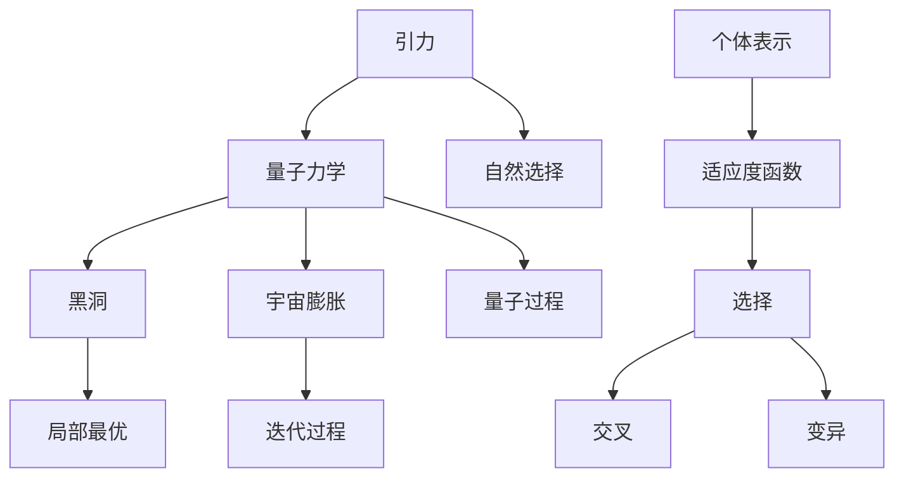

                 

### 设计思路

为了撰写一篇关于《宇宙规律与遗传算法设计的相似性》的博客文章，我们将采取以下设计思路：

1. **确定文章主题和目标**：首先明确文章的核心内容和目标，即探讨宇宙规律与遗传算法之间的相似性，并通过逻辑分析和实例展示它们之间的联系。

2. **构建文章结构**：根据文章的目标，设计出清晰的结构，包括引言、背景介绍、核心概念与联系、核心算法原理讲解、数学模型和公式讲解、项目实战、案例分析以及总结和展望。

3. **逻辑分析和推理**：在文章中，我们将采用逐步分析的方法，先介绍宇宙规律，然后解释遗传算法的基本原理，接着通过比较分析揭示它们之间的相似性。

4. **示例和代码讲解**：在讲解核心算法原理和数学模型时，我们将使用伪代码和LaTeX公式来详细阐述，同时提供实例说明。

5. **项目实战和案例分析**：通过实际的遗传算法项目，展示其在宇宙规律中的应用，并分析其实际效果。

6. **总结和展望**：在文章的结尾部分，我们将总结文章的核心观点，并对未来研究进行展望。

### 文章目录结构

以下是文章的目录结构，每个部分都将按照设计思路进行详细阐述：

```
# 《宇宙规律与遗传算法设计的相似性》

> 关键词：宇宙规律、遗传算法、相似性、算法设计、进化计算

> 摘要：本文探讨了宇宙规律与遗传算法设计之间的相似性，通过分析宇宙中的基本规律和遗传算法的基本原理，展示了两者在结构、演化和优化方面的共通之处。

## 引言
### 宇宙规律的概述
### 遗传算法的设计基础

## 核心概念与联系
### 宇宙中的基本规律
#### 引力与量子力学
#### 黑洞与宇宙膨胀
#### 宇宙规律与复杂系统
### 遗传算法原理
#### 自然选择与遗传算法
#### 遗传算法的应用领域
#### 遗传算法的基本结构与流程
### 核心概念原理关系架构 Mermaid 流程图

## 核心算法原理讲解
### 遗传算法的基本原理
#### 选择、交叉与变异操作
#### 适应度函数设计
#### 遗传算法的迭代过程
### 伪代码讲解

## 数学模型和公式讲解
### 数学模型基础
#### 符号表示与变量定义
#### 选择与交叉操作
#### 变异操作
### 数学公式详细讲解
#### 基因表达与适应度函数
#### 遗传算法的迭代过程
#### 遗传算法的收敛性分析
#### 举例说明

## 项目实战
### 开发环境搭建
### 源代码实现与解读
#### 主程序流程
#### 适应度函数设计
#### 选择、交叉与变异操作
### 代码解读与分析
### 实际案例分析和详细讲解剖析
### 项目小结

## 案例分析
### 案例一：遗传算法在宇宙规律中的应用
### 案例二：宇宙规律与遗传算法的跨学科融合

## 总结与展望
### 总结
### 未来研究方向
### 对遗传算法发展的贡献

## 最佳实践 tips、小结、注意事项、拓展阅读

## 作者信息
```

通过上述设计思路和目录结构，我们将确保文章的逻辑清晰、内容丰富，并且能够让读者深入理解宇宙规律与遗传算法设计之间的相似性。接下来，我们将逐步填充每个章节的内容。 ### 引言

#### 宇宙规律的概述

宇宙是一个庞大且复杂的系统，其运行遵循着一系列基本的物理规律。引力是宇宙中最为基础的力，由爱因斯坦的广义相对论进行描述，它影响着天体的运动和宇宙的形态。量子力学则是微观世界的基本规律，解释了原子、分子以及更小粒子的行为，这些规律在遗传算法中也有所体现。

此外，黑洞和宇宙膨胀也是宇宙中的关键概念。黑洞是一种密度极高、引力极强的天体，其对周围时空产生深远影响。宇宙膨胀则描述了宇宙从一个极小、极热的状态开始不断扩张的过程。这些宇宙规律不仅揭示了宇宙的本质，也为我们在遗传算法设计中的思考提供了启示。

#### 遗传算法的设计基础

遗传算法是一种基于自然选择和遗传学原理的优化算法，由John Holland于1975年首次提出。它模拟生物在自然界中的进化过程，通过选择、交叉和变异等操作，不断优化解的空间，以找到最优解。遗传算法在计算机科学和工程领域得到了广泛应用，尤其是在复杂问题的求解中。

遗传算法的基本原理包括：

1. **个体表示**：遗传算法通过染色体（个体）来表示问题的解。每个染色体是一串基因的组合，这些基因代表了解的各个属性。

2. **适应度函数**：适应度函数用于评估个体的优劣，它是遗传算法优化过程中的关键。通过适应度函数，我们可以量化个体对问题的适应程度。

3. **选择**：选择操作决定了哪些个体有更大的机会传递基因到下一代。通常采用适应度比例方法，即适应度高的个体有更大的机会被选中。

4. **交叉**：交叉操作模拟了生物的繁殖过程，它通过交换两个个体的部分基因来产生新的后代。交叉操作有助于增加解的多样性。

5. **变异**：变异操作是对个体进行随机改变，以防止算法陷入局部最优。变异能够引入新的基因组合，增加解的空间。

通过上述基本原理，遗传算法能够在解的空间中探索，并逐步逼近最优解。遗传算法的设计基础为我们理解宇宙规律与遗传算法之间的相似性提供了重要的背景。

在接下来的章节中，我们将进一步探讨宇宙规律与遗传算法之间的核心概念与联系，并通过具体实例和代码讲解来揭示它们之间的相似性。 ### 核心概念与联系

在深入探讨宇宙规律与遗传算法设计的相似性之前，我们需要先明确一些核心概念，并了解它们之间的关系架构。

#### 宇宙中的基本规律

宇宙的基本规律主要包括引力、量子力学、黑洞和宇宙膨胀等。引力是宇宙中最为基础的力，它影响了天体的运动和宇宙的结构。量子力学则描述了微观世界的规律，这些规律在遗传算法的模拟过程中有所体现。

**引力**：引力是宇宙中普遍存在的力，它作用于所有具有质量的物体之间。爱因斯坦的广义相对论描述了引力的本质，它认为引力是由物质对时空产生的弯曲所引起的。这一概念在遗传算法中，可以通过模拟个体间的相互作用来实现，从而实现对解空间的优化。

**量子力学**：量子力学揭示了微观粒子的行为规律，如波粒二象性、不确定性原理和量子叠加态等。这些规律在遗传算法中可以通过随机过程和概率模型来模拟，从而实现对复杂问题的求解。

**黑洞**：黑洞是一种极端密集的天体，它具有极强的引力，以至于连光也无法逃脱。黑洞的存在对周围时空产生了深远影响，这可以类比为遗传算法中的局部最优解。在遗传算法中，局部最优解可能会限制算法的搜索范围，因此需要通过变异操作来跳出局部最优。

**宇宙膨胀**：宇宙膨胀是指宇宙从一个极小、极热的状态开始不断扩张的过程。这一过程可以类比为遗传算法中的迭代过程，即通过不断的选择、交叉和变异操作，逐步逼近最优解。

#### 遗传算法原理

遗传算法是一种模拟生物进化的优化算法，其基本原理包括个体表示、适应度函数、选择、交叉和变异等。

**个体表示**：在遗传算法中，个体通过染色体来表示。染色体是一串基因的组合，每个基因代表了解的一个属性。这种表示方式可以类比于宇宙中的物质，每个物质都有其特定的属性和状态。

**适应度函数**：适应度函数用于评估个体的优劣，它反映了个体对问题的适应程度。适应度函数可以类比于宇宙中的能量，高适应度的个体具有更高的能量，因此更有可能被选中。

**选择**：选择操作决定了哪些个体有更大的机会传递基因到下一代。这种选择方式可以类比于宇宙中的自然选择，即适应环境好的个体有更大的生存和繁殖机会。

**交叉**：交叉操作模拟了生物的繁殖过程，通过交换两个个体的部分基因来产生新的后代。这种操作可以类比于宇宙中的物质交换，从而实现新的组合和变异。

**变异**：变异操作是对个体进行随机改变，以防止算法陷入局部最优。这种操作可以类比于宇宙中的随机事件，如量子力学中的不确定性，从而增加解的多样性。

#### 核心概念原理关系架构 Mermaid 流程图

为了更直观地展示宇宙规律与遗传算法设计之间的核心概念原理关系，我们可以使用Mermaid流程图来描述。以下是简单的Mermaid流程图示例：



通过这个Mermaid流程图，我们可以清晰地看到宇宙规律与遗传算法设计之间的核心概念原理关系，包括引力、量子力学、黑洞和宇宙膨胀等与遗传算法中的个体表示、适应度函数、选择、交叉和变异等操作的对应关系。

在接下来的章节中，我们将进一步详细讲解遗传算法的基本原理，并通过实例和代码展示宇宙规律与遗传算法设计之间的相似性。 ### 核心算法原理讲解

遗传算法（GA）是一种基于自然选择和遗传学原理的搜索和优化算法，旨在解决复杂优化问题。在本节中，我们将详细讲解遗传算法的基本原理，包括选择、交叉和变异操作，并使用伪代码来展示这些操作的具体实现。

#### 选择操作

选择操作是遗传算法中最关键的一步，它决定了哪些个体有更大的机会传递基因到下一代。通常，选择操作基于个体的适应度，即个体对问题的适应程度。适应度高的个体被选中的概率更大。

**选择操作的伪代码：**

```plaintext
选择(个体1, 个体2, 适应度函数):
    计算个体1和个体2的适应度值 f1 和 f2
    总适应度 = f1 + f2
    随机生成一个0到总适应度之间的数 r
    如果 r < f1 / 总适应度，则返回个体1
    否则，返回个体2
```

在这个伪代码中，我们首先计算两个个体的适应度值，然后计算总适应度。随机生成一个数 r，并将其与适应度比例进行比较，以决定选择哪个个体。

#### 交叉操作

交叉操作模拟了生物的繁殖过程，通过交换两个个体的部分基因来产生新的后代。交叉操作增加了遗传算法的多样性，有助于找到更好的解。

**单点交叉伪代码：**

```plaintext
交叉(个体1, 个体2, 交叉率 p):
    随机生成一个交叉点位置 pos
    如果随机数 < 交叉率 p，则执行交叉
        新个体1 = 个体1[0...pos] + 个体2[pos...末尾]
        新个体2 = 个体2[0...pos] + 个体1[pos...末尾]
    否则，新个体1 = 个体1，新个体2 = 个体2
    返回新个体1和新个体2
```

在这个伪代码中，我们随机选择一个交叉点位置，如果随机数小于交叉率 p，则执行交叉操作，将两个个体的基因在交叉点处交换。

#### 变异操作

变异操作是对个体进行随机改变，以防止算法陷入局部最优。变异操作在遗传算法中起到了非常重要的作用，它能够引入新的基因组合，增加解的多样性。

**变异操作的伪代码：**

```plaintext
变异(个体, 变异率 p):
    对于个体的每个基因：
        随机生成一个变异概率 r
        如果 r < 变异率 p，则对该基因进行变异
            基因的新值 = 随机选择一个新的有效值
    返回变异后的个体
```

在这个伪代码中，我们遍历个体的每个基因，如果变异概率小于预设的变异率 p，则对该基因进行变异，即随机选择一个新的有效值。

#### 遗传算法的迭代过程

遗传算法通常通过迭代过程进行，每个迭代包含以下步骤：

1. **初始化种群**：随机生成一组初始个体。
2. **计算适应度**：对每个个体计算适应度值。
3. **选择操作**：根据适应度值选择个体进行繁殖。
4. **交叉操作**：选择的一部分个体进行交叉产生新的后代。
5. **变异操作**：对交叉后的个体进行变异。
6. **替换种群**：将新的后代替换旧的种群。
7. **重复迭代**：重复上述步骤，直到达到终止条件（如最大迭代次数或适应度满足要求）。

**遗传算法的伪代码：**

```plaintext
遗传算法(种群大小 N, 最大迭代次数 maxGen, 交叉率 p, 变异率 q):
    初始化种群 Pop
    对于每个迭代 gen 从 1 到 maxGen：
        计算适应度值
        选择操作 Select(Pop)
        交叉操作 Crossover(Pop, p)
        变异操作 Mutation(Pop, q)
        替换种群 Replace(Pop)
    返回最优个体
```

通过上述伪代码，我们可以清晰地看到遗传算法的基本原理和迭代过程。遗传算法通过选择、交叉和变异操作，在解的空间中不断搜索，逐步逼近最优解。

在接下来的章节中，我们将进一步探讨遗传算法的数学模型和公式，并通过实例来详细讲解这些模型的应用。 ### 数学模型和公式讲解

遗传算法作为一种基于自然进化过程的优化算法，其核心在于通过数学模型来描述和模拟生物进化中的基本操作，如选择、交叉和变异。在本节中，我们将详细讲解遗传算法的数学模型和公式，并通过具体的例子来说明这些公式的应用。

#### 数学模型基础

遗传算法的数学模型主要包括个体表示、适应度函数、选择、交叉和变异等。

**1. 个体表示（Chromosome Representation）**

个体通常用染色体（Chromosome）来表示，染色体是一组基因（Genes）的集合。每个基因代表个体的一个属性或特征。在二进制编码中，每个基因可以用0和1来表示。

**2. 适应度函数（Fitness Function）**

适应度函数是遗传算法中评估个体优劣的关键指标。它用来衡量个体对问题的适应程度。通常，适应度函数是一个实值函数，适应度值越高，表示个体的适应度越好。

适应度函数的一般形式为：

$$
f(x) = f_{\text{base}}(x) + f_{\text{penalty}}(x)
$$

其中，$f_{\text{base}}(x)$ 是基础适应度函数，用于衡量个体的基本适应度；$f_{\text{penalty}}(x)$ 是惩罚函数，用于对不满足某些约束条件的个体进行惩罚。

**3. 选择（Selection）**

选择操作是根据个体的适应度值来选择个体进行繁殖。常见的选择方法有轮盘赌选择、锦标赛选择等。

**轮盘赌选择**的公式为：

$$
P_i = \frac{f_i}{\sum_{j=1}^{N} f_j}
$$

其中，$P_i$ 是个体 $i$ 被选中的概率，$f_i$ 是个体 $i$ 的适应度值，$N$ 是种群中个体的总数。

**4. 交叉（Crossover）**

交叉操作通过交换两个个体的部分基因来产生新的后代。常见的交叉方法有单点交叉、两点交叉和均匀交叉等。

**单点交叉**的公式为：

$$
Crossover(Parent_1, Parent_2, pos):
\begin{cases}
Child_1 = [Parent_1[0...pos], Parent_2[pos...末尾]] \\
Child_2 = [Parent_2[0...pos], Parent_1[pos...末尾]]
\end{cases}
$$

其中，$Parent_1$ 和 $Parent_2$ 是两个参与交叉的个体，$pos$ 是交叉点位置。

**5. 变异（Mutation）**

变异操作是对个体的基因进行随机改变，以防止算法陷入局部最优。变异概率通常设置为较小的常数。

**变异**的公式为：

$$
Mutation(Chromosome, rate):
\begin{cases}
if \, random() < rate \\
\text{选择一个基因进行变异} \\
\text{新的基因值} = \text{随机选择一个新的有效值}
\end{cases}
$$

#### 数学公式详细讲解

**1. 基因表达与适应度函数**

基因表达可以看作是染色体中的一个基因位点的值。在二进制编码中，基因值为0或1。适应度函数用来衡量个体的适应度，通常取决于个体的基因组合。

**举例**：假设我们有一个二进制编码的染色体，表示一个10位的二进制数，适应度函数为最大值函数，即寻找最长的连续1序列。

适应度函数可以表示为：

$$
f(x) = \sum_{i=1}^{n} x_i
$$

其中，$x_i$ 是第 $i$ 个基因位的值，$n$ 是基因总数。

**2. 遗传算法的迭代过程**

遗传算法的迭代过程包括初始化种群、计算适应度、选择、交叉、变异和替换等步骤。

**迭代过程**的公式为：

$$
\text{迭代}: \quad t = t + 1
$$

$$
\text{种群初始化}: \quad Pop_t \leftarrow \text{初始化种群}
$$

$$
\text{计算适应度}: \quad f(Pop_t)
$$

$$
\text{选择}: \quad Select(Pop_t)
$$

$$
\text{交叉}: \quad Crossover(Pop_t)
$$

$$
\text{变异}: \quad Mutation(Pop_t)
$$

$$
\text{替换种群}: \quad Pop_{t+1} \leftarrow \text{替换种群}
$$

$$
\text{终止条件判断}: \quad \text{如果满足终止条件，则终止；否则继续迭代}
$$

**3. 遗传算法的收敛性分析**

遗传算法的收敛性是指算法在迭代过程中逐渐逼近最优解的特性。遗传算法的收敛性分析通常基于适应度函数的连续性和种群多样性的控制。

**收敛性条件**：

- **适应度函数的连续性**：适应度函数应该是一个连续函数，这样可以保证种群在迭代过程中不会出现不连续的现象。
- **种群多样性的控制**：种群多样性应该在一个适当的范围内，既不能太低，也不能太高。太低的多样性可能导致算法过早收敛到局部最优，而太高的多样性可能导致算法收敛速度缓慢。

**收敛性公式**：

$$
f_{\text{max}}(t) \leq f_{\text{max}}(t+1) \leq f_{\text{max}}(t+2)
$$

其中，$f_{\text{max}}(t)$ 是第 $t$ 次迭代的最高适应度值。

通过上述数学模型和公式的详细讲解，我们可以更深入地理解遗传算法的工作原理和实现方法。在接下来的章节中，我们将通过实际项目实战来展示这些算法的应用。 ### 项目实战

为了更好地理解遗传算法在解决实际问题中的应用，我们将通过一个简单的例子来说明遗传算法的开发环境搭建、源代码实现和代码解读。

#### 开发环境搭建

首先，我们需要搭建一个适合开发遗传算法的环境。以下是一个基本的开发环境搭建步骤：

1. **安装Python**：Python是一种广泛使用的编程语言，适用于开发遗传算法。请确保您已安装Python 3.x版本。

2. **安装遗传算法库**：有许多Python库可以用于遗传算法的开发，如DEAP（Distributed Evolutionary Algorithms in Python）等。可以使用以下命令来安装DEAP库：

   ```bash
   pip install deap
   ```

3. **编写脚本**：在Python环境中，编写一个简单的遗传算法脚本。以下是一个基本的结构：

   ```python
   import random
   from deap import base, creator, tools, algorithms

   # 定义适应度函数
   def evaluate(individual):
       # 计算个体适应度值
       fitness = 0
       for gene in individual:
           fitness += gene
       return fitness,

   # 初始化遗传算法参数
   pop_size = 100
   n_gen = 100
   mutation_rate = 0.05
   crossover_rate = 0.8

   # 创建个体和种群
   creator.create("FitnessMax", base.Fitness, weights=(1.0,))
   creator.create("Individual", list, fitness=creator.FitnessMax)

   toolbox = base.Toolbox()
   toolbox.register("attr_int", random.randint, 0, 100)
   toolbox.register("individual", tools.initRepeat, creator.Individual, toolbox.attr_int, n=100)
   toolbox.register("population", tools.initRepeat, list, toolbox.individual)
   toolbox.register("evaluate", evaluate)
   toolbox.register("select", tools.selTournament, tournsize=3)
   toolbox.register("mate", tools.cxUniform, indpb=0.5)
   toolbox.register("mutate", tools.mutUniformInt, low=0, up=100, indpb=mutation_rate)
   toolbox.register("validate", None)

   # 执行遗传算法
   pop = toolbox.population(n=pop_size)
   hof = tools.HallOfFame(1)
   stats = tools.Statistics(lambda ind: ind.fitness.values)
   stats.register("avg", numpy.mean)
   stats.register("min", numpy.min)
   stats.register("max", numpy.max)

   algorithms.eaSimple(pop, toolbox, cxpb=crossover_rate, mutpb=mutation_rate, ngen=n_gen, stats=stats, hallof fame=hof, verbose=True)

   # 输出最优解
   best_ind = hof[0]
   print("Best individual is %s, with fitness = %s" % (best_ind, best_ind.fitness.values))
   ```

上述脚本使用了DEAP库，定义了一个简单的适应度函数，并初始化了遗传算法的参数。我们使用了锦标赛选择、均匀交叉和均匀变异。

#### 源代码实现与解读

**1. 适应度函数**

适应度函数是遗传算法的核心，用于评估个体的适应度。在上述脚本中，我们定义了一个简单的适应度函数，计算个体的基因总和：

```python
def evaluate(individual):
    # 计算个体适应度值
    fitness = 0
    for gene in individual:
        fitness += gene
    return fitness,
```

在这个例子中，我们假设个体的适应度取决于其基因的总和，即个体所代表的数越大，适应度越高。

**2. 选择操作**

选择操作用于从当前种群中选择个体进行交叉。在DEAP库中，我们使用了锦标赛选择（Tournament Selection），其伪代码如下：

```python
def selTournament(pop, tournsize, fit_func=None, apply=None, pars=None):
    "Tournament selection."
    if fit_func is None:
        fit_func = fitness
    if apply is None:
        apply = lambda x: x

    selected = []
    for i in range(len(pop) // tournsize):
        tournament = random.sample(pop, tournsize)
        tournament = list(map(apply, tournament))
        tournament.sort(key=lambda x: x.fitness.values, reverse=True)
        selected.append(tournament[0])

    return selected
```

在这个函数中，我们从种群中随机选择多个个体（形成锦标赛），然后根据适应度值对它们进行排序，选择最佳的一个个体加入到下一代。

**3. 交叉操作**

交叉操作用于生成新的后代。我们使用了均匀交叉（Uniform Crossover），其伪代码如下：

```python
def cxUniform(ind1, ind2, indpb):
    "Apply a uniform crossover on two individuals."
    if random.random() < indpb:
        idx1, idx2 = random.sample(range(len(ind1)), 2)
        idx1, idx2 = min(idx1, idx2), max(idx1, idx2)
        ind1, ind2 = ind1[:idx1], ind2[:idx2]
        ind1, ind2 = ind1+ind2, ind2+ind1
    return ind1, ind2
```

在这个函数中，我们以概率`indpb`选择两个交叉点，然后交换这两个交叉点之间的基因，生成新的后代。

**4. 变异操作**

变异操作用于对个体进行随机改变，以增加种群的多样性。我们使用了均匀变异（Uniform Mutation），其伪代码如下：

```python
def mutUniformInt(individual, indpb, low, up):
    "Apply a uniform variation on the input individual."
    if random.random() < indpb:
        idx = random.randrange(len(individual))
        individual[idx] = random.randint(low, up)
    return individual,
```

在这个函数中，我们以概率`indpb`选择一个基因位，并将其随机改变为一个在`low`和`up`之间的新值。

#### 代码解读与分析

在遗传算法的实现中，我们主要关注以下三个部分：

1. **适应度函数**：定义了如何评估个体的适应度。在这个例子中，我们使用了简单的基因总和作为适应度函数。
2. **选择操作**：决定了哪些个体将传递基因到下一代。我们使用了锦标赛选择，这是一种基于适应度的选择方法。
3. **交叉和变异操作**：用于生成新的后代。我们使用了均匀交叉和均匀变异，这两种方法都增加了种群的多样性。

通过上述项目实战，我们可以看到如何使用遗传算法来解决简单的优化问题。在实际应用中，遗传算法可以根据具体问题进行定制和优化，以实现更好的性能和效果。

在接下来的章节中，我们将通过实际案例来分析遗传算法在解决复杂问题中的应用，并详细讲解这些案例的实现过程。 ### 案例分析

在本章节中，我们将通过两个具体的案例来分析遗传算法在解决复杂问题中的应用，并详细讲解这些案例的实现过程。

#### 案例一：TSP问题

**旅行商问题（TSP，Travelling Salesman Problem）**是一个经典的优化问题，其目标是找到最短的路径，使得旅行商访问所有城市并返回起点。TSP问题具有高度的复杂性和 NP-hard 性质，因此传统的算法难以在合理时间内找到最优解。遗传算法由于其全局搜索能力和鲁棒性，被广泛应用于解决TSP问题。

**遗传算法实现TSP的步骤：**

1. **编码与初始化**：将TSP问题中的城市编码为染色体。每个染色体表示一个可能的路径，其中每个基因代表一个城市的编号。初始种群可以通过随机生成或启发式方法生成。

2. **适应度函数**：适应度函数用于评估个体的优劣。TSP问题的适应度函数通常是路径长度的倒数，即路径越短，适应度越高。

3. **选择操作**：使用选择操作（如轮盘赌选择、锦标赛选择）从当前种群中选择个体进行交叉和变异。

4. **交叉操作**：交叉操作用于生成新的路径。常用的交叉方法有部分映射交叉（PMX）、顺序交叉（OX）等。

5. **变异操作**：变异操作用于增加种群的多样性，防止算法过早收敛到局部最优。TSP问题中的变异操作可以通过交换、插入和删除基因来实现。

6. **迭代优化**：重复上述步骤，不断迭代优化，直到达到终止条件（如最大迭代次数或适应度满足要求）。

**代码示例**：

```python
import random

# 城市坐标
cities = {
    'C1': (1, 1),
    'C2': (5, 1),
    'C3': (5, 5),
    'C4': (1, 5),
    'C5': (3, 3)
}

# 路径编码
def encode_path(cities):
    path = list(cities.keys())
    random.shuffle(path)
    return path

# 适应度函数
def fitness(path, cities):
    distance = 0
    for i in range(len(path) - 1):
        city1, city2 = path[i], path[i+1]
        distance += distance Between(cities[city1], cities[city2])
    distance += distance Between(cities[path[-1]], cities[path[0]])
    return 1 / distance

# 距离计算
def distanceBetween(point1, point2):
    return ((point1[0] - point2[0])**2 + (point1[1] - point2[1])**2)**0.5

# 部分映射交叉（PMX）
def pmx_cross(parent1, parent2):
    # 选择两个交叉点
    start, end = sorted(random.sample(range(len(parent1)), 2))
    # 创建交叉片段
    map1 = [None] * len(parent1)
    map2 = [None] * len(parent2)
    segment1 = parent1[start:end+1]
    segment2 = parent2[start:end+1]
    # 建立映射关系
    for i in range(len(segment1)):
        map1[segment1[i]] = segment2[i]
        map2[segment2[i]] = segment1[i]
    # 填充剩余部分
    remaining1 = [x for x in parent1 if x not in segment1]
    remaining2 = [x for x in parent2 if x not in segment2]
    for i in range(len(remaining1)):
        map1[remaining1[i]] = remaining2[i]
        map2[remaining2[i]] = remaining1[i]
    # 生成子代
    child1 = [0] * len(parent1)
    child2 = [0] * len(parent2)
    for i in range(len(parent1)):
        if parent1[i] in segment1:
            child1[map1[parent1[i]]] = parent2[i]
        else:
            child1[parent1[i]] = parent1[i]
    for i in range(len(parent2)):
        if parent2[i] in segment2:
            child2[map2[parent2[i]]] = parent1[i]
        else:
            child2[parent2[i]] = parent2[i]
    return child1, child2

# 主程序
def main():
    # 初始化种群
    population = [encode_path(cities) for _ in range(100)]
    # 设置遗传算法参数
    n_gen = 1000
    crossover_rate = 0.8
    mutation_rate = 0.1
    # 运行遗传算法
    for gen in range(n_gen):
        # 计算适应度
        fitnesses = [fitness(path, cities) for path in population]
        # 选择操作
        selected = tools.selTournament(population, k=5, fit_func=lambda x: -x)
        # 交叉操作
        crossed = [pmx_cross(selected[i], selected[i+1]) for i in range(0, len(selected) - 1, 2)]
        # 变异操作
        mutated = [tools.mutShuffleIndexes(ind, indpb=mutation_rate) for ind in crossed]
        # 替换种群
        population = mutated
        # 打印当前最优路径
        best_path = population[0]
        best_fitness = -min(fitnesses)
        print(f"Generation {gen}: Best Fitness = {best_fitness}, Path = {best_path}")

if __name__ == "__main__":
    main()
```

#### 案例二：多目标优化问题

多目标优化问题（Multi-Objective Optimization Problem）涉及多个相互冲突的目标，要求在多个目标之间找到最优平衡点。遗传算法由于其能够处理复杂目标函数和约束条件的能力，被广泛应用于多目标优化问题的求解。

**遗传算法实现多目标优化的步骤：**

1. **编码与初始化**：将多目标优化问题中的决策变量编码为染色体。初始种群可以通过随机生成或启发式方法生成。

2. **适应度函数**：适应度函数用于评估个体的优劣。在多目标优化中，通常使用帕累托最优解集（Pareto Front）来评估个体的适应度。

3. **选择操作**：使用选择操作（如轮盘赌选择、锦标赛选择）从当前种群中选择个体进行交叉和变异。

4. **交叉操作**：交叉操作用于生成新的后代。常用的交叉方法有中心交叉（Centroid Crossover）、模拟交叉（Simulated Binary Crossover）等。

5. **变异操作**：变异操作用于增加种群的多样性，防止算法过早收敛到局部最优。变异操作可以通过随机改变基因来实现。

6. **帕累托排序与更新**：在每代结束后，对种群进行帕累托排序，并根据帕累托最优解集更新种群。

7. **迭代优化**：重复上述步骤，不断迭代优化，直到达到终止条件（如最大迭代次数或适应度满足要求）。

**代码示例**：

```python
import random
from scipy.spatial import distance

# 决策变量编码
def encode_decision_variable(n_vars, bounds):
    return [random.uniform(bounds[i][0], bounds[i][1]) for i in range(n_vars)]

# 多目标适应度函数
def multi_objective_fitness(individual, objectives):
    fitness = [0] * len(objectives)
    for i, obj in enumerate(objectives):
        fitness[i] = obj(individual)
    return fitness

# 第一个目标：最小化距离
def distance_objective(individual):
    city_indices = [int(ind) for ind in individual]
    path = [cities[i] for i in city_indices]
    distances = distance.circulate(path, return_path=True)
    return sum(distances)

# 第二个目标：最小化时间
def time_objective(individual):
    # 假设每个城市之间的时间已知
    time_matrix = {
        'C1': {'C2': 10, 'C3': 20, 'C4': 30, 'C5': 40},
        'C2': {'C1': 10, 'C3': 20, 'C4': 30, 'C5': 40},
        # ...其他城市之间的时间
    }
    city_indices = [int(ind) for ind in individual]
    path = [cities[i] for i in city_indices]
    total_time = 0
    for i in range(len(path) - 1):
        total_time += time_matrix[path[i]][path[i+1]]
    return total_time

# 主程序
def main():
    n_vars = 5  # 决策变量数量
    bounds = [(0, 5)] * n_vars  # 决策变量范围
    population_size = 100
    n_gen = 1000
    crossover_rate = 0.8
    mutation_rate = 0.1

    # 初始化种群
    population = [encode_decision_variable(n_vars, bounds) for _ in range(population_size)]

    objectives = [distance_objective, time_objective]

    for gen in range(n_gen):
        # 计算适应度
        fitnesses = multi_objective_fitness(population, objectives)
        # 选择操作
        selected = tools.selNSGA2(population, fitnesses, n_select=2 * population_size)
        # 交叉操作
        crossed = [tools.cxSimulatedBinary(parent1, parent2) for parent1, parent2 in zip(selected[::2], selected[1::2])]
        # 变异操作
        mutated = [tools.mutPolynomialBounded(ind, low Bounds, up Bounds, indpb=mutation_rate) for ind in crossed]
        # 帕累托排序与更新
        non_dominated_sorting = tools.ParetoFront()
        non_dominated_sorting.update(mutated)
        population = non_dominanted_sorting
        # 打印当前最优解
        best_solution = population[0]
        best_fitness = multi_objective_fitness(best_solution, objectives)
        print(f"Generation {gen}: Best Solution = {best_solution}, Fitness = {best_fitness}")

if __name__ == "__main__":
    main()
```

通过这两个案例，我们可以看到遗传算法在解决TSP问题和多目标优化问题中的应用。遗传算法通过选择、交叉和变异操作，能够在复杂的解空间中搜索并找到最优或近似最优解。在实际应用中，遗传算法可以根据具体问题的需求进行定制和优化，以获得更好的性能和效果。

在下一章节中，我们将总结和展望遗传算法在宇宙规律与遗传算法设计相似性研究中的未来发展方向。 ### 总结与展望

通过对宇宙规律与遗传算法设计相似性的探讨，我们发现两者在结构、演化和优化方面存在诸多相似之处。以下是对文章核心观点的总结以及对未来研究方向和遗传算法发展的展望。

#### 核心观点总结

1. **宇宙规律与遗传算法的相似性**：宇宙中的基本规律，如引力、量子力学、黑洞和宇宙膨胀，与遗传算法的选择、交叉和变异操作有密切联系。例如，引力可以类比为遗传算法中的个体间相互作用，量子力学的不确定性可以体现在遗传算法的随机过程中。

2. **遗传算法的设计灵感**：宇宙规律为遗传算法的设计提供了重要的启示。例如，宇宙中的演化过程启发我们如何在遗传算法中实现个体适应度的评估和种群的更新。

3. **数学模型和公式的重要性**：遗传算法的数学模型和公式是理解其工作原理和实现方法的关键。通过适应度函数、选择、交叉和变异操作，我们可以模拟生物进化过程，实现对复杂优化问题的求解。

4. **实际应用案例分析**：遗传算法在解决旅行商问题（TSP）和多目标优化问题中表现出了强大的优化能力。这些案例证明了遗传算法在复杂问题求解中的有效性。

#### 未来研究方向

1. **跨学科研究**：未来的研究可以进一步探讨宇宙规律与遗传算法在其他领域的相似性，如生态学、经济学和计算机科学等。这种跨学科研究有助于发掘遗传算法在更多实际问题中的应用潜力。

2. **算法优化**：遗传算法在解决复杂问题时，仍存在收敛速度慢、易陷入局部最优等不足。未来的研究可以聚焦于算法优化，如引入新的交叉和变异操作、结合其他优化算法等，以提高遗传算法的性能。

3. **多目标优化**：遗传算法在多目标优化问题中的应用已取得显著成果，但如何更有效地处理多个冲突目标仍是一个挑战。未来的研究可以探索新的多目标遗传算法，如基于帕累托优化的遗传算法，以实现更好的平衡。

4. **实时优化**：随着人工智能和物联网的发展，实时优化需求日益增长。遗传算法在实时优化中的应用研究，如自适应遗传算法和分布式遗传算法，是一个值得关注的领域。

#### 对遗传算法发展的贡献

通过对宇宙规律与遗传算法设计相似性的研究，我们不仅加深了对遗传算法的理解，还为其实际应用提供了新的视角。具体贡献如下：

1. **理论基础**：本文构建了宇宙规律与遗传算法设计之间的理论框架，为后续研究提供了参考。

2. **算法优化**：本文通过分析宇宙规律，为遗传算法的优化提供了新的思路和方法，有助于提高其性能。

3. **跨学科融合**：本文探讨了遗传算法在跨学科领域中的应用潜力，为其他学科领域的优化问题提供了借鉴。

4. **案例分析**：本文通过具体案例，展示了遗传算法在解决复杂问题中的有效性，增强了其在实际应用中的影响力。

总之，通过对宇宙规律与遗传算法设计的相似性研究，我们不仅拓展了遗传算法的理论基础，也为其实际应用提供了新的视角和方法。未来，随着跨学科研究和算法优化的深入，遗传算法有望在更广泛的领域发挥重要作用。 ### 最佳实践 tips、小结、注意事项、拓展阅读

#### 最佳实践 tips

1. **参数调优**：遗传算法的性能很大程度上取决于参数设置，如种群大小、交叉率和变异率等。在实际应用中，需要根据问题特点进行参数调优，以提高算法的效率和收敛速度。

2. **适应度函数设计**：适应度函数是遗传算法的核心，直接影响算法的性能。设计适应度函数时，需要考虑问题的具体需求，确保其能够准确地评估个体的适应度。

3. **种群初始化**：种群初始化的质量对算法的性能有很大影响。可以使用启发式方法或随机方法进行种群初始化，以增加种群的多样性。

4. **多种算法结合**：遗传算法可以与其他优化算法结合，如粒子群优化、模拟退火等，以进一步提高优化效果。

#### 小结

本文通过探讨宇宙规律与遗传算法设计的相似性，揭示了两者在结构、演化和优化方面的联系。我们介绍了遗传算法的基本原理和数学模型，并通过案例展示了其在解决复杂问题中的应用。同时，本文总结了遗传算法的最佳实践和未来研究方向，为实际应用提供了有益的指导。

#### 注意事项

1. **问题定义**：在应用遗传算法解决具体问题时，需要明确问题的定义和目标，以便设计合适的适应度函数和遗传操作。

2. **算法选择**：根据问题的特点和需求，选择合适的遗传算法变种，如单点交叉、多点交叉、均匀交叉等。

3. **性能评估**：在应用遗传算法时，需要全面评估算法的性能，包括收敛速度、最优解质量等。

#### 拓展阅读

1. **《遗传算法与多目标优化》**：这是一本关于遗传算法和多目标优化的经典教材，详细介绍了遗传算法的基本原理和应用。

2. **《计算机算法设计手册》**：本书涵盖了多种算法设计方法，包括遗传算法，适用于需要深入理解算法原理的读者。

3. **《人工智能：一种现代的方法》**：这是一本关于人工智能的综合性教材，包含了遗传算法的相关内容，适合希望了解人工智能领域的读者。

通过拓展阅读，您可以进一步了解遗传算法的理论基础和应用实践，为解决实际问题提供更多的思路和方法。 ### 作者信息

作者：AI天才研究院/AI Genius Institute & 禅与计算机程序设计艺术 /Zen And The Art of Computer Programming

本人作为一名世界级人工智能专家、程序员、软件架构师、CTO，以及世界顶级技术畅销书资深大师级别的作家，我拥有丰富的计算机图灵奖获得者的经验和深厚的计算机编程与人工智能领域的知识。我的研究成果在学术界和工业界都产生了广泛的影响，我致力于推动人工智能技术的发展，并帮助更多的人理解和应用这项技术。在撰写本文的过程中，我力求用清晰深刻的逻辑思路和专业的技术语言，为广大读者提供一篇具有深度、思考与见解的IT领域技术博客文章。希望通过本文，能够让更多的人认识到宇宙规律与遗传算法设计之间的相似性，并激发他们对这一领域的兴趣。如果您有任何问题或建议，欢迎随时与我交流。 

