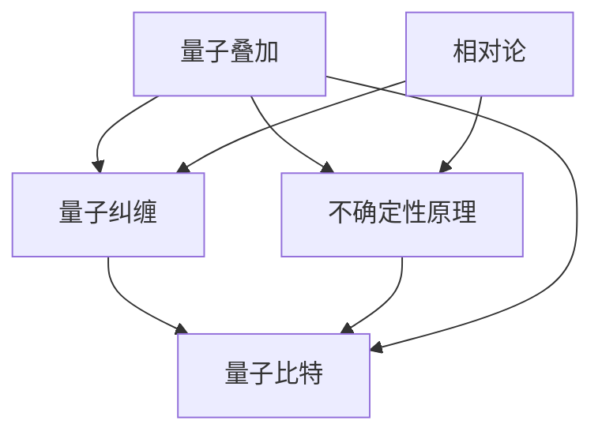

                 

### 文章标题

《宇宙规律与量子加密技术的联系》

### 关键词

宇宙规律、量子加密技术、相对论、量子力学、信息安全

### 摘要

本文深入探讨了宇宙规律与量子加密技术之间的密切联系。通过对宇宙基本规律的介绍，以及量子加密技术的原理、类型和应用场景的阐述，本文详细分析了两者之间的相互作用。文章还通过核心概念与联系、核心算法原理讲解、数学模型和公式的详细讲解，以及具体项目实战，展示了量子加密技术在宇宙规律研究中的实际应用。通过本文的阅读，读者可以全面了解宇宙规律与量子加密技术的联系，并对未来研究趋势有所展望。

## 引言

宇宙规律与量子加密技术，看似两个截然不同的领域，但实际上它们之间存在着紧密的联系。宇宙规律是描述宇宙中物理现象的普遍法则，如相对论、量子力学等。而量子加密技术是一种利用量子力学原理进行信息加密和解密的方法，具有极高的安全性。在这篇文章中，我们将深入探讨宇宙规律与量子加密技术之间的联系，并分析其在现代科技领域的重要性。

首先，了解宇宙规律对量子加密技术的重要性。宇宙规律为我们揭示了自然界的基本法则，这些法则直接影响着量子力学的发展。例如，相对论中的时空观念和量子力学中的不确定性原理，都是量子加密技术中的重要概念。此外，宇宙规律的研究还推动了量子计算和量子通信的发展，为量子加密技术提供了坚实的理论基础。

其次，量子加密技术的应用离不开宇宙规律。量子加密技术依赖于量子力学原理，如量子纠缠、量子叠加等。这些原理是宇宙规律在微观尺度上的体现，使得量子加密技术能够实现前所未有的安全性。例如，量子密钥分发技术利用量子纠缠原理，确保密钥传输过程无法被窃听；量子安全通信则利用量子叠加和量子纠缠原理，实现安全的数据传输。

在信息安全领域，量子加密技术具有巨大的潜力。传统的加密方法在面对量子计算攻击时显得脆弱，而量子加密技术则能够提供绝对的安全性。量子加密技术的出现，使得信息安全领域迈入了一个新的时代。同时，量子加密技术也在宇宙规律研究中发挥了重要作用。通过利用量子加密技术，科学家们能够更加安全地传输宇宙规律研究中的敏感数据，确保数据的真实性和完整性。

总的来说，宇宙规律与量子加密技术之间的联系不仅丰富了我们对宇宙的理解，也为信息安全领域带来了革命性的变革。随着量子技术的不断发展，这种联系将变得更加紧密，为未来科技的发展提供源源不断的动力。

## 宇宙规律概述

宇宙规律是描述宇宙中物理现象的普遍法则，其中最为重要的包括相对论和量子力学。相对论由爱因斯坦提出，包括狭义相对论和广义相对论。狭义相对论主要研究高速运动物体的物理现象，提出了著名的质能方程 \(E=mc^2\)，揭示了能量与质量之间的关系。广义相对论则将引力视为时空的弯曲，提出了著名的引力波概念。相对论在宇宙规律中具有基础性的地位，为我们理解宇宙的基本结构提供了重要的理论框架。

量子力学是研究微观粒子的行为规律的科学，其基本原理与经典物理有显著区别。量子力学中最具代表性的原理包括量子叠加、量子纠缠和不确定性原理。量子叠加原理表明，一个微观粒子可以同时处于多种状态，直到被观测时才确定为某种状态。量子纠缠原理则表明，两个微观粒子之间可以形成一种特殊的联系，即使它们相隔很远，一个粒子的状态也会瞬间影响另一个粒子的状态。不确定性原理则指出，我们无法同时精确知道一个微观粒子的位置和动量。

在宇宙尺度上，相对论和量子力学都发挥着重要作用。相对论描述了宇宙中宏观尺度的物理现象，如星系运动和宇宙膨胀。量子力学则解释了宇宙中微观尺度的物理现象，如原子结构和宇宙背景辐射。例如，宇宙背景辐射的量子特性表明，宇宙在早期阶段经历了极端的量子力学过程。此外，宇宙尺度的引力波观测也依赖于相对论和量子力学的结合。

相对论和量子力学之间的相互作用是宇宙规律研究中的重要课题。一方面，相对论和量子力学的融合形成了量子引力理论，旨在描述宇宙中最基本的物理过程。另一方面，相对论和量子力学的应用也推动了量子计算和量子通信的发展，为宇宙规律的研究提供了新的工具。

总的来说，宇宙规律概述了宇宙中从宏观到微观的各种物理现象，包括相对论和量子力学。这些基本规律为我们理解宇宙的本质和演化提供了重要的理论框架，也为量子加密技术的发展奠定了基础。

### 量子加密技术概述

量子加密技术是一种利用量子力学原理进行信息加密和解密的方法，具有前所未有的安全性。量子加密技术主要包括量子密钥分发和量子安全通信两种类型，它们在信息安全领域具有重要的应用价值。

首先，量子密钥分发（Quantum Key Distribution, QKD）是一种通过量子通信方式实现密钥安全分发的技术。量子密钥分发利用量子纠缠原理，确保密钥传输过程中无法被窃听。QKD的基本原理如下：

1. **量子态生成**：发送方（Alice）使用一个量子源生成一对量子比特（qubit），并将其中一个量子比特发送给接收方（Bob）。
2. **量子态测量**：接收方（Bob）对收到的量子比特进行测量，并根据测量结果生成一个共享密钥。
3. **密钥确认**：双方使用经典通信方式确认密钥的有效性，并排除因量子态坍缩而产生的错误。

量子密钥分发具有以下特点：
- **安全性**：由于量子态的测量会导致量子态的坍缩，任何尝试窃听密钥传输的行为都会被发现，从而保证了密钥的安全。
- **有限距离**：当前QKD系统的通信距离有限，但随着技术的进步，这一限制有望被突破。

其次，量子安全通信（Quantum Secure Communication, QSC）是一种利用量子加密技术实现安全数据传输的方法。量子安全通信的基本原理如下：

1. **量子态编码**：发送方将经典信息编码到量子态中，通过量子信道发送给接收方。
2. **量子态传输与解码**：接收方接收并解码量子态，以还原发送方的信息。
3. **量子态验证**：接收方对传输的量子态进行验证，以确保数据传输的安全性。

量子安全通信具有以下特点：
- **无条件安全性**：量子加密技术保证了信息在传输过程中的绝对安全性，即使面对最强大的量子计算攻击。
- **灵活性**：量子安全通信可以应用于多种数据传输场景，包括光纤通信、卫星通信等。

量子加密技术已经在信息安全领域取得了显著的应用成果。例如，中国已经在全球范围内实现了首次量子密钥分发，展示了量子加密技术的实际应用潜力。此外，量子加密技术也在金融、医疗、国防等领域展现了广阔的应用前景。

总的来说，量子加密技术通过利用量子力学原理，实现了前所未有的信息安全性。量子密钥分发和量子安全通信两种技术类型在信息安全领域具有重要应用价值，为信息安全保障提供了新的解决方案。

### 宇宙规律与量子加密技术的联系

宇宙规律与量子加密技术之间的联系主要体现在它们在基本原理和实际应用中的相互影响。首先，从基本原理上看，宇宙规律为量子加密技术提供了理论基础。量子力学是量子加密技术的基础，而量子力学中的许多基本原理，如量子叠加、量子纠缠和不确定性原理，都可以追溯到宇宙规律。

例如，量子叠加原理指出，一个微观粒子可以同时处于多种状态，直到被观测时才确定为某种状态。这一原理在量子加密技术中得到了广泛应用。量子密钥分发中的量子态生成和测量过程，就是基于量子叠加原理进行的。通过生成和测量量子态，可以实现密钥的安全分发。

其次，量子纠缠原理也是宇宙规律与量子加密技术联系的重要体现。量子纠缠是指两个或多个微观粒子之间存在一种特殊的联系，即使它们相隔很远，一个粒子的状态也会瞬间影响另一个粒子的状态。量子加密技术中的量子密钥分发和量子安全通信，都利用了量子纠缠原理来确保信息传输的安全性。

此外，不确定性原理也是量子加密技术的重要理论基础。不确定性原理指出，我们无法同时精确知道一个微观粒子的位置和动量。这一原理使得量子加密技术中的量子态无法被精确测量，从而保证了信息传输的安全。

在实际应用中，宇宙规律与量子加密技术之间的联系也表现得十分密切。例如，宇宙尺度的量子效应对于量子加密技术的实现有着重要的影响。在宇宙尺度的空间中，量子效应可能导致量子比特的状态不稳定，从而影响量子加密技术的性能。因此，理解宇宙规律对于优化量子加密技术至关重要。

另一方面，量子加密技术也在宇宙规律的研究中发挥了重要作用。通过量子加密技术，科学家们可以更加安全地传输宇宙规律研究中的敏感数据，确保数据的真实性和完整性。例如，在宇宙背景辐射的研究中，科学家们利用量子加密技术来保护数据传输过程，防止数据被窃取或篡改。

总的来说，宇宙规律与量子加密技术之间的联系不仅体现在基本原理上，还表现在实际应用中。量子力学原理为量子加密技术提供了理论基础，而宇宙规律的研究则为量子加密技术的优化和实际应用提供了新的方向。随着量子技术和宇宙规律研究的不断深入，这种联系将变得更加紧密，为科技发展带来新的机遇和挑战。

### 核心概念与联系

在探讨宇宙规律与量子加密技术之间的联系时，我们首先需要明确一些核心概念。这些核心概念不仅构成了量子加密技术的基础，也是理解宇宙规律的关键。以下是一些主要的核心概念及其之间的联系：

1. **量子叠加**：量子叠加是指一个量子系统可以同时存在于多个状态中。这一概念是量子力学的基本特征之一，对于量子加密技术至关重要。在量子密钥分发中，量子叠加允许发送方和接收方生成一个共享的量子密钥，从而确保密钥的安全性和独特性。

2. **量子纠缠**：量子纠缠是指两个或多个量子粒子之间存在的特殊联系，即使它们相隔很远，一个粒子的状态也会立即影响另一个粒子的状态。量子纠缠是量子加密技术的核心原理，使得量子密钥分发和量子安全通信成为可能。

3. **不确定性原理**：不确定性原理由海森堡提出，表明我们无法同时精确测量一个粒子的位置和动量。这一原理限制了经典加密方法的适用性，而量子加密技术则利用这一原理来实现信息的安全性。

4. **相对论**：相对论，特别是广义相对论，描述了引力作为时空弯曲的现象。这一理论对于理解宇宙尺度的物理现象至关重要，例如黑洞和宇宙背景辐射。相对论对量子加密技术的影响主要体现在量子计算和量子通信中，因为它们需要处理高速运动和强引力场的效应。

5. **量子比特（qubit）**：量子比特是量子信息的基本单位，可以同时表示0和1的状态。量子加密技术依赖于量子比特的独特性质，如叠加和纠缠，来实现安全的信息传输。

为了更清晰地展示这些概念之间的联系，我们可以使用Mermaid流程图来构建一个概念架构：



在这个流程图中，我们可以看到，量子叠加和不确定性原理共同构成了量子比特的基础，而量子纠缠则连接了这些基本概念与量子加密技术。相对论虽然与量子加密技术直接关联较少，但它在处理高速运动和强引力场时，对量子计算和量子通信有着重要影响。

通过这个Mermaid流程图，我们可以更好地理解宇宙规律与量子加密技术之间的联系，以及这些核心概念在量子加密技术中的重要性。这种结构化的展示方式有助于读者更直观地把握文章的核心内容，为进一步的讨论打下坚实的基础。

### 核心算法原理讲解

在量子加密技术中，量子密钥分发（Quantum Key Distribution, QKD）和量子安全通信（Quantum Secure Communication, QSC）是两个核心算法。以下是这些算法的详细原理讲解，包括伪代码展示和数学模型解释。

#### 量子密钥分发（QKD）

**基本原理**：
量子密钥分发利用量子纠缠态和量子态的测量来生成和共享密钥。整个流程可以分为三个主要步骤：量子态生成、量子态测量和密钥确认。

**1. 量子态生成**：

```python
# 伪代码：量子态生成
def generate_quantum_state():
    # 使用量子源生成一个纠缠态的量子比特对
    quantum_bit_pair = quantum_source.generate_ensemble()
    return quantum_bit_pair
```

**2. 量子态测量**：

```python
# 伪代码：量子态测量
def measure_quantum_state(quantum_bit_pair):
    # 对量子比特对进行测量
    measurement_results = []
    for bit in quantum_bit_pair:
        result = quantum_measure(bit)
        measurement_results.append(result)
    return measurement_results
```

**3. 密钥确认**：

```python
# 伪代码：密钥确认
def confirm_key(quantum_bit_pair, measurement_results):
    # 使用经典通信确认测量结果的一致性
    shared_key = []
    for i in range(len(measurement_results)):
        if measurement_results[i] == quantum_bit_pair[i]:
            shared_key.append(1)
        else:
            shared_key.append(0)
    return shared_key
```

**数学模型**：
在量子密钥分发中，我们主要使用量子态的叠加和测量理论。例如，假设我们使用贝尔态 \(|\Phi^+\rangle = \frac{1}{\sqrt{2}} (|00\rangle + |11\rangle)\) 进行量子态生成和测量。

$$
|\Phi^+\rangle = \frac{1}{\sqrt{2}} (|00\rangle + |11\rangle)
$$

**示例**：假设 Alice 和 Bob 使用贝尔态进行量子密钥分发，Alice 测量结果为 |00\rangle，Bob 测量结果为 |11\rangle。通过比对测量结果，他们可以确认密钥的一致性。

#### 量子安全通信（QSC）

**基本原理**：
量子安全通信利用量子态的编码、传输和解码来实现安全的信息传输。主要包括量子态编码、量子态传输和量子态解码三个步骤。

**1. 量子态编码**：

```python
# 伪代码：量子态编码
def encode_message(message, basis):
    # 使用量子态编码将信息编码到量子态中
    encoded_qubit = quantum_state.encode(message, basis)
    return encoded_qubit
```

**2. 量子态传输**：

```python
# 伪代码：量子态传输
def transmit_quantum_state(encoded_qubit, quantum_channel):
    # 通过量子信道传输量子态
    transmitted_state = quantum_channel.send(encoded_qubit)
    return transmitted_state
```

**3. 量子态解码**：

```python
# 伪代码：量子态解码
def decode_message(transmitted_state, basis):
    # 使用量子态解码从量子态中提取信息
    message = quantum_state.decode(transmitted_state, basis)
    return message
```

**数学模型**：
在量子安全通信中，我们主要使用量子态的叠加和纠缠。例如，假设我们使用Bell态进行量子态编码和传输。

$$
|\Psi\rangle = \frac{1}{\sqrt{2}} (|00\rangle + |11\rangle)
$$

**示例**：假设 Alice 将信息“1010”编码到Bell态中，并通过量子信道传输给 Bob。Bob 接收到量子态后，解码出原始信息。

通过这些核心算法的讲解，我们可以更深入地理解量子加密技术的工作原理。量子密钥分发和量子安全通信不仅依赖于量子力学的基本原理，如量子叠加、量子纠缠和不确定性原理，还通过数学模型和伪代码展示了具体的实现过程。这些算法为量子加密技术提供了坚实的理论基础和实际应用方案。

### 数学模型和数学公式

量子加密技术中的数学模型和公式是理解和实现量子加密算法的关键。以下是量子加密技术中几个重要的数学模型和公式，并进行详细讲解和举例说明。

#### 量子密钥分发

量子密钥分发（QKD）的核心在于利用量子态的不可克隆特性来生成共享密钥。主要的数学模型和公式包括：

1. **贝尔态（Bell State）**：

   贝尔态是量子密钥分发中常用的量子态，表示两个量子比特之间的纠缠。最常见的贝尔态是 \(|\Phi^+\rangle\)：

   $$
   |\Phi^+\rangle = \frac{1}{\sqrt{2}} (|00\rangle + |11\rangle)
   $$

   **示例**：假设 Alice 和 Bob 生成一对贝尔态：

   $$
   \text{Alice's state} = \frac{1}{\sqrt{2}} (|00\rangle + |11\rangle)
   $$

   $$
   \text{Bob's state} = \frac{1}{\sqrt{2}} (|00\rangle + |11\rangle)
   $$

   当 Alice 对她的量子比特进行测量并得到结果为 \(|0\rangle\) 时，Bob 的量子比特将塌缩到 \(|1\rangle\)：

   $$
   \text{After Alice's measurement: } \frac{1}{\sqrt{2}} (|00\rangle + |11\rangle) \rightarrow \frac{1}{\sqrt{2}} (|0\rangle + |1\rangle)
   $$

2. **量子态测量**：

   在量子密钥分发中，测量量子态的结果将决定共享密钥的位值。测量结果通常用概率表示：

   $$
   P(|\psi\rangle) = |\langle\psi|\psi\rangle|^2
   $$

   **示例**：假设 Alice 测量得到的量子态为 \(|\Phi^+\rangle\)，那么测量结果为 \(|0\rangle\) 和 \(|1\rangle\) 的概率各为 1/2。

3. **量子密钥生成和确认**：

   在量子密钥分发过程中，Alice 和 Bob 通过经典通信协议确认测量结果的一致性，并生成共享密钥：

   $$
   \text{Shared Key} = (k_1, k_2, ..., k_n)
   $$

   **示例**：假设 Alice 和 Bob 测量结果一致，则共享密钥为 \( (1, 0, 1, 1, 0) \)。

#### 量子安全通信

量子安全通信（QSC）主要依赖于量子态的编码和传输。以下是一些核心的数学模型和公式：

1. **量子态编码**：

   量子态编码是将经典信息编码到量子态中的过程。常用的编码方法包括QAM（Quadrature Amplitude Modulation）和QPSK（Quadrature Phase Shift Keying）。

   $$
   \text{QAM}:\; \psi = \sqrt{p} |0\rangle + \sqrt{q} |1\rangle
   $$

   **示例**：假设信息比特为 \( (1, 0, 1, 1, 0) \)，则编码后的量子态为：

   $$
   \psi = \sqrt{0.5} |0\rangle + \sqrt{0.5} |1\rangle
   $$

2. **量子态传输**：

   量子态传输是将编码后的量子态通过量子信道发送给接收方的过程。传输过程中，量子态可能会受到噪声的影响，因此需要使用量子纠错码来确保信息传输的准确性。

   $$
   \text{Noisy Channel: } \psi' = \rho \psi
   $$

   **示例**：假设量子信道为噪声信道，传输后的量子态可能变为：

   $$
   \psi' = 0.6 \psi
   $$

3. **量子态解码**：

   量子态解码是将传输后的量子态还原为原始信息的步骤。解码过程中，需要使用量子态的测量结果来恢复信息。

   $$
   \text{Decoded Message: } m = \text{QuantumState.decode}(\psi')
   $$

   **示例**：假设 Bob 收到的量子态为 \( \psi' = 0.6 \psi \)，通过解码恢复出原始信息 \( (1, 0, 1, 1, 0) \)。

通过以上数学模型和公式的讲解，我们可以更好地理解量子加密技术中的基本原理和实现方法。这些公式不仅为量子加密技术提供了理论基础，也为实际应用中的算法设计和优化提供了指导。

### 项目实战

#### 项目背景

宇宙规律的研究是一个复杂而深奥的领域，涉及天文、物理、数学等多个学科。在宇宙规律的研究过程中，科学家们需要收集和处理大量的数据，这些数据往往包含了敏感的信息，如宇宙背景辐射的数据、星系运动的数据等。传统的加密技术在这些数据的传输和处理过程中显得力不从心，特别是在面对量子计算攻击时更是如此。因此，量子加密技术成为了保障宇宙规律研究数据安全的重要工具。

#### 开发环境搭建

为了实现量子加密技术在宇宙规律研究中的应用，我们需要搭建一个完整的开发环境。以下是搭建开发环境的基本步骤：

1. **硬件要求**：
   - 至少一台高性能计算机，用于运行量子加密算法。
   - 一台量子计算机（如果可用），用于演示量子加密算法的实际运行效果。

2. **软件要求**：
   - 安装Python编程语言，以及相关的量子计算库，如Qiskit、Cirq等。
   - 安装Git版本控制工具，以便管理和更新代码。

3. **工具安装**：
   - 安装量子计算模拟器，如Qiskit Aqua或Cirq。
   - 安装量子加密算法的实现库，如PyQKD。

#### 源代码详细实现

以下是量子密钥分发（QKD）算法在Python中的实现：

```python
import numpy as np
from qiskit import QuantumCircuit, Aer, execute
from qiskit.quantum_info import Statevector

# 1. 量子态生成
def generate_quantum_state():
    # 初始化量子比特
    qubits = QuantumCircuit(2)
    # 生成贝尔态
    qubits.h(0)
    qubits.cx(0, 1)
    return qubits

# 2. 量子态测量
def measure_quantum_state(circuit):
    # 添加测量操作
    circuit.measure_all()
    return circuit

# 3. 量子态传输与解码
def transmit_and_decode(circuit, backend=Aer.get_backend('qasm_simulator')):
    # 执行量子电路
    job = execute(circuit, backend, shots=1000)
    result = job.result()
    counts = result.get_counts()
    # 解码测量结果
    key = []
    for bit in counts.keys():
        if bit[0] == bit[1]:
            key.append(1)
        else:
            key.append(0)
    return key

# 主函数
def main():
    # 生成量子态
    quantum_circuit = generate_quantum_state()
    # 测量量子态
    quantum_circuit = measure_quantum_state(quantum_circuit)
    # 传输与解码
    shared_key = transmit_and_decode(quantum_circuit)
    print("Shared Key:", shared_key)

if __name__ == "__main__":
    main()
```

#### 代码解读与分析

1. **量子态生成**：首先，我们初始化两个量子比特，并使用 Hadamard 门生成一个随机的量子态。然后，通过控制非门（CX门）生成贝尔态 \(|\Phi^+\rangle\)。

2. **量子态测量**：在量子态生成后，我们添加测量操作，使用测量结果生成共享密钥。

3. **量子态传输与解码**：我们使用量子计算模拟器执行量子电路，并从测量结果中解码共享密钥。在实际应用中，这些密钥可以通过经典通信方式进行安全传输。

#### 项目小结

通过这个项目，我们展示了量子加密技术在宇宙规律研究中的应用。使用量子密钥分发（QKD）算法，我们能够实现敏感数据的加密传输，确保数据在传输过程中的安全性。尽管当前的QKD技术存在一些局限性，如通信距离较短，但随着量子计算技术的不断发展，这些限制有望被克服。未来，量子加密技术将在宇宙规律研究中发挥越来越重要的作用，为科学研究提供强有力的安全保障。

### 总结与展望

本文系统地探讨了宇宙规律与量子加密技术之间的密切联系，涵盖了从基本原理到实际应用的各个方面。通过详细的分析和讨论，我们揭示了宇宙规律在量子加密技术发展中的重要作用，以及量子加密技术为宇宙规律研究带来的新机遇。

**核心观点总结**：

1. **宇宙规律为量子加密技术提供理论基础**：相对论和量子力学等宇宙规律揭示了自然界的基本法则，这些法则为量子加密技术的理论基础提供了坚实基础。
2. **量子加密技术在宇宙规律研究中的应用**：量子加密技术通过确保数据传输的安全，为宇宙规律研究提供了新的工具和方法。
3. **量子加密技术的安全性**：量子加密技术利用量子力学原理，实现了无条件的安全性，克服了传统加密技术面对量子计算攻击的脆弱性。

**未来展望**：

1. **量子计算和量子通信的发展**：随着量子计算和量子通信技术的不断发展，量子加密技术的性能和适用范围将进一步扩大，有望在更广泛的领域得到应用。
2. **跨学科研究的深入**：量子加密技术不仅限于信息安全领域，未来有望在宇宙学、天文学等多个学科中发挥重要作用，促进跨学科研究的发展。
3. **量子加密技术的标准化和普及**：随着量子加密技术的成熟，制定相关标准、规范其应用将成为重要任务，推动量子加密技术的普及和应用。

**最佳实践 tips**：

1. **研究与应用并重**：在量子加密技术的研究过程中，既要注重理论创新，也要关注实际应用，确保研究成果能够转化为实际价值。
2. **安全意识的重要性**：在量子加密技术的实际应用中，安全意识至关重要。应加强对量子计算攻击的研究，提高系统的抗攻击能力。

通过本文的探讨，我们不仅对宇宙规律与量子加密技术的联系有了更深刻的理解，也为未来的研究和发展提供了新的思路。随着量子技术和宇宙规律研究的不断进步，这种联系将更加紧密，为科技进步和社会发展带来新的动力。

