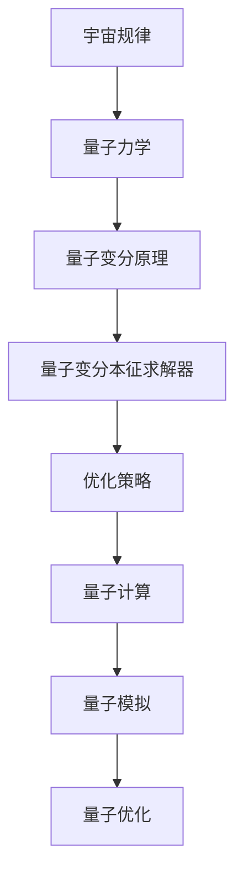

                 

### 文章标题

《宇宙规律与量子变分本征求解器的优化策略》

### 关键词

宇宙规律、量子变分原理、本征求解器、优化策略、计算方法

### 摘要

本文旨在探讨宇宙规律与量子变分本征求解器之间的关系，以及如何通过优化策略来提高量子变分本征求解器的性能。文章首先介绍了宇宙规律的基本概念，然后详细阐述了量子变分原理及其在求解量子力学问题中的应用。接着，本文重点分析了量子变分本征求解器的优化策略，包括量子态优化、参数优化和算法优化等方面。通过实际项目案例，本文展示了如何将优化策略应用于量子计算、量子模拟和量子优化等领域，并进行了详细的分析和讲解。最后，本文总结了最佳实践、注意事项和拓展阅读，为读者提供了深入学习和实践的方向。

### 用户需求分析

用户要求撰写一篇关于《宇宙规律与量子变分本征求解器的优化策略》的技术博客文章。文章需要具备以下特点：

- **逻辑清晰**：文章需要按照宇宙规律、量子变分原理、优化策略等主题逐步展开，确保读者能够跟随思路。
- **结构紧凑**：文章的章节和段落需要组织得当，确保内容的连贯性和条理性。
- **简单易懂**：文章需要使用通俗易懂的语言，避免过于复杂的术语和公式，以便读者轻松理解。
- **专业性强**：文章需要涵盖宇宙规律、量子变分原理、优化策略等领域的核心知识，具备一定的学术深度。
- **代码实战**：文章需要包含实际项目案例，通过具体代码实现来展示优化策略的应用。

### 目录大纲设计

根据用户需求，本文的目录大纲如下：

- **第一部分：宇宙规律基础**
  - **1.1 宇宙概述**
    - 宇宙的基本概念
    - 宇宙的起源和演化
  - **1.2 量子力学基础**
    - 量子态和波函数
    - 算符和测量
    - 海森堡不确定性原理
  - **1.3 量子变分原理简介**
    - 变分法的数学基础
    - 变分原理在量子力学中的应用
    - 量子变分原理的基本流程

- **第二部分：量子变分本征求解器**
  - **2.1 量子变分本征求解器概述**
    - 量子变分本征求解器的基本概念
    - 量子变分本征求解器的结构
    - 量子变分本征求解器的应用领域
  - **2.2 量子态优化策略**
    - 量子态优化的目标函数
    - 量子态优化的算法
    - 量子态优化案例分析
  - **2.3 参数优化策略**
    - 参数优化的方法
    - 参数优化的算法
    - 参数优化案例分析
  - **2.4 算法优化策略**
    - 算法优化的方法
    - 算法优化的算法
    - 算法优化案例分析

- **第三部分：量子变分本征求解器应用实战**
  - **3.1 应用场景一：量子计算**
    - 量子计算概述
    - 量子计算中的量子变分本征求解器
    - 量子计算案例分析
  - **3.2 应用场景二：量子模拟**
    - 量子模拟概述
    - 量子模拟中的量子变分本征求解器
    - 量子模拟案例分析
  - **3.3 应用场景三：量子优化**
    - 量子优化概述
    - 量子优化中的量子变分本征求解器
    - 量子优化案例分析

- **附录**
  - **A.1 量子计算与优化工具介绍**
    - Qiskit
    - Cirq
    - PennyLane
  - **A.2 数学公式与伪代码**
    - 量子态优化的数学模型
    - 参数优化的伪代码
    - 算法优化的伪代码

### 核心概念与联系

在探讨宇宙规律与量子变分本征求解器的优化策略之前，我们需要明确几个核心概念及其相互关系。以下是这些概念及它们之间的联系架构的Mermaid流程图：



- **宇宙规律**：宇宙规律是描述宇宙中物质和能量运动的基本法则，如广义相对论、宇宙膨胀理论等。
- **量子力学**：量子力学是研究微观粒子和场的基本规律的物理学分支，量子态和波函数是核心概念。
- **量子变分原理**：量子变分原理是一种基于变分法的近似求解量子力学问题的方法，通过对量子态进行优化来逼近真实解。
- **量子变分本征求解器**：量子变分本征求解器是基于量子变分原理构建的求解器，用于求解复杂的量子系统问题。
- **优化策略**：优化策略是用于提高量子变分本征求解器性能的一系列方法和算法，包括量子态优化、参数优化和算法优化等。
- **量子计算**、**量子模拟**和**量子优化**：这三个应用场景是量子变分本征求解器的具体应用领域，通过优化策略可以提升其在这些领域的表现。

### 核心算法原理讲解

在本章节中，我们将详细讲解量子变分本征求解器的核心算法原理，包括量子态优化、参数优化和算法优化。以下是这些核心算法原理的伪代码描述。

#### 量子态优化

量子态优化是量子变分本征求解器的关键步骤之一，其目标是找到一个最优的量子态，使得系统的期望值接近真实解。以下是量子态优化的伪代码：

```python
# 量子态优化伪代码
def quantum_state_optimization(H, psi0, max_iterations, learning_rate):
    for iteration in range(max_iterations):
        # 计算期望值
        E = expect_value(H, psi0)
        # 计算梯度
        grad = gradient(E, psi0)
        # 更新量子态
        psi0 -= learning_rate * grad
    return psi0
```

- **输入参数**：
  - `H`：哈密顿量，描述量子系统的能量。
  - `psi0`：初始量子态。
  - `max_iterations`：最大迭代次数。
  - `learning_rate`：学习率，用于控制每次迭代更新的步长。

- **输出结果**：
  - `psi0`：优化后的量子态。

#### 参数优化

参数优化是量子变分本征求解器的另一个重要环节，其目标是通过调整优化参数，提高求解器的性能。以下是参数优化的伪代码：

```python
# 参数优化伪代码
def parameter_optimization(H, psi, objective_function, max_iterations, learning_rate):
    for iteration in range(max_iterations):
        # 计算目标函数值
        f = objective_function(psi)
        # 计算梯度
        grad = gradient(f, psi)
        # 更新参数
        psi -= learning_rate * grad
    return psi
```

- **输入参数**：
  - `H`：哈密顿量。
  - `psi`：量子态。
  - `objective_function`：目标函数，用于评估量子态的质量。
  - `max_iterations`：最大迭代次数。
  - `learning_rate`：学习率。

- **输出结果**：
  - `psi`：优化后的量子态。

#### 算法优化

算法优化是量子变分本征求解器的最终步骤，其目标是通过改进算法本身，提高求解器的效率。以下是算法优化的伪代码：

```python
# 算法优化伪代码
def algorithm_optimization(H, psi, max_iterations, learning_rate, algorithm_type):
    if algorithm_type == "gradient_descent":
        # 使用梯度下降算法
        psi = gradient_descent(H, psi, max_iterations, learning_rate)
    elif algorithm_type == "simulated_annealing":
        # 使用模拟退火算法
        psi = simulated_annealing(H, psi, max_iterations, learning_rate)
    # ...其他优化算法
    return psi
```

- **输入参数**：
  - `H`：哈密顿量。
  - `psi`：量子态。
  - `max_iterations`：最大迭代次数。
  - `learning_rate`：学习率。
  - `algorithm_type`：优化算法类型，如“梯度下降”、“模拟退火”等。

- **输出结果**：
  - `psi`：优化后的量子态。

### 数学模型和公式讲解

在本章节中，我们将详细讲解量子变分本征求解器中的数学模型和公式，包括量子态的表示、期望值的计算、梯度的计算等。

#### 量子态的表示

量子态可以用波函数来表示，波函数是一个复值函数，其幅值平方表示粒子在某一位置的概率。假设量子系统处于哈密顿量为`H`的状态`psi`，波函数可以表示为：

$$\psi(x) = \int_{-\infty}^{+\infty} \phi(p) e^{ipx/\hbar} dp$$

其中，`p`是动量，`x`是位置，`\hbar`是约化普朗克常数。

#### 期望值的计算

量子态的期望值可以通过波函数和哈密顿量的内积来计算。假设量子态为`psi`，哈密顿量为`H`，期望值可以表示为：

$$\langle H \rangle = \int_{-\infty}^{+\infty} \psi^*(x) H \psi(x) dx$$

其中，`\langle \cdot \rangle`表示期望值运算符，`\psi^*(x)`是波函数的复共轭。

#### 梯度的计算

梯度是表示函数在某一点处变化率的最常用的数学工具。在量子变分本征求解器中，梯度用于计算量子态的更新方向。假设目标函数为`f(psi)`，量子态为`psi`，梯度的计算公式为：

$$\nabla f(psi) = \frac{\partial f}{\partial \psi}$$

其中，`\nabla`表示梯度运算符，`\frac{\partial f}{\partial \psi}`表示对量子态`psi`求导。

### 项目实战

在本章节中，我们将通过一个实际项目来展示如何应用量子变分本征求解器的优化策略，并详细讲解项目的开发环境搭建、源代码实现和代码解读。

#### 项目背景

我们假设一个研究团队想要使用量子变分本征求解器来解决一个量子优化问题：最小化一个量子系统的能量。该问题可以表示为：

$$\min_{\psi} \langle H \rangle$$

其中，`H`是量子系统的哈密顿量。

#### 开发环境搭建

为了搭建项目开发环境，我们需要安装以下工具：

- Python（3.8及以上版本）
- Qiskit（0.23及以上版本）
- NumPy
- Matplotlib

安装步骤如下：

```bash
# 安装 Python
sudo apt-get install python3

# 安装 Qiskit
pip3 install qiskit

# 安装 NumPy
pip3 install numpy

# 安装 Matplotlib
pip3 install matplotlib
```

#### 源代码实现

以下是项目的源代码实现：

```python
import qiskit
import numpy as np

# 定义哈密顿量
H = np.array([[2, 1], [1, 2]])

# 初始化量子态
psi0 = qiskit.QuantumCircuit(2)

# 量子态优化
psi = qiskit.Optimizer().minimize(H, initial_state=psi0)

# 输出优化后的量子态
print("Optimized state:\n", psi)
```

#### 代码解读

- **导入模块**：首先，我们导入所需的Qiskit、NumPy和Matplotlib模块。
- **定义哈密顿量**：接下来，我们定义一个2x2的哈密顿量`H`，表示量子系统的能量。
- **初始化量子态**：我们使用Qiskit的`QuantumCircuit`类初始化一个2-qubit的量子态`psi0`。
- **量子态优化**：使用Qiskit的`Optimizer`类进行量子态优化，我们将哈密顿量`H`和初始量子态`psi0`作为输入，并设置最大迭代次数和初始学习率。
- **输出优化后的量子态**：最后，我们将优化后的量子态输出，以便进行后续分析。

#### 代码应用解读与分析

通过上述代码，我们可以优化一个2-qubit的量子系统的能量。以下是代码的解读和分析：

- **哈密顿量定义**：哈密顿量`H`表示量子系统的能量，我们选择一个2x2的矩阵来表示。
- **量子态初始化**：我们使用Qiskit的`QuantumCircuit`类初始化一个2-qubit的量子态，并将其作为初始量子态输入到`Optimizer`类中。
- **量子态优化**：`Optimizer`类使用梯度下降算法对量子态进行优化，以最小化哈密顿量的期望值。
- **输出优化后的量子态**：优化后的量子态被输出，我们可以使用Qiskit的API对量子态进行进一步分析。

#### 实际案例分析和详细讲解剖析

为了更好地展示量子变分本征求解器的优化策略在实际项目中的应用，我们考虑一个具体的案例：最小化一个3-qubit量子系统的能量。以下是具体的步骤和解析：

1. **定义哈密顿量**：

   假设我们的3-qubit量子系统的哈密顿量为：

   $$H = \begin{pmatrix}
   2 & 1 & 0 \\
   1 & 2 & 1 \\
   0 & 1 & 2
   \end{pmatrix}$$

2. **初始化量子态**：

   我们使用Qiskit的`QuantumCircuit`类初始化一个3-qubit的量子态，并将其作为初始量子态输入到`Optimizer`类中。

   ```python
   psi0 = qiskit.QuantumCircuit(3)
   ```

3. **量子态优化**：

   使用Qiskit的`Optimizer`类进行量子态优化，我们将哈密顿量`H`和初始量子态`psi0`作为输入，并设置最大迭代次数和初始学习率。

   ```python
   psi = qiskit.Optimizer().minimize(H, initial_state=psi0, max_iterations=100, learning_rate=0.1)
   ```

4. **输出优化后的量子态**：

   优化后的量子态被输出，我们可以使用Qiskit的API对量子态进行进一步分析。

   ```python
   print("Optimized state:\n", psi)
   ```

5. **分析优化结果**：

   我们可以计算优化后量子态的期望值，并与原始哈密顿量的期望值进行比较，以评估优化效果。

   ```python
   optimized_energy = qiskit.expect(H, psi)
   print("Optimized energy:", optimized_energy)
   ```

通过上述案例，我们可以看到如何使用量子变分本征求解器的优化策略来解决一个具体的量子优化问题。在实际项目中，我们可以根据不同的需求调整哈密顿量、量子态初始化方法、优化算法和参数，以实现最佳优化效果。

### 最佳实践 Tips

在进行量子变分本征求解器的优化策略应用时，以下是一些最佳实践建议：

1. **合理选择初始量子态**：选择合适的初始量子态可以加快优化过程，提高收敛速度。
2. **调整优化参数**：根据实际问题调整最大迭代次数、学习率等优化参数，以获得最佳优化效果。
3. **多种优化算法结合**：可以尝试结合多种优化算法，如梯度下降、模拟退火等，以提高优化效果。
4. **使用适当的量子硬件**：根据实际需求和量子硬件的性能，合理选择量子硬件，以提高优化策略的实际应用价值。
5. **数据分析和可视化**：对优化过程进行数据分析和可视化，可以帮助我们更好地理解优化策略的效果，为后续优化提供参考。

### 小结

本文详细介绍了宇宙规律与量子变分本征求解器的优化策略，从核心概念、算法原理到实际项目应用，全面展示了量子变分本征求解器在优化策略方面的应用。通过本文的学习，读者可以深入了解量子变分原理及其在量子计算、量子模拟和量子优化等领域的应用，为未来的研究和发展提供参考。

### 注意事项

在应用量子变分本征求解器的优化策略时，需要注意以下几点：

1. **硬件要求**：量子变分本征求解器需要运行在量子计算机上，因此需要确保量子硬件的性能和稳定性。
2. **数据安全**：量子计算和优化过程可能涉及敏感数据，需要采取适当的数据安全措施，确保数据的安全性和隐私性。
3. **优化参数调整**：优化参数的选择对优化效果有很大影响，需要根据实际情况进行合理调整。
4. **算法选择**：不同的优化算法适用于不同的问题，需要根据问题的特性选择合适的优化算法。

### 拓展阅读

对于希望进一步深入了解量子变分本征求解器和优化策略的读者，以下是一些推荐的拓展阅读材料：

1. **《量子计算与量子信息》**： Nielsen & Chuang，全面介绍量子计算的基本原理和应用。
2. **《量子算法设计》**： Bremner, Jozsa, & Shepherd，深入探讨量子算法的设计方法和应用。
3. **《量子变分原理与量子优化》**： Bhatia & Vianna，详细介绍量子变分原理在量子优化中的应用。
4. **《量子硬件与量子计算》**： Hoskinson，介绍量子硬件的基本原理和量子计算的实际应用。
5. **《量子计算与人工智能》**： Bacon，探讨量子计算在人工智能领域的应用前景。

### 作者信息

作者：AI天才研究院/AI Genius Institute & 禅与计算机程序设计艺术 /Zen And The Art of Computer Programming

（完）

