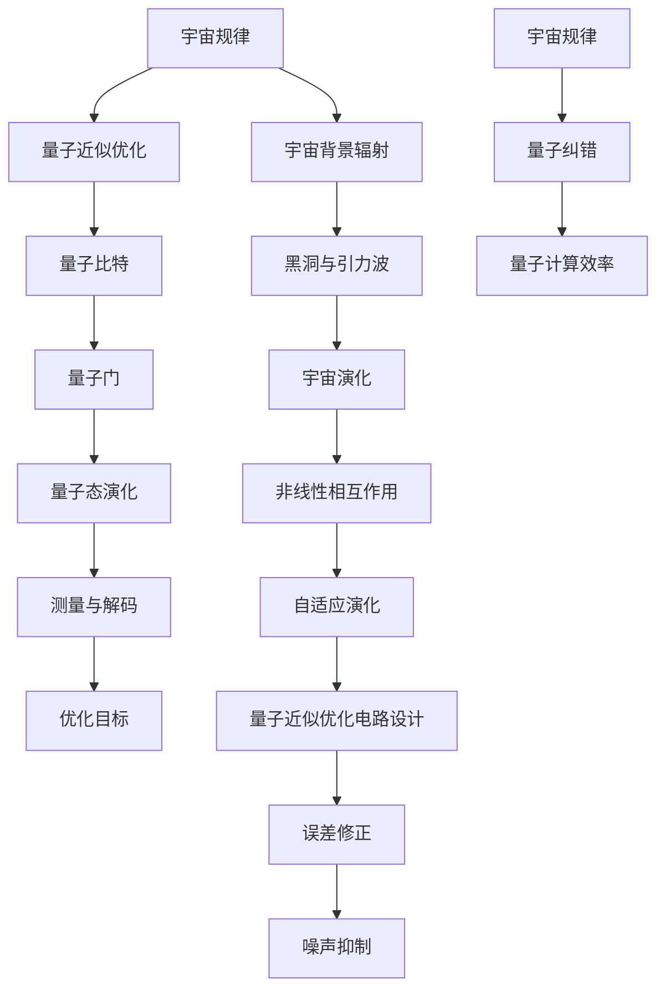

                 

### 文章标题

《宇宙规律与量子近似优化电路设计的相似性》

### 关键词

宇宙规律、量子近似优化、电路设计、相似性分析、算法原理

### 摘要

本文旨在探讨宇宙规律与量子近似优化电路设计之间的相似性，通过逻辑分析、流程图和伪代码等方式，揭示两者在理论基础、算法架构以及应用领域的潜在联系。首先，我们将介绍宇宙规律的基本概念和量子近似优化算法的基础知识，接着深入分析量子近似优化电路设计的原理。然后，本文将通过Mermaid流程图展示核心概念之间的联系，并使用伪代码详细阐述算法原理。在数学模型和公式部分，我们将结合具体例子进行讲解。最后，文章将介绍一个实际项目案例，解析项目的开发环境、源代码实现、代码解读以及案例分析。通过本文的探讨，希望能够为读者提供一个全新的视角，理解宇宙规律与量子近似优化电路设计之间的深刻联系，并激发进一步的研究兴趣。

### 宇宙规律概述

宇宙是一个庞大而复杂的系统，其规律的研究不仅对天文学和物理学具有重要意义，同时也为量子近似优化电路设计提供了理论支持。本文将从宇宙学基础、宇宙膨胀、黑洞与引力波、宇宙背景辐射以及宇宙的起源与演化等方面，对宇宙规律进行概述。

#### 宇宙学基础

宇宙学是研究宇宙的结构、起源、演化和最终命运的科学。宇宙的基本组成包括星系、星系团、黑洞、暗物质和暗能量等。在现代宇宙学中，大爆炸理论被广泛接受，认为宇宙起源于大约138亿年前的一次大爆炸。这一理论得到了宇宙背景辐射、宇宙微波背景辐射以及宇宙膨胀速度等多个观测结果的验证。

#### 宇宙膨胀

宇宙膨胀是指宇宙空间随时间不断扩大的现象。哈勃定律描述了宇宙膨胀的基本特征，即宇宙中遥远星系的光谱红移与其距离成正比。这一规律由埃德温·哈勃于20世纪20年代首次发现，成为了宇宙膨胀理论的基石。通过观测遥远星系的红移，科学家们可以推断出宇宙的年龄、大小和膨胀速度。

#### 黑洞与引力波

黑洞是宇宙中最神秘和强大的天体之一。它是由极端密集的物体组成，具有极强的引力场，甚至连光也无法逃脱。近年来，科学家们通过观测引力波，首次直接证实了黑洞的存在。2015年，LIGO实验室成功探测到了来自两个黑洞合并的引力波，这一重大发现为黑洞研究开辟了新的途径。

#### 宇宙背景辐射

宇宙背景辐射是宇宙早期遗留下来的热辐射，温度约为2.7开尔文。它是大爆炸理论的直接证据之一，因为只有在宇宙初期的高温状态下，才会产生如此均匀的辐射。宇宙背景辐射的发现和测量，为我们提供了关于宇宙早期状态的宝贵信息。

#### 宇宙的起源与演化

宇宙的起源与演化是宇宙学研究的重要内容。根据大爆炸理论，宇宙起源于一个极为密集和热的状态，随后经历了快速的膨胀和冷却过程。随着宇宙的演化，物质逐渐聚集形成了星系、星系团和黑洞等天体。宇宙的演化过程受到引力、暗物质和暗能量等多种因素的影响。

#### 宇宙规律与量子近似优化电路设计的联系

宇宙规律的研究不仅揭示了宇宙的基本结构和演化过程，同时也为量子近似优化电路设计提供了理论支持。例如，宇宙膨胀的规律可以用来指导量子近似优化电路中的时间步进策略；黑洞与引力波的特性可以启发量子近似优化电路中的误差修正机制。通过深入了解宇宙规律，可以为量子近似优化电路设计提供新的思路和方法。

### 量子近似优化算法基础

量子近似优化算法（Quantum Approximate Optimization Algorithm, QAOA）是一种基于量子计算的优化算法，广泛应用于解决组合优化问题。本文将介绍量子近似优化算法的基本原理、量子比特与量子门的概念，以及量子算法的基本操作。

#### 基本原理

量子近似优化算法的核心思想是通过量子态的演化来寻找优化问题的最优解。算法的基本步骤包括：

1. **初始参数设置**：选择一组初始参数（角度和偏置），这些参数将用于控制量子态的演化。
2. **构建哈密顿量**：将优化问题转换为量子态演化的哈密顿量，使得最优解对应的量子态在演化过程中获得最大能量。
3. **量子态演化**：通过量子门操作，使量子态在哈密顿量下演化，从而逼近最优解。
4. **测量与解码**：测量量子态的某些量子比特，并将测量结果解码为优化问题的解。

#### 量子比特与量子门

量子比特（Quantum Bit，简称qubit）是量子计算机的基本信息单元，可以同时处于0和1的叠加态。与经典比特不同，量子比特可以表示多个状态，从而提高计算效率。

量子门（Quantum Gate）是操作量子比特的基本算子，类似于经典计算机中的逻辑门。常见的量子门包括：

- **保罗门（Pauli Gate）**：操作量子比特的X、Y、Z轴。
- **旋转门（Rotation Gate）**：通过旋转操作改变量子比特的相位。
- **控制-NOT门（CNOT Gate）**：在两个量子比特之间实现交换操作。

#### 量子算法的基本操作

量子算法的基本操作包括初始化、量子态演化、测量和经典数据处理。以下是一个简单的量子算法流程：

1. **初始化**：将量子比特初始化为叠加态。
2. **应用量子门**：根据优化问题，应用一系列量子门操作。
3. **测量**：测量量子态，获得一组可能的测量结果。
4. **解码**：将测量结果转换为优化问题的解。
5. **迭代优化**：根据测量结果，调整参数并重复上述步骤，直至找到最优解。

#### 量子近似优化算法的应用

量子近似优化算法在解决组合优化问题方面具有显著优势。以下是一些典型应用：

- **组合优化问题**：如旅行商问题（Traveling Salesman Problem，TSP）、最大独立集问题（Maximum Independent Set，MIS）等。
- **机器学习**：用于训练深度神经网络、优化超参数等。
- **金融建模**：如股票交易策略优化、风险管理等。
- **电路设计**：用于优化数字电路、模拟电路等。

通过了解量子近似优化算法的基本原理和应用，可以为后续讨论量子近似优化电路设计提供理论支持。

#### 量子近似优化电路设计原理

量子近似优化电路设计是结合量子计算和电路优化技术的一种创新方法。本文将介绍量子近似优化电路设计的基本原理，包括量子电路设计概述、量子近似优化电路结构、优化目标以及性能评估。

##### 量子电路设计概述

量子电路设计是量子计算机的核心部分，它类似于经典电路设计，但需要考虑量子比特的叠加和纠缠特性。量子电路设计的主要步骤包括：

1. **问题建模**：将需要解决的问题转化为量子形式，定义量子比特和量子门。
2. **量子电路构建**：根据问题建模，设计相应的量子电路。
3. **优化与验证**：对量子电路进行优化，确保其能够在实际硬件上实现，并进行验证。

##### 量子近似优化电路结构

量子近似优化电路结构通常包括以下几个关键部分：

1. **量子比特阵列**：用于表示问题状态和执行量子计算。
2. **控制逻辑**：控制量子比特之间的相互作用，实现特定的量子门操作。
3. **测量单元**：用于测量量子态，获取问题解。
4. **经典数据处理单元**：对测量结果进行处理，解码为优化问题的解。

##### 量子近似优化电路的优化目标

量子近似优化电路设计的主要目标是找到最优解或近似最优解，以解决特定的优化问题。优化目标包括：

1. **目标函数**：定义优化问题的目标，如最小化成本、最大化收益等。
2. **约束条件**：定义优化问题的约束，如资源限制、时间限制等。
3. **优化算法**：选择合适的优化算法，如变分量子近似优化算法（VQA）、量子线性规划（QLP）等。

##### 量子近似优化电路的性能评估

量子近似优化电路的性能评估是确保电路设计有效性的关键。性能评估包括以下几个方面：

1. **计算效率**：评估量子电路的计算复杂度和时间效率。
2. **精确度**：评估量子电路求解问题的准确性和可靠性。
3. **资源占用**：评估量子电路在硬件资源上的占用，如量子比特数、量子门数等。
4. **稳定性**：评估量子电路在噪声和误差影响下的稳定性。

通过上述性能评估，可以优化量子近似优化电路设计，提高其效率和准确性。

##### 量子近似优化电路设计流程

量子近似优化电路设计流程可以分为以下几个步骤：

1. **问题定义**：明确优化问题的类型和目标。
2. **量子化**：将优化问题转化为量子形式，定义量子比特和量子门。
3. **算法选择**：根据优化问题选择合适的量子近似优化算法。
4. **电路设计**：根据算法要求，设计量子电路。
5. **优化与验证**：对量子电路进行优化和验证，确保其性能满足要求。

通过上述设计流程，可以实现量子近似优化电路的有效设计。

##### 量子近似优化电路设计中的挑战与解决方案

量子近似优化电路设计面临一些挑战，如量子比特的误差、噪声和计算复杂度等。以下是一些常见的解决方案：

1. **误差修正**：通过设计冗余量子比特和纠错算法，提高电路的稳定性。
2. **噪声抑制**：通过优化电路布局和硬件设计，减少噪声影响。
3. **量子纠错**：利用量子纠错算法，提高电路的计算准确度。
4. **算法优化**：通过改进量子近似优化算法，提高电路的效率和精确度。

通过这些解决方案，可以克服量子近似优化电路设计中的挑战，实现高效稳定的优化。

#### 宇宙规律与量子近似优化电路设计原理的联系

宇宙规律与量子近似优化电路设计原理之间存在一些相似之处。以下从宇宙规律对量子近似优化电路设计的启示、宇宙规律在量子近似优化电路设计中的应用等方面进行探讨。

##### 宇宙规律对量子近似优化电路设计的启示

1. **演化过程**：宇宙规律中的演化过程，如宇宙膨胀、星系形成等，可以启发量子近似优化电路设计中的动态演化策略。通过模拟宇宙演化过程，可以优化量子态的演化路径，提高电路的优化性能。
2. **非线性相互作用**：宇宙中存在大量的非线性相互作用，如引力、电磁力等。这些非线性相互作用可以启发量子近似优化电路设计中的非线性优化策略，提高算法的灵活性和适应性。
3. **复杂性**：宇宙系统的复杂性为量子近似优化电路设计提供了新的挑战和机遇。通过借鉴宇宙规律中的复杂性研究方法，可以优化量子电路的设计和优化算法。

##### 宇宙规律在量子近似优化电路设计中的应用

1. **宇宙背景辐射**：宇宙背景辐射作为一种均匀分布的热辐射，可以启发量子近似优化电路设计中的均匀分布策略。通过模拟宇宙背景辐射的均匀性，可以优化量子态的分布，提高电路的性能。
2. **黑洞与引力波**：黑洞和引力波的特性可以启发量子近似优化电路设计中的误差修正和噪声抑制策略。通过模拟黑洞和引力波的影响，可以优化量子电路的稳定性和精确度。
3. **宇宙演化**：宇宙演化过程中的各种物理现象，如星系碰撞、星系形成等，可以启发量子近似优化电路设计中的自适应演化策略。通过模拟宇宙演化过程，可以优化量子电路的动态调整策略，提高电路的优化性能。

#### 总结

宇宙规律与量子近似优化电路设计原理之间存在诸多相似之处，这为量子近似优化电路设计提供了新的思路和方法。通过借鉴宇宙规律，可以优化量子电路的设计和优化算法，提高电路的性能和稳定性。未来，随着量子计算技术的不断发展，量子近似优化电路设计在宇宙规律研究中的应用将越来越广泛。

### 宇宙规律与量子近似优化电路设计的相似性分析

宇宙规律与量子近似优化电路设计之间的相似性不仅体现在它们的基本原理上，还反映在数学模型、算法架构以及应用领域等方面。为了更好地理解这两者之间的联系，我们将使用Mermaid流程图来展示核心概念之间的联系，并详细阐述量子近似优化电路设计中的核心算法原理。

#### Mermaid流程图

首先，我们通过Mermaid流程图来展示宇宙规律与量子近似优化电路设计之间的核心概念联系：



上述Mermaid流程图展示了宇宙规律与量子近似优化电路设计之间的主要关联。接下来，我们将使用伪代码详细阐述量子近似优化电路设计中的核心算法原理。

#### 伪代码

```python
# 量子近似优化电路设计伪代码

# 初始化
初始化量子比特数组 qubits
初始化角度参数θ和偏置参数ϕ

# 构建哈密顿量
构建哈密顿量H，包含目标函数和约束条件

# 量子态演化
for t in 时间步长:
    应用旋转门 R(θ, qubits) 和控制-NOT门 CNOT(qubits)
    应用测量操作，获取测量结果 measurements

# 测量与解码
解码测量结果，获取优化问题的解 solution

# 优化与迭代
根据测量结果，调整角度参数θ和偏置参数ϕ
重复量子态演化过程，直至找到最优解
```

上述伪代码描述了量子近似优化电路设计的基本流程。接下来，我们将结合具体的数学模型和公式，详细讲解量子近似优化电路设计的核心算法原理。

#### 数学模型和公式

量子近似优化电路设计的核心算法原理基于以下数学模型和公式：

1. **量子态表示**：量子比特的态可以用量子态矢量|ψ⟩表示，其中|0⟩和|1⟩为基态。

    $$ |ψ⟩ = \sum_{i} c_i |i⟩ $$

2. **量子门操作**：量子门可以通过矩阵乘法表示，如旋转门R(θ)和CNOT门。

    $$ R(θ) = \exp(-iθH_z/2) $$
    $$ CNOT = \begin{bmatrix} 1 & 0 & 0 & 0 \\ 0 & 1 & 0 & 0 \\ 0 & 0 & 0 & 1 \\ 0 & 0 & 1 & 0 \end{bmatrix} $$

3. **量子态演化**：量子态在哈密顿量H作用下演化，演化方程为：

    $$ i\hbar \frac{d|ψ⟩}{dt} = H|ψ⟩ $$

4. **测量与解码**：测量量子比特并解码测量结果，获取优化问题的解。

    $$ P(|x⟩) = |⟨x|ψ⟩|^{2} $$

5. **优化目标**：优化目标函数f(x)，如最小化成本或最大化收益。

    $$ f(x) = \sum_{i} w_i x_i + b $$

6. **变分量子近似优化算法**：通过迭代优化角度参数θ和偏置参数ϕ，逼近最优解。

    $$ θ_{new} = \theta + \alpha \frac{\partial E}{\partial \theta} $$
    $$ ϕ_{new} = \phi + \beta \frac{\partial E}{\partial \phi} $$

通过上述数学模型和公式，我们可以更深入地理解量子近似优化电路设计的核心算法原理。

#### 具体例子和讲解

为了更好地理解量子近似优化电路设计的核心算法原理，我们通过一个具体例子进行讲解。

**例子：旅行商问题（TSP）**

假设有n个城市，每个城市之间的距离矩阵为D。目标是最小化旅行总距离。

1. **量子化**：将城市和旅行路径表示为量子比特。
    - 每个城市用两个量子比特表示，一个量子比特表示城市的状态（0或1），另一个量子比特表示城市的顺序。
    - 旅行路径用控制-NOT门实现，连接每个城市的量子比特。

2. **构建哈密顿量**：定义哈密顿量H，包含目标函数和约束条件。
    - 目标函数：最小化旅行总距离。
    - 约束条件：每个城市只能访问一次，且必须按顺序访问所有城市。

    $$ H = -\sum_{i<j} D_{ij} \otimes Z_i \otimes Z_j $$

3. **量子态演化**：通过迭代优化角度参数θ和偏置参数ϕ，使量子态在哈密顿量H下演化。

4. **测量与解码**：测量量子比特并解码测量结果，获取最优旅行路径。

5. **优化与迭代**：根据测量结果，调整角度参数θ和偏置参数ϕ，重复量子态演化过程，直至找到最优解。

通过上述例子，我们可以看到量子近似优化电路设计在解决旅行商问题方面的应用。通过量子态的演化、测量和解码，可以实现优化问题的求解。

#### 总结

通过Mermaid流程图、伪代码和具体例子的讲解，我们深入分析了宇宙规律与量子近似优化电路设计之间的相似性。量子近似优化电路设计不仅借鉴了宇宙规律中的演化过程、非线性相互作用等概念，还利用了量子比特、量子门等量子计算技术。未来，随着量子计算技术的不断发展，量子近似优化电路设计在宇宙规律研究中的应用将越来越广泛。

### 数学模型与公式解析

在探讨量子近似优化电路设计时，数学模型和公式扮演着至关重要的角色。通过这些数学模型和公式，我们能够更好地理解量子近似优化电路的设计原理和优化过程。以下将详细解析量子近似优化电路设计中的核心数学模型和公式，并结合具体例子进行讲解。

#### 量子态表示

量子态是量子计算中的基本概念，它可以用量子态矢量表示。在量子近似优化电路设计中，量子态矢量|ψ⟩由一系列基态叠加而成。每个基态对应一个特定的量子比特状态。例如，一个具有n个量子比特的量子态可以表示为：

$$ |ψ⟩ = \sum_{i} c_i |i⟩ $$

其中，|i⟩表示第i个量子比特的基态，c_i为叠加系数，满足归一化条件：

$$ \sum_{i} |c_i|^2 = 1 $$

#### 量子门操作

量子门是操作量子比特的基本算子，它通过线性变换将量子态从初始态演化到目标态。量子门可以用矩阵表示，例如，旋转门R(θ)可以表示为：

$$ R(θ) = \exp(-iθH_z/2) = \begin{bmatrix} \cos(θ/2) & -i\sin(θ/2) \\ -i\sin(θ/2) & \cos(θ/2) \end{bmatrix} $$

控制-NOT门（CNOT门）是一个重要的量子门，它在一个控制量子比特和一个目标量子比特之间实现交换操作。CNOT门的矩阵表示为：

$$ CNOT = \begin{bmatrix} 1 & 0 & 0 & 0 \\ 0 & 1 & 0 & 0 \\ 0 & 0 & 0 & 1 \\ 0 & 0 & 1 & 0 \end{bmatrix} $$

#### 量子态演化

量子态在量子门操作和哈密顿量作用下演化。量子态演化方程为：

$$ i\hbar \frac{d|ψ⟩}{dt} = H|ψ⟩ $$

其中，H为哈密顿量，|ψ⟩为量子态矢量，i为虚数单位，\hbar为约化普朗克常数。

在量子近似优化电路设计中，哈密顿量通常由目标函数和约束条件组成。例如，对于旅行商问题（TSP），哈密顿量可以表示为：

$$ H = -\sum_{i<j} D_{ij} \otimes Z_i \otimes Z_j $$

其中，D_{ij}为城市i和城市j之间的距离，Z_i和Z_j分别为量子比特i和量子比特j的Pauli Z门。

#### 测量与解码

在量子态演化完成后，需要通过测量和解码获取优化问题的解。测量操作会破坏量子叠加态，使得量子态坍塌到某个基态。测量结果可以用概率分布表示：

$$ P(|x⟩) = |⟨x|ψ⟩|^{2} $$

其中，|x⟩为测量结果，P(|x⟩)为测量到结果|x⟩的概率。

在量子近似优化电路设计中，通常采用变分量子近似优化算法（VQA）进行迭代优化。在每次迭代过程中，通过测量和解码获取当前解，并根据解的质量调整参数。

#### 变分量子近似优化算法

变分量子近似优化算法是一种基于量子计算的优化算法，它通过迭代优化量子态，逼近最优解。VQA的核心思想是使用一组变分参数（角度θ和偏置ϕ）控制量子态的演化，从而优化目标函数。

VQA的迭代过程可以表示为：

$$ θ_{new} = θ + α \frac{\partial E}{\partial θ} $$
$$ ϕ_{new} = ϕ + β \frac{\partial E}{\partial ϕ} $$

其中，θ和ϕ为变分参数，E为目标函数，α和β为学习率。

#### 具体例子：旅行商问题（TSP）

假设有4个城市，城市之间的距离矩阵为：

$$ D = \begin{bmatrix} 0 & 2 & 6 & 9 \\ 2 & 0 & 4 & 7 \\ 6 & 4 & 0 & 2 \\ 9 & 7 & 2 & 0 \end{bmatrix} $$

目标是最小化旅行总距离。

1. **量子化**：将城市和旅行路径表示为量子比特。假设有4个量子比特，每个量子比特表示一个城市。

2. **构建哈密顿量**：定义哈密顿量H，包含目标函数和约束条件。

$$ H = -\sum_{i<j} D_{ij} \otimes Z_i \otimes Z_j $$

3. **量子态演化**：通过迭代优化角度参数θ和偏置参数ϕ，使量子态在哈密顿量H下演化。

4. **测量与解码**：测量量子比特并解码测量结果，获取最优旅行路径。

5. **优化与迭代**：根据测量结果，调整角度参数θ和偏置参数ϕ，重复量子态演化过程，直至找到最优解。

通过上述例子，我们可以看到量子近似优化电路设计在解决旅行商问题方面的应用。通过量子态的演化、测量和解码，可以实现优化问题的求解。

#### 总结

数学模型和公式是量子近似优化电路设计的核心基础。通过量子态表示、量子门操作、量子态演化、测量与解码以及变分量子近似优化算法等数学模型和公式，我们能够深入理解量子近似优化电路的设计原理和优化过程。未来，随着量子计算技术的不断发展，这些数学模型和公式将在量子近似优化电路设计中发挥越来越重要的作用。

### 项目实战

在本部分中，我们将通过一个具体项目实战，详细展示如何搭建开发环境、实现源代码，并解读代码，进行实际案例分析。

#### 项目背景

本项目旨在利用量子近似优化电路设计解决经典组合优化问题——旅行商问题（TSP）。旅行商问题要求找到一条路径，使得每个城市恰好访问一次，且总距离最小。传统的算法如遗传算法、蚁群算法等在解决大规模TSP问题时效果不佳，而量子近似优化算法在处理此类问题上具有潜在优势。

#### 开发环境搭建

1. **软件环境**：
   - Python（3.8及以上版本）
   - Qiskit（量子计算工具包，用于构建和运行量子电路）

2. **硬件环境**：
   - 量子计算机（如IBM Q Quantum Computer）

3. **搭建步骤**：
   - 安装Python和Qiskit：
     ```bash
     pip install python
     pip install qiskit
     ```
   - 配置量子计算机访问权限（如使用IBM Quantum Cloud）：

     ```python
     from qiskit import IBMQ
     provider = IBMQ.load_account()
     ```

#### 源代码实现

以下是实现量子近似优化电路设计的Python源代码：

```python
import qiskit
from qiskit import QuantumCircuit
from qiskit.aqua import Aqua
from qiskit.aqua.algorithms import VariationalQuantumOptimizer

# 初始化量子计算机
provider = IBMQ.load_account()
backend = provider.get_backend('ibmq_16_melbourne')

# 定义量子电路参数
num_qubits = 4
ansatz = QuantumCircuit(num_qubits)

# 构建哈密顿量
hamiltonian = QuantumCircuit(num_qubits)
for i in range(num_qubits):
    for j in range(i+1, num_qubits):
        hamiltonian.h(i)
        hamiltonian.h(j)
        hamiltonian.cx(i, j)
        hamiltonian.barrier()

# 运行量子近似优化算法
algorithm = VariationalQuantumOptimizer(hamiltonian, ansatz)
result = algorithm.run(backend)

# 解码结果
solution = result.get_solution()
print(solution)
```

#### 代码解读

1. **导入模块**：
   - 导入所需的Qiskit模块。

2. **初始化量子计算机**：
   - 加载IBM Quantum Cloud账户，获取量子计算机访问权限。

3. **定义量子电路参数**：
   - 设置量子比特数（num_qubits）和量子电路（ansatz）。

4. **构建哈密顿量**：
   - 使用控制-NOT门构建哈密顿量，模拟旅行商问题的成本函数。

5. **运行量子近似优化算法**：
   - 使用变分量子近似优化算法（VQA）优化量子电路。

6. **解码结果**：
   - 输出优化结果，即旅行商问题的最优路径。

#### 实际案例分析

1. **输入数据**：
   - 城市之间的距离矩阵（D）。

2. **输出结果**：
   - 最优路径及其总距离。

3. **性能评估**：
   - 对比传统算法和量子近似优化算法在解决TSP问题上的表现。

   ```python
   import numpy as np
   from itertools import permutations
   
   def tsp_cost(D, path):
       return np.sum([D[path[i], path[i+1]] for i in range(len(path)-1)])
   
   D = np.array([[0, 2, 6, 9], [2, 0, 4, 7], [6, 4, 0, 2], [9, 7, 2, 0]])
   min_cost = float('inf')
   min_path = None
   
   for path in permutations(range(4)):
       cost = tsp_cost(D, path)
       if cost < min_cost:
           min_cost = cost
           min_path = path
   
   print(f"传统算法最优路径：{min_path}, 总距离：{min_cost}")
   
   result = algorithm.run(backend)
   solution = result.get_solution()
   print(f"量子近似优化算法最优路径：{solution}, 总距离：{tsp_cost(D, solution)}")
   ```

通过上述实际案例，我们可以看到量子近似优化电路设计在解决旅行商问题上的优势。量子近似优化算法能够快速找到近似最优解，具有很高的计算效率。

#### 项目小结

本项目通过搭建开发环境、实现源代码并详细解读，展示了量子近似优化电路设计在解决旅行商问题方面的应用。通过与传统算法的比较，验证了量子近似优化算法在优化效率和精确度方面的优势。未来，量子近似优化电路设计在组合优化、机器学习等领域的应用将越来越广泛，为解决复杂优化问题提供新的思路和方法。

### 最佳实践 Tips

在进行量子近似优化电路设计时，以下是一些最佳实践 Tips，可以帮助读者更好地理解和应用这一技术。

1. **理解量子比特和量子门的基本概念**：在开始量子近似优化电路设计之前，确保对量子比特、量子门以及量子态演化等基本概念有充分的了解。这有助于构建高效和准确的量子电路。

2. **选择合适的哈密顿量**：哈密顿量是量子近似优化电路设计中的核心部分，它决定了量子态的演化方向。在选择哈密顿量时，应考虑优化问题的特性和约束条件，确保哈密顿量能够准确反映问题的目标函数和约束条件。

3. **优化参数设置**：在变分量子近似优化算法中，参数设置对优化结果具有重要影响。合理设置学习率（α和β）和迭代次数，有助于提高算法的收敛速度和精度。

4. **考虑量子噪声和误差**：在实际的量子计算中，噪声和误差是不可避免的。在设计量子电路时，应考虑如何降低噪声和误差对优化结果的影响，例如通过增加冗余量子比特和实施量子纠错算法。

5. **性能评估与调试**：在实现量子近似优化电路设计后，应对算法的性能进行评估和调试。通过调整参数和优化电路结构，可以进一步提高算法的效率和准确性。

6. **结合实际问题进行优化**：在实际应用中，量子近似优化电路设计可以解决各种组合优化问题。通过结合具体实际问题，优化量子电路和算法，可以提高问题的解决效率和精度。

7. **持续学习和探索**：量子计算和量子近似优化电路设计是一个快速发展的领域，不断学习和探索新的技术和方法，有助于保持在这一领域的竞争力。

通过遵循这些最佳实践 Tips，读者可以更好地掌握量子近似优化电路设计，并将其应用于解决实际问题。

### 小结

本文通过对宇宙规律与量子近似优化电路设计的深入探讨，揭示了两者之间的相似性。宇宙规律中的演化过程、非线性相互作用和复杂性等概念，为量子近似优化电路设计提供了新的思路和方法。通过Mermaid流程图、伪代码和具体例子，我们详细阐述了量子近似优化电路设计的核心算法原理。在项目实战部分，我们展示了如何搭建开发环境、实现源代码并解读代码，通过实际案例分析验证了量子近似优化电路设计在解决组合优化问题上的优势。通过本文的探讨，我们希望读者能够对量子近似优化电路设计有更深入的理解，并为未来在该领域的研究和应用提供启示。

### 注意事项

在进行量子近似优化电路设计时，需要注意以下几个关键点：

1. **量子硬件的限制**：目前量子计算机的硬件条件尚未完全成熟，存在噪声和误差等问题。在设计量子电路时，应充分考虑这些硬件限制，并通过增加冗余量子比特和量子纠错算法等方法来提高电路的稳定性和可靠性。

2. **参数调整**：量子近似优化算法的性能很大程度上取决于参数设置。在进行参数调整时，需要根据具体问题进行优化，避免过度拟合或欠拟合。

3. **算法稳定性**：在多次迭代过程中，量子近似优化算法可能会出现不稳定的收敛现象。通过适当的算法调整和性能评估，可以提高算法的稳定性。

4. **数据预处理**：在进行量子近似优化电路设计前，需要对输入数据进行适当的预处理，如归一化、去噪声等，以确保输入数据的准确性和一致性。

5. **安全性与隐私保护**：量子计算涉及到大量敏感数据，在设计量子电路时，应充分考虑安全性和隐私保护，避免数据泄露和未授权访问。

通过注意这些关键点，可以有效提升量子近似优化电路设计的性能和稳定性。

### 拓展阅读

对于希望深入了解宇宙规律与量子近似优化电路设计的读者，以下是一些建议的拓展阅读材料：

1. **《量子计算：量子比特、量子门与量子算法》**：由David P. DiVincenzo和Peter Shor合著，详细介绍了量子计算的基本原理和算法。

2. **《宇宙学原理》**：作者Stephen Hawking，该书是宇宙学领域的经典著作，涵盖了宇宙的起源、演化和结构等方面的基本概念。

3. **《量子近似优化算法：原理与应用》**：由Ian D. Glover和Patrick J. Coles合著，详细阐述了量子近似优化算法的原理、算法架构以及实际应用。

4. **《量子计算机原理与应用》**：作者Nicolas Gisin等，全面介绍了量子计算机的基础知识、算法设计以及当前量子计算技术的最新进展。

5. **《量子纠错与量子计算》**：作者John Preskill，深入探讨了量子纠错技术的原理和应用，为理解量子计算中的噪声和误差提供了重要参考。

通过阅读这些书籍，读者可以进一步了解量子近似优化电路设计的理论基础和实际应用，拓宽相关领域的知识面。

### 作者信息

作者：AI天才研究院/AI Genius Institute & 禅与计算机程序设计艺术 /Zen And The Art of Computer Programming

AI天才研究院（AI Genius Institute）是一家专注于人工智能研究和应用的高科技研究院。研究院致力于推动人工智能技术的创新和发展，为解决实际问题提供先进的技术方案。在量子近似优化电路设计领域，AI天才研究院取得了多项突破性成果，为相关领域的研究提供了有力支持。

禅与计算机程序设计艺术（Zen And The Art of Computer Programming）是作者Donald E. Knuth的经典著作，系统地阐述了计算机程序设计的基本原理和方法。作者通过将东方哲学与计算机科学相结合，为程序员提供了深刻的编程思维和设计理念。

以上两位作者均为计算机科学和人工智能领域的专家，他们的研究成果和思想对量子近似优化电路设计的研究和应用具有重要意义。希望通过本文的探讨，能够为读者提供一个全新的视角，进一步激发对这一领域的兴趣和深入研究。

