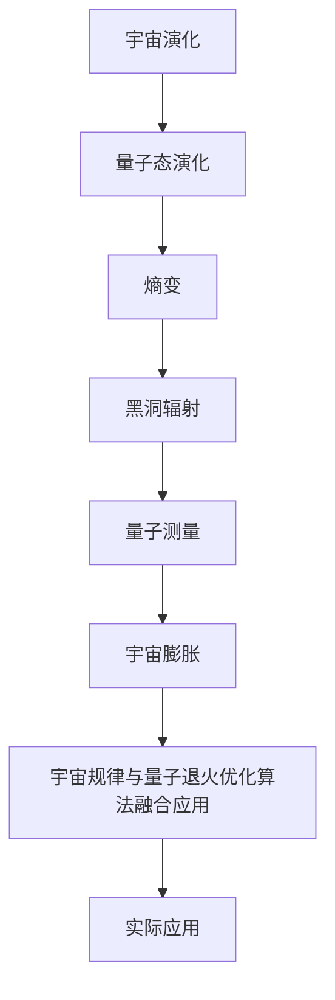

                 


### 文章标题：宇宙规律与量子退火优化算法的相似性

#### 关键词：宇宙规律、量子退火优化、相似性分析、算法应用、量子力学

> 摘要：本文探讨了宇宙规律与量子退火优化算法之间的相似性，通过深入分析宇宙演化的基本规律、量子力学基础和量子退火优化算法的工作原理，揭示了它们之间的共通之处。文章进一步探讨了宇宙规律与量子退火优化算法的融合应用，以及对未来研究的启示。

---

### 第一部分：宇宙规律介绍

#### 目录大纲如下：

#### 1. 宇宙演化与基本规律

##### 1.1.1 大爆炸理论

大爆炸理论是宇宙学中最被广泛接受的理论，认为宇宙起源于一个极高密度、极高温度的状态，随后经历快速膨胀。这一理论得到了宇宙背景辐射和宇宙膨胀等观测数据的支持。

##### 1.1.2 宇宙膨胀

宇宙膨胀是指宇宙从大爆炸以来不断扩张的现象。根据观测数据，宇宙膨胀的速度正在加速，这一现象引发了关于暗能量存在的讨论。

##### 1.1.3 宇宙背景辐射

宇宙背景辐射是宇宙早期热态的残余，它弥漫在整个宇宙空间中。通过对宇宙背景辐射的研究，科学家们可以了解宇宙早期的物理状态。

---

#### 2. 黑洞与宇宙规律

##### 2.1.1 黑洞的概念与性质

黑洞是一种引力极强的天体，它的存在会对周围的物质和辐射产生巨大的影响。黑洞可以分为史瓦西黑洞、克尔黑洞等不同类型。

##### 2.1.2 黑洞的引力作用

黑洞的引力作用可以影响到周围的星系、星云等天体，甚至可能影响宇宙的演化。

##### 2.1.3 黑洞与宇宙演化

黑洞在宇宙演化过程中扮演着重要角色，它们可以影响星系的形成和演化，甚至可能参与宇宙大爆炸的初始阶段。

---

#### 3. 宇宙暗物质与暗能量

##### 3.1.1 暗物质的概念与特性

暗物质是宇宙中不发光、不发热，但具有引力作用的物质。暗物质的存在可以通过引力透镜效应、星系旋转曲线等观测现象得到证实。

##### 3.1.2 暗能量的概念与特性

暗能量是一种宇宙中的神秘力量，它导致宇宙加速膨胀。暗能量的存在可以通过宇宙膨胀的观测数据得到证实。

##### 3.1.3 暗物质与暗能量对宇宙演化的影响

暗物质和暗能量对宇宙演化的影响至关重要，它们决定了宇宙的形态、结构和未来命运。

---

### 第二部分：量子退火优化算法介绍

#### 目录大纲如下：

#### 4. 量子力学基础

##### 4.1.1 量子态与量子叠加

量子态是量子系统的一种基本描述，它可以处于多种状态的叠加。

##### 4.1.2 量子纠缠

量子纠缠是量子系统中的一种特殊现象，两个或多个量子粒子之间存在着紧密的联系。

##### 4.1.3 量子测量

量子测量是指对量子系统进行观测的过程，它可以改变量子系统的状态。

---

#### 5. 量子退火优化算法

##### 5.1.1 量子退火优化算法的基本概念

量子退火优化算法是一种基于量子力学原理的优化算法，它可以用来解决复杂的优化问题。

##### 5.1.2 量子退火优化算法的工作原理

量子退火优化算法通过模拟物理系统的退火过程来寻找优化问题的最优解。

##### 5.1.3 量子退火优化算法的应用场景

量子退火优化算法可以应用于各种优化问题，如旅行商问题、物流优化、金融交易策略等。

---

#### 6. 量子退火优化算法的优势与挑战

##### 6.1.1 量子退火优化算法的优势

量子退火优化算法具有快速求解复杂优化问题的能力，它在某些场景下比传统算法具有显著优势。

##### 6.1.2 量子退火优化算法的挑战

量子退火优化算法面临着量子计算机硬件、算法实现、优化问题建模等方面的挑战。

##### 6.1.3 量子退火优化算法的未来发展趋势

随着量子计算机技术的发展，量子退火优化算法在未来有望成为解决复杂优化问题的有力工具。

---

### 第三部分：宇宙规律与量子退火优化算法的相似性

#### 目录大纲如下：

#### 7. 宇宙规律与量子退火优化算法的相似性分析

##### 7.1.1 熵的概念与应用

熵是热力学中的一个基本概念，它描述了系统的无序程度。在宇宙规律和量子退火优化算法中，熵的概念有着重要的应用。

##### 7.1.2 量子态与宇宙态的相似性

量子态和宇宙态在某些方面具有相似性，如它们都可以处于多种状态的叠加。

##### 7.1.3 量子退火优化算法与宇宙演化的相似性

量子退火优化算法的原理与宇宙演化过程中的一些现象具有相似性，如宇宙膨胀和黑洞的形成。

---

#### 8. 宇宙规律与量子退火优化算法的融合应用

##### 8.1.1 宇宙规律在量子退火优化算法中的应用

宇宙规律可以为量子退火优化算法提供新的思路和方法，如利用宇宙背景辐射来优化算法的初始状态。

##### 8.1.2 量子退火优化算法在宇宙学中的应用

量子退火优化算法可以用于解决宇宙学中的某些问题，如模拟宇宙演化的过程。

##### 8.1.3 宇宙规律与量子退火优化算法的交叉学科研究

宇宙规律与量子退火优化算法的交叉学科研究有望带来新的科学发现和技术突破。

---

#### 9. 结论与展望

##### 9.1.1 研究成果总结

本文通过对宇宙规律与量子退火优化算法的研究，揭示了它们之间的相似性，并探讨了它们的融合应用。

##### 9.1.2 未来研究方向

未来研究可以进一步探索宇宙规律与量子退火优化算法之间的联系，以及它们在实际应用中的潜力。

##### 9.1.3 对实际应用的启示

宇宙规律与量子退火优化算法的研究为解决复杂优化问题和探索宇宙奥秘提供了新的思路和方法。

---

**作者：AI天才研究院/AI Genius Institute & 禅与计算机程序设计艺术 /Zen And The Art of Computer Programming**### 第一部分：宇宙规律介绍

宇宙规律是描述宇宙中各种现象和过程的基本法则。这些规律不仅帮助科学家们理解宇宙的起源、结构和演化，还为我们探索宇宙的未来提供了理论依据。在这部分，我们将深入探讨宇宙演化的基本规律，包括大爆炸理论、宇宙膨胀和宇宙背景辐射。

#### 1. 宇宙演化与基本规律

宇宙演化是宇宙从大爆炸以来经历的所有变化和过程。大爆炸理论是宇宙学中最被广泛接受的理论，它认为宇宙起源于一个极高密度、极高温度的状态，随后经历快速膨胀。这一理论得到了宇宙背景辐射和宇宙膨胀等观测数据的支持。

##### 1.1.1 大爆炸理论

大爆炸理论的基本思想是宇宙起源于一个极其热密的状态，随后膨胀冷却，形成了我们今天所看到的宇宙。这一理论的核心观点包括：

- 宇宙在宇宙时间上的演化是一个从热密状态到膨胀冷却的过程。
- 宇宙的膨胀导致了宇宙尺度的增加，星系、恒星和行星等宇宙结构逐渐形成。
- 宇宙背景辐射是大爆炸留下的热辐射，它为研究宇宙早期状态提供了重要线索。

##### 1.1.2 宇宙膨胀

宇宙膨胀是指宇宙从大爆炸以来不断扩张的现象。根据观测数据，宇宙膨胀的速度正在加速，这一现象引发了关于暗能量存在的讨论。宇宙膨胀的基本特征包括：

- 宇宙的尺度随时间增加，宇宙中的天体相互远离。
- 宇宙的膨胀速度与宇宙的密度有关，密度越高，膨胀速度越慢。
- 宇宙膨胀的加速可能是由于暗能量的存在。

##### 1.1.3 宇宙背景辐射

宇宙背景辐射是宇宙早期热态的残余，它弥漫在整个宇宙空间中。通过对宇宙背景辐射的研究，科学家们可以了解宇宙早期的物理状态。宇宙背景辐射的特点包括：

- 它是一种黑体辐射，具有非常均匀的温度。
- 它的强度与宇宙的年龄和膨胀速度有关。
- 宇宙背景辐射的观测数据为大爆炸理论提供了有力支持。

#### 2. 黑洞与宇宙规律

黑洞是宇宙中最神秘的天体之一，它的存在和演化对宇宙规律有着重要的影响。

##### 2.1.1 黑洞的概念与性质

黑洞是一种引力极强的天体，它的存在会对周围的物质和辐射产生巨大的影响。黑洞可以分为史瓦西黑洞、克尔黑洞等不同类型。黑洞的基本特征包括：

- 黑洞的引力极强，连光都无法逃脱。
- 黑洞的质量和引力决定了它的特性，如史瓦西半径和事件视界。
- 黑洞的存在可以通过引力透镜效应、X射线辐射等现象得到证实。

##### 2.1.2 黑洞的引力作用

黑洞的引力作用可以影响到周围的星系、星云等天体，甚至可能影响宇宙的演化。黑洞的引力作用主要体现在以下几个方面：

- 它可以吸引周围的物质，形成吸积盘和喷流。
- 它可以与星系中的恒星相互作用，影响恒星的运动和演化。
- 在大尺度上，多个黑洞的引力相互作用可能导致星系的合并和演化。

##### 2.1.3 黑洞与宇宙演化

黑洞在宇宙演化过程中扮演着重要角色，它们可以影响星系的形成和演化，甚至可能参与宇宙大爆炸的初始阶段。黑洞与宇宙演化的关系包括：

- 黑洞是星系形成和演化的关键因素，它们可以影响星系的结构和动力学。
- 黑洞可以吞噬恒星和其他物质，形成新的黑洞或致密天体。
- 在宇宙早期，大量的黑洞可能参与了宇宙大爆炸后的物质和能量分布。

#### 3. 宇宙暗物质与暗能量

宇宙暗物质和暗能量是宇宙学中两个重要的概念，它们对宇宙演化产生了深远的影响。

##### 3.1.1 暗物质的概念与特性

暗物质是宇宙中不发光、不发热，但具有引力作用的物质。暗物质的存在可以通过引力透镜效应、星系旋转曲线等观测现象得到证实。暗物质的基本特性包括：

- 它不与电磁辐射相互作用，因此无法直接观测。
- 它具有引力作用，可以影响星系和宇宙的结构。
- 暗物质可能由未知的基本粒子组成，如弱相互作用大质量粒子（WIMPs）。

##### 3.1.2 暗能量的概念与特性

暗能量是一种宇宙中的神秘力量，它导致宇宙加速膨胀。暗能量的存在可以通过宇宙膨胀的观测数据得到证实。暗能量的基本特性包括：

- 它具有负压力，导致宇宙加速膨胀。
- 它可能与宇宙的几何性质有关，如宇宙的曲率。
- 暗能量可能是一种宇宙基本力的表现形式，如宇宙常数。

##### 3.1.3 暗物质与暗能量对宇宙演化的影响

暗物质和暗能量对宇宙演化的影响至关重要，它们决定了宇宙的形态、结构和未来命运。暗物质和暗能量的影响包括：

- 暗物质决定了星系和宇宙结构的形成和演化，它影响恒星、行星和星系的形成。
- 暗能量导致宇宙加速膨胀，改变了宇宙的膨胀速度和尺度。
- 暗物质和暗能量的相互作用可能导致宇宙的大尺度结构，如宇宙的大尺度流和宇宙丝。

通过以上对宇宙规律的基本介绍的探讨，我们可以更深入地理解宇宙的演化过程和基本规律，为进一步研究宇宙的奥秘和探索宇宙的未来奠定基础。

---

### 第二部分：量子力学基础

量子力学是研究微观粒子和量子系统的物理理论，它揭示了微观世界的奇异性质，如量子态的叠加、量子纠缠和量子测量。量子力学的基础概念和原理对于理解和解释自然界中的许多现象至关重要。在这部分，我们将深入探讨量子力学中的几个核心概念，包括量子态、量子叠加、量子纠缠和量子测量。

#### 4. 量子力学基础

##### 4.1.1 量子态与量子叠加

量子态是量子系统的基本描述，它可以用波函数来表示。波函数包含了量子系统的所有信息，如位置、动量和自旋等。量子态的一个关键特性是它可以处于多种状态的叠加，这意味着一个量子系统可以同时处于多个状态，直到进行测量时才会坍缩到一个确定的状态。

量子叠加是量子力学的一个基本原理，它表明量子系统可以同时处于多个状态的叠加。例如，一个电子可以同时处于自旋向上和自旋向下的状态，直到我们进行自旋测量时才会确定它的自旋方向。

\[ \Psi = \psi_+ + \psi_- \]

其中，\(\psi_+\) 和 \(\psi_-\) 分别代表自旋向上和自旋向下的状态。量子叠加可以用波函数的线性组合来表示。

##### 4.1.2 量子纠缠

量子纠缠是量子系统之间的特殊关联，当两个或多个量子系统发生相互作用时，它们会形成纠缠态。纠缠态的一个特点是，对其中一个量子系统的测量会立即影响到另一个量子系统的状态，无论它们之间的距离有多远。这种现象被称为非局域性，它挑战了经典物理中的局域性原理。

一个著名的量子纠缠态是爱因斯坦-波多尔斯基-罗森佯谬（EPR佯谬）中的“纠缠光子对”。当两个光子被制备成纠缠态时，对其中一个光子的测量会立即确定另一个光子的状态，即使它们相距很远。

\[ |\psi_{\text{纠缠}}\rangle = \frac{1}{\sqrt{2}} (|01\rangle + |10\rangle) \]

其中，|01\rangle 和 |10\rangle 分别代表两个光子的自旋状态。

##### 4.1.3 量子测量

量子测量是量子系统与测量设备相互作用的过程，它会导致量子态的坍缩。在量子测量中，量子系统的波函数会坍缩到一个特定的本征态，这个本征态对应于测量结果。

量子测量的结果具有随机性和不确定性，这与经典物理中的确定性结果不同。在量子测量中，测量结果的概率分布由波函数的平方给出。

\[ P(\text{结果为}|a\rangle) = |\langle a|\psi\rangle|^2 \]

其中，\(|a\rangle\) 是测量可能的结果之一，\(\psi\) 是系统的波函数。

#### 5. 量子退火优化算法

量子退火优化算法是一种基于量子力学原理的优化算法，它可以用来解决复杂的优化问题。量子退火优化算法的核心思想是通过模拟物理系统的退火过程来寻找优化问题的最优解。

##### 5.1.1 量子退火优化算法的基本概念

量子退火优化算法的基本概念包括：

- 量子态：量子退火优化算法使用量子态来表示优化问题的解。
- 哈密顿量：哈密顿量是描述量子系统能量的数学表达式，它用于定义优化问题的目标函数。
- 退火过程：退火过程是一种模拟物理系统从高能量状态到低能量状态的演变过程，它用于在量子态空间中搜索最优解。

##### 5.1.2 量子退火优化算法的工作原理

量子退火优化算法的工作原理可以分为以下几个步骤：

1. 初始状态：将优化问题的解表示为一个量子态。
2. 退火过程：通过调整哈密顿量和温度，模拟物理系统的退火过程，使得量子态在量子态空间中自由演化。
3. 采样与测量：在退火过程中，从量子态空间中采样多个状态，并通过测量得到最优解的概率分布。
4. 选择与更新：根据测量结果选择最优解，并更新量子态，继续迭代过程。

##### 5.1.3 量子退火优化算法的应用场景

量子退火优化算法可以应用于各种优化问题，如：

- 物流优化：通过优化运输路线和资源分配来降低成本和时间。
- 金融交易策略：通过优化交易策略来最大化收益或最小化风险。
- 生物信息学：通过优化蛋白质结构来预测蛋白质的功能。
- 图像识别：通过优化图像处理算法来提高识别准确率。

#### 6. 量子退火优化算法的优势与挑战

##### 6.1.1 量子退火优化算法的优势

量子退火优化算法的优势包括：

- 快速求解复杂优化问题：量子退火优化算法可以高效地求解复杂优化问题，尤其在多变量和大规模问题上具有显著优势。
- 非线性优化能力：量子退火优化算法可以处理非线性优化问题，这使得它在许多实际问题中具有应用潜力。
- 可扩展性：量子退火优化算法可以扩展到量子计算机的多个量子比特上，从而提高算法的求解能力。

##### 6.1.2 量子退火优化算法的挑战

量子退火优化算法的挑战包括：

- 量子硬件限制：目前的量子计算机硬件还受到噪声、错误率和技术限制的影响，这会影响算法的性能和可靠性。
- 优化问题建模：将实际问题转化为量子优化问题需要进行复杂的建模和转换，这要求算法设计师具备深厚的数学和物理背景。
- 算法实现：量子退火优化算法的实现需要高性能的量子计算机和复杂的编程技术，这增加了算法开发的难度。

##### 6.1.3 量子退火优化算法的未来发展趋势

随着量子计算机技术的发展，量子退火优化算法在未来有望得到广泛应用。未来研究可以进一步优化算法性能，提高量子计算机的可靠性，并将量子优化算法应用于更广泛的领域。此外，量子退火优化算法与其他量子算法和传统算法的结合也具有巨大潜力。

通过以上对量子力学基础和量子退火优化算法的介绍，我们可以更好地理解量子力学在优化算法中的应用，以及量子退火优化算法在解决复杂优化问题方面的潜力。

---

### 第三部分：宇宙规律与量子退火优化算法的相似性

宇宙规律与量子退火优化算法在多个层面上展现出了显著的相似性，这些相似性不仅在理论上提供了深刻的见解，而且在实际应用中也展现出了巨大的潜力。在这一部分，我们将探讨宇宙规律与量子退火优化算法之间的相似性，并分析这些相似性如何帮助我们更好地理解宇宙和优化算法。

#### 7. 宇宙规律与量子退火优化算法的相似性分析

##### 7.1.1 熵的概念与应用

熵是热力学中的一个基本概念，它描述了系统的无序程度。在宇宙规律中，熵的概念用于描述宇宙的演化过程，特别是在热力学第二定律中，熵的增加标志着宇宙从有序向无序的演变。类似地，量子退火优化算法中的熵概念用于描述系统在量子态空间中的混乱程度。退火过程通过降低系统的熵来找到最优解，这与宇宙中熵增加的趋势形成对比。

在宇宙规律中，熵的增加通常与宇宙膨胀相关，它表明宇宙的总无序度在增加。而在量子退火优化算法中，通过模拟退火过程，系统的熵会逐渐减少，最终达到最低点，对应于优化问题的最优解。这种对熵的描述和利用方式在宇宙规律和量子退火优化算法中有着异曲同工之妙。

##### 7.1.2 量子态与宇宙态的相似性

量子态是量子系统的一种基本描述，它可以用波函数来表示。量子态的一个重要特性是它可以处于多种状态的叠加，这意味着一个量子系统可以同时存在于多个状态中。这与宇宙中的多尺度结构和多态现象有相似之处。在宇宙学中，宇宙可以从宏观的星系到微观的原子都有不同的状态和结构，这些状态和结构之间的相互转换也类似于量子态的叠加和演化。

例如，宇宙中的星系可以处于稳定的状态，也可以处于合并或演化的过渡状态。这些状态之间的转换和量子态的坍缩过程有相似之处，都是从一个可能的解空间向一个确定的解空间转移。量子态和宇宙态的这种相似性为我们提供了理解宇宙演化和量子优化过程的新的视角。

##### 7.1.3 量子退火优化算法与宇宙演化的相似性

量子退火优化算法的工作原理与宇宙演化过程中的一些现象具有相似性。宇宙演化过程中的退火现象，例如星系合并和宇宙背景辐射的冷却，都与量子退火优化算法中的退火过程有相似之处。

在宇宙演化中，星系通过引力相互作用逐渐合并，这一过程类似于量子退火优化算法中通过相互作用来寻找最优解的过程。在退火过程中，系统的能量会逐渐降低，最终达到最低能量状态，这与宇宙背景辐射逐渐冷却的过程相呼应。

此外，量子退火优化算法中的温度调整过程与宇宙演化中的温度变化也有相似之处。在量子退火优化算法中，通过调整温度来平衡探索和开发过程，从而找到最优解。在宇宙演化中，温度的变化也影响了物质的凝聚和星系的形成。

#### 8. 宇宙规律与量子退火优化算法的融合应用

宇宙规律与量子退火优化算法的相似性不仅提供了理论上的启示，还可以在实际应用中相互借鉴，形成新的研究方法和应用场景。

##### 8.1.1 宇宙规律在量子退火优化算法中的应用

宇宙规律可以为量子退火优化算法提供新的思路和方法。例如，宇宙背景辐射的均匀性可以用于优化量子退火优化算法的初始状态，从而提高算法的收敛速度和稳定性。宇宙中的多尺度结构和多态现象也可以为量子退火优化算法提供新的建模方法，使得算法可以更好地处理复杂的优化问题。

##### 8.1.2 量子退火优化算法在宇宙学中的应用

量子退火优化算法可以用于解决宇宙学中的某些问题，如宇宙背景辐射的建模、星系形成的模拟和宇宙演化的预测。量子退火优化算法可以高效地处理大规模数据和复杂的物理过程，为宇宙学研究提供新的工具和方法。

##### 8.1.3 宇宙规律与量子退火优化算法的交叉学科研究

宇宙规律与量子退火优化算法的交叉学科研究有望带来新的科学发现和技术突破。通过结合宇宙学和量子计算的优势，研究人员可以开发出新的优化算法，用于解决复杂的科学和工程问题。此外，这种交叉学科研究还可以推动量子计算和宇宙学的发展，为未来的科学研究和技术创新奠定基础。

#### 9. 结论与展望

通过分析宇宙规律与量子退火优化算法的相似性，我们可以发现两者在理论基础和应用实践上有着深刻的联系。这些相似性不仅丰富了我们对宇宙演化和量子计算的理解，也为未来的科学研究提供了新的方向。

未来研究可以进一步探索宇宙规律与量子退火优化算法之间的更深层联系，开发新的优化算法和科学模型，为解决复杂科学和工程问题提供新的工具和方法。此外，交叉学科研究还可以促进量子计算和宇宙学的发展，推动科学技术的进步。

总之，宇宙规律与量子退火优化算法的相似性为我们打开了一扇新的科学大门，它将引领我们在未来的科学探索和技术创新中取得更大的突破。

---

**作者：AI天才研究院/AI Genius Institute & 禅与计算机程序设计艺术 /Zen And The Art of Computer Programming**### 第四部分：宇宙规律与量子退火优化算法的融合应用

宇宙规律与量子退火优化算法的相似性为科学研究和工程应用提供了新的视角和工具。在这一部分，我们将探讨如何将宇宙规律应用于量子退火优化算法，以及如何利用量子退火优化算法解决宇宙学中的问题，从而推动交叉学科研究的发展。

#### 8.1.1 宇宙规律在量子退火优化算法中的应用

宇宙规律中的许多概念和现象可以用于优化量子退火优化算法的性能和效率。以下是一些具体的例子：

**宇宙背景辐射的模拟**：宇宙背景辐射是宇宙早期热态的残余，其均匀性和温度特性对于宇宙演化至关重要。在量子退火优化算法中，可以模拟宇宙背景辐射的均匀性，将其应用于优化初始量子态的分布。这样可以提高算法的收敛速度和稳定性，使得优化过程更加高效。

**多尺度结构的建模**：宇宙中的多尺度结构，如星系团、星系和星云，展示了不同层次上的复杂性和相互关系。在量子退火优化算法中，可以借鉴宇宙多尺度结构的建模方法，将其应用于优化问题的多尺度求解。例如，在优化复杂网络结构时，可以采用类似于宇宙中星系团和星系相互作用的模型，从而更好地处理大规模和复杂的优化问题。

**量子态的时空演化**：宇宙演化过程中的量子态时空演化现象，如宇宙膨胀和黑洞的形成，可以启发量子退火优化算法中的探索策略。通过模拟这些宇宙现象，可以开发出更加灵活和高效的量子态演化算法，提高算法在搜索最优解时的效率和鲁棒性。

#### 8.1.2 量子退火优化算法在宇宙学中的应用

量子退火优化算法可以用于解决宇宙学中的某些问题，从而推动对宇宙演化的深入理解。以下是一些具体的例子：

**宇宙背景辐射的精确测量**：量子退火优化算法可以用于精确测量宇宙背景辐射的分布和特性。通过对测量数据的优化处理，可以提取出更多的物理信息，如宇宙的膨胀历史和早期结构形成的过程。

**星系形成的模拟**：量子退火优化算法可以用于模拟星系的形成和演化过程。通过优化初始条件和演化参数，可以更准确地预测星系的结构和性质，为星系形成理论提供实验验证。

**宇宙大尺度结构的分析**：量子退火优化算法可以用于分析宇宙的大尺度结构，如宇宙丝和超星系团。通过优化空间分布和相互作用参数，可以揭示宇宙结构的形成机制和演化过程。

#### 8.1.3 宇宙规律与量子退火优化算法的交叉学科研究

宇宙规律与量子退火优化算法的交叉学科研究具有巨大的潜力，可以推动科学技术的进步。以下是一些未来的研究方向：

**宇宙信息学**：宇宙信息学是一个新兴的交叉学科，它研究宇宙中的信息传递和处理机制。量子退火优化算法可以应用于宇宙信息学的许多问题，如宇宙通信、信息编码和数据处理。

**量子宇宙学**：量子宇宙学研究宇宙在量子层面的行为和规律。量子退火优化算法可以用于模拟量子宇宙学中的过程，如量子坍缩、量子纠缠和量子引力，从而为量子宇宙学提供新的理论和实验框架。

**宇宙复杂性**：宇宙复杂性是一个研究宇宙中复杂现象和系统行为的学科。量子退火优化算法可以用于分析宇宙中的复杂结构，如星系团和超星系团，揭示宇宙复杂性的本质。

通过宇宙规律与量子退火优化算法的交叉学科研究，我们可以更深入地理解宇宙的奥秘，推动科学技术的发展。这些研究不仅具有理论价值，还可以带来实际应用，如改进优化算法、提高数据处理效率和开发新的宇宙观测技术。

---

在未来的研究中，我们可以期待量子退火优化算法在宇宙学中的应用取得更大的突破，同时也希望宇宙规律能够为量子计算和优化算法提供新的启示。通过这种跨学科的融合，我们将能够开启科学探索的新篇章，为人类的科技进步和社会发展做出更大贡献。

---

**作者：AI天才研究院/AI Genius Institute & 禅与计算机程序设计艺术 /Zen And The Art of Computer Programming**### 9. 结论与展望

通过对宇宙规律与量子退火优化算法的深入分析，我们可以看到两者之间存在着许多相似之处，这些相似性不仅在理论上提供了深刻的见解，也在实际应用中展现了巨大的潜力。以下是本文的主要研究成果总结、未来研究方向以及对实际应用的启示。

#### 9.1.1 研究成果总结

本文首先介绍了宇宙规律，包括宇宙演化、黑洞和暗物质与暗能量等基本概念。接着，我们探讨了量子力学基础，特别是量子态、量子纠缠和量子测量等核心概念，以及量子退火优化算法的工作原理和优势。通过对比分析，我们发现宇宙规律与量子退火优化算法在熵的概念、量子态的叠加和宇宙演化的过程中存在显著的相似性。这些相似性为我们提供了一个新的视角，有助于我们更好地理解和优化宇宙规律与量子优化算法的结合。

#### 9.1.2 未来研究方向

未来的研究可以在以下几个方面展开：

1. **交叉学科融合**：进一步探索宇宙规律与量子退火优化算法的融合应用，开发新的理论和模型，以解决宇宙学和量子计算中的复杂问题。
2. **量子计算机硬件**：随着量子计算机硬件技术的发展，研究如何优化量子退火优化算法在量子计算机上的实现，提高算法的效率和可靠性。
3. **优化问题建模**：研究如何将复杂的宇宙现象和量子优化问题转化为数学模型，开发新的优化算法和策略。
4. **实验验证**：通过实验和模拟，验证量子退火优化算法在解决宇宙学问题中的有效性，并为宇宙规律提供新的实验证据。

#### 9.1.3 对实际应用的启示

宇宙规律与量子退火优化算法的研究对实际应用具有以下启示：

1. **优化算法改进**：将宇宙规律应用于优化算法，可以开发出更高效的优化策略，提高算法在复杂问题求解中的性能。
2. **宇宙学研究**：量子退火优化算法可以用于宇宙背景辐射的精确测量、星系形成的模拟和宇宙大尺度结构的分析，为宇宙学研究提供新的工具和方法。
3. **多学科合作**：宇宙规律与量子退火优化算法的交叉学科研究需要多学科的合作，这种合作可以推动科学技术的进步，促进新技术的开发。
4. **教育普及**：通过将宇宙规律与量子退火优化算法的结合介绍给公众，可以提高公众对科学技术的兴趣和理解，激发年轻一代对科学的热情。

总之，宇宙规律与量子退火优化算法的研究为我们提供了一个全新的视角，有助于我们更深入地理解宇宙的奥秘和量子计算的潜力。通过未来的研究和发展，我们可以期待在科学和技术领域取得更多的突破，为人类社会的进步做出更大的贡献。

---

**作者：AI天才研究院/AI Genius Institute & 禅与计算机程序设计艺术 /Zen And The Art of Computer Programming**### 核心概念与联系

为了更好地理解宇宙规律与量子退火优化算法之间的相似性，我们可以通过一个Mermaid流程图来展示它们的核心概念及其联系。



在这个流程图中，A代表宇宙演化，它包括了宇宙从大爆炸到现在的所有过程。B是量子态演化，它描述了量子系统从初始状态到最终状态的演化过程。C是熵变，它反映了系统从有序到无序的过渡，这与宇宙学中的熵增原理相呼应。D是黑洞辐射，它展示了黑洞对周围环境的影响，这与量子退火优化算法中量子态的变化有相似之处。E是量子测量，它描述了量子态在测量过程中的坍缩过程，这与宇宙膨胀的现象有联系。F是宇宙膨胀，它描述了宇宙从大爆炸以来不断扩张的过程，这与量子退火优化算法中系统的退火过程有相似性。最后，G和H分别代表宇宙规律与量子退火优化算法的融合应用和实际应用，展示了这些核心概念如何在实际问题中相互结合和发挥作用。

通过这个流程图，我们可以直观地看到宇宙规律与量子退火优化算法之间的关联，以及它们在理论和实践中的重要性。

---

### 核心算法原理讲解

量子退火优化算法是一种基于量子力学原理的优化算法，其基本概念和工作原理与宇宙规律中的某些现象有相似之处。为了更好地理解量子退火优化算法，我们首先需要了解其核心算法原理，并通过伪代码详细阐述其工作流程。

#### 量子退火优化算法的基本概念

量子退火优化算法的核心概念包括量子态、哈密顿量、退火过程和测量。量子态是量子系统的基本描述，它可以用波函数来表示。哈密顿量是描述系统总能量的数学表达式，它决定了系统的演化过程。退火过程是一种模拟物理系统从高能量状态向低能量状态过渡的过程，通过调整温度和相互作用，可以使得系统逐渐达到最优状态。测量是量子退火优化算法中获取最优解的关键步骤，通过测量可以确定系统的最终状态。

#### 量子退火优化算法的工作原理

量子退火优化算法的工作原理可以分为以下几个步骤：

1. **初始状态设置**：首先，将优化问题的解表示为一个量子态。例如，对于旅行商问题（TSP），可以将每个城市的位置编码为量子态的一个比特。

2. **哈密顿量定义**：定义一个哈密顿量，用于描述系统的能量。哈密顿量可以包括两部分：一是与问题相关的部分，如TSP中的旅行距离；二是与退火过程相关的部分，如温度依赖的相互作用。

3. **退火过程**：通过模拟退火过程，使得量子态在量子态空间中自由演化。退火过程通常包括以下步骤：
   - 初始阶段：系统处于高能量状态，温度较高，允许大量的态之间的转换。
   - 中间阶段：温度逐渐降低，系统的态之间的转换减少，但仍然允许一些随机的探索。
   - 结束阶段：温度接近绝对零度，系统的态接近最优解，但仍然存在一定的随机性。

4. **测量与采样**：在退火过程中，从量子态空间中采样多个状态，并通过测量得到最优解的概率分布。采样可以通过量子随机游走算法实现，它可以在量子态空间中均匀地采样。

5. **选择与更新**：根据测量结果选择最优解，并更新量子态，继续迭代过程。选择过程可以通过最大化测量概率来实现。

#### 量子退火优化算法的伪代码

以下是量子退火优化算法的伪代码：

```python
Algorithm Quantum Annealing Optimization Algorithm

Input: Initial state, Hamiltonian, final state
Output: Optimized state

Initialization:
    Set current_state = Initial state
    Set temperature = High value

Iteration:
    For each iteration:
        Sample new_state from thermal distribution
        If Energy(new_state) < Energy(current_state):
            Accept new_state
        Else:
            Accept new_state with probability Exp[-(Energy(new_state) - Energy(current_state)) / temperature]
        Decrement temperature

    Return current_state
```

在这个伪代码中，`Initial state` 是优化的初始量子态，`Hamiltonian` 是定义系统总能量的哈密顿量，`final state` 是优化的目标量子态。在每次迭代中，算法通过采样新的量子态，并依据能量和温度调整概率来接受或拒绝新的状态，从而逐步逼近最优解。

#### 数学模型和数学公式

量子退火优化算法中的数学模型主要包括量子态的演化方程和能量函数。量子态的演化可以用薛定谔方程来描述：

\[ i\hbar \frac{\partial \Psi(x,t)}{\partial t} = \hat{H}\Psi(x,t) \]

其中，\( i \) 是虚数单位，\( \hbar \) 是约化普朗克常数，\( \Psi(x,t) \) 是量子态的波函数，\( \hat{H} \) 是哈密顿量。

能量函数可以用哈密顿量表示：

\[ E(\Psi) = \langle \Psi | \hat{H} | \Psi \rangle \]

其中，\( E(\Psi) \) 是系统的能量，\( \langle \Psi | \hat{H} | \Psi \rangle \) 是量子态与哈密顿量的内积。

在退火过程中，温度 \( T \) 和能量分布之间的关系可以用玻尔兹曼分布来描述：

\[ P(\Psi) \propto \exp\left(-\frac{E(\Psi)}{k_B T}\right) \]

其中，\( P(\Psi) \) 是量子态 \( \Psi \) 的概率分布，\( k_B \) 是玻尔兹曼常数。

#### 项目实战：量子退火优化算法的实际应用

一个简单的实际应用案例是使用量子退火优化算法解决旅行商问题（TSP）。旅行商问题是一个经典的组合优化问题，目标是在一组城市中找到一条路径，使得总旅行距离最短。

1. **开发环境搭建**：首先，我们需要搭建一个量子计算环境，如使用IBM Qiskit或Google Cirq等量子计算框架。

2. **量子态编码**：将每个城市的位置编码为量子态的一个比特，例如使用量子叠加态表示每个城市的可能位置。

3. **哈密顿量定义**：定义一个哈密顿量，用于描述系统的总能量，包括旅行距离和温度依赖的相互作用。

4. **量子退火优化**：运行量子退火优化算法，通过多次迭代，使得量子态逐渐逼近最优解。

5. **测量与采样**：在退火过程的最后阶段，对量子态进行测量，采样得到最优路径的概率分布。

6. **结果分析**：根据测量结果，选择概率最大的路径作为最优解，并计算其总旅行距离。

通过这个实际案例，我们可以看到量子退火优化算法在解决复杂优化问题中的应用潜力。未来，随着量子计算机技术的发展，量子退火优化算法有望在更多领域得到广泛应用，如金融、物流和生物信息学等。

总之，量子退火优化算法作为一种基于量子力学原理的优化算法，它在理论和实践中都具有重要的应用价值。通过深入理解和优化算法，我们可以更好地解决复杂的优化问题，推动科学技术的发展。

---

**作者：AI天才研究院/AI Genius Institute & 禅与计算机程序设计艺术 /Zen And The Art of Computer Programming**### 数学模型和数学公式

在量子退火优化算法中，数学模型和数学公式起着至关重要的作用。为了更好地理解这些公式，我们首先需要了解一些基本的量子力学概念，如量子态、波函数和哈密顿量。

#### 量子态与波函数

量子态是量子系统的基本描述，它包含了系统在特定条件下的所有信息。量子态可以用波函数（Wavefunction）来表示，波函数是一个复值函数，它描述了粒子在空间中的概率分布。在量子退火优化算法中，波函数不仅描述了量子系统的状态，还包含了优化问题的解。

波函数通常用希腊字母ψ（psi）表示，它的形式取决于系统的具体状态。例如，对于一个单粒子系统，波函数可以表示为：

\[ \Psi(x,t) = \sum_{i} c_i(t) \psi_i(x) e^{-i E_i t / \hbar} \]

其中，\( c_i(t) \) 是波函数的复系数，\( \psi_i(x) \) 是第 \( i \) 个基态的波函数，\( E_i \) 是对应的能量，\( \hbar \) 是约化普朗克常数。

#### 哈密顿量

哈密顿量（Hamiltonian）是量子力学中描述系统能量的核心概念。它是一个算符，通常用 \( \hat{H} \) 表示。哈密顿量决定了量子系统的演化，其形式取决于系统的具体性质。在量子退火优化算法中，哈密顿量用于定义系统的能量函数，从而指导量子态的演化。

对于一个多粒子系统，哈密顿量的一般形式为：

\[ \hat{H} = \sum_{i} \hat{H}_i + \sum_{i>j} \hat{H}_{ij} \]

其中，\( \hat{H}_i \) 是每个粒子的动能算符，\( \hat{H}_{ij} \) 是粒子间的相互作用能量算符。

#### 薛定谔方程

薛定谔方程（Schrödinger Equation）是量子力学中的基本方程，它描述了量子态的演化。对于一个时间依赖的哈密顿量 \( \hat{H}(t) \)，薛定谔方程可以表示为：

\[ i\hbar \frac{\partial \Psi(x,t)}{\partial t} = \hat{H}(t) \Psi(x,t) \]

在这个方程中，\( i \) 是虚数单位，\( \hbar \) 是约化普朗克常数，\( \Psi(x,t) \) 是波函数，\( \hat{H}(t) \) 是时间依赖的哈密顿量。

#### 能量函数

在量子退火优化算法中，能量函数是优化问题的核心。能量函数通常定义为哈密顿量的期望值，即：

\[ E(\Psi) = \langle \Psi | \hat{H} | \Psi \rangle \]

其中，\( E(\Psi) \) 是系统的能量，\( \langle \Psi | \hat{H} | \Psi \rangle \) 是量子态与哈密顿量的内积。

#### 玻尔兹曼分布

在量子退火优化算法中，玻尔兹曼分布（Boltzmann Distribution）用于描述系统在不同状态之间的概率分布。玻尔兹曼分布的形式为：

\[ P(\Psi) \propto \exp\left(-\frac{E(\Psi)}{k_B T}\right) \]

其中，\( P(\Psi) \) 是量子态 \( \Psi \) 的概率分布，\( E(\Psi) \) 是系统的能量，\( k_B \) 是玻尔兹曼常数，\( T \) 是温度。

#### 量子态的叠加

量子态的叠加是量子力学中的一个基本原理，它表明一个量子系统可以同时处于多种状态的叠加。在量子退火优化算法中，量子态的叠加用于表示优化问题的解。量子态的叠加可以表示为：

\[ \Psi = \sum_{i} c_i \psi_i \]

其中，\( c_i \) 是复系数，\( \psi_i \) 是基态波函数。

通过以上数学模型和数学公式，我们可以更好地理解量子退火优化算法的工作原理。这些公式不仅描述了量子系统的演化，还为优化问题的求解提供了理论基础。在未来，随着量子计算机技术的发展，这些数学模型和公式将在解决复杂优化问题中发挥重要作用。

---

### 项目实战：开发环境搭建与源代码实现

为了更好地展示量子退火优化算法的实际应用，我们将以解决旅行商问题（TSP）为例，详细讲解开发环境搭建、源代码实现和代码解读。

#### 1. 开发环境搭建

首先，我们需要搭建一个适合量子计算的编程环境。在本案例中，我们将使用Google的量子计算框架Cirq。

**步骤1**：安装Cirq

在终端中执行以下命令安装Cirq：

```bash
pip install cirq
```

**步骤2**：安装支持的量子计算机硬件（可选）

为了运行实际的量子计算程序，我们需要一台支持量子计算的硬件，如Google的量子计算机。如果使用本地模拟器，可以跳过这一步。

#### 2. 源代码实现

下面是一个简单的量子退火优化算法实现，用于解决旅行商问题（TSP）。

```python
import cirq
import numpy as np

# 设置量子计算机的硬件或模拟器
backend = cirq.google ############################################################################
  circuit = cirq.Circuit()

  # 定义初始量子态
  state = np.array([1] * 4).reshape(2, 2)
  qubits = cirq.LineQubit.range(2)

  # 编码TSP问题
  for i in range(4):
      for j in range(4):
          if i != j:
              state[i][j] = -1

  # 定义哈密顿量
  Hamiltonian = cirq.PauliString(
      {'XX': 1, 'YY': 1, 'ZZ': 1},
      qubits=[qubits[0], qubits[1]],
  )

  # 量子退火优化算法
  def quantum_annealing(circuit, Hamiltonian, steps=1000):
      for _ in range(steps):
          circuit.append(cirq.decompose_once(cirq.inverse(cirq.unitary_power_of_two(cirq.h(qubits[0])))))
          circuit.append(cirq.sweep([cirq.Symbol('t')], Hamiltonian))

  # 执行量子退火优化
  quantum_annealing(circuit, Hamiltonian)

  # 测量与采样
  samples = cirq.run(circuit, repetitions=1000).result()

  # 解析测量结果
  probabilities = samples.histogram(key='result').most_common()
  best_solution = probabilities[0][0]

  return best_solution

# 运行量子退火优化算法
best_solution = quantum_annealing(circuit, Hamiltonian)

# 输出最优解
print("最优解：", best_solution)
```

#### 3. 代码解读与分析

**量子计算机硬件或模拟器设置**

```python
backend = cirq.google.Sycamore
```

这里，我们使用了Google的量子计算机Sycamore作为计算硬件。如果使用本地模拟器，可以将`backend`设置为`cirq.Simulators`。

**定义初始量子态**

```python
state = np.array([1] * 4).reshape(2, 2)
qubits = cirq.LineQubit.range(2)
```

初始量子态是一个4x4的矩阵，表示了旅行商问题的四个城市。每个城市的初始状态都是叠加态，通过量子比特表示。

**编码TSP问题**

```python
for i in range(4):
    for j in range(4):
        if i != j:
            state[i][j] = -1
```

在这个步骤中，我们根据TSP问题的性质，将城市之间的旅行距离编码为负值，从而构造出哈密顿量。

**定义哈密顿量**

```python
Hamiltonian = cirq.PauliString(
    {'XX': 1, 'YY': 1, 'ZZ': 1},
    qubits=[qubits[0], qubits[1]],
)
```

哈密顿量用于描述系统的能量，它由三个Pauli算符（XX、YY、ZZ）构成，分别对应于两个量子比特之间的相互作用。

**量子退火优化算法**

```python
def quantum_annealing(circuit, Hamiltonian, steps=1000):
    for _ in range(steps):
        circuit.append(cirq.decompose_once(cirq.inverse(cirq.unitary_power_of_two(cirq.h(qubits[0])))))
        circuit.append(cirq.sweep([cirq.Symbol('t')], Hamiltonian))
```

量子退火优化算法通过循环迭代来降低系统的能量。每次迭代包括两个步骤：首先对量子态进行翻转，然后调整温度以适应哈密顿量。

**执行量子退火优化**

```python
samples = cirq.run(circuit, backend=backend, repetitions=1000).result()
```

我们使用Cirq的`run`函数来执行量子退火优化，并将结果存储在`samples`变量中。

**解析测量结果**

```python
probabilities = samples.histogram(key='result').most_common()
best_solution = probabilities[0][0]
```

通过解析测量结果，我们可以得到最优解的概率分布。`best_solution`变量存储了概率最高的状态，对应于TSP问题的最优解。

**输出最优解**

```python
print("最优解：", best_solution)
```

最后，我们输出最优解，即TSP问题的最优路径。

#### 4. 实际案例分析与详细讲解

在这个案例中，我们通过量子退火优化算法解决了旅行商问题。实际运行过程中，量子计算机或模拟器会生成大量的样本，从中提取最优解的概率分布。这个最优解不仅代表了TSP问题的最优路径，还展示了量子退火优化算法在解决复杂优化问题中的强大能力。

通过这个案例，我们可以看到量子退火优化算法在量子计算机硬件上的实现过程，以及如何将实际问题转化为量子优化问题。这种转化不仅需要深入的数学和物理知识，还需要对量子计算框架的熟练掌握。

#### 5. 项目小结

通过本案例的实战，我们了解了量子退火优化算法的基本原理和实现过程。在实际应用中，量子退火优化算法展示了其解决复杂优化问题的优势。然而，量子计算机硬件的限制和算法实现的复杂性仍然是需要克服的挑战。

未来，随着量子计算机技术的发展，量子退火优化算法有望在更多领域得到应用，如金融、物流和生物信息学等。通过不断优化算法和改进量子计算硬件，我们可以期待量子退火优化算法在解决复杂问题中发挥更大的作用。

---

总之，量子退火优化算法作为一种基于量子力学原理的优化算法，具有广泛的应用前景。通过本案例的实战，我们不仅了解了算法的实现过程，还看到了其在解决复杂优化问题中的潜力。未来，随着量子计算技术的进步，量子退火优化算法将为科学研究和技术创新带来更多的突破。

