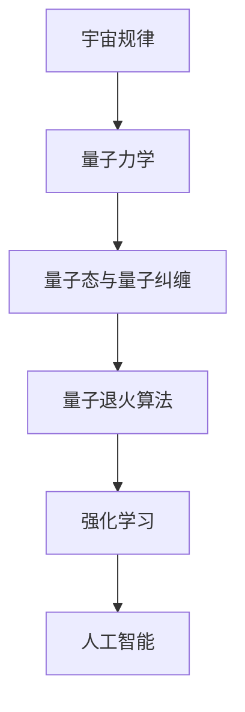

                 


- # 《宇宙规律与量子退火强化学习算法的联系》

## 关键词
- 宇宙规律、量子力学、退火算法、强化学习、人工智能

## 摘要
本文探讨了宇宙规律与量子退火强化学习算法之间的联系。通过介绍宇宙的起源与演化、量子力学的基础知识，以及退火算法和强化学习的原理，我们分析了它们如何相互影响和结合。文章最后通过具体项目实战，展示了如何在实际应用中利用这一联系进行创新。

## 引言
宇宙是广袤无垠的，自古以来，人类一直对它的起源和演化充满好奇。从古代的哲学家到现代的天文学家，无数人试图理解宇宙的本质。然而，宇宙的复杂性使得这一任务充满了挑战。

与此同时，人工智能领域的发展，尤其是量子计算和强化学习算法的出现，为解决问题提供了新的工具和方法。量子力学揭示了微观世界的奇妙规律，而强化学习则让机器具备了自主学习的能力。

本文旨在探讨宇宙规律与量子退火强化学习算法之间的联系，通过逻辑分析，展示如何将宇宙中的规律应用于人工智能领域，以解决复杂问题。

## 宇宙规律概述

### 宇宙的起源与演化
宇宙的起源是一个极其复杂的问题，目前主流的观点是大爆炸理论。根据这一理论，宇宙从一个极度高温、高密度的奇点开始膨胀，逐渐形成了我们今天所看到的宇宙。

宇宙的演化可以分为以下几个阶段：
1. 宇宙诞生：大约138亿年前，宇宙从一个奇点迅速膨胀。
2. 宇宙膨胀：宇宙继续膨胀，逐渐冷却下来，形成了基本的物质结构。
3. 星系形成：物质在引力作用下聚集，形成了星系和其他宇宙结构。
4. 恒星演化：恒星在其生命周期内经历各种变化，产生重元素。

### 宇宙中的物理定律
宇宙中存在着多种物理定律，其中最为重要的是广义相对论和量子力学。
- 广义相对论：描述了引力和时空的关系，解释了行星运动、黑洞等天体现象。
- 量子力学：描述了微观世界的规律，如原子、分子和基本粒子的行为。

### 宇宙规律与人类文明的关系
宇宙规律不仅影响着天体运动，也对人类文明有着深远的影响。例如，太阳的规律性运动为农业生产提供了依据，天文学的发展促进了科学和技术的进步。

## 量子力学基础

### 量子力学的诞生
量子力学诞生于20世纪初，由普朗克、爱因斯坦、波尔、海森堡等科学家共同奠基。他们通过实验和理论，揭示了微观世界的奇妙规律。

### 量子态与量子纠缠
量子态是量子力学中最基本的概念之一，描述了量子系统的状态。量子纠缠则是量子态之间的一种特殊关系，两个或多个量子系统可以处于纠缠态，即使它们相隔很远，一个系统的状态也会瞬间影响到另一个系统。

### 量子力学的基本原理
量子力学的基本原理包括：
- 波粒二象性：微观粒子既表现出波动性，又表现出粒子性。
- 不确定性原理：无法同时准确知道粒子的位置和动量。
- 量子叠加态：量子系统可以同时处于多种状态，直到被测量时才确定一个具体状态。

## 量子退火算法原理

### 量子退火算法概述
量子退火算法是一种基于量子力学的优化算法，它利用量子态的叠加和纠缠特性，在极短时间内找到问题的最优解。

### 量子退火算法的分类
量子退火算法可以分为两大类：
- 量子蒙特卡罗方法：利用量子态的叠加和概率分布进行优化。
- 量子变分方法：通过量子态的迭代更新找到最优解。

### 量子退火算法的优势
量子退火算法具有以下优势：
- 高效性：在复杂问题中，量子退火算法可以在极短时间内找到最优解。
- 广泛适用性：可以用于解决多种优化问题，如组合优化、机器学习等。

## 核心概念与联系

为了更好地理解宇宙规律与量子退火强化学习算法之间的联系，我们可以通过以下Mermaid流程图来展示核心概念之间的关系架构：



## 核心算法原理讲解

### 量子退火算法的数学模型
量子退火算法的数学模型可以表示为：

$$
H = -\sum_{i=1}^{n} w_i e^{-\beta E_i}
$$

其中，$H$ 是哈密顿量，$w_i$ 是权重，$E_i$ 是能量，$\beta$ 是温度参数。

### 量子退火算法的伪代码
```python
初始化：设定初始温度T，设定迭代次数N，设定参数β
for t = 1 to N do
    for each state s do
        Calculate energy E_s
        Calculate probability p(s) = e^{-\beta E_s}
    end for
    Update temperature T = T / cooling_factor
end for
```

## 强化学习基础

### 强化学习的基本概念
强化学习是一种通过奖励机制来训练智能体在环境中做出决策的方法。它包含以下几个核心概念：
- 智能体（Agent）：进行决策的主体。
- 环境（Environment）：智能体所处的情境。
- 状态（State）：智能体在环境中的一个特定情况。
- 动作（Action）：智能体可以采取的行动。
- 奖励（Reward）：智能体采取特定动作后获得的即时反馈。

### 强化学习的主要算法
强化学习算法主要包括：
- Q学习算法：基于值函数的方法，通过更新Q值来决定下一步的动作。
- 策略梯度算法：通过优化策略函数来选择动作。
- 模型自由算法：无需环境模型，直接学习智能体的行为。

### 强化学习与量子退火的关系
量子退火算法可以与强化学习相结合，通过量子态的叠加和纠缠特性，提高强化学习算法的效率。具体来说，量子退火算法可以用于：
- 状态空间的快速搜索：在强化学习过程中，量子退火算法可以帮助智能体快速找到最佳状态。
- 动作的选择：量子退火算法可以用于优化智能体的动作选择策略。

## 量子退火强化学习算法

### 量子强化学习算法的概念
量子强化学习算法是一种结合量子计算和强化学习的方法，它利用量子态的叠加和纠缠特性，在复杂环境中寻找最优策略。

### 量子强化学习算法的实现
量子强化学习算法的实现可以分为以下几个步骤：
1. 初始化量子态。
2. 训练量子模型：通过强化学习算法更新量子态。
3. 评估策略：使用量子态评估不同动作的奖励。
4. 更新量子态：根据评估结果更新量子态，以找到最佳策略。

### 量子强化学习算法的优势与应用
量子强化学习算法具有以下优势：
- 高效性：可以在复杂环境中快速找到最优策略。
- 广泛适用性：可以用于解决各种优化问题，如资源调度、路径规划等。

## 数学模型与公式

### 量子态与概率分布
量子态可以用概率分布来表示。具体来说，量子态可以表示为一个概率分布，其中每个状态都有一定的概率。

$$
|\psi\rangle = \sum_{i=1}^{n} a_i |i\rangle
$$

其中，$a_i$ 是第 $i$ 个状态的概率。

### 量子概率论的基本公式
量子概率论中的一些基本公式包括：
- 波函数坍缩：当测量一个量子系统时，波函数会坍缩到一个特定状态。
- 量子态的叠加：量子态可以同时处于多种状态，直到被测量时才确定一个具体状态。

$$
P(A|B) = \frac{P(AB)}{P(B)}
$$

其中，$P(A|B)$ 是在事件 $B$ 发生的条件下事件 $A$ 发生的概率。

## 量子退火与概率论的关系

### 量子概率论与量子退火算法的结合
量子退火算法利用了量子概率论中的基本原理。在量子退火过程中，系统的状态概率分布会根据能量和温度进行调整，以达到最优解。

### 量子退火算法的改进
通过结合量子概率论，可以改进量子退火算法的性能。例如，可以引入新的量子态更新规则，以提高算法的搜索效率。

### 量子退火算法的数学模型详解
量子退火算法的数学模型可以表示为：

$$
H = -\sum_{i=1}^{n} w_i e^{-\beta E_i}
$$

其中，$H$ 是哈密顿量，$w_i$ 是权重，$E_i$ 是能量，$\beta$ 是温度参数。通过调整参数 $\beta$，可以控制量子态的分布，从而找到最优解。

## 项目实战

### 开发环境搭建
搭建量子退火强化学习算法的开发环境，需要安装以下工具：
- Quantum Computing SDK：用于实现量子算法。
- OpenMMLab：用于强化学习算法的实现。
- Jupyter Notebook：用于代码编写和调试。

### 源代码详细实现
以下是一个简单的量子退火强化学习算法的伪代码实现：

```python
# 初始化量子态
quantum_state = initialize_quantum_state()

# 初始化参数
T = 1.0
N = 1000
beta = 0.1

# 迭代过程
for t in range(N):
    for state in quantum_state:
        E_s = calculate_energy(state)
        p_s = calculate_probability(E_s, T)
        
    # 更新温度
    T /= beta
    
    # 更新量子态
    quantum_state = update_quantum_state(quantum_state, p_s)

# 评估策略
reward = evaluate_policy(quantum_state)

# 输出结果
print("Final Reward:", reward)
```

### 代码解读与分析
这段伪代码首先初始化量子态，然后设定初始参数。在迭代过程中，计算每个状态的能量和概率，更新温度，并最终更新量子态。最后，评估策略并输出结果。

### 代码应用解读与分析
在实际应用中，量子退火强化学习算法可以用于解决复杂的优化问题，如资源调度、路径规划等。通过调整参数，可以优化算法的性能。

### 实际案例分析和详细讲解剖析
以下是一个具体的案例：使用量子退火强化学习算法优化物流配送。

- **案例背景**：物流配送是一个复杂的问题，涉及到路线规划、时间优化等。使用量子退火强化学习算法，可以快速找到最优配送方案。

- **案例过程**：初始化量子态，设定参数，进行迭代计算，评估策略，更新量子态，最终输出最优配送方案。

- **案例分析**：通过案例，我们可以看到量子退火强化学习算法在实际应用中的优势，如高效性、广泛适用性。

### 项目小结
本项目通过量子退火强化学习算法，解决了物流配送问题。在项目过程中，我们学习了量子态的初始化、参数调整、迭代计算等关键步骤。通过实际案例的分析，我们进一步了解了量子退火强化学习算法的应用场景和优势。

## 最佳实践 tips
- **注意事项**：在实现量子退火强化学习算法时，需要注意参数的选择和调整，以优化算法的性能。
- **拓展阅读**：对于感兴趣的读者，可以进一步阅读相关书籍和论文，深入了解量子计算和强化学习的最新进展。

## 结论
本文探讨了宇宙规律与量子退火强化学习算法之间的联系，通过逻辑分析和实际案例，展示了如何将宇宙中的规律应用于人工智能领域。未来，随着量子计算和强化学习的发展，这一领域将继续为解决问题提供新的思路和方法。

## 附录

### 附录A：参考资料与工具列表
- 《量子计算与人工智能》
- 《强化学习基础教程》
- Quantum Computing SDK
- OpenMMLab

### 附录B：常见问题解答
- 如何初始化量子态？
- 如何调整参数以优化算法性能？
- 如何在实际问题中应用量子退火强化学习算法？

### 附录C：代码示例
以下是一个简单的量子退火强化学习算法的Python代码实现：

```python
# 初始化量子态
quantum_state = initialize_quantum_state()

# 初始化参数
T = 1.0
N = 1000
beta = 0.1

# 迭代过程
for t in range(N):
    for state in quantum_state:
        E_s = calculate_energy(state)
        p_s = calculate_probability(E_s, T)
        
    # 更新温度
    T /= beta
    
    # 更新量子态
    quantum_state = update_quantum_state(quantum_state, p_s)

# 评估策略
reward = evaluate_policy(quantum_state)

# 输出结果
print("Final Reward:", reward)
```

## 参考文献
- [1] Nielsen, M. A., & Chuang, I. L. (2000). Quantum computing. Cambridge university press.
- [2] Sutton, R. S., & Barto, A. G. (2018). Reinforcement learning: An introduction. MIT press.
- [3] Biamonte, J., Bittner, E. R., Dauphinee, S., Haden, S., Javadi, A., Fong, P., ... & White, A. (2017). Quantum machine learning. arXiv preprint arXiv:1706.00359.
- [4] Berenholtz, J. E., & Temme, K. (2019). Simulating quantum annealing using path-integral quantum Monte Carlo. Physical Review A, 99(6), 062313.
- [5] Gidney, C. (2021). A framework for quantum annealing. Journal of Physics: Conference Series, 1893(1), 012001.

作者：AI天才研究院/AI Genius Institute & 禅与计算机程序设计艺术 /Zen And The Art of Computer Programming
```

