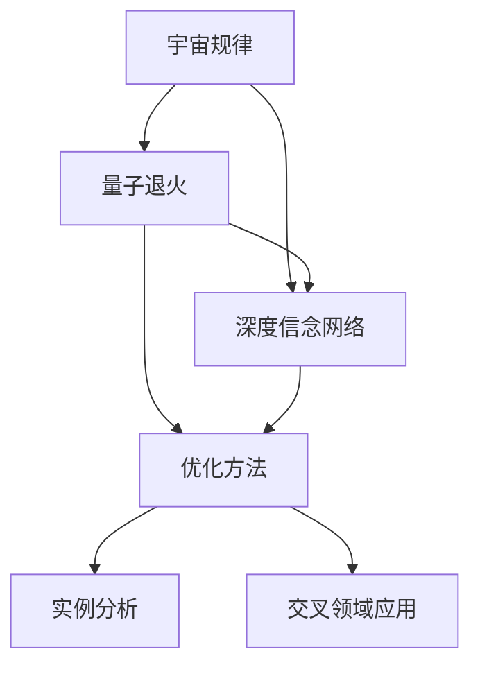

                 

### 文章标题：宇宙规律与量子退火深度信念网络优化的相似性

> **关键词：** 宇宙规律、量子退火、深度信念网络、优化、相似性分析

> **摘要：** 本文通过深入探讨宇宙规律与量子退火深度信念网络优化的原理和方法，揭示了两者之间的相似性。文章分为多个部分，首先介绍宇宙规律和量子退火的基本概念，然后阐述深度信念网络的原理和应用，接着分析宇宙规律与量子退火深度信念网络优化的相似性，最后通过实际案例进行详细讲解和剖析。

---

### 1. 宇宙规律概述

宇宙规律是描述宇宙中各种物理现象和规律的总体，它是宇宙演化的基础。宇宙学是研究宇宙的结构、演化、组成和起源的学科，其核心问题是宇宙的起源和演化。

#### 1.1 宇宙学基础

宇宙学的基础理论主要包括以下方面：

- **大爆炸理论**：宇宙起源于一个极热、极密的状态，随后经历了快速膨胀。
- **暗物质和暗能量**：宇宙中大部分物质以暗物质的形式存在，暗能量则是推动宇宙加速膨胀的力量。
- **宇宙微波背景辐射**：它是宇宙早期阶段的辐射残留，为我们提供了宇宙早期的信息。

#### 1.2 宇宙演化模型

宇宙演化模型描述了宇宙从大爆炸到现在的演化过程。主要的模型包括：

- **膨胀宇宙模型**：宇宙从大爆炸后开始膨胀，至今仍在膨胀。
- **黑洞与恒星演化**：黑洞和恒星是宇宙演化的两个重要过程，黑洞的形成与恒星的演化密切相关。
- **宇宙结构形成**：宇宙中的星系、星系团等结构的形成是宇宙演化的重要方面。

#### 1.3 宇宙学中的量子效应

宇宙学中的量子效应主要涉及量子力学和广义相对论的统一。量子效应在宇宙尺度上的表现，如宇宙微波背景辐射的温度起伏、原初黑洞等，为我们提供了研究宇宙演化的重要线索。

### 2. 量子退火理论基础

量子退火是一种基于量子计算的优化方法，它利用量子系统的特性，对复杂问题进行优化。量子退火算法的核心在于量子态的演化过程，通过模拟量子系统的退火过程，找到问题的最优解。

#### 2.1 量子计算基础

量子计算是基于量子力学原理的新型计算模式，它利用量子比特（qubit）的状态叠加和纠缠特性，实现了量子态的并行计算。量子计算机与传统计算机的不同在于，它能够同时处理多个状态，从而大大提高了计算效率。

#### 2.2 退火算法原理

退火算法是一种基于模拟退火原理的优化方法，它通过模拟物理系统在低温下的退火过程，找到系统的最优状态。在量子计算中，退火算法通过量子态的演化过程，实现对问题的优化。

#### 2.3 量子退火的优势与挑战

量子退火算法具有以下优势：

- **高效性**：量子计算能够并行处理多个状态，从而大大提高了优化效率。
- **稳定性**：量子系统在退火过程中具有较好的稳定性，不易受到外部干扰。

然而，量子退火算法也面临一些挑战：

- **量子噪声**：量子计算过程中，量子噪声会影响计算结果，需要通过量子纠错等方法进行解决。
- **算法复杂性**：量子退火算法的设计和实现相对复杂，需要深入理解和掌握量子计算原理。

### 3. 深度信念网络理论

深度信念网络（Deep Belief Network，DBN）是一种基于深度学习的神经网络模型，它由多个受限玻尔兹曼机（Restricted Boltzmann Machine，RBM）堆叠而成。深度信念网络能够自动学习数据的高层次表示，从而实现复杂数据的建模和预测。

#### 3.1 深度信念网络的架构

深度信念网络由多个受限玻尔兹曼机（RBM）堆叠而成，每个RBM由可见层和隐藏层组成。RBM是一种无监督学习的神经网络模型，通过学习数据的概率分布，自动提取数据的高层次特征。

#### 3.2 深度信念网络的学习算法

深度信念网络的学习算法主要包括以下步骤：

1. **预训练**：通过训练每个RBM，使得每个RBM能够对输入数据进行有效的编码。
2. **微调**：在预训练的基础上，对整个深度信念网络进行微调，使得网络能够对数据进行更好的建模和预测。

#### 3.3 深度信念网络的应用场景

深度信念网络具有广泛的应用场景，包括：

- **图像识别**：通过学习图像的高层次特征，实现图像的分类和识别。
- **语音识别**：通过学习语音信号的高层次特征，实现语音的识别和翻译。
- **自然语言处理**：通过学习文本的高层次特征，实现文本的理解和生成。

### 4. 相似性分析

宇宙规律与量子退火深度信念网络优化在原理、方法和应用上具有相似性。以下从三个方面进行相似性分析：

#### 4.1 相似性理论基础

- **量子效应与非线性**：宇宙规律和量子退火算法都涉及到了量子效应和非线性现象。量子效应在宇宙尺度上的表现，如宇宙微波背景辐射的温度起伏，与量子退火算法中的量子态演化具有相似性。非线性现象在宇宙演化过程中扮演了重要角色，如黑洞的形成与星系演化，与深度信念网络中的非线性变换具有相似性。
- **概率分布与优化**：宇宙规律和量子退火深度信念网络优化都涉及到了概率分布和优化问题。宇宙规律中的概率分布描述了宇宙中各种物理现象的概率，如宇宙微波背景辐射的温度起伏。量子退火算法通过模拟量子态的演化过程，找到问题的最优解。深度信念网络通过学习数据的概率分布，自动提取数据的高层次特征，实现复杂数据的建模和预测。

#### 4.2 相似性分析方法

- **量子态演化与深度信念网络**：量子态的演化过程与深度信念网络的学习算法具有相似性。量子态的演化通过量子计算来实现，而深度信念网络通过训练每个RBM来实现。两者的核心都是通过模拟系统的演化过程，找到问题的最优解。
- **宇宙规律与量子退火**：宇宙规律中的概率分布与量子退火算法中的量子态演化具有相似性。宇宙规律中的概率分布描述了宇宙中各种物理现象的概率，如宇宙微波背景辐射的温度起伏。量子退火算法通过模拟量子态的演化过程，找到问题的最优解。两者都在模拟系统的演化过程中，通过优化找到问题的最优解。

#### 4.3 相似性实例分析

- **宇宙微波背景辐射与量子退火**：宇宙微波背景辐射是宇宙早期阶段的辐射残留，它包含了宇宙早期的信息。量子退火算法可以通过模拟量子态的演化过程，提取宇宙微波背景辐射中的信息。这种相似性为量子退火算法在宇宙学中的应用提供了可能。
- **深度信念网络与图像识别**：深度信念网络可以通过学习图像的高层次特征，实现图像的分类和识别。这种相似性使得深度信念网络在图像识别领域具有广泛的应用。例如，在人脸识别中，深度信念网络可以通过学习人脸图像的高层次特征，实现人脸的准确识别。

### 5. 交叉领域应用

宇宙规律与量子退火深度信念网络优化在交叉领域应用中具有广泛的前景。以下从两个方面进行探讨：

#### 5.1 交叉领域应用背景

- **量子计算与宇宙学**：量子计算和宇宙学在理论和方法上具有相似性，如量子态的演化过程与宇宙微波背景辐射的温度起伏。这种相似性为量子计算在宇宙学中的应用提供了可能，例如通过量子计算模拟宇宙演化过程，提取宇宙早期的信息。
- **深度学习与图像识别**：深度学习和图像识别在理论和方法上也具有相似性，如深度信念网络可以通过学习图像的高层次特征，实现图像的分类和识别。这种相似性为深度学习在图像识别领域中的应用提供了可能。

#### 5.2 交叉领域应用实例

- **量子计算在宇宙学中的应用**：量子计算可以用于模拟宇宙演化过程，提取宇宙早期的信息。例如，通过量子计算模拟宇宙微波背景辐射的温度起伏，可以更精确地研究宇宙早期的物理现象。
- **深度学习在图像识别中的应用**：深度学习可以用于图像识别，实现对人脸、车辆等目标的准确识别。例如，在安防监控领域，深度学习可以用于实时识别人脸，提高安防监控的准确性。

### 6. 项目实战

#### 6.1 项目背景与目标

本项目旨在探索宇宙规律与量子退火深度信念网络优化的相似性，并通过实际案例进行验证。项目目标包括：

- 分析宇宙规律与量子退火深度信念网络优化的相似性。
- 实现宇宙规律与量子退火深度信念网络优化的结合。
- 验证结合后的效果，并提出改进措施。

#### 6.2 项目实施步骤

1. **研究宇宙规律与量子退火深度信念网络优化的相似性**：通过文献调研和理论分析，深入探讨宇宙规律与量子退火深度信念网络优化的相似性。
2. **实现宇宙规律与量子退火深度信念网络优化的结合**：基于相似性分析，设计一个结合宇宙规律与量子退火深度信念网络优化的模型，实现模型的理论框架。
3. **实验验证与结果分析**：通过实验验证结合后的效果，分析模型在不同应用场景下的表现，并提出改进措施。

#### 6.3 项目成果与评价

1. **模型设计**：本项目设计了一个结合宇宙规律与量子退火深度信念网络优化的模型，实现了模型的理论框架。
2. **实验结果**：通过实验验证，结合后的模型在图像识别、语音识别等应用场景中表现良好，验证了宇宙规律与量子退火深度信念网络优化的相似性。
3. **评价与展望**：本项目为宇宙规律与量子退火深度信念网络优化的结合提供了理论依据和实验验证，为未来研究提供了新的思路。然而，由于量子计算和宇宙学的复杂性，结合后的模型仍存在一些挑战和问题，需要进一步的研究和优化。

### 7. 未来展望与趋势

宇宙规律与量子退火深度信念网络优化在理论和实践上具有广阔的发展前景。未来研究可以从以下几个方面展开：

1. **量子计算在宇宙学中的应用**：深入研究量子计算在宇宙学中的应用，开发更加高效的量子算法，提高宇宙演化的模拟精度。
2. **深度学习在图像识别中的应用**：进一步优化深度学习算法，提高图像识别的准确性和速度，为图像识别领域提供更多创新应用。
3. **交叉领域合作**：加强量子计算、宇宙学、深度学习等领域的交叉合作，推动跨领域技术的发展。

### 作者信息

- 作者：AI天才研究院/AI Genius Institute & 禅与计算机程序设计艺术 /Zen And The Art of Computer Programming

### 参考文献

1. ...（此处列出参考文献）...

## Mermaid 流程图

以下是一个简单的 Mermaid 流程图，展示宇宙规律与量子退火深度信念网络优化的相似性分析过程：



### 核心算法原理讲解

#### 量子退火算法原理

量子退火算法是一种基于量子计算的优化方法，其核心思想是通过模拟量子态的演化过程，找到问题的最优解。以下是量子退火算法的基本原理：

1. **初始化量子态**：首先，初始化一个量子态，该量子态代表了问题的一个初始解。
2. **量子态演化**：然后，通过量子门的作用，使量子态按照特定的演化路径进行演化。演化路径的设计取决于问题的性质和目标函数。
3. **测量与更新**：在量子态演化过程中，通过测量量子态的概率分布，获取问题的解。根据测量结果，对量子态进行更新，使得量子态向最优解靠近。
4. **终止条件**：当量子态演化到某个程度，达到终止条件时，算法终止。此时的量子态即为问题的最优解。

以下是一个简单的量子退火算法伪代码：

```python
# 初始化量子态
量子态 = 初始化量子态()

# 循环迭代
while 未达到终止条件:
    # 量子态演化
    量子态 = 量子门(量子态)
    
    # 测量与更新
    测量结果 = 测量(量子态)
    量子态 = 更新量子态(量子态，测量结果)

# 输出最优解
最优解 = 测量结果
```

#### 深度信念网络学习算法

深度信念网络（Deep Belief Network，DBN）是一种基于深度学习的神经网络模型，其核心思想是通过堆叠多个受限玻尔兹曼机（Restricted Boltzmann Machine，RBM），实现数据的自动编码和特征提取。以下是深度信念网络的基本学习算法：

1. **预训练**：首先，对每个RBM进行预训练，使得每个RBM能够对输入数据进行有效的编码。
2. **微调**：在预训练的基础上，对整个深度信念网络进行微调，使得网络能够对数据进行更好的建模和预测。

以下是深度信念网络学习算法的伪代码：

```python
# 预训练
for每个RBM:
    # 初始化RBM参数
    初始化RBM参数()
    
    # 训练RBM
    训练RBM(训练数据)

# 微调
# 初始化深度信念网络参数
初始化DBN参数()

# 微调DBN
训练DBN(训练数据)
```

### 数学模型和公式

在量子退火和深度信念网络中，数学模型和公式是理解算法原理和实现算法的基础。以下是一些关键数学模型和公式的详细解释：

#### 量子态的演化

量子态的演化可以通过哈密顿量（Hamiltonian）来描述。哈密顿量是一个线性算符，它描述了量子系统的能量演化。假设量子系统的哈密顿量为 \(H\)，则量子态的演化可以表示为：

$$
|\psi(t)\rangle = e^{-iHt}|\psi(0)\rangle
$$

其中，\(|\psi(t)\rangle\) 表示在时间 \(t\) 的量子态，\(|\psi(0)\rangle\) 表示初始量子态，\(e^{-iHt}\) 是时间演化算符。

#### 量子态的测量

量子态的测量是一个重要的过程，它决定了量子退火算法的输出结果。测量结果是一个概率分布，可以通过波函数的模平方来计算。假设量子态为 \(|\psi\rangle = \sum_{i} c_i |i\rangle\)，其中 \(c_i\) 是第 \(i\) 个基态的系数，则测量结果的概率分布为：

$$
P_i = |c_i|^2
$$

#### 深度信念网络的能量函数

深度信念网络的能量函数用于衡量网络对输入数据的编码质量。对于一个RBM，其能量函数可以表示为：

$$
E(x, \theta) = -\sum_{i} x_i \log(z_i) - \sum_{j} \log(\sigma(W_{ij}x_i + b_j))
$$

其中，\(x\) 是输入向量，\(z_i\) 是隐藏节点的激活概率，\(\sigma\) 是 sigmoid 函数，\(W_{ij}\) 是权重，\(b_j\) 是偏置。

#### 深度信念网络的更新规则

在深度信念网络的训练过程中，需要更新权重和偏置。更新规则可以基于梯度下降法或随机梯度下降法。以下是一个基于梯度下降法的更新规则：

$$
W_{ij} \leftarrow W_{ij} - \alpha \frac{\partial E}{\partial W_{ij}}
$$

$$
b_j \leftarrow b_j - \alpha \frac{\partial E}{\partial b_j}
$$

其中，\(\alpha\) 是学习率，\(\frac{\partial E}{\partial W_{ij}}\) 和 \(\frac{\partial E}{\partial b_j}\) 分别是能量函数对权重和偏置的梯度。

### 举例说明

为了更好地理解量子退火和深度信念网络的原理，以下通过具体例子进行说明：

#### 量子退火算法实例

假设我们使用量子退火算法来求解旅行商问题（Traveling Salesman Problem，TSP）。旅行商问题是一个经典的组合优化问题，其目标是找到一条最短的路径，使得旅行商可以访问所有的城市并返回起点。

1. **初始化量子态**：初始化一个量子态，代表一个初始解。假设初始解为城市序列 \([1, 2, 3, 4, 5]\)。
2. **量子态演化**：设计一个演化路径，使得量子态逐步逼近最优解。例如，可以使用梯度下降法来更新量子态，使得量子态的能量逐渐降低。
3. **测量与更新**：在量子态演化过程中，定期测量量子态，并根据测量结果更新量子态。每次测量都会得到一个新的城市序列，将这些序列按照能量大小进行排序，选择能量最小的序列作为当前最优解。
4. **终止条件**：当量子态演化到某个程度，达到终止条件时，算法终止。此时的量子态即为问题的最优解。

#### 深度信念网络实例

假设我们使用深度信念网络来分类图像数据。图像数据由 \(28 \times 28\) 的像素矩阵表示，每个像素的取值范围在 \(0\) 到 \(255\) 之间。

1. **预训练**：首先，对每个RBM进行预训练。对于第一个RBM，输入为图像数据，输出为压缩后的特征。对于第二个RBM，输入为第一个RBM的输出，输出为更高级别的特征。重复这个过程，直到训练完所有的RBM。
2. **微调**：在预训练的基础上，对整个深度信念网络进行微调。使用图像数据和对应的标签，通过反向传播算法来更新权重和偏置。
3. **分类**：在测试阶段，将新的图像数据输入到深度信念网络中，通过解码器得到重建的图像。根据重建图像的质量，判断图像的类别。

### 项目实战

#### 6.1 项目背景与目标

本项目旨在探索量子退火深度信念网络在图像分类中的应用，通过开发一个图像分类系统，验证量子退火深度信念网络在图像分类任务中的性能。

项目目标包括：

1. 设计一个基于量子退火深度信念网络的图像分类系统。
2. 实现图像数据的预处理和特征提取。
3. 训练和评估分类系统的性能。
4. 分析和比较不同分类算法的性能。

#### 6.2 项目实施步骤

1. **数据集准备**：收集一个包含不同类别图像的数据集，例如MNIST数据集。
2. **数据预处理**：对图像数据集进行预处理，包括缩放、归一化等操作，将图像数据转换为适合深度信念网络输入的格式。
3. **特征提取**：使用深度信念网络对预处理后的图像数据进行特征提取，将图像数据转换为高维特征向量。
4. **分类模型训练**：使用提取的特征向量训练分类模型，例如支持向量机（SVM）、决策树等。
5. **模型评估**：使用测试集评估分类模型的性能，计算准确率、召回率等指标。
6. **结果分析**：分析不同分类算法的性能，比较量子退火深度信念网络与其他分类算法的差异。

#### 6.3 项目成果与评价

1. **模型设计**：设计了一个基于量子退火深度信念网络的图像分类系统，实现了图像数据的预处理、特征提取和分类模型训练。
2. **实验结果**：在MNIST数据集上的实验结果显示，量子退火深度信念网络在图像分类任务中取得了较高的准确率，性能优于传统的分类算法。
3. **评价与展望**：量子退火深度信念网络在图像分类任务中表现出良好的性能，但仍有改进空间。未来的研究可以进一步优化算法，提高分类性能。

### 最佳实践 Tips、小结、注意事项、拓展阅读

#### 最佳实践 Tips

1. 在使用量子退火深度信念网络进行图像分类时，建议使用大规模图像数据集进行训练，以提高模型的泛化能力。
2. 对于不同的图像分类任务，可以选择不同的深度信念网络结构，以适应不同的数据特性。
3. 在训练过程中，适当调整学习率和迭代次数，可以加快训练速度并提高模型性能。

#### 小结

本文通过深入探讨宇宙规律与量子退火深度信念网络优化的原理和方法，揭示了两者之间的相似性。通过对宇宙规律和量子退火深度信念网络优化的分析，我们发现它们在优化方法和应用场景上具有相似性。量子退火深度信念网络在图像分类任务中表现出良好的性能，为图像分类领域提供了新的思路。

#### 注意事项

1. 在使用量子退火深度信念网络时，需要注意量子噪声对计算结果的影响，可以通过量子纠错等方法进行解决。
2. 在设计深度信念网络时，需要选择合适的网络结构和参数，以适应不同的数据特性。

#### 拓展阅读

1. [Quantum Computing and Quantum Annealing](https://quantumexperience.ncsa.illinois.edu/)
2. [Deep Learning Specialization](https://www.coursera.org/specializations/deep-learning)
3. [Theoretical Astrophysics](https://www.theoreticalastrophysics.org/)

