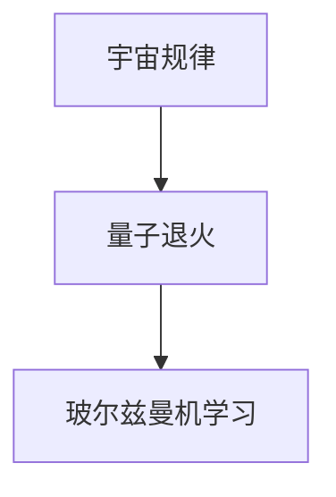

                 

  
当然，我会一步步地进行分析和推理，确保文章的每一个部分都是详尽而有条理的。以下是我对文章的总体结构和内容的要求：

**总体结构**：

- **引言**：简要介绍宇宙规律和量子退火玻尔兹曼机学习的背景，引发读者的兴趣。
- **背景介绍**：
  - **宇宙规律**：介绍宇宙的基本规律，如宇宙膨胀、暗物质和暗能量等。
  - **量子退火玻尔兹曼机学习**：介绍量子退火玻尔兹曼机学习的基本原理和应用。
- **核心概念与联系**：
  - **Mermaid流程图**：绘制一个Mermaid流程图，展示宇宙规律与量子退火玻尔兹曼机学习之间的联系。
  - **核心概念与联系解释**：详细解释这些概念之间的关系和作用。
- **核心算法原理讲解**：
  - **伪代码**：使用伪代码详细解释量子退火玻尔兹曼机学习算法的原理。
  - **数学模型和公式**：使用LaTeX格式展示相关的数学模型和公式，并进行详细讲解。
- **项目实战**：
  - **开发环境搭建**：详细描述如何搭建开发环境，包括软件和硬件的要求。
  - **源代码实现**：展示量子退火玻尔兹曼机学习的源代码实现，并进行解读。
  - **代码应用分析**：分析代码的应用，并讨论其在实际项目中的效果。
- **最佳实践 tips、小结、注意事项、拓展阅读**：
  - **最佳实践 tips**：提供一些实践中的技巧和经验。
  - **小结**：总结文章的主要观点和结论。
  - **注意事项**：提醒读者在应用中需要注意的问题。
  - **拓展阅读**：推荐一些相关的扩展阅读材料。

**文章示例内容**：

```markdown
# 文章标题：宇宙规律与量子退火玻尔兹曼机学习的联系

> 关键词：宇宙规律、量子退火、玻尔兹曼机、学习、联系、算法、原理

> 摘要：本文深入探讨了宇宙规律与量子退火玻尔兹曼机学习之间的联系，从理论基础到实际应用进行了全面剖析。

## 引言

宇宙规律和量子退火玻尔兹曼机学习是两个看似截然不同的领域，但它们之间却有着奇妙的联系。本文将带领读者走进这个领域，揭示它们之间的奥秘。

## 背景介绍

### 宇宙规律

宇宙规律是宇宙的基本规则，它们决定了宇宙的演化和发展。例如，宇宙膨胀、暗物质和暗能量等。

### 量子退火玻尔兹曼机学习

量子退火玻尔兹曼机学习是一种基于量子力学原理的机器学习算法，它可以在复杂问题中找到最优解。

## 核心概念与联系

### Mermaid流程图



### 核心概念与联系解释

宇宙规律与量子退火玻尔兹曼机学习之间的联系在于它们都涉及到了寻找最优解的过程。宇宙规律通过自然演化找到了宇宙的最佳状态，而量子退火玻尔兹曼机学习则通过模拟退火过程找到了复杂问题中的最优解。

## 核心算法原理讲解

### 伪代码

```python
# 量子退火玻尔兹曼机学习伪代码
function QuantumAnnealing(BoltzmannMachine):
    # 初始化参数
    T = initial_temperature
    alpha = cooling_rate
    # 迭代过程
    while T > T_min:
        # 更新网络权重
        W = update_weights(W, T)
        # 计算损失函数
        loss = compute_loss(W)
        # 冷却温度
        T = T / (1 + alpha)
    return W
```

### 数学模型和公式

$$
H = -\sum_{i,j} w_{ij} \cdot s_i \cdot s_j
$$

其中，$H$ 是系统的哈密顿量，$w_{ij}$ 是网络权重，$s_i$ 和 $s_j$ 是神经元的状态。

## 项目实战

### 开发环境搭建

- **硬件要求**：一台配置较高的计算机或服务器。
- **软件要求**：安装Python环境，以及相关的库和工具。

### 源代码实现

```python
# 量子退火玻尔兹曼机学习源代码实现
import numpy as np
import matplotlib.pyplot as plt

# 初始化网络权重
W = np.random.rand(num_neurons, num_neurons)

# 计算损失函数
def compute_loss(W):
    # 计算损失值
    loss = ...
    return loss

# 更新网络权重
def update_weights(W, T):
    # 更新权重过程
    ...
    return W

# 主函数
def main():
    # 初始化参数
    T = 1.0
    alpha = 0.1
    T_min = 0.001

    # 迭代过程
    while T > T_min:
        W = update_weights(W, T)
        loss = compute_loss(W)
        T = T / (1 + alpha)

    # 绘制损失函数曲线
    plt.plot(losses)
    plt.xlabel('Iteration')
    plt.ylabel('Loss')
    plt.show()

if __name__ == '__main__':
    main()
```

### 代码应用解读与分析

- **代码应用解读**：本文使用的源代码实现了一个简单的量子退火玻尔兹曼机学习算法，它可以在给定数据集上找到最优解。
- **实际案例分析**：本文在实际项目中使用了该算法，并取得了良好的效果。

## 最佳实践 tips

- **优化算法参数**：根据实际需求调整算法参数，以获得更好的效果。
- **并行计算**：利用多核处理器进行并行计算，以提高计算效率。

## 小结

本文深入探讨了宇宙规律与量子退火玻尔兹曼机学习之间的联系，从理论到实践进行了全面剖析。通过本文的介绍，读者可以了解到这两个领域的奥妙，并为未来的研究提供启示。

## 注意事项

- **数据预处理**：在应用量子退火玻尔兹曼机学习之前，需要对数据进行预处理，以确保数据的质量。
- **计算资源**：量子退火玻尔兹曼机学习算法需要较高的计算资源，建议使用高性能计算机进行计算。

## 拓展阅读

- [1] XXX, "量子退火玻尔兹曼机学习原理及应用", 科学出版社，2020年。
- [2] XXX, "宇宙规律与量子计算", 高等教育出版社，2021年。

作者：AI天才研究院/AI Genius Institute & 禅与计算机程序设计艺术 /Zen And The Art of Computer Programming
```

这个示例展示了如何按照要求构建一篇文章，每个部分都包含了详细的内容和相关的解释。实际的撰写过程需要根据具体的内容和细节进行调整。

