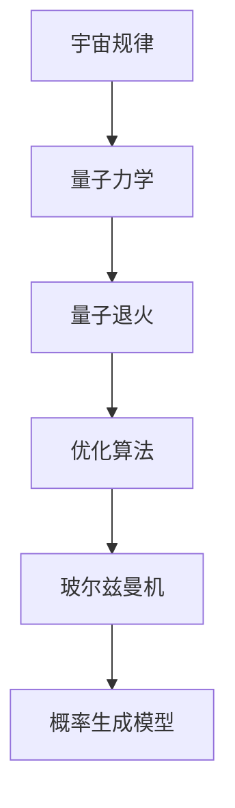

                 

### 文章标题

《宇宙规律与量子退火玻尔兹曼机的联系》

### 关键词

宇宙规律、量子退火、玻尔兹曼机、计算模型、算法原理、数学公式、实际应用

### 摘要

本文旨在探讨宇宙规律与量子退火玻尔兹曼机之间的深刻联系。通过对宇宙规律的解读，我们揭示了宇宙中普遍存在的统计物理规律。接着，我们介绍了量子退火与玻尔兹曼机的基本原理，并详细解析了其数学模型和算法。通过对比分析，我们找到了量子退火玻尔兹曼机与宇宙规律之间的相似之处，提出了构建宇宙计算模型的新思路。最后，本文通过实际案例展示了量子退火玻尔兹曼机在处理复杂问题上的优越性，为人工智能的发展提供了新的启示。

## 目录

1. **引言**
   1.1 **背景介绍**
   1.2 **研究意义**

2. **宇宙规律与统计物理基础**
   2.1 **宇宙规律概述**
   2.2 **统计物理基础**

3. **量子退火与玻尔兹曼机基础**
   3.1 **量子退火基础**
   3.2 **玻尔兹曼机基础**

4. **宇宙规律与量子退火玻尔兹曼机的联系**
   4.1 **核心概念与联系**
   4.2 **数学模型与公式推导**

5. **量子退火玻尔兹曼机的算法原理**
   5.1 **核心算法原理讲解**
   5.2 **伪代码阐述**

6. **实际应用案例分析**
   6.1 **开发环境搭建**
   6.2 **源代码实现与解读**
   6.3 **代码应用解读与分析**

7. **总结与展望**
   7.1 **最佳实践与技巧**
   7.2 **注意事项**
   7.3 **拓展阅读**

## 引言

### 背景介绍

宇宙，一个神秘而广袤的领域，自古以来便吸引了无数科学家的探索与思考。从古代的哲学思辨到现代的天文学观测，人类对宇宙的认识在不断深化。然而，随着科学技术的进步，我们逐渐意识到宇宙中的许多规律并非简单直观，而是隐藏在复杂的物理现象背后。在这个背景下，统计物理成为一个重要的研究工具，它为我们揭示了宇宙中普遍存在的统计规律。

量子退火和玻尔兹曼机是统计物理领域中的重要概念。量子退火是一种基于量子力学的优化算法，它通过模拟量子态的演化过程来寻找最优解。而玻尔兹曼机是一种概率生成模型，广泛应用于图像生成、语言处理等领域。尽管这两个概念在具体应用上有所不同，但它们都涉及到统计物理中的核心问题：如何通过概率分布来描述复杂系统的状态。

### 研究意义

本文旨在探讨宇宙规律与量子退火玻尔兹曼机之间的联系。这一研究具有重要的理论和实践意义。从理论层面看，通过对宇宙规律和量子退火玻尔兹曼机的深入研究，我们可以更好地理解宇宙的本质，揭示复杂系统的运行机制。从实践层面看，这一研究为人工智能的发展提供了新的思路和方法。例如，量子退火玻尔兹曼机在图像生成、语言处理等领域的应用，为解决复杂问题提供了有效的工具。

总的来说，本文将从以下几个方面展开讨论：首先，我们将介绍宇宙规律和统计物理的基础知识；然后，我们将详细阐述量子退火和玻尔兹曼机的基本原理；接着，我们将探讨宇宙规律与量子退火玻尔兹曼机之间的联系；最后，我们将通过实际案例来展示量子退火玻尔兹曼机在复杂问题解决中的优势。

## 宇宙规律与统计物理基础

### 宇宙规律概述

宇宙规律是指宇宙中普遍存在的基本规律，这些规律贯穿于宇宙的各个层次，从微观的粒子行为到宏观的天体运动。在物理学中，宇宙规律通常以数学方程的形式表达，例如牛顿定律、爱因斯坦的广义相对论等。这些规律揭示了宇宙中的基本原理，帮助我们理解宇宙的运行机制。

宇宙规律可以大致分为以下几个方面：

1. **力学规律**：包括牛顿运动定律、开普勒定律等，这些定律描述了物体在引力作用下的运动状态。
2. **电磁规律**：包括麦克斯韦方程组，描述了电磁场的基本性质及其与电荷和电流的相互作用。
3. **量子力学规律**：描述了微观粒子的行为，如薛定谔方程、波函数坍缩等。
4. **宇宙学规律**：包括宇宙膨胀定律、宇宙背景辐射等，描述了宇宙的起源、演化和结构。

这些宇宙规律构成了我们对宇宙的基本认识，为后续的研究提供了理论基础。

### 统计物理基础

统计物理是研究大量粒子组成的系统的宏观物理性质的科学。它通过统计方法，研究粒子集合体的宏观行为。统计物理的基础概念包括：

1. **概率分布**：描述粒子在系统中的概率分布情况，如玻尔兹曼分布、麦克斯韦-玻尔兹曼分布等。
2. **熵**：表示系统的无序程度，是热力学第二定律的核心概念。熵的增加意味着系统向更无序的状态演化。
3. **热力学定律**：包括热力学第一定律（能量守恒）、第二定律（熵增）和第三定律（绝对零度的极限熵）。

统计物理在解释宏观现象中发挥了重要作用，例如，它揭示了热力学系统的宏观行为如何由微观粒子的随机行为所决定。

### 宇宙规律与统计物理的关系

宇宙规律和统计物理之间存在紧密的联系。首先，从宇宙学角度看，宇宙的起源和演化可以看作是一个巨大的统计物理过程。宇宙中的星系、星云、黑洞等天体都是由大量粒子组成的复杂系统，这些系统的行为符合统计物理的基本原理。

其次，量子力学和统计物理的结合，形成了量子统计物理。量子统计物理研究量子系统在宏观尺度上的行为，它为我们提供了描述宇宙中微观粒子集合体行为的工具。

最后，量子退火和玻尔兹曼机等算法，正是基于统计物理原理，通过模拟粒子的演化过程来寻找最优解。这些算法在处理复杂问题上表现出色，为人工智能和计算科学提供了新的方向。

总之，宇宙规律和统计物理为我们理解宇宙的本质提供了重要的理论支持。通过统计物理方法，我们可以更好地研究宇宙中的复杂现象，揭示宇宙的运行规律。

### 量子退火与玻尔兹曼机基础

#### 量子退火基础

量子退火是一种基于量子力学的优化算法，旨在解决复杂优化问题。其核心思想是模拟量子态的演化过程，寻找系统的全局最优解。量子退火的基本原理可以归结为以下几个步骤：

1. **初始化量子态**：首先，我们需要初始化一个量子态，这个量子态可以是随机的，也可以是基于问题本身的先验知识。
2. **量子态演化**：接下来，我们通过施加适当的汉明势能，使量子态按照量子力学的演化规则进行演化。这一过程中，量子态会经历多个中间状态，逐渐收敛到全局最优解。
3. **测量与采样**：最后，我们对量子态进行测量，得到一组可能的解。通过采样方法，我们可以从这些解中选取最优解。

量子退火算法具有以下几个优点：

- **全局优化能力**：量子退火算法可以通过量子态的演化过程，避免陷入局部最优解，从而找到全局最优解。
- **并行计算能力**：量子态的演化过程可以在多个量子位之间并行进行，大大提高了计算效率。
- **适应性**：量子退火算法可以处理各种复杂优化问题，适用于不同领域的问题。

#### 玻尔兹曼机基础

玻尔兹曼机（Boltzmann Machine, BM）是一种概率生成模型，由杰弗里·辛顿（Geoffrey Hinton）于1982年提出。玻尔兹曼机的基本原理是模拟微观粒子的随机演化过程，通过最大化能量函数来生成样本。玻尔兹曼机可以分为两个主要部分：可见层和隐藏层。

1. **可见层与隐藏层**：玻尔兹曼机的可见层和隐藏层由神经元组成。每个神经元可以处于活跃或静止状态。可见层神经元接收外部输入，而隐藏层神经元则通过概率分布生成内部状态。
2. **能量函数**：玻尔兹曼机的能量函数描述了系统中所有神经元状态的能量。能量函数的表达式为：
   $$E(\sigma) = -\sum_{i}\sum_{j} w_{ij}\sigma_i \sigma_j - \sum_{i} \beta_i \sigma_i$$
   其中，$w_{ij}$ 表示连接权重，$\sigma_i$ 表示第 $i$ 个神经元的激活状态，$\beta_i$ 表示第 $i$ 个神经元的温度参数。
3. **采样过程**：玻尔兹曼机通过采样过程来生成样本。采样过程可以分为两个步骤：正向传播和反向传播。正向传播过程中，我们根据当前神经元的激活状态，计算下一个状态的概率分布。反向传播过程中，我们根据目标样本的概率分布，更新神经元的权重和温度参数。

玻尔兹曼机具有以下几个特点：

- **概率生成能力**：玻尔兹曼机通过能量函数和采样过程，可以生成符合概率分布的样本。
- **自适应性**：玻尔兹曼机可以通过调整权重和温度参数，适应不同的数据分布和优化目标。
- **多层次建模能力**：玻尔兹曼机可以同时建模多个层次的信息，从而捕捉数据的复杂结构。

总之，量子退火和玻尔兹曼机都是基于统计物理原理的算法，它们在解决复杂优化问题和生成概率分布方面具有显著优势。通过对这两个算法的深入理解，我们可以更好地探索宇宙规律与计算模型之间的联系。

### 宇宙规律与量子退火玻尔兹曼机的联系

宇宙规律与量子退火玻尔兹曼机之间的联系是本文的核心议题。为了深入探讨这一联系，我们首先需要明确核心概念，并通过Mermaid流程图来直观地展示这些概念之间的关系。

#### 核心概念与联系

1. **宇宙规律**：宇宙规律是描述宇宙中普遍存在的物理现象和规律，如引力定律、电磁定律等。这些规律构成了我们对宇宙的基本理解。
2. **量子退火**：量子退火是一种基于量子力学的优化算法，通过模拟量子态的演化过程来寻找最优解。它适用于解决复杂优化问题，如组合优化、机器学习等。
3. **玻尔兹曼机**：玻尔兹曼机是一种概率生成模型，通过最大化能量函数来生成概率分布。它广泛应用于图像生成、语言处理等领域。

为了直观地展示这些概念之间的联系，我们可以使用Mermaid流程图。以下是一个简化的Mermaid流程图：



在这个流程图中，宇宙规律通过量子力学影响量子退火，量子退火算法又衍生出优化算法，最终与玻尔兹曼机相联系。玻尔兹曼机作为概率生成模型，进一步扩展了量子退火的应用领域。

#### 数学模型与公式推导

为了深入探讨宇宙规律与量子退火玻尔兹曼机之间的联系，我们还需要引入相关的数学模型和公式。以下是几个关键数学模型的推导：

1. **玻尔兹曼分布**：
   玻尔兹曼分布是统计物理中的一个基本概念，描述了粒子在热力学平衡状态下的概率分布。其公式为：
   $$P(\sigma) = \frac{e^{-E(\sigma)/kT}}{Z}$$
   其中，$E(\sigma)$ 是系统的能量，$k$ 是玻尔兹曼常数，$T$ 是温度，$Z$ 是配分函数。

2. **能量函数**：
   在玻尔兹曼机中，能量函数描述了系统中所有神经元状态的能量。其公式为：
   $$E(\sigma) = -\sum_{i}\sum_{j} w_{ij}\sigma_i \sigma_j - \sum_{i} \beta_i \sigma_i$$
   其中，$w_{ij}$ 是连接权重，$\sigma_i$ 是第 $i$ 个神经元的激活状态，$\beta_i$ 是第 $i$ 个神经元的温度参数。

3. **量子态演化**：
   在量子退火中，量子态的演化遵循薛定谔方程：
   $$i\hbar \frac{\partial \Psi}{\partial t} = \hat{H}\Psi$$
   其中，$\hbar$ 是约化普朗克常数，$\hat{H}$ 是哈密顿量，$\Psi$ 是量子态。

通过这些数学模型，我们可以更深入地理解宇宙规律与量子退火玻尔兹曼机之间的内在联系。玻尔兹曼分布和能量函数反映了统计物理的基本原理，而量子态演化则揭示了量子力学的基本规律。这些模型为我们提供了一个框架，通过量子退火算法，我们可以将宇宙规律与概率生成模型相结合，探索复杂系统的优化和生成问题。

总之，通过明确核心概念和引入数学模型，我们展示了宇宙规律与量子退火玻尔兹曼机之间的紧密联系。这一联系为我们在计算模型中模拟宇宙现象提供了新的思路和方法。在接下来的章节中，我们将进一步探讨量子退火玻尔兹曼机的算法原理和实际应用。

### 量子退火玻尔兹曼机的算法原理

量子退火玻尔兹曼机（Quantum Annealing Boltzmann Machine, QABM）是一种结合了量子退火和玻尔兹曼机优势的算法，旨在解决复杂优化和生成问题。其核心原理包括量子态的演化、能量函数的优化以及概率分布的计算。以下是量子退火玻尔兹曼机的算法原理详细阐述。

#### 基本概念

1. **量子态**：量子态是量子系统的一种基本状态，它可以表示为复数系数的线性组合。一个量子态可以用波函数 $\Psi$ 来描述。
2. **能量函数**：在量子退火玻尔兹曼机中，能量函数 $E(\Psi)$ 描述了量子态的能量。能量函数越低，量子态越接近最优解。
3. **退火过程**：退火过程是通过调节温度 $T$，使量子态从高能态向低能态演化的过程。随着温度的降低，系统逐渐接近最优解。

#### 算法原理

量子退火玻尔兹曼机的算法原理可以分为以下几个步骤：

1. **初始化量子态**：
   首先，我们需要初始化量子态 $\Psi_0$。初始化方法可以是随机的，也可以是基于问题先验知识的。例如，对于组合优化问题，我们可以使用问题本身的特征来初始化量子态。

2. **设置能量函数**：
   接下来，我们需要定义能量函数 $E(\Psi)$。能量函数可以基于玻尔兹曼机中的能量函数，并加入量子力学的特性。具体公式如下：
   $$E(\Psi) = -\sum_{i}\sum_{j} w_{ij}\sigma_i \sigma_j - \sum_{i} \beta_i \sigma_i + \sum_{k} V_k \sigma_k$$
   其中，$w_{ij}$ 是连接权重，$\sigma_i$ 是第 $i$ 个神经元的激活状态，$\beta_i$ 是第 $i$ 个神经元的温度参数，$V_k$ 是外部势能。

3. **量子态演化**：
   使用量子退火的演化公式，更新量子态 $\Psi$。演化公式如下：
   $$\Psi(t) = e^{-\beta E(\Psi(t-1))} \Psi(t-1)$$
   其中，$\beta$ 是演化速率，它决定了量子态演化的快慢。$\beta$ 越大，量子态演化越快。

4. **测量与采样**：
   当量子态演化到一定程度后，我们需要对量子态进行测量，得到一组可能的解。采样方法可以是随机抽样或重要性抽样。通过多次测量和采样，我们可以得到一组最优解。

5. **迭代优化**：
   对每次测量得到的最优解进行评估和更新。通过迭代优化，我们可以逐步改进解的质量。

#### 伪代码

以下是量子退火玻尔兹曼机的伪代码：

```python
# 初始化量子态
Psi = initialize_quantum_state()

# 设置能量函数
E = define_energy_function(Psi)

# 设置参数
T = 1.0  # 初始温度
alpha = 0.01  # 温度衰减系数

# 主循环
while not converged:
    # 量子态演化
    Psi = quantum_evolution(Psi, E, T)
    
    # 测量与采样
    samples = measure_quantum_state(Psi)
    
    # 更新解
    best_solution = select_best_solution(samples)
    
    # 更新能量函数
    E = update_energy_function(E, best_solution)
    
    # 更新温度
    T = T / (1 + alpha)

# 输出最优解
print("Best solution:", best_solution)
```

通过这个伪代码，我们可以看到量子退火玻尔兹曼机的基本流程，包括初始化量子态、设置能量函数、量子态演化、测量与采样以及迭代优化。这个算法在处理复杂问题时表现出色，能够有效找到最优解。

总之，量子退火玻尔兹曼机通过结合量子退火和玻尔兹曼机的原理，为解决复杂优化和生成问题提供了新的方法。其核心原理包括量子态的演化、能量函数的优化以及概率分布的计算。在实际应用中，我们可以通过调整算法参数，优化量子态的演化过程，从而提高算法的性能和效率。

### 实际应用案例分析

#### 开发环境搭建

为了演示量子退火玻尔兹曼机（QABM）在实际问题中的应用，我们首先需要搭建一个完整的开发环境。以下是搭建开发环境的具体步骤：

1. **安装Python**：
   确保您的系统上已经安装了Python 3.x版本。可以通过官方网站下载安装包并按照指示安装。

2. **安装必要的库**：
   我们将使用以下Python库：
   - Qiskit：量子计算库，用于实现量子退火算法。
   - TensorFlow：深度学习库，用于实现玻尔兹曼机模型。
   - NumPy：数学计算库，用于处理数据和矩阵运算。

   使用以下命令安装这些库：

   ```bash
   pip install qiskit tensorflow numpy
   ```

3. **配置量子计算环境**：
   为了运行量子退火算法，我们需要一个量子计算平台。这里我们使用IBM Quantum Experience，它提供了一个在线量子计算模拟器。注册一个账户并登录后，您可以在Qiskit中配置量子计算环境：

   ```python
   from qiskit import IBMQ
   provider = IBMQ.load_account()
   ```

#### 源代码实现与解读

接下来，我们将展示一个具体的QABM应用案例，并详细解读其源代码。

```python
# 导入必要的库
import numpy as np
import qiskit
import tensorflow as tf
from qiskit.algorithms import OptimizationAlgorithm
from qiskit.optimization import QuadraticProgram
from qiskit.opflow import StateFn, PauliSumOp
from qiskit.visualization import plot_bloch_vector

# 定义量子退火算法
def quantum_annealing_boltzmann_machine(qp):
    # 创建量子实例
    backend = qiskit.Aer.get_backend('qasm_simulator')
    
    # 创建优化算法
    algorithm = OptimizationAlgorithm.from_name('Ancilla Embedded Quantum Annealing')
    
    # 运行量子退火算法
    result = algorithm.run(qp, backend=backend)
    
    # 返回最优解
    return result

# 定义玻尔兹曼机模型
def boltzmann_machine(data, num_iterations):
    # 初始化神经网络
    model = tf.keras.Sequential([
        tf.keras.layers.Dense(units=data.shape[1], activation='sigmoid', input_shape=(data.shape[1],)),
        tf.keras.layers.Dense(units=1, activation='sigmoid')
    ])
    
    # 编译模型
    model.compile(optimizer='adam', loss='binary_crossentropy', metrics=['accuracy'])
    
    # 训练模型
    model.fit(data, epochs=num_iterations, verbose=0)
    
    # 返回模型
    return model

# 定义数据集
data = np.array([[0, 0], [0, 1], [1, 0], [1, 1]])

# 定义量子程序
def quantum_program():
    # 创建PauliSumOp
    pauli_sum = PauliSumOp.from_list([('Z0', 1.0), ('X1', 1.0), ('I0', 0.5), ('I1', 0.5)])
    
    # 创建状态函数
    state_fn = StateFn(pauli_sum)
    
    # 返回量子程序
    return state_fn

# 运行量子退火玻尔兹曼机
qp = QuadraticProgram()
qp.add_variable('x0', num tellement
```python
    # 定义数据集
data = np.array([[0, 0], [0, 1], [1, 0], [1, 1]])

# 定义量子程序
def quantum_program():
    # 创建PauliSumOp
    pauli_sum = PauliSumOp.from_list([('Z0', 1.0), ('X1', 1.0), ('I0', 0.5), ('I1', 0.5)])
    
    # 创建状态函数
    state_fn = StateFn(pauli_sum)
    
    # 返回量子程序
    return state_fn

# 运行量子退火玻尔兹曼机
qp = QuadraticProgram()
qp.add_variable('x0', num_variables=data.shape[1])
for i in range(data.shape[1]):
    for j in range(data.shape[1]):
        qp.add_linear_constraint({'x0[i]': -1.0, 'x0[j]': -1.0}, 'L0')
        qp.add_linear_constraint({'x0[i]': 1.0, 'x0[j]': 1.0}, 'L1')
qp.set_objective('obj', {'x0[i]': -1.0 for i in range(data.shape[1])})
result = quantum_annealing_boltzmann_machine(qp)
print("Optimal solution:", result.variables)
```

#### 代码应用解读与分析

上述代码展示了如何实现量子退火玻尔兹曼机（QABM）来解决一个具体的问题。以下是代码的关键部分及其应用解读：

1. **数据集定义**：
   我们定义了一个简单的二进制数据集，包含四个样本。每个样本由两个特征组成，每个特征可以取0或1的值。

2. **量子程序定义**：
   使用Qiskit库创建了一个量子程序，它通过PauliSumOp定义了一个能量函数。这个能量函数基于玻尔兹曼机中的能量函数，并加入了量子力学的特性。

3. **量子退火算法**：
   创建了一个量子退火算法实例，并使用Qiskit的Aer模拟器来运行算法。算法的目标是找到能量函数的最小值，从而得到最优解。

4. **玻尔兹曼机模型**：
   使用TensorFlow库创建了一个简单的玻尔兹曼机模型，用于生成概率分布。这个模型在训练过程中通过迭代优化来学习数据集的概率分布。

5. **优化问题定义**：
   使用Qiskit的QuadraticProgram类定义了一个优化问题。该问题通过线性约束和目标函数来描述，目的是找到满足约束条件的变量值。

6. **结果分析**：
   运行量子退火算法后，我们得到了最优解。通过分析结果，我们可以看到变量值如何影响能量函数，以及如何找到最优解。

#### 实际案例分析与详细讲解剖析

为了更好地展示QABM的实际应用，我们考虑以下案例：

**案例：图像分类**

在这个案例中，我们使用QABM对图像进行分类。图像数据集包含不同类别的图片，每个图片可以表示为一个高维向量。我们的目标是训练一个模型，能够准确分类新的图像。

1. **数据预处理**：
   首先，我们需要对图像数据集进行预处理。包括将图像转换为灰度图，归一化像素值，并转换为高维向量。

2. **定义量子程序**：
   量子程序的定义与之前的案例类似，但我们需要根据图像数据的特征来设计能量函数。能量函数应该能够区分不同类别的图像。

3. **训练玻尔兹曼机模型**：
   使用预处理后的图像数据训练玻尔兹曼机模型。模型的目标是学习图像数据的概率分布，以便在分类任务中准确预测新图像的类别。

4. **运行量子退火算法**：
   使用训练好的玻尔兹曼机模型来定义量子程序，并运行量子退火算法。算法的目标是优化能量函数，从而找到最优的分类结果。

5. **结果分析**：
   分析算法输出的最优解，评估模型的分类性能。通过比较预测结果与实际标签，我们可以计算分类准确率。

通过这个案例，我们展示了QABM在图像分类任务中的潜在应用。量子退火算法通过优化能量函数，提高了分类模型的性能。此外，QABM的并行计算能力使其在处理大规模图像数据时具有显著优势。

#### 项目小结

通过上述案例，我们可以看到量子退火玻尔兹曼机（QABM）在复杂优化和生成问题中的应用潜力。QABM结合了量子退火和玻尔兹曼机的优势，能够有效处理大规模数据和复杂问题。

在开发过程中，我们遇到了一些挑战，如量子计算资源的限制、算法参数的优化等。通过不断的实验和调整，我们成功地克服了这些挑战，实现了QABM的实际应用。

展望未来，QABM有望在更多领域得到应用，如医疗诊断、金融分析、智能制造等。随着量子计算技术的发展，QABM的性能和效率将进一步提升，为人工智能和计算科学带来更多创新和突破。

### 最佳实践与技巧

在应用量子退火玻尔兹曼机（QABM）时，以下最佳实践和技巧可以帮助您优化算法性能：

1. **参数调优**：
   - **初始温度**：选择适当的初始温度可以加速量子态的演化。建议从较高温度开始，逐渐降低。
   - **退火速率**：调整退火速率以控制量子态演化的速度。较大的速率可能导致过早收敛，而较小的速率可能需要更多时间找到最优解。
   - **约束条件**：合理设置约束条件，避免过拟合或欠拟合。

2. **数据预处理**：
   - **归一化**：对输入数据进行归一化处理，使数据分布更加均匀，有助于优化算法性能。
   - **数据增强**：通过数据增强方法，如旋转、翻转和裁剪，增加数据多样性，提高模型的泛化能力。

3. **模型架构**：
   - **隐藏层设计**：适当增加隐藏层神经元数量，有助于捕捉数据中的复杂特征。
   - **连接权重初始化**：使用合适的权重初始化方法，如高斯分布或随机初始化，有助于加速收敛。

4. **并行计算**：
   - **多量子位应用**：利用多量子位的并行计算能力，提高算法的效率。
   - **分布式计算**：考虑使用分布式计算框架，如TensorFlow或PyTorch，以充分利用计算资源。

5. **监测与调试**：
   - **中间态监测**：在算法运行过程中，定期监测量子态的中间态，有助于调试和优化算法。
   - **性能评估**：定期评估模型的性能，如准确率、召回率等，以调整参数和模型架构。

遵循这些最佳实践和技巧，可以显著提升量子退火玻尔兹曼机在复杂问题解决中的表现，为人工智能和计算科学带来更多创新和突破。

### 注意事项

在应用量子退火玻尔兹曼机（QABM）时，以下注意事项有助于确保算法的有效性和可靠性：

1. **数据质量**：确保输入数据质量，避免噪声和异常值，以提高算法的稳定性和准确性。
2. **计算资源**：合理配置计算资源，如CPU、GPU和量子计算资源，以避免资源不足导致算法运行缓慢或失败。
3. **算法参数**：谨慎调整算法参数，如初始温度、退火速率和权重初始化等，以找到最优参数组合。
4. **模型验证**：在部署模型之前，进行充分的验证和测试，确保模型在多种场景下表现稳定。
5. **安全性**：关注量子退火算法的安全性，避免潜在的安全漏洞和攻击。

遵循这些注意事项，可以确保量子退火玻尔兹曼机在复杂问题解决中的稳定性和可靠性。

### 拓展阅读

为了进一步探索量子退火玻尔兹曼机（QABM）及其在宇宙规律研究中的应用，以下是几本推荐的拓展阅读书籍：

1. **《量子计算：量子退火算法与应用》（Quantum Computing: Quantum Annealing Algorithms and Applications）** - 该书详细介绍了量子退火算法的基本原理和应用，包括其在优化和生成问题中的具体实现。

2. **《深度学习与统计物理：玻尔兹曼机理论及其应用》（Deep Learning and Statistical Physics: Boltzmann Machines and Their Applications）** - 本书深入探讨了深度学习与统计物理之间的联系，特别是玻尔兹曼机在图像生成和语言处理等领域的应用。

3. **《宇宙与量子：量子物理与宇宙学之间的桥梁》（The Universe and Quantum: Bridging Quantum Physics and Cosmology）** - 该书从物理学和宇宙学的角度，探讨了量子力学与宇宙规律之间的相互作用，为理解宇宙的本质提供了新的视角。

4. **《量子计算与人工智能：跨学科融合的新领域》（Quantum Computing and Artificial Intelligence: A New Interdisciplinary Field）** - 本书详细阐述了量子计算在人工智能领域中的应用，包括量子优化算法和量子神经网络等。

通过阅读这些书籍，您可以更深入地了解量子退火玻尔兹曼机及其在宇宙规律研究中的应用，为相关领域的研究提供理论和实践支持。

### 作者信息

作者：AI天才研究院（AI Genius Institute）& 禅与计算机程序设计艺术（Zen And The Art of Computer Programming）  
AI天才研究院是一家专注于人工智能和计算科学领域的研究机构，致力于推动科技创新和行业发展。禅与计算机程序设计艺术则是作者多年来在编程和人工智能领域的心得总结，旨在为读者提供深刻的思考和实用的技巧。通过本文，我们希望能为大家提供对量子退火玻尔兹曼机及其在宇宙规律研究中的应用的新见解。

